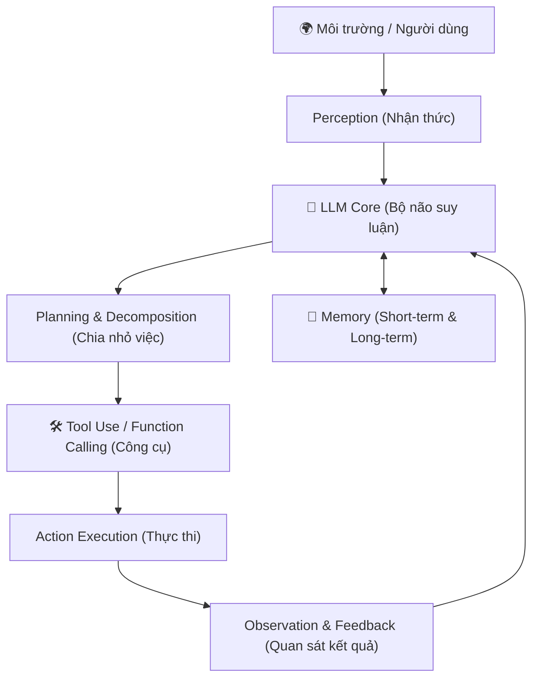

# 📝 Ghi chú Bài học: AI Agents 101 (AMD AI Academy)

> **Khoá học:** AMD AI Academy - AI Agents 101  
> **Thời lượng video:** ~19 phút 28 giây  
> **Tệp video bài giảng:** `../01_Recordings/01_AI_Agents_101_Full.mov`

---

## 1. AI Agent là gì? (Định nghĩa căn bản)

AI Agent là một hệ thống phần mềm thông minh có khả năng:
1. **Perceive (Nhận thức):** Tiếp nhận thông tin từ môi trường (User prompt, API data, hình ảnh, văn bản, database...).
2. **Reason & Plan (Suy luận & Lập kế hoạch):** Dùng Mô hình ngôn ngữ lớn (LLM / SLM) làm "bộ não" để phân tích, chia nhỏ mục tiêu thành các bước hành động.
3. **Act (Hành động):** Sử dụng các công cụ ngoại vi (Tools / Functions calling / Web search / Code execution) để tương tác và tạo ra kết quả.
4. **Learn & Adapt (Ghi nhớ & Thích nghi):** Duy trì bộ nhớ ngắn hạn (working context) và bộ nhớ dài hạn (vector memory, database) để phản hồi chính xác qua thời gian.

---

## 2. So sánh: LLM thông thường vs. AI Agent

| Đặc điểm | Traditional LLM (ChatGPT / Claude) | AI Agent |
| :--- | :--- | :--- |
| **Bản chất** | Chỉ sinh văn bản (Passive text generator) | Chủ động giải quyết bài toán (Autonomous actor) |
| **Tương tác môi trường** | Bị cô lập trong cửa sổ chat | Gọi API, chạy code, đọc ghi file, truy vấn DB |
| **Vòng lặp thực thi** | Một lần (Request -> Response) | Vòng lặp nhiều bước (Thought -> Action -> Observation) |
| **Khả năng tự sửa sai** | Kém hoặc cần người dùng nhắc | Tự kiểm tra kết quả (Self-reflection / Self-correction) |

---

## 3. Các thành phần cấu tạo kiến trúc AI Agent

### Chi tiết các khối:
- **Planning (Lập kế hoạch):**
  - **Subgoal decomposition:** Chia nhiệm vụ lớn phức tạp thành các task con.
  - **Reflection & Refinement:** Tự đánh giá hành động trước đó đã đúng chưa để thử lại phương án khác.
- **Memory (Bộ nhớ):**
  - *Short-term:* Context window của LLM.
  - *Long-term:* Vector database (Chroma, Qdrant, Milvus) hoặc SQL/Key-Value stores.
- **Tools (Công cụ):**
  - Web browsing, Calculator, Python REPL, Shell execution, External REST APIs.

---

## 4. Các mô hình thiết kế Agent (Agentic Design Patterns)

1. **ReAct (Reason + Act):** Vòng lặp chuẩn: Suy nghĩ (*Thought*) -> Hành động (*Action*) -> Quan sát kết quả (*Observation*).
2. **Reflection:** Agent tạo ra bản nháp -> Agent tự đánh giá và chỉ ra điểm cần sửa -> Cải tiến bản nháp.
3. **Multi-Agent Systems:** Phân công nhiều Agent chuyên trách (ví dụ: Coder Agent, Reviewer Agent, Tester Agent, Architect Agent) tương tác với nhau để hoàn thành dự án lớn.

---

## 5. Vai trò của AMD trong kỷ nguyên AI Agents
- **AMD ROCm™:** Nền tảng phần mềm mở hỗ trợ tăng tốc suy luận và huấn luyện AI trên GPU AMD (Instinct MI300, Radeon RX 7000 series).
- **Ryzen™ AI:** Tích hợp NPU (Neural Processing Unit) chuyên dụng trên chip laptop/PC, cho phép chạy các mô hình Agentic SLM (nhỏ gọn, bảo mật, offline) ngay trên máy người dùng mà không tốn pin.
