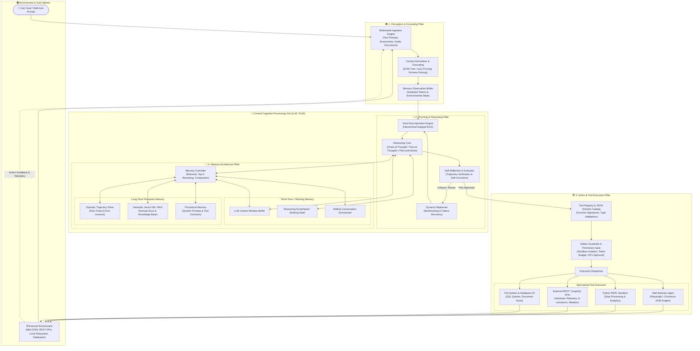

# Bài Giảng 1: Nền Tảng Tác Tử Trí Tuệ Nhân Tạo & Kiến Trúc Nhận Thức Tổng Quan
## Module 01: Foundations of Autonomous AI Agents & Cognitive Architecture Overview

> **Khóa học:** AMD AI Academy — AI Agents 101: Building AI Agents with MCP & Open-Source Inference  
> **Chuyên đề:** Kiến trúc hệ thống tác tử, Vòng lặp điều khiển học (Cybernetic Loop) và 4 Trụ cột nhận thức  
> **Đối tượng:** Kỹ sư AI, Kiến trúc sư hệ thống, Lập trình viên Backend & Hardware Systems  

---

## 📑 Mục Lục Chi Tiết

1. [Chương 1: Sự Chuyển Dịch Hệ Cận Đại — Từ Chatbot Thụ Động Đến Tác Tử Tự Chủ](#chương-1-sự-chuyển-dịch-hệ-cận-đại--từ-chatbot-thụ-động-đến-tác-tử-tự-chủ)
   - 1.1 Bản chất và giới hạn cốt lõi của Traditional LLMs
   - 1.2 Định nghĩa hình thức về Autonomous AI Agent
   - 1.3 Mô hình toán học của Vòng lặp Điều khiển học (Cybernetic Agency Loop)
2. [Chương 2: Tình Huống Thực Tiễn — Tác Tử Duyệt Web "Cooking Chili"](#chương-2-tình-huống-thực-tiễn--tác-tử-duyệt-web-cooking-chili)
   - 2.1 Bối cảnh bài giảng AMD AI Academy & WebUI Browser Use
   - 2.2 Đối chiếu hành vi: Chatbot tĩnh đối đầu Tác tử tương tác
   - 2.3 Phân rã tiến trình thực thi 6 giai đoạn
   - 2.4 Xử lý bất định và tự phục hồi khi gặp sự cố ngoại vi
3. [Chương 3: Tổng Quan 4 Trụ Cột Nhận Thức Cốt Lõi (The 4 Cognitive Pillars)](#chương-3-tổng-quan-4-trụ-cột-nhận-thức-cốt-lõi-the-4-cognitive-pillars)
   - 3.1 Trụ cột 1: Nhận thức & Neo ngữ cảnh (Perception & Environmental Grounding)
   - 3.2 Trụ cột 2: Lập kế hoạch & Suy luận (Planning & Reasoning)
   - 3.3 Trụ cột 3: Hành động & Gọi công cụ (Tool Use & Action Execution)
   - 3.4 Trụ cột 4: Kiến trúc Bộ nhớ (Memory Architecture)
4. [Chương 4: Chu Kỳ Thực Thi Cơ Bản & Cấu Trúc Bảng Nháp (Scratchpad Anatomy)](#chương-4-chu-kỳ-thực-thi-cơ-bản--cấu-trúc-bảng-nháp-scratchpad-anatomy)
   - 4.1 Chu kỳ Nhận thức - Hành động cơ sở (Perception-Action Cycle)
   - 4.2 Giải phẫu cấu trúc Prompt Bảng nháp ReAct chuẩn mực
5. [Chương 5: Sơ Đồ Kiến Trúc Nhận Thức 4 Trụ Cột (Diagram 1)](#chương-5-sơ-đồ-kiến-trúc-nhận-thức-4-trụ-cột-diagram-1)
6. [Chương 6: Liên Hệ Thực Hành Code Labs & Tối Ưu Hóa AMD](#chương-6-liên-hệ-thực-hành-code-labs--tối-ưu-hóa-amd)
7. [Tổng Kết Bài Học & Câu Hỏi Củng Cố](#tổng-kết-bài-học--câu-hỏi-củng-cố)

---

## Chương 1: Sự Chuyển Dịch Hệ Cận Đại — Từ Chatbot Thụ Động Đến Tác Tử Tự Chủ

### 1.1 Bản chất và giới hạn cốt lõi của Traditional LLMs

Trong giai đoạn đầu của cuộc cách mạng Generative AI (2022–2023), phần lớn các ứng dụng xoay quanh mô hình ngôn ngữ lớn truyền thống (Traditional LLMs) như GPT-3.5, Llama 2 nguyên bản hay các chatbot giao dịch thông thường. Về mặt bản chất toán học và tính toán, một mô hình ngôn ngữ lớn hoạt động như một hàm xấp xỉ xác suất tự hồi quy (Autoregressive Probabilistic Predictor):

$$\mathcal{P}(w_1, w_2, \dots, w_T) = \prod_{t=1}^T \mathcal{P}(w_t \mid w_1, w_2, \dots, w_{t-1}; \Theta)$$

Trong đó $\Theta$ biểu diễn tập hợp các trọng số tĩnh (weights) đã được đóng băng sau quá trình Pre-training và Fine-tuning.

Mặc dù có khả năng tạo sinh văn bản trôi chảy, tổng hợp tri thức phong phú và vượt qua nhiều bài thi tiêu chuẩn, **Traditional LLM thuần túy bộc lộ 4 điểm nghẽn kiến trúc chí tử**:

```
+--------------------------------------------------------------------------+
|                  GIỚI HẠN CỐT LÕI CỦA TRADITIONAL LLMs                  |
+--------------------------------------------------------------------------+
| 1. Tính Thụ Động & Không Tự Chủ (Stateless & One-Shot Execution)         |
|    - Chỉ phản hồi thụ động khi người dùng kích hoạt prompt.             |
|    - Không có vòng lặp tự đánh giá; xuất chuỗi token một lần là kết thúc. |
+--------------------------------------------------------------------------+
| 2. Sự Cô Lập Nhận Thức (Epistemic Isolation / Knowledge Cutoff)          |
|    - Hoàn toàn mù trước thế giới thực sau thời điểm chốt dữ liệu huấn    |
|      luyện (knowledge cutoff).                                           |
|    - Không thể tự tra cứu tài liệu mới, kiểm tra API hay đọc cơ sở dữ liệu.|
+--------------------------------------------------------------------------+
| 3. Tính Dễ Ảo Giác Dưới Sự Bất Định (Hallucination Vulnerability)        |
|    - Khi thiếu thông tin, cơ chế giải mã (decoding) buộc phải lấy mẫu    |
|      token có xác suất cao tiếp theo, dẫn đến sinh thông tin giả mạo.    |
|    - Không có cơ chế kiểm chứng chéo (grounding / verification).         |
+--------------------------------------------------------------------------+
| 4. Bất Lực Về Mặt Hành Động (Zero Effector Capability)                  |
|    - Không thể thay đổi trạng thái môi trường: không thể tạo tệp, không   |
|      thể gửi email, không thể giao dịch tài chính hay sửa đổi code.      |
+--------------------------------------------------------------------------+
```

### 1.2 Định nghĩa hình thức về Autonomous AI Agent

Một **Tác tử Trí tuệ Nhân tạo (Autonomous AI Agent)** đại diện cho bước nhảy vọt từ việc *tạo sinh ngôn ngữ thụ động* sang *hành động mục tiêu chủ động trong môi trường số*.

> **Định nghĩa chuẩn mực (Formal Definition):**  
> Một AI Agent là một thực thể tính toán hướng mục tiêu (goal-directed computational entity), sử dụng một mô hình ngôn ngữ lớn hoặc mô hình nền tảng (LLM/SLM) làm **Bộ Xử Lý Nhận Thức Trung Tâm (Central Cognitive Processing Unit - "Bộ Não")**, được tích hợp với:
> 1. **Bộ cảm biến nhận thức (Perception Engine):** Để số hóa và tiếp nhận trạng thái từ môi trường;
> 2. **Cơ chế suy luận & lập kế hoạch (Reasoning & Planning Core):** Để phân rã mục tiêu phức tạp thành chuỗi hành động khả thi;
> 3. **Hệ thống hiệu ứng hành động (Effector / Tool Registry):** Để gọi các công cụ ngoại vi làm thay đổi trạng thái thế giới;
> 4. **Hệ thống lưu trữ phân tầng (Hierarchical Memory Architecture):** Để duy trì ngữ cảnh làm việc và tích lũy kinh nghiệm qua thời gian.

### 1.3 Mô hình toán học của Vòng lặp Điều khiển học (Cybernetic Agency Loop)

AI Agent vận hành theo nguyên lý của lý thuyết điều khiển học (Cybernetics) và Quá trình Ra Quyết định Markov Hữu hạn một phần (Partially Observable Markov Decision Process - POMDP), được biểu diễn bằng bộ 6 tham số:

$$\mathcal{M}_{Agent} = \langle \mathcal{S}, \mathcal{A}, \mathcal{T}, \mathcal{O}, \Omega, \mathcal{R} \rangle$$

- $\mathcal{S}$: Không gian trạng thái của môi trường thực (Environment State Space).
- $\mathcal{A}$: Không gian hành động khả thi của công cụ (Action Space: API calls, Bash commands, Browser interactions).
- $\mathcal{T}(s_{t+1} \mid s_t, a_t)$: Hàm chuyển dịch trạng thái môi trường dưới tác động của hành động $a_t$.
- $\Omega$: Không gian các quan sát cảm nhận được (Observation Space).
- $\mathcal{O}(o_t \mid s_t, a_{t-1})$: Hàm quan sát phản hồi từ công cụ (stdout, HTTP response payload, DOM tree diff).
- $\mathcal{R}(s_t, a_t)$: Hàm phần thưởng nội tại hoặc tiêu chí hoàn thành mục tiêu (Success / Goal Convergence Criteria).

Chu trình điều khiển học của Tác tử diễn ra qua các bước lặp kín:

$$\begin{aligned}
\text{Bước 1 (Nhận thức):} \quad & o_t \sim \mathcal{O}(s_t) \\
\text{Bước 2 (Cập nhật Bộ nhớ):} \quad & m_t = \mathcal{U}_{mem}(m_{t-1}, o_t, a_{t-1}) \\
\text{Bước 3 (Suy luận & Kế hoạch):} \quad & c_t \sim \pi_{LLM}(\cdot \mid \text{Goal}, m_t) \quad \text{(Internal Thought / Chain-of-Thought)} \\
\text{Bước 4 (Phát sinh Hành động):} \quad & a_t = \text{ExtractAction}(c_t) \in \mathcal{A} \cup \{\text{TERMINATE}\} \\
\text{Bước 5 (Tác động Môi trường):} \quad & s_{t+1} \sim \mathcal{T}(s_t, a_t)
\end{aligned}$$

Vòng lặp tiếp tục cho đến khi $a_t = \text{TERMINATE}$, tại đó tác tử tổng hợp câu trả lời cuối cùng hoặc bàn giao kết quả cho người dùng.

---

## Chương 2: Tình Huống Thực Tiễn — Tác Tử Duyệt Web "Cooking Chili"

### 2.1 Bối cảnh bài giảng AMD AI Academy & WebUI Browser Use

Trong bài giảng chính thức *AI Agents 101* do kỹ sư Mahdi Ghodsi (AMD) trình bày, minh họa mở đầu ấn tượng nhất chính là dự án mã nguồn mở **WebUI kết hợp với thư viện Browser-Use**. 

Tình huống đặt ra phản ánh chính xác ranh giới giữa một mô hình hỏi đáp thông thường và một tác tử tự chủ:

> **Câu lệnh của Người Dùng (User Prompt):**  
> *"I want to cook chili for dinner tonight. Can you find the ingredients and put them in my shopping cart?"*  
> *(Tôi muốn nấu món thịt hầm ớt cho bữa tối nay. Bạn có thể tìm các nguyên liệu và thêm chúng vào giỏ hàng trực tuyến của tôi không?)*

### 2.2 Đối chiếu hành vi: Chatbot tĩnh đối đầu Tác tử tương tác

Bảng so sánh sau đây thể hiện sự khác biệt sống còn giữa hai mô hình kiến trúc:

| Tiêu chí | Traditional Chatbot (LLM tĩnh) | Autonomous Browser Agent (WebUI / Browser-Use) |
| :--- | :--- | :--- |
| **Bản chất phản hồi** | Tạo sinh một đoạn văn bản chứa công thức nấu ăn tổng quát. | Tự khởi chạy một phiên trình duyệt Chromium không đầu (Headless Browser) qua Playwright. |
| **Xử lý nguyên liệu** | Đưa ra danh sách chữ viết (bò băm, đậu đỏ, thì là, sốt cà chua...). | Phân rã nguyên liệu thành các thực thể SKU cụ thể theo kho hàng hiện hữu của siêu thị. |
| **Tương tác môi trường** | Không có. Yêu cầu người dùng tự mở app siêu thị, tự tìm và tự bấm thêm vào giỏ. | Điều hướng URL đến Instacart/Amazon Fresh, gõ vào ô tìm kiếm, trích xuất danh sách kết quả, so khớp đơn giá. |
| **Xử lý sự kiện động** | Bất lực. | Đóng pop-up khuyến mãi, chọn số lượng, bấm nút `Add to Cart`, xử lý khi hết hàng. |
| **Kết quả bàn giao** | Đoạn văn bản thụ động trong khung chat. | Giỏ hàng hoàn chỉnh đã sẵn sàng thanh toán kèm bản tóm tắt chi phí minh bạch. |

### 2.3 Phân rã tiến trình thực thi 6 giai đoạn

Để hoàn thành nhiệm vụ trên, tác tử Browser-Use thực hiện chuỗi phối hợp chặt chẽ giữa suy luận và hành động:

```
[User Prompt: "Cook chili tonight -> Find ingredients -> Add to Cart"]
                               |
                               v
+-------------------------------------------------------------------------------+
| Giai đoạn 1: Khởi Tạo Nhận Thức & Lập Kế Hoạch Sơ Bộ (Goal Decomposition)      |
| - LLM kích hoạt hệ thống suy luận: Nhận diện món ăn "Chili con carne".       |
| - Phân rã thành 5 nhóm nguyên liệu thiết yếu:                                 |
|   1. 500g Ground Beef (Thịt bò xay 85/15)                                    |
|   2. 1 can Red Kidney Beans (Đậu thận đỏ 400g)                               |
|   3. 1 can Diced Tomatoes (Cà chua thái hạt lựu 400g)                        |
|   4. 1 Onion & Garlic head (Hành tây và tỏi tươi)                            |
|   5. Chili powder & Cumin (Bột ớt paprika và hạt thì là xay)                 |
+-------------------------------------------------------------------------------+
                               |
                               v
+-------------------------------------------------------------------------------+
| Giai đoạn 2: Điều Hướng Môi Trường & Thu Nhận Trạng Thái (Navigation & State)  |
| - Hành động: Gọi công cụ Playwright `browser_navigate(url="https://store.com")`|
| - Quan sát: Trình duyệt tải trang chủ, xuất hiện modal: "Chọn địa chỉ giao". |
+-------------------------------------------------------------------------------+
                               |
                               v
+-------------------------------------------------------------------------------+
| Giai đoạn 3: Phân Tích Cây Trợ Năng (Accessibility Tree / a11y DOM Parsing)   |
| - Nhận thức: Bộ lọc DOM lọc bỏ hàng chục ngàn thẻ HTML rác, trích xuất nút:  |
|   `button id="close-modal-btn" role="button" aria-label="Dismiss modal"`      |
| - Hành động: `browser_click(selector="#close-modal-btn")`.                    |
+-------------------------------------------------------------------------------+
                               |
                               v
+-------------------------------------------------------------------------------+
| Giai đoạn 4: Vòng Lặp Lần Lượt Từng Nguyên Liệu (Iterative Shopping Loop)     |
| - Với mỗi nguyên liệu trong danh sách:                                        |
|   + Hành động: `browser_type(selector="input[type='search']", text="Ground beef")`
|   + Quan sát: Trả về danh sách 10 sản phẩm kèm giá tiền và tồn kho.           |
|   + Suy luận: Chọn sản phẩm có đánh giá cao nhất và phù hợp khối lượng 500g.  |
|   + Hành động: `browser_click(selector="button[data-sku='beef-85-15']")`.     |
+-------------------------------------------------------------------------------+
                               |
                               v
+-------------------------------------------------------------------------------+
| Giai đoạn 5: Tự Sửa Sai Khi Gặp Sự Cố Ngoại Vi (Dynamic Self-Correction)       |
| - Sự cố: Sản phẩm "Red Kidney Beans hiệu A" hết hàng (`Out of Stock`).        |
| - Phản tỉnh (Reflection): Nhận diện lỗi từ DOM banner.                        |
| - Điều chỉnh kế hoạch: Đổi sang thương hiệu dự phòng "Kidney Beans hiệu B".    |
| - Hành động sửa đổi: Chọn SKU dự phòng và thêm vào giỏ thành công.            |
+-------------------------------------------------------------------------------+
                               |
                               v
+-------------------------------------------------------------------------------+
| Giai đoạn 6: Hoàn Tất Mục Tiêu & Tổng Hợp Kết Quả (Terminal Verification)     |
| - Kiểm tra giỏ hàng: Đủ 5/5 món, tổng giá trị: $18.45.                        |
| - Bàn giao người dùng: "Tôi đã thêm đầy đủ nguyên liệu vào giỏ hàng của bạn.  |
|   Xin vui lòng xác nhận thanh toán."                                          |
+-------------------------------------------------------------------------------+
```

### 2.4 Xử lý bất định và tự phục hồi khi gặp sự cố ngoại vi

Điểm phân định một Agent thực thụ nằm ở **khả năng kháng gãy đổ (Fault Tolerance & Graceful Degradation)**:
1. **Network Latency / Slow DOM Load:** Thay vì dừng chương trình khi một phần tử chưa xuất hiện, Agent trang bị cơ chế thăm dò trạng thái (State Polling with Exponential Backoff) kết hợp chụp ảnh màn hình (Screenshot Grounding) để đánh giá trạng thái thị giác.
2. **Dynamic Anti-Scraping / Bot Detection Modals:** Tác tử phát hiện các lớp phủ (overlays) chặn tương tác, áp dụng chiến lược thoát (escape routing) hoặc yêu cầu hỗ trợ từ con người (Human-in-the-Loop - HITL) nếu gặp rào cản xác thực CAPTCHA.

---

## Chương 3: Tổng Quan 4 Trụ Cột Nhận Thức Cốt Lõi (The 4 Cognitive Pillars)

Một kiến trúc tác tử mạnh mẽ được kiến thiết trên 4 trụ cột nhận thức liên kết hữu cơ:

```
                      +-----------------------------+
                      |         USER GOAL           |
                      +--------------+--------------+
                                     |
                                     v
+-----------------------------------------------------------------------+
|                       1. PERCEPTION PILLAR                            |
| Multimodal Ingest (Text, Vision, Audio) -> DOM/a11y Grounding -> State|
+------------------------------------+----------------------------------+
                                     |
                                     v
+------------------------------------+----------------------------------+
|                  2. PLANNING & REASONING PILLAR                       |
| Goal Decomposition -> Chain-of-Thought -> Self-Reflection -> Replanning|
+------------------+---------------------------------+------------------+
                   |                                 |
                   v                                 v
+----------------------------------+  +---------------------------------+
|      3. ACTION & TOOLS PILLAR    |  |       4. MEMORY PILLAR          |
| Tool Catalog (JSON Schema / MCP) |  | Working Buffer / Scratchpad     |
| Sandboxed Execution (Docker/REPL)|  | Sliding Summarizer              |
| Trajectory Observation Trapping  |  | Episodic & Semantic Vector RAG  |
+------------------+---------------+  +-----------------+---------------+
                   |                                   |
                   +-----------------+-----------------+
                                     |
                                     v
                      +-----------------------------+
                      |     EXTERNAL ENVIRONMENT    |
                      | (Web, APIs, Shell, DBs)     |
                      +-----------------------------+
```

### 3.1 Trụ cột 1: Nhận thức & Neo ngữ cảnh (Perception & Environmental Grounding)
Perception là khả năng của Agent trong việc chuyển đổi các tín hiệu thô, phi cấu trúc từ môi trường thành các biểu diễn ngữ nghĩa có cấu trúc mà LLM có thể xử lý:
- **Đa phương thức (Multimodal Ingestion):** Tiếp nhận đồng thời ảnh chụp giao diện người dùng (UI screenshots), tài liệu PDF, luồng âm thanh hoặc luồng dữ liệu JSON từ thiết bị đo (telemetry).
- **Neo ngữ cảnh (Grounding):** Ánh xạ từ các khái niệm trừu tượng ("Nút tìm kiếm") thành các tọa độ vật lý `(x, y)` hoặc định danh hệ thống (CSS Selectors, XPath, Process PID).
- **Cắt tỉa dữ liệu (Context Normalization):** Giảm thiểu độ dài token đầu vào thông qua các kỹ thuật như trích xuất cây a11y (Accessibility Tree), loại bỏ các đoạn mã HTML/CSS không tương tác để bảo toàn ngân sách Context Window.

### 3.2 Trụ cột 2: Lập kế hoạch & Suy luận (Planning & Reasoning)
Đây là "hệ điều hành trí tuệ" nằm bên trong LLM, quyết định chiến lược giải quyết vấn đề:
- **Phân rã mục tiêu (Goal Decomposition):** Chuyển một yêu cầu phức tạp nhiều ngày thành một đồ thị có hướng không chu trình (Directed Acyclic Graph - DAG) gồm các nhiệm vụ con độc lập.
- **Phương pháp luận suy luận:**
  - *Chain-of-Thought (CoT):* Suy nghĩ từng bước tuyến tính.
  - *Tree-of-Thoughts (ToT):* Mở rộng không gian tìm kiếm, sinh nhiều phương án giả thuyết song song và đánh giá heuristic để quay lui (backtrack).
  - *Plan-and-Solve:* Lập khung kế hoạch tổng thể trước, sau đó tuần tự giải quyết từng bước kèm kiểm định.
- **Phản tỉnh & Tự sửa sai (Self-Reflection):** Đánh giá kết quả của từng hành động, so sánh với kỳ vọng ban đầu và chủ động tái cấu trúc kế hoạch khi gặp ngoại lệ.

### 3.3 Trụ cột 3: Hành động & Gọi công cụ (Tool Use & Action Execution)
Trụ cột biến suy nghĩ thành hiện thực vật lý/số học:
- **Function Calling & JSON Schema:** Sử dụng định dạng tiêu chuẩn (OpenAPI / JSON Schema) để ép kiểu chặt chẽ (Strict Mode Constrained Decoding), đảm bảo LLM sinh tham số đúng định dạng toán học và kiểu dữ liệu.
- **Tiêu chuẩn mở MCP (Model Context Protocol):** Kiến trúc Client-Server thống nhất cho phép Agent kết nối linh hoạt tới hàng ngàn máy chủ công cụ bên ngoài (Filesystem, GitHub, PostgreSQL, Brave Search, Airbnb...).
- **Môi trường thực thi an toàn (Sandboxing):** Cô lập các hành động tiềm ẩn rủi ro (thực thi mã Python, gọi lệnh Shell) trong các container Docker hoặc microVM không đặc quyền, kết hợp cổng phê duyệt của con người (Human-in-the-Loop) cho các tác vụ nhạy cảm.

### 3.4 Trụ cột 4: Kiến trúc Bộ nhớ (Memory Architecture)
Bộ nhớ cung cấp tính liên tục về mặt thời gian và khả năng học hỏi cho Agent:
- **Bộ nhớ làm việc / Ngắn hạn (Working Memory):** Nằm trực tiếp trong Context Window của LLM, bao gồm System Prompt, bảng nháp tư duy hiện tại và bộ đệm $K$ lượt trao đổi gần nhất.
- **Bộ nhớ từng hồi (Episodic Memory):** Lưu trữ toàn bộ các vệt thực thi trong quá khứ (trajectories). Giúp Agent nhớ lại bài học: *"Lần trước khi gọi API thời tiết với tham số X thì gặp lỗi 400, cần phải đổi sang định dạng Y"*.
- **Bộ nhớ ngữ nghĩa (Semantic Memory / RAG):** Hệ thống cơ sở dữ liệu véc-tơ (Vector DB) lưu trữ sách hướng dẫn, tài liệu kỹ thuật, kiến thức chuyên ngành thông qua kỹ thuật tìm kiếm tương đồng (Cosine Similarity).
- **Bộ nhớ thủ tục (Procedural Memory):** Các quy tắc hành vi cố định, quy chuẩn an toàn và hướng dẫn định dạng được mã hóa cứng trong System Prompt.

---

## Chương 4: Chu Kỳ Thực Thi Cơ Bản & Cấu Trúc Bảng Nháp (Scratchpad Anatomy)

### 4.1 Chu kỳ Nhận thức - Hành động cơ sở (Perception-Action Cycle)

Một chu kỳ cơ bản của Agent tuân thủ nghiêm ngặt mô hình 4 bước:

$$\text{Perceive } (o_t) \longrightarrow \text{Think } (c_t) \longrightarrow \text{Act } (a_t) \longrightarrow \text{Observe } (o_{t+1})$$

1. **Perceive:** Đọc trạng thái mới nhất từ môi trường hoặc người dùng.
2. **Think:** Tự thoại nội tâm (Inner Monologue), phân tích dữ kiện, đánh giá tiến độ và quyết định bước tiếp theo.
3. **Act:** Phát sinh lệnh gọi công cụ có cấu trúc (ví dụ: `search_database(query="...")`).
4. **Observe:** Tiếp nhận chuỗi phản hồi thực tế từ hệ số (thành công, dữ liệu trả về, hoặc mã lỗi).

### 4.2 Giải phẫu cấu trúc Prompt Bảng nháp ReAct chuẩn mực

Để điều khiển LLM thực thi chu kỳ này một cách nhất quán mà không bị chệch hướng, kỹ thuật **Reasoning Scratchpad** được áp dụng. Dưới đây là giải phẫu cấu trúc văn bản thực tế trong Context Window của Agent:

```text
================================== SYSTEM PROMPT ==================================
You are an autonomous AI Agent equipped with specialized external tools.
Solve the user's objective step-by-step using the following strict format:

Thought: Consider what step is needed next to make progress toward the goal.
Action: tool_name
Action Input: {"param_1": "value_1", "param_2": 123}
Observation: The output from the environment will appear here.

You may repeat Thought -> Action -> Action Input -> Observation multiple times.
When you have collected all required information to fulfill the objective, respond with:
Thought: I have sufficient information to finalize the response.
Final Answer: [Your exhaustive, validated response to the user]

AVAILABLE TOOLS:
1. web_search(query: str) -> str: Tra cứu thông tin trên Internet.
2. check_hardware_specs(device: str) -> dict: Tra cứu thông số phần cứng AMD.
3. run_python_code(script: str) -> str: Thực thi mã Python trong môi trường sandbox.
===================================================================================

================================== USER PROMPT ====================================
So sánh dung lượng bộ nhớ VRAM và băng thông giữa AMD Radeon RX 7900 XTX và 
AMD Instinct MI300X, sau đó tính tỷ lệ chênh lệch băng thông.
===================================================================================

============================ AGENT WORKING SCRATCHPAD =============================
Thought: Tôi cần tra cứu thông số kỹ thuật của AMD Radeon RX 7900 XTX trước, 
bao gồm dung lượng VRAM và băng thông bộ nhớ.
Action: check_hardware_specs
Action Input: {"device": "Radeon RX 7900 XTX"}
Observation: {"vram_gb": 24, "memory_type": "GDDR6", "bandwidth_gbps": 960, "bus_width_bit": 384}

Thought: Đã có thông số của RX 7900 XTX (24GB VRAM, 960 GB/s). Bây giờ tôi cần tra cứu 
thông số của bộ tăng tốc trung tâm dữ liệu AMD Instinct MI300X.
Action: check_hardware_specs
Action Input: {"device": "Instinct MI300X"}
Observation: {"vram_gb": 192, "memory_type": "HBM3", "bandwidth_gbps": 5300, "architecture": "CDNA 3"}

Thought: Đã có đủ thông số:
- RX 7900 XTX: 960 GB/s
- Instinct MI300X: 5300 GB/s
Bây giờ tôi cần tính toán chính xác tỷ lệ chênh lệch băng thông (5300 / 960) 
bằng công cụ tính toán Python để tránh sai sót số học.
Action: run_python_code
Action Input: {"script": "ratio = 5300 / 960; print(f'{ratio:.2f}')"}
Observation: 5.52

Thought: Tôi đã có đầy đủ các thông số thực tế và kết quả tính toán chính xác. 
Tôi đã sẵn sàng đưa ra câu trả lời cuối cùng.
Final Answer: 
Dưới đây là so sánh chi tiết giữa AMD Radeon RX 7900 XTX và AMD Instinct MI300X:
1. Dung lượng bộ nhớ (VRAM):
   - Radeon RX 7900 XTX: 24 GB GDDR6 (hướng tới máy trạm cao cấp).
   - Instinct MI300X: 192 GB HBM3 (gấp 8.0 lần, chuyên dụng cho trung tâm dữ liệu).
2. Băng thông bộ nhớ (Memory Bandwidth):
   - Radeon RX 7900 XTX: 960 GB/s.
   - Instinct MI300X: 5,300 GB/s (5.3 TB/s).
3. Tỷ lệ chênh lệch:
   - Băng thông của Instinct MI300X cao hơn xấp xỉ 5.52 lần so với RX 7900 XTX.
===================================================================================
```

---

## Chương 5: Sơ Đồ Kiến Trúc Nhận Thức 4 Trụ Cột (Diagram 1)

Dưới đây là sơ đồ kiến trúc nhận thức toàn diện mô tả sự tương tác khép kín giữa người dùng, môi trường thực, và 4 trụ cột kiến trúc bên trong AI Agent:



---

## Chương 6: Liên Hệ Thực Hành Code Labs & Tối Ưu Hóa AMD

Kiến trúc lý thuyết trong bài giảng này được ánh xạ trực tiếp sang các bài thực hành code Python chuẩn mực trong thư mục `03_Materials_Code/`:

1. **Lab 1 (`03_Materials_Code/01_pure_react_agent.py`):**
   - Triển khai vòng lặp thuần `Thought -> Action -> Observation` không sử dụng thư viện phụ thuộc bên ngoài.
   - Minh họa bảng nháp tính toán và so sánh hiệu năng giữa vi xử lý AI di động **AMD Ryzen™ AI 9 HX 370 (50 NPU TOPS)** và Apple M3.
2. **Lab 2 (`03_Materials_Code/02_tool_calling_agent.py`):**
   - Triển khai cơ chế kiểm tra tham số công cụ bằng Pydantic và JSON Schema chuẩn mực.
   - Mô phỏng cơ chế tự phục hồi (Self-Healing) khi công cụ phát sinh lỗi `ValidationError` hoặc ngoại lệ hệ thống.
3. **Lab 3 (`03_Materials_Code/03_memory_state_agent.py`):**
   - Triển khai hệ thống phân tầng bộ nhớ 4 cấp: Working Buffer, Rolling Summarizer, Key-Value Entity Store và Vector RAG Episodic Store.
4. **Lab 4 (`03_Materials_Code/04_framework_agent_langgraph.py`):**
   - Hiện thực hóa kiến trúc Đa tác tử cộng tác (Multi-Agent Swarm) với LangGraph, phân định vai trò giữa Supervisor Agent, Hardware Specialist và Benchmark Analyst chạy tối ưu hóa trên nền tảng AMD ROCm™.

---

## Tổng Kết Bài Học & Câu Hỏi Củng Cố

### 📌 Các Điểm Cốt Lõi Cần Ghi Nhớ
1. **Sự khác biệt bản chất:** Traditional LLMs là mô hình tạo sinh xác suất một chiều (feed-forward static predictors); trong khi AI Agents là hệ thống điều khiển học khép kín có trạng thái (stateful cybernetic systems).
2. **Nguyên lý Điều khiển học:** Agent vận hành thông qua chu kỳ tương tác lặp: Nhận thức (Perceive) $\rightarrow$ Lập kế hoạch (Plan) $\rightarrow$ Hành động (Act) $\rightarrow$ Quan sát (Observe) $\rightarrow$ Phản tỉnh (Reflect).
3. **4 Trụ Cột Nhận Thức:** Sự hoàn thiện của một Agent phụ thuộc vào sự phối hợp hài hòa giữa Perception (thu nhận), Planning (suy luận), Action/Tools (hiệu ứng thực thi) và Memory (duy trì trạng thái & kinh nghiệm).
4. **Kiến Trúc Scratchpad:** Kỹ thuật tách bạch rành mạch giữa tư duy nội tâm (`Thought`) và chỉ thị hành động máy (`Action`) là chìa khóa chống hallucination và đảm bảo khả năng diễn giải (interpretability).

### ❓ Câu Hỏi Kiểm Tra Nhanh (Self-Assessment Check)
1. *Tại sao việc chỉ cung cấp thêm dữ liệu huấn luyện (Pre-training) không thể biến một Traditional LLM thành một Autonomous Agent?*  
   *(Gợi ý: Xem xét sự thiếu vắng của vòng lặp thực thi công cụ và khả năng tương tác với trạng thái môi trường).*
2. *Trong tình huống duyệt web nấu món chili, nếu trang thương mại điện tử xuất hiện CAPTCHA dạng hình ảnh phức tạp mà vision model không vượt qua được, tác tử nên áp dụng cơ chế nào theo chuẩn thiết kế?*  
   *(Gợi ý: Cổng can thiệp của con người — Human-in-the-Loop).*
3. *Về mặt biểu diễn toán học, yếu tố nào trong bộ tham số $\langle \mathcal{S}, \mathcal{A}, \mathcal{T}, \mathcal{O}, \Omega, \mathcal{R} \rangle$ đóng vai trò quyết định thời điểm tác tử dừng vòng lặp?*  
   *(Gợi ý: Tiêu chí hội tụ mục tiêu $\mathcal{R}$ hoặc hành động phát sinh $a_t = \text{TERMINATE}$).*
