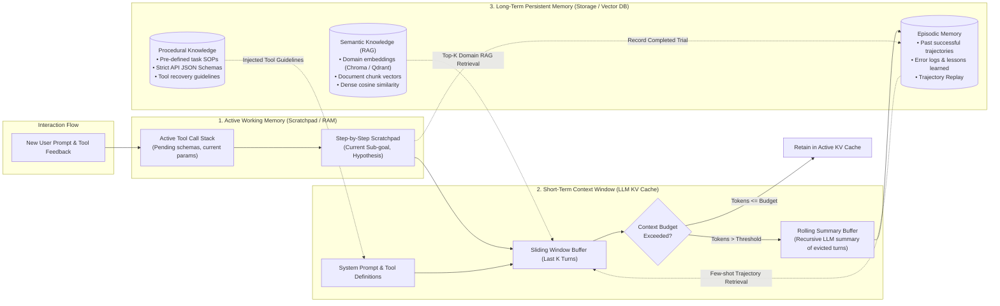
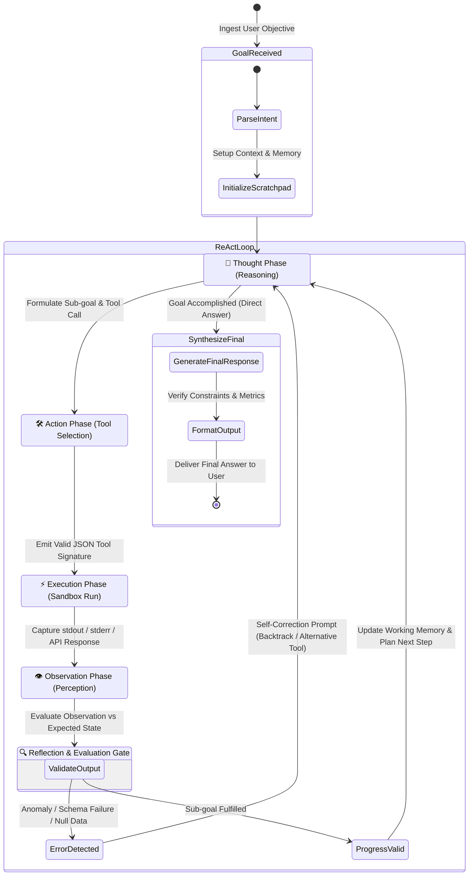

# Bài Giảng 2: 4 Trụ Cột Cốt Lõi & Các Mẫu Hình Thiết Kế Tác Tử Tiêu Biểu
## Module 02: Core Cognitive Pillars & Archetypal Agentic Design Patterns

> **Khóa học:** AMD AI Academy — AI Agents 101: Building AI Agents with MCP & Open-Source Inference  
> **Chuyên đề:** Đi sâu vào 4 Trụ cột Nhận thức, Mẫu hình ReAct, Cơ chế Tự phản tỉnh (Reflexion) và Cộng tác Đa tác tử (Multi-Agent Swarm)  
> **Đối tượng:** Kỹ sư AI, Kỹ sư phần mềm, Kiến trúc sư giải pháp tự động hóa  

---

## 📑 Mục Lục Chi Tiết

1. [Phần 1: Đi Sâu Vào 4 Trụ Cột Nhận Thức (Deep Dive into the 4 Pillars)](#phần-1-đi-sâu-vào-4-trụ-cột-nhận-thức-deep-dive-into-the-4-pillars)
   - 1.1 Trụ cột 1: Nhận thức & Neo ngữ cảnh môi trường (Perception & Environmental Grounding)
     - Xử lý đa phương thức (Multimodal Ingestion)
     - Thách thức neo tọa độ và ngữ nghĩa (Grounding Challenge)
     - Cây trợ năng (Accessibility Tree / a11y) đối đầu HTML thô: Bài toán tối ưu hóa token
     - Tiêu chuẩn hóa cảm giác (Sensory Normalization)
   - 1.2 Trụ cột 2: Lập kế hoạch & Suy luận (Planning & Reasoning)
     - Phân rã mục tiêu theo Đồ thị có hướng (DAG Subgoal Decomposition)
     - Chuỗi tư duy tuyến tính (Chain-of-Thought - CoT)
     - Cây suy nghĩ (Tree-of-Thoughts - ToT) và hàm đánh giá Heuristic
     - Kế hoạch và Giải quyết (Plan-and-Solve)
     - Kỹ thuật Quay lui (Backtracking) và Phục hồi trạng thái
   - 1.3 Trụ cột 3: Sử dụng Công cụ & Thực thi Hành động (Tool Use & Action Execution)
     - Cơ chế Function Calling và tiêu chuẩn OpenAPI/JSON Schema
     - Kỹ thuật giải mã ràng buộc ngữ pháp (Grammar-Constrained Decoding)
     - Cô lập môi trường thực thi (Execution Sandboxing & Security Gates)
     - Bẫy ngoại lệ và vòng lặp tự sửa lỗi (Self-Healing Tool Loop)
   - 1.4 Trụ cột 4: Kiến trúc Bộ nhớ Phân tầng (Memory Architecture)
     - Bộ nhớ ngắn hạn / Cửa sổ ngữ cảnh (Working Buffer & Sliding Window)
     - Kỹ thuật nén tóm tắt cuốn chiếu (Rolling LLM Summarization)
     - Bộ nhớ từng hồi (Episodic Memory & Trajectory Archives)
     - Bộ nhớ ngữ nghĩa (Semantic Memory / Dense Vector RAG)
     - Vòng đời và quy trình cắt tỉa bộ nhớ (Memory Compaction Pipeline)
2. [Phần 2: Sơ Đồ Vòng Đời & Phân Cấp Bộ Nhớ (Diagram 3)](#phần-2-sơ-đồ-vòng-đời--phân-cấp-bộ-nhớ-diagram-3)
3. [Phần 3: Các Mẫu Hình Thiết Kế Tác Tử Tiêu Biểu (Agentic Design Patterns)](#phần-3-các-mẫu-hình-thiết-kế-tác-tử-tiêu-biểu-agentic-design-patterns)
   - 3.1 Mẫu hình 1: ReAct — Phối hợp Suy luận và Hành động (Yao et al., 2022)
     - Tại sao CoT đơn thuần thất bại? Tại sao Act-only đơn thuần thất bại?
     - Phương trình tương tác ReAct và máy trạng thái hữu hạn
   - 3.2 Sơ Đồ Máy Trạng Thái ReAct & Tự Phản Tỉnh (Diagram 2)
   - 3.3 Mẫu hình 2: Phản tỉnh & Tự tối ưu (Reflexion / Evaluator-Optimizer, Shinn et al., 2023)
     - Mô hình Diễn viên - Giám khảo (Actor-Evaluator Architecture)
     - Tự sửa sai dựa trên bài học kinh nghiệm từng hồi
   - 3.4 Mẫu hình 3: Hệ Thống Đa Tác Tử Cộng Tác (Multi-Agent Collaboration)
     - Giảm thiểu suy giảm chú ý (Attention Decay) qua phân công vai trò
     - Các cấu trúc liên kết: Phân cấp (Supervisor), Bầy đàn ngang hàng (Peer Swarm), Đường ống tuần tự (Pipeline)
     - Giao thức trao đổi trạng thái chia sẻ (Shared State Graph trong LangGraph)
4. [Phần 4: Bản Đồ Ánh Xạ Đến Mã Nguồn Thực Hành (Lab Mapping)](#phần-4-bản-đồ-ánh-xạ-đến-mã-nguồn-thực-hành-lab-mapping)
5. [Tổng Kết & Bài Tập Tự Đánh Giá](#tổng-kết--bài-tập-tự-đánh-giá)

---

## Phần 1: Đi Sâu Vào 4 Trụ Cột Nhận Thức (Deep Dive into the 4 Pillars)

### 1.1 Trụ cột 1: Nhận thức & Neo ngữ cảnh môi trường (Perception & Environmental Grounding)

#### A. Xử lý đa phương thức (Multimodal Ingestion)
Trong môi trường thực, tác tử không chỉ tương tác với văn bản thuần túy (plain text) mà phải tiếp nhận các luồng tín hiệu phong phú:
- **Tín hiệu Thị giác (Visual Perception):** Ảnh chụp màn hình trình duyệt (Screenshots), sơ đồ hệ thống, giao diện đồ họa (GUI). Tác tử sử dụng các mô hình Vision-Language (VLM như Qwen2-VL, Llama 3.2 Vision) để nhận biết bố cục trực quan.
- **Tín hiệu Cấu trúc Hệ thống:** Mã trạng thái HTTP, kết quả truy vấn cơ sở dữ liệu SQL, gói tin JSON từ các thiết bị cảm biến phần cứng hoặc API.
- **Tín hiệu Âm thanh / Giọng nói:** Luồng âm thanh thời gian thực được chuyển đổi qua các mô hình nhận dạng tiếng nói (như Whisper trên bộ tăng tốc NPU).

#### B. Thách thức neo tọa độ và ngữ nghĩa (Grounding Challenge)
Neo ngữ cảnh (Grounding) là cầu nối biến một ý niệm trừu tượng thành một hành động vật lý chính xác:
- Khi người dùng yêu cầu: *"Bấm vào nút Đặt mua ngay màu xanh lá cây"*, mô hình ngôn ngữ cần giải quyết bài toán ánh xạ:

$$\text{Semantic Intent } \mathcal{I} \xrightarrow{\text{Grounding}} \text{Target Element } e^* = \arg\max_{e \in \mathcal{E}} \text{Sim}(\mathcal{I}, \text{Features}(e))$$

Trong đó $\text{Features}(e)$ có thể là tọa độ hộp bao (bounding box $[x_{min}, y_{min}, x_{max}, y_{max}]$), bộ định vị DOM (`button#checkout-btn`), hoặc định danh tương tác a11y ID.

#### C. Cây trợ năng (Accessibility Tree / a11y) đối đầu HTML thô: Bài toán tối ưu hóa token
Một trong những khám phá kỹ thuật quan trọng nhất trong phát triển tác tử duyệt web (như dự án WebUI Browser-Use trong bài giảng AMD AI Academy) là **sự thất bại của việc đưa trực tiếp mã nguồn HTML thô vào Context Window**:
- **Bùng nổ token HTML thô:** Một trang web thương mại điện tử hiện đại thường có kích thước HTML từ 500 KB đến 2 MB, tương đương **80,000 đến 250,000 tokens**. Hầu hết nội dung này là thẻ `script` nhúng, CSS inline, cấu trúc `div/span` lồng nhau vô nghĩa và mã theo dõi quảng cáo.
- **Hiện tượng Pha loãng Chú ý (Attention Dilution / Needle-in-a-Haystack):** Khi context bị quá tải bởi mã rác, LLM dễ bỏ sót các nút tương tác quan trọng hoặc sinh ra ảo giác về các phần tử không tồn tại.
- **Giải pháp: Cây Trợ Năng (Accessibility Tree / a11y):**
  Trình duyệt web luôn duy trì một cây trợ năng nội bộ dành cho người khiếm thị sử dụng trình đọc màn hình (Screen Readers). Cây này chỉ biểu diễn các phần tử tương tác thực tế và ý nghĩa ngữ nghĩa của chúng:
  
  ```text
  [Raw HTML Bloat (~120,000 tokens)] 
             |
             v (Chromium a11y Engine Filter)
  [Accessibility Snapshot Tree (~3,500 tokens)]:
  - role: banner
  - role: navigation
    - role: link, name: "Home", href: "/"
    - role: link, name: "Cart", href: "/cart"
  - role: main
    - role: heading, level: 1, name: "Search Results for 'Kidney Beans'"
    - role: list
      - role: listitem
        - role: text, name: "Organic Red Kidney Beans 400g - $2.49"
        - role: button, name: "Add to Cart", id: "sku-beans-400"
  ```
  
  *Hiệu quả thực nghiệm:* Giảm **85% - 95% chi phí token**, loại bỏ hoàn toàn mã JavaScript/CSS thừa, giúp tốc độ phản hồi của Agent tăng gấp 4 lần và tỷ lệ click chính xác đạt trên 98%.

#### D. Tiêu chuẩn hóa cảm giác (Sensory Normalization)
Trước khi đưa kết quả thực thi công cụ vào context của bước tiếp theo, tác tử cần một tầng lọc (Sanitizer):
- Cắt gọt chuỗi dữ liệu (Truncation): Giới hạn độ dài output của lệnh Terminal (ví dụ chỉ lấy 50 dòng cuối của `stdout` hoặc 2,000 ký tự đầu của API payload).
- Bóc tách mã lỗi: Chuyển đổi các trang lỗi HTML 500 cồng kềnh thành bản tin ngắn gọn: `HTTP 500 Internal Server Error: Database Connection Timeout`.

---

### 1.2 Trụ cột 2: Lập kế hoạch & Suy luận (Planning & Reasoning)

#### A. Phân rã mục tiêu theo Đồ thị có hướng (DAG Subgoal Decomposition)
Với các bài toán phức tạp, việc để Agent lao vào thực thi ngay lập tức sẽ dẫn đến sự hỗn loạn. Trụ cột Lập kế hoạch phân rã mục tiêu $G$ thành một tập hợp các mục tiêu con $\{g_1, g_2, \dots, g_m\}$ liên kết dưới dạng Đồ thị Có Hướng Không Chu Trình (DAG):

$$G = (V, E), \quad V = \{g_i\}_{i=1}^m, \quad E = \{(g_i, g_j) \mid g_i \text{ must precede } g_j\}$$

Các tác vụ độc lập (ví dụ: vừa tra cứu thông số NPU Ryzen AI, vừa tra cứu thông số GPU Radeon) có thể được lập lịch thực thi song song, trong khi các tác vụ phụ thuộc (tính toán tỷ lệ so sánh sau khi có đủ 2 số liệu) được chờ đồng bộ hóa.

#### B. Chuỗi tư duy tuyến tính (Chain-of-Thought - CoT)
Được đề xuất bởi Wei et al. (2022), CoT hướng dẫn mô hình phát sinh chuỗi các bước suy luận trung gian trước khi đưa ra kết luận:

$$\mathcal{P}(\text{Answer} \mid \text{Prompt}) = \sum_{r} \mathcal{P}(\text{Answer} \mid \text{Prompt}, r) \cdot \mathcal{P}(r \mid \text{Prompt})$$

CoT biến bài toán suy luận một bước khó khăn thành chuỗi các bước suy diễn đơn giản, giúp cải thiện rõ rệt năng lực tính toán số học và logic biểu tượng.

#### C. Cây suy nghĩ (Tree-of-Thoughts - ToT) và hàm đánh giá Heuristic
CoT chỉ đi theo một nhánh duy nhất; nếu bước đầu tiên sai, toàn bộ kết quả sau đó sụp đổ. Tree-of-Thoughts (Yao et al., 2023) mở rộng CoT thành một không gian tìm kiếm dạng cây:

```
                      [Initial State: Goal]
                           /    |    \
                          /     |     \
                       [T1]   [T2]   [T3]       <-- Sinh nhiều nhánh suy nghĩ (Generation)
                       (0.8)  (0.3)  (0.7)      <-- Chấm điểm Heuristic (Evaluation)
                       /               \
                    [T1.1]            [T3.1]
                    (0.9)             (0.2 - Pruned)
                      |
                 [Solution Found]
```

1. **Sinh nhánh suy nghĩ (Thought Generator):** Tại trạng thái $s$, mô hình sinh ra $k$ ứng viên bước tiếp theo: $\{c^{(1)}, c^{(2)}, \dots, c^{(k)}\}$.
2. **Đánh giá trạng thái (State Evaluator):** Mô hình tự đóng vai Giám khảo để chấm điểm giá trị của từng nhánh bằng thang điểm định lượng: $V(s) \in [0.0, 1.0]$.
3. **Tìm kiếm & Cắt tỉa (Search Algorithm):** Sử dụng thuật toán Tìm kiếm theo Chiều rộng (BFS) hoặc Tìm kiếm theo Chiều sâu (DFS). Các nhánh có điểm $V(s) < \theta$ bị cắt tỉa (pruning). Khi một nhánh dẫn tới ngõ cụt, tác tử thực hiện **Quay lui (Backtracking)** về nút hợp lệ gần nhất.

#### D. Kế hoạch và Giải quyết (Plan-and-Solve)
Được đề xuất bởi Wang et al. (2023), mô hình này chia quá trình xử lý làm 2 pha rõ rệt:
- **Pha 1 (Planning):** LLM sinh ra danh sách toàn bộ các bước cần làm kèm theo điều kiện tiên quyết.
- **Pha 2 (Solving):** Một vòng lặp tuần tự đi qua từng bước, kiểm tra kết quả thực hiện của bước trước trước khi kích hoạt bước tiếp theo.

---

### 1.3 Trụ cột 3: Sử dụng Công cụ & Thực thi Hành động (Tool Use & Action Execution)

#### A. Cơ chế Function Calling và tiêu chuẩn OpenAPI/JSON Schema
Công cụ là "bàn tay và giác quan mở rộng" của tác tử. Để mô hình ngôn ngữ có thể giao tiếp với hệ thống phần mềm xác định, các công cụ được định nghĩa thông qua cấu trúc **JSON Schema**:

```json
{
  "type": "function",
  "function": {
    "name": "query_rocm_telemetry",
    "description": "Lấy thông số giám sát phần cứng thời gian thực từ driver AMD ROCm SMI (VRAM usage, Core Clock, Nhiệt độ, Công suất tiêu thụ).",
    "parameters": {
      "type": "object",
      "properties": {
        "device_id": {
          "type": "integer",
          "description": "Chỉ số GPU cần truy vấn (0 cho GPU chính, 1 cho phụ)."
        },
        "metrics": {
          "type": "array",
          "items": {
            "type": "string",
            "enum": ["vram_used_mb", "gpu_util_percent", "temperature_c", "power_watts"]
          },
          "description": "Danh sách các chỉ số cần đo lường."
        }
      },
      "required": ["device_id", "metrics"]
    }
  }
}
```

#### B. Kỹ thuật giải mã ràng buộc ngữ pháp (Grammar-Constrained Decoding)
Trong các hệ thống inference hiện đại (như vLLM, llama.cpp trên nền tảng AMD ROCm), nếu để LLM tự do sinh chuỗi JSON, sẽ có xác suất nhỏ mô hình tạo ra lỗi cú pháp (thiếu dấu ngoặc nhọn `}`, dấu phẩy `,`, hoặc sai kiểu `int` thành `string`).
- **Cơ chế hoạt động:** Tại mỗi bước sinh token của quá trình Decoding, bộ phân tích cú pháp (Grammar Parser / Regex State Machine) lọc bỏ các token trong từ vựng (Vocabulary) vi phạm ngữ pháp JSON Schema mục tiêu, gán logit của chúng bằng $-\infty$.
- **Kết quả:** Đảm bảo **100% đầu ra tuân thủ cấu trúc JSON hợp lệ**, loại bỏ triệt để hiện tượng lỗi phân tích cú pháp (`JSONDecodeError`).

#### C. Cô lập môi trường thực thi (Execution Sandboxing & Security Gates)
Khi tác tử được trang bị các công cụ nguy hiểm như thực thi mã nguồn (`python_interpreter`) hoặc thao tác hệ thống tệp (`bash_terminal`), việc bảo mật trở thành ưu tiên sống còn:

```
[Agent Action: run_bash("rm -rf /")]
                 |
                 v
+--------------------------------------------------------------+
| 🛡️ Security Guardrail & Policy Inspection Engine              |
| 1. Phân tích AST & Lọc từ khóa nguy hiểm                     |
| 2. Kiểm tra quyền hạn theo Nguyên lý Đặc quyền Tối thiểu     |
+------------------------------+-------------------------------+
                               |
            +------------------+------------------+
            | Vi phạm chính sách                  | Hợp lệ nhưng rủi ro cao
            v                                     v
  [BỊ CHẶN NGAY LẬP TỨC]                 [CỔNG PHÊ DUYỆT CON NGƯỜI]
  Trả về Observation lỗi:                 (Human-in-the-Loop Gate)
  "Permission Denied by Policy"           Gửi thông báo chờ User bấm Confirm
                                                  |
                                                  v
                                         [CONTAINER CÔ LẬP]
                                         Docker / WASM Sandbox
                                         (Không mạng, Read-only FS)
```

#### D. Bẫy ngoại lệ và vòng lặp tự sửa lỗi (Self-Healing Tool Loop)
Khi một công cụ thực thi thất bại (ví dụ API trả về `404 Not Found` hoặc Python văng lỗi `IndexError: list index out of range`), kiến trúc tác tử chuẩn mực không dừng ứng dụng. Thay vào đó:
1. Toàn bộ thông điệp lỗi và vết ngăn xếp (`traceback`) được đóng gói thành một `Observation` đặc biệt.
2. Observation lỗi này được đưa ngược vào Context của LLM.
3. LLM nhận thức được nguyên nhân thất bại, thực hiện suy luận tự sửa lỗi (`Thought: Hàm bị lỗi do mảng rỗng, tôi cần gọi công cụ khác để kiểm tra kích thước trước`) và phát sinh lệnh gọi công cụ mới.

---

### 1.4 Trụ cột 4: Kiến trúc Bộ nhớ Phân tầng (Memory Architecture)

Trí nhớ là nền tảng cho sự liên tục và tích lũy tri thức. Kiến trúc bộ nhớ của AI Agent được phân thành 4 tầng rõ rệt:

```
+-------------------------------------------------------------------------------+
|                      HỆ THỐNG PHÂN TẦNG BỘ NHỚ TÁC TỬ                         |
+-------------------+--------------------+------------------+-------------------+
| Tầng Bộ Nhớ       | Phương Tiện Lưu Trữ| Tốc Độ Truy Xuất | Mục Đích Sử Dụng  |
+-------------------+--------------------+------------------+-------------------+
| 1. Working Memory | RAM / Scratchpad   | Tức thì (<1 ms)  | Biến tạm, trạng   |
|    (Bộ nhớ nháp)  |                    |                  | thái bước hiện tại|
+-------------------+--------------------+------------------+-------------------+
| 2. Context Buffer | VRAM (KV Cache)    | Cực nhanh        | Cửa sổ trượt K    |
|    (Ngắn hạn)     | của LLM            | (Băng thông GPU) | lượt đối thoại gần|
+-------------------+--------------------+------------------+-------------------+
| 3. Episodic Memory| SQLite / JSON-L    | Nhanh (<50 ms)   | Lịch sử vệt chạy, |
|    (Từng hồi)     | Database           |                  | bài học sai lầm cũ|
+-------------------+--------------------+------------------+-------------------+
| 4. Semantic Memory| Dense Vector DB    | Trung bình       | Tài liệu chuyên   |
|    (Ngữ nghĩa)    | (Chroma, Qdrant)   | (<100 ms)        | ngành, tri thức sâu|
+-------------------+--------------------+------------------+-------------------+
```

#### A. Kỹ thuật nén tóm tắt cuốn chiếu (Rolling LLM Summarization)
Khi tác tử thực hiện một nhiệm vụ kéo dài 50 bước, kích thước lịch sử hội thoại sẽ nhanh chóng làm tràn Context Window hoặc làm cạn kiệt bộ nhớ VRAM KV Cache. 

*Giải pháp Tóm tắt Cuốn chiếu:*
- Chia nhỏ bộ đệm hội thoại thành 2 phân vùng: **Vùng Tĩnh Cũ (Evicted Tail)** và **Cửa Sổ Trượt Hoạt Động (Active Window $K=5$ bước gần nhất)**.
- Khi tổng số tokens vượt quá ngưỡng an toàn $T_{\max}$ (ví dụ 6,000 tokens):
  $$\text{Summary}_{new} = \text{LLM}_{\text{summarize}}(\text{Summary}_{old}, \text{Evicted Turns})$$
- Context mới nạp vào LLM chỉ gồm: `[System Prompt] + [Summary_new] + [Active Window (5 turns)]`. Nhờ đó, ngân sách token được duy trì ở mức hằng số $O(1)$ mà không bị mất mát các quyết định cốt lõi trong quá khứ.

#### B. Bộ nhớ từng hồi (Episodic Memory & Trajectory Archives)
Lưu trữ toàn bộ các vệt thực thi (Trajectories) theo bộ 4 thành phần:

$$\text{Episode} = \langle \text{Task Description}, \text{Action Sequence}, \text{Errors Encountered}, \text{Final Outcome} \rangle$$

Khi nhận nhiệm vụ mới, tác tử tính độ tương đồng ngữ nghĩa giữa yêu cầu hiện tại và các Episode trong quá khứ:

$$\text{Score}(E_i, G_{new}) = \cos(\mathbf{e}(E_i.\text{Task}), \mathbf{e}(G_{new}))$$

Nếu tìm thấy các Episode tương đồng từng thất bại, tác tử đưa lời cảnh báo vào System Prompt: *"Lưu ý: Trong nhiệm vụ tương tự trước đây, phương pháp X đã gây lỗi Y, hãy sử dụng phương pháp Z"*.

---

## Phần 2: Sơ Đồ Vòng Đời & Phân Cấp Bộ Nhớ (Diagram 3)

Sơ đồ dưới đây mô tả chi tiết đường đi của thông tin từ khi người dùng nhập dữ liệu, qua các tầng đệm ngắn hạn, động cơ nén ngữ cảnh cuốn chiếu, đến hệ thống lưu trữ vĩnh viễn và cơ chế truy hồi (Retrieval):



---

## Phần 3: Các Mẫu Hình Thiết Kế Tác Tử Tiêu Biểu (Agentic Design Patterns)

### 3.1 Mẫu hình 1: ReAct — Phối hợp Suy luận và Hành động (Yao et al., 2022)

Mẫu hình **ReAct (Reasoning + Acting)** là nền tảng cốt lõi được nhấn mạnh trong bài giảng của AMD AI Academy. 

#### A. Tại sao Suy luận đơn thuần (Reasoning-only) thất bại?
- Mô hình như Chain-of-Thought bị đóng kín trong tri thức huấn luyện tĩnh.
- Không thể tiếp cận thông tin thời gian thực (giá cổ phiếu hiện tại, nhiệt độ GPU đang chạy, trạng thái hàng trong kho).
- Khi gặp bài toán đòi hỏi dữ liệu mới, mô hình bắt đầu suy đoán xác suất và tạo ra ảo giác nghiêm trọng.

#### B. Tại sao Hành động đơn thuần (Act-only) thất bại?
- Mô hình hành động mù quáng không có bước tư duy nội tâm giống như một người viết code thử-sai ngẫu nhiên mà không hiểu đề bài.
- Mất khả năng theo dõi tiến độ tổng thể; dễ rơi vào vòng lặp vô tận khi gặp một lỗi nhỏ từ môi trường.

#### C. Bản chất sức mạnh tổng hợp của ReAct
ReAct giải quyết bài toán bằng cách tạo ra sự đan xen tuần hoàn:

$$\dots \longrightarrow \text{Thought}_t \longrightarrow \text{Action}_t \longrightarrow \text{Observation}_t \longrightarrow \text{Thought}_{t+1} \longrightarrow \dots$$

- **Thought** định hướng và phân tích: *"Tôi cần tìm kiếm sản phẩm A trước để xem giá"*.
- **Action** tác động vào thế giới: `search("sản phẩm A")`.
- **Observation** trả về dữ liệu thực: `{"price": 100, "status": "in_stock"}`.
- **Thought tiếp theo** tổng hợp dữ kiện mới để đưa ra quyết định kế tiếp mà không cần võ đoán.

---

### 3.2 Sơ Đồ Máy Trạng Thái ReAct & Tự Phản Tỉnh (Diagram 2)

Dưới đây là sơ đồ máy trạng thái biểu diễn vòng lặp thực thi khép kín của ReAct kết hợp cổng kiểm soát phản tỉnh (Self-Reflection Gate):



---

### 3.3 Mẫu hình 2: Phản tỉnh & Tự tối ưu (Reflexion / Evaluator-Optimizer, Shinn et al., 2023)

Trong khi ReAct xử lý các phản hồi tức thì giữa các bước công cụ, mẫu hình **Reflexion (Self-Reflection)** nâng cấp năng lực học hỏi lên tầm vĩ mô của toàn bộ bài toán:

```
                +---------------------------------------+
                |              USER GOAL                |
                +-------------------+-------------------+
                                    |
                                    v
+------------+       Initial Run    +-------------------+
|  EPISODIC  | <------------------- |    ACTOR AGENT    |
| REFLECTION |                      | (Generates Trial) |
|   STORE    |                      +---------+---------+
+-----+------+                                |
      |                                       | Trajectory (Output + Trace)
      | Few-shot Guidance                     v
      |                              +-------------------+
      |                              |  EVALUATOR AGENT  |
      |                              |  (Unit Tests/     |
      |                              |   Heuristic Rule) |
      |                              +---------+---------+
      |                                       |
      |                                       | Pass / Fail + Critique
      |                                       v
      | Verbal Self-Reflection       +-------------------+
      +----------------------------- |  SELF-REFINE LOOP |
        "Failed because of index,    | (Optimizer Node)  |
         retry with bound check"     +-------------------+
```

1. **Actor Node:** Sinh ra giải pháp ban đầu hoặc thực thi toàn bộ chuỗi hành động.
2. **Evaluator Node:** Đánh giá độc lập chất lượng đầu ra dựa trên các tiêu chí khách quan (kết quả chạy Unit Test của trình biên dịch, tỷ lệ bao phủ code, kiểm tra tính đúng đắn toán học).
3. **Self-Refine Node:** Nếu đánh giá thất bại, thay vì chỉ nhận được nhãn nhị phân `FAIL`, tác tử Evaluator sinh ra một **Bản Phản Tỉnh Ngôn Ngữ (Verbal Self-Reflection)**: giải thích rõ ràng tại sao thuật toán sai, vị trí gây tràn chỉ số mảng, và khuyến nghị cụ thể cho lần thử tiếp theo.
4. Quá trình tối ưu lặp lại qua các phiên thử nghiệm $v_1 \rightarrow v_2 \rightarrow v_3$ cho đến khi vượt qua 100% các tiêu chí kiểm thử.

---

### 3.4 Mẫu hình 3: Hệ Thống Đa Tác Tử Cộng Tác (Multi-Agent Collaboration)

#### A. Tại sao cần chuyển dịch từ Single-Agent sang Multi-Agent?
Khi hệ thống tác tử phát triển quy mô lớn, việc nhồi nhét tất cả vào một Agent duy nhất (Monolithic Agent) sẽ gặp phải những rào cản nghiêm trọng:
- **Hiện tượng Rối loạn Vai trò (Role Confusion):** Một Agent vừa phải làm kiến trúc sư phần mềm, vừa làm lập trình viên, vừa đóng vai kiểm thử viên và bảo mật hệ thống sẽ có xu hướng suy giảm tính nghiêm ngặt.
- **Giới hạn Cửa sổ Chú ý (Attention Span Degradation):** Bản mô tả của 50 công cụ khác nhau chiếm sạch ngữ cảnh, khiến mô hình thường xuyên gọi nhầm công cụ (Tool Hallucination).

#### B. Các cấu trúc liên kết phổ biến (Topologies)
1. **Kiến trúc Giám sát Phân cấp (Hierarchical Supervisor Pattern):**
   Một tác tử điều phối trung tâm (Supervisor Agent) tiếp nhận mục tiêu từ người dùng, lập kế hoạch tổng thể và định tuyến các nhiệm vụ con cho các tác tử chuyên biệt:
   - *Agent A (Research & Perception):* Chuyên cào web và truy vấn tài liệu.
   - *Agent B (Code Generation):* Chuyên viết mã Python/C++ tối ưu.
   - *Agent C (Auditor & QA):* Chuyên kiểm thử, quét lỗ hổng bảo mật và đối soát.
2. **Kiến trúc Bầy đàn Ngang hàng (Peer Swarm / Conversable Agents):**
   Các tác tử ngang quyền trao đổi trực tiếp với nhau thông qua hàng đợi thông điệp (Message Passing Bus) hoặc cơ chế thảo luận nhóm (Group Chat Manager).
3. **Đường ống Tuyến tính (Sequential Pipeline):**
   Dữ liệu chảy một chiều qua các trạm xử lý: Thu thập dữ liệu $\rightarrow$ Trích xuất thực thể $\rightarrow$ Dịch thuật $\rightarrow$ Định dạng báo cáo.

#### C. Quản lý trạng thái chia sẻ (Shared State Graph trong LangGraph)
Trong các framework hiện đại như LangGraph, sự cộng tác đa tác tử được mô hình hóa bằng một **Đồ thị Trạng thái Tuần hoàn (Stateful Graph)**:

$$\mathcal{G} = (\mathcal{V}, \mathcal{E}, \mathcal{S})$$

- $\mathcal{S}$: Trạng thái tập trung (Central Typed State Dictionary) lưu trữ các biến chia sẻ (danh sách thông điệp, mã nguồn đang soạn thảo, cờ trạng thái kiểm thử).
- $\mathcal{V}$: Tập hợp các Nút (Nodes), mỗi Nút tương ứng với một Tác tử hoặc Công cụ xử lý.
- $\mathcal{E}$: Tập hợp các Cạnh (Edges), bao gồm các **Cạnh có Điều kiện (Conditional Edges)** cho phép chuyển trạng thái linh hoạt:
  *Ví dụ:* Sau nút `test_runner`, nếu `test_passed == True` $\rightarrow$ chuyển sang `auditor_node`; nếu `test_passed == False` $\rightarrow$ định tuyến ngược lại `coder_node` kèm thông báo lỗi.

---

## Phần 4: Bản Đồ Ánh Xạ Đến Mã Nguồn Thực Hành (Lab Mapping)

Các kiến trúc lý thuyết trên được kiểm chứng trực tiếp thông qua bộ mã nguồn thực nghiệm tại `03_Materials_Code/`:

| Khái niệm Lý thuyết | Tệp Mã Nguồn Thực Hành | Chức Năng Minh Họa Cốt Lõi |
| :--- | :--- | :--- |
| **Vòng lặp ReAct Thuần túy** | `03_Materials_Code/01_pure_react_agent.py` | Triển khai chu trình `Thought -> Action -> Observation` từ đầu không phụ thuộc framework, so sánh phần cứng AMD Ryzen AI 9 HX 370 NPU với Apple M3. |
| **JSON Schema & Self-Healing** | `03_Materials_Code/02_tool_calling_agent.py` | Xác thực tham số qua Pydantic, bắt ngoại lệ `ValidationError` và kích hoạt chu trình tự phản tỉnh sửa sai. |
| **Kiến trúc Bộ nhớ Phân tầng** | `03_Materials_Code/03_memory_state_agent.py` | Hiện thực hóa Working Scratchpad, Rolling Summary Buffer nén hội thoại, và trích xuất thực thể Entity Key-Value Store. |
| **Đa Tác Tử Cộng Tác (LangGraph)** | `03_Materials_Code/04_framework_agent_langgraph.py` | Xây dựng đồ thị trạng thái điều phối giữa Supervisor, Hardware Specialist (đo lường ROCm/NPU) và Benchmark Analyst. |

---

## Tổng Kết & Bài Tập Tự Đánh Giá

### 📌 Các Điểm Cốt Lõi Cần Ghi Nhớ
1. **Lọc a11y DOM:** Trích xuất Accessibility Tree là bí quyết tối thượng để giảm 90% chi phí token và tăng độ chính xác của các tác tử tương tác web.
2. **Nguyên lý ReAct:** Suy luận định hướng cho hành động; hành động thu thập quan sát thực tế để triệt tiêu ảo giác của suy luận.
3. **Reflexion:** Tự phản tỉnh dựa trên phản hồi định tính (verbal critique) và kết quả kiểm thử khách quan là chìa khóa nâng cao năng lực giải quyết vấn đề qua từng thế hệ thử nghiệm.
4. **Đa tác tử hóa (Multi-Agent):** Phân chia nhiệm vụ chuyên biệt hóa giúp giải tỏa gánh nặng ngữ cảnh, duy trì sự tập trung chú ý và tạo ra quy trình làm việc tự chữa lành (self-healing pipelines).

### ❓ Câu Hỏi Kiểm Tra Nhanh
1. *Tại sao kỹ thuật Grammar-Constrained Decoding lại cực kỳ quan trọng trong việc phục vụ Tool Calling trên các engine suy luận cục bộ như vLLM trên AMD ROCm?*
2. *Trong kiến trúc bộ nhớ phân tầng, sự khác biệt cơ bản về vai trò giữa Episodic Memory và Semantic Memory là gì?*
3. *Vẽ bảng chuyển trạng thái (State Transition Table) cho một kịch bản tác tử duyệt web khi gặp lỗi HTTP 429 Too Many Requests.*
