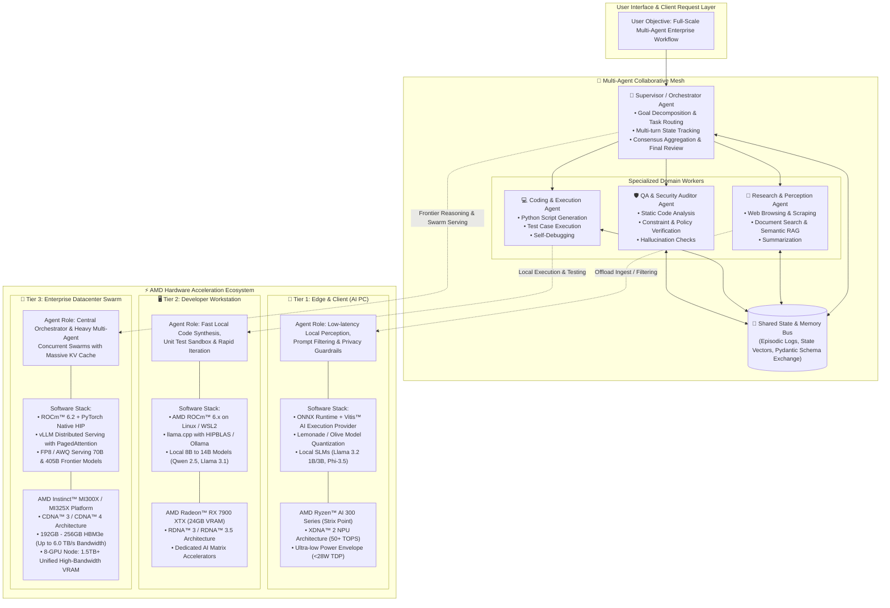

# Bài Giảng 3: Hệ Sinh Thái Phần Cứng & Tối Ưu Hóa Suy Luận AMD ROCm™
## Module 03: AMD Hardware Acceleration & ROCm™ Inference Optimization Ecosystem

> **Khóa học:** AMD AI Academy — AI Agents 101: Building AI Agents with MCP & Open-Source Inference  
> **Chuyên đề:** Thách thức tính toán của Tác tử AI, Ngăn xếp phần mềm AMD ROCm™ 6.x, Phân tầng phần cứng (Ryzen AI NPU, Radeon GPU, Instinct MI300X/MI325X) và Kỹ thuật tối ưu hóa thông lượng  
> **Đối tượng:** Kỹ sư AI, Kỹ sư MLOps & Hạ tầng, Kiến trúc sư hệ thống phần cứng  

---

## 📑 Mục Lục Chi Tiết

1. [Chương 1: Thách Thức Tính Toán & Bộ Nhớ Trong Kỷ Nguyên Tác Tử (The Agentic Compute Challenge)](#chương-1-thách-thức-tính-toán--bộ-nhớ-trong-kỷ-nguyên-tác-tử-the-agentic-compute-challenge)
   - 1.1 Độ trễ xếp chồng qua các vòng lặp công cụ (Latency Compounding Cascade)
   - 1.2 Bùng nổ bộ nhớ đệm Key-Value (KV Cache Explosion) và công thức định lượng
   - 1.3 Phân tích nút thắt cổ chai: Giới hạn tính toán (Compute-Bound) đối đầu Giới hạn băng thông bộ nhớ (Memory-Bandwidth Bound)
   - 1.4 Lợi thế kinh tế và an toàn dữ liệu: Cục bộ/Trung tâm dữ liệu đối đầu Cloud API độc quyền
2. [Chương 2: Ngăn Xếp Phần Mềm Tính Toán Mở AMD ROCm™ 6.x (The Open Compute Stack)](#chương-2-ngăn-xếp-phần-mềm-tính-toán-mở-amd-rocm-6x-the-open-compute-stack)
   - 2.1 Kiến trúc tổng thể của ROCm 6.x: Từ Kernel Driver đến Thư viện Toán học
   - 2.2 Tính tương thích và chuyển đổi mã nguồn qua HIP (Heterogeneous-Compute Interface for Portability)
   - 2.3 Hệ sinh thái PyTorch ROCm Backend bản địa
   - 2.4 Động cơ phục vụ hiệu năng cao vLLM trên ROCm: PagedAttention, Continuous Batching và Custom HIP Kernels
3. [Chương 3: Tầng Thiết Bị Biên & AI PC — AMD Ryzen™ AI NPU (Kiến Trúc XDNA™ 2)](#chương-3-tầng-thiết-bị-biên--ai-pc--amd-ryzen-ai-npu-kiến-trúc-xdna-2)
   - 3.1 Vai trò của NPU trong việc duy trì nhận thức tác tử liên tục
   - 3.2 Kiến trúc luồng dữ liệu không gian (Spatial Dataflow Architecture) của XDNA™ 2
   - 3.3 Thông số kỹ thuật dòng Ryzen AI 300 Series (50+ TOPS, <28W TDP, Chuẩn Copilot+ PC)
   - 3.4 Ngăn xếp phần mềm: ONNX Runtime kết hợp Vitis™ AI Execution Provider (`RyzenAI_EP`)
   - 3.5 Triển khai các mô hình ngôn ngữ nhỏ (SLMs: Llama 3.2 1B/3B, Phi-3.5) làm cổng bảo vệ quyền riêng tư cục bộ
4. [Chương 4: Tầng Máy Trạm Nhà Phát Triển — AMD Radeon™ GPUs (RDNA™ 3 / 3.5)](#chương-4-tầng-máy-trạm-nhà-phát-triển--amd-radeon-gpus-rdna-3--35)
   - 4.1 Thông số kiến trúc của AMD Radeon™ RX 7900 XTX (24GB GDDR6, Băng thông 960 GB/s)
   - 4.2 Môi trường phần mềm máy trạm: ROCm trên Linux/WSL2, Ollama và `llama.cpp` với `GGML_HIPBLAS`
   - 4.3 Khả năng phục vụ tác tử độc lập: Chạy mượt mà mô hình 8B đến 14B cho vòng lặp ReAct và Sandbox code
5. [Chương 5: Tầng Trung Tâm Dữ Liệu & Đám Mây Doanh Nghiệp — AMD Instinct™ MI300X & MI325X](#chương-5-tầng-trung-tâm-dữ-liệu--đám-mây-doanh-nghiệp--amd-instinct-mi300x--mi325x)
   - 5.1 Kiến trúc phần cứng CDNA™ 3 & CDNA™ 4 và công nghệ đóng gói chiplet 3.5D
   - 5.2 Thông số đột phá: 192GB - 256GB HBM3e, Băng thông 5.3 - 6.0 TB/s
   - 5.3 Hệ thống 8-GPU Node: 1.5TB+ Bộ nhớ HBM hợp nhất siêu tốc
   - 5.4 Lợi thế phục vụ bầy tác tử (Agent Swarms) và các siêu mô hình 70B/405B không cần chia cụm mạng phức tạp
6. [Chương 6: Các Kỹ Thuật Tối Ưu Hóa Suy Luận Nâng Cao](#chương-6-các-kỹ-thuật-tối-ưu-hóa-suy-luận-nâng-cao)
   - 6.1 Lượng tử hóa trọng số: GGUF, AWQ (Activation-aware Weight Quantization) và Chuẩn FP8 (E4M3 / E5M2)
   - 6.2 Giải mã suy đoán (Speculative Decoding): Phối hợp mô hình nháp (Draft Model) trên NPU/Radeon và mô hình mục tiêu (Target Model) trên Instinct
7. [Chương 7: Sơ Đồ Lưới Cộng Tác Đa Tác Tử & Phân Tầng Phần Cứng AMD (Diagram 4)](#chương-7-sơ-đồ-lưới-cộng-tác-đa-tác-tử--phân-tầng-phần-cứng-amd-diagram-4)
8. [Tổng Kết & Bài Tập Đánh Giá Năng Lực Phần Cứng](#tổng-kết--bài-tập-đánh-giá-năng-lực-phần-cứng)

---

## Chương 1: Thách Thức Tính Toán & Bộ Nhớ Trong Kỷ Nguyên Tác Tử (The Agentic Compute Challenge)

### 1.1 Độ trễ xếp chồng qua các vòng lặp công cụ (Latency Compounding Cascade)

Trong mô hình trò chuyện thông thường (Chatbot), một yêu cầu của người dùng chỉ kích hoạt **một lượt suy luận duy nhất (Single Forward Pass)** từ mô hình ngôn ngữ lớn:

$$\text{User Prompt} \longrightarrow \text{LLM Inference} \longrightarrow \text{Final Response}$$

Thời gian phản hồi được xác định bởi:

$$T_{\text{chat}} = \text{TTFT} + \frac{N_{\text{out}}}{\text{TPS}}$$

Trong đó $\text{TTFT}$ là thời gian sinh token đầu tiên (Time-To-First-Token), $N_{\text{out}}$ là số lượng token sinh ra, và $\text{TPS}$ là tốc độ sinh token (Tokens Per Second).

Tuy nhiên, trong một hệ thống Tác tử Tự chủ (AI Agent), để giải quyết một mục tiêu phức tạp (như tìm kiếm công thức, duyệt web, trích xuất dữ liệu, kiểm thử code), tác tử phải thực hiện một chuỗi $K$ bước lặp tuần tự (với $K \in [5, 30]$):

$$T_{\text{agent}} = \sum_{k=1}^K \left( \text{TTFT}_k + \frac{N_{\text{out}, k}}{\text{TPS}_k} + T_{\text{tool\_exec}, k} \right)$$

```
[User Goal]
     |
     v
[Turn 1: Think & Plan] --------> [Tool 1 Exec: Web Search (1.2s)]
     |                                    |
     v                                    v
[Turn 2: Analyze Results] -----> [Tool 2 Exec: DOM Click (0.8s)]
     |                                    |
     v                                    v
[Turn 3: Re-evaluate Error] ---> [Tool 3 Exec: Python Run (0.4s)]
     |                                    |
     v                                    v
    ...                                  ...
     |                                    |
     v                                    v
[Turn K: Synthesize Final] ----> [Deliver Answer to User]
```

**Hệ quả kiến trúc:**  
Nếu tốc độ suy luận của mô hình chỉ đạt 20 tokens/giây và TTFT là 2.5 giây, một tác tử chạy 10 bước lặp sẽ khiến người dùng phải chờ đợi từ 45 giây đến hơn 2 phút! **Do đó, tốc độ suy luận cao (High-Throughput TPS) và độ trễ khởi động thấp (Ultra-Low TTFT) không còn là một tính năng xa xỉ mà là điều kiện tiên quyết để AI Agent có thể ứng dụng trong thực tế.**

---

### 1.2 Bùng nổ bộ nhớ đệm Key-Value (KV Cache Explosion) và công thức định lượng

Trong quá trình thực thi nhiều bước, toàn bộ lịch sử suy luận (`Thought`), chỉ thị công cụ (`Action`), và kết quả quan sát (`Observation`) của các bước trước liên tục được nhồi lại vào Context Window ở các bước sau.

Để tránh phải tính toán lại biểu diễn chú ý của các token trong quá khứ ở mỗi bước sinh token, cơ chế **KV Cache (Key-Value Cache)** lưu trữ trạng thái tensor của các khóa ($K$) và giá trị ($V$) trong bộ nhớ VRAM của GPU.

#### Công thức toán học định lượng dung lượng KV Cache:

Dung lượng bộ nhớ VRAM cần thiết để lưu trữ KV Cache cho một mô hình Transformer được tính bằng công thức chính xác:

$$\text{Memory}_{\text{KV}} = 2 \times b \times s \times l \times h_{KV} \times d_{head} \times \text{BytesPerElement}$$

Trong đó:
- Hệ số $2$: Đại diện cho hai ma trận $K$ (Key) và $V$ (Value).
- $b$: Số lượng phiên làm việc của tác tử chạy đồng thời (Batch Size / Concurrency).
- $s$: Chiều dài chuỗi ngữ cảnh tích lũy (Sequence Length / Context Window, ví dụ $16,384$ tokens).
- $l$: Số lượng lớp Transformer (Number of Layers).
- $h_{KV}$: Số lượng đầu chú ý Key-Value (Number of KV Attention Heads, áp dụng Grouped-Query Attention - GQA).
- $d_{head}$: Kích thước không gian biểu diễn của mỗi đầu chú ý ($d_{head} = \frac{d_{model}}{h_{Q}}$).
- $\text{BytesPerElement}$: Số byte trên mỗi phần tử (2 bytes đối với FP16/BF16, 1 byte đối với FP8).

#### Bảng so sánh thực tế dung lượng KV Cache cho Llama 3.1 70B ($l=80, h_{KV}=8, d_{head}=128$):

| Độ dài Ngữ Cảnh ($s$) | Số Agent Đồng Thời ($b$) | Độ chính xác (Precision) | Dung lượng KV Cache thuần túy | Đánh giá Khả thi Phần cứng |
| :--- | :--- | :--- | :--- | :--- |
| 4,096 tokens | 1 Agent | FP16 (2 bytes) | **1.34 GB** | Chạy tốt trên Radeon RX 7900 XTX |
| 16,384 tokens | 1 Agent | FP16 (2 bytes) | **5.37 GB** | Vừa vặn trên Radeon RX 7900 XTX |
| 32,768 tokens | 8 Agents | FP16 (2 bytes) | **85.90 GB** | Vượt quá máy trạm, cần máy chủ MI300X |
| 32,768 tokens | 32 Agents (Bầy đàn) | FP16 (2 bytes) | **343.60 GB** | **Chỉ khả thi trên cụm AMD Instinct MI300X (1.5TB VRAM)** |
| 32,768 tokens | 32 Agents (Bầy đàn) | FP8 (1 byte) | **171.80 GB** | Tối ưu hóa tuyệt vời trên AMD MI300X |

---

### 1.3 Phân tích nút thắt cổ chai: Giới hạn tính toán (Compute-Bound) đối đầu Giới hạn băng thông bộ nhớ (Memory-Bandwidth Bound)

Để hiểu rõ tại sao phần cứng AMD với băng thông bộ nhớ cực lớn lại mang lại lợi thế vượt trội cho AI Agent, ta cần phân tích qua mô hình **Roofline Model**:

$$\text{Tốc độ Xử lý Thực tế} = \min \left( \text{Peak Compute FLOPs}, \; \text{Băng thông Bộ nhớ} \times \text{Cường độ Số học} \right)$$

Trong đó, **Cường độ Số học (Arithmetic Intensity)** được định nghĩa là số phép tính dấu phẩy động thực hiện trên mỗi byte dữ liệu đọc từ bộ nhớ:

$$\text{Arithmetic Intensity} = \frac{\text{Tổng số phép tính (FLOPs)}}{\text{Tổng dữ liệu đọc/ghi từ VRAM (Bytes)}}$$

Quá trình suy luận của LLM trong vòng lặp Agent chia làm hai pha có bản chất hoàn toàn đối lập:

```
+-------------------------------------------------------------------------------+
| PHA 1: PREFILL PHASE (Xử lý toàn bộ System Prompt & Lịch sử công cụ)          |
| - Bản chất: COMPUTE-BOUND (Giới hạn bởi năng lực tính toán).                 |
| - Cơ chế: Tất cả token đầu vào được nạp và nhân ma trận song song (GEMM).     |
| - Cường độ số học cao: Hàng chục đến hàng trăm FLOPs/Byte.                    |
| - Yêu cầu phần cứng: Cần số lượng nhân tính toán ma trận lớn (Matrix Cores).  |
+-------------------------------------------------------------------------------+
                                        |
                                        v
+-------------------------------------------------------------------------------+
| PHA 2: DECODE PHASE (Sinh từng token tiếp theo của Thought / Action)          |
| - Bản chất: MEMORY-BANDWIDTH BOUND (Giới hạn tuyệt đối bởi băng thông VRAM).  |
| - Cơ chế: Với mỗi token đơn lẻ sinh ra ở batch size = 1, GPU buộc phải nạp    |
|   toàn bộ trọng số mô hình (70 tỷ tham số = 140GB) từ VRAM vào nhân tính toán.|
| - Cường độ số học cực thấp:                                                   |
|   Arithmetic Intensity = (2 * P) / (P * 2 bytes) = 1.0 FLOP/Byte (ở FP16)!   |
| - Tốc độ sinh token lý thuyết tối đa:                                         |
|   TPS_max = Băng thông Bộ nhớ (Bytes/s) / Kích thước Trọng số Mô hình (Bytes) |
+-------------------------------------------------------------------------------+
```

*Ví dụ minh họa:*  
- Chạy mô hình Llama 3.1 8B (khoảng 16 GB ở FP16):
  - Trên GPU thông thường với băng thông 300 GB/s: $\text{TPS}_{\max} \approx 300 / 16 \approx 18.75 \text{ tokens/s}$.
  - Trên **AMD Radeon™ RX 7900 XTX** (Băng thông **960 GB/s**): $\text{TPS}_{\max} \approx 960 / 16 \approx \mathbf{60.0 \text{ tokens/s}}$!
- Chạy mô hình Llama 3.1 70B (khoảng 70 GB ở FP8):
  - Trên **AMD Instinct™ MI300X** (Băng thông **5,300 GB/s**): $\text{TPS}_{\max} \approx 5300 / 70 \approx \mathbf{75.7 \text{ tokens/s}}$ cho một luồng đơn, và hàng ngàn tokens/s khi batching!

---

### 1.4 Lợi thế kinh tế và an toàn dữ liệu: Cục bộ/Trung tâm dữ liệu đối đầu Cloud API độc quyền

Khi triển khai các hệ thống tác tử tự chủ cho doanh nghiệp, việc phụ thuộc vào các Cloud API đóng (proprietary cloud APIs) bộc lộ các rủi ro chiến lược:
1. **Chi phí biên tích lũy theo cấp số nhân (Compounding Marginal Cost):** Mỗi bước trong vòng lặp ReAct lặp lại toàn bộ prompt dài, dẫn đến hóa đơn token tăng phi mã. Triển khai trên phần cứng AMD mua một lần giúp chi phí biên cho mỗi token tiến về 0.
2. **Quyền riêng tư và Chủ quyền Dữ liệu (Data Sovereignty):** Tác tử tương tác trực tiếp với cơ sở dữ liệu nội bộ, mã nguồn độc quyền và thông tin định danh cá nhân (PII). Chạy cục bộ trên chip AMD Ryzen AI (ở máy trạm biên) hoặc AMD Instinct (trong trung tâm dữ liệu on-premise) đảm bảo 100% dữ liệu không bao giờ bị rò rỉ ra ngoài mạng nội bộ.
3. **Độ tin cậy hạ tầng (No Rate Limits):** Không bao giờ gặp lỗi `HTTP 429 Too Many Requests` hay sự cố gián đoạn dịch vụ của nhà cung cấp bên thứ ba.

---

## Chương 2: Ngăn Xếp Phần Mềm Tính Toán Mở AMD ROCm™ 6.x (The Open Compute Stack)

### 2.1 Kiến trúc tổng thể của ROCm 6.x: Từ Kernel Driver đến Thư viện Toán học

**AMD ROCm™ (Radeon Open Compute)** là nền tảng phần mềm mã nguồn mở hoàn chỉnh dành cho tính toán GPU hiệu năng cao và trí tuệ nhân tạo. Kiến trúc của ROCm 6.x được thiết kế theo mô hình phân tầng chặt chẽ:

```
+-------------------------------------------------------------------------------+
|                    ỨNG DỤNG TÁC TỬ & MÔ HÌNH HỌC SÂU                          |
|             (LangGraph, CrewAI, PydanticAI, vLLM, SGLang, Ollama)             |
+-------------------------------------------------------------------------------+
                                        |
                                        v
+-------------------------------------------------------------------------------+
|                    FRAMEWORK FRAMEWORKS & RUNTIMES BẬC CAO                    |
|             PyTorch (ROCm Wheels) | ONNX Runtime (Vitis AI EP) | Triton       |
+-------------------------------------------------------------------------------+
                                        |
                                        v
+-------------------------------------------------------------------------------+
|               THƯ VIỆN TOÁN HỌC & TRUYỀN THÔNG TĂNG TỐC (ROCm LIBRARIES)       |
| rocBLAS (GEMM) | MIOpen (Deep Learning) | RCCL (Multi-GPU Comm) | rocSPARSE  |
+-------------------------------------------------------------------------------+
                                        |
                                        v
+-------------------------------------------------------------------------------+
|              LỚP TƯƠNG THÍCH MÃ NGUỒN HIP (C++ RUNTIME API)                   |
|           Đơn nhất hóa mã nguồn cho cả GPU AMD (CDNA/RDNA) và NVIDIA          |
+-------------------------------------------------------------------------------+
                                        |
                                        v
+-------------------------------------------------------------------------------+
|                  TRÌNH BIÊN DỊCH & RUNTIME HỆ THỐNG                           |
|        ROCr (System Runtime) | ROCt (Thunk Interface) | AMD Clang (LLVM)      |
+-------------------------------------------------------------------------------+
                                        |
                                        v
+-------------------------------------------------------------------------------+
|                   TRÌNH ĐIỀU KHIỂN HẠT NHÂN LINUX (KERNEL)                    |
|             AMDGPU Driver | Kernel Fusion Driver (/dev/kfd)                   |
+-------------------------------------------------------------------------------+
                                        |
                                        v
+-------------------------------------------------------------------------------+
|                       PHẦN CỨNG BỘ TĂNG TỐC AMD                               |
|        AMD Instinct™ MI300X/MI325X | AMD Radeon™ RX 7900 | Ryzen™ AI NPU      |
+-------------------------------------------------------------------------------+
```

### 2.2 Tính tương thích và chuyển đổi mã nguồn qua HIP (Heterogeneous-Compute Interface for Portability)

HIP là một tầng trừu tượng hóa runtime C++ và ngôn ngữ nhân tính toán (kernel language) do AMD phát triển. HIP cho phép các nhà phát triển viết mã nguồn GPU một lần và biên dịch để chạy trên cả nền tảng AMD ROCm và NVIDIA CUDA:

- **Công cụ chuyển đổi tự động `hipify-perl` và `hipify-clang`:**  
  Quét toàn bộ mã nguồn CUDA hiện có, tự động thay thế các tiền tố `cuda*` bằng `hip*` (ví dụ: `cudaMalloc` $\rightarrow$ `hipMalloc`, `cudaMemcpy` $\rightarrow$ `hipMemcpy`).
- **Không suy giảm hiệu năng (Zero Overhead):** Khi chạy trên nền tảng AMD, mã HIP được biên dịch trực tiếp bởi trình biên dịch Clang/LLVM thành mã máy nhị phân GPU (AMDGPU ISA), không qua bất kỳ lớp thông dịch trung gian nào.

### 2.3 Hệ sinh thái PyTorch ROCm Backend bản địa

Cộng đồng PyTorch chính thức phát hành các bản phân phối nhị phân (wheels) hỗ trợ trực tiếp ROCm. Một nhà phát triển tác tử AI có thể chạy cùng một đoạn mã Python trên phần cứng AMD mà không cần thay đổi bất kỳ cú pháp nào:

```python
import torch

# Trên hệ thống AMD ROCm, lệnh này trả về True thông qua lớp HIP runtime
print(f"ROCm Available: {torch.cuda.is_available()}")
print(f"Device Name: {torch.cuda.get_device_name(0)}")
# Output trên máy chủ Instinct: 'AMD Instinct MI300X'
# Output trên máy trạm: 'AMD Radeon RX 7900 XTX'

# Các phép toán Tensor ma trận chạy trực tiếp trên các nhân Matrix Cores của AMD
x = torch.randn(4096, 4096, dtype=torch.float16, device="cuda")
y = torch.matmul(x, x)
```

### 2.4 Động cơ phục vụ hiệu năng cao vLLM trên ROCm: PagedAttention, Continuous Batching và Custom HIP Kernels

Trong bài giảng AMD AI Academy, giảng viên Mahdi Ghodsi đã chỉ rõ rằng **vLLM** là công cụ tiêu chuẩn công nghiệp để phục vụ mô hình ngôn ngữ cho tác tử AI trên phần cứng AMD ROCm.

```bash
# Khởi chạy máy chủ vLLM chuẩn OpenAI-compatible trên GPU AMD Instinct / Radeon
python3 -m vllm.entrypoints.openai.api_server \
    --model Qwen/Qwen2.5-72B-Instruct \
    --tensor-parallel-size 4 \
    --dtype float16 \
    --kv-cache-dtype fp8 \
    --max-model-len 32768 \
    --port 8000
```

1. **Thuật toán PagedAttention trên AMD GPU:**  
   Trước khi có PagedAttention, bộ nhớ đệm KV Cache phải được cấp phát liên tục trong không gian địa chỉ ảo, dẫn đến lãng phí từ 60% đến 80% dung lượng do phân mảnh bộ nhớ (Memory Fragmentation). PagedAttention áp dụng nguyên lý bộ nhớ ảo của hệ điều hành, chia nhỏ KV Cache thành các trang (pages) vật lý không liên tục. Điều này cho phép phục vụ hàng chục phiên làm việc tác tử đồng thời với chiều dài ngữ cảnh lên tới 32k-128k tokens mà không bị tràn bộ nhớ.
2. **Kỹ thuật Lập lịch Lô Liên Tục (Continuous Batching):**  
   Thay vì phải chờ tất cả các câu hỏi trong lô hoàn thành mới tiếp nhận câu hỏi mới, vLLM lên lịch ở mức độ từng token (Iteration-level Scheduling). Khi một tác tử hoàn thành bước gọi công cụ ở token thứ 15, vị trí trống trong lô lập tức được bàn giao cho một tác tử khác đang chờ suy luận.
3. **Các Kernel Tối Ưu Hóa Riêng Biệt (Custom HIP & Triton Kernels):**  
   ROCm 6.x tích hợp các bản hiện thực hóa tùy biến cao của FlashAttention-2 và RoPE (Rotary Positional Embedding) viết riêng cho kiến trúc CDNA™ và RDNA™, tối đa hóa thông lượng dữ liệu đọc từ bộ nhớ HBM/GDDR6.

---

## Chương 3: Tầng Thiết Bị Biên & AI PC — AMD Ryzen™ AI NPU (Kiến Trúc XDNA™ 2)

### 3.1 Vai trò của NPU trong việc duy trì nhận thức tác tử liên tục

Trong tương lai của máy tính cá nhân (Copilot+ AI PCs), các tác tử AI sẽ chạy thường trực dưới nền hệ điều hành (Background Agents) để theo dõi ngữ cảnh người dùng, phân tích email đến, và bảo vệ an toàn thông tin:
- Nếu chạy tác vụ này trên CPU: Làm máy tính bị giật lag và quạt tản nhiệt quay ồn ào.
- Nếu chạy trên GPU rời (discrete GPU): Tiêu tốn công suất lớn (100W - 300W), làm cạn kiệt pin laptop chỉ trong vòng 30 phút.
- **Giải pháp NPU (Neural Processing Unit):** Được thiết kế chuyên biệt để thực hiện các phép tính tensor với hiệu suất năng lượng vượt trội, cho phép tác tử duy trì trạng thái nhận thức 24/7 với mức công suất chỉ vài Watt.

### 3.2 Kiến trúc luồng dữ liệu không gian (Spatial Dataflow Architecture) của XDNA™ 2

AMD XDNA™ 2 là kiến trúc NPU đột phá dựa trên công nghệ **Adaptive Compute Engine (AIE-ML)** kế thừa từ Xilinx:

```
[System Memory LPDDR5X]
         |
         v (High-Speed DMA Channel)
+---------------------------------------------------------------+
| AMD XDNA™ 2 NPU DIE (Mảng Ô Tính Toán Không Gian 2D)         |
|                                                               |
|  [ AIE Tile (0,0) ] <---> [ AIE Tile (0,1) ] <---> [ AIE (0,2) ] |
|         ^                        ^                    ^       |
|         |   (Dedicated Tile-to-Tile Memory Stream)    |       |
|         v                        v                    v       |
|  [ AIE Tile (1,0) ] <---> [ AIE Tile (1,1) ] <---> [ AIE (1,2) ] |
|                                                               |
|  ==> Dữ liệu kích hoạt (Activations) truyền trực tiếp giữa    |
|      các ô lân cận mà không cần ghi ngược về DRAM hệ thống!  |
+---------------------------------------------------------------+
```

Khác với kiến trúc von Neumann truyền thống (liên tục đọc/ghi dữ liệu trung gian giữa chip và RAM), kiến trúc Spatial Dataflow của XDNA cấu hình các ô tính toán thành một đường ống xử lý dữ liệu liên tục: đầu ra của lớp Transformer này được chuyển thẳng sang ô tính toán của lớp tiếp theo thông qua mạng kết nối trên chip (On-chip Network-on-Chip - NoC).

### 3.3 Thông số kỹ thuật dòng Ryzen AI 300 Series (50+ TOPS, <28W TDP, Chuẩn Copilot+ PC)

Dòng vi xử lý **AMD Ryzen™ AI 300 Series (tên mã "Strix Point")** thiết lập chuẩn mực mới cho máy tính AI di động:
- **Hiệu năng NPU:** Đạt **50 đến 55 NPU TOPS** (nghìn tỷ phép tính mỗi giây đối với kiểu dữ liệu INT8 và Block-FP16).
- **Vượt chuẩn Copilot+ PC:** Vượt xa tiêu chuẩn 40 TOPS do Microsoft đặt ra cho các tính năng tác tử AI cục bộ thế hệ mới.
- **Khung công suất (TDP):** Hoạt động linh hoạt trong dải công suất cực thấp từ **15W đến 28W** (toàn bộ SoC).

### 3.4 Ngăn xếp phần mềm: ONNX Runtime kết hợp Vitis™ AI Execution Provider (`RyzenAI_EP`)

Để phát triển ứng dụng tác tử trên Ryzen AI NPU, quy trình chuẩn mực sử dụng **ONNX Runtime**:

```python
import onnxruntime as ort

# Thiết lập phiên suy luận sử dụng bộ tăng tốc NPU AMD Vitis AI
options = ort.SessionOptions()
provider_options = [{
    'config_file': '/etc/vaip_config.json',
    'cacheDir': './model_cache',
    'cacheKey': 'llama_slm_npu'
}]

session = ort.InferenceSession(
    "llama-3.2-3b-instruct-int8.onnx",
    providers=['VitisAIExecutionProvider'],
    provider_options=provider_options
)
```

Mô hình được tối ưu hóa và lượng tử hóa bằng công cụ **Olive (Microsoft)** hoặc **Lemonade (AMD)** sang định dạng INT8 hoặc Block-FP16, giúp duy trì độ chính xác của tác tử mà vẫn khai thác tối đa năng lực phần cứng NPU.

### 3.5 Triển khai các mô hình ngôn ngữ nhỏ (SLMs) làm cổng bảo vệ quyền riêng tư cục bộ

Trong mô hình kiến trúc phân tầng, NPU trên AI PC đóng vai trò là **Tác Tử Cổng Gác (Gatekeeper & Privacy Guardrail Agent)**:
- Chạy các mô hình ngôn ngữ nhỏ (SLMs như Llama 3.2 1B/3B, Phi-3.5, hoặc Qwen 2.5 1.5B).
- **Nhiệm vụ 1: Lọc dữ liệu nhạy cảm (PII Redaction):** Trước khi gửi dữ liệu lên cụm máy chủ đám mây, NPU cục bộ phát hiện và làm mờ số căn cước, tài khoản ngân hàng, mật khẩu.
- **Nhiệm vụ 2: Phân loại ý định (Intent Routing):** Tự giải quyết các tác vụ đơn giản (đặt lịch, tìm tệp cục bộ) trong thời gian dưới 200ms mà không tốn chi phí mạng.

---

## Chương 4: Tầng Máy Trạm Nhà Phát Triển — AMD Radeon™ GPUs (RDNA™ 3 / 3.5)

### 4.1 Thông số kiến trúc của AMD Radeon™ RX 7900 XTX

Đối với các kỹ sư AI và nhà phát triển tác tử, dòng card đồ họa cao cấp **AMD Radeon™ RX 7900 XTX** mang lại tỷ lệ hiệu năng trên giá thành (Price-to-Performance) tối ưu nhất trên thị trường máy trạm:

```
+--------------------------------------------------------------------------+
|          THÔNG SỐ KỸ THUẬT CỐT LÕI: AMD RADEON™ RX 7900 XTX              |
+--------------------------------------------------------------------------+
| - Kiến trúc Vi mô:          AMD RDNA™ 3 (Thiết kế Chiplet đầu tiên)      |
| - Dung lượng Bộ nhớ VRAM:   24 GB GDDR6                                  |
| - Độ rộng Bus Bộ nhớ:       384-bit                                      |
| - Băng thông Bộ nhớ Đỉnh:   960 GB/s (gần 1 Terabyte/giây!)              |
| - Bộ nhớ đệm AMD Infinity:  96 MB (Giúp tăng băng thông hiệu dụng)       |
| - Đơn vị Tính toán (CUs):   96 Compute Units                             |
| - Bộ gia tốc Trí tuệ AI:    192 AI Accelerators (Hỗ trợ BF16/FP16/INT8)  |
| - Công suất Tiêu thụ (TBP): 355W                                         |
+--------------------------------------------------------------------------+
```

### 4.2 Môi trường phần mềm máy trạm: ROCm trên Linux/WSL2, Ollama và `llama.cpp`

Nhà phát triển có thể thiết lập môi trường tác tử cục bộ dễ dàng trên Linux (Ubuntu 22.04/24.04) hoặc Windows thông qua WSL2 với ROCm 6.x:

1. **Chạy qua Ollama (Tự động nhận diện GPU AMD ROCm):**
   ```bash
   # Ollama tự động sử dụng rocBLAS để tăng tốc trên RX 7900 XTX
   ollama run llama3.1:8b-instruct-q8_0
   ```
2. **Biên dịch `llama.cpp` với cờ HIPBLAS để đạt hiệu năng tối đa:**
   ```bash
   cmake -B build -DGGML_HIPBLAS=ON -DAMDGPU_TARGETS=gfx1100
   cmake --build build --config Release -j$(nproc)
   ```

### 4.3 Khả năng phục vụ tác tử độc lập: Chạy mô hình 8B đến 14B

Với **24 GB VRAM tốc độ 960 GB/s**, AMD Radeon RX 7900 XTX là cỗ máy lý tưởng cho một kỹ sư phát triển Agent:
- Mô hình **Llama 3.1 8B FP16** chiếm khoảng 16 GB VRAM, để lại 8 GB VRAM trống đủ cho **65,000 tokens KV Cache**.
- Tốc độ sinh mã đạt trên **100 tokens/giây**, cho phép hoàn thành một vòng lặp ReAct 5 bước chỉ trong vòng 3 đến 5 giây.
- Đủ dung lượng để chạy các mô hình 14B (như Qwen 2.5 14B Q5_K_M) hoàn toàn trong VRAM mà không bị trôi dữ liệu xuống RAM hệ thống qua khe PCIe.

---

## Chương 5: Tầng Trung Tâm Dữ Liệu & Đám Mây Doanh Nghiệp — AMD Instinct™ MI300X & MI325X

### 5.1 Kiến trúc phần cứng CDNA™ 3 & CDNA™ 4 và công nghệ đóng gói chiplet 3.5D

Đối với các hệ thống tác tử quy mô doanh nghiệp phục vụ hàng triệu người dùng, **AMD Instinct™ MI300X** và thế hệ mới **MI325X** đại diện cho đỉnh cao công nghệ tính toán AI thế giới:
- **Công nghệ đóng gói 3.5D Chiplet tiên tiến:** Kết hợp 8 khối tính toán Accelerator Complex Dies (XCDs) chế tạo trên tiến trình 5nm xếp chồng thẳng đứng (3D Stacking) lên trên 4 khối I/O Base Dies (6nm), bao bọc xung quanh bởi các ngăn xếp bộ nhớ băng thông cực cao HBM3/HBM3e.
- **304 Compute Units (CDNA 3)** cung cấp hàng ngàn TFLOPs năng lực tính toán ma trận ma sát cao.

```
       +-------------------------------------------------------+
       |   HBM3   |   HBM3   |   HBM3   |   HBM3   |   HBM3   |
       +-------------------------------------------------------+
       |       [XCD 0]     [XCD 1]     [XCD 2]     [XCD 3]     |
       |       ---------------------------------------         |  <-- 3D Die Stacking
       |       [ I/O & Memory Controller Base Die 0 ]          |
       +-------------------------------------------------------+
       |       [ I/O & Memory Controller Base Die 1 ]          |
       |       ---------------------------------------         |
       |       [XCD 4]     [XCD 5]     [XCD 6]     [XCD 7]     |
       +-------------------------------------------------------+
       |   HBM3   |   HBM3   |   HBM3   |   HBM3   |   HBM3   |
       +-------------------------------------------------------+
```

### 5.2 Thông số đột phá: 192GB - 256GB HBM3e, Băng thông 5.3 - 6.0 TB/s

Bảng so sánh thông số giữa AMD Instinct MI300X, MI325X và đối thủ cạnh tranh chính:

| Chỉ số Phần cứng | AMD Instinct™ MI300X | AMD Instinct™ MI325X | NVIDIA H100 SXM | NVIDIA H200 SXM |
| :--- | :--- | :--- | :--- | :--- |
| **Kiến trúc GPU** | CDNA™ 3 | CDNA™ 3 Enhanced | Hopper | Hopper |
| **Dung lượng Bộ nhớ VRAM** | **192 GB HBM3** | **256 GB HBM3e** | 80 GB HBM3 | 141 GB HBM3e |
| **Băng thông Bộ nhớ** | **5.3 TB/s** | **6.0 TB/s** | 3.35 TB/s | 4.8 TB/s |
| **Khả năng chứa Llama 3.1 70B FP16** | **Chạy trọn vẹn trên 1 GPU đơn lẻ!** | **Chạy trọn vẹn trên 1 GPU đơn lẻ!** | Cần ghép tối thiểu 2 GPU | Cần ghép 2 GPU nếu context dài |
| **Dung lượng Node 8-GPU** | **1,536 GB (1.5 TB!)** | **2,048 GB (2.0 TB!)** | 640 GB | 1,128 GB |

### 5.3 Hệ thống 8-GPU Node: 1.5TB+ Bộ nhớ HBM hợp nhất siêu tốc

Một máy chủ 8x AMD Instinct MI300X cung cấp **hơn 1.5 Terabyte bộ nhớ HBM3 hợp nhất** với tổng băng thông giao tiếp liên GPU nội bộ cực lớn thông qua mạng liên kết **AMD Infinity Fabric™**:
- Toàn bộ 8 GPU giao tiếp trực tiếp với nhau mà không bị thắt nút cổ chai tại cầu nối CPU.
- Thư viện truyền thông **RCCL (Radeon Collective Communication Library)** đạt hiệu suất truyền tải dữ liệu song song (All-Reduce, All-Gather) ở mức gần như tuyệt đối.

### 5.4 Lợi thế phục vụ bầy tác tử (Agent Swarms) và các siêu mô hình 70B/405B

Đây là điểm mấu chốt làm nên ưu thế tuyệt đối của AMD trong kỷ nguyên Agentic AI:
1. **Phục vụ siêu mô hình Meta Llama 3.1 405B:**  
   Với các GPU đối thủ chỉ có 80GB VRAM, để phục vụ mô hình 405B đòi hỏi phải chia nhỏ mô hình trên nhiều node mạng máy chủ khác nhau (Multi-node Pipeline Parallelism), dẫn đến độ trễ giao tiếp qua card mạng InfiniBand/Ethernet làm nghẽn toàn bộ hệ thống. Với một máy chủ 8x MI300X duy nhất (1.5TB VRAM), **toàn bộ mô hình 405B ở định dạng FP8 (khoảng 410 GB) cùng hàng trăm GB KV Cache có thể nằm trọn vẹn trong một node duy nhất**, giải phóng hoàn toàn tiềm năng suy luận siêu tốc.
2. **Khả năng tải của Bầy Tác Tử (Concurrency for Swarms):**  
   Một hệ thống doanh nghiệp triển khai 100 tác tử cộng tác cùng lúc có thể duy trì toàn bộ lịch sử ngữ cảnh 32k tokens trên cụm MI300X mà không bao giờ gặp lỗi thiếu bộ nhớ VRAM (`CUDA Out of Memory`).

---

## Chương 6: Các Kỹ Thuật Tối Ưu Hóa Suy Luận Nâng Cao

### 6.1 Lượng tử hóa trọng số: GGUF, AWQ và Chuẩn FP8 (E4M3 / E5M2)

Lượng tử hóa (Quantization) là kỹ thuật nén các trọng số mô hình từ định dạng dấu phẩy động 16-bit (FP16/BF16) xuống các biểu diễn có độ rộng bit thấp hơn (8-bit hoặc 4-bit) nhằm giảm dung lượng bộ nhớ và tăng tốc độ đọc từ VRAM:

```
+--------------------------------------------------------------------------+
|                  CÁC PHƯƠNG PHÁP LƯỢNG TỬ HÓA TIÊU BIỂU                  |
+--------------------------------------------------------------------------+
| 1. Chuẩn Phần Cứng FP8 (E4M3 / E5M2):                                    |
|    - Được hỗ trợ trực tiếp ở mức phần cứng bởi các nhân Matrix Cores trên|
|      kiến trúc AMD CDNA™ 3 (MI300X).                                     |
|    - Tăng gấp đôi thông lượng tính toán (TFLOPs) so với FP16.            |
|    - Bảo toàn 99.5% năng lực suy luận và lập kế hoạch logic của Agent.   |
+--------------------------------------------------------------------------+
| 2. Kỹ thuật AWQ (Activation-aware Weight Quantization):                  |
|    - Nhận biết rằng chỉ có 1% trọng số trong mạng nơ-ron đóng vai trò     |
|      quyết định (salient weights).                                       |
|    - Giữ các trọng số quan trọng này ở độ chính xác cao hơn và chỉ lượng |
|      tử hóa 99% trọng số còn lại xuống 4-bit.                            |
|    - Giúp chạy mô hình 70B chỉ tốn ~38 GB VRAM mà không bị mất khả năng  |
|      gọi công cụ (Tool Calling precision).                               |
+--------------------------------------------------------------------------+
| 3. Định dạng GGUF (K-Quants):                                            |
|    - Tối ưu hóa cho công cụ llama.cpp và suy luận trên máy trạm/CPU/GPU. |
|    - Các cấu hình khuyến nghị: Q4_K_M (cân bằng), Q5_K_M, Q8_0.          |
+--------------------------------------------------------------------------+
```

### 6.2 Giải mã suy đoán (Speculative Decoding): Phối hợp mô hình nháp và mô hình mục tiêu

Một trong những kỹ thuật tăng tốc đột phá cho chu kỳ ReAct là **Giải mã suy đoán (Speculative Decoding)**:
- **Nguyên lý:** Quá trình sinh token của mô hình lớn (Target Model, ví dụ Llama 3.1 70B) rất chậm do bị nghẽn băng thông bộ nhớ. Ta sử dụng một mô hình nhỏ siêu tốc (Draft Model, ví dụ Llama 3.2 1B) để suy đoán trước một chuỗi $K$ tokens.
- Sau đó, mô hình lớn chỉ cần thực hiện **một bước Prefill duy nhất** để kiểm tra và xác nhận đồng thời cả $K$ tokens này:

$$\mathcal{P}_{\text{Target}}(w_{t+1}, \dots, w_{t+K} \mid w_{\le t})$$

- Nếu mô hình lớn chấp thuận $M \le K$ tokens, ta thu được tốc độ tăng tốc từ **2x đến 3x** mà kết quả đầu ra hoàn toàn giống hệt toán học 100% so với việc chỉ chạy mô hình lớn!
- **Mô hình triển khai trên phần cứng AMD:**
  - *Draft Model (1B)* chạy trên **AMD Ryzen™ AI NPU** hoặc **Radeon RX 7900 XTX** với độ trễ cực thấp.
  - *Target Model (70B/405B)* chạy trên **AMD Instinct™ MI300X** để phê duyệt và hoàn tất chu trình logic.

---

## Chương 7: Sơ Đồ Lưới Cộng Tác Đa Tác Tử & Phân Tầng Phần Cứng AMD (Diagram 4)

Sơ đồ dưới đây minh họa sự liên kết hoàn chỉnh giữa tầng người dùng, mạng lưới tác tử cộng tác đa chuyên gia (Multi-Agent Swarm) và 3 tầng phần cứng tăng tốc của hệ sinh thái AMD:



---

## Tổng Kết & Bài Tập Đánh Giá Năng Lực Phần Cứng

### 📌 Các Điểm Cốt Lõi Cần Ghi Nhớ
1. **Nút thắt Băng thông Bộ nhớ:** Quá trình sinh mã token tuần tự của Tác tử bị giới hạn bởi tốc độ đọc từ VRAM (Memory Bandwidth Bound). Băng thông 960 GB/s của Radeon RX 7900 XTX và 5.3 TB/s của Instinct MI300X giải quyết triệt để nút thắt này.
2. **Ngăn xếp Mở ROCm:** Tính mở của ROCm và khả năng tương thích mã nguồn một lần qua HIP giúp doanh nghiệp triển khai AI hiệu năng cao mà không bị khóa chặt vào một nhà cung cấp độc quyền (Vendor Lock-in).
3. **Phân Tầng Hạ Tầng Hợp Lý:**
   - *Ryzen AI NPU (<28W):* Nhận thức biên thường trực, lọc dữ liệu cá nhân, phản hồi tức thì.
   - *Radeon RX 7900 XTX (24GB):* Máy trạm lập trình, thử nghiệm nhanh các mô hình 8B-14B.
   - *Instinct MI300X (192GB / 1.5TB Node):* Siêu máy chủ trung tâm phục vụ các bầy tác tử đa năng và siêu mô hình 70B/405B.

### ❓ Bài Tập Đánh Giá Năng Lực Kỹ Thuật (Practical Hardware Calculation)
1. *Hãy tính toán dung lượng VRAM tối thiểu cần thiết để phục vụ đồng thời 16 Agent, mỗi Agent có độ dài ngữ cảnh trung bình 24,000 tokens, sử dụng mô hình Llama 3.1 70B ở độ chính xác FP16. Cần tối thiểu bao nhiêu card GPU AMD Instinct MI300X (192GB)?*  
   *(Gợi ý: Áp dụng công thức tính KV Cache ở Chương 1.2 cộng với dung lượng trọng số mô hình ~140 GB).*
2. *Trình bày các bước lệnh Bash để cấu hình và khởi chạy máy chủ vLLM trên hệ thống trang bị 2x GPU AMD Radeon RX 7900 XTX sử dụng kỹ thuật Tensor Parallelism.*
