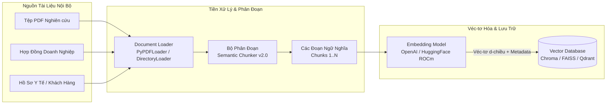
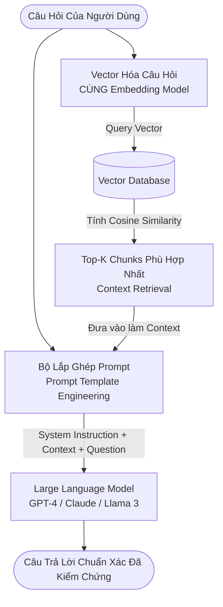

# Bài Giảng 4: Kiến Trúc Hệ Thống RAG & Phân Tách Ngữ Nghĩa Nâng Cao (Semantic Chunking v2.0)

Workspace Hub: [02_Notes_Summaries](file:///D:/02_Learning_Knowledge/AMD_AI_Academy_AI_Agents_101/02_Notes_Summaries/)  
Tài Liệu Liên Kết: [01_foundations_and_agent_architecture.md](file:///D:/02_Learning_Knowledge/AMD_AI_Academy_AI_Agents_101/02_Notes_Summaries/01_foundations_and_agent_architecture.md) | [02_core_pillars_and_design_patterns.md](file:///D:/02_Learning_Knowledge/AMD_AI_Academy_AI_Agents_101/02_Notes_Summaries/02_core_pillars_and_design_patterns.md) | [03_amd_hardware_and_rocm_ecosystem.md](file:///D:/02_Learning_Knowledge/AMD_AI_Academy_AI_Agents_101/02_Notes_Summaries/03_amd_hardware_and_rocm_ecosystem.md) | [TASKS.md](file:///D:/02_Learning_Knowledge/AMD_AI_Academy_AI_Agents_101/TASKS.md)

---

## Mục Lục Chi Tiết

1. [Chương 1: Động Lực Cốt Lõi Của Kiến Trúc RAG (Retrieval-Augmented Generation)](#chương-1-động-lực-cốt-lõi-của-kiến-trúc-rag-retrieval-augmented-generation)
   - 1.1 Điểm nghẽn tri thức đóng băng (Knowledge Cutoff)
   - 1.2 Dữ liệu nội bộ doanh nghiệp & Chủ quyền dữ liệu (Private Enterprise Data)
   - 1.3 Giới hạn cố hữu của phương pháp đính kèm tài liệu thụ động
   - 1.4 Cơ chế triệt tiêu ảo giác (Hallucination Mitigation)
2. [Chương 2: Kiến Trúc RAG Đầu-Cuối Hai Giai Đoạn (End-to-End RAG Architecture)](#chương-2-kiến-trúc-rag-đầu-cuối-hai-giai-đoạn-end-to-end-rag-architecture)
   - 2.1 Giai đoạn 1: Đường ống nạp & Đánh chỉ mục (Ingestion & Indexing Pipeline)
   - 2.2 Giai đoạn 2: Đường ống truy xuất & Tạo sinh (Retrieval & Generation Pipeline)
   - 2.3 Sơ đồ kiến trúc luồng dữ liệu toàn diện (Mermaid Flowcharts)
3. [Chương 3: Chiến Lược Phân Đoạn Văn Bản (Chunking Strategy Deep Dive)](#chương-3-chiến-lược-phân-đoạn-văn-bản-chunking-strategy-deep-dive)
   - 3.1 Ẩn dụ "Viên gạch xây nhà": Tầm quan trọng chí tử của Chunking
   - 3.2 Khái niệm nguyên tử Token và sự khác biệt với Từ (Word)
   - 3.3 Phân đoạn ngây thơ theo ký tự (Naive Recursive Character Splitting) & Các khiếm khuyết
   - 3.4 Phân đoạn ngữ nghĩa (Semantic Chunking v2.0): Thuật toán & Ngưỡng Cosine Breakpoint
   - 3.5 Bảng so sánh đối chuẩn: Recursive Character Text Splitter vs Semantic Chunker
4. [Chương 4: Mô Hình Nhúng & Cơ Sở Dữ Liệu Véc-tơ (Embeddings & Vector DBs)](#chương-4-mô-hình-nhúng--cơ-sở-dữ-liệu-véc-tơ-embeddings--vector-dbs)
   - 4.1 Cơ sở toán học của độ tương đồng Cosine (Cosine Similarity)
   - 4.2 Bất biến đồng nhất không gian nhúng (Latent Space Invariant)
   - 4.3 Đánh đổi kiến trúc: Embedding qua API đối đầu Self-hosted trên phần cứng AMD
   - 4.4 Lựa chọn Vector Database: Cục bộ (Chroma, FAISS) vs Doanh nghiệp (Qdrant, Milvus)
5. [Chương 5: Khung Triển Khai Thực Chiến Chuẩn Sản Xuất Với LangChain (Code Scaffold)](#chương-5-khung-triển-khai-thực-chiến-chuẩn-sản-xuất-với-langchain-code-scaffold)
   - 5.1 Cấu trúc mã nguồn module hóa sử dụng `SemanticChunker`
   - 5.2 Mẫu Prompt Template phòng chống suy diễn ngoài ngữ cảnh
   - 5.3 Chuỗi thực thi hiện đại theo chuẩn LCEL (LangChain Expression Language)
6. [Chương 6: Tối Ưu Hóa & Tăng Tốc RAG Trên Phần Cứng AMD ROCm](#chương-6-tối-ưu-hóa--tăng-tốc-rag-trên-phần-cứng-amd-rocm)
7. [Chương 7: Tiêu Chuẩn Kỹ Thuật (RFC 2119) & Câu Hỏi Kiểm Định Nhận Thức](#chương-7-tiêu-chuẩn-kỹ-thuật-rfc-2119--câu-hỏi-kiểm-định-nhận-thức)

---

## Chương 1: Động Lực Cốt Lõi Của Kiến Trúc RAG (Retrieval-Augmented Generation)

Trong kỷ nguyên của các mô hình ngôn ngữ lớn (Large Language Models - LLMs) như GPT-4, Llama 3, Claude hay DeepSeek, khả năng lập luận ngôn ngữ tự nhiên đã đạt tới mức độ vượt bậc. Tuy nhiên, khi đưa LLM thuần túy vào giải quyết các bài toán trong đời sống công nghiệp, hệ thống lập tức vấp phải 3 rào cản nền tảng:

```
+---------------------------------------------------------------------------------------------------+
|                        BA RÀO CẢN NỀN TẢNG CỦA MÔ HÌNH NGÔN NGỮ LỚN THUẦN TÚY                     |
+---------------------------------------------------------------------------------------------------+
| 1. Điểm nghẽn tri thức (Knowledge Cutoff) | Hoàn toàn mù trước dữ liệu phát sinh sau huấn luyện.  |
| 2. Cô lập tri thức doanh nghiệp           | Không thể tiếp cận dữ liệu mật, hồ sơ bệnh án, hợp đồng.|
| 3. Hiện tượng ảo giác (Hallucination)     | Tự tạo sinh câu trả lời sai lệch nhưng có văn phong tự tin|
+---------------------------------------------------------------------------------------------------+
```

---

### 1.1 Điểm nghẽn tri thức đóng băng (Knowledge Cutoff)

Một mô hình ngôn ngữ lớn được huấn luyện dựa trên một kho ngữ liệu khổng lồ tại một thời điểm cố định trong quá khứ. Thời điểm kết thúc quá trình thu thập ngữ liệu được gọi là **Knowledge Cutoff**.

- *Trường hợp điển hình:* Mô hình GPT-3.5 ban đầu có Knowledge Cutoff là tháng 01/2022. Khi người dùng truy vấn: *"Đội tuyển nào vô địch World Cup 2022?"*, mô hình hoàn toàn bất lực vì sự kiện thể thao này diễn ra vào mùa đông năm 2022, nằm ngoài chân trời nhận thức của mô hình. Tương tự, GPT-4 đời đầu có mốc cutoff tại năm 2023.
- Mặc dù các mô hình thương mại hiện đại đã tích hợp công cụ duyệt web (Web Browsing), cơ chế tìm kiếm công cộng chỉ giải quyết được các thông tin mở trên internet, hoàn toàn bất lực trước dữ liệu nội bộ.

---

### 1.2 Dữ liệu nội bộ doanh nghiệp & Chủ quyền dữ liệu (Private Enterprise Data)

Đại đa số các tác vụ mang lại giá trị kinh tế cao trong doanh nghiệp không nằm trên Internet:
1. **Y tế & Bệnh viện:** Hồ sơ bệnh án, phác đồ điều trị nội bộ, lịch sử xét nghiệm của bệnh nhân.
2. **Ngân hàng & Tài chính:** Lịch sử tín dụng, thông tin tài khoản cá nhân, quy chế thẩm định giải ngân.
3. **Doanh nghiệp & Pháp lý:** Điều khoản hợp đồng ký kết song phương, tài liệu kiến trúc kỹ thuật nội bộ, chính sách bảo hiểm và nhân sự.

Các tổ chức **MUST NOT** tiết lộ dữ liệu nhạy cảm này ra Internet. Do đó, mô hình LLM công cộng không có bất kỳ phương thức nào để học trước những tri thức này qua quá trình Pre-training.

---

### 1.3 Giới hạn cố hữu của phương pháp đính kèm tài liệu thụ động

Một giải pháp tình thế mà người dùng thường áp dụng là tải thủ công tệp tài liệu (PDF, Word) vào cửa sổ chat mỗi khi đặt câu hỏi:

Phương pháp này thất bại trong môi trường kỹ thuật chuyên nghiệp bởi 4 điểm nghẽn:
1. **Trải nghiệm người dùng đứt gãy:** Người dùng không thể liên tục tìm kiếm và đính kèm thủ công hàng chục tệp tin mỗi lần cần tra cứu thông tin nghiệp vụ.
2. **Sự phân tán tri thức:** Nhân viên nghiệp vụ thường không biết chính xác tài liệu liên quan nằm ở thư mục hay máy chủ nào để tải lên.
3. **Giới hạn số lượng tệp:** Các giao diện chat thương mại thường giới hạn tối đa 5 đến 10 tệp tin cho mỗi phiên giao tiếp, trong khi kho tài liệu doanh nghiệp lên tới hàng trăm nghìn văn bản.
4. **Hiện tượng suy giảm chú ý (Lost in the Middle):** Khi nhồi nhét toàn bộ tài liệu hàng trăm trang vào Context Window, cơ chế Self-Attention của LLM bị loãng, dẫn đến việc bỏ sót các chi tiết kỹ thuật cốt lõi ở giữa tài liệu.

---

### 1.4 Cơ chế triệt tiêu ảo giác (Hallucination Mitigation)

Khi bị truy vấn về thông tin nằm ngoài vùng tri thức, LLM có xu hướng "bịa đặt" (Hallucination) câu trả lời nghe rất trôi chảy, logic nhưng hoàn toàn sai sự thật.

**Giải pháp RAG (Retrieval-Augmented Generation):**
RAG giải quyết triệt để vấn đề này bằng cách biến LLM từ một "kho chứa tri thức tĩnh" thành một "cỗ máy lập luận ngữ cảnh động":
- Hệ thống tự động truy xuất các đoạn văn bản chính xác nhất từ cơ sở dữ liệu nội bộ.
- Đoạn văn bản này được đưa vào Prompt làm căn cứ duy nhất (Grounding Context).
- LLM được chỉ thị nghiêm ngặt: **Chỉ được phép trả lời dựa trên thông tin có trong ngữ cảnh được cung cấp; nếu không có dữ liệu, phải thông báo rõ ràng là không biết.**

---

## Chương 2: Kiến Trúc RAG Đầu-Cuối Hai Giai Đoạn (End-to-End RAG Architecture)

Hệ thống RAG chuẩn công nghiệp được cấu trúc thành hai đường ống (pipelines) tách biệt hoàn toàn về mặt thời gian và cơ chế vận hành:

```
+---------------------------------------------------------------------------------------------------+
|                              HAI GIAI ĐOẠN HOẠT ĐỘNG CỦA HỆ THỐNG RAG                             |
+---------------------------------------------------------------------------------------------------+
| Giai đoạn 1: Nạp & Đánh chỉ mục (Ingestion Pipeline) | Chạy ngầm Offline trước khi phục vụ người  |
|                                                      | dùng: Parse -> Chunk -> Embed -> Vector DB |
+---------------------------------------------------------------------------------------------------+
| Giai đoạn 2: Truy xuất & Tạo sinh (Inference Pipe)   | Chạy Online thời gian thực khi có truy vấn:|
|                                                      | Query -> Embed -> Search -> Prompt -> LLM  |
+---------------------------------------------------------------------------------------------------+
```

---

### 2.1 Giai đoạn 1: Đường ống nạp & Đánh chỉ mục (Ingestion & Indexing Pipeline)

Giai đoạn này diễn ra **trước khi** hệ thống mở cổng đón nhận truy vấn từ người dùng:

1. **Document Loading:** Đọc và phân giải đa dạng định dạng tệp từ kho lưu trữ (PDF, Markdown, DOCX, CSV, HTML, Code).
2. **Chunking (Phân đoạn):** Chia nhỏ văn bản dài thành các đoạn thông tin độc lập có kích thước phù hợp, bảo toàn ngữ nghĩa trọn vẹn.
3. **Embedding:** Sử dụng mô hình nhúng (Embedding Model) để ánh xạ từng đoạn văn bản thành một véc-tơ thực nhiều chiều trong không gian tiềm ẩn.
4. **Vector Database Indexing:** Lưu trữ véc-tơ cùng dữ liệu gốc (payload) và siêu dữ liệu (metadata: số trang, tên tệp, ngày ban hành) vào cơ sở dữ liệu véc-tơ có cấu trúc chỉ mục tìm kiếm nhanh (HNSW/IVF).

---

### 2.2 Giai đoạn 2: Đường ống truy xuất & Tạo sinh (Retrieval & Generation Pipeline)

Giai đoạn này diễn ra **theo thời gian thực (Online)** khi người dùng tương tác:

1. **Query Processing:** Tiếp nhận câu hỏi tự nhiên của người dùng.
2. **Query Vectorization:** Đưa câu hỏi qua **cùng mô hình nhúng** đã sử dụng ở Giai đoạn 1 để tạo sinh véc-tơ truy vấn.
3. **Similarity Search:** Truy vấn Vector Database để tính toán độ tương đồng không gian (thường dùng Cosine Similarity), lọc ra Top-$K$ đoạn văn bản có độ liên quan cao nhất.
4. **Context Augmentation:** Ghép nối Top-$K$ đoạn văn bản tìm được vào một cấu trúc Prompt có kiểm soát nghiêm ngặt.
5. **LLM Generation:** Mô hình ngôn ngữ lớn tổng hợp thông tin, trích xuất dữ kiện và sinh câu trả lời chính xác, kèm trích dẫn nguồn văn bản gốc.

---

### 2.3 Sơ đồ kiến trúc luồng dữ liệu toàn diện (Mermaid Flowcharts)

#### Sơ đồ 1: Đường ống nạp dữ liệu ngoại tuyến (Ingestion Pipeline)



#### Sơ đồ 2: Đường ống truy xuất và phản hồi trực tuyến (Inference Pipeline)



---

## Chương 3: Chiến Lược Phân Đoạn Văn Bản (Chunking Strategy Deep Dive)

Trong quy trình phát triển hệ thống RAG, các kỹ sư thường dồn phần lớn sự chú ý vào hai thành phần hào nhoáng nhất:
1. **LLM (Large Language Model):** Bộ não sinh câu trả lời.
2. **Vector Database:** Nơi lưu trữ và tính toán véc-tơ hàng triệu chiều.

Tuy nhiên, thành phần quyết định chất lượng của toàn bộ hệ thống lại nằm ở một bước thường bị xem nhẹ: **Kỹ thuật phân đoạn văn bản (Chunking Strategy)**.

---

### 3.1 Ẩn dụ "Viên gạch xây nhà": Tầm quan trọng chí tử của Chunking

Hãy hình dung quy trình xây dựng hệ thống RAG tương tự như việc thi công một công trình kiến trúc:
- Các đoạn văn bản (Chunks) chính là **những viên gạch**.
- Mô hình nhúng và Vector DB đóng vai trò như **vữa và khung thép liên kết**.
- Mô hình ngôn ngữ lớn (LLM) là **kiến trúc sư và người thợ hoàn thiện**.

Nếu khâu Chunking thực hiện cẩu thả, tạo ra những viên gạch nứt nẻ, gãy vụn và mất góc:
- Dù kiến trúc sư có tài ba đến đâu (LLM mạnh nhất thế giới như GPT-4o), dù xi măng vữa có cao cấp đến mấy (Vector DB tối tân nhất), tòa nhà xây dựng nên vẫn là một công trình ọp ẹp, nguy cơ đổ sập khi chịu tải.
- Chunks chất lượng kém chứa mảnh vụn câu sẽ dẫn đến véc-tơ nhúng bị sai lệch ngữ nghĩa. Khi truy xuất sai ngữ cảnh, LLM bắt buộc phải suy diễn trên dữ liệu rác, dẫn đến hiện tượng suy thoái chất lượng toàn hệ thống.

---

### 3.2 Khái niệm nguyên tử Token và sự khác biệt với Từ (Word)

Trong xử lý ngôn ngữ tự nhiên, kỹ sư **MUST** phân biệt rạch ròi giữa Token và Từ:
- **Token:** Đơn vị nguyên tử (Atomic Unit) nhỏ nhất cấu thành dữ liệu văn bản mà mô hình ngôn ngữ xử lý thông qua các thuật toán mã hóa như Byte-Pair Encoding (BPE) hay WordPiece.
- Một Token **MUST NOT** bị đồng nhất tuyệt đối với một Từ (Word):
  - Token có thể là một từ trọn vẹn (ví dụ: `cat`).
  - Token có thể là tiền tố, hậu tố hoặc một phần của từ (ví dụ: `transform`, `ation`).
  - Trong tiếng Việt có dấu, một từ đơn có thể bị băm thành 2 hoặc 3 token tùy thuộc vào bảng từ vựng (Vocabulary) của tokenizer.
- Do đó, việc quy đổi thô thiển $1 \text{ token} \approx 1 \text{ word}$ là một sai lầm kỹ thuật cơ bản.

---

### 3.3 Phân đoạn ngây thơ theo ký tự (Naive Recursive Character Splitting) & Các khiếm khuyết

Kỹ thuật truyền thống phổ biến nhất là sử dụng `RecursiveCharacterTextSplitter`. Thuật toán này phân chia văn bản dựa trên một danh sách các ký tự ngăn cách ưu tiên:

$$\text{separators} = [\text{"\textbackslash n\textbackslash n"}, \text{"\textbackslash n"}, \text{" "}, \text{""}]$$

Thuật toán cố gắng cắt văn bản sao cho độ dài mỗi chunk không vượt quá `chunk_size` (ví dụ: 1200 ký tự) với một vùng gối đầu `chunk_overlap` (ví dụ: 150 ký tự).

#### Các khiếm khuyết chí mạng của Naive Splitting:

```
+---------------------------------------------------------------------------------------------------+
|                        CÁC KHIẾM KHUYẾT CỦA RECURSIVE CHARACTER SPLITTING                         |
+---------------------------------------------------------------------------------------------------+
| 1. Cắt cụt ngữ nghĩa (Truncated Thought)  | Câu văn bị bẻ đôi ở đúng mốc ký tự, mất đầu mất đuôi. |
| 2. Phá vỡ cấu trúc Bảng biểu (Tables)     | Một bảng Markdown bị chém làm 2 nửa nằm ở 2 chunk khác.|
| 3. Trôi dạt ngữ cảnh (Context Severing)   | Khái niệm bắt đầu ở Chunk N nhưng kết luận ở Chunk N+1.|
+---------------------------------------------------------------------------------------------------+
```

- *Minh chứng thực tế:* Xem xét đoạn văn bản: *"Cơ chế Attention trong Transformer cho phép mỗi token nhìn vào tất cả các token khác... Điểm số Attention được tính bởi Softmax(QK^T / sqrt(d_k))"*.
  - Nếu `chunk_size` chạm trần ở giữa chừng, Chunk 1 sẽ kết thúc ở chữ *"Điểm số Attention được tính bởi Soft"*, và Chunk 2 bắt đầu bằng *"max(QK^T..."*.
  - Cả hai chunk này đều bị biến dạng ngữ nghĩa. Chunk 1 không cung cấp đủ công thức; Chunk 2 bắt đầu bằng một chuỗi ký tự vô nghĩa đối với mô hình nhúng.
  - Tương tự, nếu một bảng biểu so sánh đặc số kỹ thuật bị chia đôi, LLM khi đọc Chunk 2 sẽ không thể biết các giá trị số ở hàng dưới thuộc về cột tiêu đề nào ở hàng trên.

---

### 3.4 Phân đoạn ngữ nghĩa (Semantic Chunking v2.0): Thuật toán & Ngưỡng Cosine Breakpoint

Để khắc phục triệt để sự gãy vụn của Naive Splitting, phiên bản **RAG v2.0** áp dụng kỹ thuật **Semantic Chunking (Phân đoạn theo ngữ nghĩa)**.

Nguyên lý cốt lõi: **Văn bản chỉ được phép cắt khi có sự chuyển dịch rõ rệt về mặt chủ đề hoặc ý niệm ngữ nghĩa, không phụ thuộc vào độ dài ký tự thô.**

#### Thuật toán Semantic Chunking từng bước:

1. **Phân rã thành câu độc lập:** Tách toàn bộ văn bản đầu vào thành danh sách các câu đơn lẻ $\{s_1, s_2, s_3, \dots, s_n\}$ dựa trên các dấu phân tách câu chuẩn mực (`.`, `!`, `?`).
2. **Nhúng véc-tơ từng câu:** Chuyển đổi mỗi câu $s_i$ thành một véc-tơ nhúng $\mathbf{e}_i \in \mathbb{R}^d$:
   
   $$\mathbf{e}_i = \text{EmbedModel}(s_i)$$

3. **Tính độ tương đồng Cosine giữa các câu liên tiếp:** Với mỗi cặp câu kề cận $(s_i, s_{i+1})$, tính toán độ tương đồng góc:
   
   $$\text{Sim}(s_i, s_{i+1}) = \frac{\mathbf{e}_i \cdot \mathbf{e}_{i+1}}{\|\mathbf{e}_i\| \|\mathbf{e}_{i+1}\|}$$

4. **Xác định điểm đứt gãy ngữ nghĩa (Breakpoint Detection):**
   - Về mặt lý thuyết cơ bản: Thiết lập ngưỡng tương đồng Cosine $\tau \in (0, 1)$ (ví dụ: $\tau = 0.85$). Nếu $\text{Sim}(s_i, s_{i+1}) \ge \tau$, hai câu cùng ngữ cảnh; nếu $\text{Sim}(s_i, s_{i+1}) < \tau$, kích hoạt điểm gãy (Breakpoint) để phân tách chunk.
   - Về mặt triển khai thực tế trong thư viện (như `langchain_experimental.text_splitter.SemanticChunker`): Hệ thống chuyển đổi sang khoảng cách ngữ nghĩa $D_i = 1 - \text{Sim}(s_i, s_{i+1})$ và xác định ngưỡng cắt dựa trên phân phối thống kê của toàn bộ tài liệu:
     * **Percentile (`breakpoint_threshold_type="percentile"`):** Đặt ngưỡng tại phân vị thứ $P$ (giá trị $0 - 100$, khuyến nghị $90$ hoặc $95$). Điểm gãy được kích hoạt khi khoảng cách $D_i$ vượt quá phân vị thứ $P$ (tức thuộc top $10\%$ hoặc $5\%$ khoảng cách biến đổi lớn nhất). Kỹ sư **MUST NOT** truyền giá trị thập phân $[0, 1]$ (như $0.85$) vào tham số này vì sẽ bị hiểu là phân vị $0.85\%$, gây xé vụn văn bản thành từng câu đơn lẻ.
     * **Standard Deviation (`breakpoint_threshold_type="standard_deviation"`):** Cắt khi khoảng cách vượt quá $\mu_D + k \cdot \sigma_D$ (với $k$ thường là $1.5$ đến $3.0$).
     * **Interquartile Range (`breakpoint_threshold_type="interquartile"`):** Cắt khi khoảng cách vượt trên $Q_3 + 1.5 \cdot \text{IQR}$.

```mermaid
flowchart TD
    Doc[Toàn Bộ Văn Bản Đầu Vào] --> Sentences[Tách Thành Các Câu: s1, s2, s3, s4, s5]
    Sentences --> Embed[Nhúng Vector Từng Câu: e1, e2, e3, e4, e5]
    Embed --> SimCalc[Tính Cosine Sim Liên Tiếp:<br/>Sim12 = CosSim(e1,e2)<br/>Sim23 = CosSim(e2,e3)<br/>Sim34 = CosSim(e3,e4)<br/>Sim45 = CosSim(e4,e5)]
    
    SimCalc --> Evaluate{So Sánh Với Ngưỡng Breakpoint tau = 0.85}
    Evaluate -->|Sim12 >= 0.85 & Sim23 >= 0.85| Group1[Cùng Ngữ Cảnh: Gom s1, s2, s3 thành CHUNK 1]
    Evaluate -->|Sim34 < 0.85: Ngữ Nghĩa Đổi Chiều| SplitPoint[ĐIỂM GÃY BREAKPOINT: CẮT TẠI ĐÂY]
    Evaluate -->|Sim45 >= 0.85| Group2[Mạch Ngữ Cảnh Mới: Gom s4, s5 thành CHUNK 2]
```

---

### 3.5 Bảng so sánh đối chuẩn: Recursive Character Text Splitter vs Semantic Chunker

| Tiêu Chí So Sánh | Recursive Character Text Splitter | Semantic Chunker (RAG v2.0) |
| :--- | :--- | :--- |
| **Cơ chế phân tách chính** | Đếm số ký tự / số token cố định | Đo độ dịch chuyển véc-tơ ngữ nghĩa giữa các câu |
| **Bảo toàn ý nghĩa câu** | Kém (dễ cắt đứt giữa câu, giữa từ) | Tuyệt đối (luôn kết thúc trọn vẹn tại dấu câu) |
| **Tính toàn vẹn bảng biểu** | Thấp (thường xuyên xé lẻ bảng biểu) | Cao (bảng biểu cùng chủ đề được gom trọn vẹn) |
| **Độ dài các chunk** | Đồng đều cơ học ($\approx \text{chunk\_size}$) | Động, biến thiên linh hoạt theo độ dài tư duy |
| **Chi phí tính toán nạp (Ingestion)** | Rất nhanh, chỉ tốn CPU xử lý chuỗi | Chậm hơn, yêu cầu tính véc-tơ nhúng cho từng câu |
| **Độ chính xác truy xuất (Retrieval)** | Trung bình, dễ nhiễu do mảnh vụn văn bản | Xuất sắc, mỗi véc-tơ đại diện cho một tư tưởng trọn vẹn |

---

## Chương 4: Mô Hình Nhúng & Cơ Sở Dữ Liệu Véc-tơ (Embeddings & Vector DBs)

### 4.1 Cơ sở toán học của độ tương đồng Cosine (Cosine Similarity)

Mô hình nhúng (Embedding Model) ánh xạ các văn bản tự nhiên vào một không gian véc-tơ đa chiều $\mathbb{R}^d$ ($d$ thường là 768, 1536 hoặc 3072 chiều) sao cho các đoạn văn bản có ý nghĩa gần gũi sẽ nằm sát nhau trong không gian này.

Để định lượng khoảng cách ngữ nghĩa giữa véc-tơ câu hỏi $\mathbf{u}$ và véc-tơ chunk văn bản $\mathbf{v}$, công thức chuẩn mực nhất là **Cosine Similarity**:

$$\cos(\theta) = \frac{\mathbf{u} \cdot \mathbf{v}}{\|\mathbf{u}\|_2 \|\mathbf{v}\|_2} = \frac{\sum_{k=1}^d u_k v_k}{\sqrt{\sum_{k=1}^d u_k^2} \sqrt{\sum_{k=1}^d v_k^2}}$$

Tính chất hình học:
- $\cos(\theta) = 1$: Hai véc-tơ cùng hướng tuyệt đối ($\theta = 0^\circ$), ngữ nghĩa tương đồng hoàn hảo.
- $\cos(\theta) = 0$: Hai véc-tơ trực giao ($\theta = 90^\circ$), không có mối liên hệ ngữ nghĩa.
- $\cos(\theta) = -1$: Hai véc-tơ hoàn toàn đối lập hướng.

Khi các véc-tơ được chuẩn hóa độ dài ($L_2\text{-normalized}$ sao cho $\|\mathbf{u}\|_2 = \|\mathbf{v}\|_2 = 1$), công thức thu hẹp về tích vô hướng đơn giản: $\cos(\theta) = \mathbf{u} \cdot \mathbf{v}$, cho phép tăng tốc độ truy vấn lên hàng chục lần trên các phần cứng tăng tốc như GPU AMD Instinct.

---

### 4.2 Bất biến đồng nhất không gian nhúng (Latent Space Invariant)

Kỹ sư hệ thống **MUST** tuân thủ nguyên tắc bất biến nghiêm ngặt:
> **Mô hình nhúng dùng để vector hóa câu hỏi ở giai đoạn Retrieval BẮT BUỘC PHẢI LÀ MÔ HÌNH NHÚNG đã được dùng để đánh chỉ mục các chunks ở giai đoạn Ingestion.**

Nếu ở khâu nạp dữ liệu, ta dùng `text-embedding-3-small` (1536 chiều của OpenAI), nhưng ở khâu người dùng hỏi lại dùng mô hình `all-MiniLM-L6-v2` (384 chiều của HuggingFace) hoặc một mô hình khác:
- Hai véc-tơ sẽ lệch pha số chiều hoặc thuộc về hai không gian hình học tiềm ẩn hoàn toàn khác nhau.
- Phép tính Cosine Similarity sẽ vô nghĩa, dẫn đến kết quả truy xuất hoàn toàn ngẫu nhiên và sai lệch.

---

### 4.3 Đánh đổi kiến trúc: Embedding qua API đối đầu Self-hosted trên phần cứng AMD

| Đặc Tính Hệ Thống | Mô Hình Nhúng Qua API (OpenAI / Google) | Mô Hình Nhúng Tự Host (ROCm / PyTorch / AMD) |
| :--- | :--- | :--- |
| **Triển khai ban đầu** | Cực kỳ đơn giản, chỉ cần API Key | Cần cấu hình môi trường, cài đặt driver ROCm |
| **Hạ tầng phần cứng** | Không cần GPU cục bộ | Cần GPU AMD Radeon / Instinct đủ VRAM |
| **Bảo mật dữ liệu (Privacy)** | Rủi ro rò rỉ dữ liệu mật nội bộ sang bên thứ ba | **Chủ quyền tuyệt đối 100% (Zero Data Leakage)** |
| **Khả năng hoạt động Offline** | Bất khả thi, phụ thuộc đường truyền Internet | **Hoạt động độc lập hoàn toàn trong mạng nội bộ cách ly** |
| **Chi phí vận hành dài hạn** | Tăng tuyến tính theo số lượng token nạp/truy vấn | Chi phí cố định theo khấu hao phần cứng GPU |
| **Khả năng Fine-tune** | Rất hạn chế hoặc không thể tùy biến sâu | Hoàn toàn tự do tinh chỉnh trên ngữ liệu chuyên ngành |

---

### 4.4 Lựa chọn Vector Database: Cục bộ (Chroma, FAISS) vs Doanh nghiệp (Qdrant, Milvus)

- **Vector Database Nhúng / Cục bộ (Chroma, Meta FAISS):**
  - Chạy in-process hoặc lưu trữ dưới dạng tệp thư mục cục bộ (SQLite/DuckDB backend).
  - Phù hợp hoàn hảo cho các bài toán PoC (Proof of Concept), ứng dụng Desktop, AI Agent đơn lẻ hoặc quy mô dữ liệu dưới 100.000 chunks.
- **Vector Database Doanh nghiệp Phân tán (Qdrant, Milvus, Weaviate):**
  - Hỗ trợ kiến trúc cụm (Distributed Cluster), chịu lỗi cao (High Availability), sharding dữ liệu.
  - Tích hợp bộ lọc siêu dữ liệu phức tạp (Metadata Filtering) kết hợp HNSW (Hierarchical Navigable Small World).
  - Phù hợp cho hạ tầng phục vụ hàng triệu người dùng đồng thời trong môi trường sản xuất.

---

## Chương 5: Khung Triển Khai Thực Chiến Chuẩn Sản Xuất Với LangChain (Code Scaffold)

Dưới đây là bản thiết kế mã nguồn chuẩn sản xuất triển khai RAG Chatbot v2.0 sử dụng `SemanticChunker` từ gói `langchain_experimental.text_splitter`.

Mã nguồn tuân thủ kiến trúc chuỗi hiện đại **LCEL (LangChain Expression Language)**, hỗ trợ nạp tài liệu tự động và tương tác dòng lệnh liên tục:

```python
"""
RAG Chatbot v2.0: Hệ thống RAG với Bộ Phân Đoạn Ngữ Nghĩa SemanticChunker
Curriculum: AMD AI Academy - AI Agents 101
Vị trí lưu trữ: D:/02_Learning_Knowledge/AMD_AI_Academy_AI_Agents_101/03_Materials_Code/
"""
import os
import sys
from pathlib import Path
from dotenv import load_dotenv

# Tải biến môi trường (API Keys, Configurations)
load_dotenv()

# Kiểm tra yêu cầu khóa API
if not os.getenv("OPENAI_API_KEY"):
    print("[CẢNH BÁO HỆ THỐNG] Biến môi trường OPENAI_API_KEY chưa được thiết lập.")
    print("Vui lòng cấu hình file .env hoặc trỏ tới local embedding server trên AMD ROCm.")

from langchain_community.document_loaders import DirectoryLoader, PyPDFLoader
from langchain_experimental.text_splitter import SemanticChunker
from langchain_openai import OpenAIEmbeddings, ChatOpenAI
from langchain_community.vectorstores import Chroma
from langchain_core.prompts import ChatPromptTemplate
from langchain_core.runnables import RunnablePassthrough
from langchain_core.output_parsers import StrOutputParser

# 1. Định nghĩa hằng số cấu hình hệ thống
DOCS_DIRECTORY = "./papers"
CHROMA_PERSIST_DIR = "./chroma_db_v2"

# Cấu hình ngưỡng Breakpoint cho SemanticChunker:
# - 'percentile': Giá trị từ 0 đến 100 (khuyến nghị 90.0 hoặc 95.0).
#   Điểm gãy được kích hoạt tại top 10% (hoặc 5%) biến động khoảng cách ngữ nghĩa lớn nhất.
#   LƯU Ý: Tuyệt đối KHÔNG truyền 0.85 vào đây vì sẽ bị hiểu là phân vị thứ 0.85%, gây xé vụn văn bản.
# - 'standard_deviation': Giá trị là hệ số k độ lệch chuẩn (khuyến nghị 1.5 - 3.0).
BREAKPOINT_THRESHOLD_TYPE = "percentile"
BREAKPOINT_THRESHOLD_AMOUNT = 90.0

def build_or_load_vector_db(use_local_rocm: bool = False):
    """
    Xây dựng hoặc tải cơ sở dữ liệu véc-tơ sử dụng SemanticChunker.
    Đảm bảo tính toàn vẹn ngữ nghĩa của từng đoạn trích.
    
    Tham số:
      - use_local_rocm: Nếu True, dùng mô hình nhúng mã nguồn mở cục bộ (HuggingFace/ROCm);
                        Nếu False, dùng OpenAI API Embeddings.
    """
    if use_local_rocm:
        # Chạy Offline / Bảo mật doanh nghiệp tuyệt đối trên hạ tầng GPU AMD Instinct / Radeon qua ROCm
        from langchain_community.embeddings import HuggingFaceEmbeddings
        print("[Embedding] Khởi tạo mô hình nhúng cục bộ trên AMD ROCm (bge-large-en-v1.5)...")
        embedding_model = HuggingFaceEmbeddings(
            model_name="BAAI/bge-large-en-v1.5",
            model_kwargs={"device": "cuda"}  # ROCm ánh xạ tương thích qua HIP PyTorch cuda device
        )
    else:
        # Chạy qua Cloud API
        embedding_model = OpenAIEmbeddings(model="text-embedding-3-small")
    
    # Kiểm tra xem Vector DB đã tồn tại cục bộ chưa
    if os.path.exists(CHROMA_PERSIST_DIR) and os.listdir(CHROMA_PERSIST_DIR):
        print(f"[VectorDB] Tải chỉ mục đã tồn tại từ: {CHROMA_PERSIST_DIR}")
        return Chroma(
            persist_directory=CHROMA_PERSIST_DIR,
            embedding_function=embedding_model
        )
    
    print("[Ingestion] Bắt đầu nạp tài liệu từ thư mục:", DOCS_DIRECTORY)
    pdf_path = Path(DOCS_DIRECTORY)
    if not pdf_path.exists():
        pdf_path.mkdir(parents=True, exist_ok=True)
        print(f"[Thông báo] Đã tạo thư mục '{DOCS_DIRECTORY}'. Vui lòng đặt các file PDF vào đây.")
        return None

    loader = DirectoryLoader(
        DOCS_DIRECTORY,
        glob="**/*.pdf",
        loader_cls=PyPDFLoader,
        show_progress=True
    )
    raw_documents = loader.load()
    
    if not raw_documents:
        print("[Cảnh báo] Không tìm thấy tệp PDF nào để nạp dữ liệu.")
        return None
        
    print(f"[Ingestion] Đã nạp {len(raw_documents)} trang tài liệu thô.")
    
    # 2. Khởi tạo bộ phân đoạn ngữ nghĩa SemanticChunker v2.0
    print(f"[Chunking] Áp dụng SemanticChunker ({BREAKPOINT_THRESHOLD_TYPE} = {BREAKPOINT_THRESHOLD_AMOUNT})")
    text_splitter = SemanticChunker(
        embeddings=embedding_model,
        breakpoint_threshold_type=BREAKPOINT_THRESHOLD_TYPE,
        breakpoint_threshold_amount=BREAKPOINT_THRESHOLD_AMOUNT
    )
    
    chunks = text_splitter.split_documents(raw_documents)
    print(f"[Chunking] Phân đoạn thành công thành {len(chunks)} chunks ngữ nghĩa hoàn chỉnh.")
    
    # 3. Đánh chỉ mục vào Chroma Vector Database
    print("[Indexing] Đang lưu véc-tơ nhúng vào Vector Database...")
    vector_db = Chroma.from_documents(
        documents=chunks,
        embedding=embedding_model,
        persist_directory=CHROMA_PERSIST_DIR
    )
    # Chroma v0.4+ tự động persist dữ liệu; chỉ gọi nếu phiên bản thư viện cũ yêu cầu
    if hasattr(vector_db, "persist"):
        vector_db.persist()
    print("[Indexing] Hoàn tất đánh chỉ mục.")
    return vector_db

def format_retrieved_docs(docs):
    """Định dạng các đoạn văn bản trích xuất kèm nguồn dẫn chứng."""
    formatted = []
    for i, doc in enumerate(docs, 1):
        source = doc.metadata.get("source", "Tài liệu nội bộ")
        page = doc.metadata.get("page", "N/A")
        formatted.append(f"--- [ĐOẠN TRÍCH {i} | Nguồn: {source} (Trang {page})] ---\n{doc.page_content}")
    return "\n\n".join(formatted)

def create_rag_pipeline(vector_db):
    """
    Thiết lập chuỗi thực thi RAG chuẩn LCEL với kiểm soát ảo giác nghiêm ngặt.
    """
    retriever = vector_db.as_retriever(
        search_type="similarity",
        search_kwargs={"k": 4}  # Trích xuất 4 chunks ngữ nghĩa phù hợp nhất
    )
    
    # 4. Định nghĩa System Prompt chuẩn mực phòng chống ảo giác
    system_prompt_template = """Bạn là trợ lý AI chuyên nghiệp phân tích tài liệu nội bộ.
Nhiệm vụ của bạn là trả lời câu hỏi của người dùng CHỈ DỰA TRÊN NGỮ CẢNH ĐƯỢC CUNG CẤP DƯỚI ĐÂY.

CÁC NGUYÊN TẮC BẮT BUỘC:
1. Nếu thông tin không xuất hiện trong ngữ cảnh, bạn PHẢI trả lời: "Tôi không tìm thấy thông tin này trong tài liệu được cung cấp." Tuyệt đối KHÔNG tự suy đoán hoặc bịa đặt thông tin.
2. Trích dẫn rõ ràng thông tin được lấy từ đoạn trích hoặc tài liệu nào.
3. Trả lời súc tích, chính xác và chuyên nghiệp bằng ngôn ngữ tiếng Việt.

NGỮ CẢNH TÀI LIỆU TRÍCH XUẤT:
{context}

CÂU HỎI CỦA NGƯỜI DÙNG:
{question}

CÂU TRẢ LỜI CỦA BẠN:"""

    prompt = ChatPromptTemplate.from_template(system_prompt_template)
    llm = ChatOpenAI(model="gpt-4o-mini", temperature=0.0)
    
    # 5. Xây dựng LCEL Chain
    rag_chain = (
        {"context": retriever | format_retrieved_docs, "question": RunnablePassthrough()}
        | prompt
        | llm
        | StrOutputParser()
    )
    return rag_chain

def interactive_chat_loop():
    """Vòng lặp tương tác giao diện dòng lệnh (CLI)."""
    vector_db = build_or_load_vector_db()
    if not vector_db:
        print("[Lỗi] Không thể khởi tạo Vector DB. Chương trình kết thúc.")
        return
        
    rag_chain = create_rag_pipeline(vector_db)
    print("\n" + "="*70)
    print("HỆ THỐNG RAG CHATBOT v2.0 ĐÃ SẴN SÀNG.")
    print("Gõ câu hỏi của bạn để tra cứu, hoặc nhập 'exit' để kết thúc.")
    print("="*70 + "\n")
    
    while True:
        try:
            user_query = input("Người dùng: ").strip()
            if not user_query:
                continue
            if user_query.lower() in ["exit", "quit", "thoat"]:
                print("Đang đóng phiên làm việc...")
                break
                
            print("\n[Trợ lý AI đang truy xuất ngữ cảnh và suy luận...]")
            response = rag_chain.invoke(user_query)
            print(f"\nTrợ lý AI:\n{response}\n")
            print("-" * 70)
        except KeyboardInterrupt:
            print("\nNgắt phiên bởi người dùng.")
            break

if __name__ == "__main__":
    interactive_chat_loop()
```

---

## Chương 6: Tối Ưu Hóa & Tăng Tốc RAG Trên Phần Cứng AMD ROCm

Để hiện thực hóa cam kết bảo mật 100% dữ liệu cho doanh nghiệp, hệ thống RAG **SHOULD** được vận hành trên hạ tầng phần cứng cục bộ sử dụng GPU AMD Instinct (MI210, MI250, MI300X) hoặc dòng AMD Radeon PRO / RX 7000:

1. **Chạy Local Embeddings với ROCm PyTorch:**
   - Thay thế API OpenAI bằng mô hình mã nguồn mở hàng đầu như `BAAI/bge-large-en-v1.5` hoặc `bkai-foundation-models/vietnamese-bi-encoder`.
   - Nhờ ngăn xếp AMD ROCm (Radeon Open Compute) và tập lệnh HIP (Heterogeneous-Compute Interface for Portability), mô hình nhúng thực thi tính toán véc-tơ hóa song song với độ trễ dưới 5ms cho mỗi chunk.
2. **Khả năng cách ly mạng tuyệt đối (Air-Gapped Deployment):**
   - Cả quá trình Semantic Chunking, tạo véc-tơ và chạy mô hình suy luận LLM (qua vLLM chạy trên ROCm) đều diễn ra trên máy chủ nội bộ.
   - Dữ liệu bệnh án hay hợp đồng không bao giờ vượt ra khỏi ranh giới tường lửa doanh nghiệp.
3. **Bộ nhớ băng thông cao (HBM3):**
   - Các dòng card AMD Instinct MI300X trang bị 192GB HBM3 cung cấp băng thông lên tới 5.3 TB/s, cho phép lưu trữ toàn bộ chỉ mục véc-tơ lớn và chạy đồng thời các mô hình ngôn ngữ lớn 70B tham số với lượng ngữ cảnh mở rộng cực đại.

---

## Chương 7: Tiêu Chuẩn Kỹ Thuật (RFC 2119) & Câu Hỏi Kiểm Định Nhận Thức

### 7.1 Ma trận tuân thủ tiêu chuẩn kỹ thuật (RFC 2119)

- Kỹ sư **MUST** sử dụng cùng một mô hình nhúng duy nhất cho cả hai quá trình: vector hóa tài liệu đầu vào và vector hóa câu hỏi của người dùng.
- Kỹ sư **MUST NOT** cung cấp câu trả lời suy đoán vượt ngoài các đoạn ngữ cảnh được trích xuất trong Prompt.
- Khi làm việc với các tài liệu kỹ thuật có bảng biểu hoặc cấu trúc logic phân tầng, kỹ sư **SHOULD** ưu tiên sử dụng `SemanticChunker` thay vì `RecursiveCharacterTextSplitter`.
- Khi triển khai trong các ngành nhạy cảm về bảo mật (Y tế, Ngân hàng, Quốc phòng), hệ thống **MUST** được tự lưu trữ (self-hosted) trên phần cứng chuyên dụng (như AMD ROCm) và **MUST NOT** chuyển véc-tơ hoặc ngữ cảnh qua các API công cộng không có kiểm soát.

---

### 7.2 Câu hỏi kiểm định nhận thức (Diagnostic Retention Check)

1. **Câu hỏi 1 (Về tính bất biến không gian véc-tơ):**
   - *Tình huống:* Một kỹ sư sử dụng mô hình OpenAI `text-embedding-3-small` (1536 chiều) để nạp 100 cuốn sách hướng dẫn nghiệp vụ vào ChromaDB. Sau đó, để tiết kiệm chi phí gọi API khi người dùng đặt câu hỏi, kỹ sư này dùng mô hình `all-MiniLM-L6-v2` (384 chiều) chạy trên CPU để tạo véc-tơ truy vấn. Kết quả tìm kiếm tương đồng sẽ như thế nào?
   - *Phân tích kỹ thuật:* Thao tác này vi phạm tính bất biến đồng nhất không gian nhúng. Không những chương trình sẽ báo lỗi xung đột số chiều ($1536 \neq 384$), mà ngay cả khi được chiếu giả định, hai không gian tiềm ẩn được huấn luyện độc lập không có cùng hệ quy chiếu ngữ nghĩa, khiến kết quả truy xuất hoàn toàn vô giá trị.
2. **Câu hỏi 2 (Về cơ chế Breakpoint trong Semantic Chunking):**
   - *Tình huống:* Hãy phân tích tác động của việc cấu hình sai lệch ngưỡng Breakpoint đối với hiệu quả phân đoạn của hệ thống RAG trong hai trường hợp: (a) Ngưỡng Cosine Similarity thuần túy $\tau \in [0, 1]$ và (b) Tham số phân vị `percentile` $P \in [0, 100]$ trong LangChain.
   - *Phân tích kỹ thuật:*
     * **Trường hợp (a) Ngưỡng Cosine Similarity $\tau$:** 
       - Nếu $\tau = 0.3$ (quá thấp): Cặp câu phải gần như hoàn toàn trực giao/đối nghịch mới bị cắt, dẫn đến việc toàn bộ tài liệu bị gộp thành 1 chunk khổng lồ, làm mất tác dụng phân đoạn.
       - Nếu $\tau = 0.98$ (quá cao): Hầu hết mọi câu liên tiếp đều có độ lệch ngữ nghĩa nhẹ, khiến hệ thống cắt vụn văn bản thành từng câu đơn lẻ, làm mất toàn bộ ngữ cảnh liên kết xung quanh.
     * **Trường hợp (b) Phân vị khoảng cách `percentile` $P$ trong LangChain:**
       - Nếu $P = 99.0$ (quá cao): Chỉ $1\%$ khoảng cách lớn nhất mới bị cắt, sinh ra các chunks quá dài.
       - Nếu $P = 10.0$ hoặc truyền nhầm số thập phân $0.85$ (tương đương phân vị thứ $0.85\%$): Ngưỡng cắt quá nhạy, khiến $99.15\%$ ranh giới giữa các câu bị cắt thành các chunk đơn câu rời rạc. Kỹ sư **MUST** thiết lập $P \in [90.0, 95.0]$ để phân đoạn cân bằng và chuẩn xác.
