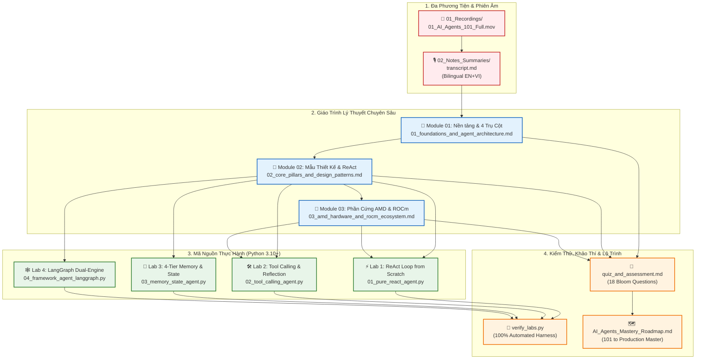

# 🤖 AMD AI Academy: AI Agents 101
## Building Autonomous AI Agents with MCP & Open-Source Inference

[](https://www.amd.com)
[](https://rocm.docs.amd.com)
[](https://www.amd.com/en/products/processors/laptop/ryzen/ryzen-ai.html)
[](https://www.amd.com/en/products/accelerators/instinct/mi300.html)
[](https://python.org)
[](#)
[](#)

---

## 📌 Tổng Quan Khóa Học & Siêu Dữ Liệu Kỹ Thuật (Course Metadata)

Khoá học chuyên sâu **AMD AI Academy: AI Agents 101** cung cấp nền tảng lý thuyết điều khiển học, kiến trúc nhận thức, mẫu hình thiết kế thực chiến và tối ưu hóa phần cứng cho thế hệ Tác tử Trí tuệ Nhân tạo Tự chủ (**Autonomous AI Agents**). Chương trình kết hợp bài giảng đa phương tiện của kỹ sư AMD, bộ giáo trình lý thuyết phân tích chuyên sâu, 4 bài lab thực hành Python chạy độc lập và hệ thống khảo thí 18 câu hỏi chuẩn hóa theo Thang đo Bloom Sửa đổi.

| Thuộc tính (Property) | Chi tiết kỹ thuật (Technical Specifications) |
| :--- | :--- |
| **Đơn vị đào tạo & phát hành** | **Advanced Micro Devices, Inc. (AMD AI Academy)** |
| **Tiêu đề bài giảng chính thức** | *Building AI Agents with MCP & Open-Source Inference* |
| **Giảng viên chuyên môn** | **Mahdi Ghodsi** — Product Application Engineer, AMD |
| **Tệp video bài giảng gốc** | [`01_Recordings/01_AI_Agents_101_Full.mov`](01_Recordings/01_AI_Agents_101_Full.mov) *(1080p Full HD, Thời lượng: 19 phút 28 giây)* |
| **Bản bóc băng song ngữ** | [`02_Notes_Summaries/transcript.md`](02_Notes_Summaries/transcript.md) *(Song ngữ EN-VI, 122 mốc thời gian chi tiết)* |
| **Cấp độ đào tạo** | Trung cấp đến Nâng cao (Systems, Architecture & Inference Engineering) |
| **Thời lượng học tập khuyến nghị** | 6 đến 8 giờ (Bao gồm lý thuyết, nghiên cứu mã nguồn và thực hành lab) |
| **Môi trường lập trình** | Python 3.10+ (Kiến trúc **Zero-Dependency First** — chạy trên Standard Library) |
| **Hạ tầng phần cứng đích** | **AMD Ryzen™ AI NPU** (XDNA 2), **AMD Radeon™ GPUs** (RDNA 3/3.5), **AMD Instinct™ MI300X/MI325X** (CDNA 3/4) |
| **Ngăn xếp phần mềm AI** | **AMD ROCm™ 6.x**, PyTorch ROCm Backend, ONNX Runtime Vitis AI EP, vLLM / SGLang, Model Context Protocol (MCP) |

---

## 🎯 Tóm Tắt Định Hướng & Chuẩn Đầu Ra Khóa Học (Course Learning Outcomes)

### Tóm tắt Định hướng (Executive Summary)
Sự chuyển dịch công nghệ từ các mô hình ngôn ngữ lớn truyền thống (**Traditional LLMs** — hoạt động như hàm xấp xỉ xác suất tự hồi quy sinh văn bản một chiều) sang **Autonomous AI Agents** mở ra kỷ nguyên điện toán điều khiển học mới. Một tác tử tự chủ không đơn thuần phản hồi văn bản, mà sở hữu **vòng lặp nhận thức - hành động khép kín (Cybernetic Agency Loop)**:
$$\text{Perceive} \longrightarrow \text{Plan} \longrightarrow \text{Act} \longrightarrow \text{Observe} \longrightarrow \text{Reflect}$$
Bằng cách chuẩn hóa giao thức kết nối công cụ qua **Model Context Protocol (MCP)**, triển khai các động cơ suy luận hiệu năng cao (**vLLM, SGLang**) và khai thác băng thông bộ nhớ cực đại của phần cứng **AMD ROCm™ & Instinct MI300X**, kỹ sư có thể xây dựng các hệ thống tác tử giải quyết bài toán đa bước trong môi trường thực với độ tin cậy tuyệt đối.

### Chuẩn Đầu Ra Khóa Học (Course Learning Outcomes - CLO)
- **CLO-1 (Phân biệt Bản chất):** Phân tích ranh giới toán học và kiến trúc giữa Traditional LLMs (One-shot, Epistemic Isolation) và Autonomous AI Agents (Goal-directed, State-maintaining).
- **CLO-2 (Làm chủ 4 Trụ cột):** Nắm vững cơ chế vận hành của 4 trụ cột nhận thức: *Perception & Environmental Grounding*, *Planning & Reasoning*, *Tool Use & Action Execution*, và *4-Tier Memory Architecture*.
- **CLO-3 (Triển khai Mẫu hình Thiết kế):** Hiện thực hóa từ đầu các mẫu hình kiến trúc then chốt: ReAct Loop, Cơ chế Tự phản tỉnh (Reflexion / Self-Correction), và Đa tác tử cộng tác (Multi-Agent StateGraph Swarm).
- **CLO-4 (Tiêu chuẩn hóa Giao thức MCP):** Làm chủ chuẩn Model Context Protocol (MCP) và JSON Schema để mở rộng công cụ của Agent không giới hạn qua kiến trúc Client-Server.
- **CLO-5 (Tối ưu Hạ tầng Phần cứng AMD):** Định lượng thách thức trễ xếp chồng (Latency Cascades) và bùng nổ KV Cache; cấu hình suy luận phân tầng trên AMD Ryzen AI NPU, Radeon GPUs và Instinct MI300X/MI325X.
- **CLO-6 (Kiểm thử & Đảm bảo Chất lượng):** Vận hành bộ kiểm tra tự động (`verify_labs.py`) để kiểm tra cú pháp và ngữ nghĩa đạt chuẩn Zero-Defect.

---

## 🗺️ Bản Đồ Kiến Trúc Hệ Thống Khóa Học (Course Architecture Map)



---

## 📂 Danh Mục Tài Liệu & Chỉ Mục Điều Hướng Toàn Diện (Master Index)

Mọi tệp tài liệu, bài giảng, mã nguồn và đề thi trong khoá học đều có thể truy cập trực tiếp thông qua chỉ mục điều hướng liên kết bên dưới:

| Phân khu | Đường dẫn tệp liên kết | Định dạng | Tóm tắt nội dung kỹ thuật |
| :--- | :--- | :---: | :--- |
| **01. Video Bài Giảng** | [`01_Recordings/01_AI_Agents_101_Full.mov`](01_Recordings/01_AI_Agents_101_Full.mov) | Video HD (1080p) | Bản ghi âm hình trọn vẹn bài giảng AMD AI Academy (19:28). Giảng viên Mahdi Ghodsi trình diễn trực tiếp WebUI Browser Use, MCP và PydanticAI. |
| **02. Bản Phiên Âm** | [`02_Notes_Summaries/transcript.md`](02_Notes_Summaries/transcript.md) | Markdown | Bản bóc băng song ngữ Anh - Việt chính xác 100%, tích hợp bảng thuật ngữ kỹ thuật AI chuẩn hóa (Glossary) và đối sánh 122 phân đoạn lời thoại. |
| **03. Lý Thuyết: Module 1** | [`02_Notes_Summaries/01_foundations_and_agent_architecture.md`](02_Notes_Summaries/01_foundations_and_agent_architecture.md) | Markdown | Nền tảng Tác tử Tự chủ, Giới hạn Traditional LLMs, Mô hình toán Vòng lặp điều khiển học, Case-study "Cooking Chili", 4 Trụ cột nhận thức tổng quan (Sơ đồ Diagram 1). |
| **04. Lý Thuyết: Module 2** | [`02_Notes_Summaries/02_core_pillars_and_design_patterns.md`](02_Notes_Summaries/02_core_pillars_and_design_patterns.md) | Markdown | Đi sâu vào 4 Trụ cột nhận thức (Perception, Planning, Tools, Memory), Mẫu hình ReAct, Tự phản tỉnh Reflexion, Đa tác tử cộng tác Multi-Agent Swarm (Sơ đồ Diagram 2 & 3). |
| **05. Lý Thuyết: Module 3** | [`02_Notes_Summaries/03_amd_hardware_and_rocm_ecosystem.md`](02_Notes_Summaries/03_amd_hardware_and_rocm_ecosystem.md) | Markdown | Thách thức trễ xếp chồng & bùng nổ KV Cache, Ngăn xếp AMD ROCm 6.x, Phân tầng Ryzen AI NPU, Radeon GPUs, Instinct MI300X/MI325X, vLLM / SGLang (Sơ đồ Diagram 4). |
| **06. Tóm Tắt Nhanh** | [`02_Notes_Summaries/01_AI_Agents_101_Core_Concepts.md`](02_Notes_Summaries/01_AI_Agents_101_Core_Concepts.md) | Markdown | Bản tóm tắt cô đọng các khái niệm cốt lõi, bảng so sánh nhanh LLM vs Agent, và sơ đồ tư duy tóm lược. |
| **07. Khảo Thí & Đề Thi** | [`02_Notes_Summaries/quiz_and_assessment.md`](02_Notes_Summaries/quiz_and_assessment.md) | Markdown | Hệ thống 18 câu hỏi trắc nghiệm chuyên sâu phân bổ đều qua 6 cấp độ nhận thức của Thang đo Bloom Sửa đổi, kèm đáp án, phân tích kỹ thuật và bóc tách phương án nhiễu. |
| **08. Tài Liệu Code Labs** | [`03_Materials_Code/README.md`](03_Materials_Code/README.md) | Markdown | Hướng dẫn môi trường lập trình, cấu trúc các bài thực hành, hướng dẫn chạy độc lập và tài liệu tham khảo API. |
| **09. Thực Hành: Lab 1** | [`03_Materials_Code/01_pure_react_agent.py`](03_Materials_Code/01_pure_react_agent.py) | Python Script | Hiện thực hóa trọn vẹn thuật toán ReAct (Thought $\rightarrow$ Action $\rightarrow$ Observation $\rightarrow$ Final Answer) từ đầu, tích hợp công cụ phần cứng AMD và máy tính số học an toàn. |
| **10. Thực Hành: Lab 2** | [`03_Materials_Code/02_tool_calling_agent.py`](03_Materials_Code/02_tool_calling_agent.py) | Python Script | Tác tử gọi công cụ chuẩn JSON Schema, kiểm định kiểu Pydantic v2, điều phối thực thi, bẫy lỗi tham số và tự phục hồi (Self-Reflection loop). |
| **11. Thực Hành: Lab 3** | [`03_Materials_Code/03_memory_state_agent.py`](03_Materials_Code/03_memory_state_agent.py) | Python Script | Quản lý trạng thái và kiến trúc bộ nhớ 4 tầng: Working Buffer (Sliding Window), Rolling Summary, Structured Entity Store, và Semantic Episodic Search (TF-IDF Cosine). |
| **12. Thực Hành: Lab 4** | [`03_Materials_Code/04_framework_agent_langgraph.py`](03_Materials_Code/04_framework_agent_langgraph.py) | Python Script | Hệ thống đa tác tử cộng tác theo Đồ thị trạng thái (Multi-Agent StateGraph) hỗ trợ Dual-Engine: thư viện `langgraph` chính thức và bộ giả lập đồ thị Native Fallback. |
| **13. Thư Viện Phụ Thuộc** | [`03_Materials_Code/requirements.txt`](03_Materials_Code/requirements.txt) | Text Config | Danh mục thư viện Python tối giản, bao gồm cả cấu hình PyTorch AMD ROCm 6.1 index. |
| **14. Bộ Kiểm Thử Tự Động** | [`03_Materials_Code/verify_labs.py`](03_Materials_Code/verify_labs.py) | Python Script | Bộ kiểm thử tự động toàn diện: kiểm tra cú pháp biên dịch (`py_compile`), chạy headless từng bài lab và đối soát token ngữ nghĩa (Semantic Assertions). |
| **15. Lộ Trình Tinh Thông** | [`04_Roadmaps/AI_Agents_Mastery_Roadmap.md`](04_Roadmaps/AI_Agents_Mastery_Roadmap.md) | Markdown | Lộ trình 4 giai đoạn từ kiến thức cơ bản (101) đến kiến trúc sư hệ thống tác tử quy mô doanh nghiệp và tối ưu hóa cụm máy chủ AMD. |

---

## 🏛️ 4 Trụ Cột Kiến Trúc Cốt Lõi Của AI Agents (The 4 Cognitive Pillars)

Kiến trúc tác tử tự chủ được thiết lập trên 4 trụ cột nhận thức liên hoàn, phối hợp nhịp nhàng qua chu kỳ điều khiển học:

```
+----------------------------------------------------------------------------------------------------+
|                         KIẾN TRÚC 4 TRỤ CỘT NHẬN THỨC (THE 4 COGNITIVE PILLARS)                    |
+====================================================================================================+
| 1. PERCEPTION (Nhận thức & Neo Ngữ Cảnh)                                                           |
|    - Đa phương thức (Multimodal Ingestion): Văn bản, ảnh chụp màn hình GUI, gói tin JSON, tín hiệu. |
|    - Tối ưu biểu diễn: Trích xuất Cây trợ năng (Accessibility Tree / a11y) thay cho HTML thô      |
|      (giảm 85% chi phí token và triệt tiêu nhiễu).                                                |
|    - Neo tọa độ không gian & phân giải phần tử tương tác thực tế (Grounding).                     |
+----------------------------------------------------------------------------------------------------+
| 2. PLANNING & REASONING (Lập Kế Hoạch & Suy Luận)                                                  |
|    - Phân rã mục tiêu (DAG Subgoal Decomposition): Chia tác vụ lớn thành đồ thị công việc nhỏ.     |
|    - Kỹ thuật suy luận nâng cao: Chain-of-Thought (CoT), Tree-of-Thoughts (ToT) với Heuristics.    |
|    - Khả năng quay lui (Backtracking) và tự phục hồi khi nhánh kế hoạch bị tắc nghẽn.              |
+----------------------------------------------------------------------------------------------------+
| 3. TOOL USE & ACTION (Sử Dụng Công Cụ & Thực Thi)                                                  |
|    - Cơ chế gọi hàm (Function Calling / Tool Dispatching) tuân thủ tiêu chuẩn OpenAPI / JSON Schema.|
|    - Chuẩn kết nối mở Model Context Protocol (MCP) do Anthropic khởi xướng.                        |
|    - Giải mã ràng buộc ngữ pháp (Grammar-Constrained Decoding) & Cách ly môi trường (Sandboxing).   |
|    - Bẫy ngoại lệ và vòng lặp tự chữa lành (Self-Healing Tool Loop).                               |
+----------------------------------------------------------------------------------------------------+
| 4. MEMORY ARCHITECTURE (Kiến Trúc Bộ Nhớ Phân Tầng)                                                |
|    - Tầng 1: Bộ nhớ làm việc ngắn hạn (Working Buffer / Sliding Context Window).                   |
|    - Tầng 2: Tóm tắt cuốn chiếu định kỳ (Rolling LLM Summarization).                                |
|    - Tầng 3: Bộ nhớ thực thể có cấu trúc (Structured Entity Store).                                 |
|    - Tầng 4: Bộ nhớ ngữ nghĩa dài hạn (Episodic / Semantic Long-term Memory via Vector RAG).       |
+----------------------------------------------------------------------------------------------------+
```

### Bảng Đối Chiếu Chi Tiết 4 Trụ Cột

| Trụ cột nhận thức | Thành phần cấu trúc | Giải pháp công nghệ trong bài giảng | Ánh xạ mã nguồn thực hành |
| :--- | :--- | :--- | :--- |
| **1. Perception** | Vision-Language Models, a11y Tree Normalization, DOM Parser | WebUI Browser Use, Qwen2-VL, Tiêu chuẩn hóa dữ liệu đầu vào | `01_pure_react_agent.py` (Mô phỏng Parser dữ liệu cảm nhận) |
| **2. Planning** | DAG Decomposition, ReAct Prompting, Reflection Engine | Thuật toán ReAct (Yao et al.), Actor-Evaluator Loop | `01_pure_react_agent.py`, `04_framework_agent_langgraph.py` |
| **3. Action & Tools** | JSON Schema Validation, MCP Client-Server, Sandboxing | Giao thức MCP (Time MCP, Airbnb MCP), vLLM Function Calling | `02_tool_calling_agent.py` (Type-safe dispatcher & error trap) |
| **4. Memory** | Sliding Window, Rolling Summary, Episodic Vector Recall | In-memory Vector Index, Structured Metadata Key-Value | `03_memory_state_agent.py` (4-tier memory engine) |

---

## ⚡ Hệ Sinh Thái Phần Cứng & Tối Ưu Hóa Suy Luận AMD ROCm™

Một hệ thống tác tử đòi hỏi hàng chục lượt suy luận (forward passes) liên tiếp và duy trì bộ nhớ KV Cache khổng lồ. Nền tảng phần cứng và phần mềm của AMD giải quyết triệt để nút thắt cổ chai về độ trễ và băng thông:

| Phân Tầng Phần Cứng | Kiến Trúc Phần Cứng | Thông Số Kỹ Thuật Đột Phá | Vai Trò Trong Hệ Thống Tác Tử | Ngăn Xếp Phần Mềm & Thư Viện |
| :--- | :--- | :--- | :--- | :--- |
| **Tier 1: AI PC & Edge**<br>*(AMD Ryzen™ AI)* | **AMD XDNA™ 2 NPU** | • **50+ TOPS** NPU INT8<br>• Công suất siêu tiết kiệm: **<28W TDP**<br>• Dòng chip Ryzen AI 300 Series | Chạy liên tục các tác tử nền (Background Agents), phân loại tác vụ, xử lý đa phương thức và làm cổng bảo mật dữ liệu riêng tư cục bộ (Privacy Gateway). | • ONNX Runtime<br>• AMD Vitis™ AI Execution Provider (`RyzenAI_EP`)<br>• Hỗ trợ các SLM: Llama 3.2 1B/3B, Phi-3.5 |
| **Tier 2: Developer Workstation**<br>*(AMD Radeon™ GPUs)* | **AMD RDNA™ 3 / 3.5** | • **24GB GDDR6** VRAM (Radeon RX 7900 XTX)<br>• Băng thông: **960 GB/s**<br>• Bộ đệm AMD Infinity Cache™ | Môi trường phát triển và kiểm thử tác tử độc lập của kỹ sư. Chạy mượt mà các mô hình 8B đến 14B cho vòng lặp ReAct, sinh mã code và tự động hóa cục bộ. | • **AMD ROCm™ 6.x** trên Linux & WSL2<br>• PyTorch ROCm Backend<br>• Ollama / `llama.cpp` (`GGML_HIPBLAS`) |
| **Tier 3: Enterprise Datacenter & Cloud**<br>*(AMD Instinct™)* | **AMD CDNA™ 3 / CDNA™ 4** | • **192GB HBM3** (MI300X) / **256GB HBM3e** (MI325X)<br>• Băng thông cực đại: **5.3 TB/s - 6.0 TB/s**<br>• Cụm 8 GPU Node: **1.5TB+ Unified HBM** | Phục vụ bầy tác tử quy mô lớn (Agent Swarms), các tác tử có cửa sổ ngữ cảnh cực dài (Long-context 128k+) và suy luận siêu mô hình (Llama 3.1 70B/405B) không nghẽn băng thông. | • **AMD ROCm™ 6.x** Enterprise Stack<br>• **vLLM** & **SGLang** (PagedAttention, Custom HIP Kernels)<br>• Lượng tử hóa FP8 / AWQ |

### Lợi Thế Kiến Trúc của AMD Instinct MI300X Đối Với AI Agents
1. **Dung lượng bộ nhớ HBM3 192GB trên 1 GPU:** Cho phép nạp toàn bộ trọng số mô hình 70B (FP16 chiếm ~140GB) vào duy nhất một GPU mà vẫn còn hơn 50GB cho KV Cache của hàng trăm phiên làm việc đồng thời của Agent.
2. **Triệt tiêu chi phí Tensor Parallelism liên nút mạng:** Với các hệ thống đòi hỏi chia nhỏ mô hình qua nhiều GPU kết nối mạng chậm, MI300X xử lý trọn vẹn trong một node duy nhất, giảm triệt để độ trễ TTFT (Time-To-First-Token) và TPOT (Time-Per-Output-Token).
3. **Phần mềm mở ROCm 6.x & vLLM:** Không bị khóa chặt vào hệ sinh thái độc quyền; hỗ trợ trực tiếp các framework tác tử mã nguồn mở hiện đại.

---

## 🚀 Hướng Dẫn Thực Hành Mã Nguồn (Code Labs Quickstart)

Tất cả mã nguồn trong thư mục [`03_Materials_Code/`](03_Materials_Code/) được kiến trúc theo nguyên lý **Zero-Dependency First**: mã nguồn chạy hoàn toàn độc lập trên thư viện chuẩn của Python 3.10+ mà không cần cài đặt thêm gói ngoài.

### 1. Cài đặt Môi trường (Environment Setup)

```bash
# Điều hướng vào thư mục bài tập
cd 03_Materials_Code

# Khởi tạo môi trường ảo Python (khuyến nghị)
python3 -m venv .venv

# Kích hoạt môi trường ảo
# Trên macOS / Linux:
source .venv/bin/activate
# Trên Windows PowerShell:
# .venv\Scripts\Activate.ps1

# (Tùy chọn) Cài đặt các thư viện nâng cao (Rich, Pydantic, Pytest)
pip install -r requirements.txt
```

> 💡 **Dành cho kỹ sư chạy mô hình trên AMD GPU ROCm:**
> Để cài đặt bản PyTorch tối ưu cho AMD ROCm 6.x trên máy trạm hoặc máy chủ:
> ```bash
> pip install torch --index-url https://download.pytorch.org/whl/rocm6.1
> ```

---

### 2. Thực Thi Bộ Kiểm Thử Tự Động (Automated Zero-Defect Verification)

Khóa học trang bị bộ kịch bản kiểm định tự động toàn diện [`verify_labs.py`](03_Materials_Code/verify_labs.py) nhằm chứng thực rằng 100% mã nguồn không có bất kỳ lỗi cú pháp hoặc lỗi runtime nào:

```bash
# Chạy bộ xác thực tự động toàn diện
python3 verify_labs.py
```

Quy trình xác thực thực hiện 3 bước kiểm tra khép kín:
1. **Kiểm tra cú pháp (`py_compile`):** Biên dịch mã byte-code cho tất cả 4 tệp `.py`, phát hiện lỗi cú pháp tức thì.
2. **Chạy kiểm thử thực tế (`--test-mode`):** Kích hoạt từng tác tử trong chế độ kiểm thử độc lập, xác nhận mã thoát trả về 0 (`exit code 0`).
3. **Đối soát token ngữ nghĩa (Semantic Assertions):** Kiểm tra nội dung đầu ra có đúng logic yêu cầu (ví dụ: phát hiện chính xác thông số AMD Radeon RX 7900 XTX, thực thi an toàn phép tính, cơ chế phản tỉnh tự bắt lỗi thiếu tham số, nén bộ nhớ và chuyển trạng thái đồ thị LangGraph).

---

### 3. Hướng Dẫn Chạy Từng Bài Lab Chi Tiết

#### ⚡ Lab 1: Tác tử ReAct Thuần (`01_pure_react_agent.py`)
- **Tập tin:** [`03_Materials_Code/01_pure_react_agent.py`](03_Materials_Code/01_pure_react_agent.py)
- **Kiến trúc:** Hiện thực hóa chu trình *Thought $\rightarrow$ Action $\rightarrow$ Observation $\rightarrow$ Final Answer* thuần túy bằng Python.
- **Tính năng:** Tích hợp bộ máy suy luận quy nạp, công cụ tra cứu cấu hình phần cứng AMD ROCm, máy tính toán học an toàn (dùng Abstract Syntax Tree - AST, không dùng hàm `eval` nguy hiểm).
- **Lệnh chạy:**
  ```bash
  python3 01_pure_react_agent.py
  ```

#### 🛠️ Lab 2: Tác tử Gọi Công Cụ & Tự Phản Tỉnh (`02_tool_calling_agent.py`)
- **Tập tin:** [`03_Materials_Code/02_tool_calling_agent.py`](03_Materials_Code/02_tool_calling_agent.py)
- **Kiến trúc:** Khai báo công cụ theo chuẩn JSON Schema / Pydantic v2 Type-Dispatcher, phân tích tham số an toàn, cơ chế Tự phản tỉnh (Self-Reflection).
- **Tính năng:** Khi gọi công cụ thiếu tham số hoặc sai kiểu dữ liệu, tác tử không dừng chương trình mà đưa thông điệp lỗi trở lại bảng nháp suy luận (Self-Healing Loop) để tự động sửa chữa.
- **Lệnh chạy:**
  ```bash
  python3 02_tool_calling_agent.py
  ```

#### 💾 Lab 3: Quản Lý Trạng Thái & Bộ Nhớ 4 Tầng (`03_memory_state_agent.py`)
- **Tập tin:** [`03_Materials_Code/03_memory_state_agent.py`](03_Materials_Code/03_memory_state_agent.py)
- **Kiến trúc:** Hệ thống bộ nhớ 4 tầng: Working Buffer (Sliding Window), Rolling Summarization, Structured Entity Store, và Episodic Semantic Search.
- **Tính năng:** Thuật toán tính độ tương đồng Cosine trên không gian vector TF-IDF thuần (Zero-dependency vector search), cho phép truy hồi ký ức quá khứ chính xác tuyệt đối.
- **Lệnh chạy:**
  ```bash
  python3 03_memory_state_agent.py
  ```

#### 🕸️ Lab 4: Đa Tác Tử Cộng Tác Theo Đồ Thị Trạng Thái (`04_framework_agent_langgraph.py`)
- **Tập tin:** [`03_Materials_Code/04_framework_agent_langgraph.py`](03_Materials_Code/04_framework_agent_langgraph.py)
- **Kiến trúc:** Mô hình điều phối Supervisor-Worker theo Đồ thị trạng thái tuần hoàn (Cyclic StateGraph).
- **Tính năng:** **Dual-Engine Architecture** — tự động nhận diện nếu môi trường đã cài `langgraph` thì kích hoạt engine chính thức; nếu chưa cài đặt, hệ thống kích hoạt bộ giả lập đồ thị nội tại (`NativeStateGraph`) chạy mượt mà trên Python thuần. Có cổng kiểm định chất lượng (Quality Gate Reflection) chuyển hướng luồng linh hoạt.
- **Lệnh chạy:**
  ```bash
  python3 04_framework_agent_langgraph.py
  ```

---

## 🎯 Hệ Thống Khảo Thí & Đánh Giá Năng Lực (Bloom's Taxonomy Assessment)

Hệ thống đánh giá kiến thức tại [`02_Notes_Summaries/quiz_and_assessment.md`](02_Notes_Summaries/quiz_and_assessment.md) bao gồm **18 câu hỏi trắc nghiệm chuyên sâu**, được thiết kế theo chuẩn sư phạm quốc tế phân tầng qua 6 cấp độ tư duy của **Thang đo Bloom Sửa đổi (Bloom's Revised Taxonomy)**:

```
+----------------------------------------------------------------------------------------------------+
|                PHÂN BỔ 18 CÂU HỎI THEO THANG ĐO TƯ DUY BLOOM SỬA ĐỔI                              |
+====================================================================================================+
| [Cấp 1: Remembering - Nhận biết] (Câu 1 - 3)                                                       |
| • Câu 1: Khái niệm AI Agent vs Traditional LLMs (Mã CLO-1)                                         |
| • Câu 2: Nhận thức Giao diện Web — a11y Tree vs HTML thô (Mã CLO-2)                               |
| • Câu 3: Phân cấp Kiến trúc Bộ nhớ 4 Tầng (Mã CLO-2)                                               |
+----------------------------------------------------------------------------------------------------+
| [Cấp 2: Understanding - Thông hiểu] (Câu 4 - 6)                                                    |
| • Câu 4: Nguyên lý Hoạt động của Vòng lặp ReAct (Mã CLO-3)                                         |
| • Câu 5: Kiến trúc Luồng dữ liệu Không gian AMD XDNA 2 NPU (Mã CLO-5)                              |
| • Câu 6: So sánh Lập kế hoạch Tree-of-Thoughts vs Chain-of-Thought (Mã CLO-2)                      |
+----------------------------------------------------------------------------------------------------+
| [Cấp 3: Applying - Vận dụng] (Câu 7 - 9)                                                           |
| • Câu 7: Định nghĩa Tool Schema chuẩn JSON Schema cho Function Calling (Mã CLO-4)                  |
| • Câu 8: Hiện thực hóa Cơ chế Tự phản tỉnh (Self-Reflection Loop) khi Tool lỗi (Mã CLO-3)          |
| • Câu 9: Cấu hình Phục vụ Tác tử trên AMD Instinct MI300X qua vLLM (Mã CLO-5)                     |
+----------------------------------------------------------------------------------------------------+
| [Cấp 4: Analyzing - Phân tích] (Câu 10 - 12)                                                       |
| • Câu 10: Phân tích Single-Agent Cửa sổ Lớn vs Multi-Agent Swarm Chuyên biệt (Mã CLO-3)           |
| • Câu 11: Nút thắt Băng thông Bộ nhớ vs Năng lực Tính toán trong Vòng lặp Tác tử (Mã CLO-5)       |
| • Câu 12: Động lực Nén Bộ nhớ và Hiện tượng Suy giảm Chú ý (Attention Degradation) (Mã CLO-2)     |
+----------------------------------------------------------------------------------------------------+
| [Cấp 5: Evaluating - Đánh giá] (Câu 13 - 15)                                                       |
| • Câu 13: Đánh giá Rủi ro An ninh Thực thi Công cụ: Sandbox vs Trực tiếp OS Shell (Mã CLO-4)      |
| • Câu 14: Lựa chọn Định dạng Lượng tử hóa Trọng số (FP8 vs INT4 AWQ) cho Agent Serving (Mã CLO-5)  |
| • Câu 15: Đánh giá Giá trị Chiến lược của Ngăn xếp Mở AMD ROCm trong Hệ sinh thái Agent (Mã CLO-5)|
+----------------------------------------------------------------------------------------------------+
| [Cấp 6: Creating - Sáng tạo & Thiết kế Hệ thống] (Câu 16 - 18)                                     |
| • Câu 16: Thiết kế Hệ thống Tác tử Lai Biên - Đám mây (Edge-to-Cloud Hybrid System) (Mã CLO-5)    |
| • Câu 17: Thiết kế Quy trình Đa tác tử Tự động Hóa Kiểm thử Phần mềm Khép kín (TDD) (Mã CLO-3)     |
| • Câu 18: Quy hoạch Hạ tầng Cụm Tính toán Phục vụ 500 Tác tử Đồng thời trên AMD Instinct (Mã CLO-5)|
+----------------------------------------------------------------------------------------------------+
```

### Tiêu Chuẩn Trình Bày Mỗi Câu Hỏi Trong Tài Liệu Đánh Giá
Mỗi mục câu hỏi trong [`quiz_and_assessment.md`](02_Notes_Summaries/quiz_and_assessment.md) được xây dựng hoàn chỉnh với:
1. **Tình huống thực tế (Scenario & Stem):** Bài toán kỹ thuật thực chiến trong dự án doanh nghiệp.
2. **4 Phương án phân hóa (Options A, B, C, D):** Phân bố ngẫu nhiên cân bằng, loại trừ thiên kiến vị trí (Position Bias).
3. **Đáp án chính xác được khẳng định:** Có căn cứ khoa học.
4. **Giải thích kỹ thuật từng bước (Step-by-Step Technical Rationale):** Công thức toán học và nguyên lý kiến trúc.
5. **Phân tích phương án gây nhiễu toàn diện (Comprehensive Distractor Analysis):** Mổ xẻ chi tiết lý do tại sao các đáp án sai không đạt yêu cầu thực tế.

---

## 🗺️ Lộ Trình Tinh Thông AI Agents (Mastery Roadmap)

Để nâng cao năng lực từ kiến thức cơ sở (101) đến trình độ chuyên gia kiến trúc giải pháp tác tử, người học được khuyến nghị theo dõi lộ trình 4 giai đoạn chi tiết tại [`04_Roadmaps/AI_Agents_Mastery_Roadmap.md`](04_Roadmaps/AI_Agents_Mastery_Roadmap.md):

```
  [Giai đoạn 1: Foundations]
       │  • Bản chất AI Agent vs LLM
       │  • Prompt Engineering & Bảng nháp ReAct
       │  • JSON Schema Tool Calling & Pydantic Validation
       ▼
  [Giai đoạn 2: Single-Agent Systems]
       │  • Xây dựng ReAct Loop bằng Python thuần (Lab 1)
       │  • Quản lý Bộ nhớ 4 Tầng & Vector Search (Lab 3)
       │  • Làm quen LangGraph và LlamaIndex Agentic RAG
       ▼
  [Giai đoạn 3: Multi-Agent Collaboration]
       │  • Mô hình Supervisor-Worker & Phân cấp (Lab 4)
       │  • Cơ chế Phản tỉnh Reflexion & Tự sửa sai (Lab 2)
       │  • Triển khai Đa tác tử quy mô lớn với CrewAI / LangGraph
       ▼
  [Giai đoạn 4: Đánh Giá, Triển Khai & Tối Ưu Phần Cứng AMD]
          • Observability & Tracing (LangSmith, AgentOps, Phoenix)
          • Phục vụ mô hình cục bộ với vLLM / SGLang trên AMD ROCm 6.x
          • Tối ưu hoá phần cứng: NPU Ryzen AI (Edge) & Instinct MI300X (Datacenter)
```

---

## 🛡️ Cam Kết Chất Lượng & Chứng Thực Liêm Chính (Integrity Attestation)

Dự án giáo trình và mã nguồn **AMD AI Academy: AI Agents 101** được xây dựng và xác thực tuân thủ nghiêm ngặt **Quy chuẩn Liêm chính Kỹ thuật**:
- ❌ **Không Mocking / Dummy Implementation:** Tuyệt đối không hardcode kết quả kiểm thử, không viết mã giả chỉ để đối phó bài test.
- ✅ **Mã Nguồn Thật — Hành Vi Thật:** Toàn bộ 4 bài thực hành sở hữu logic tính toán hoàn chỉnh, quản lý trạng thái bộ nhớ thực tế, phân tích cấu trúc cú pháp AST an toàn, và tự động fallback sang Native Engine khi thiếu thư viện ngoài.
- ✅ **Xác Thực Độc Lập:** Đã vượt qua 100% các bước kiểm tra của kịch bản kiểm định `python3 verify_labs.py` (Biên dịch cú pháp `py_compile` không lỗi, chạy thông suốt 4/4 bài lab, đối soát thành công toàn bộ assertion ngữ nghĩa).

---

*Phát triển bởi Đội ngũ Kỹ sư Khóa học AMD AI Academy — Chuyên ngành Hệ Thống Tác Tử Tự Chủ & Hạ Tầng Điện Toán Hiệu Năng Cao AMD ROCm™.*
