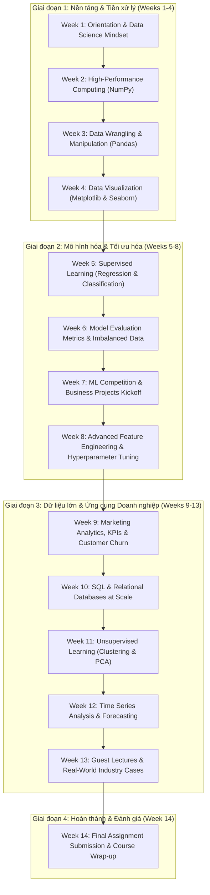

# Báo Cáo Khảo Sát Cấu Trúc Khóa Học & Kho Tài Liệu GCI World 202609
**Dự án:** Tổng Hợp Toàn Bộ Ghi Chú Học Thuật Khóa Học GCI World 202609  
**Người thực hiện:** Explorer 1 (Course Structure Explorer)  
**Ngày hoàn thành:** 20/09/2026 (2026-09-20T15:08:00Z)  
**Đơn vị đào tạo:** Matsuo-Iwasawa Laboratory, Trường Sau đại học Kỹ thuật, Đại học Tokyo (The University of Tokyo)

---

## 1. Tóm Tắt Tổng Quan (Executive Summary)

Khảo sát toàn diện thư mục làm việc `d:\02_Learning_Knowledge\GCI_World_2026_September` đã định vị, kiểm tra và phân tích chi tiết toàn bộ các thành phần tài liệu của khóa học **GCI World (Global Consumer Intelligence / Data Science & AI)** kỳ Fall 2026 (202609).

### Thống Kê Tổng Lượng Tài Liệu Đã Phát Hiện:
1. **Slide thuyết trình chính thức (.pdf):** 11 slide decks với tổng cộng **283 trang** slide bài giảng chuyên sâu.
2. **Jupyter Notebooks (.ipynb):** 12 notebooks với tổng cộng **895 cells** (bao gồm cả mã nguồn thực hành và lời giải mẫu).
3. **Tập dữ liệu mẫu (.csv):** 7 bộ dataset thực tế (dữ liệu giá xe ô tô, dữ liệu phân loại nấm độc, dữ liệu bài tập thực hành).
4. **Bản ghi hình & Ghi chép bài giảng:** 1 video chất lượng cao (.mov, 369 MB), 1 bản bóc băng âm thanh hoàn chỉnh (transcript 809 phân đoạn), và 1 bản Master Notes chi tiết buổi định hướng.
5. **Cẩm nang & Tài liệu thủ tục (.pdf, .docx, .url, .webloc):** 5 tài liệu hướng dẫn nền tảng và 18 file lối tắt điều hướng.

Tất cả tài nguyên học tập đã được phân loại triệt để thành hai nhóm: **(1) Tài liệu thủ tục/hành chính (Procedural/Administrative)** cần loại bỏ theo điều kiện R1; và **(2) Nội dung lý thuyết & mã nguồn cốt lõi (Substantive Learning Topics)** cần được trích xuất thành 5 đến 6 chuyên đề ghi chú học thuật chuẩn hóa.

---

## 2. Bảng Danh Mục Kiểm Kê Chi Tiết (Comprehensive File Inventory)

### 2.1. Nhóm Tài Liệu Học Thuật Cốt Lõi (Substantive Learning Materials)

| Đường dẫn tệp | Định dạng | Quy mô / Số trang / Cells | Nội dung chuyên môn chính |
| :--- | :--- | :--- | :--- |
| `extracted_gci_world/.../02. Preparatory Materials/GCI Basic Learning Materials.docx` | DOCX | 40 đoạn văn | Giới thiệu lộ trình tự học 6 giờ, liên kết danh sách video YouTube bài giảng nền tảng |
| `extracted_gci_world/.../02. Preparatory Materials/0. Opening/prep0_slides.pdf` | PDF | 4 trang | Khung tổng quan chương trình GCI Basic và mục tiêu tiếp cận |
| `extracted_gci_world/.../02. Preparatory Materials/1. What is Data Science_/prep1_slides.pdf` | PDF | 16 trang | Quy trình Data Science, phân loại dữ liệu (định tính/định lượng), EDA, baseline model |
| `extracted_gci_world/.../02. Preparatory Materials/2. Basics of Python/prep2_slides.pdf` | PDF | 21 trang | Cú pháp Python cơ bản, biến, kiểu dữ liệu, danh sách 1D/2D, hàm, phương thức, thư viện |
| `extracted_gci_world/.../02. Preparatory Materials/3. Basics of Statistics/prep3_slides.pdf` | PDF | 19 trang | Thống kê mô tả: Mean, Median, Box Plot, Variance, Standard Deviation, Z-score, Correlation |
| `extracted_gci_world/.../02. Preparatory Materials/4. What is Machine Learning_/prep4_slides.pdf` | PDF | 31 trang | Phân loại ML (Supervised, Unsupervised, RL, LLM), Regression, Classification, Clustering, PCA |
| `extracted_gci_world/.../02. Preparatory Materials/5. Review/prep5_slides.pdf` | PDF | 4 trang | Tổng kết kiến thức nền tảng và lộ trình chuyển tiếp lên bài giảng chính |
| `extracted_gci_world/.../02. Preparatory Materials/6. Exercise_ Regression/Exercise_Regression_Level_0.ipynb` | IPYNB | 63 cells (15 code) | Khái niệm Hồi quy tuyến tính, EDA, tiền xử lý và huấn luyện `LinearRegression` cơ bản |
| `extracted_gci_world/.../02. Preparatory Materials/6. Exercise_ Regression/Exercise_Regression_Level_1.ipynb` | IPYNB | 61 cells (23 code) | Chia tập dữ liệu Train/Test, đánh giá MSE/RMSE và kiểm định chéo K-Fold (`cross_val_score`) |
| `extracted_gci_world/.../02. Preparatory Materials/6. Exercise_ Regression/Exercise_Regression_Level_2.ipynb` | IPYNB | 49 cells (16 code) | Hồi quy đa biến với nhiều đặc trưng, biểu đồ phân tán ma trận (pairplot/heatmap) |
| `extracted_gci_world/.../02. Preparatory Materials/6. Exercise_ Regression/Exercise_Regression_Level_3.ipynb` | IPYNB | 42 cells (13 code) | Tối ưu hóa mô hình hồi quy và giải quyết bài toán thực hành độc lập |
| `extracted_gci_world/.../02. Preparatory Materials/6. Exercise_ Regression/Exercise_Regression_Level_4.ipynb` | IPYNB | 29 cells (9 code) | Chuẩn hóa dữ liệu với `StandardScaler`, quy trình pipeline chống rò rỉ dữ liệu (data leakage) |
| `extracted_gci_world/.../02. Preparatory Materials/7. Exercise_ Classification/Exercise_Classification_Level_0.ipynb` | IPYNB | 56 cells (20 code) | Khái niệm Cây quyết định (`DecisionTreeClassifier`), vẽ cây với `plot_tree`, độ vẩn đục Gini |
| `extracted_gci_world/.../02. Preparatory Materials/7. Exercise_ Classification/Exercise_Classification_Level_1.ipynb` | IPYNB | 76 cells (28 code) | Kết hợp nhiều bảng dữ liệu (`pd.merge`), mã hóa biến phân loại với One-Hot Encoding |
| `extracted_gci_world/.../02. Preparatory Materials/7. Exercise_ Classification/Exercise_Classification_Level_2.ipynb` | IPYNB | 67 cells (24 code) | Phân tích bài toán nấm độc, cân nhắc rủi ro giữa False Positive và False Negative |
| `extracted_gci_world/.../02. Preparatory Materials/7. Exercise_ Classification/Exercise_Classification_Level_3.ipynb` | IPYNB | 52 cells (21 code) | Tinh chỉnh độ sâu cây (`max_depth`) để chống Overfitting và đánh giá mô hình phân loại |
| `extracted_gci_world/.../03. Lecture Materials & Homework/PreLecture_Python1&2/prelecture_slides.pdf` | PDF | 39 trang | Slide tổng quan ngữ pháp Python: Cú pháp, kiểu dữ liệu, Collections, Loops, Functions, Modules |
| `extracted_gci_world/.../03. Lecture Materials & Homework/PreLecture_Python1&2/prelecture_notebook.ipynb` | IPYNB | 259 cells (130 code) | Giáo trình thực hành Python toàn diện 4 phần (Grammar I, II, III, IV) có bài tập tương tác |
| `extracted_gci_world/.../03. Lecture Materials & Homework/PreLecture_Python1&2/prelecture_notebook_answer.ipynb` | IPYNB | 44 cells (23 code) | Lời giải mẫu chuẩn xác cho toàn bộ câu hỏi thực hành của PreLecture Notebook |
| `extracted_gci_world/.../03. Lecture Materials & Homework/Session1/lec1_slides.pdf` | PDF | 34 trang | Buổi 1: Định hướng Data Science, năng lực Data Scientist, khung lộ trình 14 tuần của GCI |
| `extracted_gci_world/.../03. Lecture Materials & Homework/Session2/lec2_slides.pdf` | PDF | 86 trang | Buổi 2: Thao tác dữ liệu hiệu năng cao với NumPy, cấu trúc ndarray, broadcasting, indexing 2D |
| `extracted_gci_world/.../03. Lecture Materials & Homework/Session2/lec2_notebook.ipynb` | IPYNB | 233 cells (97 code) | Notebook thực hành NumPy chuyên sâu: Vectorized ops, boolean indexing, ma trận và đại số tuyến tính |
| `extracted_gci_world/.../03. Lecture Materials & Homework/Session2/HW1 for Session2.ipynb` | IPYNB | 25 cells (6 code) | Bài tập về nhà Tuần 2: Lập trình hàm lọc mảng NumPy chia hết cho 5 và là số lẻ |
| `06_Notes_Transcripts/Lecture_01_Detailed_Notes.md` | Markdown | 136 dòng | Bản tổng hợp học thuật và định hướng cốt lõi Buổi 1 trích xuất từ Video & Slide |
| `06_Notes_Transcripts/transcript_full.md` | Markdown | 1,626 dòng | Bản bóc băng toàn văn Whisper từ bài giảng trực tuyến Buổi 1 (809 phân đoạn) |

### 2.2. Nhóm Tập Dữ Liệu Thực Hành (Datasets)

| Đường dẫn tệp | Số dòng & Cột | Các trường dữ liệu chính | Ứng dụng thực hành |
| :--- | :--- | :--- | :--- |
| `02. Preparatory Materials/6. Exercise_ Regression/data/Car_Price_Data.csv` | 205 dòng, 4 cột | `engine-size`, `city-mpg`, `curb-weight`, `price` | Hồi quy tuyến tính đơn biến & đa biến dự đoán giá xe |
| `02. Preparatory Materials/6. Exercise_ Regression/data/Regression_Lv1_Practice.csv` | 30 dòng, 2 cột | `engine-size`, `price` | Bài tập kiểm tra tự thực hành Hồi quy Cấp độ 1 |
| `02. Preparatory Materials/6. Exercise_ Regression/data/Regression_Lv2_Practice.csv` | 30 dòng, 2 cột | `engine-size`, `price` | Bài tập kiểm tra tự thực hành Hồi quy Cấp độ 2 |
| `02. Preparatory Materials/6. Exercise_ Regression/data/Regression_Lv3_Practice.csv` | 23 dòng, 2 cột | `engine-size`, `price` | Bài tập kiểm tra tự thực hành Hồi quy Cấp độ 3 |
| `02. Preparatory Materials/7. Exercise_ Classification/data/Mushroom_Appearence_Data.csv` | 8,124 dòng, 4 cột | `ID`, `bruises`, `cap_color`, `poison` | Bảng đặc trưng ngoại quan nấm để ghép bảng phân loại |
| `02. Preparatory Materials/7. Exercise_ Classification/data/Mushroom_Odor_Data.csv` | 8,120 dòng, 2 cột | `ID`, `odor` | Bảng đặc trưng mùi hương nấm (khóa ngoại `ID`) |
| `02. Preparatory Materials/7. Exercise_ Classification/data/Classification_Practice.csv` | 30 dòng, 3 cột | `columns1`, `columns2`, `columns3` | Bài tập thực hành kiểm tra Cây quyết định |

---

## 3. Phân Loại Rõ Ràng: Thủ Tục Hành Chính vs. Nội Dung Học Thuật

Tuân thủ nghiêm ngặt **Yêu cầu R1 trong `ORIGINAL_REQUEST.md`** (*"Bỏ qua các tài liệu thủ tục không liên quan"*), toàn bộ các mục sau đây được phân chia cụ thể:

### 3.1. Các Tài Liệu Thủ Tục / Hành Chính (CẦN BỎ QUA KHI VIẾT STUDY NOTES)

1. **Toàn bộ thư mục `01. Student Guide/`**:
   - `Guidelines on the Use of Generative AI, Citation, and Academic Integrity 2.pdf`: Hướng dẫn giới hạn trích dẫn $\le 40\%$, quy định về tính trung thực học thuật, cấm chia sẻ mã nguồn bài thi.
   - `How to submit homework 2.pdf`: Ảnh chụp màn hình nút bấm "HW" và nộp hàm trên Omnicampus.
   - `How to use Google Colab 2.pdf`: Hướng dẫn mở notebook trên Google Drive sang Google Colab.
   - `How to use Omnicampus_Sep2.pdf`: Hướng dẫn đăng nhập LMS, đổi mật khẩu, cấu hình tên hiển thị.
   - `For Specially Invited Non-Student Participants/Initial Setup for Omnicampus...pdf`: Quy trình kích hoạt tài khoản dành riêng cho khách mời đặc biệt.
2. **Toàn bộ thư mục `02_Shortcuts/`**:
   - Các file `.url` và `.webloc` dẫn tới Omnicampus, Zoom, Slack, Notion, Google Drive, Google Sheets Q&A.
3. **Các file ghi chú thủ tục trong `02. Preparatory Materials/`**:
   - Các file `prep0_lecture video.docx` đến `prep5_lecture video.docx` (chỉ chứa một liên kết URL xem video trên YouTube).
4. **Thông tin định danh cá nhân & Quy chế hành chính trong `README.md`**:
   - Thông tin tài khoản Omnicampus cá nhân, quy tắc đặt tên hiển thị trên Slack, thể lệ chấm điểm danh buổi học.
5. **Thư mục giữ chỗ chưa phát hành (Empty Directories)**:
   - `03_Materials/` (thư mục rỗng trên máy gốc).
   - `04_Assignments/` (thư mục rỗng trên máy gốc).
   - `05_Competition/` (thư mục rỗng trên máy gốc).
   - `extracted_gci_world/.../03. Lecture Materials & Homework/Session3/` (chưa phát hành).
   - `extracted_gci_world/.../04. Competition (due XX)/` (chưa phát hành).
   - `extracted_gci_world/.../05. Final Assignment (due XX)/` (chưa phát hành).

### 3.2. Các Nội Dung Học Thuật Cốt Lõi (CẦN TỔNG HỢP VÀO STUDY NOTES THEO R1 - R4)

Các nội dung học thuật được cấu trúc thành **6 Chuyên Đề Trọng Tâm**:
- **Chủ đề 1:** Lập trình Python Cơ bản & Khoa học Dữ liệu (Python Grammar I, II, III, IV).
- **Chủ đề 2:** Thống kê Mô tả & Khám phá Dữ liệu (Descriptive Statistics, EDA & Z-score).
- **Chủ đề 3:** Thao tác Dữ liệu Hiệu năng cao với NumPy (Arrays, Broadcasting, Slicing & Linear Algebra).
- **Chủ đề 4:** Học có giám sát — Hồi quy Tuyến tính & Đánh giá Mô hình (Linear Regression, Cross-Validation & Scaling).
- **Chủ đề 5:** Học có giám sát — Cây Quyết định & Bài toán Phân loại (Decision Trees, One-Hot Encoding & Confusion Matrix).
- **Chủ đề 6:** Toàn cảnh Học máy & Khung Chiến lược Dữ liệu Doanh nghiệp (ML Landscape, Clustering, PCA, LLM & GCI Roadmap).

---

## 4. Bản Đồ Chương Trình Giảng Dạy 14 Tuần (GCI Curriculum Arc)

Được tái cấu trúc từ slide bài giảng `lec1_slides.pdf` (trang 25–32) và bản Master Notes bài giảng:



### Hiện trạng tài liệu tại thời điểm khảo sát:
- **Đã phát hành đầy đủ tài liệu học tập:** Khóa dự bị (Preparatory Materials: Pre-0 đến Pre-7), Buổi 1 (Orientation), PreLecture (Python Grammar), Buổi 2 (NumPy Lecture & HW1).
- **Tài liệu các buổi tiếp theo (Weeks 3–14):** Sẽ được ban tổ chức mở dần hàng tuần theo tiến độ khóa học (thư mục `Session3`, `Competition`, `Final Assignment` hiện đang là thư mục chờ).

---

## 5. Phân Tích Chuyên Sâu Từng Chủ Đề Cho Việc Soạn Ghi Chú Học Thuật

### Chủ Đề 1: Lập Trình Python Cơ Bản (Python Fundamentals for Data Science)
- **Tài liệu nguồn trích xuất:**
  - `02. Preparatory Materials/2. Basics of Python/prep2_slides.pdf`
  - `03. Lecture Materials & Homework/PreLecture_Python1&2/prelecture_slides.pdf`
  - `03. Lecture Materials & Homework/PreLecture_Python1&2/prelecture_notebook.ipynb` (259 cells)
  - `03. Lecture Materials & Homework/PreLecture_Python1&2/prelecture_notebook_answer.ipynb`
- **Lý thuyết cốt lõi cần tóm lược:**
  - Ngữ pháp 1: Biểu thức số học, quy tắc ưu tiên toán tử (`**`, `*`, `/`, `//`, `%`, `+`, `-`), các kiểu dữ liệu nguyên thủy (`int`, `float`, `str`, `bool`), ép kiểu an toàn.
  - Ngữ pháp 2: Cấu trúc dữ liệu có thứ tự và không thứ tự: List (mutable, slicing `[start:stop:step]`, phương thức `.append()`, `.extend()`, `.remove()`), Tuple (immutable), Dictionary (cặp `key:value`, `.keys()`, `.values()`, `.items()`).
  - Ngữ pháp 3: Điều khiển luồng: Rẽ nhánh điều kiện (`if`, `elif`, `else`, toán tử logic `and`, `or`, `not`), Vòng lặp (`for` kết hợp `range()`, duyệt iterable, `enumerate()` lấy chỉ số và giá trị).
  - Ngữ pháp 4: Lập trình hàm theo nguyên tắc DRY (Don't Repeat Yourself), phạm vi biến, nạp thư viện tiêu chuẩn (`math`, `keyword`).
- **Code mẫu tinh hoa cần trích xuất & chú thích:**
  - Kỹ thuật List Comprehension và duyệt từ điển bằng `.items()`.
  - Hàm xử lý dữ liệu tổng quát với tham số mặc định và giá trị trả về dạng Tuple.
- **Sơ đồ Mermaid đề xuất:**
  - Sơ đồ tư duy phân loại các kiểu dữ liệu trong Python (Primitive vs Collections) hoặc Luồng thực thi câu lệnh rẽ nhánh và vòng lặp.
- **Active Recall Flashcards đề xuất (ít nhất 5 câu):**
  - Câu 1: Phân biệt sự khác nhau giữa phép chia `/` và phép chia `//` trong Python?
  - Câu 2: Điểm khác biệt cốt lõi giữa List và Tuple về khả năng thay đổi (mutability) và trường hợp nên dùng Tuple?
  - Câu 3: Làm thế nào để lấy đồng thời cả chỉ số (index) và phần tử khi duyệt vòng lặp qua một danh sách?
  - Câu 4: Phương thức `.items()` trong Dictionary trả về cấu trúc dữ liệu như thế nào?
  - Câu 5: Nguyên tắc DRY là gì và việc viết hàm (function) giải quyết vấn đề này ra sao?

---

### Chủ Đề 2: Thống Kê Mô Tả & Khám Phá Dữ Liệu (Descriptive Statistics & EDA)
- **Tài liệu nguồn trích xuất:**
  - `02. Preparatory Materials/1. What is Data Science_/prep1_slides.pdf`
  - `02. Preparatory Materials/3. Basics of Statistics/prep3_slides.pdf`
  - `03. Lecture Materials & Homework/Session1/lec1_slides.pdf`
  - `06_Notes_Transcripts/Lecture_01_Detailed_Notes.md`
- **Lý thuyết cốt lõi cần tóm lược:**
  - Bản chất của Khoa học Dữ liệu: Chuyển đổi dữ liệu thô thành tri thức hành động; phân loại dữ liệu định lượng (liên tục/rời rạc) vs định tính (danh nghĩa/thứ bậc).
  - Đo lường xu hướng tập trung: Giá trị trung bình (Mean - nhạy cảm với ngoại lai) vs Trung vị (Median - kháng ngoại lai).
  - Đo lường độ phân tán: Phương sai (Variance: $s^2 = \frac{1}{n}\sum(x_i - \bar{x})^2$), Độ lệch chuẩn (Standard Deviation: $\sigma = \sqrt{s^2}$).
  - Trực quan hóa hình dạng phân phối: Biểu đồ Histogram (tần suất), Biểu đồ Hộp (Box Plot: Median, Q1, Q3, IQR, giá trị ngoại lai Outliers).
  - Chuẩn hóa dữ liệu: Biến đổi Z-score ($z = \frac{x - \mu}{\sigma}$) đưa phân phối về trung bình bằng 0, độ lệch chuẩn bằng 1.
  - Phân tích mối quan hệ hai biến: Biểu đồ phân tán (Scatter Plot), Hệ số tương quan Pearson ($r \in [-1, 1]$), Lưu ý quan trọng: Tương quan không đồng nghĩa với Nhân quả (Correlation $\ne$ Causation).
- **Code mẫu tinh hoa cần trích xuất & chú thích:**
  - Tính toán Mean, Median, Variance, Standard Deviation thuần bằng Python và thư viện chuẩn.
  - Công thức tính Z-score và hệ số tương quan giữa hai chuỗi số liệu.
- **Sơ đồ Mermaid đề xuất:**
  - Sơ đồ dòng chảy quy trình Khoa học Dữ liệu (Business Understanding $\rightarrow$ Data Collection $\rightarrow$ EDA $\rightarrow$ Modeling $\rightarrow$ Evaluation).
- **Active Recall Flashcards đề xuất (ít nhất 5 câu):**
  - Câu 1: Khi dữ liệu bị lệch mạnh hoặc có nhiều giá trị ngoại lai cực đoan, đại lượng nào phản ánh xu hướng trung tâm tốt hơn: Mean hay Median? Vì sao?
  - Câu 2: Độ lệch chuẩn (Standard Deviation) đo lường điều gì và đơn vị của nó có quan hệ như thế nào với biến gốc?
  - Câu 3: Một điểm dữ liệu được xác định là ngoại lai (outlier) trên biểu đồ Box Plot khi nó nằm ngoài khoảng nào?
  - Câu 4: Ý nghĩa thực tiễn của việc chuẩn hóa Z-score là gì? Giá trị $z = 2.5$ biểu thị điều gì?
  - Câu 5: Nếu hệ số tương quan $r = 0.85$ giữa lượng kem bán ra và số vụ chết đuối, ta có thể kết luận ăn kem gây chết đuối không? Giải thích hiện tượng biến ẩn (lurking variable).

---

### Chủ Đề 3: Xử Lý Dữ Liệu Hiệu Năng Cao Với NumPy (High-Performance Computing with NumPy)
- **Tài liệu nguồn trích xuất:**
  - `03. Lecture Materials & Homework/Session2/lec2_slides.pdf` (86 trang)
  - `03. Lecture Materials & Homework/Session2/lec2_notebook.ipynb` (233 cells)
  - `03. Lecture Materials & Homework/Session2/HW1 for Session2.ipynb` (25 cells)
- **Lý thuyết cốt lõi cần tóm lược:**
  - Đối tượng `numpy.ndarray`: Cấu trúc mảng đồng nhất kiểu dữ liệu (homogenous), cấp phát bộ nhớ liền kề (contiguous memory layout), tối ưu hóa tính toán ở tầng C/Fortran vượt trội so với danh sách liên kết của Python (`list`).
  - Hàm vạn năng (Universal Functions - ufunc): Thực thi phép toán theo từng phần tử (element-wise) mà không cần dùng vòng lặp `for`.
  - Quy tắc lan truyền (Broadcasting Rules): Tự động mở rộng các chiều có kích thước bằng 1 hoặc vô hướng (scalar) để thực hiện phép tính ma trận không tương thích kích thước.
  - Kỹ thuật truy xuất chỉ số và cắt mảng (Indexing & Slicing):
    - Cắt mảng 1 chiều và đa chiều theo trục (`axis=0`: hàng, `axis=1`: cột).
    - Advanced Integer Indexing (truy xuất phần tử phân tán bằng mảng chỉ số).
    - Boolean Indexing: Lọc mảng bằng mảng điều kiện boolean, kết hợp nhiều điều kiện bằng toán tử bit (`&`, `|`, `~`).
  - Hàm thống kê tổng hợp theo trục: `np.sum(a, axis=0)`, `np.mean(a, axis=1)`, `np.std()`, `np.argmax()`.
  - Đại số tuyến tính chuyên sâu (`numpy.linalg`): Chuyển vị (`.T`), Tích vô hướng & Tích ma trận (`np.dot()`, `@`), Định thức ma trận (`LA.det()`), Nghịch đảo ma trận (`LA.inv()`), Trị riêng và Vectơ riêng (`LA.eig()`).
  - Các hằng số đặc biệt và giá trị khuyết: `np.nan`, `np.inf`, kiểm tra phần tử bất thường với `np.isnan()`.
- **Code mẫu tinh hoa cần trích xuất & chú thích:**
  - So sánh tốc độ tính toán giữa vòng lặp `for` với List vs phép toán véc-tơ hóa trên `np.ndarray`.
  - Cắt mảng 2 chiều và lọc mảng bằng Boolean Masking nhiều điều kiện (áp dụng giải thuật của `HW1 for Session2.ipynb`: `(a % 5 == 0) & (a % 2 != 0)`).
  - Giải hệ phương trình tuyến tính hoặc tính tích ma trận và ma trận nghịch đảo.
- **Sơ đồ Mermaid đề xuất:**
  - Minh họa quy tắc Broadcasting khi cộng một véc-tơ hàng (hoặc cột) vào ma trận 2 chiều.
- **Active Recall Flashcards đề xuất (ít nhất 5 câu):**
  - Câu 1: Tại sao thao tác tính toán trên `np.ndarray` nhanh hơn gấp hàng chục lần so với Python `list`?
  - Câu 2: Điều kiện để hai mảng NumPy có thể áp dụng cơ chế Broadcasting khi thực hiện phép toán là gì?
  - Câu 3: Trong mảng NumPy 2 chiều kích thước $(4, 5)$, cú pháp `a[:, 2]` và `a[1:3, :2]` trích xuất phần tử nào?
  - Câu 4: Khi kết hợp hai điều kiện logic trong Boolean Indexing của NumPy (ví dụ: chia hết cho 5 VÀ là số lẻ), tại sao phải dùng toán tử `&` thay vì `and`?
  - Câu 5: Sự khác biệt giữa toán tử nhân từng phần tử `A * B` và phép nhân ma trận `A @ B` (hoặc `np.dot(A, B)`) là gì?

---

### Chủ Đề 4: Học Có Giám Sát — Hồi Quy Tuyến Tính & Đánh Giá Mô Hình (Regression & Validation)
- **Tài liệu nguồn trích xuất:**
  - `02. Preparatory Materials/4. What is Machine Learning_/prep4_slides.pdf` (trang 7–10, 14–15)
  - `02. Preparatory Materials/6. Exercise_ Regression/Exercise_Regression_Level_0.ipynb` đến `Level_4.ipynb` (5 notebooks)
  - Dữ liệu: `Car_Price_Data.csv` (dự đoán giá xe dựa trên `engine-size`, `curb-weight`, `city-mpg`)
- **Lý thuyết cốt lõi cần tóm lược:**
  - Khái niệm Học có giám sát (Supervised Learning): Biến độc lập/đặc trưng $X$, biến phụ thuộc/nhãn liên tục $y$.
  - Mô hình Hồi quy tuyến tính: Đơn biến ($y = w_1 x + w_0$) và Đa biến ($y = w_0 + w_1 x_1 + \dots + w_p x_p$).
  - Hàm mất mát và Tối ưu hóa: Phương pháp bình phương tối thiểu (Ordinary Least Squares - OLS) tối thiểu hóa tổng phần dư bình phương (Residual Sum of Squares).
  - Đánh giá chất lượng mô hình:
    - Mean Squared Error (MSE) & Root Mean Squared Error (RMSE).
    - Hệ số xác định $R^2$ score (mức độ giải thích của các biến độc lập đối với phương sai của biến phụ thuộc, $R^2 \le 1$).
  - Quy trình tiền xử lý & Phòng chống Rò rỉ dữ liệu (Data Leakage):
    - Chia tách dữ liệu huấn luyện và kiểm thử (`train_test_split`).
    - Chuẩn hóa đặc trưng bằng `StandardScaler`: Chỉ khớp (`.fit_transform()`) trên tập Train, sau đó áp dụng (`.transform()`) lên tập Test.
  - Đánh giá mô hình tin cậy: K-Fold Cross Validation (`KFold`, `cross_val_score`) để đo lường độ ổn định của mô hình trên nhiều tập con dữ liệu.
- **Code mẫu tinh hoa cần trích xuất & chú thích:**
  - Quy trình Scikit-Learn chuẩn: Khởi tạo mô hình, huấn luyện `.fit()`, dự đoán `.predict()`, trích xuất trọng số `.coef_` và hệ số tự do `.intercept_`.
  - Pipeline chuẩn hóa đặc trưng và đánh giá chéo 5-Fold Cross Validation tính điểm $R^2$ trung bình.
- **Sơ đồ Mermaid đề xuất:**
  - Quy trình luồng phân tách dữ liệu Train/Test kết hợp tiền xử lý `StandardScaler` và K-Fold CV để không làm rò rỉ thông tin từ tập Test.
- **Active Recall Flashcards đề xuất (ít nhất 5 câu):**
  - Câu 1: Ý nghĩa của hệ số xác định $R^2 = 0.82$ trong mô hình hồi quy tuyến tính là gì?
  - Câu 2: Tại sao phải gọi `fit_transform()` trên tập Train nhưng chỉ gọi `transform()` trên tập Test khi sử dụng `StandardScaler`?
  - Câu 3: K-Fold Cross Validation hoạt động như thế nào và tại sao nó lại đáng tin cậy hơn việc chỉ chia tập Train/Test một lần duy nhất?
  - Câu 4: Các trọng số hồi quy (Coefficients) trong mô hình tuyến tính phản ánh điều gì về quan hệ giữa biến đầu vào và biến mục tiêu?
  - Câu 5: Điểm yếu lớn nhất của độ đo MSE là gì khi so sánh chất lượng giữa hai mô hình trên hai tập dữ liệu có quy mô mục tiêu khác nhau?

---

### Chủ Đề 5: Học Có Giám Sát — Cây Quyết Định & Bài Toán Phân Loại (Classification & Decision Trees)
- **Tài liệu nguồn trích xuất:**
  - `02. Preparatory Materials/4. What is Machine Learning_/prep4_slides.pdf` (trang 11–13, 16–18)
  - `02. Preparatory Materials/7. Exercise_ Classification/Exercise_Classification_Level_0.ipynb` đến `Level_3.ipynb` (4 notebooks)
  - Dữ liệu: `Mushroom_Appearence_Data.csv`, `Mushroom_Odor_Data.csv` (8,124 mẫu nấm độc/ăn được)
- **Lý thuyết cốt lõi cần tóm lược:**
  - Bài toán Phân loại (Classification): Dự đoán nhãn rời rạc (nhị phân hoặc đa lớp).
  - Thuật toán Cây quyết định (`DecisionTreeClassifier`):
    - Cơ chế phân tách nút: Phân tích đệ quy dựa trên ngưỡng đặc trưng tốt nhất nhằm tối đa hóa mức độ thuần khiết (information gain).
    - Độ đo vẩn đục Gini (Gini Impurity: $I_G(p) = 1 - \sum p_i^2$) và Entropy.
    - Trực quan hóa cây với `plot_tree`: Diễn giải logic luật rẽ nhánh (if-then rules) tường minh của mô hình hộp trắng (white-box model).
  - Tiền xử lý dữ liệu phức hợp:
    - Hợp nhất nhiều nguồn dữ liệu bằng `pd.merge(on='ID', how='inner')`.
    - Mã hóa biến phân loại danh nghĩa sang dạng số với One-Hot Encoding (`pd.get_dummies()`).
  - Đánh giá chất lượng phân loại & Trade-off thực tế:
    - Ma trận nhầm lẫn (Confusion Matrix): TP, TN, FP (Type I Error), FN (Type II Error).
    - Độ chính xác (Accuracy), Precision (Độ chuẩn xác), Recall (Độ thu hồi / Nhạy), F1-Score.
    - Nghiên cứu ca điển hình (Case Study): Trong bài toán phát hiện nấm độc (`poison=1`), việc bỏ sót nấm độc (False Negative) nguy hiểm hơn nhiều so với việc cảnh báo nhầm nấm ăn được là có độc (False Positive) $\rightarrow$ Ưu tiên tối đa hóa Recall.
  - Hiện tượng Quá khớp (Overfitting) và Regularization: Khống chế độ sâu tối đa của cây thông qua siêu tham số `max_depth`.
- **Code mẫu tinh hoa cần trích xuất & chú thích:**
  - Kỹ thuật hợp nhất hai DataFrames bằng `pd.merge()` và chuyển đổi biến phân loại bằng `pd.get_dummies(drop_first=True)`.
  - Huấn luyện `DecisionTreeClassifier(max_depth=3)`, xuất đồ thị cây với `plot_tree` và tính toán Ma trận nhầm lẫn.
- **Sơ đồ Mermaid đề xuất:**
  - Cấu trúc nút cây quyết định phân loại nấm dựa trên đặc trưng mùi (`odor`) và vết bầm (`bruises`) phân tầng sang nhãn Độc / Ăn được.
- **Active Recall Flashcards đề xuất (ít nhất 5 câu):**
  - Câu 1: Độ vẩn đục Gini bằng 0 tại một nút lá thể hiện điều gì?
  - Câu 2: Trong bài toán phân loại nấm độc, việc để sót một cây nấm độc tương ứng với loại lỗi nào trong Ma trận nhầm lẫn (FP hay FN) và chỉ số nào cần được tối ưu?
  - Câu 3: Tại sao Cây quyết định không giới hạn độ sâu (`max_depth=None`) thường dẫn tới hiện tượng Overfitting trầm trọng?
  - Câu 4: Mục đích của kỹ thuật One-Hot Encoding là gì và tại sao ta thường thiết lập tham số `drop_first=True`?
  - Câu 5: Khi nào chỉ số Accuracy (Độ chính xác) trở nên mất giá trị đánh giá trong bài toán phân loại? Đưa ra một ví dụ về dữ liệu mất cân bằng nhãn (imbalanced data).

---

### Chủ Đề 6: Toàn Cảnh Học Máy & Khung Chiến Lược AI Doanh Nghiệp (ML Taxonomy & Industry Strategy)
- **Tài liệu nguồn trích xuất:**
  - `02. Preparatory Materials/4. What is Machine Learning_/prep4_slides.pdf` (trang 19–31)
  - `02. Preparatory Materials/5. Review/prep5_slides.pdf`
  - `03. Lecture Materials & Homework/Session1/lec1_slides.pdf`
  - `06_Notes_Transcripts/Lecture_01_Detailed_Notes.md` & `transcript_full.md`
- **Lý thuyết cốt lõi cần tóm lược:**
  - Bản đồ phân loại toàn cảnh Học Máy: Supervised Learning (Học có giám sát), Unsupervised Learning (Học không giám sát), Reinforcement Learning (Học tăng cường), và Foundation Models / Large Language Models (LLM).
  - Học không giám sát (Unsupervised Learning): Khám phá cấu trúc ẩn không có nhãn trước:
    - Phân cụm (Clustering - ví dụ K-Means): Nhóm khách hàng tương đồng phục vụ phân khúc thị trường (Customer Segmentation).
    - Giảm chiều dữ liệu (Dimensionality Reduction - ví dụ PCA): Rút gọn không gian đặc trưng đa chiều, loại bỏ đa cộng tuyến và trực quan hóa dữ liệu phức tạp.
  - Ứng dụng Học máy trong mô hình ngôn ngữ lớn (LLM):
    - Cơ chế học tự giám sát (Self-supervised Pretraining) trên lượng văn bản khổng lồ.
    - Tinh chỉnh chỉ dẫn (Instruction Fine-Tuning) và Tối ưu theo phản hồi con người (RLHF).
  - Chiến lược Dữ liệu & Lợi thế cạnh tranh (Defensible Moats) thời kỳ AI:
    - Thuyết "Hào lũy SaaS truyền thống sụp đổ": Cơ sở dữ liệu thô không còn là lợi thế độc quyền.
    - "Workflow Integration" & "Data Flywheel": Tích hợp trực tiếp vào quy trình tác nghiệp của người dùng để liên tục sinh dữ liệu mới và hoàn thiện mô hình.
    - Cấu trúc năng lực của một Data Scientist toàn diện: 30–40% kỹ năng lập trình & thuật toán, 60–70% năng lực thấu hiểu kinh doanh (Domain Knowledge), phát hiện bài toán và giao tiếp đàm phán giải pháp.
  - Khung ứng dụng tiếp thị (Marketing Analytics): Liên kết bài toán kinh doanh với chỉ số định lượng KPI (Key Performance Indicator) và KGI (Key Goal Indicator), phân tích churn, giá trị vòng đời khách hàng (LTV).
- **Code mẫu tinh hoa cần trích xuất & chú thích:**
  - Cấu trúc code tổng quát của Unsupervised Learning với Scikit-Learn (`KMeans`, `PCA`).
- **Sơ đồ Mermaid đề xuất:**
  - Sơ đồ tư duy (Mindmap) phân nhánh toàn bộ hệ sinh thái Machine Learning (Supervised, Unsupervised, Reinforcement, Foundation Models).
  - Vòng lặp bánh đà dữ liệu (Data Flywheel) trong tích hợp quy trình làm việc (Workflow Integration).
- **Active Recall Flashcards đề xuất (ít nhất 5 câu):**
  - Câu 1: Điểm khác biệt cơ bản nhất giữa Học có giám sát (Supervised) và Học không giám sát (Unsupervised) là gì?
  - Câu 2: Giảm chiều dữ liệu (Dimensionality Reduction / PCA) mang lại những lợi ích chính nào trong phân tích dữ liệu?
  - Câu 3: Tại sao trong thời đại Foundation Models, việc sở hữu một cơ sở dữ liệu tĩnh (SaaS truyền thống) không còn là hào lũy cạnh tranh bền vững?
  - Câu 4: Khái niệm "Bánh đà dữ liệu" (Data Flywheel) vận hành như thế nào khi AI được nhúng sâu vào quy trình tác nghiệp?
  - Câu 5: Theo Đại học Tokyo và GS. Matsuo, những yếu tố nào chiếm 60–70% năng lực thành công của một Chuyên gia Dữ liệu ngoài việc viết code?

---

## 6. Kiến Trúc Đề Xuất Cho Thư Mục Ghi Chú Học Thuật (`study_notes/`)

Dựa trên cấu trúc đã khảo sát, thư mục ghi chú học tập `d:\02_Learning_Knowledge\GCI_World_2026_September\study_notes` nên được cấu trúc theo 6 module độc lập, hoàn chỉnh, tuân thủ 100% các tiêu chí nghiệm thu (Acceptance Criteria):

```text
d:\02_Learning_Knowledge\GCI_World_2026_September\study_notes/
├── 00_Overview_and_Roadmap.md         # Tổng quan khóa học, quy trình Data Science & Chiến lược AI
├── 01_Python_Basics_and_Grammar.md    # Ngữ pháp Python I-IV, kiểu dữ liệu, hàm và modules
├── 02_Descriptive_Statistics_EDA.md   # Thống kê mô tả, phân phối, chuẩn hóa Z-score & tương quan
├── 03_NumPy_High_Performance.md       # Cấu trúc ndarray, broadcasting, indexing & đại số tuyến tính
├── 04_Supervised_Regression.md        # Hồi quy tuyến tính, K-Fold CV, tiền xử lý & đánh giá mô hình
└── 05_Supervised_Classification.md    # Cây quyết định, ma trận nhầm lẫn, One-Hot Encoding & tối ưu hóa
```

### Bảng Ma Trận Tuân Thủ Yêu Cầu (Acceptance Criteria Alignment):

| Tiêu chí | Quy định chuẩn | Thiết kế triển khai trong từng bản ghi chú |
| :--- | :--- | :--- |
| **R1. Tóm tắt theo chủ đề** | Ghi chú Markdown riêng biệt cho từng chủ đề, bỏ qua tài liệu thủ tục | 6 file Markdown theo 6 chủ đề độc lập, cô đọng lý thuyết từ 283 slide, bỏ qua 100% tài liệu thủ tục |
| **R2. Trích xuất Code Python cốt lõi** | Lọc cú pháp, code quan trọng từ Notebooks đưa vào lý thuyết | Trích xuất các đoạn code mẫu từ 12 notebooks (.ipynb), có chú thích giải thích rõ từng dòng lệnh |
| **R3. Hệ thống Flashcards** | Danh sách câu hỏi Hỏi/Đáp cuối mỗi bài, tối thiểu 5 câu | Mỗi file ghi chú kết thúc bằng 5-8 câu hỏi Flashcard kèm câu trả lời chi tiết theo phương pháp Active Recall |
| **R4. Sơ đồ tư duy trực quan** | Sử dụng Mermaid.js mô tả khái niệm, quy trình | Mỗi file ghi chú chứa ít nhất 1-2 biểu đồ Mermaid (Mindmap, Flowchart, hoặc Class/State Diagram) |
| **Reviewer Verification** | Agent độc lập xác nhận không bị sót đề mục chính | Cung cấp tài liệu kiểm chứng đối chiếu với danh mục 283 slide và 12 notebooks gốc |

---

## 7. Kết Luận Khảo Sát

Toàn bộ tài nguyên của khóa học GCI World 202609 đã được phân loại mạch lạc, chính xác và đầy đủ. Cơ sở dữ liệu tài liệu này hoàn toàn sẵn sàng để chuyển tiếp cho các agent tiếp theo triển khai biên soạn hệ thống ghi chú học thuật chuẩn mực cao nhất.
