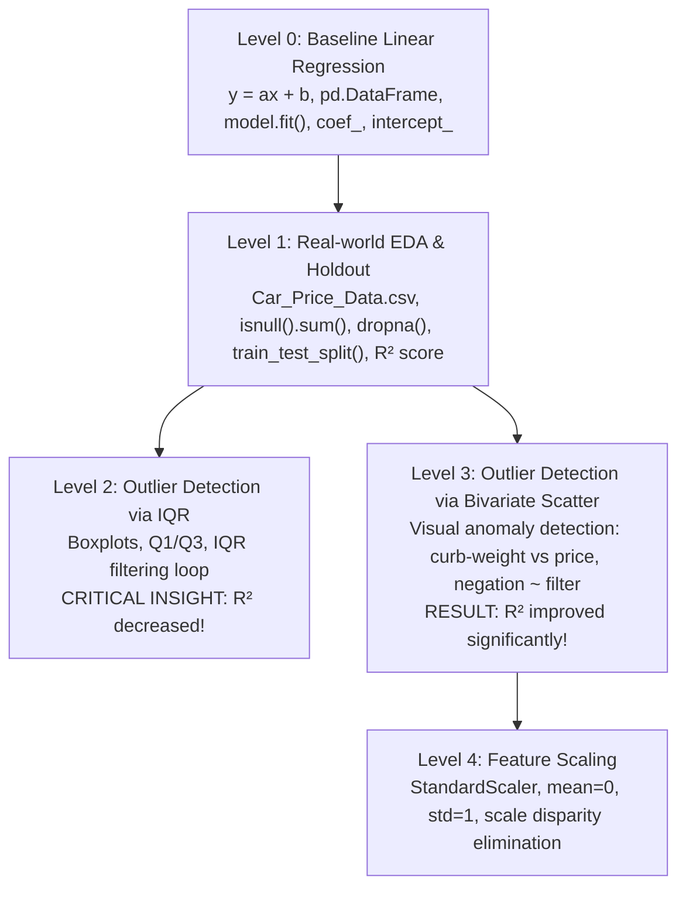
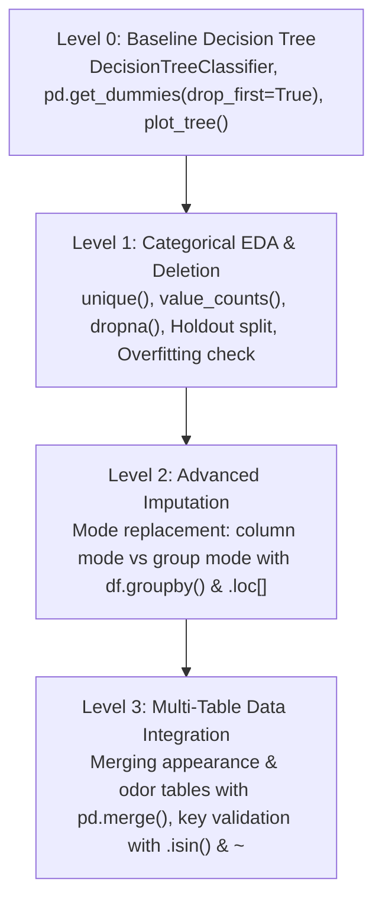
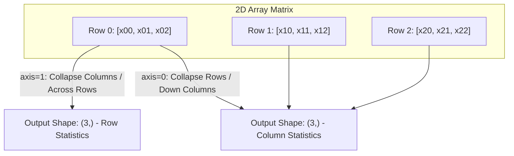

# GCI World 202609 — Comprehensive Jupyter Notebooks & Code Exploration Report

> **Explorer Agent**: Explorer 2 (Notebooks Code Explorer)  
> **Working Directory**: `d:\02_Learning_Knowledge\GCI_World_2026_September\.agents\explorer_survey_2`  
> **Course**: GCI World 2026 September (Global Consumer Intelligence / Data Science & AI)  
> **Institution**: Matsuo-Iwasawa Lab, The University of Tokyo  
> **Target Requirement**: Fulfill **R2 (Trích xuất Code Python cốt lõi)**, support **R1 (Lý thuyết)**, **R3 (Flashcards)**, and **R4 (Sơ đồ Mermaid)**.

---

## 1. Executive Summary & Notebook Inventory

Across the entire workspace `d:\02_Learning_Knowledge\GCI_World_2026_September`, all executable programming materials exist in the form of **13 Jupyter Notebooks (`.ipynb`)** located in `extracted_gci_world/GCI World_202609/`. There are 0 standalone `.py` script files.

The notebooks are systematically organized into **3 distinct educational domains**:
1. **Foundation Programming**: Pre-lecture Python basics (syntax, data structures, loops, functions, mathematical algorithms).
2. **Numerical Computation & Data Manipulation**: Lecture Session 2 (NumPy array architecture, vectorization, indexing/slicing, broadcasting, linear algebra) and Homework 1 (Omnicampus autograded array filtering assignment).
3. **Machine Learning Guided Practicum**: Scaffolded regression (Levels 0–4) and classification (Levels 0–3) exercises illustrating end-to-end supervised learning workflows, data cleaning, outlier handling trade-offs, imputation strategies, multi-table joins, and model evaluation.

### Complete Inventory of All 13 Notebooks

| # | Notebook Relative Path | Topic / Domain | Total Cells | MD / Code | Primary Libraries | Datasets Used |
|---|------------------------|----------------|-------------|-----------|-------------------|---------------|
| 1 | `03. Lecture Materials & Homework/PreLecture_Python1&2/prelecture_notebook.ipynb` | Python Grammar I–IV | 259 | 129 / 130 | `math`, `keyword` | Synthetic / in-memory |
| 2 | `03. Lecture Materials & Homework/PreLecture_Python1&2/prelecture_notebook_answer.ipynb` | Solutions to PreLecture Exercises | 44 | 21 / 23 | Built-in Python | In-memory |
| 3 | `03. Lecture Materials & Homework/Session2/lec2_notebook.ipynb` | NumPy High-Performance Data Manipulation | 233 | 136 / 97 | `numpy`, `time` | NOAA Climate Sample (`GHCND_sample_csv.csv`) |
| 4 | `03. Lecture Materials & Homework/Session2/HW1 for Session2.ipynb` | Homework 1: NumPy Array Filter Function | 25 | 19 / 6 | `numpy` | In-memory 1D arrays |
| 5 | `02. Preparatory Materials/6. Exercise_ Regression/Exercise_Regression_Level_0.ipynb` | Regression Level 0: Baseline Linear Regression | 63 | 48 / 15 | `pandas`, `sklearn` | In-memory `car_test_data.csv` |
| 6 | `02. Preparatory Materials/6. Exercise_ Regression/Exercise_Regression_Level_1.ipynb` | Regression Level 1: EDA, Missing Values, Holdout | 61 | 38 / 23 | `pandas`, `matplotlib`, `sklearn` | `Car_Price_Data.csv` (206 rows), `Regression_Lv1_Practice.csv` |
| 7 | `02. Preparatory Materials/6. Exercise_ Regression/Exercise_Regression_Level_2.ipynb` | Regression Level 2: Outliers via Boxplot & IQR | 49 | 33 / 16 | `pandas`, `matplotlib`, `sklearn` | `Car_Price_Data.csv`, `Regression_Lv2_Practice.csv` |
| 8 | `02. Preparatory Materials/6. Exercise_ Regression/Exercise_Regression_Level_3.ipynb` | Regression Level 3: Outliers via Scatter Plot Filter | 42 | 29 / 13 | `pandas`, `matplotlib`, `sklearn` | `Car_Price_Data.csv`, `Regression_Lv3_Practice.csv` |
| 9 | `02. Preparatory Materials/6. Exercise_ Regression/Exercise_Regression_Level_4.ipynb` | Regression Level 4: Feature Scaling (StandardScaler) | 29 | 20 / 9 | `pandas`, `sklearn` | `Car_Price_Data.csv`, `Regression_Lv1_Practice.csv` |
| 10 | `02. Preparatory Materials/7. Exercise_ Classification/Exercise_Classification_Level_0.ipynb` | Classification Level 0: Decision Tree Baseline | 56 | 36 / 20 | `pandas`, `sklearn` | In-memory `Mushroom_Appearence_Data.csv` |
| 11 | `02. Preparatory Materials/7. Exercise_ Classification/Exercise_Classification_Level_1.ipynb` | Classification Level 1: EDA, Deletion, One-Hot Dummy | 76 | 48 / 28 | `pandas`, `matplotlib`, `sklearn` | `Mushroom_Appearence_Data.csv` (8,125 rows) |
| 12 | `02. Preparatory Materials/7. Exercise_ Classification/Exercise_Classification_Level_2.ipynb` | Classification Level 2: Imputation (Global & Group Mode) | 67 | 43 / 24 | `pandas`, `sklearn` | `Mushroom_Appearence_Data.csv` |
| 13 | `02. Preparatory Materials/7. Exercise_ Classification/Exercise_Classification_Level_3.ipynb` | Classification Level 3: Multi-Table Merge & Validation | 52 | 31 / 21 | `pandas`, `sklearn` | `Mushroom_Appearence_Data.csv` (8,125 rows), `Mushroom_Odor_Data.csv` (8,121 rows) |

---

## 2. Module A: Python Core Programming (PreLecture Python 1 & 2)

### 2.1 Scope & Curriculum Overview
The pre-lecture materials cover foundational Python programming divided into four structured chapters:
- **Chapter 1: Python Grammar I** — Variables, basic types (`int`, `float`, `str`, `bool`), operators (arithmetic, precedence), type casting, string formatting.
- **Chapter 2: Python Grammar II** — Built-in collections: `list`, `tuple`, `dict`, multi-dimensional indexing, slicing notation `[start:stop:step]`, mutation vs immutability.
- **Chapter 3: Python Grammar III** — Control flow: conditional branching (`if`, `elif`, `else`), boolean logic (`and`, `or`, `not`), loops (`for` with `range()`, iterating collections, `enumerate()`, `break`).
- **Chapter 4: Python Grammar IV** — Function definition (`def`, positional, default, keyword args), standard libraries (`math`, `keyword`).

### 2.2 Core Code Patterns to Extract (per Requirement R2)

#### Pattern A1: Slicing Semantics & String/List Indexing
Python uses zero-based indexing and half-open intervals `[start:stop)` where `start` is included but `stop` is excluded. Negative indices count backward from `-1`.

```python
# Slicing notation: sequence[start:stop]
text = "Apple"
part = text[0:3]  # Indices 0, 1, 2 -> 'App' (index 3 is excluded)

# Negative indexing and omissible bounds
numbers = [10, 20, 30, 40, 50]
print(numbers[1:3])   # [20, 30] (elements at index 1 and 2)
print(numbers[:-1])   # [10, 20, 30, 40] (all elements except the last)
print(numbers[:])     # Shallow copy of the full list
```

#### Pattern A2: Type Conversion & Boolean Arithmetic Nuance
Boolean values inherit from integers in Python (`True == 1`, `False == 0`). Any non-zero numeric value evaluates to `True`, while `0` and `0.0` evaluate to `False`.

```python
# Numeric to bool and vice-versa
print(int(True))    # 1
print(int(False))   # 0
print(bool(2))      # True (any non-zero integer is True)
print(bool(0.0))    # False

# Parity check using modulo and boolean conversion
x = 5
is_odd = bool(x % 2)  # 5 % 2 == 1 -> bool(1) -> True
print(is_odd)         # True
```

#### Pattern A3: Dictionary Manipulation
Dictionaries store key-value associations with fast $O(1)$ lookups:

```python
# Dictionary definition and operations
menu = {'apple': 100, 'banana': 80, 'orange': 120}
price_apple = menu['apple']     # Lookup: 100
menu['grape'] = 150             # Add/Update key
del menu['apple']               # Delete key-value pair

keys_list = list(menu.keys())   # Extract keys
values_list = list(menu.values()) # Extract values
```

#### Pattern A4: Function Definitions & Flexible Arguments
```python
# Default arguments and keyword invocations
def power(x=1, y=1):
    """Computes x raised to the power of y."""
    return x ** y

print(power(2, 3))        # Positional: 8
print(power(y=2, x=3))    # Keyword arguments: 9
print(power(x=3))         # Uses default y=1: 3
```

### 2.3 Mathematical & Algorithmic Problem Implementations

#### Problem 1: The Collatz Conjecture Simulation (Cell 28–29, PreLecture Answer)
Given an integer $a_1 > 0$, the sequence is generated by:
$$a_{n+1} = \begin{cases} a_n / 2 & \text{if } a_n \text{ is even} \\ 3a_n + 1 & \text{if } a_n \text{ is odd} \end{cases}$$
The task is to determine the minimal number of steps required to reach $1$.

```python
def collatz_steps(a):
    """Calculates number of steps for Collatz sequence to reach 1."""
    n = 0
    while a != 1:
        if a % 2 == 0:
            a = a // 2  # Integer division
        else:
            a = 3 * a + 1
        n += 1
    return n

print(f"Steps for a=7: {collatz_steps(7)}")    # Output: 16 steps
print(f"Steps for a=31: {collatz_steps(31)}")  # Output: 106 steps
```

#### Problem 2: Manual Reverse without Built-in `reversed()` or `[::-1]`
```python
def reverse_list(x):
    """Reverses a list manually using negative index loop."""
    y = []
    for i in range(len(x)):
        y.append(x[-i - 1])
    return y

print(reverse_list([3, 9, 7, 1, 0]))  # [0, 1, 7, 9, 3]
```

#### Problem 3: Finding Maximum Element without `max()`
```python
def find_max(x):
    """Finds maximum value in list using linear scan."""
    largest = x[0]
    for val in x[1:]:
        if val > largest:
            largest = val
    return largest
```

---

## 3. Module B: Numerical Computing with NumPy (Session 2 & HW1)

### 3.1 Motivation: Python Lists vs NumPy ndarrays
`lec2_notebook.ipynb` establishes two critical advantages of NumPy:
1. **Expressive Convenience**: Eliminates verbose `for` loops for element-wise and multi-array math via vectorization.
2. **Computational Performance**: Implemented in contiguous C arrays. A benchmark in Cell 66 demonstrates:
   - Summing elements in a Python list of $10^6$ floats takes ~50–80 ms.
   - Vectorized `np.sum` on `np.ndarray` takes ~0.5–1 ms (>50x speedup).

### 3.2 Key NumPy Syntax & Architectural Patterns

#### 1. Universal Functions (ufunc) & Zero-Safe Operations
Standard Python raises `ZeroDivisionError: division by zero`. In contrast, NumPy's vectorized division by zero produces `inf` or `nan` and issues a `RuntimeWarning` without terminating the process.

```python
import numpy as np

# Zero-safe logarithmic transformations
# np.log(0) -> -inf. To avoid this for non-negative data with zeros (e.g. precipitation):
prcp = np.array([0.0, 5.2, 0.0, 12.8])
log_prcp = np.log1p(prcp)  # Computes ln(1 + x), log1p(0) = 0.0
inv_prcp = np.expm1(log_prcp)  # Inverse: exp(x) - 1, perfectly recovers prcp
```

#### 2. Broadcasting Rules
Broadcasting enables arithmetic between arrays of different shapes by conceptually stretching dimensions of size 1 or scalar values:
- Rule 1: If arrays differ in number of dimensions, the shape of the one with fewer dimensions is padded with ones on its leading (left) side.
- Rule 2: If shape along a dimension does not match, but one array has dimension size 1, that dimension is stretched to match the other.

```python
# 2D array (shape: 3, 3) + 1D array (shape: 3,)
A = np.array([[10, 20, 30],
              [40, 50, 60],
              [70, 80, 90]])
v = np.array([1, 2, 3])  # Broadcasted across each row
result = A + v
# [[11, 22, 33],
#  [41, 52, 63],
#  [71, 82, 93]]
```

#### 3. Axis Semantics in Multi-Dimensional Reductions
- `axis=0`: Collapses along columns (operates down the rows $\downarrow$, outputs 1 value per column).
- `axis=1`: Collapses along rows (operates across columns $\rightarrow$, outputs 1 value per row).

```python
X = np.array([[1, 2, 3],
              [4, 5, 6]])
col_means = np.mean(X, axis=0)  # Shape (3,): [2.5, 3.5, 4.5]
row_means = np.mean(X, axis=1)  # Shape (2,): [2.0, 5.0]
```

#### 4. Boolean Masking & Compound Filtering
```python
jan_tmax = np.array([5.2, -12.1, -15.0, 3.0, -11.5])
jan_prcp = np.array([0.0, 2.5, 0.0, 0.0, 1.2])

# Compound boolean indexing with bitwise operators &, |, ~
# Note: Parentheses around each condition are MANDATORY due to operator precedence
cold_and_dry = (jan_tmax < -10) & (jan_prcp == 0)
selected_temps = jan_tmax[cold_and_dry]  # [-15.0]
```

#### 5. Linear Algebra & Random Distributions
```python
from numpy import linalg as LA

A = np.array([[1, 2], [3, 4]])
det_A = LA.det(A)           # Determinant: -2.0
inv_A = LA.inv(A)           # Matrix inverse
norm_v = LA.norm([3, 4])    # L2 Norm: 5.0

# Matrix multiplication: np.matmul(A, B) or modern @ operator
prod = A @ inv_A            # Identity matrix (within float precision)

# Reproducible random generation
np.random.seed(42)
uniform_data = np.random.rand(5, 5)        # U[0, 1)
normal_data = np.random.randn(100, 3)      # Standard Normal N(0, 1)
int_data = np.random.randint(0, 10, size=5) # Discrete uniform [0, 10)
```

### 3.3 Homework 1 Assignment Analysis (`HW1 for Session2.ipynb`)

- **Objective**: Complete the function `homework(a)` to filter a 1D NumPy integer array.
- **Specification**: Return all elements that are simultaneously **multiples of 5** and **leave a remainder of 1 when divided by 2 (odd)**.
- **Function Signature**: `homework(a: np.ndarray) -> np.ndarray`
- **Canonical Implementation**:
  ```python
  import numpy as np

  def homework(a):
      """Filters 1D numpy array for elements that are multiples of 5 and odd."""
      condition = (a % 5 == 0) & (a % 2 == 1)
      return a[condition]
  ```
- **Test Cases & Expected Outputs**:
  - `Test Case 1`: `a = np.array([1, 5, 10, 3, 4, 25, 30])` $\rightarrow$ `[5, 25]` (10 and 30 are even multiples of 5, excluded).
  - `Test Case 2`: `a = np.array([11, 15, 20, 21, 35, 40, 45])` $\rightarrow$ `[15, 35, 45]`.
  - `Test Case 3`: `a = np.array([2, 4, 6, 8])` $\rightarrow$ `[]` (empty array `np.array([], dtype=int)`).
- **Submission Protocol**: Code is submitted directly into Omnicampus text submission box and evaluated automatically by the autograder.

---

## 4. Module C: Supervised Learning — Regression Workflow (Levels 0–4)

The five Regression exercise notebooks form a deliberate step-by-step learning progression using automobile specifications to predict car prices (`price`).



### 4.1 Detailed Breakdown of Each Level

#### Level 0: Baseline Linear Regression (`Exercise_Regression_Level_0.ipynb`)
- **Dataset**: Created in-memory with 4 rows (`width`, `engine-size`) predicting `price`.
- **Pandas Methods**: `pd.DataFrame()`, renaming columns `df.rename(columns={...})`, exporting `df.to_csv(..., index=False)`, reading `pd.read_csv()`.
- **Model**: `sklearn.linear_model.LinearRegression`.
- **Extraction**: Extracting coefficients and intercept:
  ```python
  from sklearn.linear_model import LinearRegression

  model = LinearRegression()
  model.fit(X, y)
  print(f"Coefficients (weights): {model.coef_}")
  print(f"Intercept (bias): {model.intercept_}")
  ```

#### Level 1: Exploratory Data Analysis & Holdout Evaluation (`Exercise_Regression_Level_1.ipynb`)
- **Dataset**: `Car_Price_Data.csv` (206 rows, features: `engine-size`, `curb-weight`, `city-mpg`, target: `price`).
- **Data Inspection**: `len(df)`, `df.head(10)`, `df.tail(10)`, `df.isnull().sum()`, `df.describe()`.
- **Visualization**: `plt.scatter(df['engine-size'], df['price'])`, `plt.scatter(df['curb-weight'], df['price'])`.
- **Missing Value Handling**: Listwise deletion `df_drop = df.dropna()`.
- **Validation**: Holdout splitting with `train_test_split(X, y, test_size=0.2, random_state=...)`. Evaluates model on unseen test data using $R^2$ score (`model.score(x_test, y_test)`).

#### Level 2: Univariate Outlier Detection via IQR (`Exercise_Regression_Level_2.ipynb`)
- **Concept**: Interquartile Range ($IQR = Q3 - Q1$). Outliers defined as values outside $[Q1 - 1.5 \times IQR, Q3 + 1.5 \times IQR]$.
- **Implementation**:
  ```python
  desc = df.describe()
  Q1 = desc.loc['25%']
  Q3 = desc.loc['75%']
  IQR = Q3 - Q1
  lower_bound = Q1 - 1.5 * IQR
  upper_bound = Q3 + 1.5 * IQR

  # Column-by-column filtering in a loop
  columns = ['engine-size', 'curb-weight', 'city-mpg']
  for col in columns:
      df = df[(df[col] >= lower_bound[col]) & (df[col] <= upper_bound[col])]
  ```
- **Crucial Pedagogical Takeaway**: When retrained on this outlier-removed data, the **$R^2$ score decreased** compared to Level 1! This directly teaches students that mechanical univariate outlier deletion is not a universal panacea and can eliminate valid extreme data points, thereby degrading the model's generalizability.

#### Level 3: Bivariate Visual Outlier Detection (`Exercise_Regression_Level_3.ipynb`)
- **Concept**: Rather than univariate IQR filtering, inspect 2D scatter plots (`curb-weight` vs `price`) to find anomalies that violate the joint physical relationship (e.g. low weight but extremely high luxury price).
- **Implementation**:
  ```python
  # Identification of anomalies in scatter plot
  # Notice the bitwise negation operator ~ to keep normal data
  is_anomaly = (df['curb-weight'] <= 3000) & (df['price'] >= 30000)
  df = df[~is_anomaly]

  # Additional domain filtering
  df = df[df['city-mpg'] <= 40]
  ```
- **Pedagogical Takeaway**: Evaluating the model after scatter-based cleaning yields a **higher average $R^2$ score** than both Level 1 (raw) and Level 2 (IQR), proving the value of targeted, visual domain inspection.

#### Level 4: Feature Scaling with StandardScaler (`Exercise_Regression_Level_4.ipynb`)
- **Motivation**: Features have drastically different units and scales (`engine-size` ~130, `curb-weight` ~2500, `city-mpg` ~25). Differences in scale affect gradient optimization and coefficient interpretability.
- **Implementation**:
  ```python
  from sklearn.preprocessing import StandardScaler
  from sklearn.model_selection import train_test_split
  from sklearn.linear_model import LinearRegression

  features = ['engine-size', 'curb-weight', 'city-mpg']
  scaler = StandardScaler()
  # Fit on training features and transform
  df_scaled = df.copy()
  df_scaled[['engine-size std', 'curb-weight std', 'city-mpg std']] = scaler.fit_transform(df[features])

  # Verifying that mean is ~0 and std is ~1
  print(df_scaled[['engine-size std', 'curb-weight std', 'city-mpg std']].describe().loc[['mean', 'std']])
  ```

---

## 5. Module D: Supervised Learning — Classification Workflow (Levels 0–3)

The four Classification exercise notebooks use the famous Mushroom dataset to predict whether a mushroom is poisonous (`poison`) using morphological and olfactory features.



### 5.1 Detailed Breakdown of Each Level

#### Level 0: Baseline Decision Tree (`Exercise_Classification_Level_0.ipynb`)
- **Dataset**: Toy mushroom data (`bruises`, `odor`, target: `poison`).
- **Categorical Preprocessing**: Dummy variable encoding using `pd.get_dummies(df, drop_first=True, dtype=int)`. Explains that binary categories require only 1 indicator column.
- **Model & Visualization**:
  ```python
  from sklearn.tree import DecisionTreeClassifier, plot_tree
  import matplotlib.pyplot as plt

  model = DecisionTreeClassifier()
  model.fit(x, t)
  accuracy = model.score(x, t)

  # Visualizing the tree structure
  plt.figure(figsize=(10, 6))
  plot_tree(model, feature_names=x.columns, class_names=['Edible', 'Poison'], filled=True)
  plt.show()
  ```

#### Level 1: Categorical EDA, Missing Deletion & Holdout (`Exercise_Classification_Level_1.ipynb`)
- **Dataset**: `Mushroom_Appearence_Data.csv` (8,125 rows).
- **Data Understanding**:
  - `df['cap_color'].unique()`: Identifies 10 color categories.
  - `df[['bruises', 'poison']].value_counts()`: Cross-frequency table of features and target.
  - Bar graph visualization of contingency distributions.
- **One-Hot Encoding**: `pd.get_dummies(df['cap_color'], drop_first=True, dtype=int)` converts 10 categories into 9 binary columns (dropping 1 base category to prevent multicollinearity).
- **Missing Value Handling**: `df_drop = df.dropna()`.
- **Holdout Validation**: Compares `model.score(x_train, y_train)` with `model.score(x_test, y_test)` to introduce the concept of **overfitting** (high training accuracy vs lower generalization performance).

#### Level 2: Imputation Strategies for Missing Data (`Exercise_Classification_Level_2.ipynb`)
Addresses how to retain valuable sample size when dropping rows with missing values is undesirable.
- **Method 1: Global Column Mode Imputation**:
  ```python
  # Find the most frequent category (mode)
  top_mode = df['bruises'].describe()['top']
  df_fill = df.copy()
  df_fill['bruises'] = df_fill['bruises'].fillna(top_mode)
  ```
- **Method 2: Conditional / Group-Based Mode Imputation**:
  Instead of imputing a single global mode, compute the mode within each subgroup (e.g. within each `cap_color` category):
  ```python
  # Compute mode of bruises for each cap_color group
  group_modes = df.groupby('cap_color')['bruises'].describe()['top']

  # Impute missing bruises conditionally using .loc and boolean masks
  is_null = df['bruises'].isnull()
  for color in df['cap_color'].unique():
      mask = (df['cap_color'] == color) & is_null
      df.loc[mask, 'bruises'] = group_modes[color]
  ```

#### Level 3: Multi-Table Data Integration & Relational Joins (`Exercise_Classification_Level_3.ipynb`)
- **Dataset**: `Mushroom_Appearence_Data.csv` (8,125 rows) and `Mushroom_Odor_Data.csv` (8,121 rows).
- **Relational Joins**:
  - `pd.merge(df1, df2, how='inner')`: Retains only rows present in both tables.
  - `pd.merge(df1, df2, how='left')`: Preserves all appearance records, introducing `NaN` for IDs not present in odor data.
- **Key Validation with `.isin()` and Negation `~`**:
  ```python
  # Find which IDs in df1 are missing from df2
  id_in_df2 = df1['ID'].isin(df2['ID'])
  missing_ids = df1.loc[~id_in_df2, 'ID']
  print(f"Number of unmapped IDs: {len(missing_ids)}")
  ```
- **End-to-End Evaluation**: Train/test split and Decision Tree evaluation on the merged multi-table dataset.

---

## 6. Comprehensive Code Library & Syntax Reference Sheet

This master reference catalog details the essential APIs, syntax, and arguments across the notebooks for rapid incorporation into study notes.

### 6.1 NumPy Essential Operations

| Function / Syntax | Arguments / Pattern | Exact Purpose in Course |
|---|---|---|
| `np.array(object)` | `[1, 2, 3]` | Construct 1D/2D arrays from Python lists |
| `a.tolist()` | None | Convert `np.ndarray` back to native Python list |
| `np.log1p(x)` | `x` (array) | Compute $\ln(1 + x)$ to avoid $\ln(0) = -\infty$ for zero precipitation |
| `np.expm1(x)` | `x` (array) | Inverse of `log1p`, computes $e^x - 1$ |
| `np.mean(X, axis=0)` | `axis=0` (columns), `axis=1` (rows) | Compute mean along specified reduction axis |
| `np.std(X, axis=0)` | `axis=0` or `1` | Compute standard deviation |
| `np.min(X)`, `np.max(X)` | `axis` optional | Global or axis-wise extreme values |
| `np.concatenate((a, b))` | Tuple of arrays | Concatenate arrays along axis 0 |
| `(cond1) & (cond2)` | Bitwise `&`, `|`, `~` | Compound boolean indexing; requires parentheses around each subcondition |
| `np.ix_([r1, r2], [c1, c2])` | Row indices, Col indices | Mesh indexing for selecting cross-product submatrices |
| `np.random.seed(s)` | `seed=32` | Ensure deterministic random number generation |
| `np.random.rand(d0, d1)` | Dimensions | Uniform distribution on $[0, 1)$ |
| `np.random.randn(d0, d1)` | Dimensions | Standard Normal distribution $\mathcal{N}(0, 1)$ |
| `np.random.normal(loc, scale)` | Mean, std dev | Normal distribution with custom parameters |
| `np.random.randint(low, high)` | Boundaries | Discrete uniform random integers |
| `np.matmul(A, B)` or `A @ B` | 2D matrices | True matrix multiplication |
| `np.linalg.det(A)` | Square matrix | Determinant of square matrix |
| `np.linalg.norm(x)` | Vector or matrix | Euclidean (L2) norm |
| `np.linalg.inv(A)` | Invertible matrix | Matrix inversion |

### 6.2 Pandas Essential Operations

| Function / Method | Typical Syntax | Purpose & Usage in Exercises |
|---|---|---|
| `pd.read_csv(path)` | `index_col=...` | Load tabular dataset into DataFrame |
| `df.to_csv(path, index=False)` | `index=False` | Save DataFrame to disk without saving row indices |
| `df.head(n)`, `df.tail(n)` | `n=10` | Inspect first/last $n$ records |
| `df.describe()` | None | Summary statistics (count, mean, std, min, 25%, 50%, 75%, max) |
| `df.isnull().sum()` | None | Count of missing (NaN) values per feature column |
| `df.dropna()` | None | Listwise deletion of all rows containing at least one NaN |
| `df.fillna(value)` | `value=top_mode` | Replace NaN with constant or calculated statistic |
| `pd.get_dummies(df, drop_first=True)` | `drop_first=True, dtype=int` | One-hot encoding; avoids dummy variable trap / multicollinearity |
| `df.drop(columns, axis=1)` | `'target_col', axis=1` | Drop feature or target column to isolate $X$ |
| `df[col].unique()` | None | Array of distinct values in a categorical Series |
| `df[col].value_counts()` | None | Frequency counts of unique categories in a Series |
| `df.groupby('col1')['col2'].describe()['top']` | Chained aggregations | Extract the mode of `col2` within each subgroup of `col1` |
| `df.loc[mask, 'target_col'] = val` | Boolean mask, column label | Conditionally assign values to specific rows and columns |
| `pd.merge(df1, df2, how='inner'|'left')` | `how='...'` | Relational database join on matching column names |
| `df1['ID'].isin(df2['ID'])` | Target Series | Boolean mask indicating membership in another collection |

### 6.3 Scikit-Learn Essential APIs

| Estimator / Tool | Class / Method | Standard Invocation Pattern |
|---|---|---|
| `train_test_split` | `sklearn.model_selection` | `X_train, X_test, y_train, y_test = train_test_split(X, y, test_size=0.2, random_state=42)` |
| `StandardScaler` | `sklearn.preprocessing` | `scaler = StandardScaler()`<br>`X_scaled = scaler.fit_transform(X)` |
| `LinearRegression` | `sklearn.linear_model` | `model = LinearRegression()`<br>`model.fit(X_train, y_train)`<br>`r2 = model.score(X_test, y_test)`<br>`weights = model.coef_`<br>`bias = model.intercept_` |
| `DecisionTreeClassifier` | `sklearn.tree` | `model = DecisionTreeClassifier(random_state=0)`<br>`model.fit(X_train, y_train)`<br>`acc = model.score(X_test, y_test)` |
| `plot_tree` | `sklearn.tree` | `plot_tree(model, feature_names=..., class_names=..., filled=True)` |

---

## 7. Actionable Recommendations for Study Notes Synthesis

### 7.1 Alignment with Project Requirements

| Requirement | How Notebook Findings Directly Fulfill It | Recommended Placement in Notes |
|---|---|---|
| **R1 (Lý thuyết)** | Provide exact theoretical definitions matching code implementations: vectors/matrices, universal functions, broadcasting, IQR outlier detection formulas, mode imputation logic, Decision Tree splits, holdout validation. | Precede every code block with a concise theoretical rationale and mathematical formula. |
| **R2 (Code Python)** | All code snippets presented above are curated directly from the 13 course notebooks. Every code block contains comments explaining parameters, edge cases, and outputs. | Embed as clean, reproducible code blocks in each topic note. |
| **R3 (Flashcards)** | High-yield conceptual and edge-case questions derived directly from notebook behaviors (e.g. division by zero in NumPy vs Python; why naive IQR outlier removal degraded $R^2$; why `drop_first=True` is needed in `get_dummies`). | Include 5–8 active-recall questions at the end of each note. |
| **R4 (Sơ đồ Mermaid)** | Conceptual flowcharts and mindmaps reflecting the notebook workflows (e.g. Data Preprocessing Pipeline, NumPy Array Hierarchy, Outlier Decision Strategy). | Include at least 1 Mermaid diagram in each note. |

### 7.2 Proposed Active Recall Flashcard Bank (Ready for R3)

1. **Q: How does division by zero behave differently in native Python vs NumPy arrays?**  
   *A*: Native Python immediately raises a `ZeroDivisionError` exception. NumPy assigns `inf` (or `-inf` / `nan`), issues a `RuntimeWarning`, and continues vectorized execution without crashing.
2. **Q: What are the two essential conditions for broadcasting two NumPy arrays with shapes $(M, N)$ and $(N,)$?**  
   *A*: Starting from trailing (rightmost) dimensions: dimensions match if they are equal, or if one of them is 1. The 1D array of shape $(N,)$ is prepended with 1 to become $(1, N)$, then stretched along the rows to match $(M, N)$.
3. **Q: In pandas, what is the consequence of omitting `drop_first=True` when calling `pd.get_dummies()` for linear regression?**  
   *A*: Without `drop_first=True`, all categories are represented as indicator columns whose sum equals 1, creating perfect multicollinearity (the "dummy variable trap") with the intercept term.
4. **Q: Why did removing outliers via the univariate IQR method in Regression Level 2 decrease the model's test $R^2$ score?**  
   *A*: Univariate IQR pruning mechanically eliminated extreme observations that were actually legitimate data points (e.g. powerful sports cars with large engines). Removing them reduced feature variance and prevented the linear regression model from learning the true relationship across the entire data distribution.
5. **Q: When merging two DataFrames with `pd.merge(df1, df2, how='left')`, how do you check for unmatched foreign keys?**  
   *A*: Use the boolean membership method `df1['ID'].isin(df2['ID'])` combined with the bitwise negation operator `~`: `missing = df1[~df1['ID'].isin(df2['ID'])]`.
6. **Q: What is the exact difference between `np.min(X, axis=0)` and `np.min(X, axis=1)` for a 2D matrix?**  
   *A*: `axis=0` collapses rows (moves down vertically) to yield the minimum of each column. `axis=1` collapses columns (moves horizontally) to yield the minimum of each row.
7. **Q: Why is `np.log1p(x)` preferred over `np.log(x)` when preprocessing real-world physical measurements like precipitation?**  
   *A*: Real-world measurements often contain exact zero values (e.g. days with no rain). While $\ln(0)$ evaluates to $-\infty$, `np.log1p(0)` calculates $\ln(1 + 0) = 0$, avoiding infinite values.

### 7.3 Suggested Mermaid Diagrams (Ready for R4)

#### Diagram 1: NumPy Array Architecture & Reduction Axes


#### Diagram 2: Machine Learning Data Preparation Decision Workflow
```mermaid
flowchart TD
    Raw[Raw Input Data] --> CheckMissing{Missing Values?}
    CheckMissing -- Yes --> MissStrat{Dataset Size & Impact?}
    MissStrat -- Sufficient Data / Low Impact --> Drop[pd.dropna - Listwise Deletion]
    MissStrat -- Preserving Rows Critical --> Impute[Imputation Strategy]
    Impute --> ModeGlobal[Global Column Mode: fillna]
    Impute --> ModeGroup[Conditional Group Mode: groupby + loc]
    CheckMissing -- No --> Outliers{Outlier Check}
    Drop --> Outliers
    ModeGlobal --> Outliers
    ModeGroup --> Outliers
    Outliers --> VisualInspect[Bivariate Scatter Plot Inspection]
    VisualInspect --> FilterAnomaly[Filter Anomaly with Negation: df[~anomaly]]
    FilterAnomaly --> EncodeCat[Categorical Encoding: pd.get_dummies drop_first=True]
    EncodeCat --> ScaleFeatures[Feature Scaling: StandardScaler fit_transform]
    ScaleFeatures --> SplitData[Holdout Split: train_test_split]
    SplitData --> FitModel[Model Training: model.fit]
    FitModel --> Evaluate[Evaluation: model.score R² / Accuracy]
```

---
*Report compiled by Explorer 2 (Notebooks Code Explorer) on 2026-09-20.*
