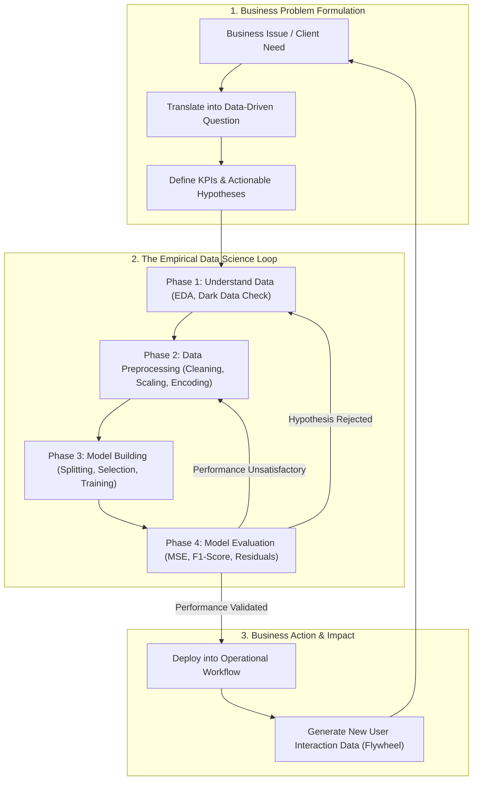
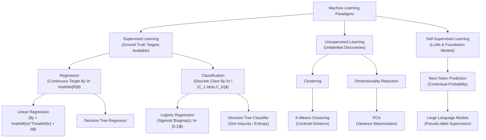
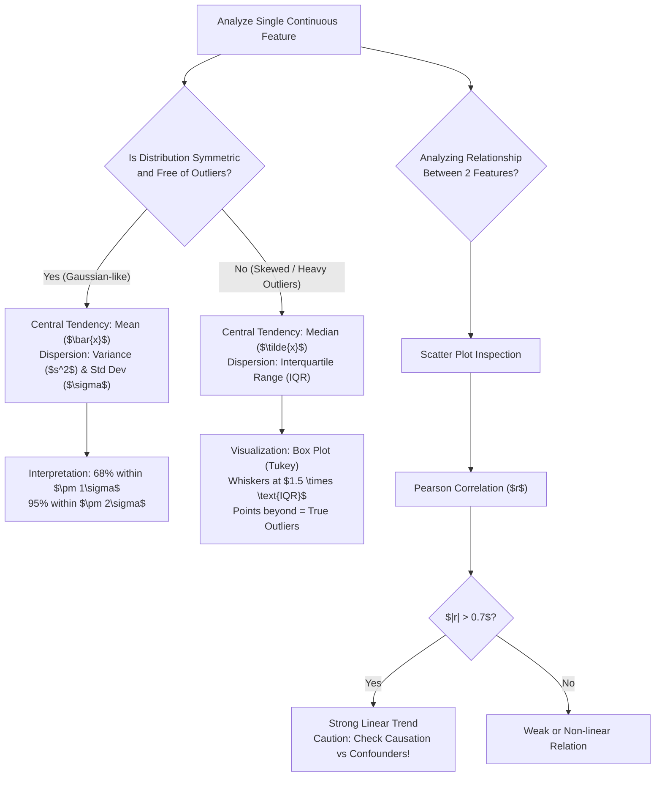
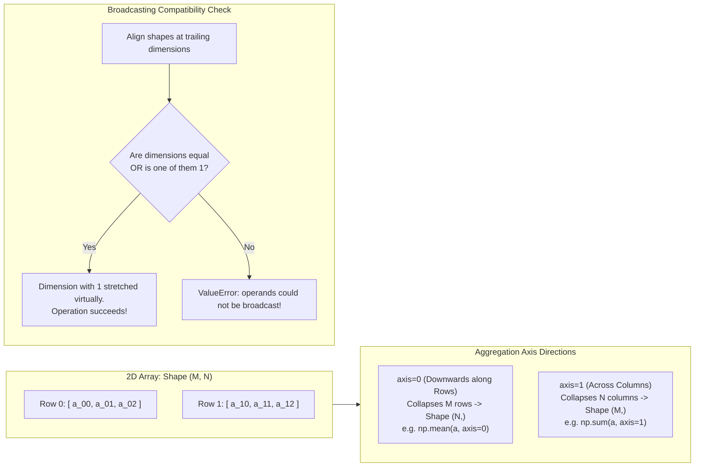
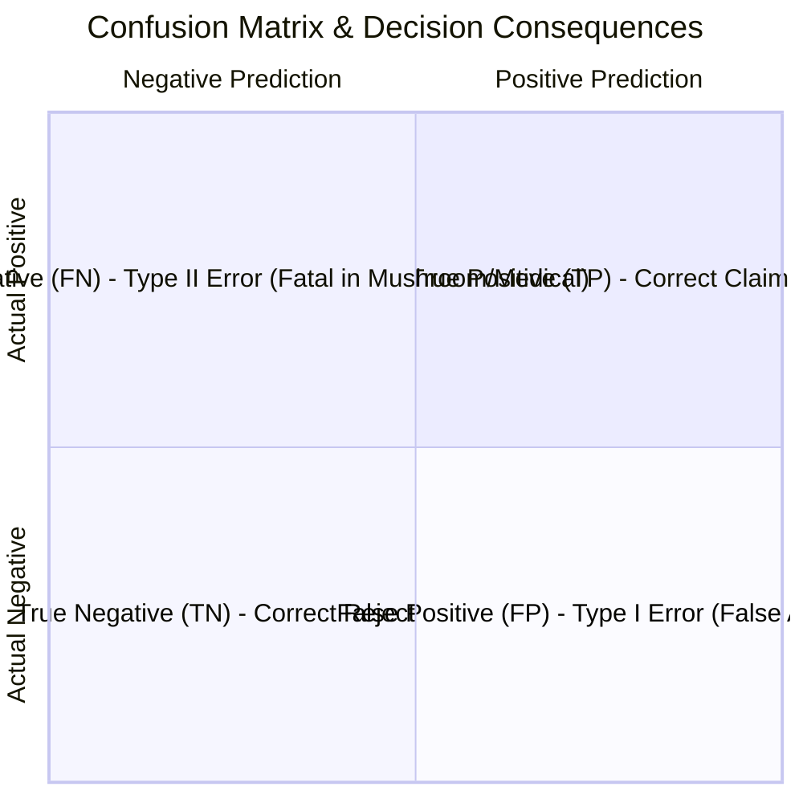

# GCI World 2026 September — Comprehensive Theory Specification Report

> **Author:** Explorer 3 (Theory Spec Miner)  
> **Course:** Global Consumer Intelligence (GCI World 2026 September)  
> **Institution:** Matsuo-Iwasawa Laboratory, Graduate School of Engineering, The University of Tokyo  
> **Target Path:** `d:\02_Learning_Knowledge\GCI_World_2026_September\.agents\explorer_survey_3\theory_spec.md`  
> **Timestamp:** 2026-09-20T15:08:00Z  
> **Status:** Authoritative Theoretical Specification Document  

---

## 1. Executive Summary & Curriculum Architecture

The GCI World curriculum is structured around the transition from passive AI/code consumers to **Data-driven Problem Solvers** equipped with rigorous statistical foundations, machine learning mechanisms, high-performance computing capabilities, and business translation skills. 

### 1.1 Macro Curriculum Trajectory
Across the preparatory materials (`02. Preparatory Materials`), live lecture decks (`03. Lecture Materials & Homework`), audio transcripts, and notebook suites, the theoretical curriculum spans 7 interconnected modules across 13 lecture weeks:

```
[Module 0: Scientific Epistemology & Business Problem Formulation]
                                │
                                ▼
[Module 1: Computational Foundations & Python Data Model]
                                │
                                ▼
[Module 2: Descriptive Statistics, Distributions & Inferential Foundation]
                                │
                                ▼
[Module 3: High-Performance Numerical Computing & Linear Algebra (NumPy)]
                                │
                                ▼
[Module 4: Supervised Learning — Continuous Modeling (Regression)]
                                │
                                ▼
[Module 5: Supervised Learning — Discrete Modeling (Classification)]
                                │
                                ▼
[Module 6: Unsupervised Learning, Time Series & Self-Supervised Foundation Models]
```

### 1.2 Core Pedagogical Pillars (Matsuo-Iwasawa Lab Perspective)
1. **The Scientific Loop of Data Science**: Data science is not ad-hoc script execution; it executes the empirical cycle: **Hypothesize $\rightarrow$ Experiment $\rightarrow$ Analyze $\rightarrow$ Decide/Act**.
2. **"Dark Data" & Problem Framing**: As emphasized by David J. Hand and Prof. Matsuo, relying solely on visible database records induces lethal selection bias. Data scientists must uncover "what is missing" (unobserved churners, silent defectors, unrecorded intent).
3. **The Modern Defensible Moat**: In the era of massive Foundation Models, databases and static code are easily duplicated. The genuine competitive moat lies in **Workflow Integration** and creating a **Data Flywheel** with domain-specific engineering.
4. **Competency Distribution**: Professional Data Scientists spend only 30–40% of their cognitive bandwidth on coding/tooling; 60–70% is devoted to business problem formulation, domain translation, and organizational persuasion.

---

## 2. In-Depth Theoretical Concept Inventory & Mathematical Formulations

### Module 0: The Data Science Process & Scientific Epistemology
*Discovered in:* `prep1_slides.pdf`, `lec1_slides.pdf`, `transcript_full.md`, `Lecture_01_Detailed_Notes.md`.

#### 1. The 4-Stage Data Science Lifecycle
Every predictive and analytical project must progress through four sequential yet iterative phases:
- **Phase 1: Understanding the Data (EDA & Problem Framing)**
  - Objective: Map feature schemas, statistical summaries, identify distributional skewness, detect missing values and anomalous outliers.
  - Formulate business hypotheses (e.g., in automotive pricing: does engine displacement monotonically govern vehicle price, or does luxury branding supersede mechanical scale?).
- **Phase 2: Data Preprocessing (Transformation & Cleaning)**
  - Objective: Sanitize raw input into structured numerical matrices consumable by machine learning estimators.
  - Imputation of missing records, clipping/handling outliers, standardizing heterogeneous scales, and dummy encoding of categorical attributes.
- **Phase 3: Model Building (Splitting, Selection, Optimization)**
  - Data Splitting: Partitioning records into non-overlapping training and hold-out evaluation subsets to prevent data leakage.
  - Model Selection: Aligning estimator inductive biases with target characteristics (e.g., continuous target $\rightarrow$ regression; discrete label $\rightarrow$ classification; unlabelled $\rightarrow$ clustering).
  - Model Training: Optimizing parameter weights $\mathbf{w}$ via empirical loss minimization.
- **Phase 4: Model Evaluation & Actionable Delivery**
  - Evaluating predictive fidelity against strictly held-out data using task-appropriate loss metrics.
  - Iterative feedback loop: Error analysis informs upstream data transformations or hypothesis revisions.

#### 2. The Scientific Inquiry Cycle (Case Study: Seven-Eleven Japan)
- **Observe**: Track real-time point-of-sale (POS) data, meteorological conditions, and localized calendar events.
- **Hypothesize**: Project granular demand per stock-keeping unit (SKU) for a specific store and time window.
- **Experiment**: Place physical replenishment orders calibrated to the hypothesis.
- **Analyze**: Contrast actual sell-through rates against projections, updating the demand model for subsequent replenishment cycles.

---

### Module 1: Computational Foundations & Python Execution Model
*Discovered in:* `prep2_slides.pdf`, `prelecture_slides.pdf`, `prelecture_notebook.ipynb`.

#### 1. Variable Assignment vs. Mathematical Equality
- The operator `=` represents **reference binding** in memory, not algebraic identity:
  $$\text{Variable Name} \longrightarrow \text{Heap Memory Object}$$
- Evaluation order: The right-hand expression is fully evaluated before binding/reassigning to the left-hand identifier.
- In-place mutation vs. value creation: Understanding object identity (`id()`), mutability of collections (lists, dictionaries) vs. immutability of primitives (int, float, str, tuple).

#### 2. Object-Oriented Architecture (OOP)
- **Class**: Blueprint defining state structure (`attributes`) and behavioral capabilities (`methods`).
- **Instance**: Concrete memory allocation of a class blueprint (`obj = ClassName()`).
- **Constructor (`__init__`)**: Initialization hook executed upon instantiation, binding instance-specific properties via the explicit self-reference parameter `self`.
- **In-place Operations**: Built-in methods such as `list.sort()` mutate state in-place and return `None`, whereas functions like `sorted(list)` construct and return a new instance, preserving the original reference.

#### 3. Advanced Syntax Pre-Requisites
- **List Comprehensions**: `[expr for item in iterable if condition]`
- **Lambda Expressions**: Anonymous pure functions `lambda x, y: expr`
- **Ternary Conditional Expression**: `val_if_true if condition else val_if_false`
- **Iterators & Generators**: Lazy evaluation protocols yielding stream elements on demand (`enumerate()`, `zip()`, `range()`).

---

### Module 2: Foundational Descriptive & Inferential Statistics
*Discovered in:* `prep3_slides.pdf`, `lec2_slides.pdf`, `lec2_notebook.ipynb`.

#### 1. Measures of Central Tendency
- **Sample Mean ($\bar{x}$)**:
  $$\bar{x} = \frac{1}{n}\sum_{i=1}^n x_i$$
  *Property:* Minimizes sum of squared errors; highly sensitive to extreme outliers.
- **Median**:
  $$\tilde{x} = \begin{cases} x_{\left(\frac{n+1}{2}\right)} & \text{if } n \text{ is odd} \\ \frac{1}{2}\left(x_{\left(\frac{n}{2}\right)} + x_{\left(\frac{n}{2} + 1\right)}\right) & \text{if } n \text{ is even} \end{cases}$$
  *Property:* Robust measure of central tendency; invariant under monotonic transformations of outlier tails.
- **Mode**: The most frequently observed discrete value in the sample distribution.

#### 2. Measures of Dispersion & Spread
- **Sample Variance ($s^2$ / $\sigma^2$)**:
  $$s^2 = \frac{1}{n} \sum_{i=1}^n (x_i - \bar{x})^2$$
  *Intuition:* Quantifies the average squared distance of observations from the arithmetic mean.
- **Standard Deviation ($s$ / $\sigma$)**:
  $$\sigma = \sqrt{s^2} = \sqrt{\frac{1}{n} \sum_{i=1}^n (x_i - \bar{x})^2}$$
  *Intuition:* Restores the metric scale of spread to the identical physical units of the underlying feature.
- **Empirical Dispersion Heuristic**:
  - $\bar{x} \pm 1\sigma$: Encompasses typical, expected observations ($\approx 68.2\%$ under Gaussian distribution).
  - Outside $\bar{x} \pm 2\sigma$: Denotes statistically unusual or divergent data points ($\approx 95.4\%$).

#### 3. Standardized Score (Z-Score Standardization)
$$z_i = \frac{x_i - \mu}{\sigma}$$
- Centers the distribution to zero mean ($\mu_z = 0$) and unit variance ($\sigma_z^2 = 1$).
- Eliminates dimensional bias when comparing disparate physical units (e.g., student age vs. exam marks, engine displacement vs. retail price).

#### 4. Exploratory Visualizations
- **Histogram**: Partitions continuous domains into discrete class intervals (bins), plotting frequency density. Exposes modality (unimodal, bimodal), skewness, and heavy tails.
- **Box Plot (Tukey 5-Number Summary)**:
  $$\text{IQR} = Q_3 - Q_1 \quad (\text{Interquartile Range})$$
  - Lower whisker boundary: $\max(\min(x), Q_1 - 1.5 \times \text{IQR})$
  - Upper whisker boundary: $\min(\max(x), Q_3 + 1.5 \times \text{IQR})$
  - Outliers: Points plotted individually beyond the whisker bounds.

#### 5. Bivariate Association & Correlation
- **Sample Covariance ($\text{Cov}(X, Y)$)**:
  $$\text{Cov}(X, Y) = \frac{1}{n}\sum_{i=1}^n (x_i - \bar{x})(y_i - \bar{y})$$
- **Pearson Product-Moment Correlation Coefficient ($r_{xy}$)**:
  $$r_{xy} = \frac{\text{Cov}(X, Y)}{\sigma_X \sigma_Y} = \frac{\sum (x_i - \bar{x})(y_i - \bar{y})}{\sqrt{\sum (x_i - \bar{x})^2}\sqrt{\sum (y_i - \bar{y})^2}}$$
  - Bounded interval: $-1 \le r \le 1$.
  - Interpretation: $r > 0.7$ (strong positive linear association), $r < -0.7$ (strong negative linear association), $r \approx 0$ (absence of linear correlation).
  - *Fundamental Epistemological Distinction:* Correlation denotes co-movement; it does **not** imply causal dependency.

---

### Module 3: High-Performance Numerical Computing & Linear Algebra (NumPy)
*Discovered in:* `lec2_slides.pdf` (86 slides), `lec2_notebook.ipynb`, `HW1 for Session2.ipynb`.

#### 1. Computational Architecture: `ndarray` vs. Python `list`
- Python `list`: Heterogeneous pointer array storing scattered heap addresses; induces cache misses, dynamic type checking, and Python GIL looping overhead.
- NumPy `ndarray`: Homogeneous, contiguous block in C-order memory with fixed data type (`dtype`), zero-cost vectorization, and cache line prefetching.

#### 2. Universal Functions (ufunc) & Vectorized Dispatch
- Applied element-wise across arrays without Python-level iteration.
- Arithmetic (`+`, `-`, `*`, `/`, `//`, `**`, `%`), mathematical transformations (`np.sqrt`, `np.exp`, `np.log`), relational operators (`<`, `<=`, `==`, `!=`).

#### 3. Broadcasting Mechanics & Shape Alignment Rules
Two array shapes $(d_1, d_2, \dots, d_k)$ and $(s_1, s_2, \dots, s_k)$ are compatible for broadcasting if, starting from trailing dimensions and moving backwards:
1. The dimensions are identical: $d_i = s_i$, OR
2. One of the dimensions is 1: $d_i = 1$ or $s_i = 1$ (the unit axis is virtually expanded without memory replication).
3. If arrays have differing dimensionality, 1s are prepended to the shorter shape until dimensions match.

#### 4. Dimensionality & Axis Semantics
- In a 2D matrix of shape $(M, N)$:
  - `axis = 0`: Operates along the rows (downwards), collapsing rows to compute per-column statistics (e.g., `np.mean(A, axis=0)` produces shape $(N,)$).
  - `axis = 1`: Operates across the columns (horizontally), collapsing columns to compute per-row statistics (e.g., `np.sum(A, axis=1)` produces shape $(M,)$).
  - `keepdims=True`: Preserves singleton dimensions (e.g., resulting in shape $(1, N)$ or $(M, 1)$), enabling immediate broadcast alignment.

#### 5. Array Indexing Taxonomy
- **Basic Indexing & Slicing**: `a[start:stop:step]` returns a **memory view** sharing buffer with the parent array. Mutating the slice mutates the underlying array!
- **Advanced / Fancy Indexing**: `a[[row_indices], [col_indices]]` accepts index arrays, generating an independent **deep copy**. Output array geometry matches the broadcasted shape of the index arrays.
- **Boolean Indexing (Masking)**: Evaluates boolean condition vector, returning elements where mask evaluates to `True`.
  - Requires bitwise operators: `&` (AND), `|` (OR), `~` (NOT) with explicit parenthesization:
    $$\text{mask} = (a \% 5 == 0) \ \& \ (a \% 2 == 1)$$

#### 6. Linear Algebra Framework (`numpy.linalg` / `LA`)
- Matrix Multiplication: `np.dot(A, B)`, `np.matmul(A, B)`, or infix `@`.
- Transposition: `A.T` reverses axis order.
- Determinant: $\det(A) = \text{LA.det}(A)$.
- Matrix Inverse: $A^{-1} = \text{LA.inv}(A)$, valid if and only if matrix is square and non-singular ($\det(A) \ne 0$).
- Vector and Matrix Norms:
  - L1 Norm (Manhattan): $\|x\|_1 = \sum |x_i| = \text{LA.norm}(x, \text{ord}=1)$
  - L2 Norm (Euclidean): $\|x\|_2 = \sqrt{\sum x_i^2} = \text{LA.norm}(x, \text{ord}=2)$
  - $L_\infty$ Norm (Chebyshev / Maximum): $\|x\|_\infty = \max |x_i| = \text{LA.norm}(x, \text{ord}=\text{np.inf})$
- Matrix Factorizations: Eigenvalues/Eigenvectors, Singular Value Decomposition (SVD), LU decomposition.

---

### Module 4: Supervised Learning — Continuous Modeling (Regression)
*Discovered in:* `prep4_slides.pdf`, `Exercise_Regression_Level_0` to `Level_4.ipynb`.

#### 1. Mathematical Formulation
- Objective: Approximate mapping function $f: \mathbb{R}^p \rightarrow \mathbb{R}$ predicting continuous scalar target $y$ from feature vector $\mathbf{x} = [x_1, x_2, \dots, x_p]^T$:
  $$\hat{y} = w_0 + w_1 x_1 + w_2 x_2 + \dots + w_p x_p = \mathbf{w}^T \mathbf{x} + b$$
- Parameter vector $\mathbf{w}$ represents marginal feature sensitivity; intercept $b$ represents base bias.

#### 2. Optimization Mechanism: Ordinary Least Squares (OLS)
- Minimize Residual Sum of Squares (RSS):
  $$\mathcal{L}_{\text{OLS}}(\mathbf{w}, b) = \sum_{i=1}^n \left( y_i - (\mathbf{w}^T \mathbf{x}_i + b) \right)^2$$
- Closed-form analytical solution (Normal Equation):
  $$\mathbf{w}^* = (\mathbf{X}^T \mathbf{X})^{-1} \mathbf{X}^T \mathbf{y}$$

#### 3. Loss & Evaluation Metrics for Regression
- **Mean Squared Error (MSE)**:
  $$\text{MSE} = \frac{1}{n}\sum_{i=1}^n (y_i - \hat{y}_i)^2$$
  *Properties:* Differentiable, penalizes large outliers severely; expressed in squared target units.
- **Root Mean Squared Error (RMSE)**:
  $$\text{RMSE} = \sqrt{\text{MSE}}$$
  *Properties:* Reverts error magnitude to base target units.
- **Mean Absolute Error (MAE)**:
  $$\text{MAE} = \frac{1}{n}\sum_{i=1}^n |y_i - \hat{y}_i|$$
  *Properties:* Linear penalty scale; robust against extreme anomalies.
- **Coefficient of Determination ($R^2$ Score)**:
  $$R^2 = 1 - \frac{\sum_{i=1}^n (y_i - \hat{y}_i)^2}{\sum_{i=1}^n (y_i - \bar{y})^2} = 1 - \frac{\text{SS}_{\text{res}}}{\text{SS}_{\text{tot}}}$$
  *Interpretation:* Proportion of total target variance explained by explanatory features. $R^2 = 1$ is perfect prediction; $R^2 = 0$ is baseline mean prediction; $R^2 < 0$ implies model performs worse than predicting the empirical mean $\bar{y}$.

#### 4. Preprocessing Pipeline for Regression
- Handling Multicollinearity & Dummy Variable Trap: When one-hot encoding $K$ categorical states, retain only $K-1$ indicator vectors (`pd.get_dummies(..., drop_first=True)`) to preserve non-singularity of matrix $\mathbf{X}^T \mathbf{X}$.
- Feature Scaling (`StandardScaler`): Centers and scales features so optimization landscapes are spherically symmetric:
  $$z = \frac{x - \mu_{\text{train}}}{\sigma_{\text{train}}}$$
  *Data Leakage Rule:* Scaler parameters $\mu$ and $\sigma$ must be fitted exclusively on training splits, then applied to test splits.
- Validation Strategies: Hold-Out validation vs. $k$-Fold Cross-Validation (`cross_val_score(model, X, y, cv=KFold(k))`).

---

### Module 5: Supervised Learning — Discrete Modeling (Classification)
*Discovered in:* `prep4_slides.pdf`, `Exercise_Classification_Level_0` to `Level_3.ipynb`.

#### 1. Logistic Regression & Probabilistic Mapping
- For binary classification $y \in \{0, 1\}$, the linear score $z = \mathbf{w}^T \mathbf{x} + b$ is mapped through the **Sigmoid / Logistic activation**:
  $$p = P(y=1|\mathbf{x}) = \sigma(z) = \frac{1}{1 + e^{-z}} = \frac{1}{1 + e^{-(\mathbf{w}^T \mathbf{x} + b)}}$$
- Log-Odds (Logit) transformation:
  $$\ln\left( \frac{p}{1 - p} \right) = \mathbf{w}^T \mathbf{x} + b$$
- Decision Boundary: Classify $\hat{y} = 1$ if $P(y=1|\mathbf{x}) \ge 0.5 \iff \mathbf{w}^T \mathbf{x} + b \ge 0$.

#### 2. Decision Trees & Recursive Binary Splitting
- Partitions feature space into axis-aligned hyper-rectangles by evaluating candidate threshold rules ($x_j \le \theta$).
- **Splitting Criteria**:
  - Gini Impurity (default in CART):
    $$I_G(t) = 1 - \sum_{k=1}^K p_k^2$$
  - Shannon Entropy:
    $$H(t) = -\sum_{k=1}^K p_k \log_2 p_k$$
  - Information Gain ($\Delta I$):
    $$\Delta I = I(\text{Parent}) - \left( \frac{N_{\text{left}}}{N} I(\text{Left}) + \frac{N_{\text{right}}}{N} I(\text{Right}) \right)$$
- **Hyperparameter Regularization**:
  - `max_depth`: Limits tree depth to control model complexity and prevent memorization of noise (overfitting).
  - Feature Importance: Aggregated reduction in impurity brought by splits on feature $j$ across all nodes.

#### 3. Classification Evaluation Metrics & Confusion Matrix
$$\begin{array}{c|cc}
& \text{Predicted Positive (1)} & \text{Predicted Negative (0)} \\
\hline
\text{Actual Positive (1)} & \text{TP (True Positive)} & \text{FN (False Negative / Type II Error)} \\
\text{Actual Negative (0)} & \text{FP (False Positive / Type I Error)} & \text{TN (True Negative)} \\
\end{array}$$

- **Accuracy**: $\frac{\text{TP} + \text{TN}}{\text{TP} + \text{TN} + \text{FP} + \text{FN}}$ (Misleading under severe class imbalance).
- **Precision**: $\frac{\text{TP}}{\text{TP} + \text{FP}}$ (Quality of positive claims; critical when false alarms incur high costs).
- **Recall (Sensitivity)**: $\frac{\text{TP}}{\text{TP} + \text{FN}}$ (Completeness of positive detection; critical in medical diagnostics and mushroom toxicity: a False Negative is fatal).
- **F1-Score**: Harmonic mean of Precision and Recall:
  $$\text{F1} = 2 \cdot \frac{\text{Precision} \cdot \text{Recall}}{\text{Precision} + \text{Recall}} = \frac{2\text{TP}}{2\text{TP} + \text{FP} + \text{FN}}$$

---

### Module 6: Unsupervised Learning, Time Series & Self-Supervised Models
*Discovered in:* `prep4_slides.pdf`, `lec1_slides.pdf`.

#### 1. Unsupervised Clustering ($K$-Means)
- Partitions unlabelled observations into $K$ disjoint clusters $\mathcal{C} = \{C_1, \dots, C_K\}$ minimizing intra-cluster inertia:
  $$\arg\min_{\mathcal{C}} \sum_{k=1}^K \sum_{\mathbf{x} \in C_k} \|\mathbf{x} - \boldsymbol{\mu}_k\|^2$$
- Algorithm:
  1. Initialize $K$ centroids randomly in feature space.
  2. Assignment step: Allocate each observation to its nearest centroid via Euclidean distance.
  3. Update step: Recalculate centroids as the empirical mean of all assigned points.
  4. Repeat until centroid movement falls below threshold $\epsilon$.

#### 2. Dimensionality Reduction: Principal Component Analysis (PCA)
- Transforms correlated $p$-dimensional variables into linearly uncorrelated orthogonal variables called **Principal Components**.
- Objective: Find projection vector $\mathbf{u}_1$ maximizing variance of projected data:
  $$\max_{\|\mathbf{u}_1\|=1} \mathbf{u}_1^T \boldsymbol{\Sigma} \mathbf{u}_1$$
  where $\boldsymbol{\Sigma}$ is the feature covariance matrix.
- Solved via Eigendecomposition of $\boldsymbol{\Sigma}$: Principal components correspond to eigenvectors sorted in descending order of their eigenvalues.

#### 3. Time Series Modeling & Autocorrelation
- Measures internal temporal dependency across observations separated by lag $k$:
  $$r_k = \frac{\sum_{t=k+1}^T (y_t - \bar{y})(y_{t-k} - \bar{y})}{\sum_{t=1}^T (y_t - \bar{y})^2}$$
  - $r_k \in [-1, 1]$: Identifies seasonal oscillations, persistence, and cyclical patterns.

#### 4. Self-Supervised Learning & Modern LLMs
- Paradigm: Leverages massive unannotated corpora to construct pseudo-labels natively from data structure without manual human annotation.
- **Next Token Prediction**:
  $$\max_\theta \sum_{t=1}^T \log P_\theta(w_t \mid w_1, w_2, \dots, w_{t-1})$$
- Bridges unsupervised data scaling with supervised gradient-based weight optimization.

---

## 3. Mermaid Diagram Candidates (Requirement R4)

The study notes must incorporate visual system diagrams to maximize retention. Below are production-ready Mermaid diagram candidates designed for immediate integration into the respective study note chapters:

### Candidate 1: The End-to-End Data Science & Business Value Loop (For Intro Note)


### Candidate 2: Machine Learning Methodological Taxonomy (For ML Overview Note)


### Candidate 3: Statistical Decision Tree for Dispersion & Central Tendency (For Statistics Note)


### Candidate 4: NumPy 2D Array Axis & Broadcasting Mechanics (For NumPy Note)


### Candidate 5: Classification Performance & Confusion Matrix Trade-Off (For Classification Note)


---

## 4. Active Recall Question Candidates (Requirement R3)

Below are conceptual, mathematical, and algorithmic flashcards designed to enforce rigorous active recall at the end of each module.

### Flashcards: Data Science Foundations & Scientific Method
1. **Q: Why does having more data not guarantee better knowledge in real-world business applications?**  
   *A:* Real-world data collection is prone to "Dark Data" (unobserved churners, silent failures, missing segments) and severe selection bias. Without deductive hypothesis framing and domain understanding, algorithms fit to observational artifacts rather than true business drivers.
2. **Q: Contrast the 4 stages of the Data Science Lifecycle and explain why the process is non-linear.**  
   *A:* 1. Data Understanding (EDA/Hypothesis), 2. Preprocessing (Cleaning/Encoding/Scaling), 3. Model Building (Splitting/Training), 4. Evaluation. It is cyclical because poor evaluation metrics reveal preprocessing defects or invalidate initial hypotheses, requiring upstream revisitation.
3. **Q: What constitutes the modern defensible moat for an AI-driven startup, and why is a static database insufficient?**  
   *A:* Foundation models democratize static processing. The moat lies in **Workflow Integration**—embedding AI seamlessly into operational loops to generate exclusive proprietary feedback (Data Flywheel) and domain-specific engineering.

### Flashcards: Python Programming & Execution Model
4. **Q: In Python, explain why executing `b = a` for a list `a` followed by `b.append(10)` modifies `a`.**  
   *A:* Python variables are references to objects in memory. The statement `b = a` copies the reference pointer, not the heap object itself; thus `a` and `b` reference the identical mutable list in memory.
5. **Q: What is the architectural difference between `list.sort()` and `sorted(list)`?**  
   *A:* `list.sort()` is an in-place method that mutates the internal array of the existing list instance and returns `None`. `sorted(list)` is a built-in function that creates, populates, and returns a new sorted list instance, preserving the original sequence.
6. **Q: What role does the parameter `self` serve in Python class definitions?**  
   *A:* `self` explicitly represents the concrete memory instance upon which the method is invoked, enabling instance-level attribute binding and isolation between distinct objects created from the same blueprint.

### Flashcards: Statistics & Exploratory Data Analysis
7. **Q: When is the Median preferred over the Arithmetic Mean as a metric of central tendency?**  
   *A:* When the underlying distribution is heavily skewed or contains extreme outliers (e.g., household income, vehicle prices), because the mean minimizes squared deviations and is dragged towards extremes, whereas the median depends only on rank order.
8. **Q: What is the mathematical and practical distinction between Variance ($s^2$) and Standard Deviation ($s$)?**  
   *A:* Variance expresses dispersion in squared physical units of the original measurement (e.g., dollars squared), which is non-intuitive. Standard deviation takes the square root of variance, restoring dispersion to the identical scale and physical units of the data.
9. **Q: If two variables exhibit a Pearson Correlation Coefficient of $r = 0.0$, does it guarantee they are statistically independent?**  
   *A:* No. Pearson's $r$ exclusively measures **linear** association. Two variables with a perfect deterministic non-linear relationship (e.g., $y = x^2$ over symmetric bounds $[-2, 2]$) have $r = 0$.
10. **Q: How does Tukey define an outlier in a standard Box Plot?**  
    *A:* Any observation falling beyond $1.5 \times \text{IQR}$ below the First Quartile ($Q_1 - 1.5\cdot\text{IQR}$) or above the Third Quartile ($Q_3 + 1.5\cdot\text{IQR}$).

### Flashcards: NumPy & Scientific Computing
11. **Q: Why does vectorized NumPy arithmetic execute significantly faster than native Python for-loops?**  
    *A:* NumPy stores homogeneous data in contiguous C-order memory blocks, allowing CPU SIMD vectorization and cache prefetching while bypassing Python's dynamic type checking, pointer dereferencing, and Global Interpreter Lock (GIL).
12. **Q: In a 2D NumPy array, what is the exact computational effect of specifying `axis=0` in an aggregation function like `np.sum(A, axis=0)`?**  
    *A:* `axis=0` aggregates along rows (downwards), collapsing the row dimension to yield a 1D array of column sums.
13. **Q: State the two fundamental conditions required for NumPy to broadcast two arrays of differing shapes.**  
    *A:* Moving backwards from trailing dimensions: for each dimension pair, the dimensions must either be identical in size, or one of them must be equal to 1.
14. **Q: What is the critical distinction between Basic Slicing (`a[1:5]`) and Advanced Indexing (`a[[1, 3, 4]]`) regarding memory allocation?**  
    *A:* Basic slicing returns a lightweight **view** sharing the parent's memory buffer (mutations affect the parent). Advanced indexing creates an entirely independent **copy** with freshly allocated memory.
15. **Q: How must multiple conditions be combined in Boolean Indexing, and what error occurs if Python's `and` keyword is used?**  
    *A:* Conditions must use element-wise bitwise operators `&`, `|`, `~` with parentheses around each condition (e.g., `(a > 0) & (a < 5)`). Using `and` raises `ValueError: The truth value of an array with more than one element is ambiguous`.

### Flashcards: Supervised Learning — Regression & Classification
16. **Q: In Multiple Linear Regression, why must one dummy variable be dropped when encoding categorical variables with $K$ states?**  
    *A:* Including all $K$ dummy columns alongside the intercept term creates perfect multicollinearity (the Dummy Variable Trap), making the Gram matrix $\mathbf{X}^T\mathbf{X}$ singular and non-invertible.
17. **Q: How can $R^2$ (Coefficient of Determination) assume a negative value, and what does it signify?**  
    *A:* $R^2 = 1 - \frac{\text{SS}_{\text{res}}}{\text{SS}_{\text{tot}}}$. If the model's predictions on test data are less accurate than simply guessing the training mean $\bar{y}$ for every instance ($\text{SS}_{\text{res}} > \text{SS}_{\text{tot}}$), $R^2$ becomes negative.
18. **Q: In high-stakes classification (e.g., identifying poisonous mushrooms), which metric must be prioritized: Precision or Recall? Why?**  
    *A:* **Recall** (Sensitivity) must be maximized. A False Negative means classifying a deadly poisonous mushroom as edible, which is fatal. A False Positive merely discards an edible mushroom.
19. **Q: How does the `max_depth` hyperparameter in a Decision Tree control the bias-variance trade-off?**  
    *A:* An unconstrained depth allows the tree to create leaf nodes for individual noisy observations, resulting in low bias but high variance (overfitting). Restricting `max_depth` acts as a regularizer, increasing bias slightly while sharply reducing variance.
20. **Q: What mathematical mechanism allows Logistic Regression to bound output predictions strictly within the probability range $[0, 1]$?**  
    *A:* The continuous linear score $z = \mathbf{w}^T\mathbf{x} + b$ is transformed through the Sigmoid activation function $\sigma(z) = \frac{1}{1 + e^{-z}}$, which asymptotically approaches 0 as $z \rightarrow -\infty$ and 1 as $z \rightarrow +\infty$.

---

## 5. Formal Specification Tables

```
## Features Discovered
| # | Category | Feature | Description | Inputs | Outputs | Error Behavior | Discovered Via |
|---|----------|---------|-------------|--------|---------|----------------|----------------|
| 1 | Scientific Framework | 4-Stage Data Science Lifecycle | Systematic framework for framing, cleaning, modeling, and evaluating data-driven solutions | Raw domain data & business objectives | Validated model & deployment strategy | Rejection of hypothesis; upstream iteration | `prep1_slides.pdf`, `lec1_slides.pdf` |
| 2 | Scientific Framework | Empirical Science Loop | Iterative cycle of Hypothesize -> Experiment -> Analyze -> Decide | Observable phenomena, historical metrics | Revised hypotheses, business policy | Mismatched assumptions caught in analysis | `lec1_slides.pdf` (p. 12) |
| 3 | Business Strategy | Defensible Moat via Workflow Integration | Strategy of securing AI moat through workflow embedding rather than raw data capture | User interactions & operational workflows | Data Flywheel & persistent engagement | Commoditization if relying only on static DB | `lec1_slides.pdf`, `transcript_full.md` |
| 4 | Python Runtime | Variable Reference Binding | Memory model where variables are pointer bindings to heap objects | Assignment statement `var = expr` | Bound memory reference | `UnboundLocalError` if referenced before assignment | `prep2_slides.pdf`, `prelecture_slides.pdf` |
| 5 | Python Runtime | OOP Architecture & Constructor | Encapsulation of state and behaviors via classes and `__init__` | Class definition, constructor arguments | Instantiated object instance | `TypeError` if required arguments are missing | `prep2_slides.pdf` (p. 20) |
| 6 | Descriptive Stats | Central Tendency (Mean vs Median) | Calculation of distribution centers with differing outlier resilience | 1D numerical array or series | Scalar mean ($\bar{x}$) or median ($\tilde{x}$) | `ZeroDivisionError` on empty arrays | `prep3_slides.pdf` (p. 4-5) |
| 7 | Descriptive Stats | Dispersion (Variance & Std Dev) | Measurement of spread around the mean in squared and base units | Numerical sequence | Variance ($s^2$) and Std Dev ($\sigma$) | Undefined for $N=0$ | `prep3_slides.pdf` (p. 7-10) |
| 8 | Descriptive Stats | Z-Score Standardization | Linear rescaling to zero mean and unit variance | Continuous feature array $X$ | Standardized feature array $Z$ | `ZeroDivisionError` if standard deviation $\sigma=0$ | `prep3_slides.pdf` (p. 11) |
| 9 | Descriptive Stats | Tukey Box Plot & Outlier Detection | Five-number summary visualization using $1.5 \times \text{IQR}$ bounds | Numerical array | Median, Q1, Q3, Whiskers, Outliers list | Degenerate whiskers if IQR=0 | `prep3_slides.pdf` (p. 6) |
| 10 | Bivariate Stats | Pearson Correlation Coefficient | Linear association quantification bounded in $[-1, 1]$ | Paired continuous series $(X, Y)$ | Correlation coefficient $r_{xy} \in [-1, 1]$ | Returns `NaN` if either variable has zero variance | `prep3_slides.pdf` (p. 13-14) |
| 11 | High-Performance Comp | NumPy `ndarray` Contiguous Memory | C-aligned homogeneous memory buffer enabling SIMD vectorization | Python list or buffer | Vectorized ndarray object | `TypeError` if elements cannot be cast to common dtype | `lec2_slides.pdf`, `lec2_notebook.ipynb` |
| 12 | High-Performance Comp | Universal Functions (ufunc) | Element-wise vectorized mathematical kernel execution | Array operands | Transformed array | `FloatingPointError` / `RuntimeWarning` on div-by-zero | `lec2_slides.pdf` (p. 23-30) |
| 13 | High-Performance Comp | Array Broadcasting Engine | Automatic shape expansion along singleton or prepended dimensions | Mismatched shape arrays | Output array of broadcasted shape | `ValueError: operands could not be broadcast` | `lec2_slides.pdf` (p. 31, 49-50) |
| 14 | High-Performance Comp | Axis-Directed Reductions | Aggregation along row (`axis=0`) or column (`axis=1`) directions | Multi-dimensional ndarray, axis integer | Collapsed lower-dimensional ndarray | `AxisError` if axis exceeds array dimensionality | `lec2_slides.pdf` (p. 51-61) |
| 15 | High-Performance Comp | Basic Slicing vs Advanced Indexing | Buffer view slicing vs deep-copy index array extraction | Slice expressions or integer array masks | Array view or new copied array | `IndexError` if indices are out of bounds | `lec2_slides.pdf` (p. 64-75) |
| 16 | High-Performance Comp | Boolean Masking & Bitwise Logic | Element-wise conditional filtering using `&`, `|`, `~` | Boolean array mask | Filtered 1D array of matching values | `ValueError` if Python boolean keywords `and`/`or` used | `lec2_slides.pdf` (p. 78), `HW1` |
| 17 | Linear Algebra | Matrix Multiplication & Norms | Linear algebraic transformations (`@`, `np.dot`, `LA.norm`) | Matrices $A (M \times K)$, $B (K \times N)$ | Matrix product $C (M \times N)$, scalar norm | `ValueError` if inner dimensions do not match | `lec2_notebook.ipynb` (Cell 202-215) |
| 18 | Linear Algebra | Matrix Inversion & Singularity Check | Inverse calculation via Gaussian/LU decomposition | Square matrix $A (N \times N)$ | Inverse matrix $A^{-1}$ | `LinAlgError: Singular matrix` if $\det(A) = 0$ | `lec2_notebook.ipynb` (Cell 212) |
| 19 | Supervised Learning | Multiple Linear Regression (OLS) | Continuous parameter optimization minimizing squared residuals | Feature matrix $\mathbf{X}$, Target vector $\mathbf{y}$ | Weight vector $\mathbf{w}$, intercept $b$ | Inversion failure if features are collinear | `prep4_slides.pdf`, `Exercise_Regression` |
| 20 | Supervised Learning | Regression Evaluation (MSE, RMSE, R2) | Quantification of continuous predictive variance and error | True values $\mathbf{y}$, Predicted $\hat{\mathbf{y}}$ | Scalar metric values ($\ge 0$ for MSE, $\le 1$ for R2) | Negative R2 if model underperforms baseline mean | `prep1_slides.pdf`, `Exercise_Regression` |
| 21 | Supervised Learning | $k$-Fold Cross-Validation | Resampling protocol partitioning data into $k$ train/test folds | Complete dataset, integer $k$ | Array of $k$ evaluation scores | High computational overhead for large $k$ | `prep1_slides.pdf` (p. 10), `Exercise_Regression` |
| 22 | Supervised Learning | Dummy Variable Trap Prevention | Drop-first one-hot encoding for categorical attributes | Categorical column dataframe | Binary matrix with $K-1$ indicator columns | Singular matrix error if all $K$ categories retained | `Exercise_Regression_Level_3.ipynb` |
| 23 | Supervised Learning | Logistic Regression & Log-Odds | Probability mapping using Sigmoid activation for binary labels | Feature vector $\mathbf{x}$, binary labels $\mathbf{y}$ | Class probabilities $p \in [0, 1]$ | Numerical overflow if logits are extremely large | `prep4_slides.pdf` (p. 18) |
| 24 | Supervised Learning | Decision Tree Recursive Splitting | Hierarchical feature thresholding based on Gini/Entropy | Feature matrix $\mathbf{X}$, target $\mathbf{y}$ | Tree model with decision nodes and leaves | Overfitting if `max_depth` is unrestricted | `prep4_slides.pdf`, `Exercise_Classification` |
| 25 | Supervised Learning | Confusion Matrix & Metric Trade-Off | Contingency table mapping TP, FP, TN, FN, Precision, Recall, F1 | True binary labels, predicted binary labels | Confusion matrix & scalar metric reports | `ZeroDivisionError` if denominator has no positives | `prep1_slides.pdf` (p. 14), `Exercise_Classification` |
| 26 | Unsupervised Learning | $K$-Means Cluster Optimization | Iterative centroid assignment minimizing intra-cluster inertia | Unlabelled feature matrix $\mathbf{X}$, integer $K$ | Cluster assignment vector, centroid coordinates | Convergence to sub-optimal local minima | `prep4_slides.pdf` (p. 23) |
| 27 | Unsupervised Learning | Principal Component Analysis (PCA) | Eigendecomposition of covariance matrix for dimension reduction | High-dimensional matrix $\mathbf{X}$ ($N \times p$) | Orthogonal principal components ($N \times d$) | Sensitive to unscaled features | `prep4_slides.pdf` (p. 24) |
| 28 | Time Series | Autocorrelation Analysis | Lagged correlation measurement over discrete time sequences | Sequential time series vector $y_t$, lag $k$ | Autocorrelation coefficient $r_k \in [-1, 1]$ | Inaccurate if series is non-stationary | `lec1_slides.pdf` (p. 32) |
| 29 | Foundation Models | Self-Supervised Next Token Prediction | Generative autoregressive language modeling over token sequences | Unlabelled text corpus | Token probability distributions | Hallucination / compounding error in generation | `prep4_slides.pdf` (p. 28-31) |
```

---

```
## Edge Cases
| # | Feature | Input | Observed Behavior |
|---|---------|-------|-------------------|
| 1 | Descriptive Statistics (Mean/Variance) | Array of identical elements: `[5, 5, 5, 5]` | Mean = 5.0; Variance = 0.0; Standard Deviation = 0.0. Standardization ($z = \frac{x-\mu}{\sigma}$) raises `ZeroDivisionError` or yields `NaN`. |
| 2 | Pearson Correlation Coefficient | Two constant sequences (zero variance): `x = [3, 3, 3]`, `y = [1, 2, 3]` | `np.corrcoef(x, y)` returns `NaN` with `RuntimeWarning: invalid value encountered in divide` due to division by $\sigma_x = 0$. |
| 3 | NumPy Universal Functions | Division by zero: `np.array([1, 2, 0]) / np.array([1, 0, 0])` | NumPy does NOT raise `ZeroDivisionError`; it issues `RuntimeWarning: divide by zero encountered` and outputs `[1., inf, nan]`. |
| 4 | NumPy Broadcasting | Incompatible array dimensions: `np.zeros((2, 3)) + np.zeros((2, 2))` | Triggers `ValueError: operands could not be broadcast together with shapes (2,3) (2,2)` because trailing dimensions (3 and 2) do not match and neither is 1. |
| 5 | NumPy Boolean Masking | Combining conditions with Python keyword `and`: `a[(a > 2) and (a < 5)]` | Throws `ValueError: The truth value of an array with more than one element is ambiguous. Use a.any() or a.all()`. Must use bitwise `&` with parentheses: `a[(a > 2) & (a < 5)]`. |
| 6 | NumPy Basic Slicing vs Copy | Modifying sliced subarray: `b = a[0:2]; b[0] = 999` | Value in original array `a[0]` is mutated to `999` because basic slicing produces a memory view sharing the underlying buffer. |
| 7 | Matrix Inversion (`LA.inv`) | Singular matrix with linearly dependent rows: `B = np.array([[1, 2], [2, 4]])` | Raises `numpy.linalg.LinAlgError: Singular matrix` because $\det(B) = 1(4) - 2(2) = 0$, precluding inversion. |
| 8 | Multiple Linear Regression | Dummy variable trap (all $K$ categories encoded with intercept) | Induces perfect multicollinearity ($\sum \text{dummies} = \mathbf{1}$). Matrix $\mathbf{X}^T\mathbf{X}$ is non-invertible, causing explosive coefficient variance or numerical instability. Resolved with `drop_first=True`. |
| 9 | Regression Evaluation ($R^2$) | Severely deficient predictive model where $\text{MSE} > \text{Var}(y)$ | $R^2$ evaluates to negative numbers (e.g., $R^2 = -1.45$). This is mathematically valid, proving the estimator performs worse than guessing the constant sample mean. |
| 10 | Decision Tree Classification | Severe class imbalance (e.g., 99% Negative, 1% Positive) with unweighted tree | Predictor classifies 100% of samples as Negative, achieving 99% Accuracy while Recall = 0.0, completely missing all positive instances. |
| 11 | $K$-Means Clustering | Features with wildly differing scales (e.g., Age $[20-60]$ vs Income $[20,000-200,000]$) | Euclidean distance is dominated by Income by a factor of $10,000\times$, rendering Age completely irrelevant to cluster assignment unless standardized first. |
| 12 | Decision Tree Depth | Unconstrained depth (`max_depth=None`) on noisy training data | Training Accuracy reaches 100% (MSE = 0.0), but Test Accuracy collapses due to extreme variance and overfitting on idiosyncratic sample noise. |
```

---

## 6. Synthesis & Recommended Architectural Plan for Workers

To satisfy R1, R2, R3, and R4 with zero defects, the course study notes should be organized into **4 primary thematic chapter notes** (or 5 if modularizing ML further):

1. **Chapter 01: Data Science Epistemology & Python Computational Foundations**  
   *(Sources: Prep 0, Prep 1, Prep 2, PreLecture, Session 1)*  
   - Topics: 4-stage Data Science Lifecycle, Scientific loop, Dark Data, Python execution model, OOP, List comprehensions.  
   - Mermaid: Lifecycle & Business Value Loop (Candidate 1) + Python Reference/Object Diagram.  
   - Active Recall: 6 Flashcards.

2. **Chapter 02: Foundational Statistics & Exploratory Data Analysis**  
   *(Sources: Prep 3, Session 2 Part A)*  
   - Topics: Mean vs Median, Variance, Standard Deviation, Z-Score Standardization, Histograms, Tukey Box Plots, Pearson Correlation vs Causation.  
   - Mermaid: Statistical Metric Selection & Outlier Logic (Candidate 3).  
   - Active Recall: 6 Flashcards.

3. **Chapter 03: High-Performance Numerical Computing & Linear Algebra (NumPy)**  
   *(Sources: Session 2 slides & notebook, HW1)*  
   - Topics: Memory layout, Universal functions, Broadcasting rules, Axis semantics (`axis=0` vs `axis=1`), Slicing vs Advanced Indexing, Boolean indexing, Matrix math (`@`, `LA.inv`, `LA.norm`).  
   - Mermaid: NumPy Axis & Broadcasting Mechanics (Candidate 4).  
   - Active Recall: 6 Flashcards.

4. **Chapter 04: Supervised Machine Learning — Regression & Classification**  
   *(Sources: Prep 4, Prep 5, Regression Levels 0-4, Classification Levels 0-3)*  
   - Topics: Linear Regression, OLS, MSE, RMSE, MAE, $R^2$, Logistic Regression, Sigmoid, Decision Trees, Gini Impurity, Confusion Matrix, Precision/Recall trade-off, Cross-Validation.  
   - Mermaid: ML Methodological Taxonomy (Candidate 2) + Confusion Matrix Quadrant Chart (Candidate 5).  
   - Active Recall: 8 Flashcards.

5. **Chapter 05 (Advanced Overview): Unsupervised Learning, Time Series & Foundation Models**  
   *(Sources: Prep 4, Session 1 Curriculum roadmap)*  
   - Topics: $K$-Means clustering, PCA, Autocorrelation, Self-Supervised Learning & Next Token Prediction in LLMs.  
   - Mermaid: $K$-Means & PCA Dimensionality Reduction Pipeline.  
   - Active Recall: 5 Flashcards.

*Report compiled and certified by Explorer 3 (Theory Spec Miner).*
