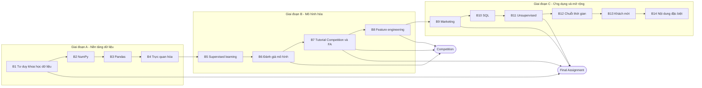

# Lộ trình GCI World 2026 September (phiên bản 2, cập nhật 2026-10-10)

> Học xong khóa này, bạn tự làm được một dự án dữ liệu trọn vòng: biến một vấn đề kinh doanh thành câu hỏi kiểm chứng được, làm sạch và khám phá dữ liệu, dựng và đánh giá mô hình, rồi trình bày đề xuất hành động. Mục tiêu đề xuất: đạt mức **Honors** (top 10% Final Assignment và top 20% Competition), mức sàn là **Completed**.
>
> File: `GCI_World_2026_September/roadmap/ROADMAP.md`. Nguồn sự thật theo thứ tự ưu tiên: thông báo Slack (kênh #01 đến #05) > Student Guide (Notion) > trang khóa học Omnicampus > file này. File được tổng hợp từ trang chính thức của Matsuo Lab, slide lec1 đến lec4, notebook HW1 đến HW3 và transcript Session 1, 2 (kiểm tra ngày 2026-10-10). Mục nào ghi "(chưa xác minh)" hoặc "(suy ra)" thì phải đối chiếu lại khi có thông báo chính thức.

## Mục lục

1. Cách dùng lộ trình này
2. Bức tranh toàn cảnh
3. Trạng thái hiện tại và lịch
4. Các module (Buổi 1 đến Buổi 14)
5. Ôn tập giãn cách và ôn xen kẽ
6. Dự án tổng hợp: Competition và Final Assignment
7. Sổ lỗi và cách hỏi DeepTutor
8. Tài liệu cũ trong thư mục này
9. Theo dõi tiến độ
10. Nguồn tham khảo

---

## 1. Cách dùng lộ trình này

### 1.1 Nhịp một tuần GCI (giờ Việt Nam, UTC+7)

Buổi học live diễn ra thứ Năm 11:00-12:30 UTC, tức **18:00-19:30 giờ Việt Nam** (buổi đầu và buổi cuối dài 120 phút). Tài liệu buổi sau thường được đưa lên Google Drive khoảng 1 tuần trước buổi học. Mỗi tuần lặp lại cùng một nhịp:

| Ngày | Việc | Thời lượng |
| :--- | :--- | :--- |
| Thứ Năm | Học live (hoặc xem lại bản ghi trong 48 giờ). **Nộp attendance survey ngay tối đó.** | 1,5-2 giờ |
| Thứ Sáu | Làm lại notebook bài giảng theo kiểu dự đoán rồi chạy (mục 1.3), viết 3 dòng tóm tắt | 1-1,5 giờ |
| Thứ Bảy | Làm homework của tuần, giới hạn 90 phút; kẹt quá 25 phút thì hỏi theo mẫu ở mục 7 | 1,5 giờ |
| Chủ Nhật | Ôn giãn cách (mục 5) và phần "Thử thách", từ Buổi 7 dành cho Competition | 1 giờ |
| Thứ Hai/Ba | Đọc lướt slide buổi tới 30 phút, ghi ra 3 câu hỏi bạn muốn được trả lời | 0,5 giờ |
| Thứ Tư | Dự phòng: bù việc trễ, hoặc Competition/Final Assignment | 0-1 giờ |

Tổng khoảng 6-7 giờ/tuần đến Buổi 6, sau đó khoảng 9-10 giờ/tuần khi Competition và Final Assignment chạy song song.

### 1.2 Vòng lặp một buổi tự học (45-90 phút)

1. **Gọi lại (5 phút):** trả lời lại, không nhìn tài liệu, 3 câu "Tự kiểm tra" của buổi trước.
2. **Đặt đích (2 phút):** chọn một dòng "Đầu ra" của module, viết DoD một câu.
3. **Làm chủ động (30-70 phút):** đọc ngắn, dự đoán, chạy, rồi giải thích lại bằng lời của bạn. Không đọc thụ động quá 10 phút liền.
4. **Đóng buổi (5-10 phút):** viết 3 dòng "Hôm nay tôi hiểu... / Tôi còn mơ hồ... / Lần sau tôi sẽ...", cập nhật Sổ lỗi (mục 7).

### 1.3 Quy tắc 3 lượt cho mỗi notebook bài giảng

- **Lượt 1 (xem):** chạy từng cell; trước mỗi cell, đoán output (shape, giá trị, hình vẽ) rồi mới chạy. Đoán sai là tín hiệu tốt: ghi lại vì sao sai.
- **Lượt 2 (làm):** tự làm các Practice Question, bấm giờ, chưa mở đáp án.
- **Lượt 3 (tái tạo, sau 2-3 ngày):** mở notebook trắng, tự viết lại từ trí nhớ 3 kỹ thuật cốt lõi của buổi. Phần nào không viết lại được thì đó là phần cần ôn.

---

## 2. Bức tranh toàn cảnh

### 2.1 Năng lực đầu ra sau 14 tuần

1. Biến một yêu cầu mơ hồ ("tăng hiệu quả bán hàng") thành câu hỏi đo được, có KGI/KPI và danh sách dữ liệu cần.
2. Làm sạch, nối, tổng hợp dữ liệu bảng bằng pandas; xử lý giá trị thiếu và bất thường có lý do.
3. Chọn biểu đồ đúng với câu hỏi; đọc phân phối và tương quan mà không nhầm tương quan với nhân quả.
4. Dựng mô hình supervised (regression, classification) bằng scikit-learn và LightGBM, chia dữ liệu đúng cách, không leakage.
5. Chọn metric theo chi phí sai lầm của bài toán; dùng cross-validation; tune hyperparameter có kiểm soát.
6. Viết SQL để lấy và tổng hợp dữ liệu; phân cụm và giảm chiều; phân tích chuỗi thời gian cơ bản.
7. Trình bày một đề xuất kinh doanh dựa trên dữ liệu (slide, notebook, tài liệu tham khảo).

### 2.2 Luật chơi của khóa (đã xác minh)

| Thành phần | Quy định | Nguồn |
| :--- | :--- | :--- |
| Attendance survey | 14 phiếu, mỗi buổi 1 phiếu. Mở 12:00 UTC ngày học, đóng 11:00 UTC đúng 2 tuần sau (18:00 giờ VN thứ Năm). **Không nhận nộp muộn.** Cần ít nhất 7 phiếu. Trang chính thức ghi "trong 1 tuần", nên cứ nộp ngay tối thứ Năm cho chắc. | Transcript S1, S2; trang Matsuo Lab |
| Homework | 8 bài, mỗi bài 3 điểm, tổng 24. Cần ít nhất 14 điểm. Bài của buổi N mở 11:00 UTC ngày sau buổi N-1, đóng 11:00 UTC đúng 2 tuần sau buổi N. Được nộp lại nhiều lần. Nộp sau hạn vẫn được chấm nhưng tối đa 2 điểm. | Transcript S1; notebook HW1-HW3 |
| Final Assignment | Đóng vai data scientist: phân tích thị trường, khám phá dữ liệu, dựng và đánh giá mô hình ML, viết đề xuất kinh doanh. Nộp slide, notebook và danh sách tài liệu tham khảo trên Omnicampus. Có buổi chuyên đề, office hour và kênh Q&A riêng. | Transcript S1 |
| Competition | Dựng mô hình dự đoán trên dữ liệu được cấp, có leaderboard. Nộp file dự đoán và code; có thể phải nộp URL lịch sử chat AI. | Transcript S1, S2 |
| Mức hoàn thành | **Completed:** đủ 7 survey, đủ 14 điểm HW, đạt tiêu chí tối thiểu của Final Assignment. **Honors:** thêm top 10% Final Assignment và top 20% Competition. **Outstanding:** chọn từ nhóm Honors theo tổng điểm, được mời tham quan Nhật Bản; học viên đã học khóa trước thì không đủ điều kiện. | Transcript S1 |
| Competition có bắt buộc không? | Transcript S1 nghe như Competition là tùy chọn với mức Completed, nhưng trang chính thức ghi Competition phải đạt chuẩn tối thiểu. **Coi như bắt buộc nộp ít nhất 1 lần hợp lệ** cho an toàn, rồi kiểm tra lại trên Student Guide. | Transcript S1; trang Matsuo Lab |
| AI tạo sinh | Được phép dùng. Khóa khuyến khích tự làm trước và hỏi bạn học trên Slack; một số bài (ví dụ Competition) yêu cầu nộp URL lịch sử chat để kiểm tra cách bạn dùng AI. | Transcript S1, S2 |
| Bản quyền tài liệu | Cấm phát tán lại slide, notebook, video, bài tập; vi phạm có thể bị thu hồi chứng nhận. | Transcript S1 |
| Chứng chỉ | Đăng trên trang Omnicampus khoảng 1 tháng sau khi khóa kết thúc. | Trang Matsuo Lab |
| Hỗ trợ | Office hour của TA (TA Shun: thứ Sáu 8:00 UTC, tức 15:00 VN), office hour của cựu học viên xuất sắc, trợ lý AI Quri. Quri từng trả lời sai ngày hạn survey ngay trong buổi live, nên hạn chót luôn phải xem trên Student Guide/Slack. | Transcript S2 |

### 2.3 Bản đồ khóa học



Đọc sơ đồ: Giai đoạn A là "tay nghề dữ liệu", Giai đoạn B là "mô hình và đánh giá" (cốt lõi của Competition), Giai đoạn C là "ứng dụng kinh doanh" (cốt lõi của Final Assignment). Buổi 1 tưởng là nhẹ, nhưng chính tư duy của Buổi 1 sẽ được chấm trong Final Assignment.

### 2.4 Kiến thức nền và tự kiểm tra nhanh

Cần có: Python cơ bản (list, dict, vòng lặp, hàm, import) theo `prelecture_notebook`, và toán phổ thông (trung bình, trung vị, phương sai, hàm bậc nhất $y = wx + b$, phần trăm).

1. `a = [1, 2, 3]; b = a; b.append(4)`. Lúc này `a` bằng gì?
2. Với dữ liệu `[2, 4, 4, 4, 5, 5, 7, 9]`, tính trung bình, trung vị và độ lệch chuẩn (chia cho $n$).
3. `{"a": 1}.get("b", 0)` trả về gì?
4. Trung bình lớn hơn trung vị rất nhiều cho biết điều gì về dữ liệu?
5. Với $y = 2x + 1$, khi $x$ tăng 3 thì $y$ tăng bao nhiêu?

<details><summary>Đáp án</summary>

1. `[1, 2, 3, 4]`: `b` và `a` cùng trỏ tới một list (aliasing).
2. Trung bình 5; trung vị 4,5; phương sai $32/8 = 4$ nên độ lệch chuẩn 2.
3. `0`.
4. Phân phối lệch phải hoặc có giá trị ngoại lai lớn kéo trung bình lên.
5. Tăng 6, vì hệ số góc là 2.

Sai từ 2 câu trở lên: ôn lại `03_Materials/00_Preparatory/prelecture_notebook.ipynb` (phần Python Grammar II-IV) và slide `prep3` (thống kê cơ bản) trước khi học Buổi 5.
</details>

### 2.5 Ngân sách thời gian

- Khuyến nghị của khóa: 2-3 giờ/tuần, cộng thêm 10-20 giờ cho riêng Competition và 10-20 giờ cho riêng Final Assignment; có bản nháp chạy được trước hạn ít nhất 1 tuần (transcript S1).
- Với mục tiêu Honors: khoảng 6-7 giờ/tuần từ nay đến Buổi 6, khoảng 9-10 giờ/tuần từ Buổi 7 đến Buổi 13. Tổng còn lại khoảng 80-90 giờ.
- Đồng bộ với khóa Machine Learning: các tuần Buổi 5, 6, 8, 11, 12 dùng chung chủ đề, xem [lộ trình Machine Learning](../../Machine_Learning/Roadmaps/ROADMAP.md) để học sâu phần toán và tự cài đặt mà không học lặp.

---

## 3. Trạng thái hiện tại và lịch

### 3.1 Bạn đang ở đây (2026-10-10)

| Hạng mục | Trạng thái | Việc cần làm |
| :--- | :--- | :--- |
| Survey Buổi 1 | Đã nộp | Không |
| Survey Buổi 2 (đóng 08/10 18:00) | `TASKS.md` chưa đánh dấu | Mở Omnicampus kiểm tra. Nếu đã lỡ thì không nộp bù được. |
| Survey Buổi 3 (đóng 15/10 18:00) | Chưa có trong `TASKS.md` | Xem lại Buổi 3 nếu chưa xem, rồi nộp ngay |
| Survey Buổi 4 (đóng 22/10 18:00) | Chưa có trong `TASKS.md` | Nộp ngay sau khi xem Buổi 4 |
| HW1, HW2 | 3/3 và 3/3 | Không |
| HW3 (đóng 22/10 18:00) | Đang làm, `main.py` đã có khung | Hoàn thành, đối chiếu checklist ở Module 4, nộp trước 16/10 |
| Điểm HW | 6/24, cần ít nhất 14 | Sau HW3 tối đa 9/24, cần thêm ít nhất 5 điểm từ 5 bài còn lại |
| Số survey | 1 chắc chắn (Buổi 1), Buổi 2 chưa rõ | Còn 12 buổi (B3-B14), cần tổng ít nhất 7: đừng bỏ phiếu nào nữa |
| Tên hiển thị Slack | Chưa xác minh | Đặt Display Name trùng Account Name Omnicampus (`Duongne2000`); sai tên có thể mất kết quả |
| Competition, Final Assignment | Chưa mở; tutorial ở Buổi 7 (29/10) | Hạn 22/10 và 05/11 trong `TASKS.md` chưa xác minh và gần như chắc chắn sai (sớm hơn cả buổi hướng dẫn) |
| Tài liệu Buổi 5 | Khóa đăng tài liệu khoảng 1 tuần trước buổi học, nên có thể đã có trên Drive (suy ra) | Kiểm tra Drive, tải về `03_Materials/05_Supervised_Learning/` |

**72 giờ tới, theo thứ tự:** (1) kiểm tra survey Buổi 2 trên Omnicampus; (2) nộp survey Buổi 3 và Buổi 4; (3) sửa tên Slack; (4) hoàn thành HW3; (5) tải tài liệu Buổi 5 và chạy `Exercise_Regression_Level_0` để chuẩn bị.

### 3.2 Lịch 14 buổi

Ngày và chủ đề lấy từ trang chính thức. Hạn survey sau Buổi 4 được suy ra từ quy tắc 2 tuần. Việc gán HW4-HW8 cho buổi nào là (chưa xác minh): 8 bài nằm trong 9 buổi có nội dung kỹ thuật (B2-B6, B8, B10-B12).

| Buổi | Ngày (thứ Năm) | Chủ đề chính thức | Homework của buổi, hạn 18:00 VN | Survey đóng 18:00 VN | Việc chính của bạn |
| :--- | :--- | :--- | :--- | :--- | :--- |
| 1 | 17/09 | Introduction to Data Science | Không có | 08/10 (đã đóng) | Đã xong |
| 2 | 24/09 | Manipulating Data Using NumPy | HW1: 08/10, đạt 3/3 | 08/10 (đã đóng) | Đã xong, ôn theo mục 5 |
| 3 | 01/10 | Cleaning Data Using Pandas | HW2: 15/10, đạt 3/3 | 15/10 | Nộp survey |
| 4 | 08/10 | Visualizing Data Using Matplotlib | HW3: 22/10 | 22/10 | HW3, survey |
| 5 | 15/10 | Supervised Learning | HW4: 29/10 (suy ra) | 29/10 (suy ra) | Module 5 |
| 6 | 22/10 | Model Evaluation | HW5: 05/11 (suy ra) | 05/11 (suy ra) | Module 6 |
| 7 | 29/10 | Competition & Final Assignment Tutorial | (chưa xác minh) | 12/11 (suy ra) | Nộp baseline trong 72 giờ |
| 8 | 05/11 | Feature Engineering | (chưa xác minh) | 19/11 (suy ra) | Feature cho Competition |
| 9 | 12/11 | Marketing and Data Science | (chưa xác minh) | 26/11 (suy ra) | Chốt câu hỏi cho Final Assignment |
| 10 | 19/11 | SQL | (chưa xác minh) | 03/12 (suy ra) | Module 10 |
| 11 | 26/11 | Unsupervised Learning | (chưa xác minh) | 10/12 (suy ra) | Phân khúc khách hàng cho FA |
| 12 | 03/12 | Time Series Analysis | (chưa xác minh) | 17/12 (suy ra) | Bản nháp FA chạy được |
| 13 | 10/12 | Guest Session | Không có (chưa xác minh) | 24/12 (suy ra) | Hoàn thiện FA |
| 14 | 17/12 | Special Contents | Không có (chưa xác minh) | 31/12 (suy ra) | Nộp bản cuối nếu hạn rơi vào đây |

### 3.3 Lịch tuần của bạn từ 12/10

| Tuần | Trọng tâm | Sản phẩm / DoD | Hạn cứng trong tuần |
| :--- | :--- | :--- | :--- |
| 12-18/10 | HW3; chuẩn bị và học Buổi 5 | HW3 đạt 3/3 trước 16/10; chạy xong Regression L0 và Classification L0; Ôn tổng hợp A ngày 18/10 | Survey B3 (15/10) |
| 19-25/10 | Notebook Buổi 5, HW4; học Buổi 6 | Notebook B5 xong lượt 2; HW4 bắt đầu | HW3 và survey B4 (22/10) |
| 26/10-01/11 | HW4; notebook Buổi 6; Buổi 7 | HW4 đạt 3/3; Competition có lượt nộp đầu tiên trước 01/11 | HW4, survey B5 (29/10, suy ra) |
| 02-08/11 | HW5; Buổi 8; Competition bước 2 | Validation đáng tin (mục 6.1); bản 1 trang câu hỏi FA; Ôn tổng hợp B ngày 08/11 | HW5, survey B6 (05/11, suy ra) |
| 09-15/11 | Buổi 9; Competition bước 3 | Mô hình GBDT trong nhật ký thí nghiệm; EDA cho FA | Survey B7 (12/11, suy ra) |
| 16-22/11 | Buổi 10; Competition bước 4 | Tuning có kiểm soát; mô hình cho FA | Survey B8 (19/11, suy ra) |
| 23-29/11 | Buổi 11 | Phân khúc khách hàng cho FA; Ôn tổng hợp C ngày 29/11 | Survey B9 (26/11, suy ra) |
| 30/11-06/12 | Buổi 12 | Bản nháp FA chạy được (ít nhất 1 tuần trước hạn) | Survey B10 (03/12, suy ra) |
| 07-13/12 | Buổi 13; hoàn thiện | Slide FA bản 2; chốt mô hình Competition; Ôn tổng hợp D ngày 13/12 | Survey B11 (10/12, suy ra) |
| 14-20/12 | Buổi 14 | Nộp bản cuối; tự đánh giá toàn khóa | Survey B12 (17/12, suy ra) |

Khi Slack công bố hạn Competition và Final Assignment, ghi ngay vào `TASKS.md` và đặt hạn bản nháp sớm hơn 7 ngày.

---

## 4. Các module

Buổi 1 đến 4 đã học: module tập trung vào củng cố và nối sang các buổi sau. Buổi 5 trở đi: module có phần chuẩn bị trước buổi học. Tài liệu chính thức của mỗi buổi mới nên lưu vào `03_Materials/0N_<Chủ_đề>/`, homework vào `04_Assignments/Homework_Session_N/`.

### Module 1 - Tư duy khoa học dữ liệu (Buổi 1, ôn 1,5 giờ)

**Vì sao học:** Final Assignment chấm chính chuỗi suy nghĩ này: vấn đề kinh doanh, giả thuyết, dữ liệu, rồi hành động.
**Đầu ra:**
- Chuyển một yêu cầu mơ hồ thành câu hỏi đo được: KGI, KPI, dữ liệu cần, quyết định nào sẽ thay đổi.
- Kể đúng 6 bước CRISP-DM và giải thích vì sao đó là vòng lặp.
- Nêu được một ví dụ "dark data" làm sai kết luận.

**Kiến thức cốt lõi**
- *Dữ liệu chỉ có giá trị khi dẫn tới hành động.* Ví dụ xe bán đồ ăn bán hết 40 sandwich: nếu hết lúc trưa thì đã mất khách buổi chiều, nên đặt thêm; nếu hết sát giờ đóng cửa thì lượng đặt đang vừa. Cùng một con số, quyết định khác nhau. Con số tổng che mất *thời điểm* hết hàng, tức nhu cầu bị mất mà dữ liệu không ghi lại.
- *CRISP-DM:* Business understanding, Data understanding, Data preparation, Modeling, Evaluation, Deployment (slide gọi là Expansion). Có mũi tên quay ngược: đánh giá xong thường phải quay lại hiểu bài toán.
- *Vòng lặp khoa học:* Hypothesize, Experiment, Analyze, Revise. Seven-Eleven Japan quản lý từng mặt hàng: dự báo nhu cầu theo cửa hàng và thời điểm, đặt hàng, so sánh dự báo với doanh số, điều chỉnh lần đặt sau.
- *Ba chìa khóa:* mục tiêu dẫn dắt bởi giả thuyết (hypothesis-driven objectives), insight hành động được (actionable insights), so sánh phương pháp (methods comparison). Không có nhóm so sánh thì không biết cải thiện là thật hay ngẫu nhiên.
- *KGI và KPI:* KGI là đích cuối (doanh thu, tỷ lệ giữ chân). KPI là chỉ số trung gian đo được thường xuyên. Ví dụ trên slide: "tăng hiệu quả call center" được dịch thành KPI "tỷ lệ khách liên hệ lại trong 30 ngày", kéo theo dữ liệu cần là case ID và các lần follow-up.
- *Dark data* (David Hand): phần dữ liệu không quan sát được. Chỉ phân tích đơn hàng thì không thấy khách đã bỏ đi vì hết hàng.
- *Bộ kỹ năng:* hiểu nghiệp vụ, kỹ năng khoa học dữ liệu, kỹ năng kỹ thuật dữ liệu. AI viết code nhanh hơn thì việc đặt đúng câu hỏi càng quan trọng hơn.

**Hiểu lầm và lỗi hay gặp**
- "Nhiều dữ liệu hơn thì kết luận đúng hơn": sai nếu dữ liệu thiên lệch chọn mẫu (selection bias). Cách nhận ra: hỏi "ai, cái gì không có mặt trong dữ liệu này?".
- Bắt đầu bằng mô hình thay vì bằng câu hỏi: dẫn tới mô hình đúng kỹ thuật nhưng không ai dùng.
- KPI không gắn với quyết định nào: nếu KPI tăng hay giảm mà bạn không làm gì khác đi, đó không phải KPI tốt.

**Tài liệu**
- Trong thư mục: [lec1_slides.pdf](../03_Materials/01_Orientation/lec1_slides.pdf) (30 phút), [Lecture_01_Detailed_Notes.md](../06_Notes_Transcripts/Lecture_01_Detailed_Notes.md) (20 phút), [prep1_slides.pdf](../extracted_gci_world/GCI%20World_202609/02.%20Preparatory%20Materials/1.%20What%20is%20Data%20Science_/prep1_slides.pdf) (tùy chọn).

**Thực hành**
- Khởi động (15 phút): viết lại ví dụ xe bán đồ ăn bằng lời của bạn, nêu 2 dữ liệu cần thu thêm. DoD: 5 câu, có 1 KPI cụ thể.
- Cốt lõi (40 phút): chọn một vấn đề quen thuộc (quán cà phê, cửa hàng online) và điền khung: Vấn đề, KGI, 2 KPI, 3 giả thuyết, dữ liệu cần, quyết định sẽ đổi nếu giả thuyết đúng. DoD: 1 trang; mỗi giả thuyết kiểm chứng được bằng một bảng dữ liệu cụ thể. Giữ lại trang này, nó là bản nháp tư duy cho Final Assignment.
- Thử thách: tìm một case thực tế ra quyết định sai vì dark data, phân tích theo CRISP-DM.

**Tự kiểm tra**
1. Vì sao "bán hết 40 sandwich" chưa đủ để quyết định đặt thêm hàng?
2. Kể 6 bước CRISP-DM theo thứ tự.
3. KGI và KPI khác nhau thế nào? Cho ví dụ với call center.
4. "Methods comparison" nghĩa là gì, vì sao quan trọng?
5. Cho một ví dụ dark data trong bán hàng online.
6. Theo khóa học, khi AI viết code nhanh hơn, kỹ năng nào quan trọng hơn?

<details><summary>Đáp án</summary>

1. Không biết thời điểm hết hàng. Hết sớm nghĩa là có nhu cầu bị mất mà dữ liệu không ghi lại; cần dữ liệu thời điểm bán hoặc số khách bị từ chối.
2. Business understanding, Data understanding, Data preparation, Modeling, Evaluation, Deployment; có vòng quay lại.
3. KGI là đích cuối (hiệu quả hay doanh số của call center); KPI là chỉ số trung gian đo được, ví dụ tỷ lệ khách liên hệ lại trong 30 ngày.
4. Luôn so với một phương án đối chứng hoặc baseline; không có so sánh thì không biết thay đổi có tác dụng thật không.
5. Khách xem sản phẩm rồi rời đi, khách chưa từng vào web, đơn bị hủy trước khi ghi nhận; chỉ nhìn đơn hàng thành công sẽ thiên lệch.
6. Đặt câu hỏi đúng, dịch vấn đề thành giả thuyết kiểm chứng được, đánh giá và diễn giải kết quả.
</details>

**Checkpoint:** [ ] Trả lời đúng 5/6 câu. [ ] Có trang "khung vấn đề" một trang.

### Module 2 - NumPy (Buổi 2, ôn và củng cố 2 giờ)

**Vì sao học:** pandas và scikit-learn đều xây trên NumPy. Hiểu vectorization, axis và broadcasting giúp bạn đọc code ML và viết code ngắn, nhanh.
**Đầu ra:**
- Thay vòng lặp bằng biểu thức vectorized cho việc lọc và biến đổi; dự đoán shape kết quả trước khi chạy.
- Dùng đúng `axis` khi tổng hợp mảng 2D.
- Biết trước một phép broadcasting hợp lệ hay báo lỗi.
- Phân biệt view và copy khi cắt mảng.

**Kiến thức cốt lõi**
- *ndarray* là khối dữ liệu cùng kiểu, nằm liền nhau trong bộ nhớ. Phép toán trên cả mảng chạy trong vòng lặp viết bằng C (vectorization), nên nhanh hơn vòng lặp Python nhiều lần và code ngắn hơn.
- *ufunc* là phép toán theo từng phần tử (`+`, `*`, `np.sqrt`, `np.log`). Chia cho 0 cho ra `inf` hoặc `nan` kèm cảnh báo, không dừng chương trình, nên phải tự kiểm tra.
- *Boolean indexing:* tạo mask rồi lọc. Ghép điều kiện bằng `&`, `|`, `~` và **phải có ngoặc** vì `&` ưu tiên cao hơn `>`:
  ```python
  a = np.array([3, 12, 18, 25])
  a[(a > 10) & (a < 20)]   # array([12, 18])
  ```
- *Axis:* `axis=k` là chiều bị gộp mất. Với `X.shape == (3, 4)`: `X.sum(axis=0)` có shape `(4,)` (tổng theo cột), `X.sum(axis=1)` có shape `(3,)` (tổng theo hàng).
- *Broadcasting* (theo tài liệu NumPy): so shape từ chiều cuối sang trái; hai chiều tương thích nếu bằng nhau hoặc một bên bằng 1; chiều thiếu được coi là 1. Ví dụ `(5, 1) + (1, 3)` cho ra `(5, 3)`; `(4, 3) + (4,)` báo lỗi.
- *View và copy:* slicing cơ bản (`a[1:3]`) trả về view, sửa view là sửa mảng gốc; fancy indexing và boolean indexing trả về copy. Cần bản độc lập thì gọi `.copy()`; kiểm tra bằng `np.shares_memory(a, b)`.
- *Ma trận:* `A * B` nhân từng phần tử, `A @ B` là nhân ma trận. Shape `(3,)` khác `(3, 1)` và `(1, 3)`.
- *Giá trị lính canh:* dữ liệu thời tiết NOAA trong bài giảng dùng `999.9` cho giá trị thiếu, làm trung bình lượng mưa vọt lên hàng chục. Luôn xem `min`, `max` trước khi tính trung bình.

**Hiểu lầm và lỗi hay gặp**
- Dùng `and`/`or` với mảng: lỗi "truth value of an array is ambiguous". Sửa: `&`, `|` kèm ngoặc.
- Sửa một lát cắt rồi ngạc nhiên vì mảng gốc đổi theo: đó là view.
- Nhầm axis: tự hỏi "chiều nào biến mất?" trước khi viết.
- `(3,) + (3, 1)` tạo ra ma trận `(3, 3)` ngoài ý muốn: kiểm tra `.shape` sau mỗi phép tính quan trọng.

**Tài liệu**
- Trong thư mục: [lec2_notebook.ipynb](../03_Materials/02_NumPy/lec2_notebook.ipynb) (lượt 3, 60 phút), [Lecture_02_Detailed_Notes.md](../06_Notes_Transcripts/Lecture_02_Detailed_Notes.md) (30 phút), bài tự luyện của bạn trong [Homework_Session_2](../04_Assignments/Homework_Session_2/) (`numpy_axes_practice.py`, `numpy_broadcasting_practice.py`).
- Bên ngoài: [Python Data Science Handbook, chương 2](https://jakevdp.github.io/PythonDataScienceHandbook/02.00-introduction-to-numpy.html), đọc các mục 02.02 đến 02.07 (90 phút); [NumPy: Broadcasting](https://numpy.org/doc/stable/user/basics.broadcasting.html) (20 phút).

**Thực hành**
- Khởi động (15 phút): tự viết 6 biểu thức có reshape, sum theo axis, broadcasting; ghi shape dự đoán rồi chạy. DoD: đúng ít nhất 5/6 và giải thích được câu sai.
- Cốt lõi (45 phút): từ notebook trắng, viết lại từ trí nhớ: lọc bằng mask nhiều điều kiện; tổng hợp theo hai axis; chuẩn hóa z-score từng cột bằng broadcasting. DoD: chạy đúng, không mở notebook bài giảng.
- Thử thách: chứng minh bằng thí nghiệm (dùng `np.shares_memory`) ba trường hợp view, copy, và gán qua mask.

**Tự kiểm tra**
1. `a = np.arange(12).reshape(3, 4)`. Shape của `a.sum(axis=0)` và `a.sum(axis=1)`?
2. `(5, 1) + (1, 3)` cho shape gì? `(4, 3) + (4,)` thì sao?
3. Vì sao `a[(a > 2) and (a < 8)]` lỗi? Sửa thế nào?
4. `b = a[0:2]; b[0] = 100` có làm đổi `a` không? Còn `c = a[[0, 1]]; c[0] = 100`?
5. Dữ liệu dùng `-999.9` cho giá trị thiếu: trung bình bị gì, xử lý ra sao?
6. Với hai ma trận 2x2, `A * B` và `A @ B` khác nhau thế nào?

<details><summary>Đáp án</summary>

1. `(4,)` và `(3,)`.
2. `(5, 3)`. `(4, 3) + (4,)` lỗi vì chiều cuối 3 khác 4 và không bên nào bằng 1.
3. `and` cần một giá trị bool duy nhất, mảng có nhiều giá trị nên mơ hồ. Dùng `a[(a > 2) & (a < 8)]`.
4. Có, slicing cơ bản là view. Không, fancy indexing tạo copy.
5. Bị kéo lệch mạnh. Thay bằng `np.nan` rồi dùng `np.nanmean`, hoặc lọc bỏ bằng mask.
6. `*` nhân từng phần tử cùng vị trí; `@` nhân ma trận (hàng nhân cột rồi cộng).
</details>

**Checkpoint:** [ ] 5/6 câu đúng. [ ] Viết lại được 3 kỹ thuật cốt lõi không cần tài liệu.

### Module 3 - Pandas (Buổi 3, ôn và củng cố 2,5 giờ)

**Vì sao học:** slide lec3 nhắc rằng khoảng 80% thời gian một dự án dữ liệu là chuẩn bị dữ liệu. Competition và Final Assignment thắng thua ở đây nhiều hơn ở mô hình.
**Đầu ra:**
- Chọn dữ liệu đúng cách với `loc`, `iloc`, `at`, `iat`; lọc nhiều điều kiện.
- Phát hiện và xử lý giá trị thiếu có lý do (xóa hay điền).
- Dự đoán số dòng sau `merge` (inner, left, outer) và `concat`.
- Dùng `groupby` với `agg`; phân biệt `pd.cut` và `pd.qcut`.

**Kiến thức cốt lõi**
- *Series* là mảng 1 chiều có index; *DataFrame* là mảng 2 chiều có index (nhãn dòng) và columns (nhãn cột). Có thể coi DataFrame là "NumPy có nhãn".
- *loc và iloc:* `loc` theo nhãn, slice **gồm cả điểm cuối**; `iloc` theo vị trí, slice không gồm điểm cuối. `at` và `iat` lấy một ô, nhanh hơn.
- *Giá trị thiếu:* `isna().sum()` để đếm; `dropna(subset=...)` để xóa; `fillna` để điền (hằng số, trung bình, trung vị, giá trị trước đó). Listwise deletion xóa cả dòng; pairwise deletion chỉ bỏ cặp thiếu khi tính toán. Chuỗi như `"Unknown"` làm cột số thành kiểu `object`: dùng `pd.to_numeric(..., errors="coerce")` hoặc lọc trước.
- *Merge:* `how="inner"` giữ khóa có ở cả hai bảng; `"left"` giữ toàn bộ bảng trái; `"outer"` giữ tất cả. Khóa lặp ở bảng phải làm số dòng *tăng lên*. Luôn so `shape` trước và sau; có thể dùng `validate="one_to_one"` để pandas tự báo lỗi.
- *Split-apply-combine:* `df.groupby("Type")["Score"].mean()` tách theo nhóm, tính trên từng nhóm, ghép lại thành Series có index là các nhóm.
- *Chia nhóm:* `pd.cut` chia theo khoảng giá trị đều nhau; `pd.qcut` chia sao cho mỗi nhóm có số phần tử (xấp xỉ) bằng nhau. Khi có nhiều giá trị trùng, `rank(method="first")` phá hòa để các nhóm đều.
- *Gán giá trị an toàn:* dùng `df.loc[mask, "col"] = value`, tránh kiểu gán nối chuỗi `df[mask]["col"] = value` (gán vào bản sao tạm, không vào bảng gốc).

**Hiểu lầm và lỗi hay gặp**
- `df[df.A > 0 and df.B < 5]` lỗi: dùng `&` và ngoặc như NumPy.
- Quên rằng `loc[0:2]` trả về 3 dòng.
- `mean()` mặc định bỏ qua NaN, nên che mất việc một nhóm thiếu gần hết dữ liệu: đếm `count()` cạnh `mean()`.
- Merge làm phình số dòng mà không để ý, dẫn tới tổng doanh thu bị nhân đôi.

**Tài liệu**
- Trong thư mục: [lec3_notebook.ipynb](../03_Materials/03_Pandas/lec3_notebook.ipynb); [lec3_notebook_answer.ipynb](../03_Materials/03_Pandas/lec3_notebook_answer.ipynb) (chỉ mở sau khi tự làm); [PANDAS_CHEATSHEET.md](../04_Assignments/Homework_Session_3/PANDAS_CHEATSHEET.md).
- Bên ngoài: [Python Data Science Handbook, chương 3](https://jakevdp.github.io/PythonDataScienceHandbook/03.00-introduction-to-pandas.html), mục 03.02, 03.04, 03.07, 03.08 (2 giờ); [10 minutes to pandas](https://pandas.pydata.org/docs/user_guide/10min.html) (30 phút); [Python for Data Analysis 3E](https://wesmckinney.com/book/), chương 7 và 10 khi cần tra sâu.

**Thực hành**
- Khởi động (20 phút): tạo 2 bảng nhỏ (trái 5 khóa, phải có một khóa lặp và một khóa lạ), dự đoán số dòng của inner, left, outer rồi chạy. DoD: đúng cả 3.
- Cốt lõi (45 phút): làm Comprehensive Question 3-1 trong `lec3_notebook`, bấm giờ, rồi mới đối chiếu với notebook đáp án. DoD: chạy hết; ghi 2 điểm khác đáp án vào Sổ lỗi.
- Thử thách: với `anime.csv`, tự đặt 3 câu hỏi kinh doanh và trả lời mỗi câu trong tối đa 5 dòng pandas.

**Tự kiểm tra**
1. Với index mặc định 0..n, `df.loc[0:2]` và `df.iloc[0:2]` trả về mấy dòng?
2. Bảng trái có khóa `[a, b, c, d, e]`, bảng phải có khóa `[a, a, b, z]`. Inner, left, outer cho bao nhiêu dòng?
3. `pd.cut` khác `pd.qcut` thế nào?
4. Vì sao `rank(method="first")` hữu ích trước `qcut`?
5. Cột `Score` có chuỗi `"Unknown"`: kiểu dữ liệu là gì, hậu quả ra sao?
6. Khi nào nên `dropna`, khi nào nên `fillna` bằng trung vị?
7. `groupby("Type")["Score"].mean()` trả về kiểu gì, index là gì?

<details><summary>Đáp án</summary>

1. 3 dòng và 2 dòng.
2. Inner 3 (a khớp 2 dòng, b khớp 1); left 6 (2 + 1 + 3 dòng c, d, e kèm NaN); outer 7 (thêm z).
3. `cut` chia theo khoảng giá trị bằng nhau; `qcut` chia theo quantile để mỗi nhóm có số phần tử xấp xỉ bằng nhau.
4. Phá hòa giữa các giá trị trùng để biên quantile không trùng nhau, tránh lỗi biên trùng và giữ các nhóm đều.
5. `object`; không tính trung bình được hoặc kết quả sai. Cần lọc hoặc `to_numeric(errors="coerce")`.
6. Xóa khi thiếu ít và thiếu ngẫu nhiên; điền khi không muốn mất dòng. Trung vị ít bị outlier kéo hơn trung bình. Cả hai cách đều phải ghi lý do, vì điền làm giảm phương sai.
7. Series; index là các giá trị của `Type`.
</details>

**Checkpoint:** [ ] 6/7 câu đúng. [ ] Comprehensive Question 3-1 tự làm xong.

### Module 4 - Trực quan hóa và EDA (Buổi 4 và HW3, 3 giờ)

**Vì sao học:** EDA là bước "Explore" trong quy trình OSEMN của slide lec4. Biểu đồ tốt giúp bạn hiểu dữ liệu và thuyết phục người ra quyết định; slide Final Assignment được chấm cả ở đây.
**Đầu ra:**
- Chọn biểu đồ theo loại biến và câu hỏi.
- Vẽ nhiều panel bằng `fig, ax = plt.subplots(...)`, có tiêu đề, nhãn trục, chú thích.
- Đọc histogram (ảnh hưởng của bins), boxplot (IQR, ngoại lai), scatter và hệ số tương quan, nói được giới hạn của chúng.
- Nộp HW3 đạt đặc tả.

**Kiến thức cốt lõi**
- *Chọn biểu đồ* (bảng tổng kết của lec4):

  | Câu hỏi | Biểu đồ |
  | :--- | :--- |
  | Phân phối một biến định lượng | Histogram, boxplot |
  | So sánh các hạng mục | Bar chart (pie chỉ khi có một phần áp đảo) |
  | Quan hệ hai biến định lượng | Scatter; line nếu trục x là thời gian |
  | Định lượng theo nhóm định tính | Boxplot theo nhóm, grouped bar |
  | Tương quan nhiều biến | Heatmap của ma trận tương quan |

- *Histogram:* bins nhỏ thấy chi tiết cục bộ nhưng nhiễu; bins lớn thấy xu hướng nhưng mất chi tiết; `range` để phóng to vùng tập trung.
- *Boxplot:* hộp từ Q1 đến Q3, vạch giữa là trung vị, IQR = Q3 - Q1; điểm nằm ngoài $[Q_1 - 1{,}5\,IQR,\; Q_3 + 1{,}5\,IQR]$ được vẽ là ngoại lai.
- *Tương quan Pearson* $r \in [-1, 1]$ chỉ đo quan hệ **tuyến tính**. $r \approx 0$ không có nghĩa là không có quan hệ (có thể là hình chữ U). $r$ nhạy với ngoại lai. Tương quan không phải nhân quả: một yếu tố thứ ba (biến gây nhiễu) có thể tác động lên cả hai.
- *Figure và Axes:* Figure là cả khung hình, Axes là một vùng vẽ. Kiểu hướng đối tượng `fig, ax = plt.subplots(2, 2)` rồi `ax[0, 0].hist(...)` rõ ràng hơn khi có nhiều panel; kiểu `plt.*` tiện cho thử nhanh. Seaborn nhận `data=` cùng tên cột, và `hue=` để tách màu theo nhóm.
- *Nguyên tắc biểu đồ tốt:* bắt đầu từ một câu hỏi; tiêu đề nói ra kết luận ("Thuê xe tăng mạnh khi nhiệt độ trên 15 độ C") thay vì mô tả ("Scatter temp vs cnt"); trục có đơn vị; bar chart bắt đầu từ 0.
- *Pareto (80/20) và decile analysis:* sắp xếp giảm dần, chia thành các nhóm cùng kích thước, tính tỷ trọng của mỗi nhóm trong tổng. Câu hỏi kinh doanh: một nhóm nhỏ sản phẩm hoặc khách hàng chiếm bao nhiêu phần tổng, để biết nên tập trung nguồn lực vào đâu.

**Hiểu lầm và lỗi hay gặp**
- Pie chart cho 8 hạng mục gần bằng nhau: không ai so được, dùng bar chart.
- Trục y của bar chart không bắt đầu từ 0, làm khác biệt nhỏ trông rất lớn.
- Kết luận nhân quả từ một scatter.
- Trộn `plt.title()` với `ax.set_title()` khi có nhiều subplot, khiến tiêu đề rơi vào sai panel.

**Checklist trước khi nộp HW3** (đối chiếu từng dòng với đề trong notebook):
- [ ] Tên và thứ tự tham số của hàm trùng với chữ ký trong đề.
- [ ] Trả về `pd.Series`; index đúng nhãn `"Group 1"` ... `"Group n"`; giá trị giảm dần; tổng bằng 1,0.
- [ ] Chạy đủ 3 test case trong notebook, kể cả trường hợp dữ liệu nhỏ tự tính tay.
- [ ] Bản nộp không có dòng `import` và đã xóa `# Write your answer here` (đề yêu cầu).

**Tài liệu**
- Trong thư mục: [lec4_notebook.ipynb](../03_Materials/04_Visualization/lec4_notebook.ipynb) (case thuê xe đạp), [HW3 for Session4.ipynb](../03_Materials/04_Visualization/HW3%20for%20Session4.ipynb), [README HW3](../04_Assignments/Homework_Session_4/README.md), [PARETO_DECIL_CHEATSHEET.md](../04_Assignments/Homework_Session_4/PARETO_DECIL_CHEATSHEET.md).
- Bên ngoài: [Fundamentals of Data Visualization, chương 5](https://clauswilke.com/dataviz/directory-of-visualizations.html) (20 phút); [Matplotlib Quick start guide](https://matplotlib.org/stable/users/explain/quick_start.html) (30 phút); [Python Data Science Handbook 04.08 Multiple Subplots](https://jakevdp.github.io/PythonDataScienceHandbook/04.08-multiple-subplots.html) và [04.14 Seaborn](https://jakevdp.github.io/PythonDataScienceHandbook/04.14-visualization-with-seaborn.html) (40 phút).

**Thực hành**
- Khởi động (15 phút): với 5 câu hỏi kinh doanh tự đặt, chọn loại biểu đồ kèm lý do theo loại biến, không cần code. DoD: 5/5 có lý do.
- Cốt lõi 1 (60 phút): hoàn thành HW3 theo checklist trên. DoD: 3 test case qua; Omnicampus 3/3.
- Cốt lõi 2 (45 phút): "EDA một trang" với dữ liệu thuê xe của lec4: 4 panel (line theo thời gian, histogram `cnt`, boxplot theo mùa, scatter nhiệt độ và `cnt`), mỗi tiêu đề là một câu kết luận. DoD: một hình 2x2 đọc hiểu được mà không cần lời giải thích.
- Thử thách (sau khi đã nộp HW3): vẽ đường tỷ trọng tích lũy của cột `Members` và tìm xem bao nhiêu phần trăm anime chiếm 80% tổng.

**Tự kiểm tra**
1. Chọn biểu đồ: (a) phân phối giá nhà; (b) doanh thu của 5 vùng; (c) nhiệt độ và số xe thuê; (d) số xe thuê ngày làm việc so với cuối tuần.
2. Râu và điểm ngoại lai của boxplot được xác định thế nào?
3. $r = 0{,}02$ giữa X và Y có nghĩa là không có quan hệ?
4. Bán kem và số vụ đuối nước tương quan mạnh. Kem gây đuối nước?
5. Figure và Axes khác nhau thế nào?
6. Bins quá nhiều và quá ít gây ra vấn đề gì?
7. Phân tích Pareto trả lời câu hỏi kinh doanh nào?

<details><summary>Đáp án</summary>

1. (a) histogram hoặc boxplot; (b) bar chart; (c) scatter; (d) boxplot theo nhóm (hoặc hai histogram chồng).
2. Tính Q1, Q3, IQR = Q3 - Q1; điểm ngoài khoảng Q1 - 1,5 IQR đến Q3 + 1,5 IQR là ngoại lai; râu kéo tới giá trị xa nhất còn nằm trong khoảng đó.
3. Không. Chỉ là không có quan hệ tuyến tính; vẫn có thể có quan hệ phi tuyến.
4. Không. Nhiệt độ mùa hè là biến gây nhiễu tác động lên cả hai.
5. Figure là toàn bộ khung hình; Axes là một vùng vẽ (một biểu đồ) bên trong Figure.
6. Quá nhiều: nhiễu, khó thấy xu hướng. Quá ít: mất cấu trúc cục bộ, có thể che mất hai đỉnh.
7. Một phần nhỏ sản phẩm/khách hàng đóng góp bao nhiêu phần trăm tổng, từ đó ưu tiên nguồn lực.
</details>

**Checkpoint:** [ ] HW3 đạt 3/3. [ ] Survey Buổi 4 đã nộp. [ ] Có hình "EDA một trang".

### Module 5 - Supervised learning (Buổi 5, 15/10; 6 giờ, gồm 1 giờ chuẩn bị)

**Vì sao học:** đây là lõi của Competition, và Final Assignment cần một mô hình có đánh giá.
**Đầu ra:**
- Phân biệt regression và classification, feature và target, tập train và tập test.
- Giải thích linear regression ($w$, $b$, MSE) và đọc đúng ý nghĩa hệ số.
- Giải thích decision tree (chia theo điều kiện, Gini, `max_depth`) và logistic regression (sigmoid, ngưỡng).
- Dùng API scikit-learn `fit`, `predict`, `score`; chia dữ liệu bằng `train_test_split` có `random_state`; luôn so với baseline.

**Kiến thức cốt lõi**
- *Supervised learning* học một hàm $f: X \to y$ từ các cặp đã có nhãn. Mục tiêu là dự đoán tốt trên **dữ liệu mới** (generalization), không phải nhớ dữ liệu cũ. Vì vậy phải giữ riêng một phần dữ liệu để kiểm tra.
- *Regression* khi target là số liên tục (giá xe); *classification* khi target là nhãn (nấm độc hay không).
- *Linear regression:* $\hat{y} = w_1 x_1 + \dots + w_d x_d + b$. Tìm $w, b$ để MSE nhỏ nhất: $\text{MSE} = \frac{1}{n}\sum_i (y_i - \hat{y}_i)^2$. $R^2 = 1 - \frac{\sum (y_i - \hat y_i)^2}{\sum (y_i - \bar y)^2}$ cho biết mô hình giải thích được bao nhiêu phần biến thiên so với việc chỉ đoán trung bình. Hệ số $w_j$: khi $x_j$ tăng 1 đơn vị và các biến khác giữ nguyên, $\hat y$ đổi $w_j$.
- *Biến định tính* phải chuyển thành số, thường bằng one-hot (`pd.get_dummies`). Với mô hình tuyến tính có hệ số chặn, bỏ một cột (`drop_first=True`) để tránh đa cộng tuyến hoàn hảo.
- *Decision tree* chia không gian thành các hình chữ nhật; mỗi lần chia chọn điều kiện làm các nhánh "thuần" nhất. Độ không thuần Gini: $G = 1 - \sum_k p_k^2$. Cây càng sâu càng khớp tập train và càng dễ overfit.
- *Logistic regression:* $p = \sigma(w \cdot x + b)$ với $\sigma(z) = \frac{1}{1 + e^{-z}}$, cho ra xác suất trong $(0, 1)$; so với ngưỡng (mặc định 0,5) để ra nhãn. Tên có chữ "regression" nhưng dùng cho classification.
- *Overfitting và underfitting:* điểm train cao mà test thấp là overfit; cả hai đều thấp là underfit.
- *Baseline:* regression đoán trung bình của tập train; classification đoán lớp đông nhất (`DummyRegressor`, `DummyClassifier`). Mô hình không thắng baseline thì chưa có giá trị.

**Hiểu lầm và lỗi hay gặp**
- Đánh giá trên chính tập train.
- Fit scaler hoặc encoder trên toàn bộ dữ liệu trước khi chia: thông tin của tập test rò vào train (leakage).
- "Hệ số lớn nghĩa là biến quan trọng": sai khi các biến khác thang đo.
- Accuracy cao trên dữ liệu mất cân bằng (xem Module 6).

**Tài liệu**
- Trong thư mục: slide [prep4 What is Machine Learning](../extracted_gci_world/GCI%20World_202609/02.%20Preparatory%20Materials/4.%20What%20is%20Machine%20Learning_/prep4_slides.pdf) (30 phút); bài tập chính thức của GCI Basic: [Regression L0-L4](../extracted_gci_world/GCI%20World_202609/02.%20Preparatory%20Materials/6.%20Exercise_%20Regression/), [Classification L0-L3](../extracted_gci_world/GCI%20World_202609/02.%20Preparatory%20Materials/7.%20Exercise_%20Classification/); ghi chú tham khảo [04_Supervised_Regression.md](../study_notes/04_Supervised_Regression.md), [05_Supervised_Classification.md](../study_notes/05_Supervised_Classification.md).
- Bên ngoài: [Google ML Crash Course: Linear regression](https://developers.google.com/machine-learning/crash-course/linear-regression) (80 phút, có bài tập tương tác); [scikit-learn Getting Started](https://scikit-learn.org/stable/getting_started.html) (30 phút); [ISLP](https://www.statlearning.com/) chương 2-4 khi muốn hiểu sâu (đọc chọn lọc).

**Thực hành**
- Chuẩn bị trước buổi (60 phút): chạy `Exercise_Regression_Level_0` và `Exercise_Classification_Level_0` theo kiểu dự đoán rồi chạy. DoD: chạy hết; mỗi notebook viết 3 câu "notebook này làm gì".
- Khởi động (15 phút): tính tay MSE của hai đường thẳng cho 3 điểm (câu 2 phần Tự kiểm tra). DoD: đúng số.
- Cốt lõi 1: notebook Buổi 5 (lượt 1-2) và HW4 khi mở. DoD: HW4 đạt 3/3, nộp trước hạn ít nhất 3 ngày.
- Cốt lõi 2 (60 phút): với dữ liệu Regression Level 1-2, dựng baseline rồi `LinearRegression`, so MSE trên tập test. DoD: bảng 2 dòng (baseline, mô hình) và một câu kết luận.
- Thử thách: Regression Level 3-4; vẽ biểu đồ phần dư (residual) và nhận xét có quy luật nào mô hình bỏ sót.

**Tự kiểm tra**
1. Dự đoán giá xe và dự đoán nấm độc thuộc loại bài toán nào?
2. Ba điểm $(1, 2), (2, 4), (3, 5)$. MSE của đường $y = 2x$ là bao nhiêu? Đường $y = 1{,}5x + 0{,}67$ thì sao?
3. Vì sao không đánh giá mô hình trên tập train?
4. `max_depth` rất lớn thì decision tree sẽ ra sao?
5. Logistic regression cho ra 0,73 nghĩa là gì?
6. Baseline hợp lý cho một bài regression là gì?
7. Hệ số của "diện tích (m2)" là 0,05, của "số phòng" là 10. Số phòng quan trọng hơn?

<details><summary>Đáp án</summary>

1. Regression và classification.
2. $y = 2x$ dự đoán 2, 4, 6; sai số 0, 0, -1; MSE = 1/3, khoảng 0,333. Đường $y = 1{,}5x + 0{,}67$ (đường bình phương nhỏ nhất) dự đoán khoảng 2,17; 3,67; 5,17; MSE khoảng 0,056, tốt hơn.
3. Mô hình có thể học thuộc tập train; cần dữ liệu chưa thấy để ước lượng khả năng tổng quát hóa.
4. Khớp gần như hoàn hảo tập train (mỗi lá rất ít mẫu), tức overfit, điểm test kém.
5. Ước lượng xác suất thuộc lớp dương là 0,73; với ngưỡng 0,5 thì dự đoán lớp dương.
6. Đoán trung bình target của tập train cho mọi mẫu.
7. Không kết luận được: hai biến khác đơn vị và thang đo. Cần chuẩn hóa, hoặc so mức thay đổi thực tế của từng biến.
</details>

**Checkpoint:** [ ] HW4 đạt 3/3. [ ] Bảng baseline và mô hình. [ ] Survey Buổi 5.

### Module 6 - Đánh giá mô hình (Buổi 6, 22/10; 5 giờ)

**Vì sao học:** Competition xếp hạng theo một metric; chọn sai cách đánh giá thì cải tiến trên máy bạn không thành điểm trên leaderboard. Slide lec1 đã cho ví dụ: hai mô hình cùng 90% accuracy nhưng một mô hình bắt đủ mọi ca dương.
**Đầu ra:**
- Chọn metric theo chi phí sai lầm: accuracy, precision, recall, F1, ROC-AUC; MAE, RMSE, $R^2$.
- Đọc confusion matrix và tính tay precision, recall.
- Dùng K-fold và Stratified K-fold; giải thích vì sao validation phải tách khỏi test.
- Tune hyperparameter bằng `GridSearchCV` hoặc `RandomizedSearchCV` mà không chạm vào tập test.

**Kiến thức cốt lõi**
- *Confusion matrix:* TP, FP, FN, TN.
  $\text{Accuracy} = \frac{TP + TN}{N}$, $\text{Precision} = \frac{TP}{TP + FP}$, $\text{Recall} = \frac{TP}{TP + FN}$, $F_1 = \frac{2PR}{P + R}$.
- *Chọn metric theo chi phí:* bỏ sót đắt (bệnh, gian lận) thì ưu tiên recall; báo nhầm đắt (chặn nhầm email quan trọng) thì ưu tiên precision; lớp mất cân bằng thì đừng dùng accuracy một mình.
- *Ngưỡng và ROC:* hạ ngưỡng thì recall tăng, precision thường giảm. ROC vẽ TPR theo FPR khi đổi ngưỡng; AUC là xác suất một mẫu dương ngẫu nhiên được chấm điểm cao hơn một mẫu âm ngẫu nhiên (0,5 là đoán mò).
- *Metric regression:* MAE cùng đơn vị với target, ít nhạy ngoại lai; RMSE phạt nặng lỗi lớn; $R^2$ so với việc đoán trung bình.
- *Chiến lược chia dữ liệu:* train, validation, test; K-fold lấy trung bình trên K lần chia; stratified giữ tỷ lệ lớp; `TimeSeriesSplit` cho dữ liệu thời gian (train quá khứ, kiểm tra tương lai); `GroupKFold` khi cùng một khách hàng xuất hiện nhiều dòng.
- *Bias-variance:* mô hình quá đơn giản thì sai lệch (bias) cao; quá phức tạp thì dao động theo dữ liệu (variance) cao; tuning là tìm điểm cân bằng trên validation.
- *Leakage:* target leakage (feature chứa thông tin không có lúc dự đoán) và nhiễm chéo train-test (tiền xử lý fit trên toàn bộ dữ liệu). `Pipeline` gói tiền xử lý và mô hình để mỗi fold chỉ học từ phần train của fold đó.

**Hiểu lầm và lỗi hay gặp**
- Tune trên tập test rồi báo điểm test: điểm bị lạc quan.
- Dùng KFold xáo trộn cho dữ liệu thời gian.
- Chỉ báo fold tốt nhất thay vì trung bình và độ lệch chuẩn.
- So hai mô hình trên hai cách chia khác nhau.

**Tài liệu**
- Trong thư mục: `Exercise_Classification_Level_2` và `Level_3` (cùng thư mục bài tập GCI Basic ở Module 5); [06_ML_Landscape_and_Strategy.md](../study_notes/06_ML_Landscape_and_Strategy.md) (tham khảo).
- Bên ngoài: [Google MLCC: Accuracy, recall, precision](https://developers.google.com/machine-learning/crash-course/classification/accuracy-precision-recall) (30 phút); [scikit-learn 3.1 Cross-validation](https://scikit-learn.org/stable/modules/cross_validation.html) (40 phút); [scikit-learn 12 Common pitfalls](https://scikit-learn.org/stable/common_pitfalls.html) (30 phút).

**Thực hành**
- Khởi động (15 phút): câu 1 phần Tự kiểm tra, tính tay. DoD: đúng 4 con số.
- Cốt lõi 1: notebook Buổi 6 và HW5. DoD: HW5 đạt 3/3.
- Cốt lõi 2 (60 phút): so 3 mô hình (logistic regression, decision tree, random forest) bằng stratified 5-fold CV trên dữ liệu Classification Level 2; báo trung bình và độ lệch chuẩn. DoD: bảng 3 dòng và lý do chọn mô hình theo metric phù hợp.
- Thử thách: dựng `Pipeline` (điền thiếu, one-hot, mô hình) và đo chênh lệch điểm giữa "chuẩn hóa trước khi chia" và "chuẩn hóa trong pipeline".

**Tự kiểm tra**
1. TP = 40, FP = 10, FN = 20, TN = 930. Tính accuracy, precision, recall, F1.
2. Dữ liệu gian lận chiếm 1%. Mô hình luôn đoán "không gian lận" có accuracy bao nhiêu? Có dùng được không?
3. Khi nào ưu tiên recall, khi nào ưu tiên precision?
4. Vì sao không tune hyperparameter trên tập test?
5. Doanh số theo ngày: có dùng KFold xáo trộn được không?
6. RMSE khác MAE ở điểm nào?
7. AUC = 0,5 nghĩa là gì?

<details><summary>Đáp án</summary>

1. Accuracy 970/1000 = 0,97; precision 40/50 = 0,80; recall 40/60, khoảng 0,667; F1 khoảng 0,727.
2. 99%, nhưng recall bằng 0: vô dụng.
3. Recall khi bỏ sót đắt (bệnh, gian lận); precision khi báo nhầm đắt.
4. Tập test đã bị dùng để chọn nên điểm báo ra lạc quan; tune bằng CV hoặc validation, tập test chỉ dùng một lần ở cuối.
5. Không. Dùng `TimeSeriesSplit` để không lấy tương lai dự đoán quá khứ.
6. RMSE bình phương lỗi nên phạt nặng lỗi lớn; MAE dễ diễn giải và ít nhạy ngoại lai.
7. Mô hình không xếp hạng mẫu dương trên mẫu âm tốt hơn đoán ngẫu nhiên.
</details>

**Checkpoint:** [ ] HW5 đạt 3/3. [ ] Bảng so sánh 3 mô hình có trung bình và độ lệch chuẩn.

### Module 7 - Khởi động Competition và Final Assignment (Buổi 7, 29/10; 3 giờ trong tuần đó)

**Vì sao học:** hai bài lớn quyết định mức Honors. Người nộp baseline sớm có thời gian lặp nhiều vòng; người chờ "hiểu hết rồi mới làm" thường hết giờ.
**Đầu ra:**
- Nắm luật Competition: metric, định dạng file nộp, số lượt nộp, quy định dùng AI, hạn chót.
- Nộp baseline trong 72 giờ sau buổi học.
- Nắm đề Final Assignment: dữ liệu, sản phẩm cần nộp, tiêu chí, hạn chót.

**Kiến thức cốt lõi**
- Slide lec1 đưa ra 5 bước cho Competition: (1) chạy tutorial và nộp baseline; (2) thêm feature mới (đọc file xlsx mô tả từng feature); (3) đổi mô hình (AdaBoost, XGBoost, CatBoost, LightGBM, hoặc ensemble); (4) tune hyperparameter bằng grid search hoặc Optuna; (5) tạo feature mới từ feature cũ. Lặp lại các bước.
- *Gradient boosting (GBDT)* dựng nhiều cây nông nối tiếp nhau, mỗi cây sửa phần sai của các cây trước. Với dữ liệu bảng, GBDT (LightGBM, XGBoost, CatBoost) thường là lựa chọn mạnh và nhanh.
- *Public và private leaderboard:* điểm công khai thường chỉ tính trên một phần dữ liệu test; chạy theo điểm public dễ overfit. Quyết định nên dựa trên CV của bạn (mục 6.1).

**Tài liệu**
- Bên ngoài: [Kaggle Learn: Intermediate Machine Learning](https://www.kaggle.com/learn/intermediate-machine-learning) (giá trị thiếu, biến định tính, pipeline, cross-validation, XGBoost, data leakage; dành 3-4 giờ, chia trong tuần 7-8); [LightGBM Parameters Tuning](https://lightgbm.readthedocs.io/en/latest/Parameters-Tuning.html) (20 phút).

**Thực hành**
- Cốt lõi (trong 72 giờ sau buổi học): đọc luật; ghi hạn chót vào `TASKS.md`; chạy tutorial; nộp lượt đầu. DoD: có điểm trên leaderboard; có file `experiments.md` (mẫu ở mục 6.1) với dòng số 1.
- Cốt lõi (trong tuần): đọc đề Final Assignment; viết bản 1 trang: câu hỏi kinh doanh, dữ liệu dùng, giả thuyết, mô hình dự kiến. DoD: có bản 1 trang, đã hỏi 1 câu trên kênh Q&A nếu còn mơ hồ.

**Tự kiểm tra**
1. Kể 5 bước cải thiện mô hình mà slide lec1 gợi ý.
2. Vì sao không nên chọn mô hình cuối cùng theo điểm public leaderboard?
3. Vì sao nên nộp baseline sớm dù điểm thấp?
4. Gradient boosting khác random forest ở cách dựng cây thế nào?

<details><summary>Đáp án</summary>

1. Nộp baseline; thêm feature; đổi mô hình; tune hyperparameter; tạo feature mới từ feature cũ.
2. Public leaderboard chỉ là một phần dữ liệu test; tối ưu theo nó là overfit vào phần đó, điểm private có thể tụt.
3. Kiểm tra được toàn bộ quy trình (đọc dữ liệu, định dạng file, nộp bài), có mốc để so sánh, và còn nhiều thời gian lặp.
4. Random forest dựng nhiều cây độc lập, song song, rồi lấy trung bình; boosting dựng cây nối tiếp, mỗi cây sửa lỗi của tổng các cây trước.
</details>

**Checkpoint:** [ ] Đã nộp baseline. [ ] Hạn Competition và FA đã có trong `TASKS.md`. [ ] Có bản 1 trang cho FA.

### Module 8 - Feature engineering (Buổi 8, 05/11; 5 giờ)

**Vì sao học:** với dữ liệu bảng, feature tốt thường làm điểm tăng nhiều hơn đổi mô hình.
**Đầu ra:**
- Chọn cách mã hóa biến định tính: one-hot, ordinal, target encoding tính out-of-fold.
- Biết khi nào cần chuẩn hóa (mô hình tuyến tính, kNN, SVM) và khi nào không (cây).
- Tạo feature từ ngày giờ, tỷ lệ, tương tác, và tổng hợp theo nhóm (`groupby` rồi `transform`).
- Phát hiện target leakage trong một feature.

**Kiến thức cốt lõi**
- *Mã hóa:* one-hot cho biến ít giá trị; ordinal khi có thứ tự thật (S < M < L); biến nhiều giá trị (hàng nghìn) thì gom nhóm hiếm, frequency encoding hoặc target encoding. Target encoding phải tính out-of-fold, nếu không mô hình "nhìn thấy đáp án".
- *Chuẩn hóa:* cây chia theo ngưỡng nên không bị ảnh hưởng bởi phép biến đổi đơn điệu; mô hình dựa trên khoảng cách hoặc hệ số thì cần chuẩn hóa.
- *Giá trị thiếu là thông tin:* thêm cột chỉ báo "có thiếu không" trước khi điền.
- *Feature từ thời gian:* năm, tháng, thứ, cuối tuần, giờ, ngày lễ, khoảng cách tới một sự kiện.
- *Feature theo nhóm:* trung bình chi tiêu của khách trong cùng thành phố, số đơn mỗi khách. Các thống kê này cũng phải tính trong từng fold nếu có dùng target.
- *Tầm quan trọng của feature:* feature importance của cây chỉ là gợi ý; kiểm chứng bằng cách bỏ feature rồi xem CV thay đổi.

**Hiểu lầm và lỗi hay gặp**
- Tạo hàng trăm feature rồi không kiểm tra CV: thêm nhiễu và overfit.
- Target encoding tính trên toàn bộ dữ liệu.
- Dùng thông tin tương lai, ví dụ "số lần hủy đơn trong 30 ngày tới" để dự đoán churn.

**Tài liệu**
- Bên ngoài: [Kaggle Learn: Feature Engineering](https://www.kaggle.com/learn/feature-engineering) (chọn bài theo nhu cầu Competition, dành 2-3 giờ); [Python Data Science Handbook 05.04 Feature Engineering](https://jakevdp.github.io/PythonDataScienceHandbook/05.04-feature-engineering.html) (30 phút); [scikit-learn 12 Common pitfalls](https://scikit-learn.org/stable/common_pitfalls.html) (ôn phần leakage).

**Thực hành**
- Khởi động (15 phút): liệt kê 10 feature có thể tạo từ dữ liệu Competition, đánh dấu cái nào có nguy cơ leakage. DoD: 10 dòng, mỗi dòng có lý do.
- Cốt lõi 1: notebook Buổi 8 và homework (nếu có). DoD: đạt 3/3.
- Cốt lõi 2 (90 phút): thêm từng nhóm feature vào Competition, mỗi lần một thay đổi, ghi CV vào `experiments.md`. DoD: ít nhất 3 thí nghiệm có ghi CV trước và sau.

**Tự kiểm tra**
1. One-hot cho cột "thành phố" có 5000 giá trị gây vấn đề gì? Giải pháp?
2. Cây quyết định có cần chuẩn hóa feature không? Vì sao?
3. Target encoding gây leakage như thế nào, tránh ra sao?
4. Từ một cột ngày giờ có thể tạo những feature nào?
5. Vì sao cột chỉ báo "thiếu thu nhập" có thể giúp mô hình?

<details><summary>Đáp án</summary>

1. Tạo quá nhiều cột thưa, chậm và dễ overfit. Gom nhóm hiếm, frequency/target encoding (out-of-fold), hoặc dùng mô hình hỗ trợ biến định tính như LightGBM.
2. Không: cây chia theo ngưỡng, thứ tự giá trị không đổi khi chuẩn hóa.
3. Dùng chính target của dòng đó để tạo feature; tránh bằng cách tính trên các fold khác (out-of-fold) và đặt trong pipeline.
4. Năm, tháng, thứ trong tuần, cuối tuần, giờ, ngày lễ, khoảng cách tới sự kiện; với chuỗi thời gian thêm lag và trung bình trượt.
5. Việc thiếu tự nó mang thông tin (người không khai thu nhập có thể khác nhóm còn lại).
</details>

**Checkpoint:** [ ] Ít nhất 3 thí nghiệm feature có ghi CV. [ ] Homework Buổi 8 (nếu có) đạt 3/3.

### Module 9 - Marketing và khoa học dữ liệu (Buổi 9, 12/11; 4 giờ)

**Vì sao học:** Final Assignment là một đề xuất kinh doanh. Slide lec1 giải thích vì sao marketing là sân tập tốt: mục tiêu đo được rõ, dữ liệu phong phú, và marketing nối với nhiều bộ phận khác.
**Đầu ra:**
- Phân rã một KGI thành cây KPI.
- Phân khúc khách hàng bằng RFM.
- Giải thích vì sao cần A/B test để chứng minh hiệu quả của một chiến dịch.
- Viết một đề xuất có hành động, tác động kỳ vọng và rủi ro.

**Kiến thức cốt lõi**
- *Cây KPI:* doanh thu = số khách x tần suất mua x giá trị đơn trung bình. Mỗi nhánh là một KPI và một nhóm hành động khác nhau (thu hút khách, kéo khách quay lại, tăng giỏ hàng).
- *RFM:* Recency (mua gần đây cỡ nào), Frequency (mua thường xuyên cỡ nào), Monetary (chi bao nhiêu). Chấm điểm hoặc chia nhóm từng chiều rồi ghép thành phân khúc; nên kiểm tra phân khúc trên một tập dữ liệu khác để chắc nó không do ngẫu nhiên.
- *CLV xấp xỉ:* giá trị trung bình mỗi lần mua x số lần mua mỗi năm x số năm gắn bó, trừ chi phí phục vụ.
- *A/B test:* chia ngẫu nhiên nhóm đối chứng và nhóm thử nghiệm, chọn metric trước, đủ cỡ mẫu, rồi mới so sánh. Ngẫu nhiên hóa loại bỏ biến gây nhiễu. Tương quan giữa "nhận coupon" và "mua nhiều" không chứng minh coupon hiệu quả, vì khách trung thành vốn hay được nhận coupon hơn.
- *Đề xuất tốt:* bối cảnh, phát hiện từ dữ liệu, hành động cụ thể, tác động ước tính có giả định rõ, rủi ro và cách đo kết quả.

**Hiểu lầm và lỗi hay gặp**
- Đề xuất chỉ nói "nên tăng marketing" mà không nói nhắm vào ai, làm gì, đo bằng KPI nào.
- Coi tương quan quan sát được là hiệu quả của chiến dịch.
- Phân khúc quá nhiều (125 nhóm RFM) mà không nhóm nào có hành động riêng.

**Tài liệu**
- Bên ngoài: [RFM (market research), Wikipedia](https://en.wikipedia.org/wiki/RFM_(market_research)) (15 phút); [Udacity A/B Testing](https://www.udacity.com/course/ab-testing--ud257) (miễn phí, giảng viên từ Google; bài 1, 3, 4, 5); [OpenIntro Statistics](https://www.openintro.org/book/os/) chương 5 "Foundations for Inference" để hiểu p-value và khoảng tin cậy.

**Thực hành**
- Khởi động (15 phút): vẽ cây KPI cho KGI "tăng doanh thu 10%" của một cửa hàng online. DoD: ít nhất 3 tầng, mỗi lá là một chỉ số đo được.
- Cốt lõi (60 phút): tính RFM trên một dữ liệu giao dịch (dữ liệu của FA nếu phù hợp), chia 4-6 phân khúc, mỗi phân khúc đề xuất một hành động. DoD: bảng phân khúc gồm số khách, đặc điểm, hành động, KPI theo dõi.
- Thử thách: thiết kế một A/B test cho hành động mạnh nhất: giả thuyết, metric chính, nhóm đối chứng, thời gian chạy.

**Tự kiểm tra**
1. R, F, M là gì?
2. Phân rã KGI "tăng doanh thu 10%" thành KPI.
3. Vì sao cần nhóm đối chứng được chọn ngẫu nhiên?
4. Khách nhận coupon mua nhiều hơn. Có chứng minh coupon hiệu quả không?
5. Theo lec1, vì sao marketing là lĩnh vực thực hành tốt cho data science?

<details><summary>Đáp án</summary>

1. Recency (lần mua gần nhất cách đây bao lâu), Frequency (tần suất mua), Monetary (tổng chi tiêu).
2. Doanh thu = số khách x tần suất mua x giá trị đơn trung bình; đặt KPI cho từng thành phần (khách mới, tỷ lệ quay lại, giá trị giỏ hàng).
3. Để hai nhóm giống nhau về mọi mặt trừ can thiệp, loại bỏ biến gây nhiễu và xu hướng mùa vụ.
4. Không. Có thể khách trung thành vốn hay được nhận coupon (thiên lệch chọn mẫu); cần thí nghiệm.
5. Mục tiêu đo được rõ (chuyển thành giả thuyết định lượng), dữ liệu phong phú (hành vi, giao dịch, nhân khẩu học), và marketing là trung tâm nối nhiều bộ phận nên tác động lớn.
</details>

**Checkpoint:** [ ] Có cây KPI và bảng phân khúc. [ ] Câu hỏi FA đã chốt.

### Module 10 - SQL (Buổi 10, 19/11; 4 giờ)

**Vì sao học:** dữ liệu doanh nghiệp nằm trong cơ sở dữ liệu; SQL là cách lấy và tổng hợp dữ liệu trước khi đưa vào pandas.
**Đầu ra:**
- Viết truy vấn `SELECT`, `WHERE`, `ORDER BY`, `LIMIT`, `GROUP BY`, `HAVING`.
- Dùng `INNER JOIN` và `LEFT JOIN`; đối chiếu được với `pd.merge`.
- Xử lý `NULL` đúng cách.
- Chạy SQL trong Colab (SQLite) và đưa kết quả vào DataFrame.

**Kiến thức cốt lõi**
- *Thứ tự thực thi logic:* FROM, WHERE, GROUP BY, HAVING, SELECT, ORDER BY, LIMIT. Vì vậy `WHERE` không dùng được bí danh đặt ở `SELECT`, còn `HAVING` lọc được theo hàm tổng hợp.
- *SQL và pandas:*

  | SQL | pandas |
  | :--- | :--- |
  | `WHERE price > 100` | `df[df["price"] > 100]` |
  | `GROUP BY type` kèm `AVG(score)` | `df.groupby("type")["score"].mean()` |
  | `LEFT JOIN ... ON a.id = b.id` | `pd.merge(a, b, how="left", on="id")` |
  | `ORDER BY score DESC LIMIT 10` | `df.nlargest(10, "score")` |

- *NULL:* `col = NULL` không bao giờ đúng; dùng `IS NULL`. `COUNT(*)` đếm mọi dòng, `COUNT(col)` bỏ qua NULL.
- *Truy vấn con và CTE (`WITH ...`):* chia một truy vấn dài thành các bước có tên, dễ đọc như các biến trung gian trong pandas.

**Hiểu lầm và lỗi hay gặp**
- Lọc theo hàm tổng hợp bằng `WHERE` (phải dùng `HAVING`).
- JOIN khóa không duy nhất làm phình dòng (giống merge).
- Quên rằng `LEFT JOIN` rồi `WHERE b.col = ...` biến nó thành inner join.

**Tài liệu**
- Bên ngoài: [SQLBolt](https://sqlbolt.com/), bài 1-12 (2 giờ, tương tác trên trình duyệt); [Kaggle Learn: Intro to SQL](https://www.kaggle.com/learn/intro-to-sql) (làm thêm nếu muốn luyện nhiều bài hơn).

**Thực hành**
- Khởi động (20 phút): viết lại bằng SQL ba thao tác pandas bạn đã làm ở HW2 và HW3 (chỉ phần lọc, nhóm, sắp xếp). DoD: kết quả SQL khớp kết quả pandas.
- Cốt lõi: notebook Buổi 10 và homework (nếu có). DoD: đạt 3/3.
- Thử thách: viết một CTE tính doanh thu theo tháng của nhóm khách VIP.

**Tự kiểm tra**
1. Thứ tự thực thi logic của một câu SELECT đầy đủ?
2. `WHERE` khác `HAVING` thế nào?
3. `LEFT JOIN` tương đương gì trong pandas?
4. Vì sao `WHERE col = NULL` sai?
5. `COUNT(*)` khác `COUNT(col)` thế nào?

<details><summary>Đáp án</summary>

1. FROM, WHERE, GROUP BY, HAVING, SELECT, ORDER BY, LIMIT.
2. `WHERE` lọc dòng trước khi gộp nhóm; `HAVING` lọc nhóm sau khi gộp và dùng được hàm tổng hợp.
3. `pd.merge(left, right, how="left", on=...)`.
4. So sánh với NULL cho kết quả UNKNOWN, không bao giờ là TRUE; dùng `IS NULL`.
5. `COUNT(*)` đếm mọi dòng; `COUNT(col)` bỏ qua dòng có `col` là NULL.
</details>

**Checkpoint:** [ ] SQLBolt bài 1-12. [ ] Homework Buổi 10 (nếu có) đạt 3/3.

### Module 11 - Unsupervised learning (Buổi 11, 26/11; 4 giờ)

**Vì sao học:** phân khúc khách hàng không có nhãn sẵn; clustering và PCA là công cụ chính, dùng trực tiếp cho Final Assignment.
**Đầu ra:**
- Giải thích thuật toán k-means và chọn số cụm có lý do.
- Giải thích PCA và đọc explained variance ratio.
- Biết vì sao phải chuẩn hóa trước k-means và PCA.
- Mô tả từng cụm bằng ngôn ngữ kinh doanh.

**Kiến thức cốt lõi**
- *k-means* lặp hai bước: gán mỗi điểm vào tâm gần nhất; cập nhật tâm bằng trung bình các điểm của cụm. Dừng khi tâm không đổi. Kết quả phụ thuộc điểm khởi tạo nên chạy nhiều lần (`n_init`).
- *Chọn k:* đường khuỷu tay (inertia theo k), silhouette (gần 1 là cụm tách tốt), và quan trọng nhất là số phân khúc mà doanh nghiệp hành động được.
- *Giả định của k-means:* cụm gần tròn và kích thước tương đương. Cụm hình dạng phức tạp thì cân nhắc DBSCAN hoặc phân cụm phân cấp.
- *PCA* tìm các hướng có phương sai lớn nhất của dữ liệu đã căn giữa; thành phần thứ nhất giữ nhiều thông tin nhất. Explained variance ratio cho biết mỗi thành phần giữ bao nhiêu phần phương sai. Dùng để trực quan hóa dữ liệu nhiều chiều trên 2D hoặc giảm chiều trước khi mô hình hóa.
- *Chuẩn hóa:* cả hai phương pháp dựa trên khoảng cách hoặc phương sai, nên biến có thang đo lớn (thu nhập theo đồng) sẽ lấn át biến nhỏ (tuổi).

**Hiểu lầm và lỗi hay gặp**
- Chạy k-means trên dữ liệu chưa chuẩn hóa.
- Đặt tên cụm theo cảm tính mà không xem thống kê từng cụm.
- Coi các thành phần PCA là feature gốc có ý nghĩa trực tiếp.

**Tài liệu**
- Bên ngoài: [Python Data Science Handbook 05.11 k-Means](https://jakevdp.github.io/PythonDataScienceHandbook/05.11-k-means.html) và [05.09 PCA](https://jakevdp.github.io/PythonDataScienceHandbook/05.09-principal-component-analysis.html) (60 phút); [scikit-learn 2.3 Clustering](https://scikit-learn.org/stable/modules/clustering.html), mục K-means và Clustering performance evaluation (30 phút); [ISLP](https://www.statlearning.com/) chương 12 (đọc chọn lọc).

**Thực hành**
- Khởi động (15 phút): chạy tay 2 vòng k-means với 6 điểm 1 chiều `[1, 2, 3, 10, 11, 12]`, khởi tạo tâm 1 và 2. DoD: ra 2 cụm và tâm cuối.
- Cốt lõi: notebook Buổi 11 và homework (nếu có). DoD: đạt 3/3.
- Cốt lõi 2 (60 phút): phân cụm khách hàng cho FA (chuẩn hóa, chọn k bằng silhouette và ý nghĩa kinh doanh, mô tả từng cụm). DoD: bảng cụm gồm kích thước, trung bình từng biến, tên cụm, hành động.

**Tự kiểm tra**
1. k-means lặp lại hai bước nào?
2. Vì sao phải chuẩn hóa trước k-means và PCA?
3. Chọn số cụm k bằng cách nào?
4. Thành phần chính thứ nhất của PCA là gì?
5. Đánh giá phân cụm thế nào khi không có nhãn?
6. Bài khởi động: tâm cuối cùng là bao nhiêu?

<details><summary>Đáp án</summary>

1. Gán điểm vào tâm gần nhất; cập nhật tâm bằng trung bình các điểm trong cụm.
2. Hai phương pháp dựa trên khoảng cách hoặc phương sai; biến thang đo lớn sẽ áp đảo.
3. Elbow, silhouette, và tính hành động được của các phân khúc.
4. Hướng có phương sai lớn nhất của dữ liệu đã căn giữa.
5. Chỉ số nội tại như silhouette, độ ổn định khi chạy lại, và khả năng diễn giải, sử dụng cho kinh doanh.
6. Vòng 1: điểm 1 về tâm 1; các điểm 2, 3, 10, 11, 12 về tâm 2, tâm mới là 1 và 7,6. Vòng 2: 1, 2, 3 về tâm 1, còn 10, 11, 12 về tâm 7,6, tâm mới là 2 và 11. Vòng 3 không đổi.
</details>

**Checkpoint:** [ ] Bảng cụm cho FA. [ ] Homework Buổi 11 (nếu có) đạt 3/3.

### Module 12 - Phân tích chuỗi thời gian (Buổi 12, 03/12; 4 giờ)

**Vì sao học:** doanh số, lượt truy cập, nhu cầu đều là chuỗi thời gian; dự báo nhu cầu là đúng ví dụ Seven-Eleven ở Buổi 1.
**Đầu ra:**
- Nhận ra xu hướng (trend), mùa vụ (seasonality) và phần dư trên biểu đồ.
- Đọc biểu đồ tự tương quan (ACF, correlogram).
- Tạo lag feature và trung bình trượt mà không leakage.
- Đánh giá dự báo bằng cách chia theo thời gian, so với baseline naive.

**Kiến thức cốt lõi**
- *Phân rã:* chuỗi = xu hướng + mùa vụ + phần dư (dạng cộng), hoặc nhân với nhau khi biên độ mùa vụ tăng theo mức.
- *Tự tương quan:* hệ số tương quan của chuỗi với chính nó trễ $k$ bước, trong khoảng -1 đến 1. Slide lec1: ACF không giảm dần mà luôn cao gợi ý chuỗi có xu hướng; đỉnh ở lag 7 với dữ liệu ngày gợi ý mùa vụ tuần.
- *Baseline:* naive (dự báo bằng giá trị cuối) và seasonal naive (bằng giá trị cùng kỳ mùa trước). Mô hình phức tạp phải thắng các baseline này.
- *Lag và rolling:* `shift(k)` để lấy giá trị quá khứ; luôn `shift` trước rồi mới `rolling(...).mean()` để không dùng giá trị của chính ngày cần dự đoán.
- *Chia dữ liệu:* train là quá khứ, test là tương lai; không xáo trộn. CV dùng `TimeSeriesSplit`.
- *pandas cho thời gian:* `pd.to_datetime`, đặt `DatetimeIndex`, `resample(...)` để gộp theo tuần hoặc tháng, truy cập `.dt.dayofweek`.

**Hiểu lầm và lỗi hay gặp**
- Xáo trộn dữ liệu thời gian khi chia train và test.
- Trung bình trượt có chứa chính ngày cần dự đoán.
- Dùng MAPE khi có giá trị thực bằng 0 hoặc rất nhỏ (chia cho số gần 0).

**Tài liệu**
- Bên ngoài: [Forecasting: Principles and Practice (3rd ed)](https://otexts.com/fpp3/), chương 2, 3, 5 (miễn phí; code bằng R nhưng phần khái niệm rất rõ; 2 giờ); [pandas: Time series / date functionality](https://pandas.pydata.org/docs/user_guide/timeseries.html) (tra cứu); [Python Data Science Handbook 03.11 Working with Time Series](https://jakevdp.github.io/PythonDataScienceHandbook/03.11-working-with-time-series.html) (40 phút).

**Thực hành**
- Khởi động (15 phút): với dữ liệu thuê xe của lec4, vẽ chuỗi `cnt` theo ngày và theo tháng (`resample`), chỉ ra xu hướng và mùa vụ. DoD: 2 biểu đồ, 2 câu nhận xét.
- Cốt lõi: notebook Buổi 12 và homework (nếu có). DoD: đạt 3/3.
- Thử thách: dự báo 30 ngày cuối bằng seasonal naive và bằng một mô hình có lag feature, so MAE.

**Tự kiểm tra**
1. Ba thành phần chính của một chuỗi thời gian?
2. ACF ở lag 7 cao với dữ liệu theo ngày nghĩa là gì?
3. Seasonal naive forecast là gì?
4. Vì sao không xáo trộn khi chia train và test?
5. Tạo trung bình trượt 7 ngày làm feature thế nào để không leakage?

<details><summary>Đáp án</summary>

1. Xu hướng, mùa vụ, phần dư (có thể thêm chu kỳ).
2. Có mùa vụ theo tuần.
3. Dự báo bằng giá trị của cùng kỳ ở mùa trước, ví dụ cùng thứ của tuần trước.
4. Để không dùng tương lai dự đoán quá khứ; mô phỏng đúng tình huống dự báo thật.
5. `shift(1)` trước rồi mới `rolling(7).mean()`, để feature của ngày t chỉ dùng dữ liệu đến ngày t-1.
</details>

**Checkpoint:** [ ] Homework Buổi 12 (nếu có) đạt 3/3. [ ] Bản nháp FA chạy được.

### Module 13 và 14 - Guest Session và Special Contents (10/12, 17/12; 1,5 giờ mỗi buổi)

**Vì sao học:** survey của hai buổi này vẫn tính vào 14 phiếu; nội dung từ người làm thực tế giúp phần đề xuất của FA thuyết phục hơn.
**Cách học:** trước buổi viết 3 câu hỏi muốn hỏi diễn giả; trong buổi ghi 3 ý có thể dùng cho FA; sau buổi viết 5 dòng "ý này thay đổi đề xuất của tôi thế nào". Nộp survey ngay tối đó.
**Checkpoint:** [ ] Survey Buổi 13. [ ] Survey Buổi 14. [ ] 3 ý đã đưa vào FA.

---

## 5. Ôn tập giãn cách và ôn xen kẽ

### 5.1 Lịch D+1, D+3, D+7, D+21 cho mỗi buổi

| Mốc | Ngày trong tuần | Việc (10-30 phút) |
| :--- | :--- | :--- |
| D+1 | Thứ Sáu | Lượt 1-2 của notebook bài giảng (mục 1.3) |
| D+3 | Chủ Nhật | Trả lời phần "Tự kiểm tra" không nhìn tài liệu; câu sai ghi vào Sổ lỗi |
| D+7 | Thứ Năm tuần sau, trước giờ học | 10 phút gọi lại: viết ra 5 ý chính của buổi trước |
| D+21 | Buổi ôn tổng hợp (mục 5.2) | Làm lại câu đã sai và bài "tái tạo từ trí nhớ" |

Mẹo: chép mỗi câu "Tự kiểm tra" thành một thẻ (giấy hoặc Anki). Thẻ nào trả lời đúng 3 lần liên tiếp thì giãn ra 1 tháng.

### 5.2 Các buổi ôn tổng hợp (ôn xen kẽ)

| Buổi ôn | Ngày | Nội dung | DoD |
| :--- | :--- | :--- | :--- |
| A | CN 18/10 | Module 2-4 trộn lẫn: EDA từ đầu trên một dữ liệu mới (ví dụ dữ liệu `penguins` có sẵn trong seaborn) | 60 phút; có làm sạch, 1 `groupby`, 1 `merge` hoặc `concat`, 3 biểu đồ có tiêu đề kết luận |
| B | CN 08/11 | Module 5, 6, 8: dựng pipeline từ notebook trắng (chia dữ liệu, tiền xử lý, mô hình, CV) | Chạy được, CV có trung bình và độ lệch chuẩn, không mở notebook cũ |
| C | CN 29/11 | Module 9-11: RFM, SQL, k-means trên cùng một dữ liệu giao dịch | 3 kết quả nhất quán với nhau |
| D | CN 13/12 | Toàn khóa: trả lời lại mọi câu "Tự kiểm tra" đã sai trong Sổ lỗi | Đúng ít nhất 90% |

---

## 6. Dự án tổng hợp: Competition và Final Assignment

Hai dự án này là nơi ghép mọi module lại với nhau. Đề, dữ liệu và hạn chót sẽ công bố từ Buổi 7 (29/10); phần dưới là khung làm việc, cập nhật khi có đề.

### 6.1 Competition

**Mục tiêu:** top 20% leaderboard (điều kiện Honors), tối thiểu là có lượt nộp hợp lệ.

| Giai đoạn | Thời gian | Việc | DoD |
| :--- | :--- | :--- | :--- |
| 0. Khởi động | 29/10-01/11 | Đọc luật, chạy tutorial, nộp baseline | Có điểm leaderboard; dòng 1 trong `experiments.md` |
| 1. Validation đáng tin | Tuần 02/11 | Dựng CV giống cách chia của đề (stratified, theo nhóm hay theo thời gian); EDA | CV và public leaderboard biến động cùng chiều qua 3 lượt nộp |
| 2. Feature | Tuần 02-15/11 | Bước 2 và 5 của lec1: thêm feature từng nhóm một | Mỗi thay đổi có CV trước và sau |
| 3. Mô hình | Tuần 09-15/11 | LightGBM hoặc mô hình GBDT khác; so với baseline | CV tốt hơn baseline rõ ràng |
| 4. Tuning | Tuần 16-22/11 | Grid search hoặc Optuna trên CV; ưu tiên `num_leaves`, `min_data_in_leaf`, `learning_rate` | Cải thiện CV có ghi lại; không tune theo public leaderboard |
| 5. Chốt | Tuần cuối trước hạn | Ensemble đơn giản (trung bình vài mô hình); chọn bài cuối theo CV; code chạy lại được từ đầu | File nộp, code, link chat AI (nếu đề yêu cầu) |

**Quy tắc thí nghiệm:** mỗi lần chỉ đổi một thứ; cố định seed; lưu mọi file nộp; ghi lại cả thí nghiệm thất bại. Mẫu `experiments.md` (số liệu chỉ để minh họa định dạng):

```text
| # | Ngày  | Thay đổi so với lần trước     | CV (mean ± std) | Public LB | Ghi chú              |
| 1 | 30/10 | Baseline của tutorial         | 0.712 ± 0.010   | 0.705     | Nộp được             |
| 2 | 02/11 | Thêm feature tỷ lệ A/B        | 0.721 ± 0.009   | 0.713     | Giữ lại              |
```

**AI trong Competition:** được dùng, nhưng có thể phải nộp URL lịch sử chat. Mỗi phiên hỏi AI cho Competition nên mở cuộc trò chuyện riêng và lưu link vào `experiments.md`.

### 6.2 Final Assignment

**Mục tiêu:** top 10% (điều kiện Honors), tối thiểu là đạt tiêu chí của đề.

**Khung nội dung** (theo mô tả của khóa ở transcript S1): bối cảnh và phân tích thị trường; hiểu dữ liệu (EDA); mô hình ML; đánh giá mô hình; đề xuất kinh doanh (hành động, tác động ước tính, rủi ro, cách đo); tài liệu tham khảo. Sản phẩm nộp: slide, notebook, danh sách tài liệu tham khảo.

| Tuần | Việc | DoD |
| :--- | :--- | :--- |
| 29/10-08/11 | Đọc đề; bản 1 trang câu hỏi (Module 7); đặt câu hỏi trên kênh Q&A nếu mơ hồ | Câu hỏi kinh doanh trong 1 câu, có KGI/KPI |
| 09-22/11 | EDA và phân tích thị trường; chọn biểu đồ chính | 5-7 biểu đồ, mỗi cái có tiêu đề kết luận |
| 16-29/11 | Mô hình và đánh giá (Module 5, 6, 8); phân khúc (Module 9, 11) | Bảng so sánh mô hình; bảng phân khúc có hành động |
| 30/11-06/12 | Bản nháp chạy được, ít nhất 1 tuần trước hạn | Notebook chạy từ đầu đến cuối; slide đủ các phần |
| 07/12-hạn | Hoàn thiện: nhờ một bạn học đọc thử, sửa theo góp ý | Đạt checklist bên dưới |

**Nguyên tắc slide:** mỗi slide một thông điệp, viết thành câu ở tiêu đề; số liệu có đơn vị và nguồn; có một slide giới hạn và rủi ro; phần đề xuất trả lời được "ai làm gì, khi nào, đo bằng gì".

**Checklist trước khi nộp FA:**
- [ ] Câu hỏi kinh doanh và KGI/KPI xuất hiện ngay slide đầu.
- [ ] Mỗi biểu đồ trả lời một câu hỏi cụ thể.
- [ ] Mô hình được so với baseline, metric có lý do theo chi phí sai lầm.
- [ ] Không có leakage (kiểm tra lại theo Module 6 và 8).
- [ ] Đề xuất có tác động ước tính và giả định rõ ràng.
- [ ] Notebook chạy lại được từ đầu; danh sách tài liệu tham khảo đầy đủ; tuân thủ quy định trích dẫn và dùng AI của khóa.

---

## 7. Sổ lỗi và cách hỏi DeepTutor

### 7.1 Sổ lỗi

Mỗi lần kẹt quá 15 phút hoặc trả lời sai một câu tự kiểm tra, thêm một mục vào cuối file này hoặc một file ghi chú riêng của bạn:

```text
Ngày: 2026-10-12   Module: 3
Triệu chứng: merge xong số dòng tăng từ 1000 lên 1350
Nguyên nhân gốc: bảng phải có khóa lặp (một khách nhiều địa chỉ)
Cách sửa: khử trùng khóa trước khi merge; dùng validate="many_to_one"
Quy tắc rút ra: luôn so shape trước và sau merge
```

Đọc lại phần "Quy tắc rút ra" ở mỗi buổi ôn tổng hợp. Sau vài tuần, đó chính là cheatsheet cá nhân tốt nhất của bạn.

### 7.2 Cách hỏi để được giúp nhanh

DeepTutor gợi ý theo 5 nấc: chỉ ra triệu chứng, hỏi câu dẫn dắt, đưa phản ví dụ nhỏ, đưa pseudocode hoặc chữ ký hàm, và chỉ đưa code đầy đủ khi bạn yêu cầu rõ ("Show me the full code"). Hỏi theo mẫu sau để được giúp đúng nấc:

```text
Mục tiêu: (hàm/ô code này cần làm gì)
Đã thử: (2-3 cách, kèm kết quả)
Lỗi nguyên văn: (dán traceback hoặc output sai, kèm shape/dtype liên quan)
Giả thuyết của tôi: (tôi nghĩ lỗi nằm ở...)
Câu hỏi: (một câu cụ thể)
```

Quy định của khóa cho phép dùng AI, nhưng homework là để bạn luyện tay: tự làm trước, dùng AI để hiểu lỗi chứ không để sinh lời giải. Với Competition, nhớ lưu link chat.

---

## 8. Tài liệu cũ trong thư mục này

| File/thư mục | Còn dùng được không | Dùng cho việc gì |
| :--- | :--- | :--- |
| `roadmap/micro_practice_roadmap.md` (107 KB) | Một phần | Chỉ phủ Buổi 0-2, nhiều thuật ngữ nặng và code dài; được thay bằng file này. Có thể lấy bài luyện thêm cho NumPy. |
| `roadmap/curriculum_alignment_matrix.md` | Không nên dựa vào | Soạn trước khi có thông tin chính thức; lịch và tiêu chí Competition/FA trong đó chưa xác minh. Mục 2.2, 3 và 6 ở đây thay thế. |
| `study_notes/00` đến `06` | Tham khảo | Soạn ngày 20/09 từ tài liệu chuẩn bị, trước khi khóa bắt đầu. 03 (NumPy), 04, 05 (supervised) dùng tra cứu được; 00 đã lỗi thời. |
| `syllabus/buoi0-2_*.md`, `cornell_notebook_guide.md` | Tùy chọn | Mẫu ghi chép Cornell cho Buổi 0-2 nếu bạn thích chép tay. |
| `06_Notes_Transcripts/Lecture_01_Detailed_Notes.md`, `Lecture_02_Detailed_Notes.md` | Có | Ghi chú bài giảng Buổi 1-2, dùng khi ôn. |
| `06_Notes_Transcripts/*transcript*` | Có | Tra cứu nguyên văn lời giảng và quy định. |
| `04_Assignments/Homework_Session_*/README.md` và cheatsheet | Có | Tóm tắt đề từng homework. |
| `PROJECT.md`, `TEST_INFRA.md`, `TEST_READY.md`, `tests/` | Không phải tài liệu học | Hạ tầng kiểm thử cho hệ thống slide/explorable. |
| `slides/`, `explorable/` | Ngoài phạm vi lần này | Sẽ làm lại sau. |

---

## 9. Theo dõi tiến độ

**Hậu cần (đánh dấu ngay khi xong):**
- [ ] Kiểm tra survey Buổi 2 trên Omnicampus
- [ ] Survey B3 (15/10) · [ ] B4 (22/10) · [ ] B5 · [ ] B6 · [ ] B7 · [ ] B8 · [ ] B9 · [ ] B10 · [ ] B11 · [ ] B12 · [ ] B13 · [ ] B14
- [ ] Tên hiển thị Slack trùng Account Name Omnicampus
- [ ] Đọc Student Guide (Notion), ghi hạn Competition và FA khi có
- [ ] HW3 · [ ] HW4 · [ ] HW5 · [ ] HW6 · [ ] HW7 · [ ] HW8 (tổng điểm hiện tại: 6/24, mục tiêu ít nhất 21/24)

**Module:**
- [ ] M1 Tư duy khoa học dữ liệu (ôn)
- [ ] M2 NumPy (ôn)
- [ ] M3 Pandas (ôn)
- [ ] M4 Trực quan hóa và HW3
- [ ] M5 Supervised learning
- [ ] M6 Đánh giá mô hình
- [ ] M7 Khởi động Competition và FA
- [ ] M8 Feature engineering
- [ ] M9 Marketing
- [ ] M10 SQL
- [ ] M11 Unsupervised learning
- [ ] M12 Chuỗi thời gian
- [ ] M13-14 Guest và Special

**Dự án:**
- [ ] Competition: baseline · [ ] validation đáng tin · [ ] GBDT · [ ] tuning · [ ] nộp bản cuối
- [ ] Final Assignment: bản 1 trang · [ ] EDA · [ ] mô hình · [ ] bản nháp chạy được · [ ] nộp bản cuối

**Ôn tổng hợp:** [ ] A (18/10) · [ ] B (08/11) · [ ] C (29/11) · [ ] D (13/12)

---

## 10. Nguồn tham khảo

Nguồn chính thức của khóa:

- Trang khóa học GCI, Matsuo-Iwasawa Lab: https://weblab.t.u-tokyo.ac.jp/en/lecture/gci/ (lịch 14 buổi, giờ học, chứng chỉ). Kiểm tra 2026-10-10.
- Transcript Buổi 1 và Buổi 2 trong `06_Notes_Transcripts/` (quy định hoàn thành, hạn survey và homework, AI, bản quyền).
- Notebook HW1, HW2, HW3 trong `03_Materials/` (hạn 08/10, 15/10, 22/10 lúc 11:00 UTC).
- Slide lec1 đến lec4 và slide chuẩn bị prep1 đến prep4.

Nguồn bên ngoài (mỗi đường dẫn đã được mở để kiểm tra ngày 2026-10-10):

| Nguồn | URL | Dùng cho |
| :--- | :--- | :--- |
| Python Data Science Handbook (Jake VanderPlas) | https://jakevdp.github.io/PythonDataScienceHandbook/ | M2, M3, M4, M8, M11, M12 |
| NumPy: Broadcasting | https://numpy.org/doc/stable/user/basics.broadcasting.html | M2 |
| 10 minutes to pandas | https://pandas.pydata.org/docs/user_guide/10min.html | M3 |
| Python for Data Analysis 3E (Wes McKinney) | https://wesmckinney.com/book/ | M3 |
| Fundamentals of Data Visualization (Claus Wilke), chương 5 | https://clauswilke.com/dataviz/directory-of-visualizations.html | M4 |
| Matplotlib Quick start guide | https://matplotlib.org/stable/users/explain/quick_start.html | M4 |
| Google ML Crash Course: Linear regression | https://developers.google.com/machine-learning/crash-course/linear-regression | M5 |
| scikit-learn Getting Started | https://scikit-learn.org/stable/getting_started.html | M5 |
| An Introduction to Statistical Learning (ISLR/ISLP) | https://www.statlearning.com/ | M5, M6, M11 |
| Google MLCC: Accuracy, recall, precision | https://developers.google.com/machine-learning/crash-course/classification/accuracy-precision-recall | M6 |
| scikit-learn 3.1 Cross-validation | https://scikit-learn.org/stable/modules/cross_validation.html | M6 |
| scikit-learn 3.4 Metrics and scoring | https://scikit-learn.org/stable/modules/model_evaluation.html | M6 (tra cứu) |
| scikit-learn 12 Common pitfalls | https://scikit-learn.org/stable/common_pitfalls.html | M6, M8 |
| Kaggle Learn: Intermediate Machine Learning | https://www.kaggle.com/learn/intermediate-machine-learning | M7 |
| LightGBM Parameters Tuning | https://lightgbm.readthedocs.io/en/latest/Parameters-Tuning.html | M7, 6.1 |
| Optuna (tutorial) | https://optuna.readthedocs.io/en/stable/tutorial/index.html | 6.1 |
| Kaggle Learn: Feature Engineering | https://www.kaggle.com/learn/feature-engineering | M8 |
| RFM (market research), Wikipedia | https://en.wikipedia.org/wiki/RFM_(market_research) | M9 |
| Udacity A/B Testing (miễn phí) | https://www.udacity.com/course/ab-testing--ud257 | M9 |
| OpenIntro Statistics (PDF miễn phí) | https://www.openintro.org/book/os/ | M9 |
| SQLBolt | https://sqlbolt.com/ | M10 |
| Kaggle Learn: Intro to SQL | https://www.kaggle.com/learn/intro-to-sql | M10 |
| scikit-learn 2.3 Clustering | https://scikit-learn.org/stable/modules/clustering.html | M11 |
| scikit-learn 2.5 Decomposition (PCA) | https://scikit-learn.org/stable/modules/decomposition.html | M11 (tra cứu) |
| Forecasting: Principles and Practice, 3rd ed | https://otexts.com/fpp3/ | M12 |
| pandas: Time series / date functionality | https://pandas.pydata.org/docs/user_guide/timeseries.html | M12 |
| Seeing Theory (Brown University) | https://seeing-theory.brown.edu/ | Trực giác xác suất, thống kê khi cần |
| The Python Tutorial | https://docs.python.org/3/tutorial/ | Lấp lỗ hổng Python |
