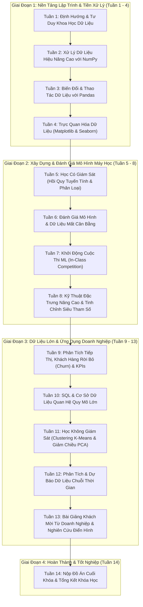
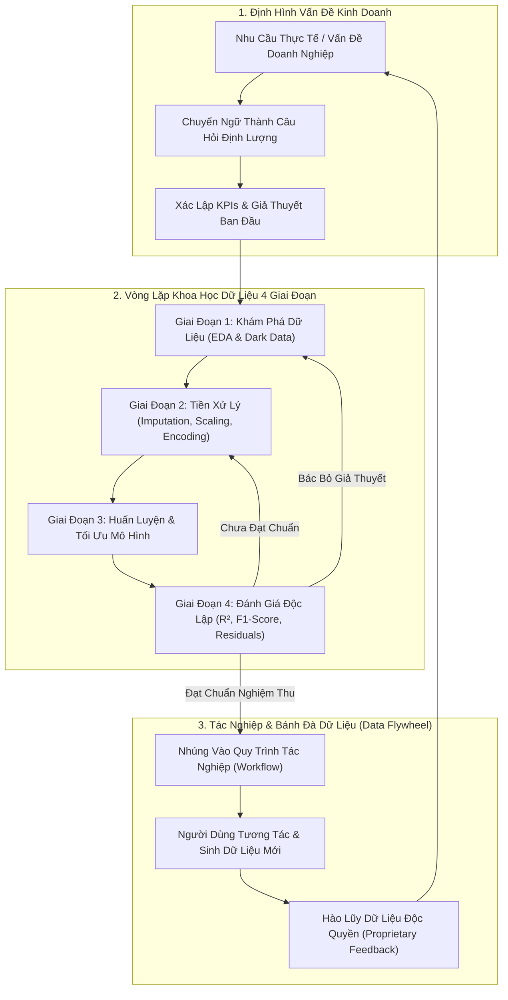
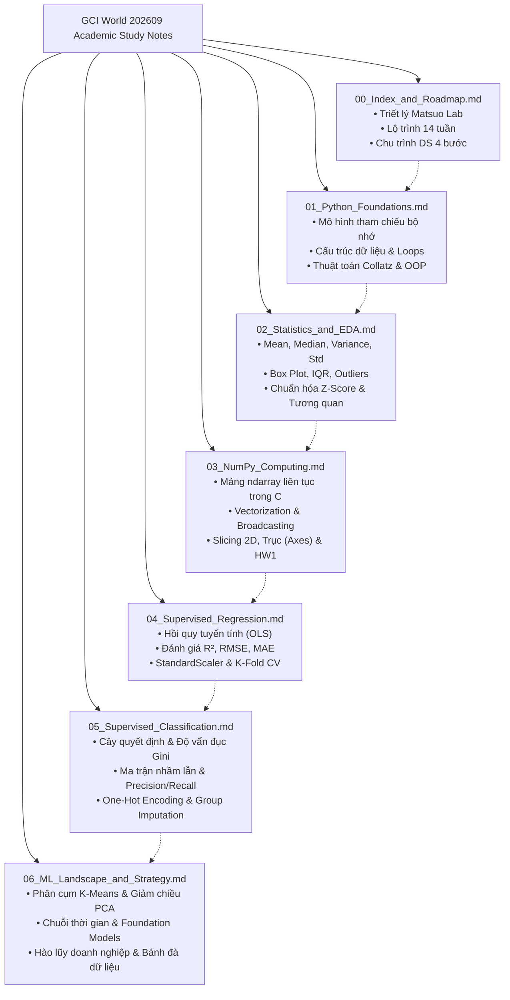

# 00. Tổng Quan Khóa Học & Lộ Trình Khoa Học Dữ Liệu (Course Index & Curriculum Roadmap)

> **Khóa học:** Global Consumer Intelligence (GCI World 2026 September)  
> **Đơn vị tổ chức:** Matsuo-Iwasawa Laboratory, Trường Sau đại học Kỹ thuật, Đại học Tokyo (The University of Tokyo)  
> **Hệ thống ghi chú:** Bộ tài liệu tóm tắt học thuật tiêu chuẩn (Academic Master Study Notes)  
> **Tài liệu nguồn tổng hợp:** `lec1_slides.pdf`, `prep0_slides.pdf`, `prep1_slides.pdf`, `prep5_slides.pdf`, `transcript_full.md`, `Lecture_01_Detailed_Notes.md`

---

## 1. Khung Lý Thuyết & Nền Tảng Khái Niệm

### 1.1. Triết Lý Đào Tạo & Tầm Nhìn Matsuo-Iwasawa Laboratory

Khóa học **Global Consumer Intelligence (GCI World)** được thiết kế bởi **Matsuo-Iwasawa Laboratory** thuộc Đại học Tokyo — một trong những trung tâm nghiên cứu trí tuệ nhân tạo và học sâu hàng đầu thế giới dưới sự dẫn dắt của Giáo sư Yutaka Matsuo. 

Mục tiêu tối thượng của chương trình không dừng lại ở việc đào tạo lập trình viên sử dụng thư viện hoặc người tiêu thụ công nghệ AI thụ động, mà nhằm đào tạo **Nhà Giải Quyết Vấn Đề Dựa Trên Dữ Liệu (Data-Driven Problem Solvers)**. Người học được trang bị tư duy chuyển hóa các hiện tượng thực tế hỗn loạn, các bài toán kinh doanh chưa rõ ràng thành các bài toán định lượng khả thi, từ đó trích xuất giá trị hành động có thể đo lường được.

```
[Hiện tượng kinh tế / xã hội] 
       │
       ▼ (Chuyển hóa & Định hình bài toán)
[Mô hình Định lượng & Khoa học Dữ liệu]
       │
       ▼ (Thuật toán, Thống kê, Mô hình hóa)
[Tri thức hành động (Actionable Insights) & Giá trị thực tiễn]
```

#### Chân Dung Chuyên Gia Dữ Liệu Toàn Diện (Well-Rounded Data Scientist)
Theo định hướng của Đại học Tokyo, cấu trúc năng lực của một Chuyên gia Dữ liệu thực thụ được phân bổ theo tỷ lệ vàng:
- **30% – 40% Năng lực Kỹ thuật (Technical & Algorithmic Skills):** Khả năng lập trình Python, xử lý dữ liệu hiệu năng cao với NumPy/Pandas, hiểu biết sâu sắc về toán học (đại số tuyến tính, giải tích, xác suất thống kê) và các thuật toán học máy (Machine Learning).
- **60% – 70% Năng lực Định hình Vấn đề & Giao tiếp (Business & Communication Skills):** 
  - Khả năng thấu hiểu bối cảnh ngành (Domain Expertise), nhận diện đúng bài toán "cần giải quyết" thay vì bài toán "dễ giải quyết".
  - Năng lực chuyển ngữ từ mục tiêu kinh doanh (tối ưu doanh thu, giảm tỷ lệ khách hàng rời bỏ - Churn) sang các hàm mất mát (Loss Functions) và chỉ số đo lường (KPI/KGI).
  - Năng lực thuyết phục và đàm phán giải pháp với các bên liên quan (Stakeholders) phi kỹ thuật.

---

### 1.2. Chiến Lược Hào Lũy AI (Defensible Moats) & Bánh Đà Dữ Liệu (Data Flywheel)

Trong kỷ nguyên bùng nổ của các **Mô hình Nền tảng (Foundation Models / Large Language Models)**, Giáo sư Matsuo và bài giảng Buổi 1 đã chỉ ra một sự dịch chuyển mang tính bước ngoặt về lợi thế cạnh tranh của doanh nghiệp:

1. **Sự Suy Tàn Của Hào Lũy Dữ Liệu Tĩnh (The Death of Static Data Moats):**
   - Trước đây, các doanh nghiệp phần mềm dạng dịch vụ (SaaS truyền thống) coi việc sở hữu cơ sở dữ liệu lớn (Big Data) là "hào lũy bất khả xâm phạm" (Defensible Moat).
   - Ngày nay, khi các mô hình nền tảng có thể tổng hợp và suy luận vượt bậc trên lượng tri thức mở khổng lồ, một cơ sở dữ liệu tĩnh độc lập rất nhanh chóng bị hàng hóa hóa (commoditized) và dễ dàng bị sao chép hoặc thay thế.

2. **Hào Lũy Bền Vững: Tích Hợp Sâu Vào Quy Trình Tác Nghiệp (Workflow Integration):**
   - Lợi thế cạnh tranh thực sự không nằm ở lượng dữ liệu lưu trữ trong kho, mà nằm ở **vị trí của giải pháp AI trong chuỗi giá trị và quy trình vận hành hàng ngày của người dùng**.
   - Khi hệ thống AI được tích hợp trực tiếp vào quy trình làm việc (như hệ thống đặt hàng bán lẻ, chẩn đoán y tế, tự động hóa chuỗi cung ứng), mọi thao tác, chỉnh sửa, và phản hồi của con người đều trở thành nguồn dữ liệu hiệu chỉnh độc quyền (Proprietary Feedback Loop).

3. **Cơ Chế Bánh Đà Dữ Liệu (The Data Flywheel):**
   - Sản phẩm giải quyết tốt một quy trình $\rightarrow$ Thu hút người dùng sử dụng liên tục $\rightarrow$ Sinh ra dữ liệu tương tác thực tế và phản hồi độc quyền $\rightarrow$ Huấn luyện và tinh chỉnh mô hình chính xác hơn $\rightarrow$ Sản phẩm vượt trội hơn đối thủ $\rightarrow$ Tiếp tục thu hút thêm người dùng.

```
       ┌────────────────────────────────────────────────────────┐
       │                                                        ▼
[Tích hợp Quy trình] ──> [Trải nghiệm Người dùng] ──> [Dữ liệu Tương tác Mới]
       ▲                                                        │
       │                                                        ▼
[Mô hình AI Tối ưu hơn] <── [Huấn luyện & Hiệu chỉnh] <── [Phản hồi Độc quyền]
```

---

### 1.3. Quy Trình Khoa Học Dữ Liệu 4 Giai Đoạn (4-Stage Data Science Lifecycle)

Một dự án khoa học dữ liệu chuẩn mực phải tuân thủ nghiêm ngặt chu trình 4 giai đoạn logic và có mối liên hệ khép kín:

#### Giai Đoạn 1: Thấu Hiểu Dữ Liệu & Khám Phá (Data Understanding & EDA)
- **Mục tiêu:** Nắm vững cấu trúc, ngữ nghĩa từng trường dữ liệu, loại dữ liệu (định lượng rời rạc/liên tục, định tính danh nghĩa/thứ bậc).
- **Công việc cốt lõi:**
  - Tính toán các đại lượng thống kê mô tả: Giá trị trung bình (Mean), Trung vị (Median), Độ lệch chuẩn ($\sigma$), Khoảng tứ phân vị (IQR).
  - Trực quan hóa hình thái phân phối (Histogram, Box Plot) để phát hiện độ lệch (Skewness) và điểm ngoại lai (Outliers).
  - Khám phá tương quan song biến (Scatter Plot, Pearson Correlation $r$).
  - **Kiểm định "Dữ liệu tối" (Dark Data Check):** Nhận diện những phần dữ liệu không được ghi nhận trong hệ thống (những khách hàng âm thầm bỏ đi không để lại khiếu nại, những giao dịch bị hủy trước khi thanh toán).

#### Giai Đoạn 2: Tiền Xử Lý Dữ Liệu (Data Preprocessing & Transformation)
- **Mục tiêu:** Chuyển đổi bảng dữ liệu thô nhiều khuyết tật thành ma trận số học chuẩn tắc mà các thuật toán máy học có thể tiếp nhận.
- **Công việc cốt lõi:**
  - **Xử lý giá trị khuyết (Missing Values):** Cân nhắc giữa xóa bỏ toàn bộ dòng (`dropna`) và điền khuyết (`fillna` bằng mode toàn cục hoặc mode có điều kiện theo nhóm `groupby`).
  - **Xử lý ngoại lai (Outlier Treatment):** Phân biệt giữa ngoại lai do lỗi nhập liệu (cần lọc bỏ) và ngoại lai hợp lệ phản ánh hiện tượng thực tế (cần giữ lại để bảo toàn phương sai).
  - **Mã hóa đặc trưng phân loại (Categorical Encoding):** Áp dụng One-Hot Encoding (`pd.get_dummies`) kèm tham số `drop_first=True` nhằm triệt tiêu hiện tượng đa cộng tuyến hoàn hảo (Dummy Variable Trap).
  - **Chuẩn hóa đặc trưng (Feature Scaling):** Đưa các thang đo khác biệt về cùng phân phối chuẩn tắc ($\mu = 0, \sigma = 1$) bằng `StandardScaler`, nghiêm cấm rò rỉ thông tin từ tập kiểm thử sang tập huấn luyện (No Data Leakage).

#### Giai Đoạn 3: Xây Dựng Mô Hình (Model Building & Optimization)
- **Mục tiêu:** Lựa chọn thuật toán phù hợp, phân tách tập dữ liệu và tối ưu hóa tham số mô hình.
- **Công việc cốt lõi:**
  - Phân tách độc lập: Tập huấn luyện (Train set) để học trọng số, tập xác thực (Validation/CV set) để chỉnh siêu tham số, tập kiểm thử (Test set) để đánh giá độc lập.
  - Áp dụng các thuật toán tương ứng với bài toán: Hồi quy tuyến tính (OLS), Cây quyết định (Decision Trees), K-Means, v.v.
  - Tối thiểu hóa hàm mất mát (Loss Function) thông qua giải thuật giải tích hoặc đạo hàm giảm dốc (Gradient Descent).

#### Giai Đoạn 4: Đánh Giá & Triển Khai Hành Động (Model Evaluation & Deployment)
- **Mục tiêu:** Đo lường độ tin cậy và triển khai mô hình vào thực tiễn kinh doanh.
- **Công việc cốt lõi:**
  - Đo lường bằng các chỉ số chuẩn: $R^2$, RMSE, MAE (cho Hồi quy); Accuracy, Precision, Recall, F1-Score (cho Phân loại).
  - Đánh giá trade-off chi phí sai lầm (Cost-sensitive Analysis): Xác định loại lỗi nào mang lại rủi ro nghiêm trọng hơn (False Positive hay False Negative).
  - Thiết lập vòng phản hồi (Feedback Loop) để mô hình liên tục được giám sát và tái huấn luyện khi dữ liệu thực tế thay đổi (Data Drift).

---

### 1.4. Vòng Lặp Khoa Học Thực Nghiệm & Nghiên Cứu Điển Hình: Seven-Eleven Japan

Khoa học dữ liệu là một khoa học thực nghiệm. Khóa học nhấn mạnh vòng lặp khoa học 4 bước thông qua nghiên cứu điển hình kinh điển về chuỗi cửa hàng tiện lợi **Seven-Eleven Japan (SEJ)**:

```
    ┌────────────────────────────────────────────────────────┐
    │                                                        │
    ▼                                                        │
[1. QUAN SÁT (Observe)]                                      │
- Dữ liệu bán hàng thời gian thực (POS)                      │
- Dự báo thời tiết địa phương theo giờ                       │
- Sự kiện khu vực (lễ hội, thi đấu, xây dựng)                │
    │                                                        │
    ▼                                                        │
[2. ĐẶT GIẢ THUYẾT (Hypothesize)]                            │
- "Trời mưa lúc 17:00, nhu cầu mì gói và ô sẽ tăng 45%"     │
- Xác định lượng đặt hàng tối ưu cho từng SKU                │
    │                                                        │
    ▼                                                        │
[3. THỰC NGHIỆM (Experiment)]                                │
- Đặt hàng thực tế lên chuỗi cung ứng                        │
- Sắp xếp vị trí trưng bày ưu tiên tại cửa hàng              │
    │                                                        │
    ▼                                                        │
[4. PHÂN TÍCH & ĐÁNH GIÁ (Analyze)]                          │
- Đối chiếu doanh số thực tế so với giả thuyết               │
- Phân tích hàng tồn kho hoặc tình trạng cháy hàng           │
    │                                                        │
    └────────────────────────────────────────────────────────┘
```

Bài học rút ra: Dữ liệu lịch sử chỉ phản ánh quá khứ. Việc dự đoán tương lai đòi hỏi một chu trình liên tục kiểm chứng giả thuyết bằng hành động thực nghiệm và thu thập phản hồi.

---

### 1.5. Cơ Cấu Đánh Giá & Tiêu Chuẩn Tốt Nghiệp Khóa Học

Khóa học GCI World áp dụng hệ sinh thái đánh giá đa tầng, phân cấp học viên thành 3 danh hiệu rõ rệt:

| Hạng mục | Quy chuẩn & Số lượng | Trọng số / Điều kiện tối thiểu |
| :--- | :--- | :--- |
| **Khảo sát Điểm danh (Attendance)** | 14 bài khảo sát (sau mỗi buổi học) | Hoàn thành tối thiểu **$\ge 7 / 14$ bài**. Mở trong 2 tuần, không chấp nhận nộp muộn. |
| **Bài tập tuần (Homework)** | 8 bài tập lập trình (Omnicampus autograder) | Tối đa 3 điểm/bài (tổng 24 điểm). Phải đạt **$\ge 14 / 24$ điểm**. Nộp đúng hạn = 3đ, nộp muộn = tối đa 2đ. |
| **Đồ án Chiến lược (Final Assignment)** | 1 đồ án kinh doanh + code + slide thuyết trình | Bắt buộc phải nộp và vượt qua mức đánh giá chuẩn. Đóng vai trò Data Scientist giải quyết trọn vẹn 1 bài toán thực tế. |
| **Cuộc thi Machine Learning (Competition)** | 1 kỳ thi tranh tài mô hình trên Omnicampus | Xây dựng pipeline dự đoán, tối ưu hóa điểm số Leaderboard. |

#### Ba Cấp Bậc Hoàn Thành Khóa Học:
1. **Completed Student (Tiêu Chuẩn):** Đạt $\ge 7$ bài khảo sát, $\ge 14$ điểm bài tập tuần, hoàn thành Đồ án cuối khóa. Nhận Certificate of Completion chính thức từ Đại học Tokyo.
2. **Honors Student (Danh Dự):** Đạt toàn bộ điều kiện tiêu chuẩn, đồng thời lọt vào **Top 10%** Đồ án cuối khóa và **Top 20%** Cuộc thi Machine Learning. Nhận Chứng chỉ Danh dự Đặc biệt và tham gia khóa huấn luyện nâng cao.
3. **Outstanding Student (Xuất Sắc):** Được chọn lọc từ nhóm đứng đầu của Honors Student. Nhận học bổng toàn phần tham gia **Chuyến tham quan học thuật (Study Tour) tại Tokyo, Nhật Bản** (thăm Matsuo Lab, làm việc trực tiếp với GS. Matsuo và các tập đoàn công nghệ Nhật Bản).

---

### 1.6. Danh Mục Điều Hướng 7 Bản Ghi Chú Học Thuật (Study Notes Index)

Hệ thống ghi chú học thuật GCI World được phân chia thành 7 chuyên đề độc lập, chuẩn hóa cao:

| File Ghi Chú | Chuyên Đề & Phạm Vi Nội Dung | Tương Ứng Tuần Học / Nguồn |
| :--- | :--- | :--- |
| **[`00_Index_and_Roadmap.md`](./00_Index_and_Roadmap.md)** | **Tổng quan khóa học, Triết lý Matsuo Lab, Lộ trình 14 tuần, 4 giai đoạn DS & Vòng lặp Seven-Eleven.** | Toàn khóa, Buổi 1 (`lec1_slides.pdf`), `prep0_slides.pdf` |
| **[`01_Python_Foundations.md`](./01_Python_Foundations.md)** | **Mô hình tính toán Python, Tham chiếu bộ nhớ, Cấu trúc dữ liệu, Thuật toán Collatz, Comprehensions & Kiến trúc OOP.** | PreLecture Python 1&2, `prep2_slides.pdf` |
| **[`02_Statistics_and_EDA.md`](./02_Statistics_and_EDA.md)** | **Thống kê mô tả, Phân phối, Trung vị vs Trung bình, Phương sai, Chuẩn hóa Z-Score, Box Plot IQR, Tương quan Pearson vs Nhân quả.** | `prep1_slides.pdf`, `prep3_slides.pdf`, Buổi 1 |
| **[`03_NumPy_Computing.md`](./03_NumPy_Computing.md)** | **Điện toán số học hiệu năng cao, Cấu trúc `ndarray`, Broadcasting, Trục (Axes), Boolean Indexing, Đại số tuyến tính & HW1.** | Buổi 2 (`lec2_slides.pdf`, `lec2_notebook.ipynb`, `HW1`) |
| **[`04_Supervised_Regression.md`](./04_Supervised_Regression.md)** | **Học có giám sát: Hồi quy tuyến tính (OLS), Độ đo ($R^2$, RMSE), Phân tách Train/Test, Xử lý ngoại lai, StandardScaler & K-Fold CV.** | `prep4_slides.pdf`, Regression Levels 0–4 |
| **[`05_Supervised_Classification.md`](./05_Supervised_Classification.md)** | **Học có giám sát: Cây quyết định, Độ vẩn đục Gini, One-Hot Encoding, Xử lý khuyết theo nhóm, Ma trận nhầm lẫn, Đánh đổi Precision/Recall.** | `prep4_slides.pdf`, Classification Levels 0–3 |
| **[`06_ML_Landscape_and_Strategy.md`](./06_ML_Landscape_and_Strategy.md)** | **Toàn cảnh Machine Learning: Phân cụm K-Means, Giảm chiều PCA, Chuỗi thời gian, Mô hình nền tảng (LLM) & Chiến lược dữ liệu doanh nghiệp.** | `prep4_slides.pdf`, `prep5_slides.pdf`, Buổi 1 & Buổi 11 |

---

## 2. Mã Nguồn Python & Kỹ Thuật Thực Thi Cốt Lõi

Đoạn mã dưới đây mô phỏng bằng ngôn ngữ lập trình Python thuần túy chu trình khoa học thực nghiệm và bánh đà dữ liệu lấy cảm hứng từ trường hợp điển hình **Seven-Eleven Japan**. 

Mã nguồn minh họa:
1. Ghi nhận dữ liệu quan sát đầu vào (POS, thời tiết, sự kiện).
2. Xây dựng hàm đặt giả thuyết nhu cầu (Demand Hypothesis Function).
3. Đặt hàng và ghi nhận phản hồi kinh doanh thực tế.
4. Đánh giá sai lệch (Residual Error Analysis) và cập nhật hệ số cho vòng lặp tiếp theo.

```python
"""
Seven-Eleven Japan Empirical Loop Simulation
Author: Matsuo Lab GCI World Study Synthesis
Purpose: Demonstrates the 4-stage empirical inquiry cycle in production code.
"""

from typing import List, Dict, Tuple


class RetailEmpiricalLoop:
    """
    Simulates the scientific observation-hypothesis-experiment-analysis
    cycle for store inventory optimization.
    """

    def __init__(self, base_demand: float, weather_sensitivity: float):
        """
        Initializes the empirical demand forecasting model.

        Parameters:
        -----------
        base_demand : float
            Baseline unit sales under normal clear weather conditions.
        weather_sensitivity : float
            Marginal increase in demand per millimeter of expected rainfall.
        """
        self.base_demand: float = base_demand
        self.weather_sensitivity: float = weather_sensitivity
        self.history: List[Dict[str, float]] = []

    def observe_and_hypothesize(self, rainfall_mm: float, event_multiplier: float) -> float:
        """
        Stage 1 & 2: Observe environmental signals and generate SKU demand hypothesis.

        Formula: Expected Demand = (Base + Rainfall * Sensitivity) * EventMultiplier
        """
        forecast_demand = (self.base_demand + rainfall_mm * self.weather_sensitivity) * event_multiplier
        # Demand cannot be negative; rounded to discrete integer order units
        return max(0.0, round(forecast_demand))

    def experiment_and_record(
        self,
        day_index: int,
        ordered_units: float,
        actual_demand: float,
        unit_cost: float,
        selling_price: float,
    ) -> Dict[str, float]:
        """
        Stage 3: Execute replenishment order (Experiment) and record sell-through.

        Calculates:
        - Units sold (min between inventory ordered and customer footfall demand)
        - Stockout loss (unrealized demand when actual > ordered)
        - Wastage (perishable excess inventory when ordered > actual)
        - Net profit achieved
        """
        units_sold = min(ordered_units, actual_demand)
        stockout_units = max(0.0, actual_demand - ordered_units)
        wasted_units = max(0.0, ordered_units - actual_demand)

        revenue = units_sold * selling_price
        total_procurement_cost = ordered_units * unit_cost
        net_profit = revenue - total_procurement_cost

        # Residual error: Difference between reality and our hypothesis
        forecast_error = actual_demand - ordered_units

        record = {
            "day": float(day_index),
            "ordered": ordered_units,
            "actual": actual_demand,
            "error": forecast_error,
            "sold": units_sold,
            "stockout": stockout_units,
            "wasted": wasted_units,
            "net_profit": net_profit,
        }
        self.history.append(record)
        return record

    def analyze_and_adapt(self, learning_rate: float = 0.1) -> Tuple[float, float]:
        """
        Stage 4: Analyze empirical performance and adapt model parameters
        for the subsequent iteration (The Feedback Loop).
        """
        if not self.history:
            return self.base_demand, self.weather_sensitivity

        # Calculate Mean Signed Error of the most recent cycle
        latest_record = self.history[-1]
        error = latest_record["error"]

        # If actual was higher than ordered, error > 0 -> Increase baseline
        # If actual was lower, error < 0 -> Decrease baseline
        self.base_demand += learning_rate * error
        return self.base_demand, self.weather_sensitivity


# =====================================================================
# Execution Demonstration: Running a 3-Day Empirical Cycle
# =====================================================================
if __name__ == "__main__":
    # Initialize store model with baseline 100 onigiri/day, +5 units per mm of rain
    store_agent = RetailEmpiricalLoop(base_demand=100.0, weather_sensitivity=5.0)

    unit_cost = 70.0      # Cost to produce one unit (JPY)
    selling_price = 150.0  # Retail price per unit (JPY)

    # 3-day scenario simulation:
    # Day 1: Rain forecast = 4mm, local sports event (multiplier 1.2x), Actual demand = 140
    # Day 2: Rain forecast = 0mm, regular day (multiplier 1.0x), Actual demand = 95
    # Day 3: Rain forecast = 10mm (heavy storm), multiplier 0.8x (footfall down), Actual = 110
    scenarios = [
        {"day": 1, "rain": 4.0, "event": 1.2, "actual": 140.0},
        {"day": 2, "rain": 0.0, "event": 1.0, "actual": 95.0},
        {"day": 3, "rain": 10.0, "event": 0.8, "actual": 110.0},
    ]

    print("=== SEVEN-ELEVEN JAPAN EMPIRICAL INVENTORY CYCLE SIMULATION ===")
    for sc in scenarios:
        # 1 & 2. Observe & Hypothesize
        order_qty = store_agent.observe_and_hypothesize(sc["rain"], sc["event"])

        # 3. Experiment & Record results
        outcome = store_agent.experiment_and_record(
            day_index=sc["day"],
            ordered_units=order_qty,
            actual_demand=sc["actual"],
            unit_cost=unit_cost,
            selling_price=selling_price,
        )

        # 4. Analyze & Adapt parameters
        new_base, _ = store_agent.analyze_and_adapt(learning_rate=0.2)

        print(
            f"Day {int(outcome['day'])} | Ordered: {outcome['ordered']:.0f} | "
            f"Actual: {outcome['actual']:.0f} | Error: {outcome['error']:+4.0f} | "
            f"Profit: ¥{outcome['net_profit']:,.0f} | Next Base Demand: {new_base:.1f}"
        )
```

---

## 3. Sơ Đồ Tư Duy & Quy Trình Trực Quan (Mermaid.js)

### 3.1. Lộ Trình Khóa Học 14 Tuần (14-Week Curriculum Arc)



---

### 3.2. Chu Trình Khoa Học Dữ Liệu & Bánh Đà Giá Trị Doanh Nghiệp



---

### 3.3. Sơ Đồ Kiến Trúc Hệ Thống Ghi Chú Học Thuật GCI World



---

## 4. Hệ Thống Thẻ Ghi Nhớ Chủ Động (Active Recall Flashcards)

Hệ thống 8 thẻ câu hỏi dưới đây được thiết kế nhằm giúp học viên tự kiểm tra và khắc sâu các khái niệm bản chất:

### Thẻ 1: Triết Lý Năng Lực Của Chuyên Gia Dữ Liệu
- **Hỏi:** Theo quan điểm đào tạo của Matsuo-Iwasawa Lab (Đại học Tokyo), tỷ lệ phân bổ năng lực lý tưởng của một Chuyên gia Dữ liệu thực thụ là gì?
- **Đáp:** Khoảng **30% – 40%** là kỹ năng lập trình, viết code và sử dụng công cụ AI; **60% – 70%** còn lại là năng lực định hình bài toán kinh doanh, hiểu biết chuyên ngành (Domain Knowledge) và kỹ năng giao tiếp, thuyết phục con người.

### Thẻ 2: Hào Lũy Cạnh Tranh Thời Đại AI
- **Hỏi:** Tại sao trong kỷ nguyên của các Mô hình Nền tảng (Foundation Models), một cơ sở dữ liệu tĩnh đồ sộ (SaaS truyền thống) không còn là hào lũy cạnh tranh bền vững?
- **Đáp:** Bởi vì các mô hình nền tảng mạnh mẽ có thể dễ dàng tiếp thu, phân tích và suy luận trên dữ liệu mở, biến dữ liệu tĩnh thành thứ dễ bị sao chép. Hào lũy thực sự nằm ở **Tích hợp sâu vào quy trình tác nghiệp (Workflow Integration)**, nơi hệ thống liên tục sinh ra dữ liệu mới và nhận phản hồi độc quyền từ thao tác người dùng (Data Flywheel).

### Thẻ 3: Khái Niệm "Dữ Liệu Tối" (Dark Data)
- **Hỏi:** "Dữ liệu tối" (Dark Data) là gì và tại sao việc bỏ qua nó trong giai đoạn Thấu hiểu dữ liệu (EDA) có thể dẫn tới thất bại của mô hình?
- **Đáp:** Dark Data là những dữ liệu tồn tại trong thế giới thực nhưng **hoàn toàn không được thu thập hoặc ghi nhận vào hệ thống** (ví dụ: khách hàng bỏ đi không mua hàng, giao dịch lỗi không sinh bản ghi). Nếu chỉ huấn luyện mô hình trên dữ liệu hiện có trong bảng, mô hình sẽ mắc **thiên lệch lựa chọn trầm trọng (Selection Bias)** và dự đoán sai lệch trên thực tế.

### Thẻ 4: Bản Chất Chu Trình 4 Giai Đoạn Của Khoa Học Dữ Liệu
- **Hỏi:** Liệt kê 4 giai đoạn cốt lõi của một dự án Khoa học Dữ liệu và giải thích tại sao quy trình này mang tính chất phi tuyến tính (lặp vòng)?
- **Đáp:** 4 giai đoạn gồm: (1) Thấu hiểu dữ liệu & Bài toán, (2) Tiền xử lý dữ liệu, (3) Xây dựng mô hình, (4) Đánh giá & Triển khai. Quy trình có tính chu kỳ vì khi đánh giá mô hình không đạt chuẩn hoặc phát hiện sai số bất thường, người làm dữ liệu bắt buộc phải quay ngược lại giai đoạn 2 (để xử lý lại dữ liệu) hoặc giai đoạn 1 (để đặt lại giả thuyết kinh doanh).

### Thẻ 5: Bài Học Từ Vòng Lặp Seven-Eleven Japan
- **Hỏi:** Chuỗi tiện lợi Seven-Eleven Japan ứng dụng vòng lặp thực nghiệm khoa học trong quản lý bán lẻ như thế nào?
- **Đáp:** Thông qua 4 bước: (1) Quan sát dữ liệu POS, thời tiết và sự kiện hàng ngày $\rightarrow$ (2) Đặt giả thuyết số lượng hàng cần bán cho từng mặt hàng (SKU) $\rightarrow$ (3) Thực nghiệm đặt hàng thực tế lên kệ $\rightarrow$ (4) Phân tích đối chiếu giữa dự đoán và doanh số bán thực tế để hiệu chỉnh thuật toán đặt hàng cho chu kỳ tiếp theo.

### Thẻ 6: Quy Tắc Chống Rò Rỉ Dữ Liệu (Data Leakage)
- **Hỏi:** Trong quy trình tiền xử lý, tại sao việc chuẩn hóa thang đo (`StandardScaler`) hoặc điền dữ liệu khuyết phải khớp (`fit`) hoàn toàn trên tập Huấn luyện (Train) trước khi chuyển đổi (`transform`) tập Kiểm thử (Test)?
- **Đáp:** Để ngăn ngừa hiện tượng **Rò rỉ dữ liệu (Data Leakage)**. Nếu ta tính toán giá trị trung bình ($\mu$) hoặc độ lệch chuẩn ($\sigma$) trên toàn bộ tập dữ liệu (bao gồm cả tập test), mô hình đã vô tình tiếp cận trước thông tin phân phối của tập kiểm thử, dẫn tới kết quả đánh giá quá lạc quan nhưng thất bại khi chạy trên dữ liệu thực tế.

### Thẻ 7: Tiêu Chuẩn Giành Chuyến Đi Nhật Bản (Outstanding Student)
- **Hỏi:** Để đạt danh hiệu Học viên Xuất sắc (Outstanding Student) và được tài trợ tham gia chuyến Study Tour tại Tokyo, học viên cần đáp ứng những tiêu chí nào?
- **Đáp:** Học viên phải hoàn thành tối thiểu 7 bài khảo sát, đạt $\ge 14/24$ điểm bài tập tuần, đồng thời nằm trong **Top 10%** Đồ án cuối khóa (Final Assignment) và **Top 20%** Cuộc thi Machine Learning (Competition), sau đó được hội đồng Matsuo Lab phỏng vấn tuyển chọn trực tiếp.

### Thẻ 8: Bản Chất Của Mô Hình Máy Học Hộp Trắng vs Hộp Đen
- **Hỏi:** Sự khác biệt cơ bản giữa mô hình Hộp trắng (White-box như Hồi quy tuyến tính, Cây quyết định) và mô hình Hộp đen (Black-box như Mạng nơ-ron sâu) trong bối cảnh ứng dụng doanh nghiệp là gì?
- **Đáp:** Mô hình hộp trắng cung cấp khả năng diễn giải trực tiếp (trọng số hệ số $\mathbf{w}$, các quy tắc rẽ nhánh if-then), cho phép doanh nghiệp giải trình lý do đưa ra quyết định với khách hàng và cơ quan quản lý. Mô hình hộp đen có độ chính xác biểu diễn cao hơn nhưng không thể giải trình cơ chế nội tại, đòi hỏi các kỹ thuật diễn giải hậu nghiệm (như SHAP/LIME).

---

## 5. Các Bẫy Tri Thức & Trường Hợp Biên (Edge Cases)

Trong quá trình tiếp cận và triển khai dự án dữ liệu, các chuyên gia thường gặp phải 5 cái bẫy tư duy kinh điển:

### Bẫy 1: Ảo Tưởng "Dữ Liệu Lớn" & Thiên Lệch Lựa Chọn (Selection Bias)
- **Bản chất sai lầm:** Cho rằng khi có trong tay hàng triệu dòng dữ liệu (Big Data) thì mọi suy luận rút ra đều tự động đúng đắn.
- **Hiện tượng thực tế:** Trong cuộc bầu cử tổng thống Mỹ năm 1936, tạp chí *Literary Digest* khảo sát hơn 2 triệu độc giả (mẫu khổng lồ) nhưng dự đoán sai hoàn toàn, do danh sách khảo sát lấy từ danh bạ điện thoại và đăng ký xe hơi thời kỳ Đại khủng hoảng — tức chỉ đại diện cho tầng lớp giàu có.
- **Cách phòng tránh:** Luôn đặt câu hỏi: *"Ai hoặc cái gì KHÔNG có mặt trong tập dữ liệu này?"* Kiểm tra tính đại diện của mẫu trước khi tối ưu hóa thuật toán.

### Bẫy 2: Ngộ Nhận Tương Quan Đồng Nghĩa Với Nhân Quả (Correlation $\ne$ Causation)
- **Bản chất sai lầm:** Thấy hai biến số có hệ số tương quan tuyến tính $r$ rất cao thì vội vã kết luận biến này là nguyên nhân sinh ra biến kia.
- **Hiện tượng thực tế:** Lượng kem bán ra và số vụ chết đuối tại các bãi biển có tương quan thuận rất mạnh ($r > 0.85$). Tuy nhiên, ăn kem không gây chết đuối; biến ẩn (Confounding/Lurking Variable) chính là nhiệt độ mùa hè: trời nắng nóng thúc đẩy người dân vừa đi bơi nhiều hơn vừa mua kem nhiều hơn.
- **Cách phòng tránh:** Không bao giờ đưa ra quyết định can thiệp chính sách chỉ dựa trên tương quan thuần túy mà phải thông qua thử nghiệm A/B (A/B Testing) hoặc suy luận nhân quả (Causal Inference).

### Bẫy 3: Sa Đà Vào Kỹ Thuật (Tool-Obsessed Trap)
- **Bản chất sai lầm:** Dành 95% thời gian để thử nghiệm các thuật toán phức tạp nhất (Deep Learning, Transformers, XGBoost) trong khi chưa làm rõ mục tiêu kinh doanh.
- **Hiện tượng thực tế:** Mô hình dự đoán khách hàng rời bỏ đạt độ chính xác 99%, nhưng các đặc trưng quan trọng nhất lại là những biến số phát sinh SAU KHI khách hàng đã hoàn tất thủ tục hủy dịch vụ. Mô hình hoàn hảo về mặt điểm số nhưng hoàn toàn vô giá trị trong tác nghiệp phòng ngừa.
- **Cách phòng tránh:** Dành tối thiểu 50% thời gian ban đầu để phỏng vấn các chuyên gia nghiệp vụ, hiểu rõ quy trình phát sinh dữ liệu và định nghĩa bài toán can thiệp khả thi.

### Bẫy 4: Bẫy Tối Ưu Hóa Cục Bộ Điểm Đánh Giá (Metric Overfitting / Goodhart's Law)
- **Bản chất sai lầm:** *"Khi một thước đo trở thành mục tiêu, nó không còn là một thước đo tốt nữa"* (Định luật Goodhart).
- **Hiện tượng thực tế:** Tối ưu hóa tối đa chỉ số Accuracy trong bài toán phát hiện gian lận tín dụng (chỉ có 0.1% giao dịch gian lận). Một mô hình phân loại toàn bộ giao dịch là "hợp lệ" sẽ đạt Accuracy 99.9% nhưng hoàn toàn tê liệt chức năng phát hiện rủi ro.
- **Cách phòng tránh:** Kết hợp các chỉ số đánh đổi (Precision vs Recall, Cost Matrix tính toán thiệt hại tài chính thực tế của từng loại lỗi nhầm lẫn).

### Bẫy 5: Bẫy Rò Rỉ Dữ Liệu Thời Gian (Temporal Data Leakage)
- **Bản chất sai lầm:** Phân chia tập dữ liệu ngẫu nhiên (`train_test_split(shuffle=True)`) trên dữ liệu có yếu tố chuỗi thời gian (Time-series / Sequential Data).
- **Hiện tượng thực tế:** Mô hình dùng thông tin giao dịch của ngày mai để dự đoán giá cổ phiếu hoặc nhu cầu mua sắm của ngày hôm nay. Khi kiểm thử trên tập test xáo trộn ngẫu nhiên, điểm số cao vượt trội; khi triển khai thực tế trên dữ liệu thời gian thực, mô hình sụp đổ hoàn toàn.
- **Cách phòng tránh:** Với dữ liệu chuỗi thời gian, bắt buộc phải phân chia theo trục thời gian (Time-based split: Train là quá khứ, Test là tương lai), tuyệt đối không xáo trộn ngẫu nhiên.
