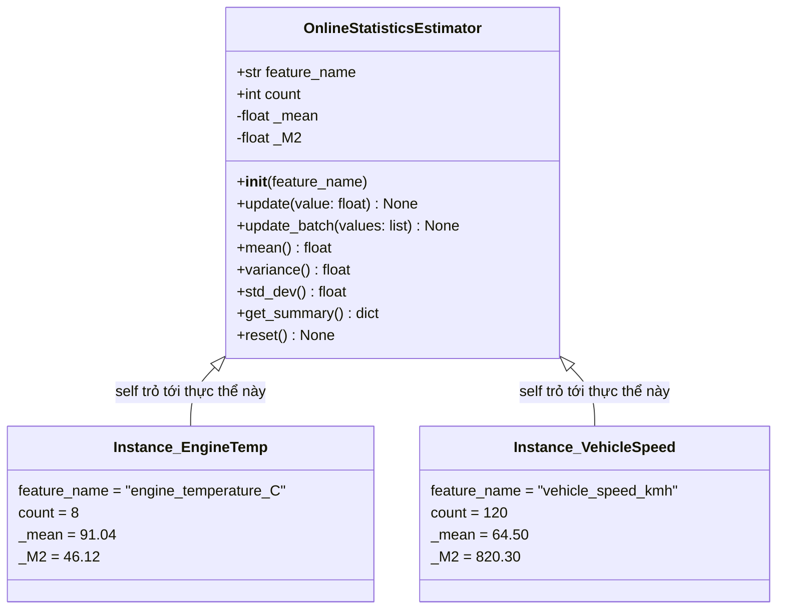

# 01. Nền Tảng Lập Trình Python Cho Khoa Học Dữ Liệu (Python Foundations for Data Science)

> **Khóa học:** Global Consumer Intelligence (GCI World 2026 September)  
> **Đơn vị tổ chức:** Matsuo-Iwasawa Laboratory, Trường Sau đại học Kỹ thuật, Đại học Tokyo (The University of Tokyo)  
> **Hệ thống ghi chú:** Bộ tài liệu tóm tắt học thuật tiêu chuẩn (Academic Master Study Notes)  
> **Tài liệu nguồn tổng hợp:** `prep2_slides.pdf`, `prelecture_slides.pdf`, `prelecture_notebook.ipynb`, `prelecture_notebook_answer.ipynb`

---

## 1. Khung Lý Thuyết & Nền Tảng Khái Niệm

### 1.1. Mô Hình Tính Toán Của Python & Tham Chiếu Bộ Nhớ (Reference Binding Model)

Trong các ngôn ngữ biên dịch tĩnh như C hoặc C++, một biến được coi như một "ngăn chứa" có kiểu cố định tại một địa chỉ bộ nhớ cụ thể (`memory cell`), và giá trị được ghi trực tiếp vào bên trong ô nhớ đó. 

Tuy nhiên, trong **Python**, mô hình tính toán hoàn toàn khác biệt:
1. **Biến là nhãn tham chiếu (Reference Labels / Pointers):** 
   - Mọi thực thể trong Python (từ số nguyên, chuỗi văn bản, danh sách cho đến hàm và lớp) đều là **đối tượng động cấp phát trên vùng nhớ Heap (`PyObject`)**.
   - Biến số thực chất chỉ là một "nhãn tên" (Name tag) lưu trữ con trỏ trỏ tới địa chỉ của đối tượng tương ứng trên Heap.
   - Phép gán `x = 10` không phải là hành vi đặt số 10 vào "chiếc hộp" `x`, mà là **liên kết định danh (Name Binding)** tên `x` với đối tượng số nguyên `10` đã được tạo trên Heap.
2. **Định danh đối tượng (`id()`) và Toán tử so sánh:**
   - Hàm `id(obj)` trả về địa chỉ bộ nhớ nguyên thủy của đối tượng trong CPython.
   - Toán tử `is` kiểm tra **tính đồng nhất danh tính (Identity)**: `a is b` tương đương với `id(a) == id(b)` (cả hai tên biến cùng trỏ vào một vùng nhớ duy nhất).
   - Toán tử `==` kiểm tra **sự tương đương về giá trị (Equality)**: gọi phương thức `__eq__` để so sánh nội dung mà không quan tâm địa chỉ ô nhớ.
3. **Cơ chế Quản lý Bộ nhớ Tự động (Memory Management):**
   - Python sử dụng cơ chế **Đếm tham chiếu (Reference Counting)** kết hợp với **Bộ thu gom rác định kỳ (Cyclic Garbage Collector)**. Khi số lượng biến trỏ tới một đối tượng giảm về 0, vùng nhớ của đối tượng đó sẽ được tự động giải phóng.

---

### 1.2. Tính Bất Biến (Immutability) vs. Tính Thay Đổi (Mutability)

Hiểu rõ ranh giới giữa các kiểu dữ liệu có thể thay đổi và bất biến là điều kiện tiên quyết để tránh các lỗi ẩn (silent bugs) khi xử lý dữ liệu lớn.

| Tiêu chí | Kiểu Bất Biến (Immutable) | Kiểu Có Thể Thay Đổi (Mutable) |
| :--- | :--- | :--- |
| **Các kiểu tiêu biểu** | `int`, `float`, `bool`, `str`, `tuple`, `frozenset` | `list`, `dict`, `set`, các đối tượng Class tự định nghĩa |
| **Bản chất khi sửa đổi** | Không thể thay đổi trạng thái đối tượng tại chỗ. Mọi phép toán thay đổi đều tạo ra một **đối tượng hoàn toàn mới** trên Heap. | Có thể thêm, bớt, sửa đổi các phần tử bên trong **ngay tại vị trí ô nhớ hiện tại (in-place modification)**. |
| **Địa chỉ `id()` khi sửa đổi** | Thay đổi địa chỉ (trỏ sang ô nhớ mới). | Giữ nguyên địa chỉ `id()` ban đầu. |
| **Nguy cơ tiềm ẩn** | Chi phí bộ nhớ khi nối chuỗi/tạo số liên tục trong vòng lặp lớn. | Hiện tượng bí danh (Aliasing): Nhiều biến cùng trỏ vào một danh sách, sửa một biến làm biến kia đổi theo. |

#### Sao Chép Nông (Shallow Copy) vs. Sao Chép Sâu (Deep Copy)
- **Gán tham chiếu (`b = a`):** Không tạo ra đối tượng mới; `b` và `a` cùng trỏ vào một danh sách.
- **Sao chép nông (`b = a.copy()` hoặc `b = a[:]`):** Tạo ra một vỏ danh sách mới, nhưng các phần tử bên trong (nếu là đối tượng lồng nhau) vẫn giữ nguyên tham chiếu cũ.
- **Sao chép sâu (`b = copy.deepcopy(a)`):** Đệ quy duyệt qua toàn bộ cấu trúc và sao chép độc lập toàn bộ các cấp đối tượng lồng nhau.

#### Phương Thức Tại Chỗ (In-place) vs. Hàm Trả Về Bản Sao (Out-of-place)
- `list.sort()`: Sắp xếp danh sách tại chỗ, thay đổi trực tiếp mảng bộ nhớ gốc, **trả về `None`**.
- `sorted(iterable)`: Không làm thay đổi tập dữ liệu gốc, tạo và **trả về một danh sách mới** đã được sắp xếp.

---

### 1.3. Hệ Thống Kiểu Dữ Liệu & Quy Tắc Ưu Tiên Toán Tử

Python hỗ trợ các kiểu dữ liệu nguyên thủy cơ bản phục vụ tính toán khoa học:
- `int`: Số nguyên có độ chính xác tùy ý (Arbitrary Precision Arithmetic), không bị tràn số nguyên 32-bit/64-bit như C.
- `float`: Số thực dấu phẩy động 64-bit tuân thủ chuẩn IEEE 754 (Double Precision).
- `bool`: Kiểu logic (`True`, `False`), là lớp con của `int` (`True == 1`, `False == 0`).
- `str`: Chuỗi ký tự Unicode bất biến.

#### Bảng Thứ Tự Ưu Tiên Của Các Toán Tử (Operator Precedence)
Khi tính toán các biểu thức số học phức tạp, Python thực hiện theo thứ tự từ trên xuống dưới:

1. Dấu ngoặc đơn: `()`
2. Phép lũy thừa: `**` (kết hợp từ phải sang trái: `2 ** 3 ** 2 = 2 ** 9 = 512`)
3. Toán tử đơn nguyên: `+x`, `-x`, `~x`
4. Phép nhân, chia, chia lấy nguyên, chia lấy dư: `*`, `/`, `//`, `%`
5. Phép cộng và trừ: `+`, `-`
6. Phép so sánh quan hệ: `<`, `<=`, `>`, `>=`, `==`, `!=`, `is`, `in`
7. Toán tử logic phủ định: `not`
8. Toán tử logic và: `and`
9. Toán tử logic hoặc: `or`

> **Quy tắc phân biệt phép chia:**
> - Phép chia `/`: Luôn luôn trả về kiểu số thực `float`, kể cả khi chia hết (ví dụ: `4 / 2` cho kết quả `2.0`).
> - Phép chia lấy nguyên `//`: Thực hiện phép chia sàn (Floor Division), làm tròn xuống số nguyên nhỏ hơn gần nhất (ví dụ: `17 // 5 = 3`, nhưng `-17 // 5 = -4`).
> - Phép chia lấy dư `%`: Thỏa mãn đẳng thức toán học: $x = (x // y) \cdot y + (x \% y)$.

---

### 1.4. Cấu Trúc Dữ Liệu Tập Hợp (Collections Architecture)

#### 1. Danh Sách (`list`)
- Cấu trúc: Mảng động (Dynamic Array) lưu trữ danh sách các con trỏ trỏ tới các đối tượng trên Heap.
- Đặc tính: Cho phép lưu trữ các kiểu dữ liệu không đồng nhất (Heterogeneous), có thứ tự (Ordered), có thể thay đổi (Mutable).
- Cú pháp cắt lát (Slicing): `sequence[start:stop:step]`
  - Khoảng chỉ số là **nửa mở $[start, stop)$**: phần tử tại chỉ số `start` được lấy, phần tử tại `stop` bị loại trừ.
  - Chỉ số âm: Đếm ngược từ cuối danh sách (`-1` là phần tử cuối cùng, `-2` là áp chót).
  - Bước nhảy (`step`): `[::-1]` tạo bản sao đảo ngược toàn bộ mảng.

#### 2. Bộ Giá Trị (`tuple`)
- Cấu trúc: Chuỗi các tham chiếu bất biến (Immutable).
- Ứng dụng trong Khoa học Dữ liệu: Sử dụng làm khóa (Key) cho Dictionary khi cần phối hợp nhiều chiều (ví dụ: tọa độ `(lat, lon)`), đóng gói giá trị trả về của hàm (Multiple Return Values).
- Tối ưu hiệu năng: Cấp phát bộ nhớ tĩnh, chi phí overhead thấp hơn `list`.

#### 3. Từ Điển (`dict`)
- Cấu trúc: Bảng băm (Hash Table) ánh xạ cặp `key: value`.
- Độ phức tạp: Truy xuất, thêm, sửa, xóa trung bình đạt $O(1)$.
- Yêu cầu đối với Khóa (`key`): Phải là đối tượng có thể băm được (Hashable) và bất biến (như `int`, `str`, `tuple`). Danh sách `list` không thể làm khóa.
- Duyệt từ điển: `.keys()` lấy danh sách khóa, `.values()` lấy danh sách giá trị, `.items()` lấy các cặp `(key, value)`.

---

### 1.5. Cấu Trúc Điều Khiển Luồng & Tư Duy Thuật Toán (Control Flow & Algorithms)

#### 1. Rẽ Nhánh Điều Kiện (`if / elif / else`)
- Python sử dụng thụt lề (Indentation - chuẩn 4 dấu cách) để xác định khối lệnh thay cho dấu ngoặc nhọn `{}`.
- Cơ chế **Đánh giá ngắn mạch (Short-Circuit Evaluation)**:
  - Biểu thức `A and B`: Nếu `A` là `False`, Python dừng lại ngay lập tức và trả về `A`, không đánh giá `B`.
  - Biểu thức `A or B`: Nếu `A` là `True`, Python dừng lại ngay lập tức và trả về `A`, không đánh giá `B`.

#### 2. Vòng Lặp & Giao Thức Duyệt Lặp (`for`, `while`)
- Hàm `range(start, stop, step)`: Trình tạo (Generator-like sequence) sinh dãy số theo nhu cầu (Lazy Evaluation), tiết kiệm bộ nhớ $O(1)$.
- Hàm `enumerate(iterable, start=0)`: Duyệt qua tập hợp đồng thời trả về cặp `(index, value)`, loại bỏ nhu cầu duy trì thủ công một biến đếm chỉ số.
- Vòng lặp `while`: Duyệt lặp dựa trên điều kiện dừng, kết hợp `break` (thoát ngay lập tức) và `continue` (bỏ qua bước hiện tại).

#### 3. Bài Toán Giả Thuyết Collatz (Collatz Conjecture / $3n+1$)
Bài toán toán học nổi tiếng được đưa vào bài giảng GCI để rèn luyện tư duy vòng lặp và điều kiện phân nhánh:
Với một số nguyên dương $a_1 > 0$, dãy số được xác định bởi:
$$a_{n+1} = \begin{cases} \frac{a_n}{2} & \text{nếu } a_n \text{ là số chẵn} \\ 3a_n + 1 & \text{nếu } a_n \text{ là số lẻ} \end{cases}$$
Giả thuyết khẳng định rằng với mọi số nguyên dương khởi đầu, dãy số sẽ luôn hội tụ về 1. Số bước lặp để hội tụ phản ánh độ phức tạp thuật toán và khả năng kiểm soát điều kiện dừng của vòng lặp `while a != 1`.

---

### 1.6. Lập Trình Hàm, Lambda & List Comprehensions

#### 1. Khai Báo Hàm (`def`) & Quy Tắc Phạm Vi LEGB
Khi một biến được truy xuất trong hàm, Python tìm kiếm theo 4 phạm vi thứ bậc (LEGB):
1. **Local (L):** Khai báo bên trong hàm hiện tại.
2. **Enclosing (E):** Nằm trong hàm bao ngoài (đối với hàm lồng nhau / closure).
3. **Global (G):** Khai báo ở tầng module ngoài cùng của tệp.
4. **Built-in (B):** Các hàm và hằng số định nghĩa sẵn của ngôn ngữ (`len`, `range`, `print`).

#### 2. Hàm Vô Danh (Lambda Functions)
- Cú pháp: `lambda arg1, arg2: expression`
- Đặc tính: Hàm một dòng, không có câu lệnh `return` rõ ràng, tự động trả về kết quả của biểu thức. Thường dùng trong các hàm bậc cao như `sorted(..., key=lambda x: x[1])` hoặc biến đổi dữ liệu Pandas `df['col'].apply(lambda x: ...)`.

#### 3. List Comprehension
- Cú pháp: `[expression for item in iterable if condition]`
- Ưu điểm: Ngắn gọn, dễ đọc, và tốc độ thực thi nhanh hơn vòng lặp `for` truyền thống kết hợp `.append()` vì việc tạo danh sách được tối ưu hóa ở tầng mã máy C (Bytecode `BUILD_LIST`).

---

### 1.7. Kiến Trúc Lập Trình Hướng Đối Tượng (OOP Architecture)

Khoa học Dữ liệu hiện đại yêu cầu tổ chức mã nguồn có cấu trúc nhằm đóng gói các quy trình tiền xử lý, biến đổi đặc trưng và mô hình dự đoán (tương tự kiến trúc Estimator/Transformer của thư viện Scikit-Learn).

1. **Lớp (Class):** Bản thiết kế (Blueprint) trừu tượng quy định cấu trúc thuộc tính (Attributes) và hành vi (Methods).
2. **Thực thể (Instance):** Đối tượng cụ thể được cấp phát độc lập trên bộ nhớ Heap khi gọi `obj = ClassName()`.
3. **Phương thức khởi tạo `__init__`:** Hook khởi tạo tự động chạy ngay sau khi đối tượng được cấp phát, thiết lập trạng thái ban đầu cho thực thể.
4. **Tham số `self`:**
   - Là tham chiếu tường minh tới chính thực thể đang được thao tác.
   - Khi gọi `obj.calculate(arg)`, trình thông dịch Python tự động biên dịch thành:
     $$\text{ClassName}.\text{calculate}(\text{obj}, \text{arg})$$
   - Nhờ có `self`, các phương thức có thể đọc và ghi các biến trạng thái riêng biệt của từng đối tượng (`self.attribute`) mà không bị xung đột giữa các thực thể khác nhau.

---

## 2. Mã Nguồn Python & Kỹ Thuật Thực Thi Cốt Lõi

Toàn bộ các đoạn mã dưới đây được chọn lọc và trích xuất từ các bài giảng PreLecture và bài tập mẫu của khóa học GCI World, kèm chú thích giải thích chi tiết từng câu lệnh:

### 2.1. Cắt Lát Chuỗi/Mảng, Tham Chiếu Bộ Nhớ & Phân Biệt `is` vs `==`

```python
"""
Python Slicing Semantics and Memory Identity Inspection
Source: PreLecture Grammar I & II
"""

# Khởi tạo một danh sách các số nguyên
numbers = [10, 20, 30, 40, 50]

# 1. Cắt lát cơ bản [start:stop] với khoảng nửa mở [1, 4)
sub_slice = numbers[1:4]  # Lấy chỉ số 1, 2, 3 -> [20, 30, 40]
print(f"Cắt lát [1:4]: {sub_slice}")

# 2. Cắt lát với chỉ số âm: bỏ phần tử cuối cùng
without_last = numbers[:-1]  # [10, 20, 30, 40]
print(f"Bỏ phần tử cuối [:-1]: {without_last}")

# 3. Đảo ngược mảng bằng bước nhảy âm step=-1
reversed_numbers = numbers[::-1]  # [50, 40, 30, 20, 10]
print(f"Đảo ngược [::-1]: {reversed_numbers}")

# 4. Kiểm tra tham chiếu bộ nhớ: Gán nhãn vs Sao chép danh sách
list_a = [1, 2, 3]
list_b = list_a          # Gán tham chiếu: b và a cùng trỏ vào 1 đối tượng
list_c = list_a[:]        # Sao chép nông: c là đối tượng mới chứa cùng giá trị

print(f"id(list_a) == id(list_b): {id(list_a) == id(list_b)}")  # True
print(f"list_a is list_b: {list_a is list_b}")                  # True (Cùng địa chỉ)
print(f"list_a is list_c: {list_a is list_c}")                  # False (Khác địa chỉ)
print(f"list_a == list_c: {list_a == list_c}")                  # True (Cùng nội dung)

# Thay đổi list_b sẽ làm list_a thay đổi theo!
list_b.append(99)
print(f"Sau khi sửa b, list_a bị biến đổi: {list_a}")           # [1, 2, 3, 99]
print(f"Trong khi list_c hoàn toàn độc lập: {list_c}")          # [1, 2, 3]
```

---

### 2.2. Kiểm Tra Chẵn Lẻ, Số Học Boolean & Tính Chỉ Số Khối Cơ Thể (BMI)

```python
"""
Basic Data Type Operations & Safe Casting
Source: PreLecture 1.7 Practice Questions (Solutions 1-2, 1-3, 1-4)
"""

# Bài tập 1-2: Tính thương số nguyên và phần dư của phép chia 17 cho 5
dividend = 17
divisor = 5

quotient = dividend // divisor  # Phép chia sàn lấy phần nguyên: 17 // 5 = 3
remainder = dividend % divisor  # Phép chia lấy phần dư: 17 % 5 = 2
print(f"Thương số (Quotient): {quotient}")
print(f"Số dư (Remainder): {remainder}")

# Bài tập 1-3: Kiểm tra chẵn lẻ chỉ bằng phép toán số học không dùng câu lệnh if
# Trả về 0 nếu x là số chẵn, trả về 1 nếu x là số lẻ
test_val = 27
parity_flag = test_val % 2  # 27 % 2 = 1 (số lẻ)
print(f"Giá trị kiểm tra chẵn lẻ của {test_val}: {parity_flag}")

# Bài tập 1-4: Tính chỉ số khối cơ thể BMI = weight(kg) / (height(m))^2
weight_kg = 65.0
height_cm = 175.0

# Lưu ý chuyển đổi chiều cao từ cm sang mét trước khi bình phương
height_m = height_cm / 100.0
bmi_index = weight_kg / (height_m ** 2)
print(f"Cân nặng: {weight_kg}kg | Chiều cao: {height_cm}cm -> Chỉ số BMI: {bmi_index:.2f}")
```

---

### 2.3. Giải Thuật Giả Thuyết Collatz ($3n+1$) & Các Thuật Toán Quét Mảng Thủ Công

```python
"""
Algorithmic Implementations: Collatz Conjecture & Manual Array Scans
Source: PreLecture 3.3 (Questions 3-3, 3-4) & PreLecture 4.2 (Question 4-3)
"""

def collatz_steps(start_val: int) -> int:
    """
    Tính số bước tối thiểu để dãy số Collatz xuất phát từ start_val hội tụ về 1.
    
    Quy tắc:
    - Nếu a chẵn: a = a // 2
    - Nếu a lẻ: a = 3 * a + 1
    """
    if start_val <= 0:
        raise ValueError("Số khởi đầu của chuỗi Collatz phải là số nguyên dương!")
    
    current = start_val
    steps = 0
    
    # Vòng lặp dừng lại khi số đạt giá trị 1
    while current != 1:
        if current % 2 == 0:
            current = current // 2  # Sử dụng // để giữ kiểu số nguyên chính xác
        else:
            current = 3 * current + 1
        steps += 1
        
    return steps


# Kiểm chứng trên hai giá trị mẫu trong đề bài khóa học: a=7 và a=31
print(f"Số bước Collatz cho a=7: {collatz_steps(7)}")    # Kết quả kỳ vọng: 16 bước
print(f"Số bước Collatz cho a=31: {collatz_steps(31)}")  # Kết quả kỳ vọng: 106 bước


def manual_reverse(input_list: list) -> list:
    """
    Đảo ngược danh sách thủ công mà KHÔNG dùng reversed() hoặc [::-1].
    (Yêu cầu bài tập 4-3).
    """
    reversed_result = []
    total_elements = len(input_list)
    # Lặp qua từng chỉ số từ 0 đến N-1 và lấy phần tử từ đuôi mảng
    for i in range(total_elements):
        reversed_result.append(input_list[-i - 1])
    return reversed_result


print(f"Đảo ngược thủ công [3, 9, 7, 1, 0]: {manual_reverse([3, 9, 7, 1, 0])}")


def find_max_linear(input_list: list) -> float:
    """
    Tìm giá trị lớn nhất trong danh sách bằng thuật toán quét tuyến tính O(N),
    KHÔNG sử dụng hàm tích hợp max() (Yêu cầu bài tập 3-3).
    """
    if not input_list:
        raise ValueError("Danh sách đầu vào không được rỗng!")
        
    # Giả định phần tử đầu tiên là lớn nhất
    largest = input_list[0]
    # Quét qua các phần tử còn lại từ vị trí thứ hai
    for element in input_list[1:]:
        if element > largest:
            largest = element
            
    return largest


sample_scores = [45, 82, 19, 98, 73, 91]
print(f"Giá trị lớn nhất tìm thấy: {find_max_linear(sample_scores)}")
```

---

### 2.4. Kỹ Thuật List Comprehensions & Thao Tác Từ Điển Nâng Cao

```python
"""
Advanced Comprehensions, Lambda Filters, and Dictionary Transformations
Source: PreLecture Grammar II, III & IV
"""

# 1. Lọc và chuyển đổi danh sách bằng List Comprehension
raw_measurements = [12, -5, 0, 18, -3, 25, 40, -1, 30]

# Trích xuất các số dương, bình phương chúng nếu là số lẻ, nhân đôi nếu là số chẵn
processed_data = [
    x ** 2 if x % 2 != 0 else x * 2
    for x in raw_measurements
    if x > 0
]
print(f"Dữ liệu sau khi xử lý qua Comprehension: {processed_data}")

# 2. Xây dựng từ điển tần suất (Frequency Map) bằng Dict Comprehension
tokens = ["apple", "banana", "apple", "cherry", "date", "banana", "apple"]
frequency_map = {fruit: tokens.count(fruit) for fruit in set(tokens)}
print(f"Bản đồ tần suất xuất hiện: {frequency_map}")

# 3. Sắp xếp danh sách bộ dữ liệu phức hợp bằng Lambda
students = [
    {"name": "Alice", "score": 85, "age": 20},
    {"name": "Bob", "score": 92, "age": 19},
    {"name": "Charlie", "score": 78, "age": 22},
    {"name": "Diana", "score": 92, "age": 21},
]

# Sắp xếp ưu tiên: Điểm thi giảm dần (-score), nếu bằng nhau thì tuổi tăng dần
students_sorted = sorted(students, key=lambda s: (-s["score"], s["age"]))
print("Danh sách sinh viên sau khi sắp xếp:")
for s in students_sorted:
    print(f"  {s['name']:<10} | Điểm: {s['score']} | Tuổi: {s['age']}")
```

---

### 2.5. Kiến Trúc Hướng Đối Tượng (OOP) Chuẩn Khoa Học Dữ Liệu: `OnlineStatisticsEstimator`

Đoạn mã dưới đây minh họa việc thiết kế một lớp Python hoàn chỉnh theo chuẩn **Object-Oriented Programming (OOP)**, phục vụ tính toán các đại lượng thống kê động (Online Running Statistics) mà không cần lưu trữ toàn bộ dữ liệu vào RAM:

```python
"""
Production OOP Architecture: Online Statistics Accumulator
Demonstrating: Class, __init__, self, Encapsulation, State Mutation
"""

import math
from typing import Dict, List, Optional


class OnlineStatisticsEstimator:
    """
    Bộ ước lượng thống kê trực tuyến (Welford's Algorithm).
    Tính toán trung bình (Mean), phương sai (Variance) và độ lệch chuẩn (Std)
    trong một lượt đọc duy nhất O(1) bộ nhớ.
    """

    def __init__(self, feature_name: str = "metric"):
        """
        Khởi tạo trạng thái ban đầu của bộ ước lượng.
        
        Parameters:
        -----------
        feature_name : str
            Tên đại diện của đặc trưng số học đang theo dõi.
        """
        # Thuộc tính cá thể (Instance attributes) gắn với self
        self.feature_name: str = feature_name
        self.count: int = 0
        self._mean: float = 0.0
        self._M2: float = 0.0  # Tổng bình phương độ lệch tích lũy

    def update(self, value: float) -> None:
        """
        Cập nhật một mẫu quan sát mới vào bộ tích lũy thống kê.
        Sử dụng giải thuật ổn định số học Welford.
        """
        self.count += 1
        delta = value - self._mean
        self._mean += delta / self.count
        delta2 = value - self._mean
        self._M2 += delta * delta2

    def update_batch(self, values: List[float]) -> None:
        """Cập nhật một loạt nhiều phần tử liên tiếp."""
        for val in values:
            self.update(val)

    @property
    def mean(self) -> float:
        """Truy xuất giá trị trung bình tích lũy hiện tại."""
        if self.count == 0:
            return 0.0
        return self._mean

    @property
    def variance(self) -> float:
        """Truy xuất phương sai mẫu (Sample Variance với bậc tự do N-1)."""
        if self.count < 2:
            return 0.0
        return self._M2 / (self.count - 1)

    @property
    def std_dev(self) -> float:
        """Truy xuất độ lệch chuẩn mẫu."""
        return math.sqrt(self.variance)

    def get_summary(self) -> Dict[str, float]:
        """Tổng hợp báo cáo thống kê hoàn chỉnh dưới dạng từ điển."""
        return {
            "feature": self.feature_name,
            "count": float(self.count),
            "mean": self.mean,
            "variance": self.variance,
            "std_dev": self.std_dev,
        }

    def reset(self) -> None:
        """Xóa trắng trạng thái để tái sử dụng đối tượng."""
        self.count = 0
        self._mean = 0.0
        self._M2 = 0.0

    def __repr__(self) -> str:
        """Biểu diễn chuỗi đại diện khi in đối tượng ra màn hình."""
        return f"OnlineStatisticsEstimator(feature='{self.feature_name}', count={self.count}, mean={self.mean:.2f})"


# =====================================================================
# Kiểm thử lớp OnlineStatisticsEstimator
# =====================================================================
if __name__ == "__main__":
    # Khởi tạo đối tượng theo dõi nhiệt độ động cơ xe hơi
    engine_temp_monitor = OnlineStatisticsEstimator(feature_name="engine_temperature_C")

    # Dữ liệu luồng cảm biến theo thời gian
    sensor_stream = [88.5, 91.0, 89.2, 95.4, 90.1, 87.8, 92.3, 94.0]

    # Cập nhật dữ liệu vào đối tượng
    engine_temp_monitor.update_batch(sensor_stream)

    summary = engine_temp_monitor.get_summary()
    print("=== KẾT QUẢ ƯỚC LƯỢNG THỐNG KÊ ONLINE (OOP) ===")
    print(engine_temp_monitor)
    print(f"Tổng số mẫu quan sát: {int(summary['count'])}")
    print(f"Nhiệt độ trung bình  : {summary['mean']:.2f} °C")
    print(f"Phương sai mẫu      : {summary['variance']:.4f}")
    print(f"Độ lệch chuẩn       : {summary['std_dev']:.2f} °C")
```

---

## 3. Sơ Đồ Tư Duy & Quy Trình Trực Quan (Mermaid.js)

### 3.1. Mô Hình Bộ Nhớ Python: Phân Biệt Biến, Con Trỏ & Đối Tượng Heap

```mermaid
flowchart LR
    subgraph Stack["Vùng Nhớ Ngăn Xếp (Stack / Name Table)"]
        varA["Biến 'a'"]
        varB["Biến 'b'"]
        varC["Biến 'c'"]
    end

    subgraph Heap["Vùng Nhớ Động (Heap Memory / PyObjects)"]
        Obj1["Đối tượng List [1, 2, 3]<br/>id: 0x100<br/>ref_count: 2"]
        Obj2["Đối tượng List [1, 2, 3]<br/>id: 0x200 (Bản sao độc lập)<br/>ref_count: 1"]
        IntVal["Đối tượng Số Nguyên 99<br/>id: 0x300"]
    end

    varA -->|Trỏ tới| Obj1
    varB -->|Trỏ tới (Aliasing: b = a)| Obj1
    varC -->|Trỏ tới (Bản sao: c = a[:])| Obj2

    Obj1 -. "Sau khi gọi b.append(99)" .-> IntVal
```

---

### 3.2. Sơ Đồ Luồng Thực Thi Thuật Toán Giả Thuyết Collatz ($3n+1$)

```mermaid
flowchart TD
    Start(["Bắt đầu: Nhập số nguyên dương a"]) --> Init["Khởi tạo: steps = 0"]
    Init --> CheckDone{"a == 1 ?"}
    
    CheckDone -- "Đúng (Đã hội tụ)" --> End(["Kết thúc: Trả về steps"])
    
    CheckDone -- "Sai (Chưa đạt 1)" --> CheckEven{"a % 2 == 0 ?<br/>(Kiểm tra tính chẵn)"}
    
    CheckEven -- "Chẵn" --> Div2["a = a // 2<br/>(Chia đôi số)"]
    CheckEven -- "Lẻ" --> Mul3["a = 3 * a + 1<br/>(Nhân 3 cộng 1)"]
    
    Div2 --> IncStep["steps = steps + 1"]
    Mul3 --> IncStep
    
    IncStep --> CheckDone
```



---

### 3.3. Bản Thiết Kế Lớp (Class Blueprint) vs. Các Thực Thể Bộ Nhớ (Instances)



---

## 4. Hệ Thống Thẻ Ghi Nhớ Chủ Động (Active Recall Flashcards)

### Thẻ 1: Phép Chia Thực (`/`) vs Phép Chia Sàn (`//`)
- **Hỏi:** Sự khác biệt cốt lõi về kiểu dữ liệu và giá trị trả về giữa toán tử `/` và `//` trong Python là gì? Cho ví dụ với số âm.
- **Đáp:** Toán tử `/` luôn trả về số thực (`float`), ví dụ `4 / 2` là `2.0`. Toán tử `//` thực hiện phép chia sàn (Floor Division), làm tròn xuống số nguyên nhỏ hơn gần nhất. Với số dương: `17 // 5 = 3`. Nhưng với số âm: `-17 // 5 = -4` (vì $-3.4$ làm tròn xuống số nguyên nhỏ hơn là $-4$).

### Thẻ 2: Hiện Tượng Bí Danh (Aliasing) Khi Gán Danh Sách
- **Hỏi:** Cho đoạn mã:
  ```python
  a = [1, 2, 3]
  b = a
  b.append(4)
  ```
  Giá trị của `a` là gì? Giải thích cơ chế bộ nhớ đằng sau hiện tượng này.
- **Đáp:** `a` sẽ có giá trị là `[1, 2, 3, 4]`. Nguyên nhân là vì biến trong Python là nhãn tham chiếu. Câu lệnh `b = a` không tạo bản sao mảng mà chỉ sao chép địa chỉ con trỏ; `a` và `b` cùng trỏ vào một đối tượng danh sách duy nhất trên Heap. Sửa qua `b` cũng chính là sửa đối tượng mà `a` đang tham chiếu tới.

### Thẻ 3: Phương Thức `list.sort()` vs Hàm Tích Hợp `sorted()`
- **Hỏi:** Phân biệt `list.sort()` và `sorted(list)` về mặt thay đổi dữ liệu gốc (in-place mutation) và giá trị trả về.
- **Đáp:** `list.sort()` là phương thức sửa đổi mảng bộ nhớ của danh sách tại chỗ (in-place) và **trả về `None`**. Trong khi đó, hàm tích hợp `sorted(list)` không làm thay đổi danh sách gốc mà tạo ra, điền dữ liệu và **trả về một danh sách mới** đã được sắp xếp.

### Thẻ 4: Bản Chất Của Tham Số `self` Trong Lớp Python
- **Hỏi:** Tham số `self` trong các phương thức của lớp Python đóng vai trò gì? Điều gì xảy ra ở tầng thông dịch khi ta gọi `my_object.run(10)`?
- **Đáp:** `self` là tham chiếu tường minh tới chính vùng nhớ của thực thể (instance) đang gọi phương thức, cho phép phương thức đọc và ghi các biến trạng thái riêng của đối tượng đó (`self.attribute`). Khi gọi `my_object.run(10)`, Python tự động chuyển dịch ngầm định thành `ClassName.run(my_object, 10)`.

### Thẻ 5: Hiệu Quả Của List Comprehension So Với Vòng Lặp `for`
- **Hỏi:** Tại sao List Comprehension (`[x * 2 for x in data if x > 0]`) thường thực thi nhanh hơn vòng lặp `for` truyền thống kết hợp phương thức `.append()`?
- **Đáp:** Bởi vì List Comprehension được tối ưu hóa ở tầng mã máy C (Bytecode). Trình thông dịch sử dụng chỉ lệnh `BUILD_LIST` chuyên biệt trong CPython, loại bỏ hoàn toàn chi phí tìm kiếm tra cứu phương thức (Method Lookup overhead) của `.append()` trong bảng thuộc tính qua mỗi vòng lặp.

### Thẻ 6: So Sánh Danh Tính `is` vs So Sánh Giá Trị `==`
- **Hỏi:** Khi nào biểu thức `a == b` trả về `True` nhưng `a is b` lại trả về `False`?
- **Đáp:** Khi hai biến `a` và `b` trỏ tới hai đối tượng độc lập nằm ở hai ô nhớ khác nhau trên Heap (`id(a) != id(b)`), nhưng nội dung bên trong của hai đối tượng đó bằng nhau theo logic của hàm `__eq__`. Ví dụ: `a = [1, 2]` và `b = [1, 2]`.

### Thẻ 7: Duyệt Tập Hợp Bằng `enumerate()`
- **Hỏi:** Để lấy đồng thời cả chỉ số vị trí (index) và giá trị phần tử (element) khi duyệt lặp qua một danh sách trong Python, cú pháp chuẩn tắc (Pythonic) là gì?
- **Đáp:** Sử dụng hàm tích hợp `enumerate()`:
  ```python
  for idx, val in enumerate(my_list):
      print(f"Vị trí: {idx}, Giá trị: {val}")
  ```
  Cách này an toàn và hiệu quả hơn nhiều so với việc dùng `range(len(my_list))` rồi truy xuất `my_list[i]`.

### Thẻ 8: Bẫy Tham Số Mặc Định Là Đối Tượng Có Thể Thay Đổi
- **Hỏi:** Giải thích tại sao đoạn mã sau đây lại tạo ra lỗi logic nghiêm trọng:
  ```python
  def append_record(item, record_list=[]):
      record_list.append(item)
      return record_list
  ```
- **Đáp:** Trong Python, các đối số mặc định (Default Arguments) được tính toán và khởi tạo **duy nhất một lần tại thời điểm định nghĩa hàm (Compile time / Definition time)**, không phải mỗi lần hàm được gọi. Do đó, tất cả các lần gọi hàm không truyền tham số thứ hai đều dùng chung **một đối tượng danh sách rỗng duy nhất**, khiến các phần tử bị tích tụ dồn qua các lần gọi khác nhau.

---

## 5. Các Bẫy Tri Thức & Trường Hợp Biên (Edge Cases)

### Bẫy 1: Bẫy Tham Số Mặc Định Có Thể Thay Đổi (The Mutable Default Argument Trap)
- **Hành vi sai lầm:**
  ```python
  def add_student(name, roster=[]):
      roster.append(name)
      return roster

  print(add_student("Alice"))  # ['Alice']
  print(add_student("Bob"))    # ['Alice', 'Bob'] -> Bất ngờ bị lẫn Alice!
  ```
- **Giải pháp chuẩn tắc:** Luôn sử dụng hằng số bất biến `None` làm giá trị mặc định, sau đó khởi tạo đối tượng mới bên trong thân hàm:
  ```python
  def add_student_safe(name, roster=None):
      if roster is None:
          roster = []
      roster.append(name)
      return roster
  ```

---

### Bẫy 2: Phép Chia Cho Số 0: Python Thuần (`ZeroDivisionError`) vs NumPy Vectorization
- **Python thuần:** Ném ngay lập tức ngoại lệ `ZeroDivisionError: division by zero` và chấm dứt chương trình nếu không có khối `try/except`.
  ```python
  x = 10 / 0  # CRASH: ZeroDivisionError
  ```
- **NumPy:** Không bao giờ ngắt chương trình! NumPy chỉ phát ra cảnh báo `RuntimeWarning: divide by zero encountered in divide` và điền giá trị đặc biệt `np.inf` (dương vô cùng) hoặc `-np.inf` (âm vô cùng) hoặc `np.nan` (nếu $0/0$):
  ```python
  import numpy as np
  arr = np.array([10.0, 0.0]) / np.array([0.0, 0.0])
  # arr nhận giá trị: array([inf, nan])
  ```

---

### Bẫy 3: Sai Số Dấu Phẩy Động Chuẩn IEEE 754 (`0.1 + 0.2 != 0.3`)
- **Bản chất:** Trong hệ nhị phân (Binary), các phân số thập phân như $0.1$ ($1/10$) hay $0.2$ ($1/5$) trở thành các số thập phân vô hạn tuần hoàn. Do máy tính chỉ có 53 bit cho phần định trị (Mantissa) trong chuẩn IEEE 754, sai số làm tròn xuất hiện:
  ```python
  print(0.1 + 0.2)          # 0.30000000000000004
  print(0.1 + 0.2 == 0.3)   # False!
  ```
- **Giải pháp trong Khoa học Dữ liệu:**
  - Tuyệt đối không so sánh bằng `==` giữa hai số thực!
  - Sử dụng hàm `math.isclose()` hoặc `np.isclose()` với ngưỡng dung sai $\epsilon$:
    ```python
    import math
    print(math.isclose(0.1 + 0.2, 0.3))  # True
    ```

---

### Bẫy 4: Sửa Đổi Kích Thước Danh Sách Trong Khi Đang Duyệt Lặp
- **Hành vi sai lầm:**
  ```python
  numbers = [1, 2, 3, 4, 5]
  for n in numbers:
      if n % 2 == 1:
          numbers.remove(n)  # Sửa đổi danh sách đang duyệt!
  print(numbers)  # [2, 4] tưởng như đúng nhưng với [1, 3, 5] sẽ bỏ sót số 3!
  ```
- **Bản chất:** Khi xóa một phần tử, các phần tử phía sau bị dồn lên chỉ số phía trước, trong khi con trỏ duyệt của vòng lặp vẫn tăng chỉ số lên 1, dẫn tới việc nhảy cóc qua phần tử kế tiếp.
- **Giải pháp chuẩn:** Duyệt trên một bản sao `for n in numbers[:]:` hoặc sử dụng List Comprehension để lọc tạo danh sách mới `numbers = [n for n in numbers if n % 2 == 0]`.

---

### Bẫy 5: Bẫy Sao Chép Mảng 2 Chiều Bằng Phép Nhân (`[[0] * 3] * 3`)
- **Hành vi sai lầm:**
  ```python
  matrix = [[0] * 3] * 3
  matrix[0][0] = 99
  print(matrix)  # [[99, 0, 0], [99, 0, 0], [99, 0, 0]] -> Cả 3 hàng đều bị đổi!
  ```
- **Bản chất:** Phép nhân danh sách ngoài cùng `[...] * 3` không tạo ra 3 danh sách hàng độc lập mà tạo ra một danh sách chứa **3 con trỏ cùng trỏ vào một hàng duy nhất**.
- **Giải pháp chuẩn:** Khởi tạo ma trận bằng Comprehension độc lập:
  ```python
  matrix_safe = [[0 for _ in range(3)] for _ in range(3)]
  matrix_safe[0][0] = 99
  print(matrix_safe)  # [[99, 0, 0], [0, 0, 0], [0, 0, 0]]
  ```

---

### Bẫy 6: Phạm Vi Biến Cục Bộ Và Lỗi `UnboundLocalError`
- **Hành vi sai lầm:**
  ```python
  counter = 0

  def increment():
      counter += 1  # LỖI: UnboundLocalError: local variable 'counter' referenced before assignment
  ```
- **Bản chất:** Khi Python thấy phép gán `counter += 1` bên trong thân hàm, nó tự động coi `counter` là một biến cục bộ (Local variable). Nhưng khi thực hiện vế phải (đọc giá trị cũ của `counter`), biến cục bộ này chưa từng được gán giá trị khởi đầu.
- **Giải pháp:** Sử dụng từ khóa `global counter` hoặc đóng gói biến vào thuộc tính của lớp OOP (`self.counter`).
