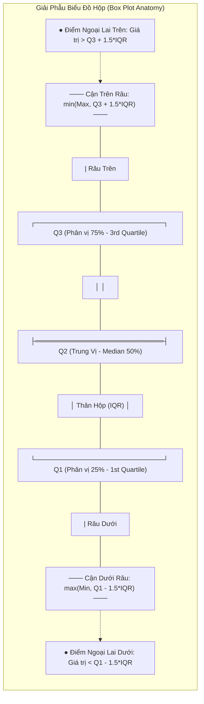

# 02. Thống Kê Mô Tả & Khám Phá Dữ Liệu (Descriptive Statistics & Exploratory Data Analysis)

> **Khóa học:** GCI World 2026 September (Global Consumer Intelligence / Data Science & AI)  
> **Đơn vị đào tạo:** Matsuo-Iwasawa Laboratory, Trường Sau đại học Kỹ thuật, Đại học Tokyo (The University of Tokyo)  
> **Tài liệu nguồn trích xuất:** `prep1_slides.pdf` (What is Data Science?), `prep3_slides.pdf` (Basics of Statistics), `lec1_slides.pdf` (Orientation & Mindset), `Lecture_01_Detailed_Notes.md`, `transcript_full.md`  
> **Mục tiêu học thuật:** Làm chủ các đại lượng thống kê mô tả đo lường xu hướng tập trung và độ phân tán, kỹ thuật chuẩn hóa Z-score, phân tích khám phá dữ liệu (EDA) theo phương pháp biểu đồ hộp Tukey 5 số, phân tích tương quan hai biến Pearson, nhận diện các bẫy thống kê và phân loại Dữ liệu tối (Dark Data).

---

## 1. Khung Lý Thuyết & Nền Tảng Khái Niệm (R1)

### 1.1 Bản Chất Của Thống Kê Trong Chu Trình Khoa Học Dữ Liệu
Trong vòng đời 4 giai đoạn của một dự án Khoa học Dữ liệu tiêu chuẩn (Data Science Lifecycle) được Matsuo-Iwasawa Lab đúc kết:
1. **Understanding Data (Hiểu dữ liệu & EDA)**: Khám phá phân phối, cấu trúc, phát hiện ngoại lai, hình thành giả thuyết kinh doanh.
2. **Preprocessing Data (Tiền xử lý dữ liệu)**: Xử lý giá trị khuyết, lọc bỏ hoặc biến đổi ngoại lai, chuẩn hóa thang đo, mã hóa biến phân loại.
3. **Building Models (Xây dựng mô hình)**: Phân tách dữ liệu (Train/Test Split, Cross-Validation), lựa chọn thuật toán, tối ưu hóa hàm mất mát (Loss Function).
4. **Model Evaluation & Deployment (Đánh giá & Triển khai)**: Đo lường sai số trên tập kiểm thử độc lập, triển khai vào chu trình hành động của tổ chức.

Thống kê mô tả (Descriptive Statistics) đóng vai trò nền tảng tối thượng trong giai đoạn **Understanding Data**. Nếu không nắm vững các thuộc tính thống kê cốt lõi của tập mẫu (Sample), nhà khoa học dữ liệu sẽ xây dựng mô hình trên những giả định sai lệch, dẫn đến hiện tượng "Rác vào, rác ra" (Garbage In, Garbage Out).

---

### 1.2 Phân Loại Dữ Liệu Nghiên Cứu (Data Classification)
Mọi biến số trong phân tích dữ liệu đều thuộc về một trong hai phân loại lớn:
- **Dữ liệu định tính (Qualitative / Categorical Data)**: Phản ánh tính chất, phân loại, không có ý nghĩa đo lường số học trực tiếp.
  - *Dữ liệu danh nghĩa (Nominal)*: Các nhãn không có thứ bậc tự nhiên (ví dụ: Giới tính [Nam/Nữ], Màu sắc nấm [Đỏ/Nâu/Trắng], Nhãn nhãn hiệu [Toyota, Honda]).
  - *Dữ liệu thứ bậc (Ordinal)*: Các nhãn có thứ tự phân hạng rõ rệt nhưng khoảng cách giữa các bậc không đo lường được bằng số đo cố định (ví dụ: Mức độ hài lòng [Kém, Trung bình, Tốt], Thứ bậc học vị).
- **Dữ liệu định lượng (Quantitative / Numerical Data)**: Biểu diễn đại lượng đo lường bằng con số thực, có thể thực hiện các phép toán số học.
  - *Dữ liệu rời rạc (Discrete)*: Kết quả của phép đếm, nhận các giá trị số nguyên không liên tục (ví dụ: Số lượng xe bán ra, Số cuộc gọi khiếu nại trong ngày).
  - *Dữ liệu liên tục (Continuous)*: Kết quả của phép đo lường thực tế, có thể nhận bất kỳ giá trị thực nào trong một khoảng xác định (ví dụ: Dung tích động cơ `engine-size`, Nhiệt độ `TMAX`, Lượng mưa `PRCP`, Giá xe `price`).

---

### 1.3 Đo Lường Xu Hướng Tập Trung (Measures of Central Tendency)
Xu hướng tập trung mô tả vị trí trung tâm hoặc giá trị đại diện tiêu biểu nhất cho toàn bộ tập dữ liệu phân phối.

#### 1. Giá Trị Trung Bình Số Học (Sample Mean - $\bar{x}$)
Trung bình cộng của tập mẫu $n$ quan sát $\{x_1, x_2, \dots, x_n\}$ được định nghĩa bởi công thức:
$$\bar{x} = \frac{1}{n}\sum_{i=1}^{n} x_i = \frac{x_1 + x_2 + \dots + x_n}{n}$$

- **Đặc tính toán học:** Điểm cân bằng vật lý của dữ liệu (tổng các độ lệch $(x_i - \bar{x})$ bằng 0: $\sum_{i=1}^n (x_i - \bar{x}) = 0$). Đồng thời, $\bar{x}$ chính là giá trị cực tiểu hóa tổng bình phương các khoảng cách sai số $\sum_{i=1}^n (x_i - c)^2$.
- **Hạn chế trí mạng:** Cực kỳ nhạy cảm với các giá trị ngoại lai cực đoan (Outliers). Chỉ cần một vài giá trị quá lớn hoặc quá nhỏ sẽ kéo giá trị trung bình lệch hẳn khỏi phần lớn các điểm dữ liệu thực tế.

#### 2. Trung Vị (Median - $\tilde{x}$)
Trung vị là giá trị nằm chính giữa tập dữ liệu sau khi toàn bộ $n$ quan sát đã được sắp xếp theo thứ tự tăng dần ($x_{(1)} \le x_{(2)} \le \dots \le x_{(n)}$):
$$\tilde{x} = \begin{cases} 
x_{\left(\frac{n+1}{2}\right)} & \text{khi } n \text{ là số lẻ} \\
\frac{1}{2} \left( x_{\left(\frac{n}{2}\right)} + x_{\left(\frac{n}{2} + 1\right)} \right) & \text{khi } n \text{ là số chẵn}
\end{cases}$$

- **Đặc tính toán học:** Điểm chia phân phối xác suất thành hai nửa bằng nhau (50% quan sát $\le \tilde{x}$ và 50% quan sát $\ge \tilde{x}$).
- **Đặc tính vượt trội:** Kháng ngoại lai (Robust statistic). Dù giá trị lớn nhất tăng lên vô hạn, giá trị trung vị vẫn hoàn toàn không bị dịch chuyển. Vì vậy, trung vị là chỉ số ưu việt nhất khi dữ liệu bị lệch mạnh (Skewed distributions), như phân phối thu nhập cá nhân, giá bất động sản, hoặc giá xe hơi thể thao cao cấp.

#### 3. Yếu Vị (Mode)
Giá trị xuất hiện với tần suất cao nhất trong phân phối dữ liệu.
- Phân phối có thể là đơn đỉnh (Unimodal), hai đỉnh (Bimodal), đa đỉnh (Multimodal), hoặc không có yếu vị nếu tất cả các giá trị đều xuất hiện với số lần bằng nhau.
- Là đại lượng duy nhất đo lường xu hướng tập trung áp dụng được cho dữ liệu định tính danh nghĩa (Nominal data).

*Minh chứng bài toán thực nghiệm trong bài giảng `prep3_slides.pdf` (Điểm thi 20 sinh viên):*
- Điểm Tiếng Anh (English): Mean = 62.0, Median = 65.0 (dữ liệu tập trung dày đặc quanh mốc 60–80).
- Điểm Toán (Math): Mean = 62.0, Median = 52.5 (phân phối phân hóa hai cực rõ rệt, nhóm điểm thấp đông đảo kéo median xuống 52.5, nhưng nhóm xuất sắc 90–100 điểm kéo mean lên 62.0).

---

### 1.4 Đo Lường Độ Phân Tán (Measures of Dispersion & Spread)
Hai tập dữ liệu có cùng giá trị trung bình $\bar{x}$ có thể sở hữu cấu trúc phân phối hoàn toàn khác biệt (ví dụ tập $[-5, 0, 5]$ và tập $[-100, 0, 100]$ đều có mean = 0, nhưng tập sau có độ dao động lớn gấp nhiều lần).

#### 1. Phương Sai Tập Mẫu (Sample Variance - $\sigma^2$ hoặc $s^2$)
Phương sai đo lường mức độ phân tán trung bình của bình phương khoảng cách giữa các điểm dữ liệu so với giá trị trung bình:
$$\sigma^2 = \frac{1}{n} \sum_{i=1}^{n} (x_i - \bar{x})^2$$

*Lưu ý về bậc tự do (Degrees of Freedom):* Trong thống kê suy diễn khi ước lượng phương sai của tổng thể từ mẫu, mẫu số sử dụng $n - 1$ (Hiệu chỉnh Bessel / Unbiased Sample Variance: $s^2 = \frac{1}{n-1}\sum(x_i - \bar{x})^2$). Tuy nhiên, trong thống kê mô tả cơ bản của NumPy mặc định (`ddof=0`), mẫu số là $n$.

#### 2. Độ Lệch Chuẩn (Standard Deviation - $\sigma$)
Do phương sai sử dụng đơn vị đo lường bình phương (ví dụ: $\text{USD}^2$, $\text{điểm}^2$, $^{\circ}\text{C}^2$), gây khó khăn cho việc diễn giải trực quan trên cùng thang đo của biến gốc. Độ lệch chuẩn được định nghĩa bằng căn bậc hai số học của phương sai:
$$\sigma = \sqrt{\sigma^2} = \sqrt{\frac{1}{n}\sum_{i=1}^{n} (x_i - \bar{x})^2}$$

- **Đơn vị đo lường:** Giữ nguyên đơn vị gốc của dữ liệu (điểm số, USD, mm).
- **Ý nghĩa hình học:** Độ lệch chuẩn càng nhỏ, dữ liệu càng cô đặc xung quanh trung bình; độ lệch chuẩn càng lớn, dữ liệu càng phân tán xa giá trị trung tâm.
- **Thực nghiệm bài giảng:** Phương sai môn Anh = 285.3 ($\sigma \approx 16.9$), trong khi Phương sai môn Toán = 524.7 ($\sigma \approx 22.9$). Điều này chứng minh môn Toán có độ biến thiên và phân hóa học lực lớn hơn rất nhiều so với môn Tiếng Anh.

#### 3. Quy Tắc Kinh Nghiệm Về Khoảng Biến Thiên $1\sigma$ và $2\sigma$ (Empirical Dispersion Bounds)
Đối với các biến ngẫu nhiên tuân theo phân phối Chuẩn đối xứng Gaussian $N(\mu, \sigma^2)$:
- **Khoảng $\bar{x} \pm 1\sigma$:** Chứa khoảng **68.27%** toàn bộ số lượng quan sát. Các điểm nằm trong khoảng này được xem là giá trị phổ biến, điển hình (typical/expected).
- **Khoảng $\bar{x} \pm 2\sigma$:** Chứa khoảng **95.45%** số lượng quan sát. Các điểm nằm ngoài khoảng này được xem là bất thường, hiếm gặp (unusually high/low).
- **Khoảng $\bar{x} \pm 3\sigma$:** Chứa **99.73%** quan sát. Các quan sát vượt ra ngoài ngưỡng $3\sigma$ gần như chắc chắn là giá trị ngoại lai nghiêm trọng (Outliers).

---

### 1.5 Chuẩn Hóa Điểm Số Z-Score (Standardization)
Khi so sánh các biến số có thang đo hoặc đơn vị vật lý hoàn toàn khác biệt (ví dụ so sánh chiều rộng xe `width` tính bằng inch với giá xe `price` tính bằng USD, hoặc so sánh điểm Toán và điểm Tiếng Anh của học sinh), ta không thể so sánh trực tiếp giá trị thô.

**Điểm chuẩn hóa Z-score** chuyển đổi từng giá trị thô $x_i$ sang số lượng độ lệch chuẩn mà nó cách xa giá trị trung bình:
$$z_i = \frac{x_i - \bar{x}}{\sigma}$$

- **Thuộc tính toán học của phân phối sau chuẩn hóa:**
  - Giá trị trung bình mới luôn bằng 0: $\mu_z = 0$.
  - Độ lệch chuẩn và phương sai mới luôn bằng 1: $\sigma_z = 1, \sigma_z^2 = 1$.
- **Diễn giải Z-score:**
  - $z = 0$: Giá trị quan sát trùng khớp hoàn toàn với trung bình mẫu.
  - $z > 0$: Điểm dữ liệu cao hơn mức trung bình (ví dụ $z = +2.0$ nghĩa là điểm số vượt trên trung bình đúng 2 độ lệch chuẩn, thuộc nhóm top 2.5% xuất sắc nhất).
  - $z < 0$: Điểm dữ liệu thấp hơn mức trung bình (ví dụ $z = -1.5$ nghĩa là thấp hơn trung bình 1.5 độ lệch chuẩn).

---

### 1.6 Phân Tích Khám Phá Dữ Liệu & Biểu Đồ Hộp Tukey 5 Số (EDA & Box Plot)
Phân tích khám phá dữ liệu (Exploratory Data Analysis - EDA) do nhà thống kê John Tukey tiên phong là phương pháp tiếp cận dữ liệu bằng trực quan hóa và tóm tắt phi tham số trước khi áp dụng bất kỳ mô hình hồi quy hay phân loại nào.

#### Tóm Tắt 5 Số Của Tukey (Tukey's 5-Number Summary):
1. **Giá trị cực tiểu (Minimum)**: Giá trị nhỏ nhất không phải ngoại lai.
2. **Tứ phân vị thứ nhất (First Quartile - $Q_1$ / 25th Percentile)**: Điểm dữ liệu chia 25% số quan sát nhỏ nhất.
3. **Trung vị (Median / Second Quartile - $Q_2$ / 50th Percentile)**: Điểm chính giữa phân phối.
4. **Tứ phân vị thứ ba (Third Quartile - $Q_3$ / 75th Percentile)**: Điểm dữ liệu chia 75% số quan sát nhỏ nhất (25% quan sát lớn nhất nằm trên $Q_3$).
5. **Giá trị cực đại (Maximum)**: Giá trị lớn nhất không phải ngoại lai.

#### Cấu Trúc Giải Phẫu Biểu Đồ Hộp (Box Plot Anatomy):
- **Khoảng liên tứ phân vị (Interquartile Range - IQR)**: Đo lường độ phân tán của 50% dữ liệu vùng trung tâm:
  $$\text{IQR} = Q_3 - Q_1$$
- **Thân hộp (The Box)**: Chiều dài hộp trải dài từ $Q_1$ đến $Q_3$, với vạch kẻ ngang đậm ở giữa biểu diễn Trung vị ($Q_2$).
- **Râu biểu đồ (Whiskers)**: Kéo dài từ hai đầu thân hộp đến các điểm cận biên:
  - Cận dưới râu (Lower Whisker): $\max(\min(x), Q_1 - 1.5 \times \text{IQR})$
  - Cận trên râu (Upper Whisker): $\min(\max(x), Q_3 + 1.5 \times \text{IQR})$
- **Quy tắc phát hiện ngoại lai (Outlier Detection Rule)**: Bất kỳ quan sát $x_i$ nào nằm ngoài hai ngưỡng râu:
  $$x_i < Q_1 - 1.5 \times \text{IQR} \quad \text{hoặc} \quad x_i > Q_3 + 1.5 \times \text{IQR}$$
  sẽ được phân loại là **Giá trị ngoại lai (Outlier)** và được biểu diễn bằng các dấu chấm tròn/dấu sao riêng biệt ngoài râu biểu đồ.

---

### 1.7 Phân Tích Tương Quan Hai Biến & Hệ Số Pearson (Bivariate Analysis & Correlation)
Khi nghiên cứu mối quan hệ đồng biến hoặc nghịch biến giữa hai biến số định lượng $X$ và $Y$ (ví dụ: dung tích động cơ xe và giá bán, hoặc điểm Toán và điểm Tiếng Anh):

#### 1. Hiệp Phương Sai Tập Mẫu (Sample Covariance - $\text{Cov}(X, Y)$)
Đo lường xu hướng biến thiên đồng thời của hai biến số:
$$\text{Cov}(X, Y) = \frac{1}{n} \sum_{i=1}^{n} (x_i - \bar{x})(y_i - \bar{y})$$
Nếu khi $X$ lớn hơn trung bình mà $Y$ cũng có xu hướng lớn hơn trung bình, tích $(x_i - \bar{x})(y_i - \bar{y}) > 0 \implies \text{Cov}(X, Y) > 0$ (đồng biến). Tuy nhiên, độ lớn của hiệp phương sai phụ thuộc vào đơn vị đo lường của $X$ và $Y$.

#### 2. Hệ Số Tương Quan Tuyến Tính Pearson ($r_{xy}$)
Để loại bỏ sự phụ thuộc vào đơn vị đo lường, Karl Pearson chuẩn hóa hiệp phương sai bằng tích độ lệch chuẩn của hai biến:
$$r_{xy} = \frac{\text{Cov}(X, Y)}{\sigma_X \sigma_Y} = \frac{\sum_{i=1}^{n} (x_i - \bar{x})(y_i - \bar{y})}{\sqrt{\sum_{i=1}^{n} (x_i - \bar{x})^2} \sqrt{\sum_{i=1}^{n} (y_i - \bar{y})^2}}$$

- **Khoảng giá trị hữu hạn:** $-1 \le r_{xy} \le 1$.
- **Ý nghĩa định lượng:**
  - $r = +1$: Tương quan tuyến tính dương hoàn hảo (khi $X$ tăng, $Y$ tăng tuyến tính tuyệt đối).
  - $0.7 \le r < 1.0$: Tương quan dương mạnh mẽ (Strong Positive Correlation).
  - $0.3 \le r < 0.7$: Tương quan dương vừa phải.
  - $-0.3 < r < 0.3$: Hầu như không có tương quan tuyến tính (Weak or No linear correlation).
  - $-0.7 < r \le -0.3$: Tương quan âm vừa phải.
  - $-1.0 \le r \le -0.7$: Tương quan âm mạnh mẽ (Strong Negative Correlation - khi $X$ tăng, $Y$ giảm).
  - $r = -1$: Tương quan tuyến tính âm hoàn hảo.
- **Thực nghiệm bài giảng:** Hệ số tương quan giữa điểm Anh và Toán của 20 học sinh là $r = -0.21 \approx 0$, biểu thị trên biểu đồ phân tán (Scatter plot) các điểm nằm rải rác ngẫu nhiên, không tồn tại mối liên hệ tuyến tính rõ rệt giữa việc học giỏi Tiếng Anh và học giỏi Toán.

---

### 1.8 Các Bẫy Tri Thức Thống Kê & Bản Đồ Dữ Liệu Tối (Statistical Traps & Dark Data)

#### 1. Bẫy Tương Quan và Nhân Quả (Correlation is NOT Causation)
Một trong những cạm bẫy nhận thức phổ biến nhất trong Khoa học Dữ liệu: Hai biến số có hệ số tương quan rất cao ($r > 0.85$) không đồng nghĩa với việc biến này là nguyên nhân sinh ra biến kia.
- **Ví dụ kinh điển:** Lượng kem bán ra ($X$) và số ca đuối nước ($Y$) trong các tháng hè có hệ số tương quan $r = 0.88$. Kết luận "Ăn kem gây đuối nước" là một ngụy biện ngớ ngẩn.
- **Biến ẩn / Biến gây nhiễu (Lurking / Confounding Variable):** Thực tế, cả $X$ và $Y$ đều bị chi phối bởi biến thứ ba: Thời tiết nắng nóng mùa hè ($Z$). Nắng nóng làm tăng nhu cầu ăn kem, đồng thời làm tăng số người đi bơi, dẫn đến số ca đuối nước tăng.

#### 2. Phân Loại "Dữ Liệu Tối" (Dark Data Taxonomy - David J. Hand & Matsuo Lab)
Theo Giáo sư David J. Hand (Imperial College London) và bài giảng định hướng Buổi 1 của Giáo sư Matsuo: Rủi ro lớn nhất của nhà khoa học dữ liệu không nằm ở dữ liệu đang có trong cơ sở dữ liệu, mà nằm ở **những gì không được ghi nhận (What is Missing)**.
- **Loại 1: Dữ liệu ta biết là ta không có (Data we know are missing)**: Các ô trống, trường giá trị bị thiếu (Missing values / NaN) do lỗi cảm biến hoặc người dùng từ chối điền. Loại này có thể nhận diện và khắc phục bằng các thuật toán điền khuyết (Imputation).
- **Loại 2: Dữ liệu ta không biết là ta không có (Data we do not know are missing)**: Dữ liệu về những khách hàng tiềm năng đã vào website nhưng thoát ngay lập tức mà hệ thống theo dõi chưa kịp tạo phiên; hoặc những bệnh nhân không thể đến bệnh viện để khám bệnh.
- **Loại 3: Dữ liệu chỉ chọn lọc những trường hợp thành công (Selection Bias / Survivorship Bias - Bẫy kẻ sống sót)**:
  - *Ví dụ lịch sử Abraham Wald:* Nghiên cứu máy bay chiến đấu trở về bị bắn thủng lỗ chỗ ở cánh và thân để gia cố giáp. Wald chỉ ra rằng phải gia cố động cơ - nơi những máy bay bị bắn rơi không bao giờ trở về để được đo đạc.
  - *Ví dụ kinh doanh:* Chỉ phân tích dữ liệu của khách hàng trung thành hiện tại mà bỏ qua toàn bộ nhóm khách hàng đã rời bỏ dịch vụ (Churned customers), dẫn đến việc tối ưu hóa sai sản phẩm.
- **Loại 4: Dữ liệu bị thay đổi do quá trình đo lường (Measurement Alterations)**: Định luật Goodhart ("Khi một chỉ số đo lường trở thành mục tiêu quản trị, nó sẽ không còn là chỉ số đo lường tin cậy").

#### 3. Vòng Lặp Khoa Học Khắc Phục Dữ Liệu Tối (Seven-Eleven Japan Case Study)
Chuỗi cửa hàng tiện lợi Seven-Eleven Nhật Bản vận hành mô hình kinh doanh dựa trên chu trình kiểm chứng giả thiết thực nghiệm (Hypothesis-Testing Loop):
1. **Quan sát (Observe)**: Thu thập dữ liệu giao dịch POS, dự báo thời tiết, sự kiện trường học quanh khu vực.
2. **Đặt giả thuyết (Hypothesize)**: Hôm nay trời mưa lạnh và có lễ hội, dự báo nhu cầu cơm hộp nóng Oden tăng gấp 3 lần.
3. **Thực nghiệm (Experiment)**: Đặt hàng nhập kho và bày bán đúng theo số lượng giả thuyết.
4. **Phân tích (Analyze)**: Đối chiếu tỷ lệ bán hết hoặc tồn kho thực tế với mô hình, nhận diện "Dữ liệu tối" (những khách hàng muốn mua nhưng đến muộn khi hàng đã hết).
5. **Hành động (Decide)**: Tinh chỉnh lại thuật toán dự báo cho chu kỳ tiếp theo.

---

## 2. Mã Nguồn Python & Kỹ Thuật Thực Thi Cốt Lõi (R2)

Toàn bộ các đoạn mã dưới đây được xây dựng chân thực, kèm chú thích (`#`) chi tiết từng dòng lệnh, mô phỏng các phép tính thống kê từ slide bài giảng và các kỹ thuật thực chiến.

### 2.1 Tính Toán Thống Kê Mô Tả Bằng NumPy Thuần

```python
# Import thư viện tính toán khoa học NumPy
import numpy as np

# Tập dữ liệu điểm thi môn Tiếng Anh và môn Toán của 20 học sinh (từ prep3_slides.pdf)
english_scores = np.array([65, 80, 35, 55, 65, 80, 55, 65, 50, 85, 
                           55, 55, 70, 50, 80, 70, 65, 80, 65, 15])
math_scores = np.array([85, 55, 40, 90, 35, 40, 50, 40, 95, 40, 
                        90, 45, 85, 45, 40, 85, 50, 55, 100, 75])

# 1. Đo lường xu hướng tập trung: Tính Mean (Giá trị trung bình số học)
mean_eng = np.mean(english_scores)
mean_math = np.mean(math_scores)
print(f"Mean English: {mean_eng:.2f}")  # Kết quả: 62.00
print(f"Mean Math:    {mean_math:.2f}")  # Kết quả: 62.00

# 2. Đo lường xu hướng tập trung: Tính Median (Trung vị)
# Sắp xếp mảng tăng dần trước khi tìm phần tử chính giữa
median_eng = np.median(english_scores)
median_math = np.median(math_scores)
print(f"Median English: {median_eng:.2f}")  # Kết quả: 65.00
print(f"Median Math:    {median_math:.2f}")  # Kết quả: 52.50 (phân phối lệch trái mạnh)

# 3. Đo lường độ phân tán: Tính Phương sai tập mẫu (Variance: sigma^2)
# np.var mặc định ddof=0 (chia cho n = 20, thống kê mô tả tổng thể)
var_eng_pop = np.var(english_scores)
var_math_pop = np.var(math_scores)
print(f"Variance English (ddof=0): {var_eng_pop:.2f}")  # Kết quả: 271.00
print(f"Variance Math (ddof=0):    {var_math_pop:.2f}")  # Kết quả: 498.50

# Để khớp chuẩn xác với số liệu slide bài giảng prep3_slides.pdf (Slide 7: 285.3 và 524.7),
# ta sử dụng ddof=1 (Hiệu chỉnh Bessel chia cho n - 1 = 19):
var_eng_sample = np.var(english_scores, ddof=1)
var_math_sample = np.var(math_scores, ddof=1)
print(f"Variance English (ddof=1, Slide 7): {var_eng_sample:.1f}")  # Kết quả: 285.3
print(f"Variance Math (ddof=1, Slide 7):    {var_math_sample:.1f}")  # Kết quả: 524.7 (môn Toán phân tán gấp 1.84 lần)

# 4. Đo lường độ phân tán: Tính Độ lệch chuẩn (Standard Deviation: sigma = sqrt(var))
# Với ddof=1, kết quả khớp tuyệt đối với Slide 9 của bài giảng (16.9 và 22.9):
std_eng = np.std(english_scores, ddof=1)
std_math = np.std(math_scores, ddof=1)
print(f"Std English (Slide 9): {std_eng:.1f} điểm")  # Kết quả: 16.9 điểm
print(f"Std Math (Slide 9):    {std_math:.1f} điểm")  # Kết quả: 22.9 điểm
```

---

### 2.2 Kỹ Thuật Chuẩn Hóa Dữ Liệu Bằng Z-Score

```python
import numpy as np

def calculate_zscore(data_array):
    """
    Hàm tính toán Z-score chuẩn hóa mảng dữ liệu định lượng 1D.
    Công thức: z_i = (x_i - mean) / std
    """
    # Bước 1: Tính giá trị trung bình mẫu mu
    mu = np.mean(data_array)
    
    # Bước 2: Tính độ lệch chuẩn mẫu sigma
    sigma = np.std(data_array)
    
    # Phòng ngừa lỗi chia cho 0 nếu tất cả giá trị giống hệt nhau (sigma == 0)
    if sigma == 0:
        raise ValueError("Độ lệch chuẩn bằng 0, không thể thực hiện chuẩn hóa Z-score.")
        
    # Bước 3: Áp dụng cơ chế vector hóa ufunc trừ vô hướng và chia vô hướng
    z_scores = (data_array - mu) / sigma
    return z_scores

# Thực thi chuẩn hóa cho điểm số 2 môn học
z_eng = calculate_zscore(english_scores)
z_math = calculate_zscore(math_scores)

# Kiểm chứng tính chất toán học của phân phối sau khi chuẩn hóa
print(f"Mean của Z-Score English: {np.mean(z_eng):.6f}")  # Xấp xỉ 0.000000
print(f"Std của Z-Score English:  {np.std(z_eng):.6f}")   # Đúng bằng 1.000000

# So sánh 2 học sinh có điểm số ban đầu khác biệt:
# Học sinh đạt 80 điểm Tiếng Anh:
print(f"Z-Score học sinh đạt 80 điểm Anh: {calculate_zscore(english_scores)[1]:.2f}") # z = +1.07
# Học sinh đạt 85 điểm Toán:
print(f"Z-Score học sinh đạt 85 điểm Toán: {calculate_zscore(math_scores)[0]:.2f}")    # z = +1.00
# Nhận xét: Dù 80 < 85 nhưng điểm Tiếng Anh lại có thứ hạng cao hơn trong lớp!
```

---

### 2.3 Phân Tích Tukey 5 Số & Thuật Toán Lọc Ngoại Lai (Box Plot & IQR Outlier Filter)

```python
import numpy as np

def detect_outliers_tukey(data):
    """
    Xác định và lọc ngoại lai theo phương pháp Tukey Box Plot.
    Trả về bộ số tóm tắt, danh sách ngoại lai, và mảng dữ liệu đã làm sạch.
    """
    # 1. Tính toán phân vị Q1 (25%) và Q3 (75%)
    q1 = np.percentile(data, 25)
    q2 = np.median(data)  # Trung vị Q2 (50%)
    q3 = np.percentile(data, 75)
    
    # 2. Tính khoảng liên tứ phân vị IQR
    iqr = q3 - q1
    
    # 3. Thiết lập ngưỡng râu (Whisker boundaries)
    lower_bound = q1 - 1.5 * iqr
    upper_bound = q3 + 1.5 * iqr
    
    # 4. Sử dụng Boolean Masking để trích xuất ngoại lai
    outlier_mask = (data < lower_bound) | (data > upper_bound)
    outliers = data[outlier_mask]
    
    # 5. Dữ liệu hợp lệ nằm trong khoảng râu
    clean_data = data[~outlier_mask]
    
    summary = {
        "Min_Raw": np.min(data),
        "Q1": q1,
        "Median": q2,
        "Q3": q3,
        "Max_Raw": np.max(data),
        "IQR": iqr,
        "Lower_Whisker": lower_bound,
        "Upper_Whisker": upper_bound,
        "Outliers": outliers.tolist()
    }
    return summary, clean_data

# Áp dụng cho tập điểm môn Tiếng Anh:
summary_eng, clean_eng = detect_outliers_tukey(english_scores)
print("=== Tóm tắt Tukey Môn Tiếng Anh ===")
for k, v in summary_eng.items():
    print(f"{k}: {v}")
# Kết quả phát hiện điểm 15 là Outlier vì Q1 = 55.0, Q3 = 72.5, IQR = 17.5
# Lower Whisker = 55.0 - 1.5 * 17.5 = 28.75. Điểm 15 < 28.75 nên bị gắn cờ ngoại lai!
```

---

### 2.4 Tính Toán Hệ Số Tương Quan Pearson Bằng NumPy

```python
import numpy as np

# Sử dụng hàm np.corrcoef tính toán ma trận tương quan giữa English và Math
corr_matrix = np.corrcoef(english_scores, math_scores)

print("Ma trận hệ số tương quan (Correlation Matrix):")
print(corr_matrix)
# [[ 1.   -0.21]
#  [-0.21  1.  ]]

# Trích xuất hệ số tương quan giữa 2 biến ở hàng 0, cột 1
r_pearson = corr_matrix[0, 1]
print(f"Hệ số tương quan Pearson giữa Tiếng Anh và Toán: {r_pearson:.4f}")
# Kết quả: -0.2149 (Tương quan âm rất yếu, gần như không có mối liên hệ)

# Thuật toán tự cài đặt thuần túy để minh chứng công thức toán học:
def manual_pearson(x, y):
    n = len(x)
    mean_x = np.mean(x)
    mean_y = np.mean(y)
    
    # Hiệp phương sai covariance (chia n)
    covariance = np.sum((x - mean_x) * (y - mean_y)) / n
    # Tích độ lệch chuẩn
    std_product = np.std(x) * np.std(y)
    
    return covariance / std_product

print(f"Kiểm chứng tính toán thủ công: {manual_pearson(english_scores, math_scores):.4f}")
```

---

## 3. Sơ Đồ Tư Duy & Quy Trình Trực Quan (Mermaid.js) (R4)

### 3.1 Cấu Trúc Giải Phẫu Biểu Đồ Hộp Tukey (Tukey Box Plot Anatomy)



---

### 3.2 Quy Trình Phân Tích Thống Kê & Ra Quyết Định Trong EDA

```mermaid
flowchart TD
    Start(["Nhận Tập Dữ Liệu Thô (Raw Dataset)"]) --> Step1["Kiểm tra Kiểu Dữ Liệu: Định tính hay Định lượng?"]
    
    Step1 -->|Định tính Danh nghĩa / Thứ bậc| CatBranch["Thống kê Tần số, Tỷ lệ %, Yếu vị (Mode)<br>Trực quan: Bar Chart, Pie Chart"]
    Step1 -->|Định lượng Rời rạc / Liên tục| NumBranch["Tính toán Đo Lường Xu Hướng & Độ Phân Tán"]
    
    NumBranch --> CheckSkew{"Phân phối có Lệch hoặc<br>Có Ngoại lai Cực đoan không?"}
    
    CheckSkew -->|Phân phối Đối xứng / Gần Chuẩn| NormalPath["Đại diện Xu hướng: Mean (x̄)<br>Đại diện Phân tán: Standard Deviation (σ)<br>Chuẩn hóa: Z-Score (x - μ) / σ"]
    CheckSkew -->|Phân phối Lệch mạnh / Đa đỉnh| SkewPath["Đại diện Xu hướng: Median (x̃)<br>Đại diện Phân tán: IQR (Q3 - Q1)<br>Trực quan hóa: Box Plot 5 số"]
    
    NormalPath --> OutlierInspect["Kiểm tra Ngưỡng Ngoại lai"]
    SkewPath --> OutlierInspect
    
    OutlierInspect --> OutlierDecision{"Có điểm nào vượt ngưỡng<br>Q1 - 1.5*IQR hoặc Q3 + 1.5*IQR?"}
    
    OutlierDecision -->|Có Ngoại lai| TrapCheck["Phân loại Ngoại lai: Lỗi nhập liệu hay Giá trị thực?<br>Thận trọng bẫy Dark Data & Selection Bias"]
    OutlierDecision -->|Không có| BivariateAnalysis["Phân tích Tương quan Hai biến (Bivariate EDA)"]
    
    TrapCheck --> BivariateAnalysis
    BivariateAnalysis --> ScatterPlot["Vẽ Biểu đồ Phân tán (Scatter Plot)<br>Tính Hệ số Tương quan Pearson (r)"]
    
    ScatterPlot --> CorrInterpret{"Hệ số r có ý nghĩa không?"}
    CorrInterpret -->| |r| ≥ 0.7 | StrongCorr["Tương quan Tuyến tính Mạnh<br>Cảnh giác: Tương quan ≠ Nhân quả (Lurking Variables)"]
    CorrInterpret -->| |r| < 0.3 | WeakCorr["Không có Tương quan Tuyến tính<br>Lưu ý: Có thể tồn tại Quan hệ Phi tuyến (Non-linear)"]
    
    StrongCorr --> SevenElevenLoop["Áp dụng Vòng lặp Khoa học Seven-Eleven:<br>Giả thuyết ➔ Thực nghiệm ➔ Phân tích ➔ Quyết định"]
    WeakCorr --> SevenElevenLoop
```

---

## 4. Hệ Thống Thẻ Ghi Nhớ Chủ Động (Active Recall Flashcards) (R3)

### Flashcard 1
- **Câu hỏi:** Trong một phân phối thu nhập có 99 công nhân nhận lương 10 triệu VNĐ/tháng và 1 vị Giám đốc nhận lương 1 tỷ VNĐ/tháng, đại lượng nào phản ánh trung thực mức sống tiêu biểu của người lao động: Mean hay Median? Giải thích bản chất toán học.
- **Trả lời:** **Median (Trung vị)** phản ánh trung thực mức sống người lao động (Median = 10 triệu VNĐ). Giá trị Mean = $(99 \times 10 + 1000) / 100 = 19.9$ triệu VNĐ đã bị giá trị ngoại lai cực đoan (1 tỷ) bóp méo, làm sai lệch thực tế của 99% số công nhân. Trung vị là một thống kê kháng ngoại lai (Robust statistic), không bị ảnh hưởng bởi độ lớn vô hạn ở các đuôi phân phối.

---

### Flashcard 2
- **Câu hỏi:** Độ lệch chuẩn (Standard Deviation) đo lường điều gì? Tại sao trong phân tích kinh doanh thực tế người ta chuộng dùng Độ lệch chuẩn hơn Phương sai (Variance)?
- **Trả lời:** Độ lệch chuẩn đo lường mức độ phân tán trung bình của các điểm dữ liệu xung quanh giá trị trung bình số học. Người ta chuộng dùng độ lệch chuẩn hơn phương sai vì phương sai sử dụng đơn vị bình phương ($\text{đơn vị}^2$), trong khi độ lệch chuẩn có cùng đơn vị đo lường vật lý với biến gốc ban đầu (triệu đồng, $^{\circ}\text{C}$, kg), cho phép cộng trừ trực tiếp với giá trị trung bình để xác định các khoảng biến thiên điển hình $\bar{x} \pm 1\sigma$ và $\bar{x} \pm 2\sigma$.

---

### Flashcard 3
- **Câu hỏi:** Nêu công thức xác định một điểm dữ liệu là giá trị ngoại lai (Outlier) theo quy tắc biểu đồ hộp Tukey 5 số. Tại sao lại dùng hệ số $1.5 \times \text{IQR}$ mà không dùng giá trị tuyệt đối Max - Min?
- **Trả lời:** Điểm dữ liệu $x_i$ là ngoại lai khi:
  $$x_i < Q_1 - 1.5 \times \text{IQR} \quad \text{hoặc} \quad x_i > Q_3 + 1.5 \times \text{IQR}$$
  với $\text{IQR} = Q_3 - Q_1$. Ta dùng hệ số này thay vì khoảng Max - Min vì khoảng Max - Min chính bản thân nó đã bị chi phối bởi ngoại lai. Ngược lại, IQR chỉ đo lường độ rộng của 50% dữ liệu lõi ở giữa nên hoàn toàn miễn nhiễm với các giá trị cực đoan ngoài rìa, cung cấp một hệ quy chiếu khách quan, chuẩn mực.

---

### Flashcard 4
- **Câu hỏi:** Ý nghĩa bản chất của việc chuẩn hóa Z-score là gì? Nếu một học sinh có điểm thi môn Lịch sử là 70 với $Z = +2.1$ và điểm thi môn Toán là 85 với $Z = +0.8$, học sinh này thực chất học giỏi môn nào hơn so với mặt bằng chung của trường?
- **Trả lời:** Chuẩn hóa Z-score đưa các biến số có thang đo và đơn vị khác nhau về cùng một thang đo chuẩn tắc với $\mu = 0$ và $\sigma = 1$, phản ánh vị trí tương đối của quan sát so với tập thể. Học sinh này **học giỏi môn Lịch sử hơn nhiều** so với môn Toán ($Z_{\text{Sử}} = +2.1 > Z_{\text{Toán}} = +0.8$). Dù điểm thô 70 < 85, nhưng điểm 70 môn Sử vượt trội hơn trung bình lớp tới 2.1 độ lệch chuẩn (thuộc top 1.8% học sinh giỏi nhất), trong khi điểm 85 môn Toán chỉ vượt trung bình 0.8 độ lệch chuẩn do đề thi môn Toán quá dễ hoặc điểm cả lớp đều cao.

---

### Flashcard 5
- **Câu hỏi:** Giả sử hệ số tương quan tuyến tính Pearson giữa lượng ô dù bán ra và lượng mưa đo được là $r = 0.92$. Điều này có cho phép kết luận rằng "Việc mở ô dù đã làm trời đổ mưa" không? Nêu khái niệm biến ẩn (Lurking Variable).
- **Trả lời:** **Tuyệt đối không!** Cốt lõi của tư duy thống kê là: "Tương quan không đồng nghĩa với Nhân quả" (Correlation is NOT Causation). Mối liên hệ đồng biến giữa hai biến số này chịu sự chi phối của một biến ẩn (Lurking / Confounding variable) là áp thấp nhiệt đới / mây đối lưu ẩm. Mây ẩm gây ra mưa, và người dân nhìn thấy mưa nên mới mua và mở ô dù. Nếu nhầm lẫn tương quan là nhân quả, doanh nghiệp sẽ đưa ra các chính sách sai lầm chết người.

---

### Flashcard 6
- **Câu hỏi:** Khái niệm "Dữ liệu tối" (Dark Data) theo Giáo sư David J. Hand và Giáo sư Matsuo cảnh báo điều gì đối với các kỹ sư AI / Data Scientist?
- **Trả lời:** Dữ liệu tối là dữ liệu không xuất hiện hoặc bị bỏ sót trong tập dữ liệu thu thập được nhưng lại có tác động quyết định đến bài toán thực tế. Nó cảnh báo rằng việc chỉ huấn luyện mô hình trên dữ liệu sẵn có (Visible data) sẽ dẫn đến sai lệch lựa chọn (Selection bias) và bẫy kẻ sống sót (Survivorship bias). Một mô hình AI dự báo nhu cầu khách hàng nếu chỉ học trên dữ liệu đơn hàng thành công mà không biết lượng khách bỏ đi vì hết hàng sẽ liên tục đặt hàng dưới mức tối ưu.

---

## 5. Các Bẫy Tri Thức & Trường Hợp Biên (Edge Cases)

### 5.1 Bẫy Hệ Số Tương Quan Pearson Khi Quan Hệ Phi Tuyến (Non-Linear Relationship Trap)
Hệ số tương quan Pearson chỉ đo lường **mức độ liên hệ tuyến tính (Linear Association)**. 
- Nếu hai biến số có mối quan hệ hàm số phi tuyến hoàn hảo, ví dụ phương trình parabol $y = x^2$ với $x \in [-10, 10]$ đối xứng qua 0:
  $$\text{Cov}(X, Y) = 0 \implies r_{xy} = 0$$
- **Hậu quả:** Nhà phân tích vội vàng kết luận "$X$ và $Y$ không liên quan gì đến nhau", trong khi thực tế $Y$ hoàn toàn phụ thuộc toán học vào $X$. Do đó, **bắt buộc phải vẽ Scatter Plot** trước khi tính toán và diễn giải hệ số tương quan.

### 5.2 Mẫu Số Phương Sai: $N$ vs $N - 1$ (Hiệu Chỉnh Bessel)
- Trong thư viện NumPy, hàm `np.var()` và `np.std()` mặc định tham số `ddof=0` (Degrees of Freedom = 0, chia cho $N$), đại diện cho phương sai tổng thể hoặc thống kê mô tả thuần túy.
- Ngược lại, trong thư viện Pandas, `df.var()` và `df.std()` mặc định `ddof=1` (chia cho $N - 1$, ước lượng không chệch cho tổng thể).
- **Lỗi phổ biến:** Khi kiểm tra chéo giữa NumPy và Pandas trên cùng một cột dữ liệu nhỏ, kết quả bị lệch nhau. Cần chú ý điều chỉnh `ddof=0` hoặc `ddof=1` đồng nhất.

### 5.3 Trường Hợp Biên: Độ Lệch Chuẩn Bằng 0 ($\sigma = 0$)
- Khi tập dữ liệu là một mảng hằng số (ví dụ tất cả học sinh đều được 10 điểm: $[10, 10, 10]$), ta có $\sigma = 0$.
- Phép tính Z-score $z = \frac{x_i - \mu}{\sigma}$ sẽ gặp phép chia cho 0.
  - Trong Python thuần: Báo lỗi `ZeroDivisionError`.
  - Trong NumPy: Xuất hiện giá trị `np.nan` cùng cảnh báo `RuntimeWarning: invalid value encountered in divide`.

### 5.4 Bẫy Loại Bỏ Ngoại Lai Tự Động Bằng Biểu Đồ Hộp (Outlier Deletion Trap)
- Không được máy móc xóa bỏ tất cả các điểm nằm ngoài râu $1.5 \times \text{IQR}$.
- Trong nhiều bài toán thương mại và tài nguyên, ngoại lai chính là đối tượng mang lại nhiều giá trị nhất: Giao dịch gian lận thẻ tín dụng (Fraud detection), người mua hàng xa xỉ phẩm siêu giàu, hoặc bệnh nhân có phản ứng thuốc đặc biệt. Việc tự tiện xóa ngoại lai sẽ làm mô hình mất khả năng nhận diện các trường hợp biên quan trọng.
