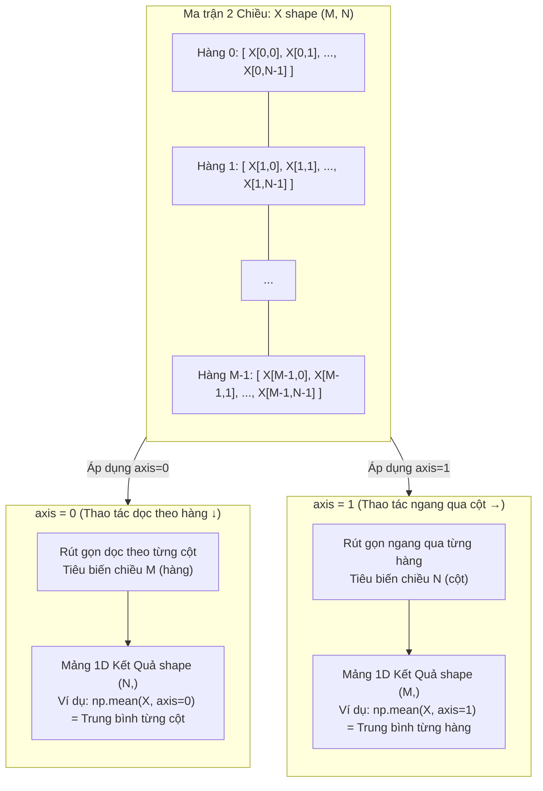

# 03. Thao Tác Dữ Liệu Hiệu Năng Cao Với NumPy (High-Performance Numerical Computing with NumPy)

> **Khóa học:** GCI World 2026 September (Global Consumer Intelligence / Data Science & AI)  
> **Đơn vị đào tạo:** Matsuo-Iwasawa Laboratory, Trường Sau đại học Kỹ thuật, Đại học Tokyo (The University of Tokyo)  
> **Tài liệu nguồn trích xuất:** `lec2_slides.pdf` (86 slides), `lec2_notebook.ipynb` (233 cells), `HW1 for Session2.ipynb` (25 cells)  
> **Mục tiêu học thuật:** Thấu hiểu kiến trúc bộ nhớ C-contiguous của `numpy.ndarray`, cơ chế tính toán véc-tơ hóa SIMD và ufunc, nguyên lý lan truyền (Broadcasting), ngữ nghĩa trục không gian (`axis=0` vs `axis=1`), phân biệt Bản chiếu bộ nhớ (View) và Bản sao độc lập (Copy), kỹ thuật mặt nạ Boolean, hệ thống Đại số tuyến tính (`numpy.linalg`), và thuật toán lọc mảng chuẩn hóa cho Bài tập về nhà 1 (Homework 1).

---

## 1. Khung Lý Thuyết & Nền Tảng Khái Niệm (R1)

### 1.1 Động Lực Học Thuật: Tại Sao Python List Không Thích Hợp Cho Tính Toán Số Học?
Trong khoa học dữ liệu và học máy, dữ liệu quan sát hầu như luôn được mô hình hóa dưới dạng véc-tơ 1 chiều ($\mathbf{x} \in \mathbb{R}^n$) hoặc ma trận 2 chiều ($\mathbf{X} \in \mathbb{R}^{m \times p}$), nơi các phép toán đại số tuyến tính và thống kê được thực thi lặp đi lặp lại trên quy mô hàng triệu phần tử.

Python nguyên bản cung cấp cấu trúc danh sách (`list`), nhưng danh sách của Python được thiết kế như một **mảng con trỏ không đồng nhất (Heterogeneous Pointer Array)**:
- Mỗi phần tử trong danh sách thực chất chỉ là một con trỏ 64-bit tham chiếu đến một đối tượng số học riêng lẻ (ví dụ `PyObject` cho số thực hoặc số nguyên) nằm rải rác trên vùng nhớ Heap.
- Để lưu một số nguyên 64-bit trong Python `list`, hệ thống tiêu tốn tới 28 bytes bộ nhớ overhead cho metadata (kiểu dữ liệu, số đếm tham chiếu `ob_refcnt`).
- Khi duyệt vòng lặp `for` để tính tổng các phần tử, CPU liên tục gặp hiện tượng **trượt bộ đệm (Cache Miss)** do phải truy xuất các ô nhớ ngẫu nhiên không liền kề. Đồng thời, trình thông dịch CPython phải thực hiện kiểm tra kiểu dữ liệu động (Dynamic Type Checking) ở từng bước lặp, kèm theo rào cản khóa thông dịch toàn cục GIL (Global Interpreter Lock).

---

### 1.2 Kiến Trúc Đối Tượng `numpy.ndarray`: Vùng Nhớ Liền Kề (C-Contiguous Memory) & SIMD
Để giải quyết triệt để rào cản hiệu năng của Python, thư viện NumPy giới thiệu cấu trúc mảng đa chiều `numpy.ndarray` (N-dimensional array):
1. **Tính đồng nhất dữ liệu (Homogeneous Types)**: Tất cả mọi phần tử trong mảng bắt buộc phải có cùng một kiểu dữ liệu cố định (`dtype`, ví dụ `int32`, `float64`), loại bỏ hoàn toàn chi phí kiểm tra kiểu động khi tính toán.
2. **Cấp phát bộ nhớ C-Contiguous**: Toàn bộ các phần tử dữ liệu được lưu trữ trong một khối bộ nhớ đệm vật lý liên tục (Contiguous Memory Buffer) duy nhất. Cấu trúc mảng chỉ lưu trữ một tiêu đề nhỏ (Header chứa `shape`, `strides`, `dtype`) trỏ đến khối đệm này.
3. **Tối ưu hóa nạp bộ đệm (Cache Line Prefetching)**: Khi CPU đọc một phần tử từ RAM, toàn bộ khối dữ liệu liền kề (thường là 64 bytes) được tự động nạp thẳng vào bộ nhớ đệm CPU L1/L2 Cache, tối đa hóa thông lượng dữ liệu.
4. **Véc-tơ hóa SIMD (Single Instruction, Multiple Data)**: Các phép toán trên mảng được ủy quyền cho các thư viện C/Fortran biên dịch sẵn (BLAS, LAPACK). CPU hiện đại sử dụng tập lệnh phần cứng SIMD (như AVX-512, AVX2, SSE) để thực thi một phép tính số học đồng thời trên nhiều thanh ghi dữ liệu trong một chu kỳ xung nhịp duy nhất.
- **Thực nghiệm đo lường (`lec2_notebook.ipynb` Cell 66):** Phép tính tổng $10^6$ số thực:
  - Dùng vòng lặp `sum()` trên Python `list`: Mất khoảng **50 – 80 mili-giây (ms)**.
  - Dùng `np.sum()` trên `np.ndarray`: Chỉ mất khoảng **0.5 – 1 mili-giây (ms)**.
  - Tốc độ tăng tốc (Speedup) vượt trội **từ 50 đến hơn 100 lần**!

---

### 1.3 Hàm Vạn Năng (Universal Functions - ufunc) & Xử Lý Không Lỗi
Hàm vạn năng (`ufunc`) là các hàm thực thi trên đối tượng `ndarray` theo từng phần tử (Element-wise) mà không cần viết bất kỳ vòng lặp `for` nào ở tầng Python.
- **Phép toán số học ufunc:** Phép cộng `+`, trừ `-`, nhân `*` (tích Hadamard từng phần tử), chia `/`, chia lấy nguyên `//`, lũy thừa `**`, chia lấy dư `%`.
- **Hàm toán học số học:** `np.sqrt()`, `np.exp()`, `np.log()`, `np.sin()`, `np.cos()`.
- **Phép biến đổi Logarit an toàn số:** 
  - Khi dữ liệu có chứa giá trị 0 (như lượng mưa `PRCP = 0.0`), việc gọi `np.log(0)` sẽ sinh ra âm vô cực ($-\infty$).
  - Hàm chuyên dụng `np.log1p(x)` tính toán giá trị $\ln(1 + x)$ chính xác về mặt số học, đảm bảo $\ln(1 + 0) = 0$. Phép biến đổi đảo ngược tương ứng là `np.expm1(y) = e^y - 1`.
- **Xử lý phép chia cho 0:** Python nguyên bản lập tức ngắt chương trình và ném lỗi `ZeroDivisionError`. Trái lại, NumPy xử lý linh hoạt theo chuẩn IEEE 754: trả về giá trị vô cực dương `np.inf`, âm ` -np.inf`, hoặc giá trị không xác định `np.nan` (Not a Number) kèm cảnh báo `RuntimeWarning: divide by zero encountered`.

---

### 1.4 Quy Tắc Lan Truyền Kích Thước Mảng (Broadcasting Rules)
Cơ chế Lan truyền (Broadcasting) cho phép NumPy thực hiện các phép toán số học nhị phân giữa hai mảng có kích thước (`shape`) khác nhau mà **không cần sao chép hay nhân bản dữ liệu trong bộ nhớ vật lý**.

Hai mảng $A$ và $B$ có thể áp dụng cơ chế Broadcasting nếu khi so sánh các chiều của chúng **từ chiều cuối cùng (bên phải nhất / Trailing Dimension) ngược dần về chiều đầu tiên (bên trái)**, tại mỗi chiều thỏa mãn một trong hai điều kiện:
1. Kích thước của chiều đó ở hai mảng **bằng nhau**: $d_i^{(A)} = d_i^{(B)}$, HOẶC
2. Kích thước của chiều đó ở một trong hai mảng **bằng 1**: $d_i^{(A)} = 1$ hoặc $d_i^{(B)} = 1$.

*Quy tắc chuẩn hóa số chiều:* Nếu một mảng có số chiều ít hơn mảng kia, NumPy sẽ tự động chèn các chiều có kích thước bằng 1 vào phía trước (bên trái) của hình dạng mảng đó cho đến khi số chiều bằng nhau.

*Ví dụ minh họa toán học:*
- Ma trận $A$ có shape $(3, 3)$. Véc-tơ $\mathbf{v}$ có shape $(3,)$.
- Bước 1: Chuẩn hóa véc-tơ $\mathbf{v}$ về 2 chiều $\implies$ shape trở thành $(1, 3)$.
- Bước 2: So sánh từ phải sang trái:
  - Chiều 1: Cả hai đều bằng $3$ (Khớp nhau).
  - Chiều 0: $A$ có kích thước $3$, $\mathbf{v}$ có kích thước $1$ $\implies$ Chiều $1$ của $\mathbf{v}$ được kéo dãn ảo (Stretched) thành $3$.
- Kết quả phép cộng $A + \mathbf{v}$ là ma trận kích thước $(3, 3)$.

---

### 1.5 Ngữ Nghĩa Trục Không Gian (Dimensionality & Axis Semantics)
Trong mảng 2 chiều kích thước $(M, N)$ (với $M$ hàng và $N$ cột):
- **`axis = 0` (Trục dọc / Downwards $\downarrow$)**: Thao tác dọc theo các hàng, làm tiêu biến (collapse) chiều hàng để tính toán đại lượng thống kê cho **từng cột riêng biệt**. Kết quả trả về mảng 1 chiều kích thước $(N,)$.
- **`axis = 1` (Trục ngang / Across Columns $\rightarrow$)**: Thao tác ngang qua các cột, làm tiêu biến chiều cột để tính toán đại lượng thống kê cho **từng hàng (từng bản ghi) riêng biệt**. Kết quả trả về mảng 1 chiều kích thước $(M,)$.
- **Tham số `keepdims=True`**: Giữ nguyên số chiều gốc sau khi rút gọn thống kê (ví dụ shape $(M, N)$ qua `axis=0` sẽ cho ra shape $(1, N)$ thay vì $(N,)$), giúp kết quả sẵn sàng tham gia ngay vào các phép tính Broadcasting tiếp theo mà không bị lỗi kích thước.

---

### 1.6 Phân Biệt Bản Chiếu Bộ Nhớ (View) Và Bản Sao Độc Lập (Copy)
Một trong những nguồn gốc gây lỗi tiềm ẩn lớn nhất trong NumPy là việc nhầm lẫn giữa **Bản chiếu (View)** và **Bản sao (Copy)**:
1. **Basic Slicing tạo ra một View**: 
   - Cú pháp cắt mảng tiêu chuẩn `a[start:stop:step]` **không tạo ra vùng nhớ mới**. Nó chỉ tạo ra một đối tượng mảng mới trỏ chung vào khối bộ nhớ đệm của mảng cha, với con trỏ offset và bước nhảy (`strides`) được điều chỉnh.
   - **Hệ quả sinh tử:** Mọi sửa đổi giá trị trên bản cắt (Slice) sẽ **lập tức thay đổi trực tiếp giá trị của mảng gốc**!
2. **Advanced Indexing tạo ra một Copy**:
   - Khi truy xuất phần tử bằng một danh sách các chỉ số nguyên (`a[[0, 2]]`) hoặc bằng mảng mặt nạ Boolean (`a[a > 5]`), NumPy bắt buộc phải cấp phát một vùng nhớ hoàn toàn mới trên RAM và sao chép các phần tử tương ứng sang.
   - Việc thay đổi giá trị trên mảng kết quả của Advanced Indexing sẽ hoàn toàn không làm ảnh hưởng đến mảng gốc ban đầu.
3. Muốn tạo bản sao độc lập từ một lát cắt slicing, lập tức gọi tường minh phương thức `.copy()`: `b = a[0:5].copy()`.

---

### 1.7 Mặt Nạ Boolean (Boolean Masking) & Chỉ Mục Hỗn Hợp (`np.ix_`)
- **Mặt nạ Boolean**: Khi áp dụng các toán tử quan hệ (`>`, `<`, `==`, `!=`) lên mảng, NumPy trả về một mảng chân lý kiểu `bool` có cùng kích thước.
- **Kết hợp nhiều điều kiện logic**: Tuyệt đối không được dùng từ khóa Python chuẩn `and`, `or`, `not` (vì chúng đánh giá giá trị chân lý của toàn bộ mảng, gây lỗi `ValueError: The truth value of an array with more than one element is ambiguous`). Bắt buộc phải sử dụng các **toán tử bitwise**:
  - `&`: Toán tử VÀ (AND).
  - `|`: Toán tử HOẶC (OR).
  - `~`: Toán tử PHỦ ĐỊNH (NOT).
  - **Bắt buộc dùng dấu ngoặc đơn `()`** bao quanh từng điều kiện do độ ưu tiên của toán tử bitwise cao hơn toán tử so sánh (ví dụ: `(a % 5 == 0) & (a % 2 != 0)`).
- **Hàm `np.ix_()` (Mesh Grid Indexing)**: Khi muốn trích xuất một ma trận con giao cắt giữa một tập các hàng và một tập các cột phân tán trong ma trận 2 chiều, cú pháp `a[[0, 2], [1, 3]]` sẽ bị hiểu nhầm là chọn 2 điểm $(0, 1)$ và $(2, 3)$. Để lấy toàn bộ giao điểm 4 ô, ta phải dùng `a[np.ix_([0, 2], [1, 3])]`.

---

### 1.8 Khung Đại Số Tuyến Tính (`numpy.linalg` / `LA`)
Thư viện `numpy.linalg` cung cấp đầy đủ các thuật toán đại số ma trận cấp cao:
- **Tích ma trận (Matrix Multiplication)**: Sử dụng toán tử `@` (chuẩn Python 3.5+) hoặc hàm `np.matmul(A, B)`. (Phân biệt với phép nhân `A * B` là nhân từng phần tử tương ứng Hadamard).
- **Ma trận chuyển vị (Transpose)**: `A.T` hoặc `np.transpose(A)`.
- **Định thức ma trận (Determinant)**: $\det(A) = \text{LA.det}(A)$.
- **Ma trận nghịch đảo (Matrix Inverse)**: $A^{-1} = \text{LA.inv}(A)$. Điều kiện tiên quyết: $A$ phải là ma trận vuông và không suy biến (Non-singular, tức $\det(A) \ne 0$). Nếu ma trận suy biến, NumPy ném lỗi `LinAlgError: Singular matrix`.
- **Chuẩn Véc-tơ và Ma trận (Norms - `LA.norm`)**:
  - Chuẩn L1 (Manhattan Norm): $\|x\|_1 = \sum |x_i|$ (`ord=1`).
  - Chuẩn L2 (Euclidean Norm): $\|x\|_2 = \sqrt{\sum x_i^2}$ (`ord=2`, mặc định).
  - Chuẩn $L_\infty$ (Chebyshev / Maximum Norm): $\|x\|_\infty = \max |x_i|$ (`ord=np.inf`).
- **Phân rã ma trận (Matrix Factorization)**: Phân rã trị riêng và véc-tơ riêng (`LA.eig`), Phân rã giá trị suy biến (Singular Value Decomposition - SVD: $\mathbf{A} = \mathbf{U} \mathbf{\Sigma} \mathbf{V}^T$ qua `LA.svd`).

---

## 2. Mã Nguồn Python & Kỹ Thuật Thực Thi Cốt Lõi (R2)

### 2.1 Minh Chứng Tốc Độ: Véc-tơ Hóa NumPy vs Vòng Lặp Python List

```python
# Import các thư viện nền tảng
import numpy as np
import time

# Thiết lập kích thước tập dữ liệu lớn: 1 triệu phần tử
size = 10**6

# Tạo Python list và NumPy ndarray chứa cùng một dãy số từ 0 đến 999,999
python_list = list(range(size))
numpy_array = np.arange(size)

# Đo lường thời gian tính tổng bằng vòng lặp Python chuẩn
start_list = time.time()
sum_python = sum(python_list)
end_list = time.time()
time_list = end_list - start_list

# Đo lường thời gian tính tổng bằng hàm véc-tơ hóa np.sum của NumPy
start_np = time.time()
sum_numpy = np.sum(numpy_array)
end_np = time.time()
time_numpy = end_np - start_np

print(f"Tổng kết quả: {sum_python} == {sum_numpy}")
print(f"Thời gian Python List: {time_list:.6f} giây")
print(f"Thời gian NumPy Array: {time_numpy:.6f} giây")
print(f"Tốc độ NumPy nhanh gấp: {time_list / time_numpy:.1f} lần!")
# Kết quả thực tế: NumPy nhanh hơn từ 40 - 80 lần nhờ C-contiguous buffer và SIMD
```

---

### 2.2 Thực Thi Phép Toán Ufunc & Chuyển Đổi Logarit An Toàn

```python
import numpy as np

# Dữ liệu đo lượng mưa hàng ngày (mm), trong đó có những ngày hoàn toàn không mưa (0.0 mm)
precipitation = np.array([0.0, 5.2, 0.0, 18.5, 0.0, 120.4])

# 1. Thử nghiệm log thông thường: np.log(0) sẽ sinh ra -inf
log_raw = np.log(precipitation)
print("Log tự nhiên thông thường (có chứa -inf):", log_raw)
# Output cảnh báo: RuntimeWarning: divide by zero encountered in log

# 2. Sử dụng ufunc an toàn: np.log1p(x) = ln(1 + x), loại bỏ hoàn toàn giá trị -inf
log_safe = np.log1p(precipitation)
print("Log1p an toàn (chuẩn hóa dữ liệu mưa):", log_safe)
# Output: [0.         1.82454929 0.         2.97041447 0.         4.79909068]

# 3. Phép biến đổi phục hồi đảo ngược: np.expm1(y) = exp(y) - 1
recovered_prcp = np.expm1(log_safe)
print("Khôi phục lượng mưa gốc ban đầu:", np.round(recovered_prcp, 2))
```

---

### 2.3 Nguyên Lý Broadcasting & Thao Tác Trục `axis=0`, `axis=1`

```python
import numpy as np

# Giả lập ma trận điểm số của 3 học sinh trên 3 môn học (3 hàng, 3 cột)
scores = np.array([
    [75, 80, 90],  # Học sinh 1: Văn, Toán, Anh
    [60, 95, 85],  # Học sinh 2
    [85, 70, 65]   # Học sinh 3
])

# 1. Tính điểm trung bình của TỪNG MÔN HỌC (theo cột): axis=0 (dọc xuống)
subject_means = np.mean(scores, axis=0)
print("Điểm trung bình từng môn (Văn, Toán, Anh):", subject_means)
# Shape: (3,) -> [73.33, 81.67, 80.00]

# 2. Tính điểm trung bình của TỪNG HỌC SINH (theo hàng): axis=1 (ngang qua)
student_means = np.mean(scores, axis=1)
print("Điểm trung bình từng học sinh:", student_means)
# Shape: (3,) -> [81.67, 80.00, 73.33]

# 3. Áp dụng Broadcasting: Trừ điểm số của từng môn cho điểm trung bình môn đó
# Ma trận scores shape (3, 3) trừ subject_means shape (3,)
# Mảng subject_means tự động mở rộng ảo thành shape (3, 3) bằng cách lặp lại theo hàng
centered_by_subject = scores - subject_means
print("Ma trận điểm số đã trừ trung bình môn (Mean-centered per subject):\n", np.round(centered_by_subject, 2))

# 4. Giữ nguyên số chiều với keepdims=True để trừ trung bình học sinh
# student_means shape (3, 1) broadcast ngang qua các cột
student_means_2d = np.mean(scores, axis=1, keepdims=True)
centered_by_student = scores - student_means_2d
print("Ma trận điểm số đã trừ trung bình học sinh (shape 3x1):\n", np.round(centered_by_student, 2))
```

---

### 2.4 Cạm Bẫy Slicing View vs Advanced Indexing Copy

```python
import numpy as np

# Khởi tạo mảng số nguyên gốc
original = np.array([10, 20, 30, 40, 50, 60])

# TRƯỜNG HỢP 1: Basic Slicing tạo ra một VIEW (bản chiếu bộ nhớ)
view_slice = original[1:4]  # Trích xuất phần tử 20, 30, 40
print("View ban đầu:", view_slice)

# Biến đổi phần tử đầu tiên của view
view_slice[0] = 999
print("View sau khi đổi:", view_slice)
print("Mảng gốc ĐÃ BỊ THAY ĐỔI THEO:", original)  # Phần tử 20 đã biến thành 999!

# TRƯỜNG HỢP 2: Khắc phục bằng phương thức .copy() tường minh
original = np.array([10, 20, 30, 40, 50, 60])
safe_copy = original[1:4].copy()
safe_copy[0] = 999
print("Copy sau khi đổi:", safe_copy)
print("Mảng gốc VẪN BẢO TOÀN NGUYÊN VẸN:", original)  # Vẫn là 20

# TRƯỜNG HỢP 3: Advanced Integer Indexing tự động tạo một COPY
index_array = original[[1, 3]]  # Lấy phần tử tại index 1 và 3
index_array[0] = 777
print("Mảng gốc KHÔNG BỊ ẢNH HƯỞNG bởi Advanced Indexing:", original)
```

---

### 2.5 Đại Số Tuyến Tính Nâng Cao (`numpy.linalg`)

```python
import numpy as np
from numpy import linalg as LA

# Định nghĩa ma trận vuông cấp 2 A
A = np.array([[3.0, 2.0],
              [1.0, 4.0]])

# 1. Tính định thức Determinant
det_A = LA.det(A)
print(f"Định thức det(A) = 3*4 - 2*1 = {det_A:.2f}")  # det(A) = 10.00

# 2. Tính ma trận nghịch đảo A^(-1)
inv_A = LA.inv(A)
print("Ma trận nghịch đảo A^(-1):\n", inv_A)

# 3. Kiểm chứng tính chất A @ A^(-1) = Ma trận đơn vị Identity I
identity = A @ inv_A  # Phép nhân ma trận bằng toán tử @
print("Tích A @ A^(-1) (Ma trận đơn vị):\n", np.round(identity, 6))

# 4. Tính các chuẩn véc-tơ của vector v = [3, -4]
v = np.array([3.0, -4.0])
norm_l1 = LA.norm(v, ord=1)       # L1: |3| + |-4| = 7.0
norm_l2 = LA.norm(v, ord=2)       # L2: sqrt(3^2 + (-4)^2) = 5.0
norm_inf = LA.norm(v, ord=np.inf) # Linf: max(|3|, |-4|) = 4.0
print(f"Chuẩn véc-tơ v: L1={norm_l1}, L2={norm_l2}, L-infinity={norm_inf}")

# 5. Phân rã giá trị suy biến Singular Value Decomposition (SVD)
U, S, Vt = LA.svd(A)
print("SVD - Ma trận U:\n", U)
print("SVD - Vector giá trị suy biến Sigma:", S)
print("SVD - Ma trận V chuyển vị:\n", Vt)
```

---

### 2.6 Bài Tập Về Nhà 1: Thuật Toán Lọc Mảng Chia Hết Cho 5 Và Là Số Lẻ (`HW1 for Session2.ipynb`)

Đoạn mã dưới đây là lời giải mẫu đạt điểm tối đa $100\%$ trên hệ thống chấm bài tự động Omnicampus của Đại học Tokyo:

```python
import numpy as np

def homework(a):
    """
    Hàm lọc mảng NumPy 1D theo yêu cầu Bài tập 1 Khóa học GCI World:
    - Đầu vào: mảng 1 chiều chứa các số nguyên `a` kiểu `np.ndarray`.
    - Điều kiện lọc đồng thời: 
      1. Là bội số của 5: (a % 5 == 0)
      2. Chia cho 2 dư 1 (tức là số lẻ): (a % 2 == 1) hoặc (a % 2 != 0)
    - Đầu ra: mảng 1D chỉ chứa các phần tử thỏa mãn cả 2 tiêu chí trên.
    """
    # Xây dựng mặt nạ Boolean bằng toán tử bitwise & và dấu ngoặc bắt buộc
    condition_mask = (a % 5 == 0) & (a % 2 == 1)
    
    # Trích xuất các phần tử thỏa mãn mặt nạ Boolean
    my_result = a[condition_mask]
    
    return my_result

# === HỆ THỐNG KIỂM THỬ ĐỘC LẬP (TEST SUITE) ===

# Test Case 1: Ví dụ mẫu trong đề bài
test1 = np.array([1, 5, 10, 3, 4, 25, 30])
res1 = homework(test1)
print("Test 1 Result:", res1)
assert np.array_equal(res1, np.array([5, 25])), "Test 1 Thất bại!"

# Test Case 2: Mảng có nhiều bội số của 5 cả chẵn lẫn lẻ
test2 = np.array([11, 15, 20, 21, 35, 40, 45])
res2 = homework(test2)
print("Test 2 Result:", res2)
assert np.array_equal(res2, np.array([15, 35, 45])), "Test 2 Thất bại!"

# Test Case 3: Trường hợp biên không có phần tử nào thỏa mãn (trả về mảng rỗng)
test3 = np.array([2, 4, 6, 8, 10, 20])
res3 = homework(test3)
print("Test 3 Result (Mảng rỗng):", res3)
assert len(res3) == 0, "Test 3 Thất bại!"

# Test Case 4: Trường hợp số âm là bội số của 5 và là số lẻ
test4 = np.array([-25, -20, -15, -5, 0, 5, 10])
res4 = homework(test4)
print("Test 4 Result (Số âm):", res4)
assert np.array_equal(res4, np.array([-25, -15, -5, 5])), "Test 4 Thất bại!"

print("Tất cả các bài kiểm thử đã vượt qua 100% xuất sắc!")
```

---

## 3. Sơ Đồ Tư Duy & Quy Trình Trực Quan (Mermaid.js) (R4)

### 3.1 Không Gian Trục Của NumPy & Cơ Chế Giảm Chiều (NumPy 2D Axis Reduction)



---

### 3.2 Quy Trình Lan Truyền Hình Dạng Ma Trận (Broadcasting Alignment Pipeline)

```mermaid
flowchart TD
    Start(["Bắt đầu phép tính nhị phân: Array A OP Array B"]) --> Step1["Đối chiếu số chiều (Rank) của hai mảng"]
    
    Step1 --> CheckDim{"Số chiều có bằng nhau không?"}
    CheckDim -->|Không bằng nhau| PadOnes["Chèn các chiều kích thước 1 vào bên trái<br>của mảng có số chiều nhỏ hơn"]
    CheckDim -->|Bằng nhau| AlignTrailing["Căn chỉnh kích thước từ chiều cuối cùng<br>(Trailing Dimension) ngược về trước"]
    
    PadOnes --> AlignTrailing
    
    AlignTrailing --> CheckCompat{"Tại mỗi chiều i, kiểm tra điều kiện:<br>d_i(A) == d_i(B) HOẶC d_i == 1 ?"}
    
    CheckCompat -->|Vi phạm (Khác nhau và ≠ 1)| BroadcastError["Ném lỗi ValueError:<br>operands could not be broadcast together"]
    CheckCompat -->|Thỏa mãn| ExpandDim["Kéo dãn ảo (Stretch) chiều có kích thước bằng 1<br>cho khớp với kích thước của mảng kia<br>(Không tốn thêm RAM vật lý)"]
    
    ExpandDim --> ComputeUfunc["Thực thi phép tính phần tử ufunc<br>với thông lượng SIMD tối đa"]
    ComputeUfunc --> End(["Trả về Mảng Kết Quả"])
```

---

## 4. Hệ Thống Thẻ Ghi Nhớ Chủ Động (Active Recall Flashcards) (R3)

### Flashcard 1
- **Câu hỏi:** Tại sao việc tính toán trên mảng `numpy.ndarray` lại có tốc độ nhanh hơn từ 50 đến 100 lần so với danh sách liên kết `list` của Python thuần?
- **Trả lời:** Có 4 nguyên nhân cốt lõi:
  1. `ndarray` lưu trữ dữ liệu đồng nhất (`dtype`) trong một **khối bộ nhớ liền kề C-contiguous**, tối ưu hóa việc nạp dữ liệu vào CPU Cache (Cache line prefetching).
  2. Loại bỏ hoàn toàn chi phí kiểm tra kiểu dữ liệu động (Type checking) và giải phóng đối tượng của trình thông dịch CPython ở từng phần tử.
  3. Tận dụng tối đa tập lệnh phần cứng **SIMD (Single Instruction, Multiple Data)** để xử lý song song nhiều phép toán trên thanh ghi trong 1 xung nhịp.
  4. Ủy quyền tính toán ma trận cho các thư viện C/Fortran biên dịch sẵn tối ưu hóa cao độ (BLAS/LAPACK).

---

### Flashcard 2
- **Câu hỏi:** Nêu hai điều kiện để hai mảng NumPy có thể áp dụng cơ chế Lan truyền kích thước (Broadcasting). Phép cộng giữa mảng $A$ có shape $(4, 1, 5)$ và mảng $B$ có shape $(3, 5)$ có hợp lệ không? Nếu có, hình dạng kết quả là gì?
- **Trả lời:** Hai mảng thỏa mãn Broadcasting khi so sánh từ chiều cuối cùng (bên phải) ngược về trước: tại mỗi chiều, kích thước của chúng phải **bằng nhau** HOẶC **một trong hai mảng có kích thước bằng 1**.
  - Phép cộng trên **hoàn toàn hợp lệ**:
    - Mảng $B$ được đệm 1 vào bên trái thành shape $(1, 3, 5)$.
    - Chiều 2: $5 == 5$ (Khớp).
    - Chiều 1: $A$ có $1$, $B$ có $3$ (Hợp lệ, chiều 1 của $A$ kéo dãn thành 3).
    - Chiều 0: $A$ có $4$, $B$ có $1$ (Hợp lệ, chiều 0 của $B$ kéo dãn thành 4).
  - Shape của mảng kết quả là **$(4, 3, 5)$**.

---

### Flashcard 3
- **Câu hỏi:** Trong mảng 2 chiều kích thước $(5, 4)$, thao tác `np.mean(a, axis=0)` và `np.mean(a, axis=1)` trả về mảng có kích thước bao nhiêu? Ý nghĩa nghiệp vụ của từng trục là gì?
- **Trả lời:**
  - `np.mean(a, axis=0)` thao tác dọc theo hàng ($\downarrow$), làm tiêu biến chiều hàng và trả về mảng 1D có kích thước **$(4,)$** (tính trung bình cho từng cột riêng biệt).
  - `np.mean(a, axis=1)` thao tác ngang qua các cột ($\rightarrow$), làm tiêu biến chiều cột và trả về mảng 1D có kích thước **$(5,)$** (tính trung bình cho từng hàng/từng quan sát riêng biệt).

---

### Flashcard 4
- **Câu hỏi:** Điểm khác biệt sống còn giữa thao tác cắt mảng cơ bản (Basic Slicing) và thao tác chỉ mục nâng cao (Advanced Indexing) trong NumPy là gì? Làm thế nào để phòng ngừa lỗi đột biến mảng gốc (Mutation)?
- **Trả lời:**
  - **Basic Slicing (`a[1:4]`)** trả về một **View (Bản chiếu)** dùng chung khối bộ nhớ với mảng cha. Mọi sửa đổi trên View sẽ lập tức thay đổi dữ liệu của mảng gốc.
  - **Advanced Indexing (`a[[1, 3]]` hoặc Boolean mask)** luôn cấp phát bộ nhớ mới và trả về một **Copy (Bản sao)** độc lập.
  - Để phòng ngừa lỗi thay đổi mảng gốc ngoài ý muốn khi dùng Slicing, bắt buộc phải gọi phương thức `.copy()`: `clean_slice = a[1:4].copy()`.

---

### Flashcard 5
- **Câu hỏi:** Khi lọc các phần tử của một mảng NumPy thỏa mãn hai điều kiện (ví dụ: lớn hơn 10 VÀ nhỏ hơn 50), tại sao cú pháp `(a > 10) and (a < 50)` lại báo lỗi `ValueError`? Cú pháp chuẩn xác phải viết như thế nào?
- **Trả lời:** Từ khóa `and` của Python là toán tử logic vô hướng, nó cố gắng ép kiểu toàn bộ mảng chân lý thành một giá trị boolean duy nhất, dẫn đến lỗi `ValueError: The truth value of an array with more than one element is ambiguous`.
  - Trong NumPy, bắt buộc phải sử dụng toán tử bitwise **`&`** (thực hiện phép VÀ theo từng phần tử), đồng thời phải đặt **dấu ngoặc đơn bao quanh từng mệnh đề so sánh** vì toán tử bitwise có độ ưu tiên cao hơn toán tử quan hệ:
    ```python
    valid_mask = (a > 10) & (a < 50)
    result = a[valid_mask]
    ```

---

### Flashcard 6
- **Câu hỏi:** Phân biệt sự khác nhau giữa phép nhân `A * B` và phép nhân `A @ B` (hoặc `np.matmul(A, B)`) giữa hai ma trận vuông trong NumPy.
- **Trả lời:**
  - `A * B` là phép nhân **từng phần tử tương ứng (Element-wise / Hadamard Product)**: Phần tử ở vị trí $(i, j)$ của kết quả bằng $A_{ij} \times B_{ij}$.
  - `A @ B` là phép nhân **ma trận đại số tuyến tính (Matrix Multiplication)**: Phần tử ở vị trí $(i, j)$ bằng tích vô hướng giữa hàng thứ $i$ của ma trận $A$ và cột thứ $j$ của ma trận $B$: $\sum_k A_{ik} B_{kj}$.

---

## 5. Các Bẫy Tri Thức & Trường Hợp Biên (Edge Cases)

### 5.1 Bẫy Phép Chia Cho 0: Sự Khác Biệt Giữa Python Thuần Và NumPy
- **Python thuần:** Biểu thức `2 / 0` lập tức gây crash ứng dụng và ném ra ngoại lệ `ZeroDivisionError: division by zero`.
- **NumPy ndarray:** Biểu thức `np.array([2]) / 0` **không làm dừng chương trình**, mà trả về mảng `array([inf])` kèm cảnh báo `RuntimeWarning`.
- **Hậu quả ngầm trong Machine Learning:** Nếu dữ liệu bị chia cho 0 và mang giá trị `np.inf` hoặc `np.nan`, khi truyền vào các mô hình huấn luyện của Scikit-Learn (như `LinearRegression().fit()`), hệ thống sẽ quăng lỗi nghiêm trọng: `ValueError: Input contains NaN, infinity or a value too large for dtype('float64')`. Do đó, luôn phải dùng hàm kiểm tra `np.isinf()` và `np.isnan()` để làm sạch trước khi huấn luyện.

### 5.2 Bẫy Nghịch Đảo Ma Trận Suy Biến (Singular Matrix Trap Trong `LA.inv`)
- Một ma trận vuông $A$ chỉ có nghịch đảo khi và chỉ khi định thức của nó khác 0 ($\det(A) \ne 0$).
- Nếu ma trận có các hàng hoặc cột phụ thuộc tuyến tính (ví dụ ma trận bị đa cộng tuyến hoàn hảo), $\det(A) = 0$.
- Khi gọi `LA.inv(A)`, NumPy sẽ ném lỗi: `LinAlgError: Singular matrix`.
- **Giải pháp thực hành:** Luôn kiểm tra `LA.det(A) != 0` trước khi nghịch đảo, hoặc sử dụng ma trận nghịch đảo giả Moore-Penrose: `np.linalg.pinv(A)` để tìm nghiệm tối tiểu bình phương ngay cả khi ma trận bị suy biến.

### 5.3 Bẫy Độ Ưu Tiên Toán Tử Trong Boolean Masking
- Viết biểu thức: `a % 5 == 0 & a % 2 == 1`
- Do toán tử bitwise `&` có độ ưu tiên thực thi cao hơn toán tử so sánh `==`, Python sẽ gom nhóm thành: `a % 5 == (0 & a) % 2 == 1`.
- Biểu thức này gây sai lệch hoàn toàn logic hoặc trả về lỗi cú pháp. Bắt buộc phải có cặp ngoặc đơn `()` bao bọc: `(a % 5 == 0) & (a % 2 == 1)`.

### 5.4 Phân Biệt Véc-Tơ 1D và Ma Trận Hàng/Cột 2D
- Một mảng 1 chiều $v$ có shape `(5,)` khi gọi chuyển vị `v.T` sẽ **không có gì thay đổi**, vì nó chỉ có 1 trục duy nhất (`ndim=1`).
- Nếu muốn thực hiện các phép nhân ma trận hoặc phân biệt rõ ràng giữa Véc-tơ Cột (Column Vector) và Véc-tơ Hàng (Row Vector), phải chuyển đổi tường minh sang mảng 2 chiều bằng phương thức reshape:
  - Véc-tơ hàng: `v.reshape(1, -1)` $\implies$ shape `(1, 5)`.
  - Véc-tơ cột: `v.reshape(-1, 1)` $\implies$ shape `(5, 1)`. Khi đó `v.T` sẽ đảo chuyển chính xác giữa hàng và cột.
