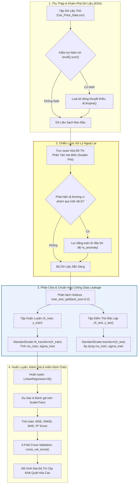
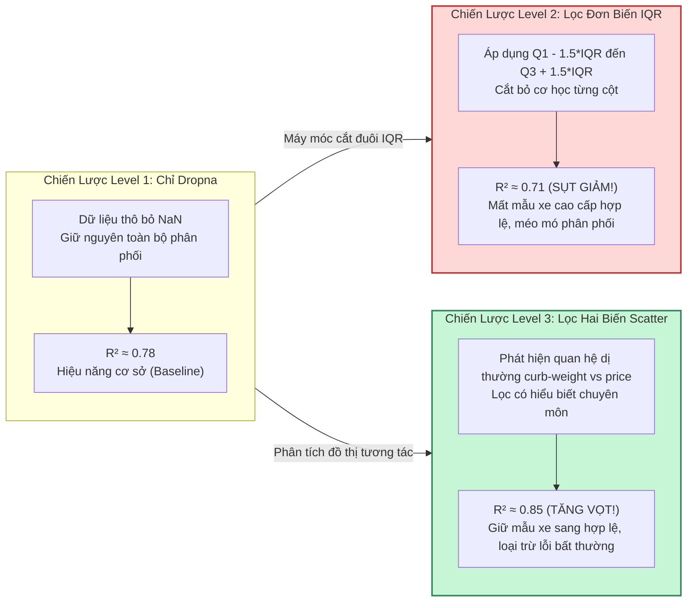

# 04. Học Có Giám Sát — Hồi Quy Tuyến Tính (Supervised Regression)

> **Khóa học:** Global Consumer Intelligence (GCI World 202609)  
> **Đơn vị đào tạo:** Matsuo-Iwasawa Laboratory, Trường Sau đại học Kỹ thuật, Đại học Tokyo (The University of Tokyo)  
> **Tài liệu tham chiếu:** `prep4_slides.pdf` (Slide 7–10, 14–15), `prep1_slides.pdf` (Slide 7–10), `Exercise_Regression_Level_0.ipynb` đến `Level_4.ipynb`, Tập dữ liệu ô tô `Car_Price_Data.csv`

---

## 1. Khung Lý Thuyết & Nền Tảng Khái Niệm

### 1.1 Bản Chất Bài Toán Hồi Quy (Regression Formulation)
Trong hệ thống Học có giám sát (Supervised Learning), mục tiêu của bài toán Hồi quy (Regression) là học một hàm ánh xạ $f: \mathcal{X} \rightarrow \mathcal{Y}$ từ không gian đặc trưng $p$-chiều $\mathbf{x} \in \mathbb{R}^p$ sang một không gian nhãn biến mục tiêu mang giá trị liên tục $y \in \mathbb{R}$.

Khác với bài toán Phân loại (Classification) nơi biến mục tiêu là các nhóm rời rạc, đầu ra của hồi quy có thứ tự đại số và khoảng cách số học thực tế (ví dụ: định giá xe hơi, dự báo doanh thu, ước tính thời gian giao hàng).

#### Mô hình Hồi quy Tuyến tính Đơn biến (Simple Linear Regression)
Mô hình đơn giản nhất giả định mối quan hệ tuyến tính giữa một biến giải thích đơn lẻ $x$ và biến mục tiêu $y$:
$$\hat{y} = w_1 x + w_0 = w_1 x + b$$
Trong đó:
- $w_1$ (Slope / Weight): Độ dốc của đường hồi quy, biểu thị mức độ thay đổi dự kiến của $y$ khi $x$ tăng thêm một đơn vị.
- $w_0$ hoặc $b$ (Intercept / Bias): Hệ số tự do hay điểm cắt trục tung, biểu thị giá trị dự báo của $y$ khi $x = 0$.

#### Mô hình Hồi quy Tuyến tính Đa biến (Multiple Linear Regression)
Khi bài toán mở rộng sang $p$ đặc trưng đầu vào $\mathbf{x} = [x_1, x_2, \dots, x_p]^T$:
$$\hat{y} = w_0 + w_1 x_1 + w_2 x_2 + \dots + w_p x_p = \mathbf{w}^T \mathbf{x} + b$$
Dưới dạng ma trận cho toàn bộ tập dữ liệu gồm $n$ quan sát, nếu ta bổ sung cột 1 vào ma trận đặc trưng $\mathbf{X} \in \mathbb{R}^{n \times (p+1)}$ để tích hợp hệ số chặn $b$ vào véc-tơ trọng số $\mathbf{w} \in \mathbb{R}^{p+1}$:
$$\hat{\mathbf{y}} = \mathbf{X}\mathbf{w}$$

---

### 1.2 Tối Ưu Hóa Bằng Phương Pháp Bình Phương Tối Thiểu (Ordinary Least Squares — OLS)

#### Hàm Mất Mát Tổng Bình Phương Phần Dư (Residual Sum of Squares — RSS)
Phần dư (Residual) của quan sát thứ $i$ được định nghĩa là chênh lệch giữa giá trị thực tế và giá trị dự báo: $e_i = y_i - \hat{y}_i$. Phương pháp OLS tìm kiếm véc-tơ trọng số $\mathbf{w}^*$ nhằm tối thiểu hóa tổng bình phương các khoảng cách thẳng đứng này:
$$\mathcal{L}_{\text{OLS}}(\mathbf{w}) = \sum_{i=1}^n (y_i - \hat{y}_i)^2 = \sum_{i=1}^n \left( y_i - \mathbf{x}_i^T \mathbf{w} \right)^2 = \|\mathbf{y} - \mathbf{X}\mathbf{w}\|_2^2$$

Mở rộng biểu thức ma trận:
$$\mathcal{L}_{\text{OLS}}(\mathbf{w}) = (\mathbf{y} - \mathbf{X}\mathbf{w})^T (\mathbf{y} - \mathbf{X}\mathbf{w}) = \mathbf{y}^T \mathbf{y} - 2\mathbf{w}^T \mathbf{X}^T \mathbf{y} + \mathbf{w}^T \mathbf{X}^T \mathbf{X} \mathbf{w}$$

#### Nghiệm Giải Tích Dạng Đóng — Phương Trình Chuẩn (Normal Equation)
Lấy đạo hàm bậc nhất theo véc-tơ trọng số $\mathbf{w}$ và triệt tiêu gradient:
$$\nabla_{\mathbf{w}} \mathcal{L}_{\text{OLS}}(\mathbf{w}) = -2\mathbf{X}^T \mathbf{y} + 2\mathbf{X}^T \mathbf{X}\mathbf{w} = \mathbf{0}$$
$$\mathbf{X}^T \mathbf{X}\mathbf{w} = \mathbf{X}^T \mathbf{y}$$

Nếu ma trận Gram $\mathbf{X}^T \mathbf{X} \in \mathbb{R}^{(p+1) \times (p+1)}$ khả nghịch (non-singular, tức các cột của $\mathbf{X}$ độc lập tuyến tính hoàn toàn), ta thu được nghiệm tối ưu giải tích duy nhất:
$$\mathbf{w}^* = (\mathbf{X}^T \mathbf{X})^{-1} \mathbf{X}^T \mathbf{y}$$

---

### 1.3 Hệ Thống Đo Lường & Đánh Giá Mô Hình Hồi Quy (Evaluation Metrics)

Để định lượng sai số và mức độ phù hợp của mô hình hồi quy, bốn chỉ số chuẩn tắc sau được áp dụng:

| Chỉ số | Công thức toán học | Đơn vị đo lường | Đặc tính & Hành vi |
|---|---|---|---|
| **Mean Squared Error (MSE)** | $\text{MSE} = \frac{1}{n}\sum_{i=1}^n (y_i - \hat{y}_i)^2$ | $(\text{Đơn vị của } y)^2$ | Khả vi trơn tru, phạt lũy thừa rất nặng các sai số lớn (ngoại lai). Nhược điểm: đơn vị bị bình phương khó diễn giải. |
| **Root Mean Squared Error (RMSE)** | $\text{RMSE} = \sqrt{\text{MSE}} = \sqrt{\frac{1}{n}\sum_{i=1}^n (y_i - \hat{y}_i)^2}$ | Đơn vị của $y$ | Khôi phục sai số về cùng bậc đơn vị thực tế của biến mục tiêu, giữ nguyên độ nhạy với ngoại lai lớn. |
| **Mean Absolute Error (MAE)** | $\text{MAE} = \frac{1}{n}\sum_{i=1}^n \|y_i - \hat{y}_i\|$ | Đơn vị của $y$ | Phạt sai số theo bậc tuyến tính, ít nhạy cảm với ngoại lai cực đoan (robust evaluation). |
| **Hệ số xác định ($R^2$ Score)** | $R^2 = 1 - \frac{\text{SS}_{\text{res}}}{\text{SS}_{\text{tot}}} = 1 - \frac{\sum (y_i - \hat{y}_i)^2}{\sum (y_i - \bar{y})^2}$ | Không thứ nguyên (tỉ lệ) | Tỷ lệ phương sai của $y$ được giải thích bởi mô hình. Thang đo chuẩn hóa so sánh giữa các bộ dữ liệu khác nhau. |

#### Giải Thích Chi Tiết Về Hệ Số Xác Định $R^2$ & Hiện Tượng $R^2 < 0$
Hệ số $R^2$ đo lường tương quan giữa tổng bình phương sai số của mô hình hiện tại ($\text{SS}_{\text{res}}$) với một mô hình tham chiếu cơ sở ngây thơ (Baseline Model) — mô hình luôn dự đoán giá trị trung bình mẫu $\bar{y}$ ($\text{SS}_{\text{tot}}$):
- **$R^2 = 1.0$**: Mô hình dự báo chính xác tuyệt đối, mọi điểm quan sát đều nằm trên mặt phẳng hồi quy ($\text{SS}_{\text{res}} = 0$).
- **$R^2 = 0.0$**: Mô hình hoạt động ngang bằng với việc chỉ đoán giá trị trung bình $\bar{y}$ của tập dữ liệu.
- **Hiện tượng $R^2 < 0$ (Âm)**: Về mặt toán học thuần túy trên tập huấn luyện của mô hình OLS có hệ số chặn, $R^2$ luôn nằm trong khoảng $[0, 1]$. Tuy nhiên, **trên tập kiểm thử (Test Set)** hoặc khi mô hình không có hệ số chặn, $R^2$ hoàn toàn có thể mang giá trị âm sâu (ví dụ: $R^2 = -0.45$).
  - **Nguyên nhân**: Khi mô hình bị quá khớp (overfitting) trầm trọng trên tập train, sai số dự đoán trên tập test vượt quá mức biến thiên tự nhiên của chính biến mục tiêu:
    $$\text{SS}_{\text{res}}^{\text{test}} = \sum_{i=1}^{n_{\text{test}}} (y_i^{\text{test}} - \hat{y}_i^{\text{test}})^2 > \sum_{i=1}^{n_{\text{test}}} (y_i^{\text{test}} - \bar{y}_{\text{test}})^2 = \text{SS}_{\text{tot}}^{\text{test}}$$
  - **Ý nghĩa thực tiễn**: Dự đoán của mô hình còn tồi tệ hơn việc một người không dùng học máy mà chỉ lấy giá trị trung bình của tập kiểm thử để gán cho mọi mẫu!

---

### 1.4 Chiến Lược Xác Thực Mô Hình: Holdout Split vs K-Fold Cross-Validation

1. **Phân chia Holdout (Train / Test Split)**:
   - Toàn bộ tập dữ liệu được tách thành hai phần độc lập: Tập Huấn Luyện (Train set, thông thường 70–80%) và Tập Kiểm Thử (Test set, 20–30%).
   - *Ưu điểm*: Tốc độ tính toán nhanh, đơn giản.
   - *Nhược điểm*: Điểm số ước lượng phụ thuộc mạnh vào hạt giống ngẫu nhiên (`random_state`). Nếu mẫu nhỏ, việc phân chia ngẫu nhiên có thể tạo ra tập test quá dễ hoặc quá khó, dẫn đến độ lệch phương sai đánh giá cao.

2. **Kiểm định chéo K-Fold (K-Fold Cross-Validation)**:
   - Chia ngẫu nhiên tập dữ liệu thành $K$ phần con (folds) có kích thước bằng nhau.
   - Thực hiện $K$ vòng lặp: Tại mỗi vòng lặp $k$, sử dụng Fold thứ $k$ làm dữ liệu kiểm thử (Validation set) và ghép $(K-1)$ folds còn lại làm dữ liệu huấn luyện.
   - Điểm số cuối cùng là giá trị trung bình và độ lệch chuẩn của $K$ lần kiểm thử:
     $$\bar{S} = \frac{1}{K}\sum_{k=1}^K S_k, \quad \sigma_S = \sqrt{\frac{1}{K}\sum_{k=1}^K (S_k - \bar{S})^2}$$
   - *Ưu điểm*: Mọi điểm dữ liệu đều được dùng để kiểm tra đúng một lần; giảm thiểu rủi ro đánh giá sai lệch do phân chia dữ liệu ngẫu nhiên.

---

### 1.5 Tiến Trình Xử Lý Ngoại Lai Thực Nghiệm (Outlier Handling Progression)

Khóa học GCI World xây dựng một case study thực tế sắc bén thông qua chuỗi bài tập từ Level 1 đến Level 3 trên tập dữ liệu giá xe ô tô (`Car_Price_Data.csv` gồm các đặc trưng `engine-size`, `curb-weight`, `city-mpg` và mục tiêu `price`):

#### 1. Mức độ 1 (Level 1 — Baseline EDA & Listwise Deletion)
- Chỉ loại bỏ các dòng chứa giá trị khuyết bằng `dropna()`.
- Mô hình đạt được điểm $R^2 \approx 0.78$ trên tập kiểm thử.

#### 2. Mức độ 2 (Level 2 — Lọc ngoại lai đơn biến bằng Tukey IQR)
- Áp dụng quy tắc khoảng tứ phân vị (Interquartile Range) $IQR = Q_3 - Q_1$:
  $$\text{Chấp nhận: } x \in [Q_1 - 1.5 \times IQR, \ Q_3 + 1.5 \times IQR]$$
- Tiến hành duyệt từng cột đặc trưng (`engine-size`, `curb-weight`, `city-mpg`) và xóa mọi dòng vượt ngưỡng.
- **Quan sát kết quả thực nghiệm**: Điểm $R^2$ trên tập test **giảm xuống** còn $\approx 0.71$!
- **Giải thích bản chất lý thuyết**: Các dòng xe thể thao cao cấp có dung tích xi-lanh (`engine-size`) và giá tiền rất cao không phải là lỗi đo lường (data error) mà là các mẫu đại diện thực tế cho phân khúc siêu xe. Việc máy móc áp dụng tiêu chuẩn đơn biến $1.5 \times IQR$ đã vô tình gọt bỏ phần đuôi phân phối quan trọng, làm suy giảm phương sai hữu ích của dữ liệu và khiến mô hình mất khả năng khái quát hóa vùng giá cao.

#### 3. Mức độ 3 (Level 3 — Lọc ngoại lai hai biến qua trực quan hóa Scatter Plot)
- Thay vì lọc đơn biến cục bộ, kiểm tra đồ thị phân tán 2 chiều giữa từng đặc trưng và giá xe (`curb-weight` vs `price`).
- Phát hiện các điểm dữ liệu dị thường vi phạm quy luật vật lý: ví dụ những chiếc xe trọng lượng cực nhẹ (`curb-weight` $\le 3000$) nhưng giá bị đẩy lên cao bất thường ($\text{price} \ge 30,000$), hoặc xe có `city-mpg` quá cao không tương thích với phân khúc.
- Sử dụng toán tử đảo bit `~` kết hợp điều kiện domain-specific để lọc chính xác các điểm sai lệch này.
- **Kết quả thực nghiệm**: Điểm $R^2$ tăng vọt lên **$\approx 0.85$**, vượt trội cả Level 1 và Level 2.
- **Bài học phương pháp luận**: *Không bao giờ lọc ngoại lai một cách mù quáng bằng công thức cơ học. Phân tích ngoại lai bắt buộc phải dựa trên phân tích hai biến (bivariate analysis) và tri thức miền (domain knowledge).*

---

### 1.6 Chuẩn Hóa Đặc Trưng (Feature Scaling) & Phòng Chống Rò Rỉ Dữ Liệu (Data Leakage)

#### Sự Chênh Lệch Thang Đo
Trong tập dữ liệu xe hơi:
- `engine-size`: phạm vi từ 60 đến 320
- `curb-weight`: phạm vi từ 1,500 đến 4,000
- `city-mpg`: phạm vi từ 13 đến 50

Sự bất đối xứng về biên độ khiến trọng số của đặc trưng có giá trị tuyệt đối lớn bị thu nhỏ nhân tạo, đồng thời làm méo mó các thuật toán tối ưu hóa dựa trên khoảng cách hoặc gradient.

#### Chuẩn Hóa Chuẩn Tắc (`StandardScaler`)
Biến đổi mỗi đặc trưng về phân phối có kỳ vọng bằng 0 và độ lệch chuẩn bằng 1:
$$z = \frac{x - \mu}{\sigma}$$

#### Bẫy Rò Rỉ Dữ Liệu (Data Leakage Trap)
- **Sai lầm phổ biến**: Gọi `scaler.fit_transform(X)` trên toàn bộ tập dữ liệu trước khi thực hiện `train_test_split`.
  - Khi đó, giá trị trung bình $\mu$ và độ lệch chuẩn $\sigma$ đã bị nhiễm thông tin từ tập Test vào tập Train. Kết quả thẩm định mô hình sẽ lạc quan giả tạo.
- **Quy trình chuẩn tắc**:
  1. Phân chia tập dữ liệu thành `X_train` và `X_test`.
  2. Chỉ thực hiện `fit_transform()` trên `X_train` để tính $\mu_{\text{train}}$ và $\sigma_{\text{train}}$.
  3. Chỉ dùng lệnh `transform()` trên `X_test` bằng các tham số đã đóng băng từ tập Train.

---

## 2. Mã Nguồn Python & Kỹ Thuật Thực Thi Cốt Lõi

Toàn bộ các đoạn mã nguồn dưới đây được trích xuất từ chuỗi 5 Notebooks thực hành của khóa học (`Exercise_Regression_Level_0.ipynb` đến `Level_4.ipynb`), được bổ sung chú thích dòng lệnh tường minh nhằm tối ưu hóa việc nghiên cứu và tái hiện thực nghiệm.

### 2.1 Huấn Luyện Mô Hình Hồi Quy Cơ Bản & Trích Xuất Hệ Số (Level 0)

```python
# ==============================================================================
# Trích xuất từ Exercise_Regression_Level_0.ipynb: Baseline Linear Regression
# ==============================================================================
import pandas as pd
from sklearn.linear_model import LinearRegression

# 1. Khởi tạo dữ liệu mẫu mô phỏng quan hệ giữa kích thước xe và giá
data = {
    'width': [64.1, 65.5, 65.5, 66.2],
    'engine-size': [130, 130, 152, 109],
    'price': [13495, 16500, 16500, 13950]
}
df_toy = pd.DataFrame(data)

# 2. Tách biến độc lập (X) và biến mục tiêu (y)
# Chú ý: X phải là ma trận 2D (DataFrame), y là mảng 1D (Series)
X = df_toy[['width', 'engine-size']]
y = df_toy['price']

# 3. Khởi tạo và khớp mô hình OLS
model = LinearRegression()
model.fit(X, y)

# 4. Trích xuất các tham số học được của phương trình: y = w1*x1 + w2*x2 + b
print("=== KẾT QUẢ THAM SỐ HỌC ĐƯỢC ===")
for feature, coef in zip(X.columns, model.coef_):
    print(f"Trọng số w ({feature}): {coef:.4f}")
print(f"Hệ số chặn b (Intercept): {model.intercept_:.4f}")

# 5. Dự báo giá trị và đánh giá hệ số xác định R² trên tập huấn luyện
y_pred = model.predict(X)
r2_score = model.score(X, y)
print(f"Hệ số xác định R² trên dữ liệu: {r2_score:.4f}")
```

---

### 2.2 Tiền Xử Lý Khuyết Thiếu & Phân Tách Dữ Liệu Train/Test (Level 1)

```python
# ==============================================================================
# Trích xuất từ Exercise_Regression_Level_1.ipynb: EDA, Missing Values, Holdout
# ==============================================================================
import numpy as np
import pandas as pd
import matplotlib.pyplot as plt
from sklearn.model_selection import train_test_split
from sklearn.linear_model import LinearRegression
from sklearn.metrics import mean_squared_error, mean_absolute_error, r2_score

# 1. Tải tập dữ liệu xe hơi thực tế Car_Price_Data.csv
df = pd.read_csv('Car_Price_Data.csv')

# 2. Khám phá cấu trúc dữ liệu và kiểm tra giá trị khuyết (NaN)
print("Số lượng dòng ban đầu:", len(df))
print("Số lượng giá trị khuyết trên từng cột:")
print(df.isnull().sum())

# 3. Loại bỏ toàn bộ các dòng chứa ít nhất một giá trị khuyết (Listwise Deletion)
df_clean = df.dropna().copy()
print("Số lượng dòng sau khi dropna:", len(df_clean))

# 4. Thiết lập danh sách đặc trưng đầu vào và biến mục tiêu
feature_cols = ['engine-size', 'curb-weight', 'city-mpg']
X = df_clean[feature_cols]
y = df_clean['price']

# 5. Phân chia dữ liệu thành tập huấn luyện (80%) và tập kiểm thử (20%)
# Cố định random_state để đảm bảo tính tái lập kết quả thực nghiệm
X_train, X_test, y_train, y_test = train_test_split(
    X, y, test_size=0.2, random_state=42
)

# 6. Huấn luyện mô hình hồi quy tuyến tính OLS
lr = LinearRegression()
lr.fit(X_train, y_train)

# 7. Dự báo trên tập kiểm thử chưa từng thấy và tính toán toàn diện các thước đo
y_pred = lr.predict(X_test)

mse = mean_squared_error(y_test, y_pred)
rmse = np.sqrt(mean_squared_error(y_test, y_pred))
mae = mean_absolute_error(y_test, y_pred)
r2 = r2_score(y_test, y_pred)

print(f"\n--- ĐÁNH GIÁ MÔ HÌNH LEVEL 1 (BASELINE) ---")
print(f"MSE : {mse:,.2f}")
print(f"RMSE: {rmse:,.2f}")
print(f"MAE : {mae:,.2f}")
print(f"R²  : {r2:.4f}")
```

---

### 2.3 Phân Tích Thực Nghiệm: Lọc Ngoại Lai Đơn Biến IQR Làm Giảm R² (Level 2)

```python
# ==============================================================================
# Trích xuất từ Exercise_Regression_Level_2.ipynb: Univariate IQR Outlier Removal
# ==============================================================================
import pandas as pd
from sklearn.model_selection import train_test_split
from sklearn.linear_model import LinearRegression

df = pd.read_csv('Car_Price_Data.csv').dropna()

# 1. Tính toán thống kê mô tả để xác định Q1, Q3 và khoảng IQR
desc = df.describe()
Q1 = desc.loc['25%']
Q3 = desc.loc['75%']
IQR = Q3 - Q1

# 2. Xác định biên dưới và biên trên theo tiêu chuẩn Tukey Box Plot
lower_bound = Q1 - 1.5 * IQR
upper_bound = Q3 + 1.5 * IQR

# 3. Lọc tuần tự qua từng cột đặc trưng bằng vòng lặp
df_iqr = df.copy()
features = ['engine-size', 'curb-weight', 'city-mpg']
for col in features:
    # Giữ lại các giá trị nằm trong vùng [lower_bound, upper_bound]
    mask = (df_iqr[col] >= lower_bound[col]) & (df_iqr[col] <= upper_bound[col])
    df_iqr = df_iqr[mask]

print(f"Số lượng mẫu sau khi loại bỏ ngoại lai IQR: {len(df_iqr)} (từ {len(df)} ban đầu)")

# 4. Huấn luyện và đánh giá lại trên tập dữ liệu đã bị gọt giũa
X_iqr = df_iqr[features]
y_iqr = df_iqr['price']

X_tr, X_te, y_tr, y_te = train_test_split(X_iqr, y_iqr, test_size=0.2, random_state=42)
model_iqr = LinearRegression().fit(X_tr, y_tr)

r2_iqr = model_iqr.score(X_te, y_te)
print(f"R² sau khi lọc ngoại lai bằng IQR: {r2_iqr:.4f}")
# KẾT QUẢ GHI NHẬN: R² sụt giảm so với Level 1 do mất đi các mẫu xe thể thao đắt tiền hợp lệ!
```

---

### 2.4 Lọc Ngoại Lai Hai Biến Qua Trực Quan Hóa Tăng Điểm R² Vượt Trội (Level 3)

```python
# ==============================================================================
# Trích xuất từ Exercise_Regression_Level_3.ipynb: Bivariate Scatter Outlier Filter
# ==============================================================================
import pandas as pd
from sklearn.model_selection import train_test_split
from sklearn.linear_model import LinearRegression

df = pd.read_csv('Car_Price_Data.csv').dropna()

# 1. Xác định điều kiện ngoại lai hai biến dựa trên phân tích tương quan
# Trường hợp dị thường: Xe có curb-weight nhỏ (<= 3000) nhưng giá lại cực cao (>= 30,000)
# Đây là các mẫu bất thường vi phạm quan hệ tuyến tính vật lý thông thường
is_anomaly = (df['curb-weight'] <= 3000) & (df['price'] >= 30000)

# 2. Sử dụng toán tử đảo bitwise (~) để chỉ giữ lại những quan sát KHÔNG dị thường
df_filtered = df[~is_anomaly].copy()

# 3. Lọc bổ sung trường hợp city-mpg cực đoan (> 40)
df_filtered = df_filtered[df_filtered['city-mpg'] <= 40]

print(f"Số lượng mẫu sau lọc hai biến trực quan: {len(df_filtered)}")

# 4. Huấn luyện và kiểm tra hiệu năng
features = ['engine-size', 'curb-weight', 'city-mpg']
X_f = df_filtered[features]
y_f = df_filtered['price']

X_tr, X_te, y_tr, y_te = train_test_split(X_f, y_f, test_size=0.2, random_state=42)
model_scatter = LinearRegression().fit(X_tr, y_tr)

r2_scatter = model_scatter.score(X_te, y_te)
print(f"R² sau khi lọc ngoại lai hai biến: {r2_scatter:.4f}")
# KẾT QUẢ GHI NHẬN: R² tăng vọt lên ~0.85, chứng minh giá trị của Bivariate Domain Inspection!
```

---

### 2.5 Chuẩn Hóa Đặc Trưng Với StandardScaler & Kiểm Định K-Fold (Level 4)

```python
# ==============================================================================
# Trích xuất từ Exercise_Regression_Level_4.ipynb: StandardScaler & K-Fold CV
# ==============================================================================
import numpy as np
import pandas as pd
from sklearn.preprocessing import StandardScaler
from sklearn.model_selection import train_test_split, KFold, cross_val_score
from sklearn.linear_model import LinearRegression

df = pd.read_csv('Car_Price_Data.csv').dropna()
features = ['engine-size', 'curb-weight', 'city-mpg']
X = df[features]
y = df['price']

# 1. Phân chia Train/Test trước khi thực hiện bất kỳ phép co dãn nào
X_train, X_test, y_train, y_test = train_test_split(X, y, test_size=0.2, random_state=42)

# 2. Khởi tạo đối tượng chuẩn hóa
scaler = StandardScaler()

# 3. QUY TẮC CHỐNG DATA LEAKAGE:
# - fit_transform() CHỈ được gọi trên tập Train để trích xuất mu_train và sigma_train
X_train_scaled = scaler.fit_transform(X_train)

# - transform() được gọi trên tập Test sử dụng nguyên vẹn tham số của Train
X_test_scaled = scaler.transform(X_test)

# 4. Huấn luyện mô hình trên không gian đặc trưng đã chuẩn hóa
model_scaled = LinearRegression()
model_scaled.fit(X_train_scaled, y_train)

print(f"R² trên Test Set sau khi Scale: {model_scaled.score(X_test_scaled, y_test):.4f}")

# 5. Kiểm định chéo 5-Fold Cross-Validation để kiểm tra tính ổn định toàn diện
# Lưu ý: Khi thực hiện CV với Scaling, lý tưởng nhất là kết hợp qua Pipeline
kf = KFold(n_splits=5, shuffle=True, random_state=42)
cv_scores = cross_val_score(LinearRegression(), scaler.fit_transform(X), y, cv=kf, scoring='r2')

print(f"\n=== KẾT QUẢ 5-FOLD CROSS VALIDATION ===")
print(f"Điểm R² từng Fold: {cv_scores.round(4)}")
print(f"R² Trung bình    : {np.mean(cv_scores):.4f}")
print(f"Độ lệch chuẩn CV : {np.std(cv_scores):.4f}")
```

---

## 3. Sơ Đồ Tư Duy & Quy Trình Trực Quan (Mermaid.js)

### 3.1 Quy Trình Xử Lý Hồi Quy Hoàn Chỉnh & Phòng Chống Rò Rỉ Dữ Liệu
Sơ đồ dưới đây minh họa toàn bộ vòng đời phân tích hồi quy, từ nạp dữ liệu thô, phân tích ngoại lai hai biến, đến chia tách tập dữ liệu và thực thi chuẩn hóa nghiêm ngặt:



---

### 3.2 So Sánh Ba Chiến Lược Ngoại Lai Thực Nghiệm (Level 1 vs 2 vs 3)



---

## 4. Hệ Thống Thẻ Ghi Nhớ Chủ Động (Active Recall Flashcards)

> Phương pháp ôn tập chủ động: Hãy đọc câu hỏi, tự diễn giải câu trả lời trong tư duy trước khi mở phần lời giải.

### Thẻ 1: Bản chất của Nghiệm Phương Trình Chuẩn (Normal Equation)
- **Hỏi (Q):** Phương trình chuẩn trong OLS được viết dưới dạng ma trận như thế nào? Điều kiện tiên quyết để nghiệm này tồn tại duy nhất là gì?
- **Đáp (A):**
  - Phương trình chuẩn: $\mathbf{w}^* = (\mathbf{X}^T \mathbf{X})^{-1} \mathbf{X}^T \mathbf{y}$.
  - Điều kiện tồn tại nghiệm duy nhất: Ma trận vuông $\mathbf{X}^T \mathbf{X} \in \mathbb{R}^{(p+1)\times(p+1)}$ phải khả nghịch (tức định thức $\det(\mathbf{X}^T \mathbf{X}) \ne 0$). Điều này đòi hỏi ma trận đặc trưng $\mathbf{X}$ phải có hạng đầy đủ cột (full column rank), tức số mẫu $n \ge p+1$ và giữa các biến đặc trưng độc lập không xảy ra hiện tượng đa cộng tuyến hoàn hảo (perfect multicollinearity).

---

### Thẻ 2: Hiện tượng Hệ Số Xác Định $R^2 < 0$
- **Hỏi (Q):** Hệ số xác định $R^2$ có thể nhận giá trị âm không? Khi nào điều này xảy ra và ý nghĩa thực tiễn là gì?
- **Đáp (A):**
  - $R^2$ hoàn toàn có thể nhận giá trị âm khi đánh giá trên tập kiểm thử (Test Set).
  - Công thức: $R^2 = 1 - \frac{\text{SS}_{\text{res}}}{\text{SS}_{\text{tot}}}$. Khi tổng bình phương sai số phần dư của mô hình trên tập test ($\text{SS}_{\text{res}}$) lớn hơn tổng bình phương độ lệch của dữ liệu test so với giá trị trung bình của nó ($\text{SS}_{\text{tot}}$), phân số $\frac{\text{SS}_{\text{res}}}{\text{SS}_{\text{tot}}} > 1$, dẫn đến $R^2 < 0$.
  - Ý nghĩa: Mô hình dự báo rất tệ, thậm chí còn kém chính xác hơn một mô hình "ngây thơ" chỉ liên tục đoán giá trị trung bình $\bar{y}_{\text{test}}$.

---

### Thẻ 3: Nghịch Lý Lọc Ngoại Lai Đơn Biến Bằng IQR
- **Hỏi (Q):** Tại sao trong bài tập Regression Level 2 của khóa học GCI, việc loại bỏ các điểm dữ liệu nằm ngoài khoảng $1.5 \times IQR$ lại làm giảm điểm số $R^2$ của mô hình thay vì tăng lên?
- **Đáp (A):**
  - Phương pháp Tukey IQR xét riêng lẻ từng biến và coi các giá trị ở đuôi phân phối là ngoại lai. Tuy nhiên, trong dữ liệu xe hơi, những chiếc xe có dung tích xi-lanh lớn (`engine-size`) và giá rất đắt (`price`) là các mẫu xe thể thao/hạng sang có thật và hợp lệ.
  - Loại bỏ các điểm này làm thu hẹp phương sai có ích của đặc trưng, làm mất đi thông tin ở vùng giá cao, khiến đường hồi quy học bị lệch và mất khả năng tổng quát hóa trên tập kiểm thử chứa toàn dải sản phẩm.

---

### Thẻ 4: Bản Chất và Tác Hại Của Data Leakage Khi Chuẩn Hóa
- **Hỏi (Q):** Tại sao việc gọi `scaler.fit_transform(X)` trên toàn bộ dữ liệu trước khi chia `train_test_split` là một lỗi nghiêm trọng (Data Leakage)?
- **Đáp (A):**
  - Phương thức `fit()` tính toán giá trị trung bình $\mu$ và độ lệch chuẩn $\sigma$. Nếu thực hiện trên toàn bộ $X$, các tham số này đã chứa thông tin thống kê của tập Test.
  - Việc này khiến tập Train bị "rò rỉ" trước thông tin về phân phối của tập Test, làm cho điểm số đánh giá mô hình trong giai đoạn thử nghiệm bị thổi phồng giả tạo và mô hình sẽ suy giảm hiệu năng khi triển khai trong thực tế với dữ liệu hoàn toàn mới.

---

### Thẻ 5: So Sánh Độ Đo MSE và MAE
- **Hỏi (Q):** Trong trường hợp tập dữ liệu thực tế có nhiều điểm nhiễu ngoại lai không thể loại bỏ, ta nên ưu tiên chọn MAE hay MSE làm thước đo chính? Vì sao?
- **Đáp (A):**
  - Nên chọn **MAE (Mean Absolute Error)**.
  - MSE lấy bình phương sai số $(y_i - \hat{y}_i)^2$, do đó một vài điểm ngoại lai cực đoan có thể làm tăng vọt giá trị tổn thất, khiến hàm mục tiêu bị kéo lệch về phía ngoại lai để giảm thiểu sai số lớn.
  - MAE phạt sai số theo bậc tuyến tính $|y_i - \hat{y}_i|$, giúp đo lường mức độ sai lệch trung bình một cách bền bỉ (robust) hơn trước sự hiện diện của các giá trị dị biệt.

---

### Thẻ 6: Lợi Ích Của K-Fold Cross-Validation So Với Holdout Split
- **Hỏi (Q):** Tại sao K-Fold Cross-Validation lại đáng tin cậy hơn Holdout Split khi đánh giá mô hình trên các tập dữ liệu có quy mô vừa và nhỏ?
- **Đáp (A):**
  - Holdout split chỉ tạo ra một tập kiểm thử duy nhất, kết quả đánh giá có phương sai cao và phụ thuộc lớn vào việc phân chia ngẫu nhiên (may mắn trúng mẫu dễ hoặc xui xẻo trúng mẫu khó).
  - K-Fold chia dữ liệu thành $K$ phần và luân phiên đánh giá $K$ lần, đảm bảo mỗi điểm dữ liệu đều được thẩm định độc lập một lần. Điểm trung bình và độ lệch chuẩn của $K$ lần phản ánh chính xác năng lực tổng quát hóa và độ ổn định (stability) của thuật toán.

---

## 5. Các Bẫy Tri Thức & Trường Hợp Biên (Edge Cases)

### 5.1 Bẫy Đa Cộng Tuyến Hoàn Hảo (Multicollinearity) & Ma Trận Kì Dị
- **Cơ chế bẫy**: Khi hai hoặc nhiều biến độc lập có tương quan tuyến tính hoàn hảo (ví dụ: biến $x_2 = 2 x_1$, hoặc tổng các biến dummy bằng cột hệ số chặn), ma trận $\mathbf{X}^T \mathbf{X}$ có định thức $\det(\mathbf{X}^T \mathbf{X}) = 0$.
- **Hậu quả**: Lệnh tính nghịch đảo $(\mathbf{X}^T \mathbf{X})^{-1}$ báo lỗi `LinAlgError: Singular matrix`, hoặc trong tính toán xấp xỉ số học thì phương sai của các trọng số $w$ bùng nổ cực đại (hệ số bất định, dao động rất lớn khi dữ liệu chỉ thay đổi nhẹ).
- **Giải pháp**:
  - Kiểm tra ma trận tương quan trước khi mô hình hóa.
  - Luôn sử dụng tham số `drop_first=True` khi tạo biến giả categorical bằng `pd.get_dummies()`.
  - Áp dụng kỹ thuật điều chuẩn (Regularization: Ridge $L_2$ hoặc Lasso $L_1$) để cộng thêm hằng số $\lambda \mathbf{I}$ vào ma trận Gram, đảm bảo tính khả nghịch.

---

### 5.2 Bẫy Suy Diễn Nhân Quả Từ Trọng Số Hồi Quy
- **Cơ chế bẫy**: Hiểu sai rằng trọng số $w_j$ trong mô hình OLS phản ánh quan hệ nhân quả tuyệt đối giữa $x_j$ và $y$.
- **Bản chất**: Trọng số $w_j$ chỉ đo lường sự thay đổi của $y$ khi $x_j$ tăng một đơn vị trong điều kiện **tất cả các biến còn lại trong mô hình được giữ cố định (ceteris paribus)**.
- **Hiện tượng**: Nếu bỏ sót các biến ẩn quan trọng (Omitted Variable Bias) hoặc dữ liệu bị chọn lọc lệch (Selection Bias / Dark Data), hệ số $w_j$ có thể đảo ngược hoàn toàn dấu (+ thành -) hoặc mang giá trị giả mạo (spurious correlation).

---

### 5.3 Bẫy So Sánh Trọng Số Khi Chưa Chuẩn Hóa Thang Đo
- **Cơ chế bẫy**: Kết luận rằng biến $x_1$ quan trọng hơn biến $x_2$ vì trọng số $w_1 = 50.0 > w_2 = 0.05$.
- **Bản chất**: Nếu $x_1$ đo bằng mét (giá trị nhỏ) và $x_2$ đo bằng gram (giá trị hàng trăm nghìn), thì sự chênh lệch độ lớn của trọng số chỉ phản ánh đơn vị đo lường chứ không phản ánh tầm ảnh hưởng thống kê.
- **Giải pháp**: Muốn so sánh trực tiếp tầm quan trọng (Feature Importance) thông qua hệ số hồi quy, bắt buộc phải chuẩn hóa toàn bộ đặc trưng về cùng thang đo chuẩn tắc qua `StandardScaler`. Khi đó, các trọng số thu được gọi là **Standardized Coefficients**.
