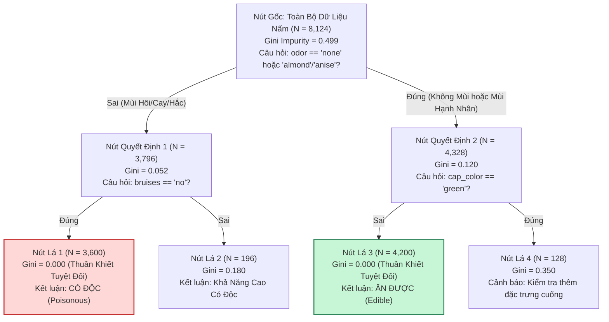
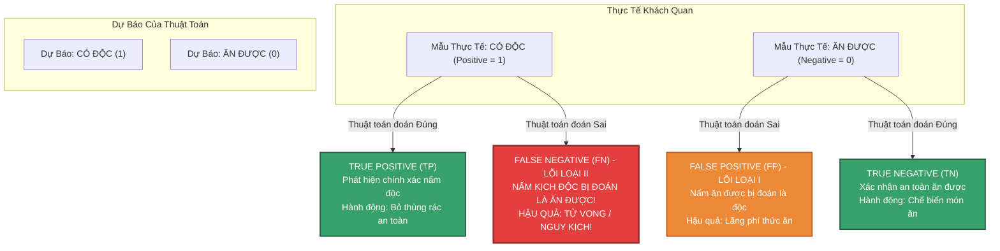

# 05. Học Có Giám Sát — Phân Loại & Cây Quyết Định (Supervised Classification)

> **Khóa học:** Global Consumer Intelligence (GCI World 202609)  
> **Đơn vị đào tạo:** Matsuo-Iwasawa Laboratory, Trường Sau đại học Kỹ thuật, Đại học Tokyo (The University of Tokyo)  
> **Tài liệu tham chiếu:** `prep4_slides.pdf` (Slide 11–13, 16–18), `prep1_slides.pdf` (Slide 11–14), `Exercise_Classification_Level_0.ipynb` đến `Level_3.ipynb`, Tập dữ liệu nấm `Mushroom_Appearence_Data.csv`, `Mushroom_Odor_Data.csv`

---

## 1. Khung Lý Thuyết & Nền Tảng Khái Niệm

### 1.1 Bản Chất Bài Toán Phân Loại (Classification Formulation)
Bài toán Phân loại (Classification) trong Học có giám sát nhắm tới việc học một hàm ánh xạ $f: \mathcal{X} \rightarrow \mathcal{Y}$ nhằm gán một quan sát với véc-tơ đặc trưng $\mathbf{x} \in \mathbb{R}^p$ vào một trong $K$ nhóm hoặc lớp rời rạc định trước $\mathcal{Y} = \{C_1, C_2, \dots, C_K\}$:
- **Phân loại nhị phân (Binary Classification)**: Biến mục tiêu chỉ nhận 2 trạng thái đối lập $y \in \{0, 1\}$ (ví dụ: Nấm ăn được vs Nấm độc; Khách hàng rời mạng vs Khách hàng ở lại; Giao dịch hợp lệ vs Gian lận).
- **Phân loại đa lớp (Multi-class Classification)**: Biến mục tiêu nhận một trong $K > 2$ nhãn rời rạc (ví dụ: Phân loại loại xe máy, nhận diện chữ số viết tay từ 0 đến 9).

Khác với Hồi quy nơi khoảng cách giữa các số thực mang ý nghĩa đại số liên tục, trong phân loại danh nghĩa, không tồn tại khoảng cách định lượng giữa các nhãn lớp (ví dụ: nhãn 2 không thể hiểu là "gấp đôi" nhãn 1).

---

### 1.2 Kiến Trúc Cây Quyết Định & Cơ Chế Phân Tách Đệ Quy (Recursive Binary Splitting)

Cây Quyết Định (Decision Tree) là mô hình phi tham số (non-parametric) xây dựng theo cấu trúc phân cấp dạng cây để phân chia không gian đặc trưng đa chiều thành các siêu hình hộp chữ nhật (axis-aligned hyper-rectangles).

#### Cấu Trúc Nút Của Cây:
1. **Nút Gốc (Root Node)**: Điểm khởi đầu của toàn bộ tập dữ liệu huấn luyện, chứa câu hỏi điều kiện phân tách đầu tiên.
2. **Nút Quyết Định Nội Bộ (Internal / Decision Nodes)**: Các nút trung gian kiểm tra điều kiện trên một đặc trưng cụ thể ($x_j \le \theta$ hoặc $x_j == \text{category}$).
3. **Nút Lá (Leaf / Terminal Nodes)**: Nút tận cùng không phân tách thêm nữa, chứa phân phối xác suất lớp hoặc nhãn dự đoán đa số đại diện cho phân vùng đó.

#### Tiêu Chuẩn Đo Lường Độ Vẩn Đục (Impurity Criteria)
Tại một nút bất kỳ $t$ chứa $N_t$ mẫu dữ liệu thuộc $K$ lớp, gọi $p_k = \frac{N_{t, k}}{N_t}$ là tỷ lệ mẫu thuộc lớp $k$ ($0 \le p_k \le 1, \sum_{k=1}^K p_k = 1$).

1. **Độ vẩn đục Gini (Gini Impurity — Chuẩn mặc định trong thuật toán CART)**:
   Đo lường xác suất một phần tử được chọn ngẫu nhiên bị phân loại sai nếu nó được gắn nhãn ngẫu nhiên theo phân phối lớp tại nút đó:
   $$I_G(t) = 1 - \sum_{k=1}^K p_k^2 = \sum_{k \ne j} p_k p_j$$
   - Khi nút hoàn toàn thuần khiết (Pure Node, 100% mẫu thuộc về 1 lớp duy nhất): $I_G(t) = 1 - (1)^2 = 0$.
   - Đối với phân loại nhị phân cân bằng ($p_1 = p_2 = 0.5$): Độ vẩn đục đạt cực đại $I_G(t) = 1 - (0.5^2 + 0.5^2) = 0.5$.

2. **Entropy Shannon (Information Entropy — Thuật toán ID3 / C4.5)**:
   Đo lường mức độ hỗn loạn thông tin trong phân phối xác suất:
   $$H(t) = -\sum_{k=1}^K p_k \log_2(p_k)$$
   *(Quy ước toán học: $0 \log_2 0 = 0$ khi $p_k = 0$).*
   - Nút thuần khiết: $H(t) = 0$.
   - Nút nhị phân hỗn loạn tối đa ($p_1 = p_2 = 0.5$): $H(t) = - (0.5 \log_2 0.5 + 0.5 \log_2 0.5) = 1.0 \text{ bit}$.

3. **Mức Độ Giảm Độ Vẩn Đục / Tăng Thông Tin (Information Gain — $\Delta I$)**:
   Thuật toán duyệt qua tất cả các đặc trưng và tất cả các ngưỡng phân tách khả dĩ để chọn phép chia phân nhánh nút cha $t$ thành hai nút con bên trái ($t_L$) và bên phải ($t_R$) nhằm tối đa hóa mức giảm độ vẩn đục:
   $$\Delta I(t, s) = I(t) - \left( \frac{N_L}{N_t} I(t_L) + \frac{N_R}{N_t} I(t_R) \right)$$
   Trong đó $N_L, N_R$ lần lượt là số lượng quan sát rơi vào nhánh trái và nhánh phải.

---

### 1.3 Hiện Tượng Quá Khớp (Overfitting) & Cắt Tỉa Siêu Tham Số `max_depth`

#### Nghịch Lý Của Cây Tự Do (Unconstrained Decision Tree)
Nếu không áp đặt điều kiện dừng (`max_depth=None`), thuật toán sẽ tiếp tục phân nhánh đệ quy cho đến khi mọi nút lá đều có độ vẩn đục bằng 0 (tuyệt đối thuần khiết) hoặc mỗi nút lá chỉ chứa đúng 1 mẫu.
- **Hậu quả**: Mô hình ghi nhớ máy móc toàn bộ nhiễu ngẫu nhiên của tập Train.
- Độ chính xác trên tập Train đạt 100%, nhưng trên tập Test điểm số sụt giảm nghiêm trọng. Mô hình có phương sai cực cao (High Variance), thiên lệch thấp (Low Bias).

#### Kiểm Soát Bằng Cắt Tỉa Siêu Tham Số (Pre-Pruning)
- **`max_depth`**: Giới hạn độ sâu tối đa của cây tính từ nút gốc. Đây là siêu tham số điều chuẩn cốt lõi nhất để khống chế tính phức tạp của mô hình.
- **`min_samples_split`**: Số lượng mẫu tối thiểu bắt buộc phải có tại một nút nội bộ để cho phép phân tách tiếp.
- **`min_samples_leaf`**: Số lượng mẫu tối thiểu bắt buộc phải có tại mỗi nút lá.

---

### 1.4 Tiền Xử Lý Biến Phân Loại & Bẫy Biến Giả (Dummy Variable Trap)

#### Kỹ Thuật Mã Hóa One-Hot Encoding (`pd.get_dummies`)
Các thuật toán học máy chỉ nhận dữ liệu đầu vào là các ma trận số thực. Các biến chuỗi phân loại (ví dụ: màu sắc mũ nấm `cap_color` gồm các giá trị `'brown'`, `'yellow'`, `'white'`,...) không thể gán nhãn tùy tiện dạng số nguyên $0, 1, 2$ vì sẽ tạo ra thứ tự số học giả tạo.
- Ta chuyển đổi biến phân loại gồm $K$ trạng thái thành các cột chỉ báo nhị phân (Binary Indicator / Dummy Variables) nhận giá trị 0 hoặc 1.

#### Bẫy Biến Giả (Dummy Variable Trap) & Tham Số `drop_first=True`
- Nếu một biến phân loại có $K$ giá trị riêng biệt (ví dụ: `bruises` có 2 trạng thái `'bruises'` và `'no'`), tổng của 2 cột biến giả luôn luôn bằng 1 đối với mọi hàng:
  $$\text{dummy}_1 + \text{dummy}_2 = 1$$
- Trong các mô hình tuyến tính có cột hệ số chặn $b$ (toàn là số 1), sự xuất hiện của cả $K$ cột biến giả dẫn tới hiện tượng **đa cộng tuyến hoàn hảo (Perfect Multicollinearity)**, làm ma trận nghịch đảo bị suy biến.
- Vì vậy, quy chuẩn bắt buộc là loại bỏ một cột cơ sở để chỉ giữ lại $K - 1$ cột biến giả thông qua tham số:
  ```python
  pd.get_dummies(df, drop_first=True, dtype=int)
  ```
  *(Đối với Cây quyết định, `drop_first=True` giúp giảm bớt chiều dữ liệu dư thừa và tăng tốc độ tìm kiếm phân tách).*

---

### 1.5 Chiến Lược Xử Lý Giá Trị Khuyết Cho Biến Phân Loại: Mode Imputation

Trong dữ liệu thực tế, việc xóa bỏ dòng chứa giá trị khuyết (`dropna()`) có thể làm mất đi lượng lớn dữ liệu giá trị. Khóa học giới thiệu hai cấp độ bù khuyết cho biến phân loại:

1. **Phương pháp 1: Bù khuyết bằng Yếu vị Cột Toàn Cục (Global Column Mode)**:
   - Tìm giá trị xuất hiện nhiều nhất của biến trong toàn bộ cột:
     $$\text{mode}_{\text{global}} = \arg\max_c \text{Count}(X = c)$$
   - Thay thế toàn bộ các giá trị `NaN` bằng giá trị yếu vị này qua `df['col'].fillna(...)`.

2. **Phương pháp 2: Bù khuyết bằng Yếu vị Nhóm Có Điều Kiện (Conditional Group Mode)**:
   - Thay vì dùng một giá trị chung cho toàn bộ bảng, ta gom nhóm theo một đặc trưng tương quan mạnh (ví dụ: tính mode của đặc trưng vết bầm `bruises` bên trong từng nhóm màu mũ `cap_color`):
     $$\text{mode}_{\text{group}}(g) = \arg\max_c \text{Count}(X = c \mid \text{Group} = g)$$
   - Áp dụng `groupby()` kết hợp với bộ lọc mặt nạ boolean và `.loc` để điền chính xác giá trị theo ngữ cảnh của từng đối tượng.

---

### 1.6 Tích Hợp Dữ Liệu Quan Hệ Đa Bảng (`pd.merge`) & Kiểm Soát Khóa Ngoại

Bài toán thực tế thường phân tán thông tin trên nhiều bảng quan hệ:
- Bảng 1: Thông số ngoại quan nấm (`Mushroom_Appearence_Data.csv` gồm `ID`, `bruises`, `cap_color`, `poison`).
- Bảng 2: Thông số mùi hương nấm (`Mushroom_Odor_Data.csv` gồm `ID`, `odor`).

Để kết hợp hai bảng:
- **Khớp khóa nối nội (Inner Join)**: `pd.merge(df1, df2, on='ID', how='inner')` chỉ giữ lại các dòng có mã `ID` hiện diện đồng thời ở cả hai bảng.
- **Khớp khóa nối trái (Left Join)**: `pd.merge(df1, df2, on='ID', how='left')` giữ lại toàn bộ bảng bên trái; những mã `ID` không tìm thấy bên bảng phải sẽ nhận giá trị `NaN`.
- **Kiểm tra khóa ngoại bất hợp lệ**: Sử dụng phương thức `.isin()` kết hợp toán tử đảo bit `~` để rà soát các mã khóa bị thiếu:
  ```python
  unmapped_ids = df1.loc[~df1['ID'].isin(df2['ID']), 'ID']
  ```

---

### 1.7 Ma Trận Nhầm Lẫn (Confusion Matrix) & Đánh Đổi Rủi Ro Trong Thực Tế

#### Cấu Trúc Ma Trận Nhầm Lẫn Cho Phân Loại Nhị Phân:
Giả định nhãn $y = 1$ là "Nấm Độc" (Positive) và $y = 0$ là "Nấm Ăn Được" (Negative):

$$\begin{array}{c|cc}
& \textbf{Dự Đoán: Nấm Độc (1)} & \textbf{Dự Đoán: Nấm Ăn Được (0)} \\
\hline
\textbf{Thực Tế: Độc (1)} & \textbf{True Positive (TP)} & \textbf{False Negative (FN)} \ (\text{Lỗi Loại II}) \\
\textbf{Thực Tế: Ăn Được (0)} & \textbf{False Positive (FP)} \ (\text{Lỗi Loại I}) & \textbf{True Negative (TN)} \\
\end{array}$$

#### Định Nghĩa Các Thước Đo Định Lượng:
1. **Accuracy (Độ chính xác tổng quát)**:
   $$\text{Accuracy} = \frac{\text{TP} + \text{TN}}{\text{TP} + \text{TN} + \text{FP} + \text{FN}}$$
   - **Nghịch lý Accuracy (Accuracy Paradox)**: Trong tập dữ liệu mất cân bằng nghiêm trọng (ví dụ: 99% nấm ăn được, 1% nấm độc), một mô hình ngây thơ chỉ việc phán đoán toàn bộ là "Ăn được" sẽ đạt ngay Accuracy = 99%! Tuy nhiên mô hình này hoàn toàn vô dụng vì bỏ sót 100% nấm độc.

2. **Precision (Độ chuẩn xác / Dương tính thật)**:
   $$\text{Precision} = \frac{\text{TP}}{\text{TP} + \text{FP}}$$
   - Trả lời câu hỏi: *Trong số các cây nấm mà mô hình cảnh báo là có độc, thực tế có bao nhiêu cây độc thật?*
   - Tối ưu hóa Precision khi chi phí của việc báo động giả (False Positive) là cực kỳ tốn kém.

3. **Recall / Sensitivity (Độ thu hồi / Độ nhạy)**:
   $$\text{Recall} = \frac{\text{TP}}{\text{TP} + \text{FN}}$$
   - Trả lời câu hỏi: *Trong toàn bộ số cây nấm độc tồn tại trong tự nhiên, mô hình đã phát hiện và thu hồi được bao nhiêu phần trăm?*
   - Tối ưu hóa Recall khi việc bỏ sót mục tiêu (False Negative) gây hậu quả chết người hoặc thảm họa.

4. **F1-Score (Trung bình điều hòa giữa Precision và Recall)**:
   $$\text{F1} = 2 \cdot \frac{\text{Precision} \cdot \text{Recall}}{\text{Precision} + \text{Recall}} = \frac{2\text{TP}}{2\text{TP} + \text{FP} + \text{FN}}$$

#### Nghiên Cứu Tình Huống Sống Còn (Case Study: Nấm Độc vs Nấm Ăn Được):
- **Sai số False Positive (FP)**: Dự đoán nấm ăn được là có độc $\rightarrow$ Người thu hái bỏ phí một cây nấm ăn được. Hậu quả: Thiệt hại kinh tế nhỏ.
- **Sai số False Negative (FN)**: Dự đoán nấm kịch độc là ăn được $\rightarrow$ Người dùng chế biến và ăn phải. Hậu quả: Tử vong lập tức!
- **Kết luận chiến lược**: Trong bài toán phân loại nấm độc hay chẩn đoán y tế, **Recall bắt buộc phải được ưu tiên tối đa ($\text{Recall} \rightarrow 1.0$), chấp nhận đánh đổi chỉ số Precision có thể giảm nhẹ để triệt tiêu hoàn toàn lỗi False Negative ($\text{FN} = 0$)**.

---

## 2. Mã Nguồn Python & Kỹ Thuật Thực Thi Cốt Lõi

Toàn bộ các đoạn mã nguồn dưới đây được trích xuất từ chuỗi 4 Notebooks phân loại của khóa học (`Exercise_Classification_Level_0.ipynb` đến `Level_3.ipynb`), đi kèm chú thích tỉ mỉ từng câu lệnh.

### 2.1 Huấn Luyện Cây Quyết Định Cơ Bản & Trực Quan Hóa Cây (Level 0)

```python
# ==============================================================================
# Trích xuất từ Exercise_Classification_Level_0.ipynb: Baseline Decision Tree
# ==============================================================================
import pandas as pd
import matplotlib.pyplot as plt
from sklearn.tree import DecisionTreeClassifier, plot_tree

# 1. Khởi tạo dữ liệu đồ chơi mô phỏng đặc trưng nấm
toy_data = {
    'bruises': ['yes', 'no', 'no', 'yes'],
    'odor': ['almond', 'anise', 'none', 'pungent'],
    'poison': [0, 0, 0, 1]  # 0: Ăn được (Edible), 1: Có độc (Poisonous)
}
df_toy = pd.DataFrame(toy_data)

# 2. Tiền xử lý: Tách biến độc lập và biến mục tiêu
X_raw = df_toy[['bruises', 'odor']]
y = df_toy['poison']

# 3. One-Hot Encoding với drop_first=True để tránh bẫy biến giả
X_encoded = pd.get_dummies(X_raw, drop_first=True, dtype=int)
print("=== DỮ LIỆU SAU MÃ HÓA ONE-HOT ===")
print(X_encoded)

# 4. Khởi tạo và huấn luyện Cây Quyết Định (CART sử dụng Gini Impurity)
clf = DecisionTreeClassifier(random_state=42)
clf.fit(X_encoded, y)

# 5. Đo lường độ chính xác Accuracy trên tập dữ liệu
train_acc = clf.score(X_encoded, y)
print(f"\nĐộ chính xác huấn luyện: {train_acc * 100:.2f}%")

# 6. Trực quan hóa cấu trúc luật if-then của cây quyết định
plt.figure(figsize=(10, 6), dpi=300)
plot_tree(
    clf,
    feature_names=X_encoded.columns.tolist(),
    class_names=['Edible', 'Poison'],
    filled=True,
    rounded=True,
    fontsize=10
)
plt.title("Trực quan hóa cấu trúc Cây Quyết Định Cơ Bản", fontsize=12)
plt.tight_layout()
plt.show()
```

---

### 2.2 Phân Tích Biến Phân Loại, Dropna & Đánh Giá Overfitting (Level 1)

```python
# ==============================================================================
# Trích xuất từ Exercise_Classification_Level_1.ipynb: Categorical EDA & Holdout
# ==============================================================================
import pandas as pd
from sklearn.model_selection import train_test_split
from sklearn.tree import DecisionTreeClassifier

# 1. Nạp dữ liệu đặc trưng ngoại quan nấm Mushroom_Appearence_Data.csv
df_app = pd.read_csv('Mushroom_Appearence_Data.csv')

# 2. Khám phá số lượng giá trị duy nhất và phân phối tần suất
print("Các màu sắc mũ nấm duy nhất:", df_app['cap_color'].unique())
print("\nBảng tần suất kết hợp giữa vết bầm và tính độc hại:")
print(df_app[['bruises', 'poison']].value_counts())

# 3. Chiến lược cơ bản: Loại bỏ toàn bộ các dòng chứa NaN
df_dropped = df_app.dropna().copy()
print(f"\nSố lượng mẫu ban đầu: {len(df_app)} -> Sau khi dropna: {len(df_dropped)}")

# 4. Tách đặc trưng và mã hóa One-Hot
X = df_dropped[['bruises', 'cap_color']]
y = df_dropped['poison']

X_dummies = pd.get_dummies(X, drop_first=True, dtype=int)

# 5. Phân chia Train/Test theo tỷ lệ 80/20
X_train, X_test, y_train, y_test = train_test_split(
    X_dummies, y, test_size=0.2, random_state=42
)

# 6. Huấn luyện cây không giới hạn độ sâu (max_depth=None)
tree_deep = DecisionTreeClassifier(random_state=42)
tree_deep.fit(X_train, y_train)

# 7. So sánh hiệu năng trên tập Train và tập Test để nhận diện Overfitting
train_score = tree_deep.score(X_train, y_train)
test_score = tree_deep.score(X_test, y_test)

print(f"\n--- KIỂM TRA HIỆN TƯỢNG QUÁ KHỚP (OVERFITTING) ---")
print(f"Accuracy trên Train Set: {train_score:.4f}")
print(f"Accuracy trên Test Set : {test_score:.4f}")
if train_score > test_score:
    print("-> Cảnh báo: Mô hình đang ghi nhớ dữ liệu Train tốt hơn năng lực khái quát hóa Test!")
```

---

### 2.3 Chiến Lược Bù Khuyết Biến Phân Loại Bằng Group Mode (Level 2)

```python
# ==============================================================================
# Trích xuất từ Exercise_Classification_Level_2.ipynb: Global vs Group Mode
# ==============================================================================
import pandas as pd

df = pd.read_csv('Mushroom_Appearence_Data.csv')

# ------------------------------------------------------------------------------
# Cách 1: Bù khuyết bằng Yếu vị Toàn cục (Global Column Mode)
# ------------------------------------------------------------------------------
global_mode_bruises = df['bruises'].describe()['top']  # Hoặc df['bruises'].mode()[0]
print("Yếu vị toàn cục của cột bruises:", global_mode_bruises)

df_global = df.copy()
df_global['bruises'] = df_global['bruises'].fillna(global_mode_bruises)

# ------------------------------------------------------------------------------
# Cách 2: Bù khuyết bằng Yếu vị Nhóm theo Màu Mũ (Conditional Group Mode)
# ------------------------------------------------------------------------------
df_group = df.copy()

# 1. Trích xuất yếu vị của bruises bên trong từng nhóm cap_color
group_modes = df_group.groupby('cap_color')['bruises'].describe()['top']
print("\nBảng yếu vị của bruises phân tầng theo từng màu mũ (cap_color):")
print(group_modes)

# 2. Duyệt qua từng màu mũ và điền khuyết có điều kiện bằng mặt nạ boolean & .loc
is_bruises_null = df_group['bruises'].isnull()
for color in df_group['cap_color'].dropna().unique():
    # Tạo mask: Dòng vừa có màu mũ chỉ định, vừa bị khuyết vết bầm
    mask = (df_group['cap_color'] == color) & is_bruises_null
    # Gán giá trị yếu vị tương ứng của nhóm màu đó
    df_group.loc[mask, 'bruises'] = group_modes[color]

print(f"\nSố lượng NaN còn lại sau khi Group Mode Imputation: {df_group['bruises'].isnull().sum()}")
```

---

### 2.4 Hợp Nhất Đa Bảng, Rà Soát Khóa Ngoại & Ma Trận Nhầm Lẫn (Level 3)

```python
# ==============================================================================
# Trích xuất từ Exercise_Classification_Level_3.ipynb: Joins, Pruning & Confusion Matrix
# ==============================================================================
import pandas as pd
from sklearn.model_selection import train_test_split
from sklearn.tree import DecisionTreeClassifier
from sklearn.metrics import confusion_matrix, classification_report, accuracy_score, recall_score, precision_score

# 1. Nạp hai bảng quan hệ
df_app = pd.read_csv('Mushroom_Appearence_Data.csv')
df_odor = pd.read_csv('Mushroom_Odor_Data.csv')

print(f"Số dòng bảng ngoại quan: {len(df_app)}")
print(f"Số dòng bảng mùi hương : {len(df_odor)}")

# 2. Kiểm tra các mã khóa ID không khớp giữa 2 bảng bằng .isin() và toán tử ~
unmatched_mask = ~df_app['ID'].isin(df_odor['ID'])
missing_ids = df_app.loc[unmatched_mask, 'ID']
print(f"Số lượng ID ở df_app không tồn tại trong df_odor: {len(missing_ids)}")

# 3. Hợp nhất hai bảng bằng phương thức inner merge theo khóa 'ID'
df_merged = pd.merge(df_app, df_odor, on='ID', how='inner')
print(f"Số lượng mẫu sau khi kết hợp hai bảng: {len(df_merged)}")

# 4. Tiền xử lý: Bỏ các dòng NaN còn lại và tách X, y
df_clean = df_merged.dropna().copy()
features = ['bruises', 'cap_color', 'odor']
X = pd.get_dummies(df_clean[features], drop_first=True, dtype=int)
y = df_clean['poison']

# 5. Phân chia Train/Test
X_train, X_test, y_train, y_test = train_test_split(
    X, y, test_size=0.2, random_state=42
)

# 6. Cắt tỉa siêu tham số: Khống chế max_depth=3 để ngăn chặn quá khớp
clf_pruned = DecisionTreeClassifier(max_depth=3, random_state=42)
clf_pruned.fit(X_train, y_train)

# 7. Dự báo nhãn phân loại trên tập kiểm thử
y_pred = clf_pruned.predict(X_test)

# 8. Trích xuất Ma trận nhầm lẫn (Confusion Matrix)
# Thứ tự mặc định của sklearn confusion_matrix:
# [[TN, FP],
#  [FN, TP]]
cm = confusion_matrix(y_test, y_pred)
tn, fp, fn, tp = cm.ravel()

print("\n=== MA TRẬN NHẦM LẪN (CONFUSION MATRIX) ===")
print(f"True Negative  (Ăn được đoán đúng Ăn được) : {tn}")
print(f"False Positive (Ăn được đoán nhầm Có độc)   : {fp} (Lỗi Loại I)")
print(f"False Negative (CÓ ĐỘC ĐOÁN NHẦM ĂN ĐƯỢC)   : {fn} (LỖI LOẠI II - NGUY HIỂM!)")
print(f"True Positive  (Có độc đoán đúng Có độc)   : {tp}")

# 9. Báo cáo các thước đo hiệu năng chuyên sâu
acc = accuracy_score(y_test, y_pred)
prec = precision_score(y_test, y_pred)
rec = recall_score(y_test, y_pred)

print(f"\n--- THƯỚC ĐO ĐÁNH GIÁ ĐỊNH LƯỢNG ---")
print(f"Accuracy : {acc:.4f}")
print(f"Precision: {prec:.4f}")
print(f"Recall   : {rec:.4f} (Độ thu hồi diệt nấm độc)")
```

---

## 3. Sơ Đồ Tư Duy & Quy Trình Trực Quan (Mermaid.js)

### 3.1 Cấu Trúc Phân Tách Logic Của Cây Quyết Định (CART Binary Splitting)
Sơ đồ mô phỏng quá trình phân tách đệ quy từ nút gốc dựa trên mức độ giảm độ vẩn đục Gini:



---

### 3.2 Bản Đồ Ra Quyết Định Ma Trận Nhầm Lẫn & Đánh Đổi Rủi Ro
Sơ đồ phân loại 4 góc phần tư của Ma trận nhầm lẫn minh họa rõ mức độ nghiêm trọng giữa hai loại sai lầm:



---

## 4. Hệ Thống Thẻ Ghi Nhớ Chủ Động (Active Recall Flashcards)

> Phương pháp ôn tập chủ động: Hãy đọc câu hỏi, tự diễn giải câu trả lời trong tư duy trước khi mở phần lời giải.

### Thẻ 1: Ý Nghĩa Toán Học Của Độ Vẩn Đục Gini Bằng 0
- **Hỏi (Q):** Trong thuật toán Cây Quyết Định (CART), giá trị Gini Impurity $I_G(t) = 0$ tại một nút thể hiện điều gì?
- **Đáp (A):**
  - Công thức: $I_G(t) = 1 - \sum_{k=1}^K p_k^2$.
  - Khi $I_G(t) = 0$, nghĩa là tồn tại một lớp $k^*$ có tỷ lệ mẫu $p_{k^*} = 1.0$ và mọi lớp khác $p_j = 0$.
  - Nút này đạt trạng thái **thuần khiết tuyệt đối (Pure Node)**; toàn bộ các quan sát rơi vào nút này đều thuộc về cùng một lớp phân loại duy nhất, không cần phải thực hiện thêm bất kỳ phép phân tách nào nữa.

---

### Thẻ 2: Bản Chất Nghịch Lý Accuracy (Accuracy Paradox)
- **Hỏi (Q):** Tại sao trong bài toán phát hiện bệnh ung thư hiếm gặp hoặc phân loại gian lận thẻ tín dụng, chỉ số Accuracy (Độ chính xác) có thể đạt 99.9% nhưng mô hình thực chất hoàn toàn vô giá trị?
- **Đáp (A):**
  - Do hiện tượng mất cân bằng mẫu nghiêm trọng (Class Imbalance). Ví dụ trong 10,000 giao dịch chỉ có 10 giao dịch gian lận (0.1%).
  - Một mô hình ngây thơ chỉ việc luôn luôn đoán là "Bình thường" (Negative) sẽ đúng 9,990 trường hợp, mang lại Accuracy = 99.9%.
  - Tuy nhiên, mô hình bỏ sót toàn bộ 10 vụ gian lận ($\text{Recall} = 0\%$). Khi đó Accuracy bị chi phối hoàn toàn bởi lớp đa số, che giấu hoàn toàn sự thất bại của mô hình trên lớp thiểu số quan trọng.

---

### Thẻ 3: Đánh Đổi Rủi Ro Giữa Precision và Recall Trong Bài Toán Nấm Độc
- **Hỏi (Q):** Trong bài toán phân loại nấm (`poison` = 1 vs ăn được = 0), sai số False Negative (FN) và False Positive (FP) gây ra những hệ quả gì? Chỉ số nào bắt buộc phải được tối đa hóa?
- **Đáp (A):**
  - **False Negative (FN)**: Nấm thực tế có độc nhưng mô hình phán đoán là nấm ăn được. Hậu quả: Người ăn sẽ bị ngộ độc hoặc tử vong.
  - **False Positive (FP)**: Nấm thực tế ăn được nhưng mô hình cảnh báo có độc. Hậu quả: Bỏ phí một cây nấm ăn được, thiệt hại kinh tế không đáng kể.
  - **Chỉ số cần ưu tiên**: **Recall** ($\frac{\text{TP}}{\text{TP} + \text{FN}}$) bắt buộc phải được đẩy lên mức tối đa ($\approx 100\%$) để triệt tiêu số ca FN về 0, chấp nhận hy sinh một phần Precision.

---

### Thẻ 4: Cơ Chế Điều Chuẩn Bằng Siêu Tham Số `max_depth`
- **Hỏi (Q):** Tại sao việc không giới hạn độ sâu của Cây Quyết Định (`max_depth=None`) thường dẫn tới hiện tượng Overfitting? Siêu tham số `max_depth` kiểm soát bias-variance trade-off như thế nào?
- **Đáp (A):**
  - Cây không khống chế độ sâu sẽ tiếp tục phân nhánh cho đến khi cô lập từng điểm ngoại lai cá biệt vào các nút lá riêng biệt, ghi nhớ trọn vẹn nhiễu của dữ liệu huấn luyện (Training Accuracy = 100%, Variance rất cao).
  - Khống chế `max_depth` (ví dụ `max_depth=3`) giới hạn số lượng câu hỏi điều kiện, buộc cây phải học các luật phân tách khái quát nhất trên diện rộng. Việc này làm tăng nhẹ độ thiên lệch (Bias) trên tập Train nhưng giảm mạnh phương sai (Variance), giúp mô hình dự báo ổn định và chuẩn xác hơn trên dữ liệu mới.

---

### Thẻ 5: Tác Dụng Của `drop_first=True` Trong `pd.get_dummies`
- **Hỏi (Q):** Khi thực hiện One-Hot Encoding cho một biến danh nghĩa có $K$ nhóm bằng `pd.get_dummies()`, tại sao tham số `drop_first=True` lại quan trọng?
- **Đáp (A):**
  - Một biến phân loại có $K$ trạng thái chỉ cần $K-1$ biến nhị phân để biểu diễn trọn vẹn thông tin (nếu $K-1$ biến kia đều bằng 0 thì đương nhiên đối tượng thuộc về nhóm còn lại).
  - Nếu giữ nguyên cả $K$ cột, tổng của chúng luôn bằng 1, tạo ra sự phụ thuộc tuyến tính hoàn toàn với cột hệ số chặn $b$ trong các mô hình tuyến tính (Bẫy biến giả - Dummy Variable Trap), gây suy biến ma trận.
  - Thiết lập `drop_first=True` giúp loại bỏ cột cơ sở đầu tiên, triệt tiêu đa cộng tuyến và tối ưu hóa không gian lưu trữ.

---

### Thẻ 6: Lợi Ích Của Bù Khuyết Nhóm Có Điều Kiện (Group Mode Imputation)
- **Hỏi (Q):** So sánh ưu điểm của việc bù giá trị khuyết bằng Yếu vị Nhóm (`groupby`) so với Yếu vị Toàn cục (Global Mode)?
- **Đáp (A):**
  - Yếu vị toàn cục áp đặt một giá trị phổ biến nhất trên toàn bộ tập dữ liệu lên tất cả các mẫu khuyết, bỏ qua sự khác biệt đặc trưng giữa các phân nhóm nhỏ.
  - Yếu vị nhóm tính toán giá trị mode riêng cho từng phân tầng cụ thể (ví dụ: nhóm nấm mũ màu xanh lá cây thường có đặc tính vết bầm khác nhóm mũ màu trắng). Việc này bảo toàn mối liên hệ tương quan nội tại giữa các thuộc tính, giảm thiểu sai số và độ méo mó phân phối sau khi bù khuyết.

---

## 5. Các Bẫy Tri Thức & Trường Hợp Biên (Edge Cases)

### 5.1 Bẫy Dữ Liệu Rò Rỉ Khi Ghép Nối Bảng Bằng `pd.merge`
- **Cơ chế bẫy**: Khi hai bảng dữ liệu quan hệ có sự trùng lặp khóa chính (ví dụ một mã `ID` xuất hiện nhiều lần ở bảng phụ), phép ghép nối `pd.merge` sẽ tự động thực hiện phép nhân Descartes (Cartesian product) cho các khóa trùng, làm số lượng dòng tăng vọt ngoài tầm kiểm soát.
- **Hậu quả**: Các quan sát bị nhân bản vô tình lọt vào cả tập Train và tập Test sau khi split, gây ra hiện tượng rò rỉ dữ liệu (Data Leakage) nghiêm trọng.
- **Phòng tránh**: Luôn kiểm tra tính duy nhất của cột khóa bằng lệnh:
  ```python
  assert df['ID'].is_unique, "Cảnh báo: Khóa ID bị trùng lặp!"
  ```

---

### 5.2 Bẫy Nút Lá Rỗng Hoặc Mẫu Nhỏ Dưới Ngưỡng Tách
- **Cơ chế bẫy**: Khi cây quyết định phân tách tới các tầng sâu, một nhánh con có thể chỉ nhận được 1–2 mẫu dữ liệu. Nếu mẫu đó là một điểm ghi nhận sai sót (data entry error), mô hình sẽ tự tạo ra một luật phân loại sai lệch trên toàn bộ không gian xung quanh.
- **Phòng tránh**: Luôn kết hợp thiết lập `min_samples_split >= 10` và `min_samples_leaf >= 5` bên cạnh việc khống chế `max_depth`.

---

### 5.3 Bẫy Khóa Ngoại Bị Thiếu (Unmatched Foreign Keys)
- **Cơ chế bẫy**: Áp dụng `pd.merge(..., how='inner')` một cách vô thức khi bảng thứ hai bị thất lạc một số lượng lớn bản ghi (ví dụ `df_odor` chỉ có 8,120 dòng trong khi `df_app` có 8,124 dòng).
- **Hậu quả**: Phép `inner` join âm thầm vứt bỏ 4 dòng dữ liệu mà người phân tích không hề hay biết. Nếu 4 dòng này chứa các ca nấm kịch độc hiếm gặp, mô hình sẽ không bao giờ được học về mẫu độc đó.
- **Phòng tránh**: Luôn rà soát bằng phương thức `.isin()` kết hợp toán tử đảo bit `~` trước khi quyết định phương thức merge (`inner` hay `left` có bù khuyết).
