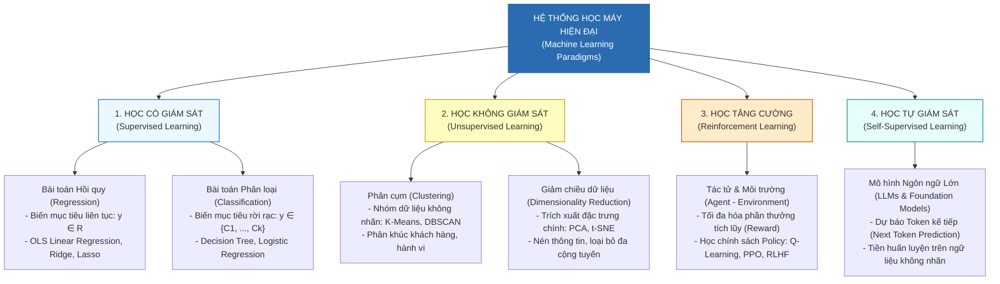
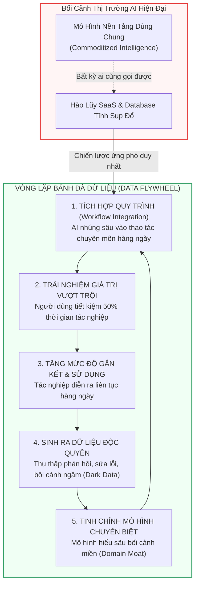

# 06. Toàn Cảnh Học Máy & Chiến Lược AI Doanh Nghiệp (ML Landscape & Enterprise Strategy)

> **Khóa học:** Global Consumer Intelligence (GCI World 202609)  
> **Đơn vị đào tạo:** Matsuo-Iwasawa Laboratory, Trường Sau đại học Kỹ thuật, Đại học Tokyo (The University of Tokyo)  
> **Tài liệu tham chiếu:** `prep4_slides.pdf` (Slide 19–31), `prep5_slides.pdf`, `lec1_slides.pdf` (Slide 10–34), `transcript_full.md`, `Lecture_01_Detailed_Notes.md`

---

## 1. Khung Lý Thuyết & Nền Tảng Khái Niệm

### 1.1 Hệ Thống Phân Loại Toàn Cảnh Học Máy (Machine Learning Taxonomy)
Học máy (Machine Learning — ML) là một nhánh cốt lõi của Trí tuệ Nhân tạo (AI), nghiên cứu các giải thuật cho phép hệ thống máy tính tự động cải thiện hiệu năng thực thi thông qua việc trích xuất tri thức từ dữ liệu thực nghiệm mà không cần phải lập trình cứng các quy tắc logic (rule-based).

Khung chương trình Đại học Tokyo phân cấp Học máy thành **bốn trụ cột phương pháp luận**:

```
                               ┌─────────────────────────────────────────────────────────┐
                               │           HỆ THỐNG HỌC MÁY HIỆN ĐẠI (ML TAXONOMY)      │
                               └────────────────────────────┬────────────────────────────┘
                                                            │
         ┌──────────────────────────┬───────────────────────┴───────────────┬──────────────────────────┐
         ▼                          ▼                                       ▼                          ▼
┌──────────────────┐      ┌────────────────────┐                  ┌───────────────────┐      ┌────────────────────┐
│   HỌC CÓ GIÁM    │      │   HỌC KHÔNG GIÁM   │                  │   HỌC TĂNG CƯỜNG  │      │  HỌC TỰ GIÁM SÁT   │
│       SÁT        │      │        SÁT         │                  │  (REINFORCEMENT)  │      │  (SELF-SUPERVISED) │
│   (SUPERVISED)   │      │   (UNSUPERVISED)   │                  └─────────┬─────────┘      └─────────┬──────────┘
└────────┬─────────┘      └─────────┬──────────┘                            │                            │
         │                          │                                       │                            │
    ┌────┴─────┐               ┌────┴─────┐                         ┌───────┴────────┐           ┌───────┴────────┐
    ▼          ▼               ▼          ▼                         ▼                ▼           ▼                ▼
Continuous  Discrete       Grouping   Dimension                 Agent-Env        Cumulative   Next Token     Foundation
(Hồi quy) (Phân loại)    (Phân cụm) (Giảm chiều)                 Feedback         Rewards     Prediction       Models
```

1. **Học Có Giám Sát (Supervised Learning)**: Dữ liệu huấn luyện bao gồm cặp đầu vào - đầu ra chuẩn $(\mathbf{x}_i, y_i)$. Nhiệm vụ: Tối thiểu hóa sai số giữa hàm dự đoán $\hat{y} = f(\mathbf{x})$ và nhãn thực tế $y$. Phân tách thành Hồi quy ($y \in \mathbb{R}$) và Phân loại ($y \in \{C_1, \dots, C_K\}$).
2. **Học Không Giám Sát (Unsupervised Learning)**: Dữ liệu huấn luyện chỉ có đầu vào $\mathbf{x}_i$, hoàn toàn không có nhãn chỉ dẫn $y$. Nhiệm vụ: Tự động khám phá quy luật, hình học phân phối và cấu trúc ẩn trong không gian dữ liệu (Phân cụm, Giảm chiều, Phát hiện dị thường).
3. **Học Tăng Cường (Reinforcement Learning — RL)**: Một tác tử (Agent) tương tác qua lại với một môi trường (Environment) động theo các bước thời gian $t$. Tác tử quan sát trạng thái $s_t$, thực thi hành động $a_t$, nhận về tín hiệu thưởng/phạt $r_t$ và trạng thái kế tiếp $s_{t+1}$. Nhiệm vụ: Tối đa hóa tổng phần thưởng tích lũy kỳ vọng dài hạn qua chính sách hành động tối ưu $\pi^*(a \mid s)$.
4. **Học Tự Giám Sát & Mô Hình Nền Tảng (Self-Supervised & Foundation Models)**: Tận dụng các tập dữ liệu phi cấu trúc khổng lồ (văn bản, hình ảnh, âm thanh) không nhãn, tự động trích xuất các nhãn giám sát nội tại từ chính cấu trúc của dữ liệu (ví dụ: che khuất một từ và dự đoán từ bị che, hoặc dự đoán token kế tiếp trong chuỗi văn bản).

---

### 1.2 Học Không Giám Sát — Phân Cụm Dữ Liệu Với K-Means (K-Means Clustering)

#### Mục Tiêu Toán Học
Cho tập dữ liệu gồm $n$ quan sát $\mathbf{X} = \{\mathbf{x}_1, \dots, \mathbf{x}_n\}$ với $\mathbf{x}_i \in \mathbb{R}^p$. Phân cụm $K$-Means phân chia $n$ mẫu này thành $K$ tập hợp con rời rạc $\mathcal{C} = \{C_1, C_2, \dots, C_K\}$ sao cho tổng bình phương khoảng cách từ mỗi điểm tới tâm cụm tương ứng (gọi là **Quán tính nội cụm — Within-Cluster Sum of Squares hay Inertia**) đạt giá trị cực tiểu:
$$\arg\min_{\mathcal{C}} \mathcal{J}(\mathcal{C}) = \arg\min_{\mathcal{C}} \sum_{k=1}^K \sum_{\mathbf{x} \in C_k} \|\mathbf{x} - \boldsymbol{\mu}_k\|_2^2$$
Trong đó $\boldsymbol{\mu}_k = \frac{1}{|C_k|} \sum_{\mathbf{x} \in C_k} \mathbf{x}$ là trọng tâm (Centroid) của cụm $C_k$.

#### Giải Thuật Lặp 4 Bước (Lloyd's Algorithm)
1. **Khởi tạo (Initialization)**: Chọn ngẫu nhiên $K$ tọa độ làm các tâm cụm ban đầu $\{\boldsymbol{\mu}_1, \dots, \boldsymbol{\mu}_K\}$ trong không gian đặc trưng (hoặc dùng kỹ thuật tối ưu hóa khởi tạo `k-means++` để đẩy các tâm cụm ra xa nhau nhất có thể).
2. **Bước Gán (Assignment Step)**: Duyệt qua từng quan sát $\mathbf{x}_i$, gán nó vào cụm có tâm gần nhất theo khoảng cách Euclidean:
   $$c_i = \arg\min_{k \in \{1, \dots, K\}} \|\mathbf{x}_i - \boldsymbol{\mu}_k\|_2$$
3. **Bước Cập Nhật (Update Step)**: Tính toán lại tọa độ tâm cụm $\boldsymbol{\mu}_k$ bằng cách lấy trung bình cộng tọa độ của toàn bộ các điểm vừa được phân về cụm đó:
   $$\boldsymbol{\mu}_k = \frac{1}{|C_k|} \sum_{i: c_i = k} \mathbf{x}_i$$
4. **Hội Tụ (Convergence Check)**: Lặp lại Bước 2 và Bước 3 cho đến khi sự dịch chuyển của các tâm cụm nhỏ hơn một ngưỡng dung sai $\epsilon$ định trước, hoặc các phép gán cụm $c_i$ không còn thay đổi.

#### Xác Định Số Lượng Cụm Tối Ưu: Phương Pháp Điểm Uốn (Elbow Method)
- Khi tăng dần số cụm $K$ từ 1 đến $n$, giá trị Inertia $\mathcal{J}$ sẽ giảm đơn điệu (khi $K = n$, $\mathcal{J} = 0$ vì mỗi điểm là một tâm cụm).
- Vẽ đồ thị biểu diễn Inertia theo $K$. Điểm mà tại đó tốc độ suy giảm của Inertia chậm lại rõ rệt (tạo thành một "khuỷu tay" — elbow) được coi là số cụm $K$ cân bằng tối ưu giữa tính cô đọng và độ phức tạp.

---

### 1.3 Học Không Giám Sát — Giảm Chiều Dữ Liệu Với PCA (Principal Component Analysis)

#### Động Lực & Vấn Đề Lời Nguyền Số Chiều (Curse of Dimensionality)
Khi số lượng đặc trưng $p$ quá lớn:
- Không gian trở nên thưa thớt, khoảng cách Euclidean giữa các điểm bị bão hòa.
- Xuất hiện hiện tượng đa cộng tuyến (nhiều đặc trưng mang thông tin dư thừa hoặc trùng lặp).
- Chi phí tính toán bùng nổ và không thể vẽ đồ thị trực quan hóa dữ liệu (vượt quá 3 chiều).

#### Bản Chất Hình Học & Tối Ưu Hóa Của PCA
PCA là phương pháp biến đổi tuyến tính trực giao, chiếu dữ liệu từ không gian $p$-chiều ban đầu sang một hệ trục tọa độ mới gồm các **Thành Phần Chính (Principal Components)** sao cho:
1. Trục thứ nhất (First Principal Component $\mathbf{u}_1$) hướng theo phương có **phương sai biến thiên lớn nhất** của dữ liệu.
2. Trục thứ hai ($\mathbf{u}_2$) trực giao hoàn toàn với trục thứ nhất ($\mathbf{u}_1^T \mathbf{u}_2 = 0$) và nắm giữ phương sai lớn thứ nhì.
3. Toàn bộ các thành phần chính mới đều không có tương quan tuyến tính với nhau.

#### Nền Tảng Đại Số Tuyến Tính
Giả sử ma trận đặc trưng $\mathbf{X} \in \mathbb{R}^{n \times p}$ đã được chuẩn hóa về kỳ vọng bằng 0.
- Ma trận hiệp phương sai mẫu (Covariance Matrix) $\boldsymbol{\Sigma} \in \mathbb{R}^{p \times p}$:
  $$\boldsymbol{\Sigma} = \frac{1}{n} \mathbf{X}^T \mathbf{X}$$
- Phương sai của dữ liệu khi chiếu lên véc-tơ đơn vị $\mathbf{u}$ ($\|\mathbf{u}\|_2 = 1$):
  $$\text{Var}(\mathbf{X}\mathbf{u}) = \mathbf{u}^T \boldsymbol{\Sigma} \mathbf{u}$$
- Tối đa hóa phương sai bằng phương pháp Nhân tử Lagrange (Lagrange Multipliers):
  $$\mathcal{L}(\mathbf{u}, \lambda) = \mathbf{u}^T \boldsymbol{\Sigma} \mathbf{u} - \lambda (\mathbf{u}^T \mathbf{u} - 1)$$
  Triệt tiêu đạo hàm:
  $$\nabla_{\mathbf{u}} \mathcal{L} = 2\boldsymbol{\Sigma} \mathbf{u} - 2\lambda \mathbf{u} = \mathbf{0} \iff \boldsymbol{\Sigma} \mathbf{u} = \lambda \mathbf{u}$$

**Kết luận then chốt**: Các trục thành phần chính chính là các **Vectơ riêng (Eigenvectors)** của ma trận hiệp phương sai $\boldsymbol{\Sigma}$, và phương sai dữ liệu dọc theo trục đó chính là **Trị riêng (Eigenvalue)** $\lambda$ tương ứng!

#### Tỷ Lệ Phương Sai Được Giải Thích (Explained Variance Ratio)
Sắp xếp các trị riêng theo thứ tự giảm dần: $\lambda_1 \ge \lambda_2 \ge \dots \ge \lambda_p \ge 0$.
Tỷ lệ phần trăm thông tin (phương sai) mà thành phần chính thứ $i$ giải thích được tính bởi:
$$\text{EVR}_i = \frac{\lambda_i}{\sum_{j=1}^p \lambda_j}$$
Ta có thể chọn số thành phần $d \ll p$ sao cho tổng phương sai tích lũy vượt qua một ngưỡng mong muốn (ví dụ: $\sum_{i=1}^d \text{EVR}_i \ge 85\%$).

---

### 1.4 Phân Tích Chuỗi Thời Gian & Hàm Tự Tương Quan (Time Series & Autocorrelation)

Dữ liệu chuỗi thời gian (Time Series) là chuỗi các quan sát được ghi nhận theo thứ tự thời gian tuần tự $\{y_1, y_2, \dots, y_T\}$. Khác với dữ liệu bảng độc lập phân phối đồng nhất (I.I.D), chuỗi thời gian mang tính phụ thuộc thời gian mạnh mẽ.

#### Hàm Tự Tương Quan (Autocorrelation Function — ACF)
Hệ số tự tương quan bậc $k$ ($r_k$) đo lường mức độ tương quan tuyến tính giữa chuỗi thời gian hiện tại $y_t$ và chuỗi giá trị trễ của chính nó ở $k$ bước thời gian trước đó $y_{t-k}$:
$$r_k = \frac{\sum_{t=k+1}^T (y_t - \bar{y})(y_{t-k} - \bar{y})}{\sum_{t=1}^T (y_t - \bar{y})^2}$$
Trong đó:
- $r_k \in [-1, 1]$.
- Nếu $r_k \approx 1$ tại $k = 7$ (với dữ liệu ngày), chuỗi dữ liệu có tính chu kỳ tuần (Weekly Seasonality).
- Nếu $r_k$ giảm chậm dần về 0 khi độ trễ $k$ tăng lên, chuỗi có tính tự hồi quy (Autoregressive persistence) hoặc có xu hướng dài hạn (Trend).

---

### 1.5 Cơ Chế Mô Hình Ngôn Ngữ Lớn & Học Tự Giám Sát (Foundation Models / LLMs)

#### Bài Toán Dự Đoán Token Kế Tiếp (Next Token Prediction)
Mô hình Ngôn ngữ Lớn (Large Language Model — LLM) dạng sinh văn bản (Causal / Autoregressive LM) tiếp cận bài toán học tự giám sát bằng cách dự đoán xác suất xuất hiện của từ (token) tiếp theo $w_t$ khi đã biết toàn bộ ngữ cảnh các từ đứng trước $w_{<t} = (w_1, w_2, \dots, w_{t-1})$:
$$\max_\theta \sum_{t=1}^T \log P_\theta(w_t \mid w_1, w_2, \dots, w_{t-1})$$

Mạng Nơ-ron biến đổi ngữ cảnh thành véc-tơ biểu diễn ẩn và đưa qua lớp Softmax để tính phân phối xác suất trên toàn bộ từ điển $\mathcal{V}$:
$$P(w_t = v \mid w_{<t}) = \frac{\exp(z_v)}{\sum_{u \in \mathcal{V}} \exp(z_u)}$$

#### Quá Trình Huấn Luyện Ba Giai Đoạn (Modern LLM Pipeline)
1. **Tiền huấn luyện Tự Giám Sát (Self-Supervised Pre-training)**: Nuốt hàng nghìn tỷ token văn bản từ internet để học mô hình thế giới, ngữ pháp và tri thức nền tảng.
2. **Tinh chỉnh Chỉ dẫn (Supervised Fine-Tuning — SFT)**: Huấn luyện trên các cặp câu hỏi - câu trả lời chất lượng cao để mô hình hiểu cách tuân thủ mệnh lệnh của con người.
3. **Học Tăng Cường Từ Phản Hồi Con Người (RLHF / DPO)**: Áp dụng thuật toán học tăng cường để căn chỉnh (Alignment) sao cho câu trả lời an toàn, hữu ích và trung thực (Helpful, Honest, Harmless).

---

### 1.6 Khung Chiến Lược AI Doanh Nghiệp & Hào Lũy Phòng Thủ (Enterprise AI Strategy & Moats)

Giáo trình GCI World (đặc biệt trong Buổi 1 do GS. Yutaka Matsuo giảng dạy) nhấn mạnh rằng giá trị thực sự của Khoa học Dữ liệu và AI không nằm ở bản thân dòng code hay công thức, mà nằm ở **năng lực chuyển hóa thành giá trị kinh doanh cụ thể**.

#### 1. Thuyết "Sự Sụp Đổ Của Hào Lũy SaaS Truyền Thống"
- Trước thời kỳ Foundation Models, các công ty phần mềm tạo dựng lợi thế cạnh tranh ("hào lũy" — Moat) nhờ việc tích trữ một cơ sở dữ liệu lớn hoặc sở hữu một tính năng phần mềm đóng kín.
- Khi các mô hình AI nền tảng trở thành hạ tầng dùng chung (Commoditized Intelligence), bất kỳ ai cũng có thể gọi API để tạo ra tính năng tương đương chỉ sau vài tuần. Một cơ sở dữ liệu tĩnh không còn là hàng rào bảo vệ an toàn.

#### 2. Tích Hợp Quy Trình Tác Nghiệp (Workflow Integration) & Bánh Đà Dữ Liệu (Data Flywheel)
Lợi thế cạnh tranh phòng thủ bền vững duy nhất trong kỷ nguyên AI là: **Nhúng sâu AI vào quy trình tác nghiệp vận hành hàng ngày của khách hàng**.

```
                ┌────────────────────────────────────────────────────────┐
                │             BÁNH ĐÀ DỮ LIỆU (DATA FLYWHEEL)            │
                └───────────────────────────┬────────────────────────────┘
                                            │
               ┌────────────────────────────┴───────────────────────────┐
               ▼                                                        ▼
    ┌────────────────────┐                                   ┌────────────────────┐
    │  TÍCH HỢP QUY TRÌNH │                                   │  TRẢI NGHIỆM VƯỢT  │
    │  (Workflow Embed)  │                                   │       TRỘI         │
    │  AI hỗ trợ người   │ ────────── Đem lại ─────────────> │  Tiết kiệm thời    │
    │  dùng tác nghiệp   │                                   │  gian, độ chuẩn xác│
    └─────────▲──────────┘                                   └─────────┬──────────┘
              │                                                        │
              │                                                    Tạo động lực
          Huấn luyện                                                 sử dụng
          tối ưu hóa                                                thường xuyên
              │                                                        │
              │                                                        ▼
    ┌─────────┴──────────┐                                   ┌────────────────────┐
    │  MÔ HÌNH CHUYÊN BIỆT│                                   │  DỮ LIỆU ĐỘC QUYỀN │
    │   (Refined Model)  │ <────────── Sinh ra ───────────── │ (Proprietary Data) │
    │  Chính xác hơn,    │                                   │ Tương tác, chỉnh   │
    │  không thể copy    │                                   │ sửa, bối cảnh ngầm │
    └────────────────────┘                                   └────────────────────┘
```

- **Cơ chế**: Khi AI được nhúng vào quy trình (ví dụ: công cụ soạn thảo án văn bản của luật sư, hệ thống chẩn đoán của bác sĩ), mỗi lần người dùng chấp nhận, từ chối hoặc chỉnh sửa gợi ý của AI, hệ thống thu thập được **Dữ liệu tương tác ngầm độc quyền (Proprietary Contextual Feedback)** mà đối thủ bên ngoài không bao giờ có được.
- Dữ liệu này tiếp tục quay lại tinh chỉnh mô hình, biến mô hình thành chuyên gia không thể thay thế cho tác vụ đó.

#### 3. Bẫy Dữ Liệu Tối (Dark Data) & Định Khung Bài Toán (Problem Framing)
- **Dark Data**: Thuật ngữ của nhà thống kê David J. Hand. Toàn bộ dữ liệu nằm trong cơ sở dữ liệu của doanh nghiệp chỉ là "dữ liệu nhìn thấy". Doanh nghiệp thường bỏ quên dữ liệu tối: các khách hàng đã rời bỏ mà không hề khiếu nại, những người ghé thăm website nhưng không mua hàng, những phân khúc thị trường chưa từng tiếp cận.
- **Quy tắc 60–70%**: Một Chuyên gia Dữ liệu xuất sắc tại Đại học Tokyo chỉ dành 30–40% thời gian cho việc viết code Python và chỉnh siêu tham số mô hình; **60–70% thời gian và trí tuệ được đầu tư vào:**
  1. Thấu hiểu ngữ cảnh kinh doanh (Domain Knowledge).
  2. Định hình bài toán kinh doanh thành câu hỏi định lượng có thể đo lường (KGI/KPI alignment).
  3. Đàm phán, thuyết phục các phòng ban thực thi quyết định dựa trên dữ liệu.

#### 4. Nghiên Cứu Điển Hình: Vòng Lặp Phản Hồi Tại Chuỗi Cửa Hàng Seven-Eleven Japan
Giáo sư Matsuo đưa ra trường hợp kinh điển của Seven-Eleven Nhật Bản trong việc quản lý từng mặt hàng độc lập (Tanpin Kanri — 単品管理):
- **Quan sát (Observe)**: Máy tính POS ghi nhận doanh số từng giờ, kết hợp dự báo thời tiết cục bộ (nhiệt độ tăng 3 độ C vào buổi trưa).
- **Giả thuyết (Hypothesize)**: Nhu cầu mì lạnh (Somen/Hiyashi Chuka) sẽ tăng gấp đôi, trong khi đồ nóng (Oden) sẽ ế ẩm.
- **Thực nghiệm (Experiment)**: Chủ cửa hàng ra quyết định nhập hàng tăng số lượng mì lạnh và giảm đồ nóng.
- **Phân tích (Analyze)**: Cuối ngày đối chiếu doanh thu thực tế, lượng hàng hủy (waste) và hàng bán hết sạch (opportunity loss).
- **Quyết định (Decide)**: Hiệu chỉnh giả thuyết cho ngày hôm sau.
*Đây chính là chu trình khoa học thu nhỏ vận hành liên tục hàng ngày trước khi kỷ nguyên AI ra đời!*

---

## 2. Mã Nguồn Python & Kỹ Thuật Thực Thi Cốt Lõi

Toàn bộ các đoạn mã nguồn dưới đây minh họa chuẩn tắc các thuật toán Học không giám sát, Phân tích chuỗi thời gian và Mô phỏng phân phối ngôn ngữ.

### 2.1 Phân Cụm K-Means, Chuẩn Hóa Đặc Trưng & Phương Pháp Khuỷu Tay (Elbow Method)

```python
# ==============================================================================
# Minh họa K-Means Clustering & Elbow Method theo chuẩn mực Scikit-Learn
# ==============================================================================
import numpy as np
import pandas as pd
import matplotlib.pyplot as plt
from sklearn.cluster import KMeans
from sklearn.preprocessing import StandardScaler

# 1. Tạo tập dữ liệu mô phỏng hành vi khách hàng (Tuổi vs Điểm chi tiêu)
np.random.seed(42)
cluster_1 = np.random.randn(100, 2) * [5, 10] + [25, 80]  # Khách trẻ, chi tiêu cao
cluster_2 = np.random.randn(100, 2) * [8, 8] + [50, 20]   # Khách trung niên, chi tiêu thấp
cluster_3 = np.random.randn(100, 2) * [6, 12] + [40, 50]  # Khách trung niên, chi tiêu trung bình

X_raw = np.vstack([cluster_1, cluster_2, cluster_3])

# 2. BẮT BUỘC: Chuẩn hóa dữ liệu bằng StandardScaler trước khi chạy K-Means
# Tránh trường hợp đặc trưng có biên độ lớn (Điểm chi tiêu) lấn át biến Tuổi
scaler = StandardScaler()
X_scaled = scaler.fit_transform(X_raw)

# 3. Quét qua các giá trị K từ 1 đến 10 để tính toán quán tính nội cụm (Inertia)
k_range = range(1, 10)
inertias = []

for k in k_range:
    # n_init='auto' hoặc 10: Chạy 10 lần khởi tạo k-means++ để tìm nghiệm cực tiểu toàn cục
    kmeans = KMeans(n_clusters=k, init='k-means++', n_init=10, random_state=42)
    kmeans.fit(X_scaled)
    inertias.append(kmeans.inertia_)

# 4. Trực quan hóa đường cong khuỷu tay (Elbow Plot)
plt.figure(figsize=(8, 4), dpi=300)
plt.plot(k_range, inertias, marker='o', linestyle='--', color='#2b6cb0', linewidth=2)
plt.title("Xác định số cụm K tối ưu bằng Phương Pháp Khuỷu Tay (Elbow Method)", fontsize=12)
plt.xlabel("Số lượng cụm K", fontsize=11)
plt.ylabel("Quán tính nội cụm (Inertia / WCSS)", fontsize=11)
plt.grid(True, linestyle=':')
plt.tight_layout()
plt.show()

# 5. Huấn luyện mô hình với K=3 tối ưu và gắn nhãn cụm
optimal_k = 3
kmeans_final = KMeans(n_clusters=optimal_k, init='k-means++', n_init=10, random_state=42)
cluster_labels = kmeans_final.fit_predict(X_scaled)

print(f"=== KẾT QUẢ PHÂN CỤM K-MEANS (K={optimal_k}) ===")
print("Tọa độ các tâm cụm (trên thang đo chuẩn hóa):")
print(kmeans_final.cluster_centers_)
print(f"Quán tính tối thiểu: {kmeans_final.inertia_:.2f}")
```

---

### 2.2 Giảm Chiều Dữ Liệu PCA & Phân Tích Phương Sai Tích Lũy (Explained Variance Ratio)

```python
# ==============================================================================
# Minh họa PCA: Giảm chiều & Biểu đồ Scree Plot phương sai tích lũy
# ==============================================================================
import numpy as np
import matplotlib.pyplot as plt
from sklearn.decomposition import PCA
from sklearn.preprocessing import StandardScaler

# 1. Tạo tập dữ liệu 5 chiều với mức độ tương quan cao
np.random.seed(42)
n_samples = 200
x1 = np.random.randn(n_samples)
x2 = 0.8 * x1 + 0.2 * np.random.randn(n_samples)      # Tương quan mạnh với x1
x3 = 0.6 * x1 - 0.4 * x2 + 0.1 * np.random.randn(n_samples)
x4 = np.random.randn(n_samples) * 2.0                 # Đặc trưng độc lập phương sai lớn
x5 = -0.5 * x4 + 0.3 * np.random.randn(n_samples)

X_5d = np.column_stack([x1, x2, x3, x4, x5])

# 2. Chuẩn hóa ma trận đặc trưng về mean=0, std=1
X_scaled = StandardScaler().fit_transform(X_5d)

# 3. Khởi tạo PCA giữ lại toàn bộ 5 thành phần để khảo sát phổ trị riêng
pca = PCA(n_components=5)
X_pca = pca.fit_transform(X_scaled)

# 4. Trích xuất tỷ lệ phương sai được giải thích bởi từng thành phần
evr = pca.explained_variance_ratio_
cum_evr = np.cumsum(evr)

print("=== PHÂN TÍCH THÀNH PHẦN CHÍNH (PCA) ===")
for idx, (var, cum_var) in enumerate(zip(evr, cum_evr), 1):
    print(f"PC{idx}: Tỷ lệ phương sai = {var*100:.2f}% | Phương sai tích lũy = {cum_var*100:.2f}%")

# 5. Vẽ đồ thị Scree Plot (Phương sai đơn lẻ và Tích lũy)
fig, ax1 = plt.subplots(figsize=(8, 4), dpi=300)

ax1.bar(range(1, 6), evr * 100, alpha=0.7, color='#3182ce', label='Phương sai từng thành phần (%))')
ax1.set_xlabel('Thành phần chính (Principal Component)')
ax1.set_ylabel('Phương sai giải thích (%)', color='#3182ce')
ax1.set_ylim(0, 100)

ax2 = ax1.twinx()
ax2.plot(range(1, 6), cum_evr * 100, color='#e53e3e', marker='D', linewidth=2, label='Tích lũy (%)')
ax2.axhline(y=80, color='gray', linestyle='--', alpha=0.7, label='Ngưỡng chuẩn 80%')
ax2.set_ylabel('Phương sai tích lũy (%)', color='#e53e3e')
ax2.set_ylim(0, 105)

plt.title("Đồ thị Scree Plot: Tỷ lệ phương sai giải thích của các thành phần PCA", fontsize=11)
plt.tight_layout()
plt.show()
```

---

### 2.3 Đo Lường Tính Phụ Thuộc Chuỗi Thời Gian Bằng Hàm Tự Tương Quan (ACF)

```python
# ==============================================================================
# Tính toán hàm tự tương quan Autocorrelation (ACF) thuần túy bằng NumPy/Pandas
# ==============================================================================
import numpy as np
import pandas as pd
import matplotlib.pyplot as plt

# 1. Tạo chuỗi thời gian nhân tạo gồm xu hướng tuyến tính + tính mùa vụ tuần (lag 7)
np.random.seed(42)
t = np.arange(120)
seasonal_cycle = 10 * np.sin(2 * np.pi * t / 7)      # Chu kỳ lặp lại mỗi 7 ngày
noise = np.random.randn(120) * 2
series = pd.Series(seasonal_cycle + noise)

# 2. Lập trình hàm tính hệ số tự tương quan r_k cho độ trễ k
def compute_autocorrelation(ts: pd.Series, max_lag: int = 20):
    """Tính toán hệ số tương quan r_k từ độ trễ k=0 đến k=max_lag."""
    n = len(ts)
    y_mean = ts.mean()
    var_denominator = np.sum((ts - y_mean) ** 2)
    
    acf_values = []
    for k in range(max_lag + 1):
        if k == 0:
            acf_values.append(1.0)
            continue
        # Tử số: Hiệp phương sai trễ k
        cov_numerator = np.sum((ts.iloc[k:].values - y_mean) * (ts.iloc[:-k].values - y_mean))
        r_k = cov_numerator / var_denominator
        acf_values.append(r_k)
        
    return np.array(acf_values)

# 3. Tính toán ACF lên tới 20 độ trễ
lags = 20
acf = compute_autocorrelation(series, max_lag=lags)

print("=== HỆ SỐ TỰ TƯƠNG QUAN (ACF) ===")
print(f"Lag 7  (Chu kỳ tuần): r_7  = {acf[7]:.4f} (Đỉnh tương quan dương mạnh)")
print(f"Lag 14 (Chu kỳ 2 tuần): r_14 = {acf[14]:.4f}")

# 4. Vẽ đồ thị Correlogram
plt.figure(figsize=(9, 4), dpi=300)
plt.stem(range(lags + 1), acf, basefmt=" ")
plt.axhline(0, color='black', linewidth=0.8)
plt.axhline(1.96 / np.sqrt(len(series)), color='red', linestyle='--', alpha=0.5, label='Khoảng tin cậy 95%')
plt.axhline(-1.96 / np.sqrt(len(series)), color='red', linestyle='--', alpha=0.5)
plt.title("Biểu đồ Tự Tương Quan (Correlogram) — Phát hiện tính mùa vụ chu kỳ 7 ngày", fontsize=11)
plt.xlabel("Độ trễ thời gian (Lag k)", fontsize=10)
plt.ylabel("Hệ số tự tương quan r_k", fontsize=10)
plt.legend()
plt.tight_layout()
plt.show()
```

---

### 2.4 Mô Phỏng Phân Phối Sinh Token Kế Tiếp (Next Token Prediction) Của LLM

```python
# ==============================================================================
# Mô phỏng hàm phân phối xác suất sinh Token kế tiếp trong Causal Language Models
# ==============================================================================
import numpy as np

# 1. Từ điển giả lập gồm 6 token khả dĩ
vocab = ["machine", "learning", "model", "is", "very", "fast"]

# 2. Giả lập điểm số chưa chuẩn hóa (Logits) do mạng Nơ-ron Transformer tính toán
# ứng với ngữ cảnh câu đầu vào: "The supervised deep ..."
logits = np.array([2.1, 4.8, 3.2, 0.5, -1.2, 0.1])

# 3. Hàm kích hoạt Softmax có tham số nhiệt độ (Temperature)
def softmax_with_temperature(z: np.ndarray, temperature: float = 1.0) -> np.ndarray:
    """Chuyển đổi logits thành phân phối xác suất có điều chỉnh nhiệt độ T."""
    scaled_z = z / temperature
    # Trừ giá trị cực đại để chống tràn số học (Numerical stability)
    exp_z = np.exp(scaled_z - np.max(scaled_z))
    return exp_z / np.sum(exp_z)

# 4. So sánh phân phối khi điều chỉnh nhiệt độ Temperature
prob_standard = softmax_with_temperature(logits, temperature=1.0)
prob_creative = softmax_with_temperature(logits, temperature=2.0)  # T cao: Sáng tạo, phân phối phẳng hơn
prob_focused  = softmax_with_temperature(logits, temperature=0.5)  # T thấp: Tự tin, tập trung vào token cao nhất

print("=== MÔ PHỎNG DỰ BÁO TOKEN KẾ TIẾP (NEXT TOKEN PREDICTION) ===")
print(f"{'Token':<12} | {'Logit':<6} | {'T=1.0 (Chuẩn)':<14} | {'T=0.5 (Tập trung)':<18} | {'T=2.0 (Sáng tạo)'}")
print("-" * 70)
for token, logit, p1, p2, p3 in zip(vocab, logits, prob_standard, prob_focused, prob_creative):
    print(f"{token:<12} | {logit:<6.1f} | {p1*100:<13.2f}% | {p2*100:<17.2f}% | {p3*100:.2f}%")

# Token có logit cao nhất ('learning') được chọn với xác suất áp đảo!
```

---

## 3. Sơ Đồ Tư Duy & Quy Trình Trực Quan (Mermaid.js)

### 3.1 Bản Đồ Tư Duy Toàn Cảnh Các Trụ Cột Học Máy (ML Taxonomy Mindmap)
Sơ đồ hệ thống hóa toàn bộ các phân nhánh lớn của Học máy hiện đại, thể hiện rõ mục tiêu bài toán và thuật toán tiêu biểu:



---

### 3.2 Vòng Lặp Bánh Đà Dữ Liệu & Hào Lũy Tác Nghiệp (Enterprise AI Strategy Loop)
Sơ đồ minh họa cơ chế kiến tạo lợi thế cạnh tranh bền vững thông qua việc nhúng AI vào chu trình vận hành thực tế:



---

## 4. Hệ Thống Thẻ Ghi Nhớ Chủ Động (Active Recall Flashcards)

> Phương pháp ôn tập chủ động: Hãy đọc câu hỏi, tự diễn giải câu trả lời trong tư duy trước khi mở phần lời giải.

### Thẻ 1: Khái Niệm Inertia Và Phương Pháp Khuỷu Tay (Elbow Method) Trong K-Means
- **Hỏi (Q):** Đại lượng Quán tính nội cụm (Inertia / WCSS) trong K-Means được định nghĩa như thế nào? Phương pháp khuỷu tay xác định số cụm tối ưu ra sao?
- **Đáp (A):**
  - Inertia là tổng bình phương khoảng cách Euclidean từ mỗi điểm dữ liệu $\mathbf{x}_i$ tới tâm cụm $\boldsymbol{\mu}_k$ mà nó được phân về: $\text{Inertia} = \sum_{k=1}^K \sum_{\mathbf{x} \in C_k} \|\mathbf{x} - \boldsymbol{\mu}_k\|^2$.
  - Khi tăng $K$, Inertia luôn giảm. Phương pháp khuỷu tay (Elbow method) vẽ đồ thị Inertia theo $K$. Điểm "khuỷu tay" là giá trị $K$ mà từ đó trở đi, việc bổ sung thêm cụm chỉ làm giảm Inertia rất ít (lợi ích cận biên suy giảm), đại diện cho số lượng cụm tự nhiên tối ưu của dữ liệu.

---

### Thẻ 2: Mối Liên Hệ Giữa Vectơ Riêng (Eigenvectors) Và Trục Thành Phần Chính Trong PCA
- **Hỏi (Q):** Tại sao các trục thành phần chính trong phân tích PCA lại chính là các Vectơ riêng của ma trận hiệp phương sai? Trị riêng (Eigenvalue) mang ý nghĩa gì?
- **Đáp (A):**
  - Khi tối đa hóa phương sai của dữ liệu được chiếu $\mathbf{u}^T \boldsymbol{\Sigma} \mathbf{u}$ dưới ràng buộc chuẩn hóa $\|\mathbf{u}\| = 1$ bằng nhân tử Lagrange, ta thu được phương trình đặc trưng: $\boldsymbol{\Sigma} \mathbf{u} = \lambda \mathbf{u}$.
  - Điều này chứng minh trục chiếu giữ lại phương sai lớn nhất bắt buộc phải là một Vectơ riêng $\mathbf{u}$ của ma trận hiệp phương sai $\boldsymbol{\Sigma}$.
  - Trị riêng $\lambda$ tương ứng đo lường chính xác lượng phương sai mà dữ liệu dao động dọc theo trục thành phần chính đó.

---

### Thẻ 3: Tại Sao Cơ Sở Dữ Liệu Tĩnh Không Còn Là Hào Lũy Trong Kỷ Nguyên AI?
- **Hỏi (Q):** Theo phân tích chiến lược của GS. Matsuo (Đại học Tokyo), tại sao việc sở hữu một cơ sở dữ liệu tĩnh (Static Database) không còn tạo nên lợi thế cạnh tranh bền vững trong thời đại Mô hình Nền tảng (Foundation Models)?
- **Đáp (A):**
  - Vì các mô hình AI nền tảng ngày nay đã được tiền huấn luyện trên quy mô tri thức toàn nhân loại, có khả năng suy luận và tự tạo ra tri thức tổng hợp cao.
  - Nếu dữ liệu chỉ là bảng tĩnh không phát sinh thêm, đối thủ có thể tổng hợp dữ liệu nhân tạo (synthetic data) hoặc sao chép nhanh chóng.
  - Lợi thế cạnh tranh thực sự đã chuyển dịch sang **Tích hợp quy trình tác nghiệp (Workflow Integration)**: AI nhúng sâu vào chu trình làm việc để liên tục thu thập luồng dữ liệu tương tác phản hồi động (dynamic proprietary data flywheel) mà đối thủ không thể tiếp cận từ bên ngoài.

---

### Thẻ 4: Bản Chất Toán Học Của Bài Toán Next Token Prediction Trong LLM
- **Hỏi (Q):** Mô hình ngôn ngữ tự hồi quy (Autoregressive LLM) học bằng cách nào thông qua bài toán Dự đoán Token Kế tiếp (Next Token Prediction)?
- **Đáp (A):**
  - LLM tối đa hóa log-xác suất có điều kiện của token thực tế kế tiếp $w_t$ dựa trên chuỗi ngữ cảnh các token đã xuất hiện trước đó: $\max_\theta \sum_{t=1}^T \log P_\theta(w_t \mid w_{<t})$.
  - Đây là hình thức **Học tự giám sát (Self-Supervised Learning)** hoàn hảo: Mô hình tự lấy văn bản tự nhiên, dùng các từ đứng trước làm đầu vào (Input) và từ kế tiếp làm nhãn đích (Label), giúp tận dụng hàng ngàn tỷ từ ngữ mà không tốn bất kỳ chi phí dán nhãn thủ công nào.

---

### Thẻ 5: Tỷ Lệ Cơ Cấu Năng Lực Chuẩn Của Data Scientist Theo Đại Học Tokyo
- **Hỏi (Q):** Tại sao trong giáo trình GCI World, Đại học Tokyo nhấn mạnh 60–70% năng lực thành công của một Data Scientist nằm ở kỹ năng kinh doanh và định hình bài toán chứ không phải viết code?
- **Đáp (A):**
  - Viết code và gọi thư viện máy học (30–40%) là kỹ năng thừa hành có thể tiêu chuẩn hóa và tự động hóa cao.
  - Trong thực tế doanh nghiệp, bài toán hiếm khi được định nghĩa sẵn ở dạng dữ liệu sạch. Thách thức cốt lõi (60–70%) là:
    1. Phát hiện bài toán kinh doanh thật sự có giá trị cao.
    2. Nhận diện các bẫy dữ liệu ngầm (Dark Data, Selection Bias).
    3. Chuyển hóa mục tiêu trừu tượng thành các chỉ số KPI/KGI định lượng.
    4. Thuyết phục các nhà quản lý và nhân viên tác nghiệp chịu thay đổi hành vi dựa trên kết quả phân tích.

---

### Thẻ 6: Ý Nghĩa Của Hệ Số Tự Tương Quan ACF Trong Chuỗi Thời Gian
- **Hỏi (Q):** Nếu biểu đồ ACF của dữ liệu bán lẻ hiển thị đỉnh tương quan dương rất cao tại độ trễ $k = 7, 14, 21$, điều này phản ánh bản chất gì của chuỗi thời gian?
- **Đáp (A):**
  - Phản ánh hiện tượng **Tính mùa vụ theo chu kỳ tuần (Weekly Seasonality)**.
  - Doanh số vào một ngày cụ thể (ví dụ: Thứ Bảy) có mối liên hệ mật thiết và lặp lại hành vi tiêu dùng tương tự như các ngày Thứ Bảy của 1 tuần, 2 tuần, 3 tuần trước đó. Đây là căn cứ quyết định để đưa các đặc trưng độ trễ (Lag Features) vào mô hình dự báo chuỗi thời gian.

---

## 5. Các Bẫy Tri Thức & Trường Hợp Biên (Edge Cases)

### 5.1 Bẫy Quên Chuẩn Hóa Thang Đo Trước Khi Chạy K-Means & PCA
- **Cơ chế bẫy**: Áp dụng K-Means hoặc PCA trực tiếp trên ma trận dữ liệu có biên độ chênh lệch lớn (ví dụ: `Tuổi` từ 20 đến 60, nhưng `Thu nhập` từ 10,000,000 đến 100,000,000).
- **Hậu quả**:
  - Với K-Means: Khoảng cách Euclidean bị chi phối 99.99% bởi biến `Thu nhập`, biến `Tuổi` hoàn toàn mất tác dụng phân cụm.
  - Với PCA: Trục thành phần chính thứ nhất PC1 sẽ đơn thuần chỉ là hình chiếu của biến `Thu nhập` vì phương sai thô của nó áp đảo toàn bộ các biến khác.
- **Phòng tránh**: Bắt buộc chuẩn hóa bằng `StandardScaler` trước khi đưa vào K-Means hoặc PCA.

---

### 5.2 Bẫy PCA Không Xử Lý Được Mối Quan Hệ Phi Tuyến (Non-Linear Structures)
- **Cơ chế bẫy**: Dữ liệu có cấu trúc phi tuyến phức tạp (ví dụ: phân phối dạng hai vòng tròn đồng tâm, hoặc hình dải xoắn Swiss Roll).
- **Hậu quả**: PCA chỉ thực hiện các phép quay và kéo dãn tuyến tính trực giao, do đó sẽ chiếu đè các điểm thuộc các vòng tròn khác nhau lên cùng một mặt phẳng, phá hủy hoàn toàn cấu trúc hình học của cụm.
- **Giải pháp**: Với dữ liệu phi tuyến, sử dụng Kernel PCA, hoặc các phương pháp giảm chiều biểu diễn đa tạp phi tuyến như t-SNE hoặc UMAP.

---

### 5.3 Bẫy Điểm Cực Tiểu Cục Bộ (Local Minima) Trong K-Means
- **Cơ chế bẫy**: Thuật toán K-Means truyền thống khởi tạo ngẫu nhiên các tâm cụm ban đầu. Nếu chẳng may hai tâm cụm rơi sát vào cùng một cụm thực tế, thuật toán sẽ bị mắc kẹt tại điểm cực tiểu địa phương, phân tách sai lệch toàn bộ cụm còn lại.
- **Giải pháp**: Luôn thiết lập `init='k-means++'` (thuật toán xác suất chọn các tâm khởi đầu cách xa nhau) và tham số `n_init=10` (chạy độc lập 10 lần với các hạt giống khác nhau và chọn nghiệm có Inertia thấp nhất).

---

### 5.4 Bẫy Vòng Lặp Phản Hồi Tự Củng Cố (Self-Reinforcing Feedback Loops) Của Bánh Đà Dữ Liệu
- **Cơ chế bẫy**: Khi AI được nhúng vào quy trình và chỉ gợi ý các sản phẩm hoặc nội dung mà mô hình tin là khách hàng thích.
- **Hậu quả**: Người dùng chỉ có cơ hội bấm vào những gợi ý đó, hệ thống lại thu thập thêm dữ liệu xác nhận rằng người dùng "chỉ thích loại đó". Hệ thống tạo ra một phòng vang thông tin (Filter Bubble / Echo Chamber), ngăn cản việc khám phá các sở thích mới và làm biến dạng bức tranh tổng thể về nhu cầu khách hàng.
- **Giải pháp**: Áp dụng chiến lược cân bằng giữa **Khai phá (Exploration)** và **Khai thác (Exploitation)** (ví dụ: thuật toán Multi-Armed Bandits), luôn dành ra 5–10% lưu lượng để hiển thị các gợi ý ngẫu nhiên khám phá.
