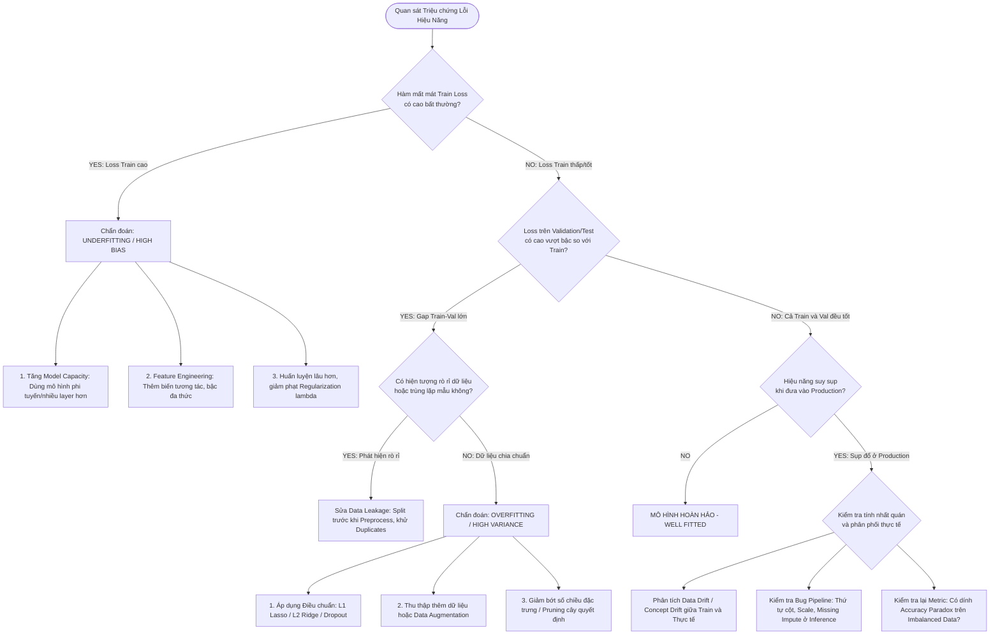

# Chuyên Khảo: Chẩn Đoán Quá Khớp (Overfitting) & Cẩm Nang Phòng Tránh Sai Lầm Thực Chiến Trong Machine Learning

Workspace Hub: [04_Model_Evaluation_Tuning](file:///D:/02_Learning_Knowledge/Machine_Learning/04_Model_Evaluation_Tuning/)  
Tài Liệu Liên Kết: [README.md](file:///D:/02_Learning_Knowledge/Machine_Learning/04_Model_Evaluation_Tuning/README.md) | [regression.py](file:///D:/02_Learning_Knowledge/Machine_Learning/02_Supervised_Learning/01_Regression/regression.py) | [model_evaluation_metrics.py](file:///D:/02_Learning_Knowledge/Machine_Learning/04_Model_Evaluation_Tuning/model_evaluation_metrics.py)

---

## Mục Lục Chi Tiết

1. [Phần 1: Giải Mã Khái Niệm Overfitting - Sự Ngộ Nhận Phổ Biến Nhất](#phần-1-giải-mã-khái-niệm-overfitting---sự-ngộ-nhận-phổ-biến-nhất)
   - 1.1 Bản chất so sánh tương đối (Relative Comparative Metric)
   - 1.2 Sai lầm 1: Đồng nhất Training Accuracy cao với Overfitting
   - 1.3 Sai lầm 2: Quy chụp mọi suy giảm hiệu năng thực tế cho Overfitting
   - 1.4 Hậu quả tai hại của việc chẩn đoán sai bệnh lý mô hình
2. [Phần 2: Hệ Thống Căn Nguyên Suy Giảm Hiệu Năng Vượt Ngoài Overfitting](#phần-2-hệ-thống-căn-nguyên-suy-giảm-hiệu-năng-vượt-ngoài-overfitting)
   - 2.1 Thiếu khớp (Underfitting / High Bias)
   - 2.2 Trôi dạt dữ liệu & Dịch chuyển phân phối (Data Drift / Distribution Shift)
   - 2.3 Rò rỉ dữ liệu (Data Leakage) & Sai lệch tiền xử lý (Preprocessing Skew)
   - 2.4 Cạm bẫy gán giá trị mặc định cho dữ liệu khuyết thiếu (Default Imputation Pitfalls)
   - 2.5 Thiên kiến bản ghi trùng lặp (Duplicate Records Bias)
   - 2.6 Sai lệch thang đo đặc trưng & Bất đối xứng tối ưu hóa (Feature Scaling Pitfalls)
   - 2.7 Xử lý ngoại lai (Outliers): Triệt tiêu mù quáng đối đầu Giữ lại tri thức hiếm
   - 2.8 Dữ liệu mất cân bằng (Imbalanced Data) & Ảo giác điểm số (Accuracy Paradox)
   - 2.9 Siêu tham số & Lỗi đường ống mã nguồn (Code Pipeline Bugs)
3. [Phần 3: Sơ Đồ Cây Quyết Định Chẩn Đoán Toàn Diện (Mermaid Diagnostic Flowchart)](#phần-3-sơ-đồ-cây-quyết-định-chẩn-đoán-toàn-diện-mermaid-diagnostic-flowchart)
4. [Phần 4: Liên Hệ Toán Học & Thực Tiễn: Cơ Chế Điều Chuẩn Ridge & Lasso](#phần-4-liên-hệ-toán-học--thực-tiễn-cơ-chế-điều-chuẩn-ridge--lasso)
   - 4.1 Cơ chế bùng nổ trọng số khi Overfitting
   - 4.2 Điều chuẩn L2 (Ridge Regression / Tikhonov Regularization) & Co-efficient Shrinkage
   - 4.3 Điều chuẩn L1 (Lasso Regression) & Lựa chọn đặc trưng thưa (Sparse Selection)
   - 4.4 Thực nghiệm kiểm định với Scikit-Learn Pipeline
5. [Phần 5: Tiêu Chuẩn Kỹ Thuật (RFC 2119) & Ma Trận Khắc Phục Lỗi](#phần-5-tiêu-chuẩn-kỹ-thuật-rfc-2119--ma-trận-khắc-phục-lỗi)

---

## Phần 1: Giải Mã Khái Niệm Overfitting - Sự Ngộ Nhận Phổ Biến Nhất

### 1.1 Bản chất so sánh tương đối (Relative Comparative Metric)

Trong kỹ thuật học máy (Machine Learning), **Overfitting** (quá khớp) là hiện tượng mô hình học quá sâu vào dữ liệu huấn luyện (Training Set), ghi nhớ cả các thành phần nhiễu ngẫu nhiên (noise) và những đặc trưng cá biệt chỉ xuất hiện trong tập huấn luyện thay vì khái quát hóa các quy luật tổng thể của bài toán.

Kỹ sư học máy **MUST** thấu hiểu nguyên lý nền tảng:
> **Overfitting là một khái niệm mang tính chất so sánh tương đối (Relative Comparative Metric).**

Một giá trị hiệu năng đơn lẻ (ví dụ: Training Accuracy = 99% hay Training Loss = 0.001) **MUST NOT** được dùng làm căn cứ độc lập để khẳng định mô hình bị quá khớp. Khái niệm Overfitting chỉ thực sự có giá trị khoa học khi và chỉ khi ta đặt hiệu năng trên tập huấn luyện đối chiếu trực tiếp với hiệu năng trên tập kiểm định độc lập (Validation Set) hoặc tập kiểm thử (Test Set).

Biểu diễn toán học điều kiện xác nhận Overfitting:

$$\mathcal{L}_{\text{train}}(\theta) \ll \mathcal{L}_{\text{val}}(\theta) \quad \text{hoặc} \quad \text{Metric}_{\text{train}}(\theta) - \text{Metric}_{\text{val}}(\theta) > \delta_{\text{threshold}}$$

Trong đó:
- $\mathcal{L}(\theta)$ là hàm mất mát (Loss Function) của mô hình với tập trọng số $\theta$.
- $\delta_{\text{threshold}}$ là ngưỡng dung sai khoảng cách tổng quát hóa (Generalization Gap).

Nếu không xuất hiện khoảng cách suy giảm rõ rệt giữa hai tập dữ liệu, mọi kết luận về việc mô hình bị Overfitting đều hoàn toàn vô căn cứ.

---

### 1.2 Sai lầm 1: Đồng nhất Training Accuracy cao với Overfitting

Rất nhiều kỹ sư mới tiếp cận thường mắc sai lầm nghiêm trọng: Cứ thấy độ chính xác (Accuracy) trên tập huấn luyện đạt $98\% - 100\%$ là lập tức phán quyết mô hình đã bị Overfitting.

Khẳng định chuẩn mực:
- Điểm huấn luyện cao là **điều kiện cần** (Necessary Condition), nhưng **tuyệt đối không phải điều kiện đủ** (Sufficient Condition) để kết luận Overfitting.
- Nếu mô hình đạt Training Accuracy = $99\%$ và Validation Accuracy cũng đạt $98.5\%$, đây là biểu hiện của một **mô hình xuất sắc (Well-Fitted / High-Capacity Model)** có khả năng tổng quát hóa cao, không phải Overfitting.
- Kỹ sư **MUST NOT** can thiệp giảm độ phức tạp hay áp dụng điều chuẩn cưỡng bức khi chưa quan sát thấy sự phân kỳ (divergence) giữa đường cong huấn luyện và kiểm định.

---

### 1.3 Sai lầm 2: Quy chụp mọi suy giảm hiệu năng thực tế cho Overfitting

Khi mô hình được triển khai vào môi trường thực tế (Inference / Production) hoặc chạy trên tập dữ liệu kiểm thử mới và ghi nhận kết quả dự đoán yếu kém, xu hướng phổ biến là vội vã đổ lỗi cho Overfitting.

Đây là lối tư duy quy chụp nguy hiểm. Hiệu năng suy giảm trong giai đoạn suy luận (Inference) là một **triệu chứng lâm sàng (Symptom)**. Overfitting chỉ là **một trong rất nhiều nguyên nhân tiềm ẩn** gây ra triệu chứng đó. 

Các nguyên nhân khác bao gồm:
1. Mô hình bị thiếu khớp (Underfitting).
2. Dữ liệu thực tế bị lệch phân phối so với dữ liệu huấn luyện (Data Drift / Covariate Shift).
3. Lệch pha quy trình tiền xử lý giữa huấn luyện và suy luận (Preprocessing Skew).
4. Dữ liệu gán nhãn sai, mất cân bằng nghiêm trọng hoặc mẫu hiếm không đủ đại diện.
5. Lỗi kỹ thuật ngầm trong đường ống thực thi mã nguồn (Code Pipeline Bugs).

---

### 1.4 Hậu quả tai hại của việc chẩn đoán sai bệnh lý mô hình

Trong kỹ thuật phần mềm và AI, việc chẩn đoán sai nguyên nhân gốc rễ dẫn đến việc áp dụng sai biện pháp xử lý, tương tự như việc người thầy thuốc bốc nhầm thuốc cho bệnh nhân:

- **Tình huống:** Mô hình thực tế đang bị **Underfitting** (mô hình quá đơn giản, chưa học đủ đặc trưng).
- **Chẩn đoán sai:** Kỹ sư phán đoán mô hình bị **Overfitting**.
- **Hành động sai lầm:** Kỹ sư tiến hành giảm số lượng tham số, cắt giảm đặc trưng đầu vào (drop features), tăng hệ số phạt điều chuẩn (L1/L2 penalty), hoặc rút ngắn thời gian huấn luyện.
- **Hậu quả thực tế:** Năng lực biểu diễn của mô hình bị bóp nghẹt thêm một bậc, khiến mô hình càng sửa càng tồi tệ hơn, dự án lâm vào bế tắc mà không rõ nguyên nhân.

---

## Phần 2: Hệ Thống Căn Nguyên Suy Giảm Hiệu Năng Vượt Ngoài Overfitting

Để xây dựng hệ thống học máy chuẩn công nghiệp, kỹ sư **MUST** phân tích và rà soát toàn diện 9 nhóm nguyên nhân cốt lõi sau:

```
+---------------------------------------------------------------------------------------------------+
|                        BẢN ĐỒ CÁC NGUYÊN NHÂN LỖI THỰC CHIẾN TRONG MACHINE LEARNING               |
+---------------------------------------------------------------------------------------------------+
| 1. Underfitting              | Mô hình quá đơn giản, High Bias, Loss trên cả Train và Val đều cao.|
| 2. Data / Concept Drift      | P_train(X, y) != P_prod(X, y), phân phối thực tế dịch chuyển.      |
| 3. Data Leakage              | Rò rỉ thông tin tương lai / thông tin tập test vào tập train.      |
| 4. Default Imputation        | Điền giá trị vô nghĩa mặc định (0 kg, 0 tuổi) bóp méo phân phối.   |
| 5. Duplicate Records         | Trùng lặp mẫu gây thiên kiến trọng số và rò rỉ qua cross-validation|
| 6. Feature Scale Imbalance   | Thang đo biến lệch lớn khiến Gradient Descent và khoảng cách méo.  |
| 7. Reckless Outlier Removal  | Loại bỏ tùy tiện các mẫu dị biệt chứa tri thức hiếm (Fraud, Anomaly)|
| 8. Metric / Imbalance Trap   | Dùng Accuracy cho dữ liệu lệch lớp; Cố tình ép cân bằng 50:50 sai  |
| 9. Pipeline / Code Bugs      | Thư viện ngầm thay đổi định dạng, rò rỉ trạng thái giữa các fold.   |
+---------------------------------------------------------------------------------------------------+
```

---

### 2.1 Thiếu khớp (Underfitting / High Bias)

- **Bản chất:** Mô hình có dung lượng biểu diễn (Model Capacity) quá thấp so với độ phức tạp nội tại của không gian dữ liệu.
- **Dấu hiệu định lượng:** Điểm hiệu năng thấp (hoặc hàm mất mát cao) trên **cả tập huấn luyện lẫn tập kiểm định**:
  
  $$\mathcal{L}_{\text{train}}(\theta) \approx \text{High}, \quad \mathcal{L}_{\text{val}}(\theta) \approx \text{High}$$

- **Hành động kỹ thuật bắt buộc:**
  1. Tăng cường độ phức tạp của mô hình (ví dụ: chuyển từ Tuyến tính sang Phi tuyến, tăng bậc đa thức, tăng độ sâu của cây hoặc số tầng nơ-ron).
  2. Tạo thêm các đặc trưng phái sinh (Feature Engineering), tăng tương tác giữa các biến.
  3. Huấn luyện trong thời gian dài hơn (tăng số vòng lặp / epochs), giảm nhẹ các ràng buộc điều chuẩn (giảm $\lambda$ trong Ridge/Lasso).

---

### 2.2 Trôi dạt dữ liệu & Dịch chuyển phân phối (Data Drift / Distribution Shift)

- **Bản chất:** Mô hình học chính xác và tối ưu trên phân phối dữ liệu huấn luyện $\mathcal{P}_{\text{train}}(X, y)$, nhưng khi đưa vào vận hành thực tế, phân phối môi trường thực $\mathcal{P}_{\text{prod}}(X, y)$ đã thay đổi.
  - *Hình ảnh ẩn dụ:* Một học sinh ôn luyện kiến thức tiếng Anh xuất sắc nhưng lại bị phát đề thi hoàn toàn bằng tiếng Pháp. Mô hình không hề học sai, mà nó bị thử thách trên miền dữ liệu chưa từng tiếp xúc.
- **Phân loại toán học:**
  1. **Covariate Shift:** $\mathcal{P}_{\text{train}}(X) \neq \mathcal{P}_{\text{prod}}(X)$ trong khi $\mathcal{P}(y \mid X)$ giữ nguyên. (Ví dụ: Dữ liệu xe hơi lúc train chủ yếu là sedan, lúc test ngoài thị trường lại toàn xe tải).
  2. **Concept Drift:** $\mathcal{P}_{\text{train}}(y \mid X) \neq \mathcal{P}_{\text{prod}}(y \mid X)$ trong khi $\mathcal{P}(X)$ giữ nguyên. (Ví dụ: Hành vi tiêu dùng trước và sau một biến động kinh tế vĩ mô).
- **Hành động kỹ thuật:** Giám sát liên tục độ tương đồng phân phối (ví dụ: kiểm định Kolmogorov-Smirnov, Population Stability Index - PSI) và thiết lập chu kỳ tái huấn luyện định kỳ (Continuous Retraining).

---

### 2.3 Rò rỉ dữ liệu (Data Leakage) & Sai lệch tiền xử lý (Preprocessing Skew)

**Data Leakage** (rò rỉ dữ liệu) là tình trạng thông tin từ tương lai hoặc thông tin từ tập kiểm thử bị thẩm thấu vào quá trình huấn luyện, khiến mô hình đạt điểm số cao ảo nhưng sụp đổ hoàn toàn khi triển khai thực tế.

Các dạng rò rỉ kinh điển kỹ sư **MUST** kiểm soát:
1. **Rò rỉ trực tiếp đặc trưng (Target Contamination):** Đưa nhầm biến số phụ thuộc hoặc biến số chỉ xuất hiện sau khi sự kiện xảy ra vào ma trận đặc trưng đầu vào (ví dụ: đưa biến "điểm thi thực tế" hoặc "thời gian nằm viện sau phẫu thuật" vào bài toán dự báo trước nhập viện).
2. **Tiền xử lý trước khi phân tách (Preprocessing before Split):**
   - Áp dụng chuẩn hóa (Standardization / MinMax) hoặc gán giá trị khuyết (Imputation) trên toàn bộ tập dữ liệu trước khi gọi `train_test_split`.
   - Khi đó, giá trị trung bình $\mu_{\text{total}}$ và phương sai $\sigma^2_{\text{total}}$ chứa đựng tri thức của tập kiểm thử đã hòa lẫn vào tập huấn luyện.
   - **Quy tắc bắt buộc:** Kỹ sư **MUST** phân tách Train/Test trước, sau đó chỉ dùng `fit()` trên Train set và `transform()` trên Validation/Test set thông qua `sklearn.pipeline.Pipeline`.
3. **Cân bằng dữ liệu trước khi phân tách:**
   - Thực hiện Over-sampling (nhân bản mẫu thiểu số hoặc SMOTE) trên toàn bộ bộ dữ liệu rồi mới chia tập.
   - Các mẫu nhân bản của cùng một đối tượng sẽ đồng thời hiện diện ở cả Train và Test, vi phạm giả định độc lập khách quan.

---

### 2.4 Cạm bẫy gán giá trị mặc định cho dữ liệu khuyết thiếu (Default Imputation Pitfalls)

Khi đối mặt với dữ liệu bảng (Tabular Data) chứa các giá trị khuyết (Missing Values / `NaN`), nhiều thư viện học máy tự động hoặc kỹ sư thiếu kinh nghiệm thường áp dụng giá trị mặc định (như điền số 0) để mã nguồn không báo lỗi.

**Mặt trái nguy hiểm:**
- Điền giá trị 0 vào các đặc trưng sinh học hoặc vật lý không thể bằng 0 (ví dụ: cân nặng = 0 kg, huyết áp = 0 mmHg, tuổi = 0).
- Mô hình sẽ học một mối tương quan giả tạo: Một nhóm đối tượng có các chỉ số cơ thể bằng 0 mang một nhãn cụ thể, tạo ra các nhánh rẽ vô nghĩa trong cây quyết định hoặc làm lệch mặt phẳng siêu phẳng hồi quy.
- **Giải pháp chuẩn mực:**
  - Nếu tỷ lệ khuyết thiếu thấp ($< 5\%$): Sử dụng trung vị (`SimpleImputer(strategy='median')`) cho phân phối lệch hoặc trung bình cho phân phối chuẩn.
  - Tạo biến cờ báo hiệu (Missingness Indicator): Thêm cột nhị phân biểu thị giá trị đó có bị khuyết hay không.
  - Sử dụng thuật toán tự thân xử lý được missing value như LightGBM / XGBoost hoặc mô hình suy luận đa biến (`IterativeImputer`).

---

### 2.5 Thiên kiến bản ghi trùng lặp (Duplicate Records Bias)

- **Hiện tượng:** Do lỗi thu thập, nối bảng cơ sở dữ liệu (JOIN), hoặc trích xuất log lặp lại, một mẫu dữ liệu xuất hiện 2, 3 hoặc nhiều lần giống hệt nhau trong tập dữ liệu.
- **Tác hại kép:**
  1. **Weight Bias:** Mô hình bị phạt nặng hơn đối với lỗi trên các mẫu trùng lặp, vô tình kéo trọng số mô hình nghiêng về các đặc trưng của mẫu đó.
  2. **Test Invalidation:** Khi chia dữ liệu ngẫu nhiên, các bản sao của cùng một mẫu sẽ rơi vào cả Train và Test, làm biến chất tính độc lập của tập Test.
- **Quy tắc thực thi:** Luôn thực hiện khử trùng lặp (`df.drop_duplicates()`) ngay ở tầng Data Hygiene trước khi đưa vào bất kỳ quy trình phân tích nào.

---

### 2.6 Sai lệch thang đo đặc trưng & Bất đối xứng tối ưu hóa (Feature Scaling Pitfalls)

Các thuật toán nhạy cảm với khoảng cách không gian hoặc tối ưu bằng Gradient Descent (KNN, SVM, Logistic Regression, Linear Regression có Regularization, Neural Networks) bị ảnh hưởng nghiêm trọng nếu các biến có thang đo chênh lệch:

- Ví dụ: Biến diện tích nhà ($100 - 500\text{ m}^2$) đối đầu Biến số phòng ngủ ($1 - 5\text{ phòng}$).
- Khoảng cách Euclid sẽ bị chi phối $99\%$ bởi diện tích nhà. Biến số phòng ngủ dù có tính quyết định đến giá trị bất động sản cũng bị thuật toán bỏ qua chỉ vì độ lớn số học nhỏ hơn.
- Trong thuật toán tối ưu hóa Gradient Descent, bề mặt hàm mất mát sẽ bị kéo giãn thành hình elip hẹp, khiến gradient dao động dữ dội và hội tụ cực kỳ chậm chạp.
- **Quy tắc bắt buộc:** Kỹ sư **MUST** chuẩn hóa đặc trưng bằng `StandardScaler` ($z = \frac{x - \mu}{\sigma}$) hoặc `RobustScaler` trước khi đưa vào các mô hình nhạy cảm thang đo.

---

### 2.7 Xử lý ngoại lai (Outliers): Triệt tiêu mù quáng đối đầu Giữ lại tri thức hiếm

- Một sai lầm kinh điển do áp dụng máy móc là cứ thấy ngoại lai (Outliers) nằm ngoài khoảng $[\mu - 3\sigma, \mu + 3\sigma]$ hay $[Q_1 - 1.5\text{IQR}, Q_3 + 1.5\text{IQR}]$ là xóa sạch.
- **Nguyên tắc phân định:**
  - **Ngoại lai do lỗi nhập liệu / lỗi cảm biến:** (Ví dụ: Chiều cao người = 4 mét, Nhiệt độ phòng = 500 độ C). Trường hợp này **MUST** được loại bỏ hoặc sửa chữa.
  - **Ngoại lai mang tri thức cốt lõi:** Trong các bài toán phát hiện gian lận thẻ tín dụng (Credit Card Fraud), an ninh mạng (Intrusion Detection), hoặc rủi ro tài chính cực đoan (Black Swan events), chính các điểm ngoại lai mới là đối tượng cần phát hiện. Xóa bỏ chúng đồng nghĩa với việc tiêu diệt toàn bộ tín hiệu của bài toán.

---

### 2.8 Dữ liệu mất cân bằng (Imbalanced Data) & Ảo giác điểm số (Accuracy Paradox)

Trong các bài toán tỷ lệ lệch nghiêm trọng (ví dụ: Chẩn đoán ung thư với 99 người âm tính, 1 người dương tính):
- **Cạm bẫy 1 - Ảo giác Accuracy:** Mô hình phân loại ngây thơ luôn dự đoán "Không ung thư" sẽ đạt Accuracy = $99\%$. Nhưng mô hình này hoàn toàn vô dụng trên thực tế. Kỹ sư **MUST NOT** dùng Accuracy làm thước đo chính cho dữ liệu mất cân bằng, mà **MUST** thay thế bằng Precision, Recall, F1-Score, PR-AUC hoặc ROC-AUC.
- **Cạm bẫy 2 - Cưỡng ép cân bằng 50:50:** Rất nhiều người nghĩ rằng "cân bằng dữ liệu" (Balance Data) nghĩa là phải nhân bản hoặc cắt giảm để số lượng 2 lớp bằng nhau tuyệt đối ($50\% - 50\%$).
  - Hành động này bóp méo nghiêm trọng xác suất tiên nghiệm (Prior Probability $\mathcal{P}(y)$) của thế giới thực.
  - Khi triển khai, mô hình sẽ dự đoán báo động giả (False Positive) tràn lan vì ngộ nhận rằng ngoài đời cứ 2 người là có 1 người mắc bệnh.
  - **Mục tiêu đúng đắn:** Chỉ cần điều chỉnh tỷ lệ từ cực đoan ($1:99$) về mức hợp lý hơn (ví dụ $1:9$ hoặc $1:4$), kết hợp điều chỉnh trọng số lớp trong hàm mất mát (`class_weight='balanced'`) và tinh chỉnh ngưỡng quyết định (Threshold Tuning).

---

### 2.9 Siêu tham số & Lỗi đường ống mã nguồn (Code Pipeline Bugs)

- **Tốc độ học (Learning Rate $\eta$):** Trong Deep Learning hoặc Gradient Boosting, $\eta$ quá nhỏ dẫn đến không hội tụ kịp, trong khi $\eta$ quá lớn gây phân kỳ hàm mất mát.
- **Phương sai phân chia đơn lẻ:** Đánh giá mô hình chỉ trên một tập Train/Val cố định dễ rơi vào tính may rủi cục bộ. Áp dụng K-Fold Cross-Validation giúp tính toán kỳ vọng $\mathbb{E}[\text{Score}]$ và phương sai $\text{Var}[\text{Score}]$, cung cấp thước đo ổn định vững chắc.
- **Lỗi kỹ thuật ngầm:** Lỗi logic trong vòng lặp tiền xử lý (ví dụ: ép kiểu dữ liệu từ float sang integer làm tròn cụt giá trị, thứ tự cột đặc trưng ở giai đoạn inference không khớp với lúc train).

---

## Phần 3: Sơ Đồ Cây Quyết Định Chẩn Đoán Toàn Diện (Mermaid Diagnostic Flowchart)

Khi mô hình có kết quả kém hoặc hoạt động bất thường, kỹ sư học máy **MUST** tuân thủ quy trình kiểm định logic tuần tự theo sơ đồ sau:



---

## Phần 4: Liên Hệ Toán Học & Thực Tiễn: Cơ Chế Điều Chuẩn Ridge & Lasso

Để kiểm soát hiện tượng Overfitting trong các mô hình tuyến tính (Linear Models) hiện đang được nghiên cứu tại [01_Regression](file:///D:/02_Learning_Knowledge/Machine_Learning/02_Supervised_Learning/01_Regression/), phương pháp hiệu quả nhất về mặt toán học là **Điều chuẩn (Regularization)**.

### 4.1 Cơ chế bùng nổ trọng số khi Overfitting

Khi một mô hình tuyến tính cố gắng ép mặt phẳng dự đoán đi qua tất cả các điểm dữ liệu nhiễu trong tập huấn luyện, các hệ số trọng số $\mathbf{w} = [w_1, w_2, \dots, w_d]^T$ sẽ bị phóng đại đến các giá trị số học cực lớn ($\|\mathbf{w}\| \to \infty$). Khi đó, chỉ một dao động cực nhỏ của biến đầu vào $x_j$ ở môi trường kiểm thử cũng sẽ khiến kết quả đầu ra $\hat{y}$ bị chao đảo dữ dội, dẫn đến phương sai cao (High Variance).

Để ngăn chặn sự bùng nổ này, ta đưa vào hàm mục tiêu một thành phần phạt (Penalty Term) tỷ lệ thuận với độ lớn của véc-tơ trọng số.

---

### 4.2 Điều chuẩn L2 (Ridge Regression / Tikhonov Regularization) & Co-efficient Shrinkage

Hàm mất mát của hồi quy Ridge bổ sung chuẩn Euclid bậc hai ($L_2$ Norm) của véc-tơ trọng số:

$$\mathcal{J}_{\text{Ridge}}(\mathbf{w}) = \frac{1}{2m} \sum_{i=1}^m \left(h_{\mathbf{w}}(\mathbf{x}^{(i)}) - y^{(i)}\right)^2 + \frac{\lambda}{2} \|\mathbf{w}\|_2^2 = \frac{1}{2m} (\mathbf{X}\mathbf{w} - \mathbf{y})^T (\mathbf{X}\mathbf{w} - \mathbf{y}) + \frac{\lambda}{2} \mathbf{w}^T \mathbf{w}$$

Trong đó:
- $\lambda \ge 0$ là siêu tham số điều chuẩn (Regularization Strength).
- Khi $\lambda = 0$, bài toán thoái hóa về hồi quy bình phương tối thiểu thông thường (OLS).
- Khi $\lambda \to \infty$, mọi trọng số $\mathbf{w} \to \mathbf{0}$, mô hình trở thành đường nằm ngang (Underfitting).

**Nghiệm giải tích đóng (Closed-form Solution):**

Triệt tiêu đạo hàm theo $\mathbf{w}$:

$$\nabla_{\mathbf{w}} \mathcal{J}_{\text{Ridge}} = \frac{1}{m} \mathbf{X}^T (\mathbf{X}\mathbf{w} - \mathbf{y}) + \lambda \mathbf{w} = \mathbf{0}$$

$$\implies (\mathbf{X}^T \mathbf{X} + m\lambda \mathbf{I}) \mathbf{w} = \mathbf{X}^T \mathbf{y}$$

$$\mathbf{w}_{\text{Ridge}} = (\mathbf{X}^T \mathbf{X} + \alpha \mathbf{I})^{-1} \mathbf{X}^T \mathbf{y} \quad (\text{với } \alpha = m\lambda)$$

**Bản chất cơ chế Co-efficient Shrinkage (Co rút hệ số):**
- Ma trận $\mathbf{X}^T \mathbf{X}$ nếu có các cột phụ thuộc tuyến tính (đa cộng tuyến) sẽ có định thức gần bằng 0 và không khả nghịch. Việc cộng thêm $\alpha \mathbf{I}$ dịch chuyển tất cả các trị riêng (eigenvalues) thêm một lượng $\alpha > 0$, đảm bảo ma trận luôn khả nghịch và có điều kiện số học ổn định.
- Về mặt hình học, Ridge thu hẹp đồng đều tất cả các trọng số về gần 0 nhưng **không bao giờ triệt tiêu hoàn toàn trọng số về mức 0 tuyệt đối**.

---

### 4.3 Điều chuẩn L1 (Lasso Regression) & Lựa chọn đặc trưng thưa (Sparse Selection)

Hồi quy Lasso (Least Absolute Shrinkage and Selection Operator) bổ sung chuẩn $L_1$ của trọng số:

$$\mathcal{J}_{\text{Lasso}}(\mathbf{w}) = \frac{1}{2m} \sum_{i=1}^m \left(h_{\mathbf{w}}(\mathbf{x}^{(i)}) - y^{(i)}\right)^2 + \lambda \|\mathbf{w}\|_1 = \frac{1}{2m} \sum_{i=1}^m \left(h_{\mathbf{w}}(\mathbf{x}^{(i)}) - y^{(i)}\right)^2 + \lambda \sum_{j=1}^d |w_j|$$

Do hàm trị tuyệt đối $|w_j|$ không khả vi tại $w_j = 0$, ta sử dụng giải tích dưới đạo hàm (Subgradient Calculus) và toán tử co rút mềm (Soft-thresholding Operator):

$$S_{\lambda}(w_j) = \text{sign}(w_j) \max(0, |w_j| - \lambda)$$

**Hình học của tính chất thưa (Sparsity):**
- Không gian ràng buộc của $L_2$ là hình cầu (hypersphere) tròn trĩnh, các đường đồng mức elip của hàm mất mát thường tiếp xúc tại các điểm trơn nơi các tọa độ $w_j \neq 0$.
- Không gian ràng buộc của $L_1$ là hình thoi / khối đa diện (polytope) có các đỉnh nhọn nằm chính xác trên các trục tọa độ. Do đó, các đường đồng mức có xác suất tiếp xúc cực cao tại các đỉnh nhọn này.
- **Ý nghĩa thực chiến:** Lasso có khả năng triệt tiêu hoàn toàn các trọng số của biến không quan trọng về đúng $0$ ($w_j = 0$), đóng vai trò như một cơ chế **chọn lọc đặc trưng tự động (Automated Feature Selection)**, loại bỏ triệt để các chiều dữ liệu gây nhiễu dẫn đến Overfitting.

---

### 4.4 Thực nghiệm kiểm định với Scikit-Learn Pipeline

Dưới đây là đoạn mã thực hành chuẩn mực kết nối trực tiếp với bài học tại [regression.py](file:///D:/02_Learning_Knowledge/Machine_Learning/02_Supervised_Learning/01_Regression/regression.py), tích hợp tiền xử lý an toàn chống rò rỉ dữ liệu qua `ColumnTransformer` (xử lý đồng bộ biến số và biến phân loại trên tập [StudentScore.xls](file:///D:/02_Learning_Knowledge/Machine_Learning/02_Supervised_Learning/01_Regression/StudentScore.xls)) và so sánh Ridge vs Lasso:

```python
"""
Thực nghiệm so sánh OLS, Ridge và Lasso Regularization chống Overfitting
Vị trí tích hợp: D:/02_Learning_Knowledge/Machine_Learning/02_Supervised_Learning/01_Regression/
Tập dữ liệu: StudentScore.xls
"""
import os
import sys
import numpy as np
import pandas as pd
from sklearn.model_selection import train_test_split
from sklearn.preprocessing import StandardScaler, OneHotEncoder
from sklearn.compose import ColumnTransformer
from sklearn.linear_model import LinearRegression, RidgeCV, LassoCV
from sklearn.pipeline import Pipeline
from sklearn.metrics import mean_squared_error, r2_score

# Đảm bảo in tiếng Việt chuẩn trên Windows terminal (tránh lỗi cp1252 UnicodeEncodeError)
if hasattr(sys.stdout, "reconfigure"):
    sys.stdout.reconfigure(encoding="utf-8")

def run_regularization_experiment(data_path: str):
    """
    Thực thi so sánh OLS, Ridge (L2) và Lasso (L1) trên tập dữ liệu StudentScore.
    Đảm bảo 100% tuân thủ nguyên tắc chống Data Leakage qua ColumnTransformer.
    """
    if not os.path.exists(data_path):
        raise FileNotFoundError(f"Không tìm thấy tập dữ liệu tại: {data_path}")

    data = pd.read_csv(data_path)
    target = "math score"
    X = data.drop(target, axis=1)
    y = data[target]

    # 1. Phân tách Train / Test trước mọi thao tác biến đổi dữ liệu (Chống Data Leakage)
    X_train, X_test, y_train, y_test = train_test_split(
        X, y, test_size=0.2, random_state=1009
    )

    # 2. Định nghĩa cấu trúc tiền xử lý ColumnTransformer
    # Phân loại đặc trưng: Biến định lượng cần scale, biến định danh cần encode
    num_features = ["reading score", "writing score"]
    cat_features = ["gender", "race/ethnicity", "parental level of education", "lunch", "test preparation course"]

    preprocessor = ColumnTransformer(
        transformers=[
            ("num", StandardScaler(), num_features),
            ("cat", OneHotEncoder(drop="first", sparse_output=False, handle_unknown="ignore"), cat_features)
        ]
    )

    # 3. Danh mục mô hình đối chuẩn
    models = {
        "OLS (No Regularization)": LinearRegression(),
        "Ridge (L2 Penalty)": RidgeCV(alphas=np.logspace(-3, 3, 50), cv=5),
        "Lasso (L1 Penalty)": LassoCV(alphas=np.logspace(-3, 3, 50), cv=5, random_state=1009, max_iter=5000)
    }

    print("=== KẾT QUẢ ĐỐI CHUẨN ĐIỀU CHUẨN CHỐNG OVERFITTING ===")
    for name, model in models.items():
        pipe = Pipeline([
            ("preprocessor", preprocessor),
            ("regressor", model)
        ])

        # Huấn luyện toàn bộ pipeline (fit chỉ trên X_train, transform trên X_test)
        pipe.fit(X_train, y_train)

        # Dự đoán
        y_train_pred = pipe.predict(X_train)
        y_test_pred = pipe.predict(X_test)

        # Tính toán sai số
        train_r2 = r2_score(y_train, y_train_pred)
        test_r2 = r2_score(y_test, y_test_pred)
        train_rmse = np.sqrt(mean_squared_error(y_train, y_train_pred))
        test_rmse = np.sqrt(mean_squared_error(y_test, y_test_pred))

        print(f"\nMô hình: {name}")
        print(f"  Train R2: {train_r2:.4f} | Test R2: {test_r2:.4f} | Generalization Gap: {train_r2 - test_r2:.4f}")
        print(f"  Train RMSE: {train_rmse:.4f} | Test RMSE: {test_rmse:.4f}")

        reg = pipe.named_steps["regressor"]
        if hasattr(reg, "alpha_"):
            print(f"  Alpha tối ưu tìm được qua Cross-Validation: {reg.alpha_:.4f}")
        if hasattr(reg, "coef_"):
            # Kiểm tra trọng số xấp xỉ 0 do đặc tính Sparsity của L1
            zero_coefs = np.sum(np.isclose(reg.coef_, 0, atol=1e-4))
            total_coefs = len(reg.coef_)
            print(f"  Số lượng trọng số bị triệt tiêu về 0 (Sparsity): {zero_coefs}/{total_coefs}")

if __name__ == "__main__":
    dataset_path = "D:/02_Learning_Knowledge/Machine_Learning/02_Supervised_Learning/01_Regression/StudentScore.xls"
    run_regularization_experiment(dataset_path)
```

---

## Phần 5: Tiêu Chuẩn Kỹ Thuật (RFC 2119) & Ma Trận Khắc Phục Lỗi

Để đảm bảo kỷ luật kỹ thuật cao nhất trong các dự án học máy tại workspace, mọi hoạt động phát triển **MUST** tuân thủ bảng ma trận phân định sau:

| Tình Huống / Triệu Chứng | Bản Chất Bệnh Lý | Hành Động Kỹ Thuật BẮT BUỘC (RFC 2119) | Hành Động CẤM THỰC HIỆN (RFC 2119) |
| :--- | :--- | :--- | :--- |
| **Train Loss cao, Val Loss cao** | Underfitting (High Bias) | Kỹ sư **MUST** tăng năng lực biểu diễn của mô hình, bổ sung đặc trưng, giảm phạt điều chuẩn. | Kỹ sư **MUST NOT** thêm điều chuẩn, không được cắt giảm đặc trưng hay rút ngắn epoch. |
| **Train Loss thấp, Val Loss cao** | Overfitting (High Variance) | Kỹ sư **MUST** kiểm tra rò rỉ dữ liệu trước; nếu sạch, **MUST** áp dụng L1/L2, Dropout, thu thập thêm dữ liệu hoặc Cross-Validation. | Kỹ sư **MUST NOT** tăng độ sâu cây, không mở rộng số tham số mạng. |
| **Train/Val tốt, Test thực tế suy sụp** | Data Drift / Pipeline Skew | Kỹ sư **MUST** rà soát tính nhất quán tiền xử lý giữa hai môi trường và đo lường độ trôi dạt phân phối (PSI/KS-test). | Kỹ sư **MUST NOT** vội vã kết luận mô hình bị Overfitting rồi tùy tiện giảm tham số. |
| **Tập dữ liệu có giá trị khuyết** | Missing Values | Kỹ sư **MUST** phân tích bản chất vật lý; chỉ dùng trung vị/trung bình khi hợp lý, hoặc dùng mô hình hỗ trợ missing values. | Kỹ sư **MUST NOT** điền số 0 tự động cho các biến không thể bằng 0 trong thế giới thực. |
| **Tập dữ liệu mất cân bằng (99:1)** | Class Imbalance | Kỹ sư **MUST** sử dụng Precision, Recall, F1, PR-AUC và điều chỉnh `class_weight` hoặc dịch chuyển ngưỡng xác suất. | Kỹ sư **MUST NOT** sử dụng Accuracy làm thước đo chính; **MUST NOT** ép cân bằng 50:50 làm sai lệch phân phối thực tế. |
| **Quy trình tiền xử lý dữ liệu** | Data Partitioning | Kỹ sư **MUST** chia tách Train/Test trước khi gọi `fit()` cho bất kỳ Scaler hay Imputer nào. | Kỹ sư **MUST NOT** gọi `fit_transform()` trên toàn bộ DataFrame trước khi chia tập. |
| **Đặc trưng có thang đo chênh lệch lớn** | Scale Discrepancy | Kỹ sư **MUST** chuẩn hóa đặc trưng bằng `StandardScaler` trước khi đưa vào KNN, SVM, Logistic, Ridge, Lasso, Neural Networks. | Kỹ sư **MUST NOT** đưa trực tiếp các đặc trưng có thang đo chênh lệch hàng nghìn lần vào các mô hình nhạy cảm khoảng cách. |

---

## Tổng Kết Kiến Thức Cốt Lõi

1. **Overfitting không phải cái thùng rác:** Ngừng ngay thói quen quy chụp mọi thất bại của mô hình cho Overfitting. Phải luôn có sự so sánh đối chiếu giữa tập huấn luyện và tập kiểm định độc lập.
2. **Chất lượng dữ liệu quyết định giới hạn trên:** "Garbage in, Garbage out". Dữ liệu bị rò rỉ, bị trùng lặp, bị điền sai giá trị khuyết hoặc bị mất cân bằng sẽ phá hủy mô hình nhanh hơn bất kỳ thuật toán tồi nào.
3. **Chẩn đoán đúng bệnh trước khi kê đơn:** Sử dụng sơ đồ cây quyết định để cô lập chính xác nguyên nhân (Underfitting vs Overfitting vs Drift vs Code Bug) trước khi can thiệp vào cấu trúc mô hình.
4. **Điều chuẩn hóa là lá chắn phương sai:** Tận dụng Ridge để thu nhỏ trọng số giải quyết đa cộng tuyến, và tận dụng Lasso để triệt tiêu đặc trưng nhiễu phục vụ bài toán chiều cao.
