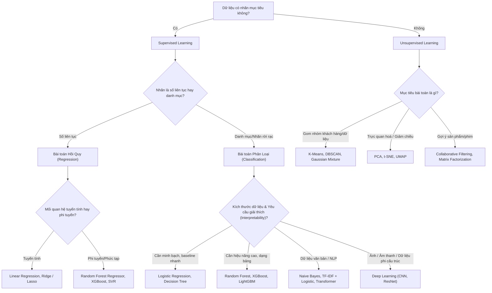

# 🧭 Ma Trận Ra Quyết Định Lựa Chọn Thuật Toán Học Máy (Model Selection Matrix)

---

## 1. Cây Quyết Định Chọn Thuật Toán (Decision Flowchart)

---

## 2. Bảng So Sánh Các Thuật Toán Phổ Biến

| Thuật toán | Ưu điểm cốt lõi | Nhược điểm lớn nhất | Yêu cầu Scale dữ liệu? | Khi nào nên dùng? |
|:---|:---|:---|:---:|:---|
| **Logistic Regression** | Nhanh, nhẹ, dễ giải thích qua trọng số odds-ratio. | Chỉ học được biên phân chia tuyến tính. | **Bắt buộc** | Baseline đầu tiên cho phân loại nhị phân. |
| **k-Nearest Neighbors (KNN)** | Đơn giản, không có giả định phân phối. | Suy luận cực chậm khi dữ liệu lớn ($O(N)$ test time). | **Bắt buộc** | Dữ liệu nhỏ, tìm láng giềng tương đồng. |
| **Decision Tree** | Trực quan cao, biểu diễn dạng if-else dễ hiểu cho sếp. | Rất dễ Overfitting nếu không cắt tỉa (prune). | Không cần | Trực quan hoá logic ra quyết định nghiệp vụ. |
| **Random Forest** | Rất mạnh, ít Overfitting hơn cây đơn, xử lý tốt Outlier. | Mô hình nặng, khó giải thích chi tiết từng quyết định. | Không cần | Bài toán dữ liệu bảng (Tabular data) tiêu chuẩn công nghiệp. |
| **XGBoost / LightGBM** | Hiệu năng đỉnh cao trên các cuộc thi Kaggle. | Dễ Overfit nếu không tune kỹ `learning_rate` và `max_depth`. | Không cần | Dữ liệu bảng lớn khi cần tối đa hóa metric. |
| **Support Vector Machine (SVM)** | Tốt trong không gian chiều cao, có Kernel phi tuyến. | Chậm khi $N > 50,000$ mẫu, khó tune $C, \gamma$. | **Bắt buộc** | Dữ liệu số chiều lớn hơn số dòng ($D > N$). |
| **K-Means** | Phân cụm nhanh, thuật toán trực quan. | Phải chọn trước K, nhạy cảm với khởi tạo và Outlier. | **Bắt buộc** | Phân khúc khách hàng theo hành vi tiêu dùng. |
| **PCA** | Nén số chiều, trực quan hoá 2D/3D dữ liệu đa chiều. | Các trục mới (PC1, PC2) khó gán ý nghĩa nghiệp vụ cụ thể. | **Bắt buộc** | Tiền xử lý giảm chiều chống bùng nổ số chiều (Curse of Dimensionality). |
