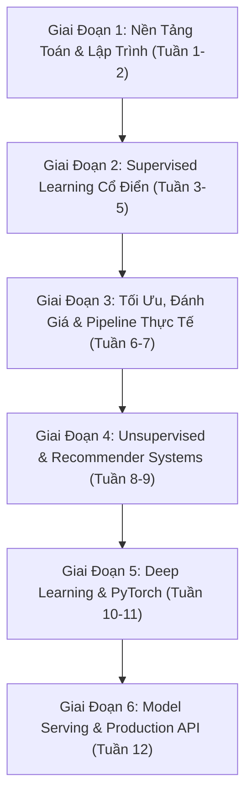

# 🗺️ Lộ Trình Làm Chủ Machine Learning & AI Thực Chiến (12 Tuần)

> Được thiết kế chuyên biệt bởi **DeepTutor AI Tutor** cho không gian học tập Antigravity.

---

## 🧭 Tổng Quan Lộ Trình (Phases)

---

## 📅 Chi Tiết Từng Giai Đoạn & Tiêu Chí Hoàn Thành (Milestones)

### 🔹 Giai Đoạn 1: Toán & Thuật Toán Nền Tảng (Tuần 1 - 2)
- **Kiến thức trọng tâm**:
  - Đại số tuyến tính: Dot product, Ma trận, Chuẩn L1/L2, Trị riêng & Vector riêng.
  - Giải tích: Đạo hàm riêng, Quy tắc chuỗi (Chain Rule), Gradient Descent.
  - Cấu trúc dữ liệu & Thuật toán: Cửa sổ trượt (Sliding Window), BFS/DFS, Thao tác mảng NumPy.
- **Thực hành trong repo**:
  - `01_Math_Foundations/math_primer.py`
  - `01_Math_Foundations/Ex1_Python_Math_Algorithms/` (Ex1 -> Ex8, Interactive Web Lab)
  - `01_Math_Foundations/Ex2_NLP_Text_Probability/` (Xử lý chuỗi, N-gram, Xác suất)
- **Tiêu chí nghiệm thu**: Pass 100% 43 unit tests (`pytest test_all.py`).

---

### 🔹 Giai Đoạn 2: Supervised Learning (Tuần 3 - 5)
- **Kiến thức trọng tâm**:
  - Hồi quy tuyến tính (OLS), Hàm mất mát MSE, Đa thức (Polynomial), Ridge & Lasso (L1/L2 Regularization).
  - Phân loại: Logistic Regression, Sigmoid, Binary Cross-Entropy, Decision Boundary.
  - Cây quyết định (Gini Impurity, Entropy, Information Gain) & Rừng ngẫu nhiên (Bagging, Random Forest).
  - Chuỗi thời gian (Time Series): Lag features, Direct forecasting, Moving averages.
- **Thực hành trong repo**:
  - `02_Supervised_Learning/01_Regression/regression.py` (Dự đoán điểm thi học sinh)
  - `02_Supervised_Learning/02_Classification/classification.py` & `job_classification.py`
  - `02_Supervised_Learning/03_Time_Series_Forecasting/time_series_forecasting.py`
- **Tiêu chí nghiệm thu**: Giải thích được trực giác toán học và giải quyết trơn tru hiện tượng Overfitting/Underfitting.

---

### 🔹 Giai Đoạn 3: Đánh Giá, Tinh Chỉnh & End-to-End Pipeline (Tuần 6 - 7)
- **Kiến thức trọng tâm**:
  - Data Leakage & Kỹ thuật Train/Test Split có phân tầng (`stratify=y`).
  - Tiền xử lý dữ liệu: Khử missing values ngầm (giá trị 0 sinh học), loại bỏ ngoại lai bằng IQR.
  - Chuẩn hóa: `StandardScaler` vs `RobustScaler`.
  - Đánh giá trên dữ liệu mất cân bằng: Precision, Recall, F1-Score, ROC-AUC, PR-Curve.
  - Kỹ thuật tối ưu ngưỡng quyết định (Threshold Tuning) thay vì dùng mặc định 0.5.
  - Tinh chỉnh siêu tham số: `GridSearchCV` & `RandomizedSearchCV`.
- **Thực hành trong repo**:
  - `02_Supervised_Learning/04_End_to_End_Diabetes_Pipeline/`
  - `04_Model_Evaluation_Tuning/`
- **Tiêu chí nghiệm thu**: Chạy hoàn chỉnh toàn bộ pipeline 10 bước và xuất ra `model.pkl`, `scaler.pkl`, `threshold.pkl`.

---

### 🔹 Giai Đoạn 4: Học Không Giám Sát & Hệ Gợi Ý (Tuần 8 - 9)
- **Kiến thức trọng tâm**:
  - Phân cụm: K-Means, Elbow Method, Silhouette Score.
  - Giảm chiều: PCA (Principal Component Analysis), Phân tích phương sai giữ lại (Explained Variance Ratio).
  - Hệ thống gợi ý: TF-IDF, Cosine Similarity, Content-Based Filtering & Collaborative Filtering.
- **Thực hành trong repo**:
  - `03_Unsupervised_Learning/Clustering_and_Dimensionality_Reduction/kmeans_pca_demo.py`
  - `03_Unsupervised_Learning/Recommender_Systems/recommendation_system.py`
- **Tiêu chí nghiệm thu**: Phân cụm và trực quan hoá dữ liệu đa chiều trên không gian 2D/3D.

---

### 🔹 Giai Đoạn 5: Deep Learning & PyTorch Cơ Bản (Tuần 10 - 11)
- **Kiến thức trọng tâm**:
  - Perceptron đơn tầng & Giới hạn không phân tách tuyến tính (XOR problem).
  - Mạng nơ-ron đa tầng (MLP), Hàm kích hoạt phi tuyến tính (ReLU, Leaky ReLU, Sigmoid).
  - Cơ chế lan truyền ngược (Backpropagation) và quy tắc đạo hàm theo chuỗi (Chain Rule).
  - PyTorch Tensors, Autograd, `nn.Module`, `DataLoader`, GPU/MPS Acceleration.
- **Thực hành trong repo**:
  - `05_Deep_Learning_Basics/perceptron_from_scratch.py`
  - `05_Deep_Learning_Basics/mlp_backprop_numpy.py`
  - `05_Deep_Learning_Basics/pytorch_mnist_demo.py`
- **Tiêu chí nghiệm thu**: Đạt độ chính xác > 95% khi phân loại ảnh số viết tay MNIST với PyTorch.

---

### 🔹 Giai Đoạn 6: Đóng Gói & Triển Khai API Sản Phẩm (Tuần 12)
- **Kiến thức trọng tâm**:
  - RESTful API thiết kế với FastAPI & Pydantic validation.
  - Xây dựng giao diện thử nghiệm với Streamlit.
  - Xử lý độ trễ suy luận (Latency) và chuẩn hóa dữ liệu đầu vào theo thời gian thực (Real-time inference).
- **Thực hành trong repo**:
  - `07_Model_Deployment_API/server.py` (FastAPI Server)
  - `07_Model_Deployment_API/client.py` (Streamlit UI & CLI test)
  - `07_Model_Deployment_API/inference.py` (Local Inference Engine)
- **Tiêu chí nghiệm thu**: Khởi chạy thành công API và gọi suy luận thời gian thực với độ trễ < 50ms.
