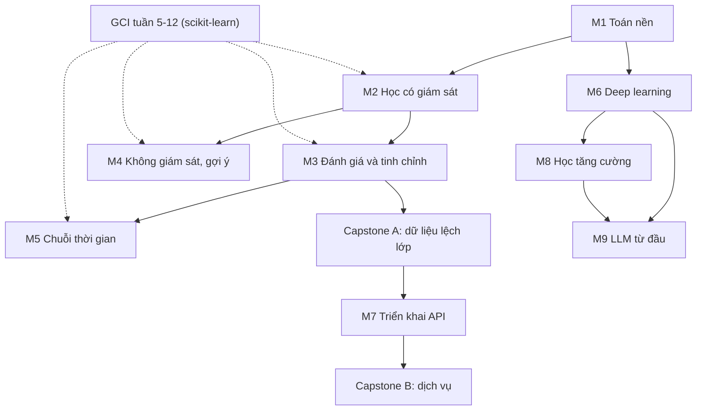

# Lộ trình Machine Learning (phiên bản 2, cập nhật 2026-10-10)

> Học xong lộ trình này, bạn tự cài và giải thích bằng toán các thuật toán ML cốt lõi (hồi quy tuyến tính, logistic, cây và boosting, KNN, K-Means, PCA, MLP), đánh giá mô hình mà không bị rò rỉ dữ liệu đánh lừa, đóng gói mô hình thành API có kiểm thử, rồi đi tiếp sang học tăng cường và tự viết lại một MiniGPT. File: `Machine_Learning/Roadmaps/ROADMAP.md`, thay cho 3 lộ trình cũ cùng thư mục. Nguồn sự thật (source of truth): tiến độ ở [TASKS.md](../TASKS.md), lịch và nội dung ở file này, chi tiết Module 9 ở [09_LLM_From_Scratch/ROADMAP.md](../09_LLM_From_Scratch/ROADMAP.md), lịch GCI ở [trang chính thức của GCI](https://weblab.t.u-tokyo.ac.jp/en/lecture/gci/).

## Mục lục

1. [Cách dùng lộ trình này](#1-cách-dùng-lộ-trình-này)
2. [Bức tranh toàn cảnh](#2-bức-tranh-toàn-cảnh)
3. [Trạng thái hiện tại và lịch](#3-trạng-thái-hiện-tại-và-lịch)
4. [Các module](#4-các-module) (Module 1-9; GitHub cũng hiện mục lục tự động theo tiêu đề)
5. [Ôn tập giãn cách và ôn xen kẽ](#5-ôn-tập-giãn-cách-và-ôn-xen-kẽ)
6. [Dự án tổng hợp](#6-dự-án-tổng-hợp)
7. [Sổ lỗi và cách hỏi DeepTutor](#7-sổ-lỗi-và-cách-hỏi-deeptutor)
8. [Tài liệu cũ trong thư mục này](#8-tài-liệu-cũ-trong-thư-mục-này)
9. [Theo dõi tiến độ](#9-theo-dõi-tiến-độ)
10. [Nguồn tham khảo](#10-nguồn-tham-khảo)

## 1. Cách dùng lộ trình này

GCI dạy cách dùng scikit-learn; ở đây, cùng tuần với chủ đề GCI, bạn học toán phía sau, tự cài lại từ đầu (from scratch) bằng NumPy rồi đối chiếu với scikit-learn.

**Vòng lặp một module:** (1) làm thử 2 câu Tự kiểm tra trước khi học, sai cũng được; (2) chỉ học phần ghi trong "Tài liệu"; (3) viết mô hình tư duy 5 dòng và 1 ví dụ số tự nghĩ ra; (4) thực hành Khởi động -> Cốt lõi -> Thử thách, ghi dự đoán trước mỗi lần chạy code (predict-then-run); (5) đối chiếu với scikit-learn hoặc notebook GCI, giải thích mọi chênh lệch; (6) viết hết câu trả lời rồi mới mở đáp án; (7) nhờ DeepTutor kiểm DoD (Definition of Done, tiêu chí hoàn thành) rồi mới tick TASKS.md. Checkpoint chung cho mọi module: notebook chạy lại không lỗi, mỗi câu sai có một mục Sổ lỗi (mục 7), đã ghi lịch ôn (mục 5).

**Một buổi 45-90 phút:** 5 phút ôn truy hồi (viết lại 3 ý buổi trước từ trí nhớ) -> 5 phút chọn 1 DoD, ghi dự đoán -> 25 + 25 phút làm có hẹn giờ (kẹt quá 15 phút thì hỏi DeepTutor theo mẫu ở mục 7) -> 15 phút đối chiếu, đo DoD -> 5-10 phút ghi Sổ lỗi, tick mục 9.

**Nhịp tuần:** tuần 1-2 khoảng 3 giờ (Buổi A Thứ Ba hoặc Thứ Tư, 70 phút, học toán của chủ đề GCI sắp học vào Thứ Năm; Buổi B cuối tuần, 95 phút, cài và đối chiếu; ôn 15 phút). Tuần 3-10 (2026-10-26 đến 12-20) khoảng 2 giờ vì GCI vào cao điểm (hướng dẫn competition và final assignment ngày 10-29, khóa kết thúc 12-17); tuần 9-10 gần như chỉ ôn. Từ 2026-12-21 khoảng 5 giờ (2 buổi 90 phút trong tuần, 1 buổi 120 phút cuối tuần). Tuần GCI có việc P0: chỉ làm Khởi động và Tự kiểm tra, dời Cốt lõi sang tuần đệm.

**File đã có lời giải: tự làm đến DoD rồi mới mở để so.** [solutions_practice.py](../01_Math_Foundations/Ex1_Python_Math_Algorithms/solutions_practice.py), [solution_1-7.py](../01_Math_Foundations/Ex1_Python_Math_Algorithms/solution_1-7.py), [1_8_solution.py](../01_Math_Foundations/Ex1_Python_Math_Algorithms/1_8_solution.py), [math_primer.py](../01_Math_Foundations/math_primer.py), [perceptron_from_scratch.py](../05_Deep_Learning_Basics/perceptron_from_scratch.py), [mlp_backprop_numpy.py](../05_Deep_Learning_Basics/mlp_backprop_numpy.py), [kmeans_pca_demo.py](../03_Unsupervised_Learning/Clustering_and_Dimensionality_Reduction/kmeans_pca_demo.py), [model_evaluation_metrics.py](../04_Model_Evaluation_Tuning/model_evaluation_metrics.py). **Cảnh báo:** Phần 4.4 của [05_overfitting_and_ml_pitfalls_guide.md](../04_Model_Evaluation_Tuning/05_overfitting_and_ml_pitfalls_guide.md) là lời giải hoàn chỉnh của bài Ridge/Lasso (M3.3a): chỉ đọc sau khi đã tự làm M3.3a. Các `exercise_*.py` của 09 đã có code sẵn: xem Module 9.

## 2. Bức tranh toàn cảnh

**Năng lực đầu ra:** (1) từ một bảng dữ liệu, dựng baseline -> Pipeline -> kiểm định chéo -> ngưỡng theo chi phí và giải thích từng con số; (2) tự cài các thuật toán nêu ở đầu file; (3) chẩn đoán high bias, high variance, rò rỉ dữ liệu; (4) đưa mô hình thành API có kiểm thử; (5) cài Q-learning, DQN, viết lại MiniGPT.



| Module | Thư mục chính | Tuần | Giờ |
|---|---|---|---|
| M1 Toán nền | [01_Math_Foundations](../01_Math_Foundations/) | 1 | 1-2 |
| M2 Học có giám sát | [02_Supervised_Learning](../02_Supervised_Learning/) | 1, 2, 3, 11 | 7 |
| M3 Đánh giá, tinh chỉnh | [04_Model_Evaluation_Tuning](../04_Model_Evaluation_Tuning/) | 2, 4, 5, 6 | 7 |
| M4 Không giám sát, gợi ý | [03_Unsupervised_Learning](../03_Unsupervised_Learning/) | 7, 11 | 5 |
| M5 Chuỗi thời gian | [03_Time_Series_Forecasting](../02_Supervised_Learning/03_Time_Series_Forecasting/) | 8 | 2 |
| Capstone A | [06_Datasets_Kaggle/stroke](../06_Datasets_Kaggle/stroke/) | 13 | 4 |
| M6 Deep learning | [05_Deep_Learning_Basics](../05_Deep_Learning_Basics/) | 14-15 | 10 |
| M7 + Capstone B | [07_Model_Deployment_API](../07_Model_Deployment_API/) | 16 | 5 |
| M8 Học tăng cường | [08_Reinforcement_Learning](../08_Reinforcement_Learning/) | 18-20 | 12 |
| M9 LLM từ đầu | [09_LLM_From_Scratch](../09_LLM_From_Scratch/) | 20-23 | 14 |
| Ôn xen kẽ, ôn cuối | [Quizzes](../Quizzes/) | 9, 12, 18, 20, 23 | 6 |

Số module không trùng số thư mục vì thứ tự học bám theo GCI. Toán dạy đúng lúc cần: M1 gồm đại số tuyến tính, đạo hàm, tối ưu; xác suất ở M2, trị riêng và SVD ở M4.

**Kiến thức nền cần có:** Python, NumPy (GCI tuần 2), pandas (tuần 3), Matplotlib (tuần 4), đạo hàm của đa thức, $e^x$, $\ln x$; cú pháp xem [Python_for_Java_C_Developers.md](../Notes/Python_for_Java_C_Developers.md). Tự kiểm tra nhanh trước 2026-10-12 (đúng dưới 4/5 thì ôn nền 20 phút đầu tuần 1): (1) `np.arange(6).reshape(2, 3).sum(axis=0)` cho gì? (2) Đạo hàm của $x^2e^x$? (3) Lấy trung bình `Glucose` theo từng giá trị `Outcome` của `df` thế nào? (4) Viết công thức Bayes. (5) Vì sao lấy $\log$ của tích nhiều xác suất?

<details><summary>Đáp án</summary>

(1) `array([3, 5, 7])`. (2) $(x^2+2x)e^x$. (3) `df.groupby("Outcome")["Glucose"].mean()`. (4) $P(A\mid B)=P(B\mid A)P(A)/P(B)$. (5) Tích thành tổng (dễ lấy đạo hàm) và tránh tràn số dưới.

</details>

**Ngân sách thời gian:** đến 2026-12-20 khoảng 20 giờ; từ 2026-12-21 khoảng 5 giờ/tuần, khoảng 55 giờ. Toàn lộ trình 23 tuần (2026-10-12 đến 2027-03-21), khoảng 75 giờ, có 2 tuần đệm (năm mới, Tết).

## 3. Trạng thái hiện tại và lịch

**Cảnh báo quá hạn:** [TASKS.md](../TASKS.md) còn **15 task chưa xong, hạn 2026-09-26 đến 10-07, tất cả đã quá hạn** ([ACTIVE_LEARNING.md](../../ACTIVE_LEARNING.md) ghi hạn môn 2026-09-26); [TASKS.md của 09](../09_LLM_From_Scratch/TASKS.md) có 2 task quá hạn (10-08, 10-09). Lịch dưới đây thay toàn bộ hạn cũ; DeepTutor cập nhật TASKS.md sau khi bạn đồng ý. Không có hạn ML nào trong 72 giờ tới. Hạn GCI gần nhất: HW3 (Session 4) lúc **2026-10-22 18:00** theo [TASKS.md của GCI](../../GCI_World_2026_September/TASKS.md) (khớp quy tắc "nộp trong 2 tuần" ở [ghi chú Buổi 1](../../GCI_World_2026_September/06_Notes_Transcripts/Lecture_01_Detailed_Notes.md)). Hạn competition và final assignment **chưa được công bố**; các ngày 10-22 và 11-05 trong TASKS.md của GCI chưa xác minh, lịch ML không dựa vào chúng.

**Bạn đang ở đây** (theo file, 2026-10-10):
- [practice_exercises.py](../01_Math_Foundations/Ex1_Python_Math_Algorithms/practice_exercises.py): bài 1.1 đang dở (còn `raise NotImplementedError`; một biến được dùng trước khi gán ở dòng tính tổng số dương), 15 bài còn `TODO`.
- TASKS.md ghi [x] cho hồi quy tuyến tính + GD và logistic, nhưng [01_Regression](../02_Supervised_Learning/01_Regression/) chỉ có `regression.py` (RandomForest), không có code tự cài: làm lại ở M2. Bộ metrics và tài liệu overfitting có sẵn nhưng không xác định được ai viết: M3 vẫn yêu cầu tự tính.
- Học tăng cường: 1/14 task; `flappy_env.py` mới vẽ được con chim. LLM: các `exercise_*.py` đã có code từ lúc tạo, **hoàn thành chưa xác minh** (M9). Git: commit gần nhất trong Machine_Learning là 2026-09-23; thư mục 08, 09 và TASKS.md chưa commit.

**Lịch theo tuần.** Lịch GCI theo [trang chính thức](https://weblab.t.u-tokyo.ac.jp/en/lecture/gci/): live Thứ Năm 11:00-12:30 UTC (18:00-19:30 giờ Việt Nam), nội dung có thể thay đổi nhẹ. Hạn ML là hạn mềm 21:00 Chủ Nhật.

| Tuần | Ngày | Module (chủ đề GCI cùng tuần) | Sản phẩm/DoD | Hạn |
|---|---|---|---|---|
| 1 | 2026-10-12..18 | M1 + M2.1 (Supervised Learning, 10-15), 3 giờ | `m1_gradient_lab`, `m2_linreg_scratch` | 10-18 |
| 2 | 10-19..25 | M2.2 + M3.1 (Model Evaluation, 10-22), 2,5 giờ | `m2_logreg_scratch`; bảng ngưỡng | **GCI HW3 10-22 18:00 (hạn thật)**; ML 10-25 |
| 3 | 10-26..11-01 | M2.3 (Competition & Final Assignment Tutorial, 10-29), 2 giờ | Gini khớp; ghi chú LightGBM | 11-01 |
| 4 | 11-02..08 | M3.2 (Feature Engineering, 11-05), 2 giờ | Thí nghiệm leakage; CV 3 mô hình | 11-08 |
| 5 | 11-09..15 | M3.3a Ridge/Lasso (Marketing and Data Science), 2 giờ | Coefficient path | 11-15 |
| 6 | 11-16..22 | M3.3b (SQL), 2 giờ | Validation curve; Grid vs Random | 11-22 |
| 7 | 11-23..29 | M4.1 (Unsupervised Learning, 11-26), 2 giờ | K-Means, PCA khớp | 11-29 |
| 8 | 11-30..12-06 | M5 (Time Series Analysis, 12-03), 2 giờ | co2 với TimeSeriesSplit | 12-06 |
| 9 | 12-07..13 | Ôn xen kẽ #1 (Guest Session), 1,5 giờ | Đúng ít nhất 5/6 | 12-13 |
| 10 | 12-14..20 | Chỉ ôn D+x, tối đa 1 giờ (Special Contents, 12-17) | - | - |
| 11 | 12-21..27 | Từ đây 5 giờ/tuần. M2.4 KNN + M4.2 gợi ý | KNN khớp; CF so baseline | 12-27 |
| 12 | 12-28..2027-01-03 | Tuần đệm năm mới: ôn xen kẽ #2 | Đúng ít nhất 16/20 | 01-03 |
| 13 | 2027-01-04..10 | Capstone A | DoD ở mục 6 | 01-10, **Mốc A** |
| 14 | 01-11..17 | M6.1 + M6.2 | Gradient check; XOR | 01-17 |
| 15 | 01-18..24 | M6.2 + M6.3 | MNIST >= 97% (mục tiêu tự đặt) | 01-24 |
| 16 | 01-25..31 | M7 + Capstone B | Dịch vụ, 3 test | 01-31, **Mốc B** |
| 17 | 02-01..07 | Tuần đệm Tết (giao thừa 02-05, mùng 1 Thứ Bảy 02-06) | - | - |
| 18 | 02-08..14 | Ôn xen kẽ #3 + M8.1 + M8.2 | Gridworld; FrozenLake | 02-14 |
| 19 | 02-15..21 | M8.3 + bắt đầu M8.4 | 3 learning curve | 02-21 |
| 20 | 02-22..28 | M8.4 + ôn xen kẽ #4 + M9 chặng 1 | `reset()`/`step()`; test pass | 02-28, **Mốc C** |
| 21 | 03-01..07 | M9 chặng 2-3 | Test pass | 03-07 |
| 22 | 03-08..14 | M9 chặng 4-6 | Loss, perplexity đo thật | 03-14 |
| 23 | 03-15..21 | M9 chặng 7 + 2 task quá hạn của 09 + ôn #5 | Ôn #5 đúng ít nhất 7/9 | 03-21, **Mốc D** |

**Task cũ quá hạn được xếp lại:** Ridge/Lasso (09-26) -> tuần 5, hạn 2026-11-15; Decision Tree trên car.csv (09-27) -> tuần 3, 11-01 (car.csv là bộ Auto MPG, dùng nhãn `origin`); Random Forest, Gradient Boosting (09-29) và benchmark (10-01) -> tuần 3-4, 11-08; hyperparameter tuning (09-28) -> tuần 6, 11-22; chuỗi thời gian (09-30) -> tuần 8, 12-06; KNN (09-28) và MovieLens CF (10-06) -> tuần 11, 12-27; imbalanced data (09-29), outlier và ngưỡng (09-30), pipeline diabetes (10-02) và stroke (10-04) -> tuần 2 (ngưỡng) và Capstone A, 2027-01-10; MNIST (10-05) -> tuần 15, 01-24; Joblib + REST API (10-07) -> tuần 16, 01-31; 2 task của 09 (10-08, 10-09) -> tuần 23, 03-21; EDA csgo (10-03) -> tùy chọn, không đặt hạn.

**Đồng bộ liên khóa:** không làm lại bài GCI, lấy kết quả scikit-learn trong notebook GCI cùng tuần làm "đáp án" để so bản tự cài; ghi chú LightGBM và Pipeline (tuần 3-4) dùng được cho competition. Bài trong `practice_exercises.py` tính vào giờ Python Master; video đại số tuyến tính (M1) dùng chung với Quantum Computing; M9 (bên trong LLM) không trùng giờ với AMD AI Agents 101.

## 4. Các module

Môi trường: [requirements.txt](../requirements.txt) của thư mục, cài thêm `lightgbm` (M2), `imbalanced-learn` (Capstone A), `gymnasium` (M8) vì chưa có trong file. Notebook tự tạo đặt cạnh dữ liệu, tên bắt đầu bằng `m<số module>_`.

### Module 1 - Toán nền tảng cho ML (ước lượng: 1-2 giờ, tuần 1)

**Vì sao học:** mọi module sau lặp lại một khuôn: dữ liệu là ma trận, định nghĩa hàm mất mát (loss function), đi ngược gradient để giảm nó.

**Đầu ra:** viết $\hat{\mathbf y}=X\mathbf w+b$ với đúng shape từng thành phần; tính tay gradient của MSE và kiểm bằng gradient số (sai số tương đối dưới $10^{-6}$); dự đoán một learning rate (tốc độ học) sẽ làm gradient descent hội tụ, dao động hay phân kỳ.

**Kiến thức cốt lõi**
1. *Dữ liệu là ma trận* $X\in\mathbb R^{n\times d}$ (hàng là mẫu, cột là đặc trưng). Dự đoán tuyến tính là tích vô hướng (dot product) $\mathbf x^\top\mathbf w$, tức tổng có trọng số; $\mathbf u\cdot\mathbf v=\lVert\mathbf u\rVert\lVert\mathbf v\rVert\cos\theta$ quay lại ở cosine similarity (M4) và attention (M9).
2. *Gradient* là vector đạo hàm riêng, chỉ hướng hàm tăng nhanh nhất: $f=w_1^2+3w_2^2$ có $\nabla f=(2w_1,6w_2)$. Chain rule (quy tắc chuỗi) $\frac{d}{dw}g(h(w))=g'(h(w))h'(w)$ là cơ chế của backpropagation (M6).
3. *MSE:* $J=\frac1n\lVert X\mathbf w-\mathbf y\rVert^2$, $\nabla J=\frac2nX^\top(X\mathbf w-\mathbf y)$; đặt bằng $\mathbf 0$ được normal equation $X^\top X\mathbf w=X^\top\mathbf y$.
4. *Gradient descent:* $\mathbf w\leftarrow\mathbf w-\eta\nabla J$. Với $f(w)=w^2$: $w_{t+1}=(1-2\eta)w_t$, hội tụ khi $0<\eta<1$ (đổi dấu nếu $\eta>0.5$), phân kỳ khi $\eta>1$; nhiều chiều thì ngưỡng do độ cong lớn nhất (trị riêng lớn nhất của Hessian) quyết định.
5. *Kiểm tra gradient:* $\frac{\partial J}{\partial w_j}\approx\frac{J(\mathbf w+\epsilon\mathbf e_j)-J(\mathbf w-\epsilon\mathbf e_j)}{2\epsilon}$, $\epsilon\approx10^{-5}$.

**Hiểu lầm và lỗi hay gặp**
- "Gradient chỉ hướng xuống dốc" - nó chỉ hướng lên, GD đi ngược - nhận ra: loss tăng dù $\eta$ nhỏ.
- Trộn shape `(n,)` với `(n, 1)` - `y - X @ w` thành ma trận `(n, n)`, không báo lỗi - nhận ra: in `.shape` của phần dư.
- Không chuẩn hóa trước GD - đường đồng mức dẹt, GD đi zigzag - nhận ra: phải hạ $\eta$ rất nhỏ mới không phân kỳ.

**Tài liệu**
- Trong thư mục: [math_primer.py](../01_Math_Foundations/math_primer.py) (đọc sau Cốt lõi); [ML_Cheatsheet_Formulas.md](../Notes/ML_Cheatsheet_Formulas.md) mục 1; [Quiz_01](../Quizzes/Quiz_01_Math_and_Algorithms.md) cho D+21.
- Bên ngoài: [3Blue1Brown - Linear Algebra](https://www.3blue1brown.com/lessons/vectors) chương 1-4 và 9 (60 phút, dùng chung với Quantum Computing); [Google ML Crash Course - Linear regression](https://developers.google.com/machine-learning/crash-course/linear-regression) bài Loss, Gradient descent, Hyperparameters (40 trong 80 phút); [Mathematics for Machine Learning](https://mml-book.github.io/) (PDF miễn phí) Chương 5 và phần gradient descent đầu Chương 7, đọc chọn lọc 30 phút.

**Thực hành**
- Khởi động (15 phút): với `X` `(100, 3)`, `w` `(3,)`, `y` `(100,)`, ghi dự đoán shape của `X @ w`, `X - X.mean(axis=0)`, `y - X @ w`, `y - (X @ w).reshape(-1, 1)` rồi mới chạy. DoD: dự đoán ghi trước; câu sai có giải thích trong Sổ lỗi.
- Cốt lõi (50 phút): `01_Math_Foundations/m1_gradient_lab.ipynb`: 200 điểm $y=3x+2+\text{nhiễu}$, $x$ đã chuẩn hóa, dùng đúng $J$ ở trên; so gradient giải tích với gradient số; chạy GD 100 vòng với $\eta\in\{0.001, 0.1, 1.1\}$ sau khi ghi dự đoán. DoD: sai số tương đối < $10^{-6}$; bảng (η, dự đoán, kết quả); hình loss; nghiệm tốt nhất khớp `np.linalg.lstsq` < $10^{-3}$.
- Thử thách (tùy chọn): với 2 cột giống hệt nhau, cho thấy `np.linalg.cond(X.T @ X)` rất lớn. DoD: 1 trang giải thích vì sao nghiệm không duy nhất.

**Tự kiểm tra**
1. Viết $\nabla J$ của $J=\frac1n\lVert X\mathbf w-\mathbf y\rVert^2$.
2. Vì sao chuẩn hóa đặc trưng giúp GD hội tụ nhanh hơn?
3. $f(w)=w^2$, $w_0=1$, $\eta=0.75$: $w_1$, $w_2$? Hội tụ, dao động hay phân kỳ?
4. `a` shape `(3,)`, `b` shape `(3, 1)`: `(a - b).shape`?
5. Đổi sang $J=\frac1{2n}\lVert X\mathbf w-\mathbf y\rVert^2$ (cách viết của giáo trình) thì $\eta=1.1$ còn phân kỳ không?

<details><summary>Đáp án</summary>

1. $\frac2nX^\top(X\mathbf w-\mathbf y)$.
2. Cùng thang đo thì độ cong mọi hướng gần bằng nhau, một $\eta$ chung hợp mọi hướng; lệch thang đo thì $\eta$ phải nhỏ theo hướng cong nhất và các hướng khác đi rất chậm.
3. $w_1=-0.5$, $w_2=0.25$: hệ số $-0.5$, đổi dấu nhưng biên độ giảm một nửa: dao động và hội tụ.
4. `(3, 3)`: hàng `(1, 3)` trừ cột `(3, 1)`.
5. Không: Hessian giảm một nửa nên ngưỡng thành $\eta<2$; hệ số $1-1.1=-0.1$, hội tụ nhanh. "Learning rate tốt" phụ thuộc cách viết loss.

</details>

**Checkpoint:** [ ] `m1_gradient_lab` đạt DoD; [ ] đúng ít nhất 4/5 câu không mở tài liệu.

### Module 2 - Học có giám sát: từ hồi quy tuyến tính đến boosting (ước lượng: 7 giờ, tuần 1, 2, 3, 11)

**Vì sao học:** GCI dạy các mô hình này bằng scikit-learn từ tuần 5 và dùng boosting (LightGBM) trong competition; tự cài lõi thuật toán cho bạn biết mỗi siêu tham số (hyperparameter) điều khiển cái gì.

**Đầu ra:** cài hồi quy tuyến tính (normal equation, GD) và logistic regression khớp scikit-learn; tính tay Gini, entropy, information gain (độ lợi thông tin) khớp cây của scikit-learn; giải thích vì sao Random Forest giảm variance còn boosting giảm bias; chứng minh bằng thí nghiệm rằng thang đo làm đổi kết quả KNN.

**Kiến thức cốt lõi**
- *Hồi quy tuyến tính (tuần 1):* một biến $w=\frac{\sum(x_i-\bar x)(y_i-\bar y)}{\sum(x_i-\bar x)^2}$, $b=\bar y-w\bar x$; nhiều biến $X^\top X\hat{\mathbf w}=X^\top\mathbf y$, tức $X\hat{\mathbf w}$ là hình chiếu của $\mathbf y$ lên không gian cột và phần dư (residual) vuông góc với mọi cột. $R^2$ có thể âm trên test.
- *Logistic regression (tuần 2), xác suất đúng lúc cần:* $y$ là Bernoulli với $p=\sigma(\mathbf w^\top\mathbf x+b)$; cực đại likelihood (hàm hợp lý) tương đương cực tiểu log-loss $L=-\frac1n\sum[y_i\log p_i+(1-y_i)\log(1-p_i)]$, với $\nabla L=\frac1nX^\top(\mathbf p-\mathbf y)$. Tăng $x_j$ một đơn vị thì odds nhân $e^{w_j}$; đổi ngưỡng là dịch song song ranh giới $p=0.5$.
- *Cây (tuần 3):* chọn câu hỏi "$x_j\le t$?" giảm impurity nhiều nhất: $\text{Gini}=1-\sum p_k^2$, $H=-\sum p_k\log_2p_k$, $IG=H(\text{cha})-\sum_c\frac{n_c}nH(c)$; hãm bằng `max_depth`, `min_samples_leaf`.
- *Random Forest:* trung bình $B$ cây bootstrap, mỗi lần tách xét tập con đặc trưng ngẫu nhiên; phương sai của trung bình $\rho\sigma^2+\frac{1-\rho}B\sigma^2$, nên thêm cây chỉ giảm số hạng sau, giảm tương quan $\rho$ mới giảm số hạng đầu.
- *Gradient boosting:* $F_m=F_{m-1}+\nu h_m$, $h_m$ khớp gradient âm của loss (với $\frac12(y-F)^2$ là phần dư), nên bias giảm dần; $\nu$ nhỏ, nhiều cây, early stopping (dừng sớm). LightGBM mọc cây theo lá, dễ quá khớp: `num_leaves` nhỏ hơn $2^{\text{max depth}}$, tăng `min_data_in_leaf`, dùng `feature_fraction`, `bagging_fraction`, `lambda_l1`/`lambda_l2`.
- *KNN, SVM, Naive Bayes (tuần 11):* KNN không học tham số, bắt buộc scale, $k$ nhỏ thì variance cao; SVM tìm lề (margin) lớn nhất; Naive Bayes giả định đặc trưng độc lập khi biết nhãn, hợp văn bản.

**Hiểu lầm và lỗi hay gặp**
- "Random Forest không thể overfit" (giáo trình Lesson 07 viết RF "ngăn chặn Overfitting hoàn hảo") - cây sâu trên dữ liệu nhiễu hoặc rò rỉ vẫn cho khoảng cách train/validation lớn - nhận ra: train gần 1.0, validation thấp rõ.
- "Boosting càng nhiều vòng càng tốt" - sau một điểm các cây mới khớp nhiễu - nhận ra: validation loss xuống rồi lên.
- "Feature importance của cây là nhân quả" - đó là mức giảm impurity trên train, thiên vị biến nhiều giá trị - nhận ra: so với permutation importance trên validation (scikit-learn mục 5.2).

**Tài liệu**
- Trong thư mục: [giáo trình](../00_Curriculum_and_Materials/GIAO_TRINH_CHI_TIET_TOAN_BO_KHOA_HOC.md) Lesson 05-07 (30 phút); [regression.py](../02_Supervised_Learning/01_Regression/regression.py), [classification.py](../02_Supervised_Learning/02_Classification/classification.py) (scikit-learn đóng gói đúng những gì bạn tự cài); [Model_Selection_Decision_Matrix.md](../Notes/Model_Selection_Decision_Matrix.md); [Quiz_02](../Quizzes/Quiz_02_Supervised_Learning.md).
- Bên ngoài: [ISLP](https://www.statlearning.com/) (bản Python 2023, link PDF trên trang) Chương 3, 4 (logistic, KNN), 8, khoảng 45 phút mỗi tuần; [scikit-learn User Guide](https://scikit-learn.org/stable/user_guide.html) (bản 1.9.1) mục 1.1, 1.10, 1.11 để tra cứu; [LightGBM - Parameters Tuning](https://lightgbm.readthedocs.io/en/latest/Parameters-Tuning.html) phần "Deal with Over-fitting" (20 phút).

**Thực hành**
- Khởi động (tuần 1, 15 phút): tính tay $w$, $b$ cho $(1,1),(2,2),(3,2)$, kiểm bằng `np.polyfit(x, y, 1)`. DoD: khớp 3 chữ số; giải thích vì sao tổng phần dư bằng 0.
- Cốt lõi A (tuần 1, 60 phút): `m2_linreg_scratch.ipynb` trong [01_Regression](../02_Supervised_Learning/01_Regression/): `math score` theo `reading score`, `writing score` (`StudentScore.xls` thực chất là CSV, đọc bằng `pd.read_csv`); chia 80/20, chuẩn hóa bằng thống kê của train. DoD: hệ số normal equation, GD và `LinearRegression` sai khác < 1e-3.
- Cốt lõi B (tuần 2, 45 phút): `m2_logreg_scratch.ipynb` trên [diabetes.csv](../02_Supervised_Learning/02_Classification/diabetes.csv) (768 dòng, 268 ca dương); suy gradient trên giấy trước. DoD: log-loss giảm đều; xác suất test khác `LogisticRegression` (đặt `C` rất lớn) trung bình < 0.01.
- Cốt lõi C (tuần 3, 45 phút): [car.csv](../02_Supervised_Learning/02_Classification/car.csv) thực chất là Auto MPG (398 dòng, 6 ô `horsepower` ghi `?`). Lấy 30 dòng đủ 3 giá trị nhãn `origin`, huấn luyện `DecisionTreeClassifier(max_depth=1)`, tự tính Gini nút gốc và 2 nút con. DoD: khớp `clf.tree_.impurity` tới 1e-6; 1 trang ghi chú 4 tham số LightGBM.
- Cốt lõi D (tuần 11, 60 phút): KNN từ đầu, khoảng cách bằng broadcasting. DoD: trùng `KNeighborsClassifier` ở ít nhất 99% mẫu test (chênh lệch do hòa phiếu phải chỉ ra); bảng F1 có/không scale với $k\in\{1,5,15,51\}$.
- Thử thách (tùy chọn): tự cài gradient boosting hồi quy với `DecisionTreeRegressor(max_depth=2)`. DoD: đường train MSE cùng xu hướng `GradientBoostingRegressor`, chênh lệch cuối < 5%.

**Tự kiểm tra**
1. Hồi quy cho $(1,1),(2,2),(3,2)$: $w$, $b$?
2. $w=2$, $b=-1$, $x=1$: $p$ và loss khi $y=1$, khi $y=0$?
3. Nút 6A/4B tách thành (5A, 0B) và (1A, 4B): mức giảm Gini và information gain?
4. Vì sao Random Forest chọn ngẫu nhiên đặc trưng ở mỗi lần tách?
5. LightGBM: train AUC 0.99, validation AUC 0.80: chỉnh 3 tham số nào?

<details><summary>Đáp án</summary>

1. $w=0.5$, $b=2/3\approx0.667$.
2. $p=\sigma(1)\approx0.731$; loss $\approx0.313$ khi $y=1$, $\approx1.313$ khi $y=0$: tự tin mà sai bị phạt nặng.
3. Gini 0.48 xuống 0.16 (giảm 0.32); IG $\approx0.971-0.5\cdot0.722\approx0.610$ bit.
4. Giảm tương quan $\rho$, phần phương sai mà thêm cây không xóa được.
5. Giảm `num_leaves`, tăng `min_data_in_leaf`, đặt `feature_fraction`/`bagging_fraction` dưới 1 (kèm `learning_rate` nhỏ và early stopping).

</details>

**Checkpoint:** [ ] Cốt lõi A-D đạt DoD; [ ] đúng ít nhất 4/5 câu; [ ] giải thích miệng cho DeepTutor: bagging khác boosting thế nào.

### Module 3 - Đánh giá, kiểm định chéo và tinh chỉnh (ước lượng: 7 giờ, tuần 2, 4, 5, 6)

**Vì sao học:** GCI tuần 6 (Model Evaluation), tuần 8 (Feature Engineering) và competition đều hỏi "con số này có đáng tin không". Đo sai thì tối ưu càng kỹ càng đi sai hướng.

**Đầu ra:** tính precision, recall, F1 từ ma trận nhầm lẫn (confusion matrix); chọn ngưỡng (threshold) theo chi phí trên validation; dựng Pipeline để mọi `fit` chỉ chạy trên fold train và kể được 3 dạng rò rỉ dữ liệu (data leakage); phân biệt high bias với high variance; giải thích shrinkage (Ridge) khác sparsity (Lasso).

**Kiến thức cốt lõi**
- *Metrics (tuần 2):* $\text{Precision}=\frac{TP}{TP+FP}$, $\text{Recall}=\frac{TP}{TP+FN}$, $F_1=\frac{2TP}{2TP+FP+FN}$. ROC-AUC là xác suất mô hình xếp một mẫu dương ngẫu nhiên cao hơn một mẫu âm ngẫu nhiên; khi lớp dương rất hiếm (stroke: 4,87%), PR-AUC phản ánh đúng hơn.
- *Ngưỡng theo chi phí:* với xác suất đã hiệu chuẩn (calibrated), báo dương khi $p\,c_{FN}>(1-p)\,c_{FP}$, tức $p>t^*=\frac{c_{FP}}{c_{FP}+c_{FN}}$ ($c_{FN}=5c_{FP}$ cho $t^*\approx0.167$). Thực tế quét ngưỡng trên validation (`TunedThresholdClassifierCV`, scikit-learn mục 3.3).
- *Kiểm định chéo và rò rỉ (tuần 4):* K-fold báo mean ± std, phân loại dùng stratified. Ba dạng rò rỉ: `fit` tiền xử lý hoặc chọn đặc trưng trên toàn bộ dữ liệu; đặc trưng chứa tương lai hoặc chính nhãn (target leakage); dùng test để chọn mô hình. Ví dụ ở trang Common pitfalls của scikit-learn: chọn đặc trưng trên toàn bộ dữ liệu nhãn ngẫu nhiên đạt accuracy khoảng 0.76, làm đúng còn khoảng 0.5. Cách phòng: `Pipeline`.
- *Bias-variance, regularization (tuần 5-6):* $\mathbb E[(y-\hat f)^2]=\text{Bias}^2+\text{Variance}+\sigma^2$. Ridge $\min\lVert X\mathbf w-\mathbf y\rVert^2+\alpha\lVert\mathbf w\rVert_2^2$ có nghiệm $(X^\top X+\alpha I)^{-1}X^\top\mathbf y$, hệ số co dần nhưng không bằng 0; Lasso (dạng scikit-learn) $\min\frac1{2n}\lVert X\mathbf w-\mathbf y\rVert^2+\alpha\lVert\mathbf w\rVert_1$ đưa nhiều hệ số về đúng 0. Cả hai cần chuẩn hóa trước. `best_score_` của tìm kiếm siêu tham số luôn lạc quan: giữ test riêng hoặc dùng nested CV.

**Hiểu lầm và lỗi hay gặp**
- "Accuracy 95% là tốt" - với stroke, đoán toàn âm đã đạt khoảng 95% - nhận ra: luôn in điểm `DummyClassifier` bên cạnh.
- Fit scaler/imputer rồi mới chia, hoặc SMOTE trước khi chia fold - thông tin validation lọt vào train - nhận ra: tìm mọi `fit` nằm ngoài Pipeline.
- Chọn ngưỡng trên test - test hết độc lập - nhận ra: ngưỡng phải chốt trước khi mở test.

**Tài liệu**
- Trong thư mục: [05_overfitting_and_ml_pitfalls_guide.md](../04_Model_Evaluation_Tuning/05_overfitting_and_ml_pitfalls_guide.md) Phần 1-3 và 4.1-4.3 (60 phút), **Phần 4.4 chỉ đọc sau khi xong Cốt lõi C** (đó là lời giải của chính bài này); [Data_Preprocessing_Cookbook.md](../Notes/Data_Preprocessing_Cookbook.md) mục 1; giáo trình Lesson 02-03, 08-10, 18; [Quiz_03](../Quizzes/Quiz_03_Evaluation_Tuning_Metrics.md).
- Bên ngoài: Google ML Crash Course [Classification](https://developers.google.com/machine-learning/crash-course/classification) (70 phút) và [Datasets, Generalization, and Overfitting](https://developers.google.com/machine-learning/crash-course/overfitting) (khoảng 60 trong 105 phút); ISLP Chương 5 và Chương 6 phần Ridge, Lasso (90 phút); [scikit-learn - Common pitfalls](https://scikit-learn.org/stable/common_pitfalls.html) và User Guide mục 3.1, 3.4.4.

**Thực hành**
- Khởi động (tuần 2, 15 phút): 100 bệnh nhân, 10 người bệnh, mô hình báo 15 ca dương và đúng 8: tính tay precision, recall, F1, accuracy rồi kiểm bằng scikit-learn. DoD: các số khớp.
- Cốt lõi A (tuần 2, 45 phút): trên xác suất logistic của M2 (tách validation từ train), tự viết hàm quét ngưỡng 0.05-0.95 và chọn ngưỡng chi phí nhỏ nhất với $c_{FN}=5c_{FP}$. DoD: bảng (ngưỡng, precision, recall, chi phí); so với $t^*$ và giải thích chênh lệch.
- Cốt lõi B (tuần 4, 75 phút): (1) `X` 100 dòng x 10.000 cột nhiễu, `y` ngẫu nhiên: so `SelectKBest(k=20)` trên toàn bộ dữ liệu rồi CV với chọn trong Pipeline, ghi dự đoán trước; (2) DecisionTree, RandomForest, HistGradientBoosting (hoặc LightGBM) trên diabetes bằng 5-fold stratified CV. DoD: bảng mean ± std cho cả hai phần.
- Cốt lõi C (tuần 5, 75 phút), thay task cũ Ridge/Lasso: Pipeline (OneHotEncoder + StandardScaler) trên StudentScore, vẽ coefficient path theo $\alpha$ cho Ridge và Lasso, chọn $\alpha$ bằng 5-fold CV. DoD: 2 hình; bảng hệ số tại $\alpha$ tốt nhất (Lasso đưa bao nhiêu hệ số về 0); 5 câu so sánh. Sau đó mới đọc Phần 4.4 để so.
- Cốt lõi D (tuần 6, 75 phút): validation curve của `max_depth`; `GridSearchCV` so với `RandomizedSearchCV` (20 lần thử) cho RandomForest, thời gian đo thật. DoD: hình có chú thích vùng underfit/overfit; bảng 2 chiến lược.
- Thử thách (tùy chọn): nested CV cho $\alpha$ của Ridge. DoD: so với `best_score_` và giải thích chênh lệch.

**Tự kiểm tra**
1. Ví dụ Khởi động: TP, FP, FN, TN, precision, recall, F1, accuracy?
2. Vì sao ROC-AUC có thể đẹp trong khi precision rất thấp ở dữ liệu cực lệch?
3. $c_{FN}=9c_{FP}$, xác suất đã hiệu chuẩn: ngưỡng tối ưu?
4. Train error 0.30, validation 0.31, mục tiêu 0.10: bias hay variance? Thêm dữ liệu có giúp không?
5. Vì sao phải chuẩn hóa trước Ridge/Lasso?

<details><summary>Đáp án</summary>

1. TP 8, FP 7, FN 2, TN 83; precision $\approx0.533$, recall 0.8, F1 $=16/25=0.64$, accuracy 0.91.
2. FPR chia cho số mẫu âm rất lớn nên nhiều ca báo nhầm vẫn là FPR nhỏ; so với số ca dương ít ỏi thì báo nhầm áp đảo. Dùng PR-AUC.
3. $1/(1+9)=0.1$.
4. High bias (hai đường sát nhau nhưng cùng cao); thêm dữ liệu gần như không giúp, cần mô hình hoặc đặc trưng tốt hơn.
5. Hình phạt coi mọi hệ số như nhau, mà độ lớn hệ số phụ thuộc đơn vị đo.

</details>

**Checkpoint:** [ ] Cốt lõi A-D đạt DoD; [ ] đúng ít nhất 4/5 câu; [ ] DeepTutor xác nhận notebook tuần 4-6 không còn `fit` ngoài Pipeline.

### Module 4 - Học không giám sát, TF-IDF và hệ gợi ý (ước lượng: 5 giờ, tuần 7 và 11)

**Vì sao học:** GCI tuần 11 là Unsupervised Learning; giáo trình gốc có TF-IDF (Lesson 11), PCA (Lesson 15), gợi ý phim (Lesson 16).

**Đầu ra:** cài K-Means (Lloyd) và PCA (SVD) khớp scikit-learn; tính tay TF-IDF khớp `TfidfVectorizer`; xây gợi ý content-based và item-based collaborative filtering (lọc cộng tác), so với baseline phổ biến.

**Kiến thức cốt lõi**
- *K-Means:* cực tiểu inertia $\sum_i\lVert\mathbf x_i-\boldsymbol\mu_{c(i)}\rVert^2$ bằng 2 bước: gán điểm vào tâm cụm (centroid) gần nhất, đặt tâm bằng trung bình cụm. Không bước nào làm tăng inertia, nên dừng ở cực tiểu địa phương; k-means++ và `n_init` giảm rủi ro.
- *PCA, trị riêng đúng lúc cần:* trừ trung bình được $X_c$; hướng chính là vector riêng của $C=\frac1{n-1}X_c^\top X_c$, cũng là cột của $V$ trong SVD $X_c=U\Sigma V^\top$, phương sai $\lambda_k=\sigma_k^2/(n-1)$. PCA của scikit-learn trừ trung bình nhưng không chia std.
- *TF-IDF* (mặc định scikit-learn): $\text{idf}=\ln\frac{1+n}{1+\text{df}}+1$, mỗi dòng chuẩn hóa L2; giáo trình dùng công thức IDF khác nên số không khớp scikit-learn.
- *Gợi ý:* content-based dùng đặc trưng item (thể loại -> TF-IDF -> cosine); CF dùng ma trận người dùng x item. Đánh giá bằng cách giấu một phần tương tác, đo hit-rate@K so với baseline phổ biến.

**Hiểu lầm và lỗi hay gặp**
- Không scale trước K-Means - cột đơn vị lớn áp đảo khoảng cách - nhận ra: tâm cụm chỉ khác nhau theo một cột.
- "Luôn phải chia std trước PCA" (giáo trình Lesson 15 ghi như bước bắt buộc) - bắt buộc chỉ là trừ trung bình - nhận ra: các cột cùng đơn vị thì thường không chia.
- Fit PCA hoặc TF-IDF trên toàn bộ dữ liệu - rò rỉ - nhận ra: `fit` chỉ trên train.

**Tài liệu**
- Trong thư mục: [kmeans_pca_demo.py](../03_Unsupervised_Learning/Clustering_and_Dimensionality_Reduction/kmeans_pca_demo.py), [recommendation_system.py](../03_Unsupervised_Learning/Recommender_Systems/recommendation_system.py) (đọc sau khi tự cài); [movie_lens](../06_Datasets_Kaggle/movie_lens/) (`ratings.csv` khoảng 39 MB; giáo trình đọc `movies.csv` với `sep="\t"`, `encoding="latin-1"`); [Quiz_04](../Quizzes/Quiz_04_Unsupervised_and_Recommenders.md).
- Bên ngoài: ISLP Chương 12 phần PCA và K-means (60 phút); scikit-learn User Guide mục 2.3.2, 2.5.1, 8.2.3.5 (45 phút).

**Thực hành**
- Khởi động (tuần 7, 15 phút): chạy tay K-Means cho $\{1,2,10,11\}$, tâm khởi tạo 1 và 2, rồi kiểm bằng `KMeans(n_clusters=2, init=np.array([[1.0], [2.0]]), n_init=1)`. DoD: khớp tâm và inertia.
- Cốt lõi A (tuần 7, 85 phút): K-Means và PCA (`np.linalg.svd`) từ đầu trên 8 đặc trưng diabetes đã chuẩn hóa. DoD: `assert` inertia không tăng; cùng tâm khởi tạo thì nhãn trùng scikit-learn (sai khác hoán vị); tỉ lệ phương sai giải thích khớp `PCA` tới 1e-6.
- Cốt lõi B (tuần 11, 2 giờ): TF-IDF tay cho "cat sat", "cat ran", "dog ran"; gợi ý content-based theo thể loại; item-based CF trên khoảng 500 phim nhiều đánh giá nhất, giấu 1 phim mỗi người dùng. DoD: TF-IDF khớp `TfidfVectorizer()` tới 1e-4; hit-rate@10 của CF và của baseline phổ biến (số đo thật).
- Thử thách (tùy chọn): elbow và silhouette cho $k=2..8$. DoD: hình và kết luận chọn $k$.

**Tự kiểm tra**
1. K-Means $\{1,2,10,11\}$, tâm khởi tạo 1 và 2: tâm cuối và inertia?
2. Vì sao mỗi bước Lloyd không làm tăng inertia?
3. Thu nhập (triệu đồng) và tuổi, PCA không chuẩn hóa: PC1 gần như là gì?
4. TF-IDF mặc định, $n=3$: idf của từ có mặt ở cả 3 tài liệu?
5. Content-based hay CF xử lý được item mới?

<details><summary>Đáp án</summary>

1. Vòng 1: {1} và {2, 10, 11}; vòng 2: {1, 2} và {10, 11}; tâm cuối 1.5 và 10.5, inertia 1.0.
2. Với tâm cố định, tâm gần nhất là lựa chọn tốt nhất cho từng điểm; với cách gán cố định, trung bình làm tổng bình phương khoảng cách nhỏ nhất.
3. Gần như trục thu nhập, chỉ vì đơn vị đo có phương sai lớn.
4. $\ln(4/4)+1=1$: không bị loại, chỉ có trọng số nhỏ nhất.
5. Content-based, vì item mới đã có đặc trưng; CF cần tương tác.

</details>

**Checkpoint:** [ ] Cốt lõi A-B đạt DoD; [ ] đúng ít nhất 4/5 câu.

### Module 5 - Dự báo chuỗi thời gian (ước lượng: 2 giờ, tuần 8)

**Vì sao học:** GCI tuần 12 là Time Series Analysis (2026-12-03); giáo trình Lesson 13-14. Chuỗi thời gian phá giả định i.i.d. (mẫu độc lập, cùng phân phối), nên cách chia dữ liệu và tạo đặc trưng đều khác bài toán bảng.

**Đầu ra:** đặt baseline naive và seasonal naive trước mọi mô hình; tạo lag feature (đặc trưng trễ) không rò rỉ tương lai; dùng `TimeSeriesSplit`; phân biệt dự báo nhiều bước recursive và direct.

**Kiến thức cốt lõi**
- Cửa sổ trượt: đặc trưng $[y_{t-1},\dots,y_{t-k}]$, mục tiêu $y_t$. `co2.csv`: dữ liệu tuần, 2.284 dòng (1958-03-29 đến 2001-12-29), 59 giá trị thiếu, chu kỳ năm khoảng 52 bước.
- Baseline: naive $\hat y_{T+h}=y_T$; seasonal naive $\hat y_{T+h}=y_{T+h-m}$ (với $h\le m$). Kiểm định trên gốc dự báo cuộn (`TimeSeriesSplit`), không bao giờ xáo trộn.
- Recursive: 1 mô hình, đem dự đoán làm đầu vào bước sau, sai số tích lũy. Direct: 1 mô hình cho mỗi $h$, không tích lũy nhưng tốn $H$ mô hình.

**Hiểu lầm và lỗi hay gặp**
- `train_test_split(shuffle=True)` - mô hình chỉ nội suy giữa hôm qua và ngày mai - nhận ra: điểm test đẹp bất thường so với walk-forward.
- Rolling mean chứa $y_t$, hoặc nội suy giá trị thiếu trên toàn chuỗi trước khi chia - dùng tương lai - nhận ra: đặc trưng tại $t$ chỉ được dùng dữ liệu đến $t-1$.
- Khoe R² trên chuỗi có xu hướng - xu hướng làm R² cao cả với naive - nhận ra: báo MAE so với baseline.

**Tài liệu**
- Trong thư mục: [03_Time_Series_Forecasting](../02_Supervised_Learning/03_Time_Series_Forecasting/) (script đọc sau khi tự làm; `co2.csv`); [time_series](../06_Datasets_Kaggle/time_series/) cho Thử thách.
- Bên ngoài: [Forecasting: Principles and Practice, 3rd ed.](https://otexts.com/fpp3/simple-methods.html) mục 5.2, 5.8, [5.10](https://otexts.com/fpp3/tscv.html) (45 phút, ví dụ viết bằng R, chỉ cần ý tưởng); scikit-learn User Guide mục 3.1.2.6 (10 phút).

**Thực hành**
- Khởi động (10 phút): dự đoán chỉ số train/test của `TimeSeriesSplit(n_splits=3)` trên 6 mẫu rồi chạy. DoD: khớp.
- Cốt lõi (80 phút): `co2.csv`: xử lý giá trị thiếu không dùng tương lai; naive, seasonal naive ($m=52$); lag 1-8 + Ridge; `TimeSeriesSplit` 5 fold. DoD: bảng MAE mean ± std cho 3 phương pháp; hình dự báo ở fold cuối.
- Thử thách (tùy chọn, có thể làm ở tuần 12): $h=1..5$, recursive so với direct. DoD: bảng MAE theo $h$.

**Tự kiểm tra**
1. `TimeSeriesSplit(n_splits=3)` trên 6 mẫu cho các cặp nào?
2. Vì sao KFold xáo trộn cho điểm lạc quan?
3. Đặc trưng "trung bình 7 bước" cho mục tiêu $y_t$ lấy cửa sổ nào?
4. Recursive hay direct tích lũy sai số?
5. Mô hình MAE 0.9, naive MAE 0.8 trên walk-forward: kết luận?

<details><summary>Đáp án</summary>

1. [0 1 2] / [3]; [0 1 2 3] / [4]; [0 1 2 3 4] / [5] (đúng ví dụ trong tài liệu scikit-learn).
2. Mỗi điểm test có hàng xóm hai phía trong train, mô hình chỉ cần nội suy.
3. $y_{t-7},\dots,y_{t-1}$, không gồm $y_t$.
4. Recursive: sai số bước 1 thành đầu vào bước 2.
5. Mô hình tệ hơn naive, không dùng; xem lại đặc trưng mùa vụ và cách xử lý dữ liệu thiếu.

</details>

**Checkpoint:** [ ] Cốt lõi đạt DoD; [ ] đúng ít nhất 4/5 câu.

### Module 6 - Deep learning cơ bản (ước lượng: 10 giờ, tuần 14-15)

**Vì sao học:** nền cho DQN (M8) và Transformer (M9); học sau khi GCI kết thúc, trước đó chỉ xem video như tùy chọn.

**Đầu ra:** giải thích vì sao cần kích hoạt phi tuyến; tự gõ autograd nhỏ, kiểm gradient bằng sai phân (< 1e-6); viết vòng huấn luyện PyTorch và giải thích từng dòng; MLP trên MNIST đạt mục tiêu tự đặt test accuracy >= 97%.

**Kiến thức cốt lõi**
- Không có kích hoạt phi tuyến thì $W_2(W_1\mathbf x)=(W_2W_1)\mathbf x$: nhiều tầng vẫn là một phép tuyến tính; XOR cần tầng ẩn.
- Backpropagation (lan truyền ngược) là chain rule chạy ngược trên đồ thị tính toán. Một neuron, $L=(\sigma(wx+b)-y)^2$: $\frac{\partial L}{\partial w}=2(\hat y-y)\sigma(z)(1-\sigma(z))x$.
- Softmax + cross-entropy cho gradient theo logits $\mathbf p-\mathbf y_{\text{onehot}}$. Sigmoid có $\sigma'\le0.25$ nên mạng sâu bị vanishing gradient; ReLU giảm vấn đề này. Chống quá khớp: weight decay, dropout, early stopping. Theo README của 09, máy có GPU RTX 5060 Ti 16 GB.

**Hiểu lầm và lỗi hay gặp**
- Quên `optimizer.zero_grad()` - gradient cộng dồn - nhận ra: loss dao động mạnh hoặc bùng nổ.
- Quên `model.eval()` khi đánh giá - dropout vẫn bật - nhận ra: validation accuracy đổi giữa các lần chạy.
- Đưa output đã softmax vào `nn.CrossEntropyLoss` - hàm này nhận logits thô - nhận ra: không báo lỗi nhưng học chậm.

**Tài liệu**
- Trong thư mục: [05_Deep_Learning_Basics](../05_Deep_Learning_Basics/) (script mẫu đọc sau khi tự viết; `mnist.npz`); [Quiz_05](../Quizzes/Quiz_05_Deep_Learning_Fundamentals.md).
- Bên ngoài: [3Blue1Brown - Neural Networks](https://www.3blue1brown.com/lessons/neural-networks) 5 bài đầu, đến "Backpropagation calculus" (75 phút); [Karpathy - Zero to Hero](https://karpathy.ai/zero-to-hero.html) bài 1 "building micrograd" (2 giờ 25 phút, tự gõ theo); [PyTorch - Learn the Basics](https://docs.pytorch.org/tutorials/beginner/basics/intro.html) (90 phút).

**Thực hành**
- Khởi động (15 phút): tính tay $\partial L/\partial w$ với $w=0.5$, $b=0$, $x=2$, $y=1$, kiểm bằng sai phân trung tâm. DoD: khớp 4 chữ số.
- Cốt lõi (tuần 14-15): (A) theo bài micrograd, tự gõ lớp giá trị vô hướng có `backward` trong `05_Deep_Learning_Basics/m6_micrograd_mine.py`; (B) MLP 2 tầng NumPy cho XOR; (C) PyTorch trên `mnist.npz` (xem khóa bằng `np.load(...).files`, tách validation), MLP 784-256-128-10, Adam, early stopping. DoD: (A) gradient khớp PyTorch < 1e-6; (B) XOR 4/4 kèm bảng shape mọi tensor; (C) test >= 97% hoặc phân tích vì sao chưa đạt, learning curves, thí nghiệm 1.000 ảnh có/không dropout (số đo thật).
- Thử thách (tùy chọn): CNN 2 lớp conv so với MLP. DoD: bảng số tham số và accuracy đo thật.

**Tự kiểm tra**
1. Vì sao 3 tầng tuyến tính không kích hoạt bằng 1 tầng?
2. Với ví dụ Khởi động: $L$ và $\partial L/\partial w$?
3. Quên `zero_grad`: gradient dùng ở bước 3 là gì?
4. Vì sao sigmoid gây vanishing gradient ở mạng sâu?
5. Train 99,9%, validation 96,5%, validation loss tăng từ epoch 4: ba hành động?

<details><summary>Đáp án</summary>

1. $W_3W_2W_1$ vẫn là một ma trận.
2. $z=1$, $\hat y\approx0.731$, $L\approx0.0723$, $\partial L/\partial w\approx-0.2115$.
3. Tổng gradient của bước 1, 2, 3.
4. $\sigma'\le0.25$; tích nhiều thừa số nhỏ làm gradient tầng đầu gần 0.
5. Early stopping quanh epoch 4; dropout hoặc weight decay; augmentation hoặc thêm dữ liệu.

</details>

**Checkpoint:** [ ] A-C đạt DoD; [ ] đúng ít nhất 4/5 câu.

### Module 7 - Đóng gói và triển khai mô hình (ước lượng: 4 giờ, tuần 16)

**Vì sao học:** giáo trình Lesson 17 và Capstone B; rủi ro lớn nhất là tiền xử lý lúc phục vụ khác lúc huấn luyện (training-serving skew).

**Đầu ra:** lưu Pipeline và ngưỡng thành artifact có metadata phiên bản; viết endpoint FastAPI `/predict` có Pydantic validation; viết 3 test với `TestClient`; đo độ trễ thật.

**Kiến thức cốt lõi**
- Client -> REST (JSON) -> server -> mô hình. Scaler, encoder phải nằm trong Pipeline đã `fit`; lúc phục vụ chỉ gọi `predict_proba`. Thư mục 07 lưu `model.pkl`, `scaler.pkl`, `threshold.pkl` tách rời (README ghi ngưỡng 0.27): chỗ dễ lệch nhất.
- Theo trang Model persistence của scikit-learn: nạp pickle có thể chạy mã tùy ý (chỉ nạp nguồn tin cậy; skops, ONNX an toàn hơn); nạp mô hình khác phiên bản scikit-learn không được hỗ trợ, nên ghim phiên bản và lưu metadata.

**Hiểu lầm và lỗi hay gặp**
- Quên áp scaler khi phục vụ - dự đoán sai mà không báo lỗi - nhận ra: test "API trùng offline" thất bại.
- Dựng mảng đầu vào sai thứ tự cột - đặc trưng bị tráo - nhận ra: truyền DataFrame có tên cột.
- "Chạy được trên máy mình là xong" - khác phiên bản thư viện - nhận ra: thử trong venv sạch.

**Tài liệu**
- Trong thư mục: [07_Model_Deployment_API](../07_Model_Deployment_API/), [Original_Course_Scripts](../00_Curriculum_and_Materials/Original_Course_Scripts/) (tham khảo sau khi tự viết); giáo trình Lesson 17.
- Bên ngoài: [FastAPI - Tutorial](https://fastapi.tiangolo.com/tutorial/) phần First Steps đến Request Body và Testing (90 phút); [scikit-learn - Model persistence](https://scikit-learn.org/stable/model_persistence.html) (20 phút).

**Thực hành**
- Khởi động (15 phút): ghi dự đoán status code khi gửi `{"Glucose": "abc"}` tới trường `float`, rồi kiểm bằng `TestClient`. DoD: dự đoán ghi trước, kết quả giải thích được.
- Cốt lõi (2,5 giờ): thư mục mới `07_Model_Deployment_API/my_service/` phục vụ Pipeline của Capstone A: `/health`, `/predict`, file metadata, validation cho thiếu trường và giá trị ngoài miền. DoD: 3 test pass (hợp lệ, sai kiểu, trùng offline); README có độ trễ đo thật.
- Thử thách (tùy chọn): Dockerfile hoặc skops. DoD: test pass trong container hoặc nạp bằng skops thành công.

**Tự kiểm tra**
1. Training-serving skew dễ xảy ra ở đâu trong thư mục 07?
2. Vì sao không nạp pickle từ nguồn lạ?
3. Gửi "abc" vào trường `float` của Pydantic: FastAPI trả gì?
4. Vì sao test "trùng offline" quan trọng hơn test "status 200"?
5. Đổi ngưỡng 0.27 lên 0.5 trong bài toán y tế: recall và precision đổi thế nào?

<details><summary>Đáp án</summary>

1. Scaler và ngưỡng nằm ở file riêng: quên áp hoặc áp sai thứ tự là lệch.
2. Nạp pickle có thể thực thi mã tùy ý.
3. Lỗi validation 422 kèm mô tả trường sai.
4. Status 200 chỉ chứng minh server trả lời; trùng offline chứng minh tiền xử lý và mô hình giống lúc huấn luyện.
5. Recall thường giảm, precision thường tăng.

</details>

**Checkpoint:** [ ] Cốt lõi đạt DoD; [ ] đúng ít nhất 4/5 câu.

### Module 8 - Học tăng cường (ước lượng: 12 giờ, tuần 18-20)

**Vì sao học:** thư mục 08 có dự án Flappy Bird DQN mới ở mức khung; học tăng cường (reinforcement learning) cũng là nền cho chặng 7 của M9 (advantage, GRPO).

**Đầu ra:** viết Bellman cho $Q^*$; cài value iteration và Q-learning dạng bảng; giải thích replay buffer, target network và chạy DQN trên CartPole; hoàn thành `reset()`/`step()` cho Flappy Bird.

**Kiến thức cốt lõi**
- Return $G_t=\sum_k\gamma^kr_{t+k+1}$; Bellman tối ưu $Q^*(s,a)=\mathbb E[r+\gamma\max_{a'}Q^*(s',a')]$.
- Q-learning (Sutton và Barto mục 6.5): $Q(s,a)\leftarrow Q(s,a)+\alpha[r+\gamma\max_{a'}Q(s',a')-Q(s,a)]$, off-policy; khám phá bằng ε-greedy với ε giảm dần, đánh giá bằng chính sách tham lam.
- DQN: mạng thay bảng Q; replay buffer phá tương quan giữa các mẫu liên tiếp; target network giữ mục tiêu ổn định (tutorial PyTorch dùng soft update và Huber loss). Reward thưa thì học chậm, reward định hình (shaping) dễ bị khai thác kẽ hở.

**Hiểu lầm và lỗi hay gặp**
- Vẫn bootstrap ở trạng thái kết thúc - mục tiêu ở đó chỉ là $r$ - nhận ra: Q-value phình to, agent "không sợ chết".
- Đánh giá bằng 1 episode - phương sai rất lớn - nhận ra: dùng trung bình ít nhất 100 episode (TASKS.md của 08 cũng ghi 100).
- DQN không có target network - mục tiêu chạy theo chính mạng đang học - nhận ra: điểm tăng rồi sụp.

**Tài liệu**
- Trong thư mục: [README.md](../08_Reinforcement_Learning/flappy_bird_dqn/README.md) và [TASKS.md](../08_Reinforcement_Learning/flappy_bird_dqn/TASKS.md) của flappy_bird_dqn (14 task, mới xong 1); [notes.md chặng 7 của 09](../09_LLM_From_Scratch/01_Hands_On_Practice/Stage_07_Alignment_RLHF/notes.md).
- Bên ngoài: [Sutton và Barto, 2nd ed.](http://incompleteideas.net/book/the-book-2nd.html) (PDF miễn phí trên trang tác giả) Chương 3 và Chương 6 đến hết mục 6.5 (3 giờ); [Hugging Face Deep RL Course](https://huggingface.co/learn/deep-rl-course/unit1/introduction) Unit 2 Q-learning (FrozenLake, Taxi) và lý thuyết Unit 3 Deep Q-Learning (3 giờ); [PyTorch - DQN Tutorial](https://docs.pytorch.org/tutorials/intermediate/reinforcement_q_learning.html) (CartPole-v1, 90 phút).

**Thực hành**
- Khởi động (15 phút): cập nhật Q tay với $Q=0.5$, $r=1$, $\gamma=0.9$, $\max Q(s',\cdot)=2$, $\alpha=0.1$, và khi $s'$ là trạng thái kết thúc. DoD: 2 kết quả và 1 câu giải thích.
- Cốt lõi (tuần 18-20): (A) gridworld 4x4, ô (0,0) và (3,3) là đích, mỗi bước thưởng -1, $\gamma=1$, value iteration; (B) Q-learning trên `FrozenLake-v1` bản không trơn và bản trơn; (C) DQN CartPole theo tutorial (tự gõ) và 2 ablation: bỏ target network, bỏ replay; (D) Flappy Bird: `reset()` trả state (độ cao, vận tốc, khoảng cách tới ống), `step(action)` trả `(state, reward, done, info)`, chạy agent ngẫu nhiên 100 episode. DoD: (A) $V^*(s)$ bằng âm số bước ít nhất tới đích; (B) bản không trơn 100/100, bản trơn có tỉ lệ thành công so với ngẫu nhiên (số đo thật); (C) 3 đường reward trung bình trượt 100 episode; (D) Milestone 1 trong TASKS.md của 08 đạt.
- Thử thách (tùy chọn): nối DQN vào Flappy Bird (Milestone 2-3). DoD: điểm trung bình 100 episode cao hơn agent ngẫu nhiên.

**Tự kiểm tra**
1. Kết quả bài Khởi động trong 2 trường hợp?
2. Vì sao Q-learning là off-policy?
3. Vai trò của replay buffer và target network?
4. Flappy Bird nên dùng $\gamma=0.99$ hay 0.9?
5. Quên xử lý `done` thì chuyện gì xảy ra?

<details><summary>Đáp án</summary>

1. Mục tiêu $1+0.9\cdot2=2.8$, $Q$ mới $0.73$; nếu kết thúc: mục tiêu 1, $Q$ mới 0.55.
2. Mục tiêu dùng $\max_{a'}$ (chính sách tham lam) trong khi dữ liệu thu bằng ε-greedy.
3. Replay buffer lấy mẫu ngẫu nhiên từ kinh nghiệm cũ để phá tương quan; target network là bản sao cập nhật chậm để mục tiêu không chạy theo từng bước học.
4. 0.99: tầm nhìn khoảng $1/(1-\gamma)$ = 100 bước thay vì 10; hậu quả của một cú flap đến sau nhiều khung hình.
5. Q bị ước lượng quá cao, agent không học được rằng va chạm là xấu.

</details>

**Checkpoint:** [ ] A-D đạt DoD; [ ] đúng ít nhất 4/5 câu.

### Module 9 - LLM từ đầu (ước lượng: 14 giờ, tuần 20-23)

Chi tiết 7 chặng (lý thuyết, file bài tập, test, DoD) nằm ở [09_LLM_From_Scratch/ROADMAP.md](../09_LLM_From_Scratch/ROADMAP.md); mục này chỉ tóm tắt và thêm điểm kiểm chứng.

**Trạng thái:** [TASKS.md của 09](../09_LLM_From_Scratch/TASKS.md) ghi xong chặng 1-7, nhưng mọi `exercise_*.py` đã chứa code ngay từ lúc tạo (2026-09-30 11:26-11:30, cùng lúc với test và notes), nên **hoàn thành là chưa xác minh**. Trước khi tick bất kỳ mục nào: giải lại từng bài từ một file trắng. Cách làm: tạo nhánh git riêng; thay mỗi `exercise_*.py` bằng file chỉ còn tên lớp, chữ ký hàm, docstring; tự viết thân hàm; chạy `test_*.py`; pass rồi mới `git diff` với bản cũ.

**Vì sao học:** nối cả chuỗi dot product (M1) -> softmax, cross-entropy (M2, M6) -> autograd (M6) -> advantage (M8) -> một mô hình ngôn ngữ nhỏ do bạn tự viết.

**Đầu ra:** giải lại chặng 1-7 từ file trắng và pass test; giải thích attention, causal mask, lý do chia $\sqrt{d_k}$; đọc loss và perplexity $\text{PPL}=e^{\text{loss}}$; giải thích nhãn -100 trong SFT, DPO loss và advantage của GRPO.

**Kiến thức cốt lõi**
- $Y$ là $X$ dịch 1 vị trí; loss khởi tạo $\approx\ln V$ (từ vựng ký tự $V=65$ cho $\approx4.17$, khớp mức "~4.0" trong ROADMAP của 09).
- Attention $\text{softmax}(QK^\top/\sqrt{d_k}+M)V$: nếu thành phần của $q$, $k$ độc lập, phương sai 1 thì $q\cdot k$ có phương sai $d_k$, chia $\sqrt{d_k}$ để softmax không bão hòa; $M$ đặt $-\infty$ trên đường chéo.
- SFT: nhãn phần prompt đặt -100 để `ignore_index` bỏ qua. DPO: lúc $\pi_\theta=\pi_{\text{ref}}$ loss $=\ln2\approx0.693$. GRPO: $A_i=(r_i-\text{mean}(r))/\text{std}(r)$ trong nhóm.

**Hiểu lầm và lỗi hay gặp**
- Quên dịch logits và targets - mô hình học chép token hiện tại - nhận ra: loss tụt gần 0 rất nhanh, văn bản vô nghĩa.
- Áp mask sau softmax - trọng số không còn tổng bằng 1, có thể rò tương lai - nhận ra: gradient của output vị trí $t$ theo input $t+1$ khác 0.
- So perplexity giữa hai tokenizer khác nhau - đơn vị token khác nhau - nhận ra: chỉ so khi cùng tokenizer.

**Tài liệu**
- Trong thư mục: [ROADMAP.md](../09_LLM_From_Scratch/ROADMAP.md) và [README.md](../09_LLM_From_Scratch/README.md) của 09; `notes.md` trong từng `Stage_0x`.
- Bên ngoài: [Karpathy - Zero to Hero](https://karpathy.ai/zero-to-hero.html) bài 7 "Let's build GPT" (1 giờ 56 phút); [rasbt/LLMs-from-scratch](https://github.com/rasbt/LLMs-from-scratch) chương 2-5 và 7 song song chặng 1-6 (3 giờ); 3Blue1Brown "[Attention in transformers, step-by-step](https://www.3blue1brown.com/lessons/attention)" (Deep Learning chương 6, cùng chương 5 trước đó, 50 phút).

**Thực hành**
- Khởi động (tuần 20, 15 phút): tính $\ln V$ cho dữ liệu chặng 1 và so với loss ở bước 0. DoD: lệch dưới khoảng 0.5 và giải thích được.
- Cốt lõi (tuần 20-23): chặng 1 (tuần 20), 2-3 (tuần 21), 4-6 (tuần 22), 7 và 2 task quá hạn của 09 (tuần 23), tất cả giải lại từ file trắng. DoD: mọi `test_*.py` pass; heatmap attention dạng tam giác dưới; loss đầu, loss cuối, perplexity của `train_mini_llm.py` (số đo thật); chứng minh trên giấy DPO loss bằng $\ln2$ lúc khởi tạo.
- Thử thách (tùy chọn): chương 6 (finetune phân loại) hoặc phụ lục E (LoRA) của rasbt. DoD: số liệu đánh giá thật.

**Tự kiểm tra**
1. Từ vựng 65 ký tự: loss khởi tạo và perplexity?
2. Vì sao chia $\sqrt{d_k}$?
3. Bỏ causal mask khi huấn luyện thì train loss và văn bản sinh ra thế nào?
4. Chuỗi 50 token, 20 token đầu là prompt: sau khi dịch, bao nhiêu vị trí đóng góp SFT loss?
5. GRPO: mọi câu trả lời trong nhóm cùng reward thì sao?

<details><summary>Đáp án</summary>

1. $\ln65\approx4.17$; PPL $\approx65$, như đoán đều 65 ký tự.
2. Phương sai $q\cdot k$ tăng theo $d_k$; không chia thì softmax gần one-hot, gradient rất nhỏ.
3. Train loss rất thấp vì nhìn thấy đáp án; khi sinh văn bản thì sụp.
4. 30: mục tiêu ở vị trí 1-49, trừ 19 vị trí thuộc prompt.
5. Advantage bằng 0 (std bằng 0, cần epsilon): nhóm đó không cho tín hiệu học.

</details>

**Checkpoint:** [ ] 7 chặng giải lại từ file trắng, test pass, rồi mới tick TASKS.md của 09; [ ] đúng ít nhất 4/5 câu.

## 5. Ôn tập giãn cách và ôn xen kẽ

D là Chủ Nhật của tuần học (học Buổi B vào Thứ Bảy thì lùi 1 ngày; mốc rơi vào Tết dời sang 2027-02-09). D+1 (5 phút): viết lại 3 ý và 1 công thức từ trí nhớ. D+3 (10 phút): làm lại 3 câu Tự kiểm tra ngẫu nhiên. D+7 (15 phút): giảng lại cho DeepTutor 3 phút, làm lại Khởi động với số khác. D+21 (15 phút): câu tương ứng trong [Quizzes](../Quizzes/); sai thì bắt đầu lại từ D+1.

| Tuần (nội dung) | D | D+1 | D+3 | D+7 | D+21 |
|---|---|---|---|---|---|
| 1 (M1, M2.1) | 2026-10-18 | 10-19 | 10-21 | 10-25 | 11-08 |
| 2 (M2.2, M3.1) | 10-25 | 10-26 | 10-28 | 11-01 | 11-15 |
| 3 (M2.3) | 11-01 | 11-02 | 11-04 | 11-08 | 11-22 |
| 4 (M3.2) | 11-08 | 11-09 | 11-11 | 11-15 | 11-29 |
| 5 (M3.3a) | 11-15 | 11-16 | 11-18 | 11-22 | 12-06 |
| 6 (M3.3b) | 11-22 | 11-23 | 11-25 | 11-29 | 12-13 |
| 7 (M4.1) | 11-29 | 11-30 | 12-02 | 12-06 | 12-20 |
| 8 (M5) | 12-06 | 12-07 | 12-09 | 12-13 | 12-27 |
| 11 (M2.4, M4.2) | 12-27 | 12-28 | 12-30 | 2027-01-03 | 01-17 |
| 13 (Capstone A) | 2027-01-10 | 01-11 | 01-13 | 01-17 | 01-31 |
| 14 (M6.1-6.2) | 01-17 | 01-18 | 01-20 | 01-24 | 02-09 |
| 15 (M6.3) | 01-24 | 01-25 | 01-27 | 01-31 | 02-14 |
| 16 (M7) | 01-31 | 02-01 | 02-03 | 02-09 | 02-21 |
| 18 (M8.1-8.2) | 02-14 | 02-15 | 02-17 | 02-21 | 03-07 |
| 19 (M8.3) | 02-21 | 02-22 | 02-24 | 02-28 | 03-14 |
| 20 (M8.4, chặng 1) | 02-28 | 03-01 | 03-03 | 03-07 | 03-21 |
| 21 (chặng 2-3) | 03-07 | 03-08 | 03-10 | 03-14 | 03-28 |
| 22 (chặng 4-6) | 03-14 | 03-15 | 03-17 | 03-21 | 04-04 |
| 23 (chặng 7) | 03-21 | 03-22 | 03-24 | 03-28 | 04-11 |

**Ôn xen kẽ (interleaving, trộn nhiều module):** #1 tuần 9 (6 câu dưới đây, đúng ít nhất 5/6); #2 tuần 12 (Quiz_01-04, đúng ít nhất 16/20); #3 tuần 18 (Quiz_05 + 2 câu M7 + 1 câu M3); #4 tuần 20 (backprop 1 neuron, 1 lần cập nhật Q, 1 câu M5); #5 tuần 23 (mỗi module 1 câu + rà Sổ lỗi, đúng ít nhất 7/9).

Buổi ôn #1: (1) $J(w)=\frac1n\sum(y_i-wx_i)^2$ với $(1,2),(2,3)$: $J'(1)$? (2) TP 30, FN 20, FP 10, TN 940: recall, precision, accuracy? (3) "Điền median trên toàn bộ dữ liệu -> chia train/test -> fit scaler trên train": rò rỉ ở đâu? (4) 200 đặc trưng, chỉ khoảng 10 có ích, cần mô hình dễ giải thích: Ridge hay Lasso? (5) Nút 4A/4B: Gini và entropy? (6) Cây không giới hạn độ sâu, train RMSE 2.1, validation 9.8: chẩn đoán và 2 cách sửa?

<details><summary>Đáp án</summary>

(1) $J'(w)=5w-8$, $J'(1)=-3$: GD tăng $w$ (cực tiểu ở 1.6). (2) 0.6; 0.75; 0.97. (3) Bước điền median. (4) Lasso (Elastic-Net nếu đặc trưng tương quan theo nhóm). (5) 0.5; 1 bit. (6) High variance: giới hạn độ sâu hoặc tăng `min_samples_leaf`, dùng Random Forest hoặc boosting có early stopping.

</details>

## 6. Dự án tổng hợp

**Capstone A - Phân loại nguy cơ đột quỵ trên dữ liệu lệch lớp (tuần 13, 4 giờ).** Gộp các task cũ về imbalanced data, ngưỡng, ngoại lai, pipeline diabetes và stroke. Dữ liệu [stroke_classification.csv](../06_Datasets_Kaggle/stroke/stroke_classification.csv) ([mô tả cột](../06_Datasets_Kaggle/stroke/stroke_classification_instruction.txt)): 5.110 dòng, 249 ca đột quỵ (4,87%), `bmi` thiếu 201 giá trị (đếm ngày 2026-10-10); bỏ `pat_id`. Sản phẩm: `capstone_a.ipynb` và `model_card.md` trong thư mục đó. DoD: (1) `DummyClassifier`, logistic regression và một mô hình cây trong cùng Pipeline (`ColumnTransformer`: điền `bmi`, one-hot `gender`, scale cột số); (2) 5-fold stratified CV, chỉ số chính PR-AUC, báo mean ± std; (3) so không xử lý, `class_weight`, SMOTE trong pipeline của imbalanced-learn; (4) quyết định xử lý ngoại lai có lý do; (5) ngưỡng theo chi phí giả định (ví dụ $c_{FN}=10c_{FP}$, ghi rõ là giả định) chọn bằng CV, test mở đúng 1 lần; (6) model card 1 trang (dữ liệu, chỉ số, ngưỡng, giới hạn, rủi ro); (7) DeepTutor xác nhận không có `fit` ngoài Pipeline.

**Capstone B - Đưa Capstone A thành dịch vụ (tuần 16, sau M7).** DoD: khởi động bằng một lệnh ghi trong README; 3 test pass (hợp lệ, sai kiểu, trùng dự đoán offline trên 20 dòng test); metadata ghi phiên bản scikit-learn, ngày huấn luyện, điểm CV, ngưỡng; README có độ trễ trung bình và lớn nhất của 200 request (đo thật); Dockerfile là tùy chọn.

## 7. Sổ lỗi và cách hỏi DeepTutor

**Sổ lỗi:** một file `Notes/So_loi_ML.md` cho cả môn; thêm mục mỗi khi kẹt quá 15 phút hoặc sai một câu Tự kiểm tra:

```text
### 2026-10-18 | Module 2 | loss của GD đứng yên ở mức cao
- Triệu chứng (symptom): loss giảm vài vòng rồi đứng yên; residual.shape là (800, 800)
- Nguyên nhân gốc (root cause): y có shape (800,), X @ w có shape (800, 1), phép trừ broadcasting thành ma trận
- Cách sửa: thống nhất shape (w dạng (d,) hoặc y.reshape(-1, 1))
- Quy tắc rút ra: luôn in shape của mảng trung gian ở lần chạy đầu và assert shape trong hàm
- Ôn lại ngày: 2026-10-25
```

Cuối tháng đọc lại cột "Quy tắc rút ra"; quy tắc nào lặp 2 lần thì thành câu hỏi trong buổi ôn xen kẽ.

**Cách hỏi DeepTutor.** Thang gợi ý 5 mức, bắt đầu từ mức thấp nhất đủ để bạn đi tiếp: (1) chỉ ra triệu chứng; (2) câu hỏi gợi mở; (3) phản ví dụ nhỏ nhất; (4) công thức, chữ ký API, pseudocode; (5) code đầy đủ chỉ khi bạn viết rõ "Show me the full code" (không nên dùng cho bài trong DoD). "Giải giúp bài này" không kèm suy nghĩ của bạn chỉ nhận mức 1-2. Mẫu hỏi:

```text
Mục tiêu: M2 Cốt lõi A, hệ số GD phải khớp LinearRegression (sai khác < 1e-3)
Đã thử: (1) chuẩn hóa bằng mean/std của train, (2) 500 vòng với eta = 0.1
Kết quả chính xác: GD [8.1, 6.9], LinearRegression [8.4, 7.2]
Giả thuyết: GD chưa hội tụ hoặc thiếu cột hệ số chặn
Mức gợi ý muốn nhận: 2
```

## 8. Tài liệu cũ trong thư mục này

| File cũ | Còn dùng? | Dùng cho việc gì |
|---|---|---|
| [ML_Mastery_Roadmap.md](ML_Mastery_Roadmap.md) | Không | Kế hoạch 12 tuần không gắn ngày, có con số chưa kiểm chứng ("43 unit tests", "< 50 ms") |
| [Ban_do_hop_nhat_Machine_Learning_20260911_190830.md](Ban_do_hop_nhat_Machine_Learning_20260911_190830.md) | Một phần | Bảng ánh xạ bài Ex1 với lab còn đúng; phần "Day 1" và slide lỗi thời |
| [Curriculum_Roadmap_20260911_123703.md](Curriculum_Roadmap_20260911_123703.md) | Không | Chỉ có tiêu đề |
| [Giáo trình chi tiết](../00_Curriculum_and_Materials/GIAO_TRINH_CHI_TIET_TOAN_BO_KHOA_HOC.md), [slide PDF phần 2](../00_Curriculum_and_Materials/Data%20Science_Machine%20Learning%20course%20second%20part.pdf) | Có | Nội dung gốc 18 bài và 57 trang slide; các chỗ cần lưu ý ghi ở M2, M4 |
| [Transcripts](../00_Curriculum_and_Materials/Transcripts/), [Records.docx](../00_Curriculum_and_Materials/Records.docx), [Original_Course_Scripts](../00_Curriculum_and_Materials/Original_Course_Scripts/) | Có | Phụ đề (`Lesson 01.vi.vtt`, `Lesson 02.vi.vtt` cùng kích thước bản có gạch dưới, nhiều khả năng trùng); Records.docx chứa link video 18 bài, không phải nhật ký như README thư mục ghi; code gốc |
| [Data_Preprocessing_Cookbook.md](../Notes/Data_Preprocessing_Cookbook.md) | Có, lưu ý | Hàm lọc IQR áp trên toàn bộ DataFrame (dùng thật thì tính ngưỡng trên train); "RobustScaler miễn nhiễm ngoại lai" là nói quá |
| [huong_dan_cac_buoc.md](../02_Supervised_Learning/04_End_to_End_Diabetes_Pipeline/huong_dan_cac_buoc.md) | Có, lưu ý | Bước điền thiếu và ngoại lai đặt trước bước chia train/test, mâu thuẫn với cảnh báo rò rỉ của chính file |
| [06_Datasets_Kaggle/README.md](../06_Datasets_Kaggle/README.md) | Cần sửa | `car.csv` thực tế là Auto MPG (398 dòng, 9 cột), không phải Car Evaluation 1.728 x 7; `csgo.csv` có 1.133 dòng x 17 cột, không phải 122.410 x 97 |
| Notes khác, [Quizzes](../Quizzes/), [README.md của môn](../README.md) | Có | Tra cứu, ôn D+21; con số "> 96%" trong README chưa kiểm chứng; slide HTML/PDF ngoài phạm vi |

## 9. Theo dõi tiến độ

Chỉ tick khi DoD đạt và DeepTutor đã kiểm (hạn trong ngoặc).
- [ ] Tự kiểm tra nền (trước 2026-10-12)
- [ ] M1, M2.1 (10-18); M2.2, M3.1 (10-25); M2.3 (11-01); M3.2 (11-08); M3.3a Ridge/Lasso (11-15); M3.3b (11-22)
- [ ] M4.1 (11-29); M5 (12-06); ôn xen kẽ #1 (12-13)
- [ ] M2.4 KNN, M4.2 gợi ý (12-27); ôn xen kẽ #2 (2027-01-03)
- [ ] Capstone A, **Mốc A: xong ML cổ điển** (2027-01-10)
- [ ] M6.1-6.2 (01-17); M6.3 MNIST (01-24)
- [ ] M7 + Capstone B, **Mốc B: mô hình chạy thành dịch vụ** (01-31)
- [ ] M8.1-8.2 (02-14); M8.3 (02-21); M8.4, **Mốc C: xong học tăng cường cơ bản** (02-28)
- [ ] M9 chặng 1 (02-28), chặng 2-3 (03-07), chặng 4-6 (03-14), chặng 7 + ôn #5, **Mốc D** (03-21)
- [ ] Đồng ý cập nhật TASKS.md theo danh sách task cũ ở mục 3; commit thư mục 08, 09 và TASKS.md; làm xong bài 1.1 của `practice_exercises.py` (giờ Python Master)

## 10. Nguồn tham khảo

Mỗi nguồn đã được mở hoặc tìm thấy khi soạn lộ trình.

- GCI World, lịch chính thức - https://weblab.t.u-tokyo.ac.jp/en/lecture/gci/ - mục 3 - kiểm tra 2026-10-10
- Tết Nguyên Đán 2027 - https://thuvienphapluat.vn/hoi-dap-phap-luat/tet-nguyen-dan-2027-vao-ngay-nao-duong-lich-138080787.html - mục 3 - kiểm tra 2026-10-10
- 3Blue1Brown Linear Algebra - https://www.3blue1brown.com/lessons/vectors - M1 - kiểm tra 2026-10-10
- Google MLCC Linear regression - https://developers.google.com/machine-learning/crash-course/linear-regression - M1 - kiểm tra 2026-10-10
- Mathematics for Machine Learning - https://mml-book.github.io/ - M1 - kiểm tra 2026-10-10
- ISLP - https://www.statlearning.com/ - M2, M3, M4 - kiểm tra 2026-10-10
- scikit-learn User Guide 1.9.1 - https://scikit-learn.org/stable/user_guide.html - M2-M5 - kiểm tra 2026-10-10
- LightGBM Parameters Tuning - https://lightgbm.readthedocs.io/en/latest/Parameters-Tuning.html - M2 - kiểm tra 2026-10-10
- Google MLCC Classification - https://developers.google.com/machine-learning/crash-course/classification - M3 - kiểm tra 2026-10-10
- Google MLCC Overfitting - https://developers.google.com/machine-learning/crash-course/overfitting - M3 - kiểm tra 2026-10-10
- scikit-learn Common pitfalls - https://scikit-learn.org/stable/common_pitfalls.html - M3 - kiểm tra 2026-10-10
- Forecasting: Principles and Practice 3rd ed. - https://otexts.com/fpp3/simple-methods.html , https://otexts.com/fpp3/tscv.html - M5 - kiểm tra 2026-10-10
- 3Blue1Brown Neural Networks - https://www.3blue1brown.com/lessons/neural-networks - M6 - kiểm tra 2026-10-10
- Karpathy Zero to Hero - https://karpathy.ai/zero-to-hero.html - M6, M9 - kiểm tra 2026-10-10
- PyTorch Learn the Basics - https://docs.pytorch.org/tutorials/beginner/basics/intro.html - M6 - kiểm tra 2026-10-10
- FastAPI Tutorial - https://fastapi.tiangolo.com/tutorial/ - M7 - kiểm tra 2026-10-10
- scikit-learn Model persistence - https://scikit-learn.org/stable/model_persistence.html - M7 - kiểm tra 2026-10-10
- Sutton và Barto 2nd ed. - http://incompleteideas.net/book/the-book-2nd.html - M8 - kiểm tra 2026-10-10
- Hugging Face Deep RL Course - https://huggingface.co/learn/deep-rl-course/unit1/introduction - M8 - kiểm tra 2026-10-10
- PyTorch DQN Tutorial - https://docs.pytorch.org/tutorials/intermediate/reinforcement_q_learning.html - M8 - kiểm tra 2026-10-10
- rasbt/LLMs-from-scratch - https://github.com/rasbt/LLMs-from-scratch - M9 - kiểm tra 2026-10-10
- 3Blue1Brown Attention - https://www.3blue1brown.com/lessons/attention - M9 - kiểm tra 2026-10-10
