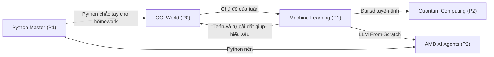

# Lộ trình tổng 5 khóa (cập nhật 2026-10-10)

> Một trang để điều phối 5 khóa đang học song song: khóa nào ưu tiên, mỗi tuần bao nhiêu giờ, ngày nào học khóa nào, khóa nào hỗ trợ khóa nào, và mỗi ngày chọn việc ra sao. Nội dung chi tiết nằm trong lộ trình riêng của từng khóa (mục 9). Khi ngày học gợi ý trong lộ trình riêng trùng nhau, theo bảng tuần ở mục 4 của file này.

## 1. Năm khóa và vai trò

| Khóa | Ưu tiên | Vai trò | Hạn cứng đã biết |
| :--- | :--- | :--- | :--- |
| GCI World 2026 September | P0 | Khóa có chứng chỉ và hạn chót thật: phân tích dữ liệu, mô hình, đề xuất kinh doanh | Survey và homework mỗi thứ Năm 18:00 giờ VN (HW3 và survey Buổi 4: 22/10); Competition và Final Assignment công bố từ 29/10; buổi cuối 17/12 |
| Machine Learning | P1 | Học toán và tự cài đặt đúng chủ đề GCI của tuần đó, rồi đi tiếp deep learning, RL, LLM sau khi GCI xong | Không có hạn ngoài |
| Python Master | P1 | Luyện thi COS Pro (Bảng B); làm chắc Python nền cho mọi khóa khác | Chung kết cuộc thi có thể là 10/10/2026 theo README của bộ luyện thi (chưa xác minh); kỳ COS Pro tiếp theo chưa có ngày |
| Quantum Computing | P2 | Dự án dài hạn, giữ nhịp đều | Không có hạn ngoài |
| AMD AI Academy - AI Agents 101 | P2 | Ứng dụng LLM: agent, tool calling, MCP, an toàn | Không có hạn ngoài |

## 2. Nguyên tắc điều phối

1. **Hạn chót trước tiên.** Việc P0 còn dưới 72 giờ thì làm trước mọi thứ khác (quy tắc deadline trong `AGENTS.md`). Kiểm tra bằng `python pick_today.py` hoặc `roll_study.bat`.
2. **Mỗi ngày tối đa 2 khóa:** một buổi học sâu (45-90 phút) và một buổi nhẹ (ôn hoặc luyện ngắn). Đổi khóa liên tục trong ngày làm mất thời gian khởi động lại.
3. **Cộng hưởng trước, mới mẻ sau.** Tuần nào GCI học chủ đề gì thì Machine Learning đào sâu đúng chủ đề đó. Python Master làm chắc Python cho homework GCI. Đại số tuyến tính của ML dùng lại cho Quantum. Module LLM From Scratch của ML là nền cho AMD Agents. Bảng cụ thể ở mục 6.
4. **Chế độ duy trì khi GCI cao điểm** (29/10-17/12, Competition và Final Assignment chạy song song): Quantum và AMD còn khoảng 1 giờ/tuần, ưu tiên ôn giãn cách, không mở module nặng mới.
5. **Ôn giãn cách xuyên khóa:** Chủ Nhật dành 20 phút trả lời lại những câu "Tự kiểm tra" đã sai trong tuần, của mọi khóa.
6. **WIP = 5:** không mở khóa mới cho đến khi một khóa hoàn thành hoặc được tạm dừng có chủ đích (quy tắc trong `INDEX.md`).
7. **Trễ thì cắt phạm vi, không cộng dồn giờ:** một khóa trễ hơn 2 tuần thì bỏ phần "Thử thách" và dời cả lịch của khóa đó, không bù bằng cách học dồn.

## 3. Ngân sách thời gian theo giai đoạn

Giả định bạn có khoảng 14-16 giờ/tuần. Nếu ít hơn, cắt theo thứ tự: Quantum, AMD, Python Master, Machine Learning; không bao giờ cắt hạn chót GCI.

| Giai đoạn | GCI | Machine Learning | Python Master | Quantum | AMD | Tổng |
| :--- | :--- | :--- | :--- | :--- | :--- | :--- |
| I. 12/10-25/10 (GCI Buổi 5-6) | 5-6,5 giờ | 3 giờ | 2,5-3 giờ | 2 giờ | 1-2 giờ | khoảng 14-16 giờ |
| II. 26/10-20/12 (Competition và FA) | 8-10 giờ | 2 giờ | 2,5 giờ | 1 giờ | 1 giờ | khoảng 14,5-16,5 giờ |
| III. Từ 21/12 (GCI đã xong) | 0 | 5 giờ | 2 giờ | 3 giờ | 3 giờ | khoảng 13 giờ |

## 4. Tuần mẫu (nguồn quyết định ngày học)

Giữ đúng thứ tự và khoảng cách giữa các buổi của mỗi khóa; đổi ngày được, miễn không dồn quá 2 khóa vào một ngày.

**Giai đoạn I (đến 25/10)**

| Ngày | Buổi chính | Buổi phụ |
| :--- | :--- | :--- |
| Thứ Hai | Python Master, buổi A (60 phút) | AMD (30-60 phút) |
| Thứ Ba | Machine Learning, buổi A: lý thuyết đúng chủ đề GCI thứ Năm này (70 phút) | GCI: đọc trước slide buổi tới (30 phút) |
| Thứ Tư | Quantum (60 phút) | Python Master: ôn D+3 (15 phút) |
| Thứ Năm | GCI live 18:00-19:30, nộp survey ngay | Không |
| Thứ Sáu | GCI: làm lại notebook bài giảng (75 phút) | AMD (30 phút) |
| Thứ Bảy | GCI: homework (90 phút) | Machine Learning, buổi B: tự cài đặt rồi so với scikit-learn (95 phút) |
| Chủ Nhật | Python Master, buổi B (90 phút) | Quantum (60 phút) và ôn xuyên khóa (20 phút) |

**Giai đoạn II (26/10-20/12)**

| Ngày | Buổi chính | Buổi phụ |
| :--- | :--- | :--- |
| Thứ Hai | GCI Competition (90 phút) | Python Master, buổi A (60 phút) |
| Thứ Ba | Machine Learning, buổi A (50 phút) | Quantum (30 phút) |
| Thứ Tư | GCI Final Assignment (60 phút) | AMD (30 phút) |
| Thứ Năm | GCI live 18:00-19:30, nộp survey ngay | Không |
| Thứ Sáu | GCI: notebook và homework (90 phút) | Không |
| Thứ Bảy | GCI Competition hoặc FA (120 phút) | Machine Learning, buổi B (70 phút) |
| Chủ Nhật | Python Master, buổi B hoặc đề thi thử (90 phút) | Quantum hoặc AMD xen kẽ (60 phút) và ôn xuyên khóa (20 phút) |

Tuần nào Competition hoặc FA gấp: lấy thêm giờ từ buổi Quantum/AMD và phần "Thử thách" của các khóa khác.

**Giai đoạn III (từ 21/12)**

| Ngày | Buổi chính | Buổi phụ |
| :--- | :--- | :--- |
| Thứ Hai | AMD (60 phút) | Python Master (45 phút) |
| Thứ Ba | Machine Learning (90 phút) | Quantum (60 phút) |
| Thứ Tư | AMD (60 phút) | Python Master (45 phút) |
| Thứ Năm | Machine Learning (90 phút) | Quantum (60 phút) |
| Thứ Sáu | AMD (60 phút) | Dự phòng |
| Thứ Bảy | Machine Learning (120 phút) | Quantum (60 phút) |
| Chủ Nhật | Ôn xuyên khóa và nghi thức tuần (30 phút) | Nghỉ |

## 5. Mốc 10 tuần tới

Lấy từ lộ trình riêng của từng khóa. Hạn GCI có ghi "(suy ra)" là suy từ quy tắc 2 tuần; các khóa khác là hạn tự đặt.

| Tuần | GCI (P0) | Machine Learning | Python Master | Quantum | AMD Agents |
| :--- | :--- | :--- | :--- | :--- | :--- |
| 12-18/10 | Nộp HW3 trước 16/10; survey Buổi 3 trước 15/10 18:00; học Buổi 5 (15/10) | M1 + M2.1: hồi quy tuyến tính tự cài | M0 chẩn đoán (13/10); M1 | Cài môi trường; M1 | M0: `verify_labs.py` 4/4 |
| 19-25/10 | Học Buổi 6 (22/10); hạn HW3 và survey Buổi 4: 22/10 18:00 | M2.2 + M3.1: logistic, chọn ngưỡng | M1, M2 | M1: kata 001-004 | M1: Lab 1 |
| 26/10-01/11 | Buổi 7 (29/10); HW4 29/10 (suy ra); nộp baseline Competition trước 01/11 | M2.3: cây, LightGBM | M2, M3 | M1, M2: qsim `khoi_tao` | M1 xong: `my_react.py` |
| 02-08/11 | Buổi 8 (05/11); HW5 05/11 (suy ra) | M3.2: leakage, cross-validation | M3, M4: Nhóm 2 đạt 15/15 | M2 | M2 |
| 09-15/11 | Buổi 9 (12/11); EDA cho FA | M3.3a: Ridge, Lasso | Ôn X1; M5 | M2, M3 | M2 xong: `my_tools.py` |
| 16-22/11 | Buổi 10 (19/11); tuning Competition | M3.3b: tuning | M5, M6 | M3 | M3 |
| 23-29/11 | Buổi 11 (26/11); phân khúc khách hàng cho FA | M4.1: K-means, PCA | M6, M7: Nhóm 5 đạt 15/15 | M3 | Ôn 1; M4 |
| 30/11-06/12 | Buổi 12 (03/12); bản nháp FA chạy được | M5: chuỗi thời gian | M7; đề 2 từ 700 | M3 xong: qsim 15 passed | M4 |
| 07-13/12 | Buổi 13 (10/12); hoàn thiện FA | Ôn xen kẽ #1 | M8: đề 5 từ 750 | M4; ôn xen kẽ 1 | M4 xong; M5 |
| 14-20/12 | Buổi 14 (17/12); nộp bản cuối nếu hạn rơi vào đây | Chỉ ôn | M8: đề 6 từ 800 | M4 | M5 xong |

## 6. Bản đồ cộng hưởng giữa các khóa

| Tuần GCI | Chủ đề GCI | Machine Learning đào sâu cùng tuần |
| :--- | :--- | :--- |
| Buổi 5 (15/10) | Supervised learning | Hồi quy tuyến tính tự cài (normal equation, gradient descent) |
| Buổi 6 (22/10) | Model evaluation | Logistic regression, metric, ngưỡng theo chi phí |
| Buổi 7 (29/10) | Tutorial Competition và FA | Cây, Random Forest, boosting, LightGBM |
| Buổi 8 (05/11) | Feature engineering | Leakage, Pipeline, cross-validation |
| Buổi 11 (26/11) | Unsupervised learning | K-means, PCA tự cài |
| Buổi 12 (03/12) | Time series | Baseline naive, lag feature, `TimeSeriesSplit` |

Không học lặp: kết quả scikit-learn trong notebook GCI cùng tuần là "đáp án" để so bản tự cài của ML; bài cài k-NN của ML tính là một lượt ôn mẫu heap top-k của Python Master; video đại số tuyến tính xem một lần, ghi chú dùng chung cho ML và Quantum.

## 7. Mỗi ngày chọn học gì

1. Chạy `python pick_today.py` (hoặc nói với DeepTutor "Hôm nay học gì?"). Có hạn P0 dưới 72 giờ thì làm việc đó.
2. Nếu không, theo tuần mẫu ở mục 4 cho ngày hôm nay.
3. Mở lộ trình của khóa đó, xuống mục "Theo dõi tiến độ", chọn ô chưa đánh dấu đầu tiên và học theo vòng lặp 45-90 phút: gọi lại 5 phút, đặt đích, làm chủ động, đóng buổi bằng 3 dòng tóm tắt.
4. Xong DoD thì đánh dấu ô trong lộ trình và task tương ứng trong `TASKS.md` của khóa.

## 8. Nghi thức cuối tuần (Chủ Nhật, 20-30 phút)

- Đánh dấu tiến độ trong từng lộ trình; cập nhật `Checkpoint` và `Next Action` trong `ACTIVE_LEARNING.md`.
- Đọc Sổ lỗi của tuần; chọn 3 việc quan trọng nhất cho tuần tới.
- Xem Slack GCI (kênh #01 đến #04) để bắt hạn chót mới, ghi ngay vào `TASKS.md` của GCI.
- Khóa nào trễ hơn 2 tuần: áp nguyên tắc 7 ở mục 2.

## 9. Lộ trình chi tiết từng khóa

- GCI World 2026 September: [roadmap/ROADMAP.md](file:///D:/02_Learning_Knowledge/GCI_World_2026_September/roadmap/ROADMAP.md)
- Machine Learning: [Roadmaps/ROADMAP.md](file:///D:/02_Learning_Knowledge/Machine_Learning/Roadmaps/ROADMAP.md)
- Python Master: [Roadmaps/ROADMAP.md](file:///D:/02_Learning_Knowledge/Python_Master/Roadmaps/ROADMAP.md)
- Quantum Computing: [Roadmaps/ROADMAP.md](file:///D:/02_Learning_Knowledge/Quantum_Computing/Roadmaps/ROADMAP.md)
- AMD AI Academy - AI Agents 101: [04_Roadmaps/ROADMAP.md](file:///D:/02_Learning_Knowledge/AMD_AI_Academy_AI_Agents_101/04_Roadmaps/ROADMAP.md)
